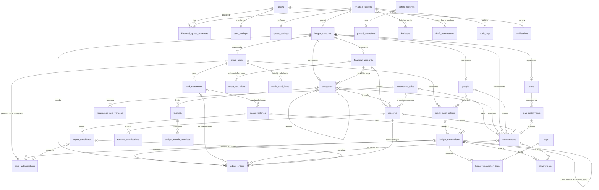

# Documento Mestre v1.0 — [Nome do App]

**Especificação de produto, modelo financeiro e arquitetura**

[Nome do App] é um nome provisório. Quando o nome definitivo for escolhido, a troca deve ser feita por uma alteração registrada editorial, que não muda nenhuma regra.

## Controle do documento

| Campo | Valor |
|---|---|
| Documento | Documento Mestre do [Nome do App] |
| Versão | 2.0 |
| Data | 02/10/2026 |
| Status | Baseline congelada |
| Produto | Aplicativo de finanças pessoais [Nome do App] (nome provisório) |
| Abrangência | Produto, modelo financeiro, aplicação e arquitetura, Fases 1 a 6 |
| Referências fixas | Moeda BRL; fuso America/Sao_Paulo; dias úteis bancários (sem sábados, domingos, feriados nacionais brasileiros e segunda e terça de Carnaval) |
| Aprovação | Proprietário do produto |
| Repositório de código | Novo e separado, criado depois da aprovação deste documento (D-025; ver 37) |
| Próxima versão | 2.1, na próxima alteração registrada (ver "Regra de mudança") |

## Como usar este documento

### Estrutura

| Parte | Seções | Conteúdo | Leitura principal |
|---|---|---|---|
| Parte I — Produto | 1 a 5 | Visão, público, princípios, vocabulário oficial, módulos com a fase de entrega e o que fica fora da v1 | Todos |
| Parte II — Modelo financeiro | 6 a 21 | Regras normativas do motor: sinais, contas, transações, cartões, Agenda, estornos, consumo e caixa, orçamentos, reservas, Livre para gastar, previsão, patrimônio, Saúde Financeira, importação, fechamento e moedas | Quem implementa e testa o motor financeiro |
| Parte III — Aplicação | 22 a 29 | Telas, tela inicial, fluxos, relatórios, notificações, PWA, experiência e espaços compartilhados | Quem desenha e implementa a interface |
| Parte IV — Arquitetura | 30 a 40 | Stack, organização do código, modelo de dados, integridade no PostgreSQL, serviços, segurança e LGPD, testes, ambiente, roadmap, gestão de mudanças e decisões em aberto | Quem implementa e mantém o sistema |
| Apêndice A — Catálogo de invariantes | — | Enunciado, condições e forma de teste de cada INV | Testes |
| Apêndice B — Casos de teste numéricos | — | Passo a passo, com valores conferidos, de cada CT | Testes |
| Apêndice C — Registro de decisões | — | Cada decisão D, com a decisão, o motivo, as alternativas rejeitadas e as seções afetadas | Todos |

### Linguagem normativa

1. "Deve" indica obrigação; "não deve", proibição; "pode", permissão; "recomenda-se", preferência que admite exceção justificada.
2. Trechos marcados como "Exemplo" ou "Por quê" são explicativos. Exemplos do corpo que citam um CT reproduzem o caso do Apêndice B; os valores oficiais dos testes são sempre os do Apêndice B.
3. Os termos têm o sentido definido na seção 3. Usar um termo com outro sentido é defeito do documento.
4. Cada regra é escrita uma única vez, na seção do seu assunto. As outras seções a citam pelo número da seção ou pelo identificador.

### Numeração e referências

1. As seções são numeradas de 1 a 40, em sequência única entre as partes. Subseções seguem o formato 15.3, e regras, o formato 15.3.2.
2. "Ver 15" remete à seção 15; "ver 15.3", à subseção.
3. Partes e apêndices são citados pelo título: "Parte II — Modelo financeiro", "Apêndice A — Catálogo de invariantes".

### Identificadores

| Prefixo | Significado | Formato e áreas | Catálogo |
|---|---|---|---|
| INV | Invariante: propriedade que deve valer depois de qualquer operação | INV-<ÁREA>-NNN; áreas LEDGER, CARD, AGENDA, REC, IMPORT, LFG (com as subáreas LFG-ESS, LFG-CARD e LFG-INSTALL), GOAL, BUDGET, REPORT, SYNC | Apêndice A |
| CT | Caso de teste numérico determinístico | CT-<ÁREA>-NNN; áreas LFG, GOAL, CARD, AGENDA, REC, REPORT, HEALTH, IMPORT, FX, ADJ, INV, LOAN, PL, SYNC. Em CT, a área INV significa investimentos, e não invariantes | Apêndice B |
| D | Decisão congelada | D-NNN (nesta versão, D-001 a D-031) | Apêndice C |
| ALT | Alteração registrada da especificação | ALT-NNN | Registro de alterações |

1. Um identificador nunca é reutilizado nem renumerado. Um item retirado continua no catálogo, marcado como revogado ou substituído e com a ALT que o retirou.
2. Toda regra do modelo financeiro deve citar os INV e CT que a verificam. Todo INV e todo CT deve ser verificado por teste automatizado (ver 36).

### Convenções

1. No texto, os valores aparecem em R$, com ponto de milhar e vírgula decimal (R$ 1.260,00). No banco de dados, aparecem em centavos inteiros (126000) (ver 32).
2. As partidas são escritas como "Conta +X / Conta −Y", na convenção de sinais da seção 6: ativos e despesas aumentam com "+"; passivos, receitas e patrimônio aumentam com "−". Toda transação soma zero.
3. As datas seguem o formato DD/MM/AAAA. Cada exemplo informa qual é o dia de "hoje" e, quando o dia da semana importa, informa também o dia da semana.
4. Nomes de bancos e de pessoas nos exemplos são só ilustração.
5. Nomes em `formato de código` são tabelas e colunas do modelo de dados (ver 32).

### Precedência

1. Quando duas passagens divergem, há um defeito no documento, que deve ser corrigido por alteração registrada.
2. Até a correção, prevalece, nesta ordem: a decisão do Apêndice C; o invariante do Apêndice A; a regra da seção do assunto; a menção em outra seção; o exemplo.

## Regra de mudança

1. A partir desta versão, toda mudança relevante deve virar alteração registrada da especificação. Nenhuma mudança pode ser silenciosa, nem no documento nem no código.
2. É relevante qualquer mudança em: regra, fórmula ou definição; invariante ou caso de teste; decisão; tabela ou coluna fixada; fase de entrega; termo do vocabulário; escopo (seção 5).
3. Cada alteração registrada deve conter: o identificador ALT-NNN; a data; a versão resultante; as seções afetadas; a descrição; o motivo; os identificadores D, INV e CT criados, alterados ou revogados; o impacto em dados, código e testes.
4. Uma decisão congelada não é editada nem reaberta. Para mudá-la, cria-se uma nova decisão D-NNN que declara qual decisão substitui. A anterior continua no Apêndice C, marcada como substituída.
5. Versões do documento: 1.x para alterações que mantêm todas as decisões vigentes, inclusive as editoriais; 2.0 quando uma decisão congelada é substituída por uma nova D-NNN. A versão atual é 1.0, e a próxima alteração registrada gera a 1.1. As versões do aplicativo (releases) têm numeração própria, que não se confunde com a do documento: 0.x até o fim da Fase 5 (0.1 = Fase 1, 0.2 = Fase 2, …) e 1.0.0 para o produto v1, ao fim da Fase 5 (ver 2.2.1).
6. Correções de redação que não mudam o sentido podem ser agrupadas numa alteração editorial, que também é registrada com identificador ALT-NNN.
7. Uma implementação que diverge do documento é um defeito: ou se corrige o código, ou se registra antes a alteração da especificação. O fluxo de proposta, revisão e aprovação está em 39.

## Registro de alterações

| Versão | Data | Alteração | Descrição | Seções | Identificadores |
|---|---|---|---|---|---|
| 1.0 | 02/10/2026 | — (baseline) | Baseline inicial: consolida as regras financeiras e as decisões congeladas e define a estrutura de 40 seções e 3 apêndices | Todas | D-001 a D-031; catálogo INV; casos CT |
| 2.0 | 05/10/2026 | ALT-001 | Troca da stack: D-032 substitui D-020. O app passa a ser a evolução do app de finanças existente: React + TypeScript (PWA no GitHub Pages e APK Android) com Supabase (PostgreSQL, Auth, RLS, pg_cron). Regras financeiras, invariantes e casos de teste não mudam. Onde a Parte IV citar Laravel, Inertia, PHP, Pest ou serviços PHP, vale o arquivo ALT-001-ARQUITETURA-SUPABASE.md até a Parte IV ser reescrita | 30, 31, 33 a 37 | D-032 (substitui D-020) |

# Parte I — Produto

## 1. Visão do produto

### 1.1 Proposta

O [Nome do App] é uma central financeira pessoal. Ele reúne num só lugar contas, cartões de crédito, contas a pagar e a receber, valores com pessoas, orçamentos, metas, provisões, dívidas, investimentos e bens, e transforma esses registros em respostas simples sobre o dinheiro do usuário.

**1.1.1** O aplicativo deve registrar fatos financeiros, prever o que vai acontecer e apoiar o planejamento. Ele não deve movimentar dinheiro (ver 2.2.5).

**1.1.2** Todo número exibido deve vir do registro de fatos (Ledger, ver 8), do registro de previsões (Agenda, ver 10) e das definições de planejamento do usuário. Nenhum saldo pode ser digitado diretamente.

**1.1.3** Por dentro, o modelo é contábil (partidas dobradas, D-002); a experiência do usuário não é (ver 2.5).

### 1.2 As quatro perguntas

O produto existe para responder a quatro perguntas:

| Pergunta | Resposta do aplicativo | Onde | Fase |
|---|---|---|---|
| Quanto eu tenho? | Saldo em contas (dinheiro de uso imediato) e Patrimônio líquido (tudo o que se tem menos tudo o que se deve) | Início, Contas, Patrimônio | 1 (Saldo em contas); 5 (Patrimônio líquido e evolução) |
| Quanto eu devo e vou receber? | Faturas e saldo devedor dos cartões, compromissos a pagar e a receber, saldos com pessoas, empréstimos e financiamentos | Cartões, Agenda, Pessoas, Patrimônio | 1 (cartões, pessoas, passivo genérico); 2 (Agenda); 5 (cronogramas) |
| Para onde meu dinheiro está indo? | Consumo por categoria (por competência), fluxo de caixa (por data) e Saúde Financeira | Lançamentos, Relatórios | 1 (extratos e busca); 4 (relatórios e Saúde Financeira) |
| Quanto eu realmente posso gastar? | Livre para gastar | Início, Planejamento | 2 (versão inicial); 4 (completo) |

**1.2.1** A tela inicial deve levar diretamente à resposta de cada pergunta a partir da fase em que o recurso existe (ver 23).

**1.2.2** Cada resposta deve usar um dos saldos oficiais ou relatórios definidos neste documento (ver 3.7 e 25). O aplicativo não deve criar números alternativos para a mesma pergunta.

### 1.3 Diferencial: Livre para gastar

O saldo do banco não diz quanto se pode gastar. Parte dele já tem destino (aluguel, fatura, IPVA), parte precisa cobrir o essencial até a próxima renda, e o cartão de crédito adia a saída do dinheiro sem adiar o gasto. O Livre para gastar responde "quanto eu realmente posso gastar?" com um único número.

**1.3.1** O Livre para gastar deve ser o número principal da tela inicial a partir da Fase 2 (ver 23).

**1.3.2** O número vale para o ciclo atual: de hoje até a véspera da próxima renda principal. Sem renda principal, vale até o fim do ciclo financeiro escolhido pelo usuário (D-010).

**1.3.3** O cálculo parte do Saldo em contas e soma as entradas previstas no ciclo. Depois desconta: o que já está comprometido (contas da Agenda, inclusive as vencidas, pagamentos agendados, faturas do cartão e valores a pagar a pessoas); o dinheiro reservado para metas e provisões; a reserva mínima de segurança; e o que ainda falta gastar no essencial. As entradas previstas sempre somam (INV-LFG-006). A fórmula e as regras completas estão em 15.

**1.3.4** O cartão de crédito muda a data em que o dinheiro sai, não o fato de o gasto existir. Uma compra no cartão reduz o Livre no momento da compra. A exceção é a compra essencial dentro do orçamento, que só usa dinheiro que já estava reservado para ela (INV-LFG-CARD-001, INV-LFG-ESS-001). A frase oficial sobre o cartão está em 15 (D-011).

**1.3.5** O Livre mede quanto se pode consumir no ciclo, não quanto se pode assumir de dívida. Ao lado dele, o aplicativo deve mostrar o indicador de parcelas futuras (D-028).

**1.3.6** O número do topo é o do cenário conservador. O cenário esperado aparece como "se as receitas previstas entrarem". Não existe cenário otimista (D-014; ver 16).

**1.3.7** Um resultado negativo deve aparecer negativo, nunca zerado, junto com a indicação do que deixa de ser coberto (ver 15).

Exemplo (CT-LFG-001). Hoje é segunda-feira, 12/10/2026 (feriado), e a renda principal (salário) cai todo dia 5. O horizonte vai de 12/10/2026 a 04/11/2026.

| Componente | Valor (R$) |
|---|---|
| Saldo em contas (Nubank 4.000,00 + Inter 1.500,00 + carteira 100,00) | + 5.600,00 |
| Entradas previstas confirmadas no horizonte | + 0,00 |
| Comprometido: aluguel (20/10) 1.500,00 + energia estimada, com "≈" na tela (vencimento nominal 10/10, efetivo 13/10; em dia; sem valores reais no histórico, vale o próprio devido estimado) 220,00 + internet (22/10) 110,00 | − 1.830,00 |
| Comprometido: Cartão B, com a fatura fechada (vence 15/10) de 1.300,00 e a fatura aberta inteira (vence 16/11, fora do horizonte) de 640,00 | − 1.940,00 |
| Reservado: meta Viagem 600,00 + provisão IPVA 400,00 | − 1.000,00 |
| Reserva mínima de segurança | − 300,00 |
| Necessidade dos essenciais: mercado 380,00 (outubro: orçamento 900,00 − gasto 520,00) + 120,00 (novembro: 900,00 × 4/30) − 200,00 de VA | − 300,00 |
| **Livre para gastar (conservador)** | **= 230,00** |
| Freela de 800,00 previsto para 28/10, ainda não confirmado (condicional) | + 800,00 |
| **Livre para gastar (esperado)** | **= 1.030,00** |

O exemplo mostra dois comportamentos:

- Compra de R$ 100,00 no mercado, no cartão: o gasto do mês sobe para R$ 620,00, a necessidade dos essenciais cai para R$ 200,00 e o Comprometido sobe R$ 100,00. O Livre continua em R$ 230,00 (INV-LFG-ESS-001).
- Compra de R$ 300,00 de lazer, no cartão: o Comprometido sobe R$ 300,00 e o Livre vai a −R$ 70,00. Compromissos, essenciais, provisões e metas continuam cobertos; a falta atinge a reserva mínima (INV-LFG-CARD-001; ver 15).

### 1.4 Conceito: Registrar → Organizar → Entender → Prever → Planejar

| Etapa | Pergunta do usuário | O que o aplicativo oferece | Camada | Fases |
|---|---|---|---|---|
| Registrar | O que aconteceu? | Lançamento rápido, modelos, cartões e faturas, transferências, importação de extratos e conciliação | Ledger | 1, 3 |
| Organizar | Como isso se classifica? | Categorias, tags, competência, pessoas e vínculos com compromissos, metas e provisões | Ledger e Agenda | 1, 2, 4 |
| Entender | Para onde foi o dinheiro? | Consumo por categoria, fluxo de caixa, Saúde Financeira e evolução do patrimônio | Ledger | 4, 5 |
| Prever | O que vai acontecer? | Agenda, recorrências, calendário, lançamentos agendados, previsão de saldo e cenários | Agenda | 2 |
| Planejar | O que posso fazer? | Livre para gastar, orçamentos, metas, provisões e indicador de parcelas futuras | Planejamento | 2, 4 |

**1.4.1** Cada funcionalidade da seção 4 deve servir a pelo menos uma etapa. Uma proposta que não sirva a nenhuma etapa não pertence ao produto.

**1.4.2** Cada etapa depende de as anteriores estarem corretas. Por isso o motor financeiro, que garante o registro correto, é construído antes das telas de análise e de planejamento (ver 2.4 e 38).

### 1.5 As três camadas

| Camada | Pergunta | O que contém | O que nunca faz |
|---|---|---|---|
| Ledger | O que aconteceu? | Só fatos financeiros reais, em partidas dobradas: compras, pagamentos, recebimentos, transferências, estornos, ajustes e saldos iniciais | Guardar previsões, rascunhos ou estados intermediários (D-003) |
| Agenda | O que vai acontecer? | Compromissos a pagar e a receber, regras recorrentes e suas ocorrências, e a fatura do cartão como item automático | Alterar saldos, consumo ou patrimônio (INV-AGENDA-005) |
| Planejamento | O que posso fazer com meu dinheiro? | Livre para gastar, orçamentos, metas, reservas, provisões, previsão de saldo, cenários e Saúde Financeira | Movimentar dinheiro: reservar não altera saldos nem patrimônio (INV-LEDGER-010) |

Três elementos atravessam as camadas: espaços financeiros, auditoria e documentos e anexos.

**1.5.1** Só as transações do Ledger alteram saldos, consumo e patrimônio.

**1.5.2** Um compromisso da Agenda só se realiza por uma transação do Ledger cujas partidas apontam para ele (D-007). A situação do compromisso é consequência desse vínculo e nunca é marcada à mão (D-008).

**1.5.3** O Planejamento guarda só definições e decisões do usuário: orçamentos, metas, provisões, aportes e liberações. Todo valor resultante é calculado a partir do Ledger e da Agenda.

**1.5.4** Os elementos transversais valem para as três camadas. Todo registro pertence a um espaço financeiro (D-005), toda mutação é auditada (ver 20), e os documentos formam um domínio próprio, ligado aos registros sem alterá-los.

Exemplo (CT-AGENDA-003): uma conta de energia passando pelas três camadas.

```
Agenda        Energia — a pagar — estimado — valor devido R$ 220,00
Ledger        Pagamento: Energia +217,83 / Banco −217,83 (soma zero);
              a partida de Energia aponta para o compromisso
Agenda        valor pago R$ 217,83 ≥ 90% de R$ 220,00 (R$ 198,00)
              → quitado; o valor devido passa a R$ 217,83
Planejamento  o compromisso sai do Comprometido e o Saldo em contas cai R$ 217,83;
              o Livre muda só pela diferença entre o valor que considerava e o valor pago (INV-LFG-001)
```

## 2. Público, escopo e princípios

### 2.1 Público

**2.1.1** O usuário principal é uma pessoa física no Brasil que usa conta corrente ou conta de pagamento, cartão de crédito, Pix e boleto. Ela tem renda mensal (salário, pró-labore ou aposentadoria) ou renda variável, e pode ter VR/VA, investimentos, bens e dívidas.

**2.1.2** Uso pessoal primeiro: a v1 é desenhada para o titular do projeto usar no dia a dia. Quando a simplicidade para um usuário conflitar com a generalidade, prevalece a simplicidade, desde que o modelo de dados não precise ser refeito depois.

**2.1.3** Pronto para família: desde a Fase 1, todo registro pertence a um espaço financeiro com chaves compostas (D-005). O compartilhamento com outras pessoas entra na Fase 6 sem migração de dados (ver 29).

**2.1.4** Pronto para virar produto: isolamento entre espaços, autenticação, auditoria e regras de privacidade valem desde a Fase 1. Abrir o aplicativo ao público não tem fase definida (ver 5.3).

**2.1.5** Quem não tem renda principal recorrente (autônomo, freelancer) usa o ciclo financeiro padrão (D-010).

### 2.2 Escopo da v1

**2.2.1** A v1 é o produto entregue ao fim da Fase 5: fundação, Agenda e Livre, importação, planejamento e patrimônio. A Fase 6 (ecossistema) vem depois da v1, e a arquitetura da v1 deve estar preparada para ela sem migração de dados (ver 5 e 38).

**2.2.2** Cada fase deve entregar um produto que funcione por si, sem depender de uma fase posterior.

**2.2.3** Moeda: a v1 trabalha em real (BRL) (D-018). Compras em moeda estrangeira são registradas em reais, com a moeda, o valor original e a cotação como informação complementar (ver 21). Contas em moeda estrangeira ficam para a Fase 6.

**2.2.4** Calendário: dias úteis são dias úteis bancários, que excluem sábados, domingos, feriados nacionais brasileiros e a segunda e a terça de Carnaval; feriados locais podem ser cadastrados pelo usuário (D-031; ver 8.9). Cada espaço tem fuso horário, por padrão America/Sao_Paulo.

**2.2.5** O aplicativo registra, organiza, prevê e planeja. Ele não executa pagamentos, transferências bancárias nem aplicações. Na v1, os dados entram por digitação (Fase 1) e por arquivos OFX e CSV (Fase 3). Open Finance só entra na Fase 6.

**2.2.6** Plataforma: navegador de celular e de computador, com o aplicativo instalável como PWA (Fase 1). O aplicativo nativo entra na Fase 6.

**2.2.7** Idioma: português do Brasil, com formatos brasileiros de data e de valor.

### 2.3 Online-first

**2.3.1** O aplicativo deve funcionar no navegador e poder ser instalado como PWA (manifest, service worker e cache limitado) (D-019, D-020).

**2.3.2** O servidor é a fonte de verdade, e todo cálculo financeiro acontece nele.

**2.3.3** Sem conexão, o aplicativo deve permitir só a criação de lançamentos rápidos. Eles entram numa fila e são enviados quando a conexão volta (Fase 3). Editar, cancelar, conciliar e consultar cálculos exigem conexão (ver 27).

**2.3.4** Um dado exibido sem conexão deve mostrar a hora da última atualização ("atualizado às hh:mm") e nunca deve parecer atual.

**2.3.5** Reenviar um item da fila não pode duplicar o lançamento (INV-SYNC-001; CT-SYNC-001).

### 2.4 Motor antes da interface

**2.4.1** A ordem de construção é: regras, modelo de dados, integridade no banco, testes das regras e só então telas (D-025; ver 39).

**2.4.2** Cada regra financeira deve estar coberta por invariante (Apêndice A) ou caso de teste (Apêndice B), automatizado e passando, antes que a tela que a expõe seja construída (D-024; ver 36).

**2.4.3** A interface não deve calcular valores financeiros. Ela deve exibir os valores que o motor calculou no servidor. A única exceção é a soma dos itens pendentes de envio na tela sem conexão (ver 27).

**2.4.4** Um mesmo conceito deve produzir o mesmo número em todas as telas, relatórios e exportações, porque todos leem as mesmas partidas válidas (INV-LEDGER-003).

### 2.5 Não parecer sistema contábil

**2.5.1** A interface não deve mostrar os termos internos listados em 3.1.2. Ela mostra contas, cartões, categorias, pessoas e valores com sinal natural.

**2.5.2** A tela inicial deve ser visual e simples, com as respostas às quatro perguntas. O usuário só aprofunda quando quer: tocar num número abre o que o compõe (ver 2.8.3 e 23).

**2.5.3** Os termos de crédito usados pelo mercado (fatura, rotativo, parcelamento, limite) são permitidos, porque são a linguagem do usuário.

**2.5.4** A simplicidade é só de apresentação: as partidas dobradas continuam obrigatórias por dentro (D-002).

### 2.6 Lançamento rápido

**2.6.1** Registrar uma despesa comum deve levar no máximo 3 toques a partir da tela inicial, usando um modelo de lançamento: (1) botão de novo lançamento; (2) modelo, por exemplo "Almoço"; (3) confirmar.

**2.6.2** Valores padrão: a data é hoje, no fuso do espaço; a competência segue a regra de 8 (no cartão, o mês da compra); a conta ou o cartão é o do modelo.

**2.6.3** O modelo de lançamento guarda descrição, valor, categoria e conta ou cartão. O valor pode ser editado na confirmação.

**2.6.4** O aplicativo deve sugerir a categoria a partir da descrição, com base no histórico do espaço. O usuário confirma ou troca a sugestão. Regras automáticas definidas pelo usuário só entram na Fase 6.

**2.6.5** O lançamento rápido passa pelo mesmo serviço único de todos os lançamentos e obedece a todas as regras (INV-LEDGER-001). No cartão, a fatura é sugerida como em 9. Os detalhes de interface estão em 27.

### 2.7 Nada financeiro desaparece

**2.7.1** Nenhum registro financeiro (transação, compromisso, fatura, reserva, lote, versão do retrato mensal) deve ser apagado fisicamente. O cancelamento é feito por status (D-003, D-016). Exceção: na edição em mês aberto, as partidas substituídas saem de `ledger_entries` e o conjunto anterior fica integralmente na auditoria (8.6.2). As ocorrências futuras não tocadas removidas ao encerrar ou excluir uma regra recorrente não são apagadas fisicamente: recebem exclusão lógica (`commitments.deleted_at`) e saem das consultas (10.13.7 a 10.13.9).

**2.7.2** No mês aberto, corrigir é direto: o usuário edita valor, categoria ou data sem precisar criar um estorno, e a versão anterior fica na auditoria. Exemplo: R$ 72,00 digitado no lugar de R$ 27,00 (D-016). A exceção é a transação com partida em fatura fechada, que não é editada nem cancelada (salvo as exceções de 8.2) e é corrigida por uma transação nova (ver 9).

**2.7.3** Num mês fechado, qualquer mudança exige reabrir o mês, com motivo (ver 20).

**2.7.4** O que falta pagar ou receber nunca some. Um recebimento parcial deixa o restante em aberto até uma decisão explícita do usuário. Exemplo: um adiantamento de R$ 2.000,00 de um salário de R$ 5.000,00 deixa R$ 3.000,00 a receber (CT-AGENDA-004).

**2.7.5** Itens da fila recusados pelo servidor vão para "Não enviados", com o motivo, e nunca são descartados automaticamente (ver 27.8 e 27.9).

**2.7.6** Desfazer um lote de importação cancela as transações do lote, sem apagá-las (INV-IMPORT-003). Transações com partidas em fatura fechada só são desfeitas quando se enquadram nas exceções de 8.2; as demais ficam, e o aplicativo avisa quais precisam de correção manual (ver 19).

**2.7.7** A única exceção são os dados pessoais do titular, tratados conforme a LGPD (ver 35). Os registros financeiros de espaços compartilhados permanecem, com pseudonimização.

### 2.8 Rastreabilidade

**2.8.1** Toda mutação deve gerar um registro de auditoria com quem fez, quando (em UTC), o que mudou (antes e depois) e o motivo, quando exigido (ver 20).

**2.8.2** Fatos relacionados devem estar ligados entre si:
- estorno ou reembolso à compra;
- partida de pagamento ao compromisso;
- parcela à compra (k/N);
- transação importada ao lote e à linha;
- transação reversa à original;
- repasse no espaço de origem ao aporte no espaço de destino.

**2.8.3** Todo número agregado na tela deve poder ser aberto até as partidas, compromissos ou definições que o compõem. O Livre mostra cada componente, a fatura mostra suas partidas e o saldo da conta mostra o extrato.

**2.8.4** Rótulos como "estornada", "parcialmente reembolsada", "quitado" e "vencido" são calculados a partir dos vínculos e nunca são campos editados (INV-AGENDA-004; ver 11).

**2.8.5** Um valor confirmado nunca é recalculado em silêncio, como a conversão de moeda já confirmada (ver 21).

### 2.9 Privacidade

**2.9.1** Os dados financeiros pertencem ao usuário e ao espaço. O aplicativo não deve compartilhá-los com terceiros nem usá-los para publicidade.

**2.9.2** De terceiros cadastrados como pessoas, guarda-se só o apelido.

**2.9.3** O modo privacidade oculta os valores na tela com um toque (ver 28).

**2.9.4** O cache do aparelho guarda só o espaço ativo, sem anexos, e é apagado quando o usuário sai da conta (ver 27).

**2.9.5** O usuário pode exportar os dados do espaço em CSV a qualquer momento (Fase 1).

**2.9.6** Os dados de um espaço nunca aparecem em outro (INV-LEDGER-002). Segurança e LGPD estão detalhadas em 35.

## 3. Vocabulário oficial

### 3.1 Regras de uso do vocabulário

**3.1.1** Os termos desta seção têm o sentido aqui definido em todo o documento e na interface. Os nomes técnicos correspondentes no código e no banco estão em 32.

**3.1.2** Termos internos, que não devem aparecer na interface: ledger, partida, conta contábil, classe de conta, conta de sistema, transação técnica, e "débito" e "crédito" no sentido contábil. Na interface, a transação se chama "lançamento". "Débito" como forma de pagamento (cartão de débito) e "crédito" como saldo a favor no cartão são permitidos.

**3.1.3** A palavra "disponível" não deve ser usada como conceito: nem no documento, nem no código, nem na interface (D-021). Quanto o usuário tem e quanto pode gastar são respondidos só pelos quatro saldos oficiais (3.7).

**3.1.4** "Comprometido" designa só o componente do Livre para gastar. Para o cartão, usam-se "limite utilizado" e "limite livre".

**3.1.5** A interface mostra os valores com sinal natural: gasto como valor positivo de despesa, dívida do cartão como "você deve R$ X" e saldo com pessoa como "a receber" ou "a pagar" (ver 6).

**3.1.6** "Data", sem qualificação, significa data financeira. "Mês" significa mês de competência em consumo, orçamento e indicadores, e mês da data financeira em caixa, saldos e patrimônio (ver 12).

**3.1.7** Os rótulos de produto para natureza, direção e certeza são definidos no glossário de interface (ver 28.3.3), sem mudar o sentido desses termos.

### 3.2 Estrutura e livro-caixa

| Termo | Definição | Ver |
|---|---|---|
| Espaço financeiro | Unidade dona de todos os dados financeiros: contas, cartões, categorias, transações, compromissos, orçamentos e reservas. Tem fuso horário, moeda-base e membros. Nenhuma transação ou referência atravessa espaços (INV-LEDGER-002). | 29, 32 |
| Moeda-base | Moeda em que as partidas de um espaço são registradas e somam zero. Na v1, sempre o real (BRL) (D-018). | 21 |
| Ledger (livro-caixa) | Registro de todos os fatos financeiros realizados no espaço, em partidas dobradas. É a camada "o que aconteceu?". Termo interno. | 8 |
| Planejamento | Camada "o que posso fazer com meu dinheiro?": Livre para gastar, orçamentos, metas, reservas, provisões, previsão, cenários e Saúde Financeira. Lê o Ledger e a Agenda e não movimenta dinheiro (D-001). | 13 a 18 |
| Transação | Unidade do Ledger: um cabeçalho com tipo (lista fechada em 32.3), data financeira, competência, descrição e status, mais duas ou mais partidas que somam zero (INV-LEDGER-001). Pode estar ligada a outra transação (estorno, pagamento devolvido, correção, rotativo, parcelamento da fatura, antecipação), sempre por um único vínculo com o tipo da relação. Criar, editar e cancelar passam por um único serviço. Na interface, chama-se "lançamento". | 8 |
| Lançamento | Nome, na interface, de uma transação e do ato de registrá-la: despesa, receita, transferência, pagamento ou recebimento. | 8, 24 |
| Partida | Linha de uma transação: um valor em centavos, com sinal, numa conta contábil. Pode apontar para um compromisso, uma fatura e um número de parcela (k/N) e, se for partida de despesa ou de bem, para uma reserva. Pode ter competência própria, que prevalece sobre a da transação. Termo interno. | 6, 8 |
| Conta contábil | Conta do Ledger (`ledger_accounts`), com classe, natureza do saldo (devedora ou credora), moeda e indicação de se aceita lançamentos e de se está ativa. Toda conta financeira, cartão, categoria-folha, pessoa e empréstimo tem exatamente uma. Termo interno. | 6 |
| Classe de conta | Tipo da conta contábil: ativo (`asset`), passivo (`liability`), receita (`income`), despesa (`expense`) ou patrimônio (`equity`). Termo interno. | 6 |
| Convenção de sinais | Ativos e despesas aumentam com "+"; passivos, receitas e patrimônio aumentam com "−". Toda transação soma zero (D-002). | 6 |
| Conta de sistema | Conta contábil de patrimônio criada em cada espaço e que não aparece como categoria: Abertura, Ajustes de saldo e Resultado de investimentos. Termo interno. | 6 |
| Status da transação | Efetivada (`posted`) ou cancelada (`cancelled`). O Ledger não tem nenhum outro estado (D-003). A transação cancelada continua registrada, mas deixa de produzir efeitos (INV-LEDGER-004). | 8 |
| Rascunho | Lançamento incompleto guardado fora do Ledger (`draft_transactions`), sem efeito em saldos, até ser efetivado ou descartado. | 8 |
| Transferência | Transação entre duas contas próprias. Não altera patrimônio líquido, receitas nem despesas (INV-LEDGER-005). Aplicar e resgatar um investimento pelo valor principal são transferências. | 8 |
| Lançamento dividido | Transação com mais de uma partida de despesa ou de receita: várias categorias, ou uma parte própria e uma parte de outra pessoa. | 8 |
| Transação técnica | Transação gerada pelo motor, sem efeito no consumo, para mover saldo entre faturas do mesmo cartão: o rotativo (`card_rollover`) e o transporte de crédito para a fatura seguinte (`card_credit_carry`). O serviço a recalcula sempre que um pagamento muda, e o usuário não a edita (ver 8.2). Termo interno. | 9 |
| Centavos | Unidade de valor do Ledger: inteiro em centavos da moeda-base (`amount_cents BIGINT`). O valor digitado é convertido de texto para centavos sem passar por número decimal. | 8, 32 |
| dividir() | Função única que reparte um total em partes inteiras de centavos pelo método do maior resto. O desempate é sempre o mesmo: na 1ª parcela ou, na divisão entre pessoas, para quem pagou. As partes somam exatamente o total (INV-LEDGER-008). Exemplo: R$ 100,00 em 3 = 33,34 + 33,33 + 33,33 (CT-AGENDA-007). | 8 |
| Auditoria | Registro permanente de cada mutação: quem fez, quando (UTC), o que mudou (antes e depois) e o motivo, quando exigido (`audit_logs`). | 20 |

### 3.3 Contas, categorias e pessoas

| Termo | Definição | Ver |
|---|---|---|
| Conta financeira | Entidade de produto que representa onde o dinheiro está (`financial_accounts`): conta corrente, conta de pagamento, carteira, dinheiro, VR/VA, investimento ou bem. Tem exatamente uma conta contábil de ativo. | 7 |
| Saldo da conta | Saldo de uma conta individual, calculado pela soma das suas partidas (INV-LEDGER-003). Não confundir com Saldo em contas. | 7 |
| Liquidez | Classificação de toda conta de ativo que define em quais saldos ela entra: caixa (`cash`), benefício (`benefit`), investimento (`investment`), pessoa (`person`) e bem (`property`). O usuário pode mudar a liquidez de uma conta financeira. | 7 |
| Conta caixa | Conta de liquidez caixa: conta corrente, conta de pagamento, carteira e dinheiro. Só ela compõe o Saldo em contas. | 7 |
| Benefício (VR/VA) | Conta de liquidez benefício (vale-refeição, vale-alimentação), vinculada às categorias que paga. Não entra no Saldo em contas e só abate a necessidade dessas categorias (CT-LFG-008). | 7, 15 |
| Saldo do benefício | Saldo de uma conta de benefício, sempre exibido separado dos outros saldos. | 7 |
| Livre no benefício | Parte do saldo de VR/VA que passa da necessidade das categorias vinculadas no horizonte. É exibida à parte e nunca é somada ao Livre para gastar. | 15 |
| Investimento | Conta de liquidez investimento: CDB, ações, caixinha e, por padrão, poupança (D-022). Fica fora do Saldo em contas e entra no patrimônio. | 7, 17 |
| Bem | Conta de liquidez bem, como veículo ou imóvel. Só entra no patrimônio. | 17 |
| Reserva de emergência (marcação) | Marca aplicada a uma conta de investimento ou a uma meta para que ela entre no indicador "reserva de emergência em meses". | 18 |
| Empréstimo ou financiamento | Passivo de dívida. Na Fase 1, é um passivo genérico sem cronograma; na Fase 5, ganha cronograma de parcelas (`loans`, `loan_installments`). Empréstimo recebido não é receita. | 17 |
| Pessoa | Terceiro, identificado só pelo apelido, com quem o usuário tem valores a receber ou a pagar (`people`). Tem uma única conta contábil de saldo, de classe ativo e liquidez pessoa (D-026). | 7 |
| Saldo com pessoa | Saldo da conta de uma pessoa: positivo é a receber; negativo é a pagar. Receber de uma pessoa ou pagar a ela nunca é receita, despesa nem reembolso. Exemplo: restaurante de R$ 200,00 com metade de João = Restaurante +100 / Pessoa João +100 / Inter −200 (CT-AGENDA-006). | 7 |
| Categoria | Classificação de despesas e receitas (`categories`), com nome, ícone, cor, categoria-pai e, quando houver, papel de sistema. As categorias de despesa têm as marcas essencial, fixa ou variável e dedutível no IR; as de receita têm a classe de receita. Categoria não é conta contábil (D-004). | 7 |
| Categoria-folha | Categoria sem filhas. Só ela recebe lançamentos, e cada uma tem sua própria conta contábil (1:1). | 7 |
| Categoria-pai | Agrupador sem conta contábil. Seu valor é a soma das folhas. Quando uma folha vira pai, o aplicativo cria a filha "<Nome> (geral)", que herda a conta contábil e o histórico. | 7 |
| Categoria de sistema | Categoria com papel fixo (`system_role`), conforme a taxonomia única de 7.3.7: Encargos financeiros (despesa; todo custo de crédito; fora dos orçamentos de consumo); Impostos e tarifas (despesa; IR retido, inclusive no resgate de investimentos, IOF de compra internacional, tarifas bancárias e anuidade; entra nos orçamentos como qualquer categoria); Cashback (receita; fora da renda recorrente e dentro da renda da taxa de poupança); Benefícios (receita, recarga de VR/VA; dentro da taxa de poupança e fora da renda do comprometimento); Descontos obtidos (receita; fora da renda dos indicadores); e, na Fase 6, Repasse ao espaço (despesa) e Aporte de membro (receita), usadas na transferência entre espaços. 13º salário e férias não são categorias de sistema: são categorias de receita comuns, de classe extraordinária. | 7, 18 |
| Essencial | Marca da categoria, herdada pelo orçamento e que pode ser trocada nele, que indica gasto necessário. Não depende de a despesa ser fixa ou variável: mercado é essencial e variável; academia é fixa e não essencial. | 13 |
| Fixa ou variável | Marca da categoria de despesa usada para dividir as despesas de consumo pagas à vista ou por recorrência. Não se aplica a receitas. Parcelas de cartão e de dívidas ficam no grupo "Parcelas e dívidas" e nunca entram em "fixas". | 18 |
| Classe de receita | Classificação de cada categoria de receita (`income_class`): recorrente (`recurring`), extraordinária (`extraordinary`; 13º salário, férias e receitas eventuais), benefício (`benefit`), cashback (`cashback`) ou financeira (`financial`). A renda recorrente é a da classe recorrente. | 7, 18 |
| Dedutível no IR | Marca da categoria que inclui suas despesas no relatório de despesas dedutíveis do imposto de renda. | 25 |
| Tag | Marcador livre, aplicado à transação e independente da categoria, usado em filtros e relatórios (`tags`, `ledger_transaction_tags`). | 7 |
| Modelo de lançamento (favorito) | Lançamento pré-preenchido (descrição, valor, categoria, conta ou cartão) usado no lançamento rápido. Exemplo: "Almoço". | 27 |
| Lançamento rápido | Registro de uma despesa comum em até 3 toques a partir da tela inicial. | 2.6, 27 |

### 3.4 Datas, calendário e ciclo

| Termo | Definição | Ver |
|---|---|---|
| Data financeira | Dia em que o dinheiro se moveu ou, no cartão, dia da compra (`occurred_on`). Só o dia, sem hora, no fuso do espaço, e nunca muda por conversão de fuso. Usada em caixa, saldos e patrimônio. | 8 |
| Competência | Mês a que o fato pertence, gravado como o primeiro dia do mês. Toda transação tem uma competência padrão (`ledger_transactions.competence_month`): por padrão, o mês da data financeira; no cartão, o mês da compra. Uma partida pode ter competência própria (`ledger_entries.competence_month`), que prevalece sobre a da transação; a partida vinculada a um compromisso herda a competência dele. A competência efetiva de cada partida é a própria, se houver, ou a da transação. Usada em consumo, receitas, orçamento e indicadores (D-015). Exemplos: o salário de novembro pago em 30/10/2026 tem competência novembro (CT-REPORT-002); um único pagamento em 13/10/2026 quita os condomínios de setembro e de outubro, e cada partida fica na competência do seu compromisso (CT-AGENDA-001). | 8, 12 |
| Fuso do espaço | Fuso horário que define "hoje" e a data local dos lançamentos. O padrão é America/Sao_Paulo. A auditoria registra horários em UTC. | 8 |
| Hoje | Data corrente no fuso do espaço. | 8 |
| Dia útil | Dia útil bancário: dia que não é sábado, domingo, feriado nacional nem segunda ou terça de Carnaval, dias sem expediente bancário em todo o país (`holidays`). Corpus Christi e feriados estaduais e municipais não entram por padrão; o usuário pode cadastrá-los como feriados locais (D-031). | 8.9, 10 |
| Vencimento nominal | Data de vencimento informada no contrato, no boleto, na regra recorrente ou na configuração do cartão. Um dia que não existe no mês vira o último dia (dia 31 em fevereiro de 2027 vira 28/02/2027). | 9, 10 |
| Vencimento efetivo | O vencimento nominal ou, se ele não cair em dia útil, o próximo dia útil. Vale para todos os compromissos e faturas e é a base do prazo "vencido". Exemplos: 10/10/2026 (sábado) → 13/10/2026 (terça-feira), porque 11/10 é domingo e 12/10 é feriado nacional; 09/02/2027 (terça de Carnaval) → 10/02/2027 (quarta-feira) (CT-CARD-009). | 8.9, 9, 10 |
| Renda principal | Compromisso de entrada recorrente marcado como tal (salário, pró-labore, aposentadoria). Suas datas delimitam o horizonte do Livre e definem as datas de aporte das provisões. | 10, 15 |
| Horizonte | Período considerado pelo Livre para gastar: de hoje até a véspera da próxima renda principal, ou seja, [hoje, próxima renda principal). A renda que fecha o horizonte não entra (INV-LFG-007). Se a renda principal atrasar, o horizonte vai até a ocorrência seguinte. Sem renda principal, vai até o fim do ciclo financeiro padrão (D-010). | 15 |
| Ciclo financeiro | Período entre duas ocorrências seguidas da renda principal. Sem renda principal recorrente, é o ciclo padrão escolhido pelo usuário (por exemplo, mensal, começando todo dia 1º ou todo dia 10). O ciclo atual é o que contém hoje. | 15 |
| Período da recorrência | Unidade em que uma regra recorrente gera ocorrências (semana, mês ou ano). Identifica cada ocorrência. | 10 |
| Mês aberto / mês fechado | Situação de um mês em relação ao fechamento mensal (3.11). | 20 |

### 3.5 Cartões de crédito

| Termo | Definição | Ver |
|---|---|---|
| Cartão de crédito | Passivo (`credit_cards`) com conta contábil própria, limite concedido, dia de fechamento, dia de vencimento e portadores. Ciclo de vida: ativo → cancelado → arquivado. | 9 |
| Portador | Cartão adicional ou virtual dentro do mesmo cartão, com o mesmo limite e as mesmas faturas, cadastrado em tabela própria (`credit_card_holders`) com nome, final do cartão e, opcionalmente, a pessoa ligada a ele. Cada compra indica o portador na transação. Não é uma conta nova. | 9 |
| Cartão cancelado | Cartão que não aceita compras novas, mas continua gerando faturas de parcelas e encargos até zerar. | 9 |
| Cartão arquivado | Cartão com saldo zero nos dois sentidos e sem faturas futuras, mantido só para consulta. | 9 |
| Fatura | Registro próprio (`card_statements`) com data de fechamento, vencimento nominal e vencimento efetivo. Seu valor é a soma das partidas ligadas a ela, e toda partida do cartão aponta para exatamente uma fatura (INV-CARD-004). Nunca é recorrência nem compromisso da Agenda (D-023, INV-AGENDA-006). | 9 |
| Fechamento da fatura | Data em que a fatura aberta passa a fechada. Por padrão, uma compra feita no dia do fechamento ou depois vai para a fatura seguinte. Não confundir com fechamento mensal. | 9 |
| Estados da fatura | Estado do ciclo, o único gravado na fatura (`card_statements.status`): futura, aberta ou fechada (ver as linhas seguintes). | 9 |
| Situação de pagamento da fatura | Situação de uma fatura fechada em relação aos pagamentos: quitada, paga parcialmente (saldo passado adiante), parcelada ou com crédito. É sempre calculada e nunca é gravada como estado; qualquer que seja a situação, a fatura continua fechada e protegida (INV-CARD-006). | 9 |
| Fatura futura | Fatura de um ciclo que ainda não começou. Recebe parcelas programadas e lançamentos movidos para ela, e passa a aberta quando a fatura anterior fecha. | 9 |
| Fatura aberta | Fatura do ciclo corrente do cartão, que recebe as compras. Cada cartão tem no máximo uma. | 9, 15 |
| Fatura fechada | Fatura cujo fechamento já aconteceu. Aguarda pagamento até o vencimento efetivo e continua fechada depois dele, qualquer que seja a situação de pagamento. Suas partidas não mudam de fatura, de valor nem de conta, e a transação que as contém não é editada nem cancelada; a correção é uma transação nova (`card_correction`). As únicas exceções (pagamento, rotativo e transporte de crédito recalculados pelo serviço, e parcelamento da fatura antes do fechamento das faturas de destino) estão em 8.2 (INV-CARD-006). | 8.2, 9 |
| Fatura quitada | Situação calculada da fatura fechada cujo valor foi zerado por pagamentos e créditos. | 9 |
| Fatura paga parcialmente | Situação calculada da fatura fechada cujo saldo não pago foi transferido para a fatura seguinte pelo rotativo. | 9 |
| Fatura parcelada | Situação calculada da fatura fechada cujo saldo, descontada a entrada, foi transferido para faturas futuras por parcelamento da fatura. | 9 |
| Limite concedido | Limite de crédito vigente definido pelo emissor, com histórico de alterações (`credit_card_limits`). | 9 |
| Limite utilizado | Saldo devedor efetivado do cartão somado às autorizações pendentes. | 9 |
| Limite livre | Limite concedido − limite utilizado (INV-CARD-003). Pode ficar negativo (estouro) ou passar do limite concedido (saldo credor). Exemplo: limite 5.000,00; fatura 1.580,00; parcelas futuras 2.450,00 → limite livre 970,00 (CT-CARD-002). | 9 |
| Autorização pendente | Valor que ocupa o limite do cartão sem estar lançado (`card_authorizations`): compra autorizada e ainda não lançada, também chamada pré-autorização (`purchase`), ou retenção do limite até a compensação de um pagamento por boleto (`payment_hold`). Fica fora do Ledger e afeta só o limite (INV-IMPORT-004). Na Fase 1, é lançada à mão ou criada pela retenção do pagamento por boleto; a partir da Fase 3, também vem da importação. Exemplo: um bloqueio de hotel de 500,00 é baixado quando entra o lançamento de 437,80, e o limite utilizado fica em 437,80, e não em 937,80 (CT-IMPORT-002). | 9, 19 |
| Saldo devedor do cartão | Soma de todas as partidas da conta do cartão em transações efetivadas, inclusive parcelas em faturas futuras: a dívida total. Exibido como "você deve R$ X" (INV-CARD-002). | 9 |
| Saldo credor do cartão | Situação em que pagamentos e créditos superam a dívida do cartão. Aumenta o limite livre, não entra no Saldo em contas e conta como zero no Comprometido. | 9, 15 |
| Compra parcelada | Uma única transação: a despesa pelo total, na data da compra, e uma partida no cartão por parcela, cada uma na sua fatura (D-006). Exemplo: TV de 1.200,00 em 12x + mercado de 380,00 → fatura de 480,00 (parcela de 100,00 + mercado de 380,00) e dívida total de 1.580,00 (CT-CARD-001). | 9 |
| Parcela (k/N) | Partida do cartão de uma compra parcelada, ligada a uma fatura e numerada (`installment_number`/`installment_count`). Nunca é item da Agenda (D-023). | 9 |
| Parcelas futuras | Parcelas de cartão em faturas que ainda não abriram, somadas às parcelas futuras não pagas de empréstimos e financiamentos. A parcela da fatura aberta já conta no Livre e fica de fora. Cada parcela é atribuída ao ciclo de renda que contém o vencimento efetivo da sua fatura. São a base do indicador de parcelas futuras: total, valor do próximo ciclo ([próxima renda principal, ocorrência seguinte)), média dos próximos 6 ciclos e percentual da renda recorrente média (D-028). Exemplo: TV de 3.600,00 em 12 × 300,00 comprada em 02/10/2026 no Cartão A, com renda no dia 5 → total 3.300,00; próximo ciclo 0,00; média dos próximos 6 ciclos 250,00; 4,2% de uma renda recorrente média de 6.000,00 (CT-LFG-007). | 15, 18 |
| Pagamento da fatura | Transação que reduz a dívida do cartão com dinheiro de uma conta (Cartão + / Banco −). Pode ser total, parcial ou antecipado. Pode ser cancelado e relançado mesmo com a fatura fechada, porque não altera a composição de compras dela (ver 8.2). Não é despesa (INV-CARD-001) e não altera o Livre (INV-LFG-002). | 9 |
| Rotativo | Transferência automática, no vencimento efetivo, do saldo não pago de uma fatura para a seguinte, feita por transação técnica (`card_rollover`), recalculada quando um pagamento muda. Os encargos entram no fechamento seguinte, em Encargos financeiros. Dura no máximo um ciclo. Exemplo: fatura de 2.000,00 com 600,00 pagos → 1.400,00 passam para a fatura seguinte (CT-CARD-003). | 9 |
| Parcelamento da fatura | Acordo com o emissor em que a entrada é um pagamento, o saldo vai para faturas futuras e os encargos entram em Encargos financeiros na contratação. Nunca é compra nova. Só pode ser cancelado enquanto nenhuma das faturas de destino tiver fechado. Exemplo: fatura de 3.000,00, entrada de 500,00 e 6 × 520,00 → encargos de 620,00 (3.120,00 − 2.500,00) (CT-CARD-004). | 9 |
| Compra parcelada com juros | Compra dividida: a categoria recebe o preço à vista, e a diferença vai para Encargos financeiros. Exemplo: 3.000,00 à vista ou 12 × 290,00 → encargos de 480,00 (CT-CARD-005). | 9 |
| Antecipação de parcelas | Movimento das parcelas restantes para a fatura aberta. O desconto é lançado contra Encargos financeiros ou contra Descontos obtidos. Nunca reduz o consumo (CT-CARD-006). | 9 |
| Encargos financeiros | Categoria de sistema de despesa para todo custo de crédito: juros do rotativo, encargos de parcelamento da fatura, juros de compra parcelada com juros, juros de empréstimos e financiamentos, juros e multa por atraso e IOF de operações de crédito. Fica fora dos orçamentos de consumo, entra nas despesas e compõe o custo de crédito. | 7, 9, 18 |
| Impostos e tarifas | Categoria de sistema de despesa para IR retido (inclusive no resgate de investimentos), IOF de compra internacional, tarifas bancárias e anuidade. Entra nos orçamentos de consumo e nas despesas como qualquer categoria. | 7, 21 |

### 3.6 Agenda

| Termo | Definição | Ver |
|---|---|---|
| Agenda | Camada "o que vai acontecer?": compromissos avulsos, regras recorrentes e suas ocorrências, e a fatura do cartão como item automático. Não altera saldos nem consumo (INV-AGENDA-005). Quando o fato acontece, ele gera uma transação no Ledger vinculada ao compromisso (D-007). | 10 |
| Compromisso | Item da Agenda a pagar ou a receber (`commitments`), com valor devido, vencimento nominal e efetivo, competência, direção, certeza e meio de pagamento. Pode ser avulso (`one_off`), ocorrência de uma regra recorrente (`occurrence`) ou lembrete de pessoa (`reminder`). | 10 |
| Ocorrência | Compromisso gerado por uma regra recorrente. É identificado pelo par (regra, período), nunca pela data de vencimento. Cada regra tem no máximo uma ocorrência por período (INV-REC-002). | 10 |
| Ocorrência tocada | Ocorrência que foi editada com "somente esta", recebeu pagamento, foi pulada ou cancelada, ou recebeu anexo ou observação. Gerar as ocorrências de novo a preserva (INV-REC-003). | 10 |
| Regra recorrente | Definição versionada que gera ocorrências (`recurrence_rules`, `recurrence_rule_versions`). Editar "esta e as próximas" ou "toda a série" abre uma nova versão a partir da primeira ocorrência não quitada do período escolhido em diante, sem alterar ocorrências quitadas, canceladas ou tocadas nem lançamentos (INV-REC-001; CT-REC-001). Encerrar a regra é gravar uma data de fim: as ocorrências posteriores não tocadas são removidas, as tocadas pendentes (sem nenhum pagamento) são canceladas, e as parciais e as quitadas são preservadas (CT-REC-002). | 10 |
| Assinatura | Regra recorrente de saída marcada como assinatura (serviço contínuo, como streaming ou academia). É a base do total mensal e anual de assinaturas. | 10, 25 |
| Natureza | Dimensão da classificação do planejamento: compromisso, reserva ou orçamento (D-009). Não confundir com a natureza do saldo da conta contábil. | 10 |
| Direção | Entrada ou saída. Vale para compromissos. | 10 |
| Certeza | Confirmado (valor e ocorrência certos), estimado (ocorre, mas o valor varia) ou condicional (pode não ocorrer). Vale para compromissos. Na v1, a certeza condicional só existe para compromissos de entrada; uma saída incerta é cadastrada como estimada (D-030). Exemplos: aluguel é confirmado; energia é estimada; um freela possível é condicional. | 10, 15 |
| Valor devido | Valor esperado do compromisso. Começa com o valor da regra e pode ser editado quando a conta chega. | 10 |
| Valor pago | Valor calculado: sinal(direção) × soma das partidas vinculadas de transações efetivadas, com +1 para saída e −1 para entrada. Devoluções reduzem o valor pago (INV-AGENDA-001), que nunca passa do valor devido (INV-AGENDA-002). | 10 |
| Saldo restante | Valor devido − valor pago. | 10 |
| Situação | Pendente (pago = 0), parcial (0 < pago < devido), quitado (pago = devido) ou cancelado. Sempre calculada, exceto cancelado, que é ação explícita do usuário (INV-AGENDA-004). | 10 |
| Prazo | Em dia ou vencido. O compromisso está vencido quando o saldo restante é maior que zero e hoje é posterior ao vencimento efetivo. Não depende da situação: a tela mostra, por exemplo, "Parcial · vencido" (CT-AGENDA-002). | 10 |
| Quitação automática | Quitação feita sem perguntar ao usuário. Compromisso confirmado: quando o pago iguala o devido. Compromisso estimado: quando o pago chega a 90% do devido, e então o devido passa a ser o valor pago. Fora desses casos, o aplicativo pergunta (ver 10). | 10 |
| Meio de pagamento | Conta ou cartão previsto para quitar o compromisso. Se for o cartão, o dinheiro só sai do caixa no vencimento da fatura em que a compra cair. | 10 |
| Lançamento agendado | Transação efetivada com data financeira futura, como um Pix ou boleto agendado no banco. Fica fora do Saldo em contas até a data e entra no Livre se a data estiver no horizonte. A partir da data, entra no Saldo em contas como não conciliada, com o aviso "confirme no extrato". O compromisso vinculado aparece como "agendado" (CT-AGENDA-005). | 10 |
| Excluir lançamento | Ação para corrigir um erro de registro: a transação passa a cancelada, sem ser apagada. Só é permitida em mês aberto, com o lançamento não conciliado e sem partida em fatura fechada, salvo as exceções de 8.2. | 8 |
| Pagamento devolvido | Transação reversa nova, na data real, ligada à original, usada quando um pagamento volta. O compromisso reabre sozinho. | 10 |
| Cancelar compromisso | Ação que declara que o compromisso não será pago ou recebido. | 10 |
| Lembrete de pessoa | Compromisso do tipo lembrete (`reminder`), ligado a uma pessoa, com data e sem valor próprio. O valor está no saldo com a pessoa. | 10 |
| Item automático da fatura | Representação calculada da fatura na Agenda e no calendário. Não é compromisso (INV-AGENDA-006). | 10 |
| Calendário financeiro | Visão mensal dos compromissos, das faturas e dos lançamentos agendados. | 22 |

### 3.7 Saldos e Livre para gastar

| Termo | Definição | Ver |
|---|---|---|
| Saldos oficiais | Os quatro saldos do aplicativo: Patrimônio líquido, Saldo em contas, Saldo projetado e Livre para gastar (D-021). | 15, 16, 17 |
| Patrimônio líquido | Ativos − passivos de todo o Ledger do espaço. Sua variação se divide em receitas − despesas + aberturas + ajustes + resultado de investimentos (INV-REPORT-004). | 17 |
| Saldo em contas | Soma dos saldos das contas caixa, contando só os lançamentos com data até hoje. | 7, 15 |
| Saldo projetado | Saldo em contas mais os eventos previstos até uma data: compromissos, faturas e lançamentos agendados. | 16 |
| Livre para gastar | Valor que pode ser consumido no ciclo atual sem comprometer obrigações, reservas e necessidades essenciais. Mede capacidade de consumo, não de endividamento (D-028). | 15 |
| Entradas previstas | Valores que somam no Livre: entradas confirmadas no horizonte pelo valor integral; entradas estimadas, no cenário conservador, pelo menor dos valores reais disponíveis da regra (até os 3 últimos) ou, sem nenhum valor real, pelo devido estimado; e lançamentos agendados de entrada. Entradas condicionais, entradas atrasadas e valores a receber de pessoas só entram no cenário esperado (INV-LFG-006). | 15 |
| Comprometido | Componente do Livre com as obrigações de saída do horizonte: compromissos pendentes ou parciais, inclusive os vencidos, pelo saldo restante; lançamentos agendados de saída; o cartão, contando cada fatura uma única vez; valores a pagar a pessoas; e a parte não coberta de compromissos vinculados a reservas. As regras completas estão em 15. | 15 |
| Reservado | Componente do Livre com o dinheiro separado virtualmente, dentro das contas caixa, para metas e provisões: a soma dos saldos das reservas virtuais. Um compromisso vinculado a uma reserva não é contado de novo: a reserva o cobre até o seu saldo, e só a parte que ela não cobre entra no Comprometido, como componente próprio (D-013, 15.7). A caixinha cadastrada como conta de investimento não entra. | 14, 15 |
| Reserva mínima de segurança | Valor definido pelo usuário que o Livre sempre preserva no Saldo em contas. Existe desde a Fase 2, e o padrão é R$ 0,00. É a última obrigação na ordem de cobertura. | 15 |
| Necessidade dos essenciais | Componente do Livre: quanto ainda falta gastar, no horizonte, dos orçamentos essenciais. É calculado por categoria e em proporção aos dias, nunca fica negativo e é abatido pelo saldo de VR/VA vinculado. A sobra de uma categoria não compensa o estouro de outra (INV-BUDGET-001). | 15 |
| Cenário conservador | Cenário do número do topo. Entradas condicionais, entradas atrasadas e valores a receber de pessoas ficam de fora. Cada saída estimada vale o maior valor entre o devido estimado e a média dos valores reais disponíveis da regra (até os 3 últimos); cada entrada estimada vale o menor desses valores reais, sem comparação com a estimativa. Sem nenhum valor real, vale o devido estimado (CT-LFG-001, CT-LFG-010). | 15, 16 |
| Cenário esperado | Cenário exibido como "se as receitas previstas entrarem". Inclui entradas condicionais, entradas atrasadas e valores a receber de pessoas, e usa os valores estimados. Não existe cenário otimista (D-014). | 15, 16 |
| Ordem de cobertura | Ordem usada para explicar um Livre negativo: compromissos → essenciais → provisões → metas → reserva mínima. | 15 |
| Previsão de saldo | Projeção do saldo projetado dia a dia, nos dois cenários, com horizonte que o usuário escolhe: fim do mês, 30 dias, 90 dias, 6 meses ou data personalizada. É a única visão com horizonte escolhido pelo usuário (D-010). | 16 |

### 3.8 Orçamentos, metas e provisões

| Termo | Definição | Ver |
|---|---|---|
| Orçamento de consumo | Limite de consumo por categoria e mês de competência (`budgets`). A compra parcelada consome o orçamento pelo total, no mês da compra (INV-BUDGET-002; D-012). É o tipo de orçamento da v1. | 13 |
| Orçamento essencial | Orçamento de consumo de uma categoria essencial. Só ele reserva dinheiro no Livre, por meio da necessidade dos essenciais. O orçamento não essencial é só um limite com alerta. | 13, 15 |
| Orçamento de fluxo mensal | Limite mensal de comprometimento com parcelas (por exemplo, no máximo R$ 600,00 por mês em parcelas). Já existe no modelo de dados; a interface fica fora da v1 (D-027). | 13 |
| Reserva | Dinheiro separado virtualmente para uma finalidade, sem movimentar contas (`reserves`). Pode ser meta ou provisão e nunca fica negativa (INV-GOAL-003). | 14 |
| Meta | Reserva para um objetivo (viagem, troca de carro). Fica virtualmente dentro de contas caixa ou numa caixinha cadastrada como conta de investimento. | 14 |
| Provisão | Reserva para uma despesa futura conhecida, com valor e vencimento (IPVA, IPTU, seguro, matrícula). Recebe aportes calculados, e o compromisso que ela cobre já nasce vinculado a ela. | 14 |
| Aporte | Valor separado para uma reserva (`reserve_contributions`). Na provisão, as datas de aporte são as datas efetivas da renda principal (ou o dia 1, sem renda principal) estritamente anteriores ao vencimento, com um aporte imediato na criação quando ela acontece na primeira metade do ciclo de renda corrente (14.5); cada aporte é (valor previsto − já reservado) ÷ número de datas de aporte restantes antes do vencimento. Exemplo: IPVA de 2.400,00 com vencimento em 15/01/2027, criado em 02/10/2026, com renda principal no dia 5 → 4 aportes de 600,00, em 05/10/2026, 05/11/2026, 07/12/2026 e 05/01/2027 (CT-GOAL-003). | 14 |
| Liberação | Retirada de valor de uma reserva (`reserve_contributions`): manual, por decisão do usuário, ou automática, quando a provisão é quitada e a sobra é liberada (origem `release_on_settlement`). | 14 |
| Consumo da reserva | Redução da reserva por um gasto vinculado a ela (`ledger_entries.reserve_id`), calculada a partir das partidas: à vista, na data do gasto; parcelado no cartão, parcela a parcela. O valor gasto não continua reservado nem é contado de novo como comprometido (INV-GOAL-001). Exemplo: passagem de 1.200,00 paga com a meta Viagem, de 2.000,00 (CT-GOAL-001). | 14 |
| Cobertura pela reserva | Um compromisso futuro vinculado a uma reserva entra no Livre pela reserva mais a parte que ela não cobre, nunca pela soma dos dois (INV-GOAL-002). Exemplo: IPVA de 2.400,00 com provisão de 1.800,00 → 1.800,00 reservados + 600,00 não cobertos = 2.400,00 (CT-GOAL-002). | 14, 15 |
| Reserva descoberta | Alerta emitido quando as reservas de uma conta passam do saldo dessa conta. | 14 |
| Provisão atrasada | Alerta emitido quando o aporte de um ciclo não cabe no saldo. A diferença é redistribuída nos aportes seguintes. | 14 |

### 3.9 Correções, estornos e ajustes

| Termo | Definição | Ver |
|---|---|---|
| Abertura | Conta de sistema contra a qual se registra o saldo inicial de contas, cartões (faturas e parcelamentos em andamento) e pessoas. Nunca é receita, despesa ou crescimento do patrimônio. Exemplo: cartão já em uso, com 1.580,00 + 420,00 + 7 × 350,00 = 4.450,00 contra Abertura (CT-CARD-008). | 7, 9, 17 |
| Ajuste de saldo | Transação numa conta caixa, contra a conta de sistema Ajustes de saldo, na data da conferência, para igualar o saldo do aplicativo ao saldo real. Não altera o consumo de nenhuma categoria (INV-LEDGER-007). | 11 |
| Diferença não identificada | Linha em que os relatórios mostram os ajustes de saldo, fora das categorias e da divisão entre fixas e variáveis. Entra no custo médio e na taxa de poupança. | 11, 18 |
| Explicar ajuste | Reclassificação da partida de um ajuste, no todo ou em parte, para uma categoria ou para Abertura, sem nova movimentação na conta. Exemplo: Inter −32,00 / Ajustes de saldo +32,00 vira Inter −32,00 / Alimentação +20,00 / Ajustes de saldo +12,00 (CT-ADJ-001). | 11 |
| Estorno | Devolução, total ou parcial, de uma compra pelo estabelecimento ou pelo emissor. É uma transação nova, na data do crédito, ligada à compra original, com valor negativo na mesma categoria e com a competência da compra. A compra original nunca é alterada. Um estorno integral anula o efeito da compra no consumo, na dívida e no patrimônio (INV-CARD-007). | 11 |
| Reembolso | Devolução de uma despesa por terceiro (empresa, plano de saúde, pessoa), com o mesmo tratamento do estorno. Nunca é receita. Um reembolso já conhecido na hora da compra entra como valor a receber na própria compra. | 11 |
| Custo líquido | Visão de uma compra: o valor dela menos os estornos e reembolsos vinculados. Exemplo: 500,00 − 150,00 = 350,00. | 11 |
| Cashback | Valor devolvido como benefício do meio de pagamento. É sempre receita, na categoria de sistema Cashback, fica fora da renda recorrente, entra na renda da taxa de poupança e nunca reduz uma categoria. Um desconto dado na própria compra não é cashback: a compra é registrada pelo valor já descontado. | 11 |
| Descontos obtidos | Categoria de sistema de receita para o desconto na antecipação de parcelas de uma compra sem encargos. Fica fora da renda dos indicadores. | 9 |
| Resultado de investimentos | Conta de sistema que recebe valorização, desvalorização e rendimentos de investimentos e bens, na data do valor. Não é receita, despesa nem ajuste, e fica fora da taxa de poupança e do custo médio (CT-INV-001). | 17 |

### 3.10 Relatórios e indicadores

| Termo | Definição | Ver |
|---|---|---|
| Consumo | Visão das despesas por competência. A compra parcelada conta pelo total no mês da compra (D-012). Existe também uma visão alternativa por parcela, em que cada parcela pertence ao mês do vencimento efetivo da fatura em que cai; a mesma definição vale para os indicadores da Saúde Financeira e para o indicador de parcelas futuras. | 12, 18 |
| Comprometimento | Visão das parcelas futuras distribuídas pelos ciclos em que caem. Não confundir com o Comprometido do Livre nem com o comprometimento da renda. | 12 |
| Caixa | Visão das entradas e saídas de dinheiro por data. No cartão, a saída é o pagamento de cada fatura. | 12 |
| Fluxo de caixa | Relatório das partidas nas contas caixa por data, sem as transferências entre elas, classificadas pela outra ponta da transação: operacional, dívidas, investimentos e bens, e pessoas. O total é igual à variação do Saldo em contas (INV-REPORT-002). Exemplo: operacional +3.400,00; pessoas 0,00; investimentos −2.000,00; total +1.400,00 (CT-REPORT-001). | 12 |
| Rateio da fatura por categoria | Distribuição do pagamento de uma fatura entre as categorias que a compõem. Existe só no relatório, nunca vira partida e soma exatamente o valor pago (INV-REPORT-003). | 12 |
| De meses anteriores | Linha do mês aberto que reúne fatos com competência em mês fechado, marcados "ref. MM/AAAA". Abate o consumo total do mês sem consumir nem liberar orçamento de categoria (CT-REPORT-004). | 12, 20 |
| Parcelas e dívidas | Grupo dos relatórios e indicadores que reúne parcelas de cartão, de empréstimos e de financiamentos, com os juros embutidos nelas. Nunca entra em "fixas". | 18 |
| Retrato mensal | Fotografia do mês (`period_snapshots`): o Ledger no último dia do mês, por data, e o consumo e as receitas do mês, por competência. Enquanto o mês está aberto, é provisória, calculada na hora e sem versão. O fechamento mensal a grava como versão; depois de uma reabertura, o novo fechamento grava nova versão se os controles do mês mudaram, e a anterior é guardada (D-016). | 17, 20 |
| Saúde Financeira | Conjunto de indicadores calculados sobre os 12 últimos meses-calendário completos, sem o mês corrente e independentemente do fechamento formal (18.1). Com menos histórico, usa o que houver (no mínimo 3 meses), marcado como estimativa. | 18 |
| Renda | Receitas recebidas, incluindo 13º, férias, benefícios e cashback. Exclui reembolsos, estornos, Descontos obtidos, recebimentos de pessoas e resultado de investimentos. | 18 |
| Renda recorrente | Renda das categorias de receita de classe recorrente (`income_class = recurring`): sem 13º, férias, receitas eventuais, benefícios e cashback. A renda recorrente média (média mensal da renda recorrente nos 12 últimos meses completos, sem o mês corrente, ou nos meses disponíveis) existe desde a Fase 2, para o indicador de parcelas futuras, e é a mesma usada na Saúde Financeira. | 15, 18 |
| Custo médio mensal | Média mensal das despesas na janela da Saúde Financeira, por competência, com compras parceladas contadas pela visão por parcela (cada parcela no mês do vencimento efetivo da fatura em que cai) e descontados estornos e reembolsos (CT-HEALTH-002). | 18 |
| Taxa de poupança | (Soma da renda − soma das despesas) ÷ soma da renda, na janela. Mostra "—" quando a renda é zero. Exemplo: (75.000,00 − 50.400,00) ÷ 75.000,00 = 32,8% (CT-REPORT-005). | 18 |
| Comprometimento da renda | Obrigações do próximo mês ÷ renda recorrente média, contando cada obrigação uma única vez. Exemplo: (1.500,00 + 1.150,00 + 500,00) ÷ 6.000,00 = 52,5% (CT-HEALTH-001). | 18 |
| Reserva de emergência em meses | Saldo das contas e metas marcadas como reserva de emergência ÷ (custo médio mensal + amortização mensal das dívidas em vigor) (CT-HEALTH-003). | 18 |
| Custo de crédito | Total lançado em Encargos financeiros no período. | 18 |

### 3.11 Importação, conciliação e fechamento

| Termo | Definição | Ver |
|---|---|---|
| Lote | Conjunto das linhas importadas de um arquivo (`import_batches`), com o arquivo, o hash, a conta, o período, quem importou e quando. Reimportar o mesmo arquivo não altera nada (INV-IMPORT-001), e desfazer o lote restaura o estado anterior (INV-IMPORT-003). | 19 |
| Candidato de importação | Linha importada que aguarda decisão, fora do Ledger (`import_candidates`). | 19 |
| FITID | Identificador de transação do arquivo OFX. Entra na chave de duplicidade quando é confiável. | 19 |
| Deduplicação | Processo que responde "esta linha já entrou?". Usa fonte, instituição, conta, identificador externo confiável, hash do arquivo e campos estáveis (data, valor e ordem entre linhas idênticas); na linha de cartão, também a fatura e o número da parcela. A descrição nunca entra na chave (D-017). Exemplo: dois cafés de 8,50 no mesmo dia são duas linhas, e não uma duplicata (CT-IMPORT-001). | 19 |
| Conciliação | Processo que responde "esta linha corresponde a algo já lançado ou previsto?". Só casa automaticamente com confiança alta e um único candidato; nos outros casos, mostra "Possível correspondência encontrada" para o usuário confirmar (D-017). | 19 |
| Status de conciliação | Situação de cada transação em relação ao extrato: não conciliada, sugestão pendente ou conciliada. | 19 |
| Conciliação por saldo | Comparação do saldo do extrato numa data com o saldo do aplicativo até essa data. Uma diferença diferente de zero deixa a conta divergente até ser resolvida com um lançamento ou um ajuste. | 19 |
| Conta divergente | Conta cuja conciliação por saldo encontrou uma diferença ainda não resolvida. | 19 |
| Fechamento mensal | Ato que trava as transações com data no mês e as que têm competência no mês. Não altera saldos; só restringe mudanças (INV-LEDGER-006). | 20 |
| Reabertura | Ato que desfaz o fechamento de um mês, registrando usuário, data e hora e motivo. A versão gravada do retrato mensal é preservada; o novo fechamento grava nova versão se os controles do mês mudaram. | 20 |

### 3.12 Uso sem internet, espaços compartilhados e documento

| Termo | Definição | Ver |
|---|---|---|
| PWA | Aplicativo web que pode ser instalado (manifest, service worker e cache limitado). | 27, 30 |
| Online-first | Princípio pelo qual o servidor é a fonte de verdade e quase todas as ações exigem conexão (ver 2.3). | 27 |
| Fila offline | Lista, no aparelho, dos lançamentos rápidos criados sem conexão (`offline_queue`), enviados quando a conexão volta. | 27 |
| Chave de idempotência | Identificador único gerado no aparelho para cada item da fila (`client_uuid`). O servidor não aceita o mesmo identificador duas vezes no mesmo espaço (INV-SYNC-001). | 27 |
| Pendente de envio | Item da fila ainda não aceito pelo servidor. Na tela sem conexão, os pendentes aparecem somados à parte. | 27 |
| Não enviados | Lista dos itens da fila recusados pelo servidor, com o motivo de cada recusa. Esses itens nunca são descartados. | 27 |
| Modo privacidade | Modo da interface que oculta os valores na tela. | 28 |
| Espaço compartilhado | Espaço financeiro com mais de um membro (Fase 6). | 29 |
| Membro do espaço | Usuário com acesso a um espaço (`financial_space_members`), com um papel. | 29 |
| Papel | Conjunto de permissões de um membro: proprietário, administrador, membro ou somente leitura. | 29 |
| Regra de divisão do espaço | Proporção entre os membros (igual ou por percentual, com data de vigência), usada só para calcular o acerto entre eles. | 29 |
| Acerto entre membros | Cálculo de quanto cada membro deve aos outros, segundo a regra de divisão. | 29 |
| Repasse entre espaços | Par de transações ligadas, criadas e canceladas juntas: a saída no espaço de origem e o aporte no espaço de destino. | 29 |
| Conta de ex-membro | Conta que guarda o acerto pendente de um membro que saiu do espaço. | 29 |
| Regra automática | Regra definida pelo usuário que classifica lançamentos automaticamente (`automation_rules`; Fase 6). | 4.5 |
| Anexo | Arquivo ligado a um registro, como comprovante, nota, boleto ou contrato (`attachments`; Fase 6). | 4.13 |
| Garantia | Registro da garantia de um bem comprado: nota, data da compra e fim da garantia (Fase 6). | 4.13 |
| Invariante (INV) | Propriedade que deve valer depois de qualquer operação, verificada por testes determinísticos e gerativos. | Apêndice A, 36 |
| Caso de teste (CT) | Exemplo numérico com entrada, passos e resultado esperado já conferidos. | Apêndice B |
| Decisão (D) | Escolha congelada com o usuário, que só muda por uma nova decisão que a substitua. | Apêndice C |
| Alteração registrada (ALT) | Registro de uma mudança na especificação (ver "Regra de mudança"). | 39 |
| Fase | Etapa do roadmap em que uma funcionalidade entra (1 a 6). | 4, 38 |
| v1 | Produto entregue ao fim da Fase 5 (ver 2.2.1). | 2.2, 5 |

## 4. Módulos e funcionalidades

### 4.1 Convenções da seção

**4.1.1** As fases são: 1, Fundação utilizável; 2, Agenda e Livre; 3, Importação; 4, Planejamento; 5, Patrimônio; 6, Ecossistema. A fase indicada é aquela em que a funcionalidade passa a existir, e deve ser coerente com o roadmap (ver 38).

**4.1.2** Quando uma funcionalidade chega em partes, cada parte aparece numa linha, com a sua fase.

**4.1.3** Uma funcionalidade só está entregue quando os invariantes e os casos de teste das regras que ela usa passam (ver 36).

**4.1.4** A coluna "Ver" indica a seção com as regras da funcionalidade. Itens da Fase 6 e itens sem fase também aparecem na seção 5.

### 4.2 Início

Tela inicial visual, com as respostas às quatro perguntas (ver 1.2 e 23).

| Funcionalidade | Fase | Ver |
|---|---|---|
| Saldo em contas, com acesso ao saldo de cada conta caixa | 1 | 7, 23 |
| Saldo de cada benefício (VR/VA), exibido à parte | 1 | 7, 23 |
| Faturas dos cartões (aberta e fechadas não pagas) e limite livre | 1 | 9, 23 |
| Gastos do mês por categoria (consumo por competência, 5 maiores e "Outras") | 1 | 12, 23 |
| Parcelas futuras por mês (total e próximos 6 meses) | 1 | 23 |
| Resumo dos valores a receber e a pagar com pessoas | 1 | 7, 23 |
| Atalho de lançamento rápido e modelos de lançamento | 1 | 27 |
| Modo privacidade (ocultar valores) | 1 | 28 |
| Instalação como PWA, online-first, sem funcionar offline | 1 | 27 |
| Livre para gastar, versão inicial, no cenário conservador, com o esperado como "se as receitas previstas entrarem" | 2 | 15, 16 |
| Próximos vencimentos e itens vencidos da Agenda | 2 | 10 |
| Indicador de parcelas futuras ao lado do Livre | 2 | 15 |
| Livre para gastar completo, com orçamentos essenciais, metas e provisões | 4 | 15 |
| Situação dos orçamentos do mês e progresso das metas e provisões | 4 | 13, 14 |
| Patrimônio líquido e sua evolução | 5 | 17 |

### 4.3 Contas

| Funcionalidade | Fase | Ver |
|---|---|---|
| Cadastro de contas financeiras com tipo de liquidez: conta corrente, conta de pagamento, carteira, dinheiro, VR/VA, investimento (poupança como investimento por padrão) e bem | 1 | 7 |
| Mudança da liquidez de uma conta (por exemplo, tratar a poupança como caixa) | 1 | 7 |
| Saldo inicial por Abertura | 1 | 7, 8 |
| Transferência entre contas próprias, inclusive aplicação e resgate de investimento pelo valor principal | 1 | 8 |
| Vínculo do VR/VA com as categorias que ele paga | 1 | 7 |
| Ajuste de saldo em conta caixa e "Explicar ajuste" | 1 | 11 |
| Arquivamento de conta (sem partidas novas; as antigas continuam editáveis) | 1 | 7 |
| Marcação de conta de investimento como reserva de emergência | 4 | 18 |
| Alerta de reserva descoberta | 4 | 14 |
| Valorização de investimentos e bens e resgate com rendimento e impostos | 5 | 17 |

### 4.4 Cartões

| Funcionalidade | Fase | Ver |
|---|---|---|
| Cadastro do cartão: limite concedido com histórico, dias de fechamento e de vencimento e demais regras do cartão | 1 | 9 |
| Portadores (cartão adicional e cartão virtual) | 1 | 9 |
| Faturas como registros próprios, com vencimento efetivo em dia útil bancário (fins de semana, feriados nacionais e segunda e terça de Carnaval; D-031) | 1 | 8.9, 9 |
| Compra à vista e parcelada, com sugestão e troca da fatura e realocação de parcelas entre faturas não fechadas | 1 | 9 |
| Compra parcelada com juros | 1 | 9 |
| Pagamento total, parcial e antecipado; saldo credor | 1 | 9 |
| Rotativo e parcelamento da fatura | 1 | 9 |
| Antecipação de parcelas | 1 | 9 |
| Estorno total e parcial, nos dois modelos de tratamento das parcelas | 1 | 9, 11 |
| Início de uso com cartão já em andamento (faturas fechadas não pagas, fatura aberta e parcelamentos em andamento) contra Abertura | 1 | 9 |
| Limite utilizado e limite livre | 1 | 9 |
| Autorizações pendentes lançadas à mão e retenção do limite no pagamento por boleto, até o fim do prazo de liberação | 1 | 9 |
| Mudança do dia de vencimento, com efeito só nas faturas não fechadas | 1 | 9 |
| Cancelamento e arquivamento do cartão | 1 | 9 |
| Fatura como item automático da Agenda e aviso contra a criação de recorrência de pagamento do cartão | 2 | 10 |
| Lista das recorrências ligadas ao cartão no cancelamento | 2 | 9, 10 |
| Autorizações pendentes vindas da importação | 3 | 9, 19 |
| Conciliação de parcelas programadas ("PARC nn/mm") | 3 | 19 |

### 4.5 Lançamentos

| Funcionalidade | Fase | Ver |
|---|---|---|
| Despesa, receita e transferência | 1 | 8 |
| Lançamento dividido entre categorias e com pessoas | 1 | 7, 8 |
| Data financeira e competência editável | 1 | 8 |
| Lançamento rápido em até 3 toques | 1 | 27 |
| Modelos de lançamento (favoritos) | 1 | 27 |
| Sugestão de categoria pela descrição, com base no histórico do espaço | 1 | 27 |
| Aplicação de tags | 1 | 7 |
| Rascunhos fora do Ledger | 1 | 8 |
| Edição e recategorização auditadas em mês aberto | 1 | 8, 20 |
| Excluir lançamento (cancelar sem apagar) | 1 | 8 |
| Estorno, reembolso e devolução ligados à compra; rótulos "estornada" e "parcialmente reembolsada"; custo líquido | 1 | 11 |
| Reembolso já conhecido na compra, registrado como valor a receber | 1 | 11 |
| Cashback em conta ou na fatura | 1 | 11 |
| Compra em moeda estrangeira registrada em reais, com valor estimado até a confirmação e IOF como lançamento próprio | 1 | 21 |
| Exportação da lista filtrada em CSV | 1 | 25 |
| Lançamento agendado | 2 | 10 |
| Pagamento devolvido | 2 | 10 |
| Status de conciliação por lançamento, com marcação manual | 2 | 19 |
| Fila offline de lançamentos rápidos; tela sem conexão com "atualizado às hh:mm" e soma dos pendentes de envio; lista "Não enviados" | 3 | 27 |
| Regras automáticas de categorização e classificação | 6 | 5.2 |

### 4.6 Agenda e calendário

| Funcionalidade | Fase | Ver |
|---|---|---|
| Compromissos avulsos a pagar e a receber | 2 | 10 |
| Classificação por direção e certeza (confirmado, estimado, condicional) | 2 | 10 |
| Regras recorrentes versionadas: editar esta ocorrência, esta e as próximas ou toda a série; encerrar | 2 | 10 |
| Competência da ocorrência pelo vencimento ou com deslocamento | 2 | 10 |
| Renda principal e ciclo financeiro padrão para quem não tem renda principal | 2 | 10, 15 |
| Vencimento efetivo dos compromissos em dia útil bancário (fins de semana, feriados nacionais e segunda e terça de Carnaval; D-031) | 2 | 8.9, 10 |
| Pagamento e recebimento vinculados: quitação total ou parcial, vários compromissos numa só transação, juros e multa em partida separada | 2 | 10 |
| Quitação automática e perguntas ao usuário (parcial, quitar com diferença, juros ou multa, valor real maior, adiantamento) | 2 | 10 |
| Situação e prazo calculados ("Parcial · vencido") | 2 | 10 |
| Cancelar compromisso | 2 | 10 |
| Meio de pagamento por item (conta ou cartão) | 2 | 10 |
| Lembretes ligados a pessoas | 2 | 10 |
| Calendário financeiro mensal com compromissos, faturas e lançamentos agendados | 2 | 22 |
| Assinaturas: marca na regra recorrente e cálculo do total mensal e do total anual | 2 | 10, 25 |
| Relatório de assinaturas (25.6) | 4 | 25 |
| Compromisso coberto por provisão, que já nasce vinculado | 4 | 14 |

### 4.7 Pessoas

| Funcionalidade | Fase | Ver |
|---|---|---|
| Cadastro de pessoa (apelido) com uma única conta de saldo | 1 | 7 |
| Despesa dividida com pessoa, com os centavos repartidos por dividir() | 1 | 7, 8 |
| Empréstimo para uma pessoa e de uma pessoa; recebimento e pagamento | 1 | 7 |
| Saldo e extrato por pessoa | 1 | 7 |
| Lembrete com data na Agenda | 2 | 10 |
| Valores a pagar a pessoas no Comprometido; valores a receber só no cenário esperado | 2 | 15 |

### 4.8 Planejamento

| Funcionalidade | Fase | Ver |
|---|---|---|
| Livre para gastar, versão inicial: Saldo em contas, entradas previstas, Comprometido e reserva mínima de segurança (configuração simples, com padrão zero), ainda sem orçamentos, metas e provisões (15.17.3) | 2 | 15 |
| Cenários conservador e esperado; Livre negativo com a mensagem de cobertura | 2 | 15, 16 |
| Previsão de saldo com horizonte escolhido pelo usuário | 2 | 16 |
| Indicador de parcelas futuras, com o percentual da renda recorrente média, calculada desde esta fase | 2 | 15, 18 |
| Orçamentos de consumo por categoria e mês, com marca essencial | 4 | 13 |
| Necessidade dos essenciais, abatida pelo VR/VA | 4 | 15 |
| Metas (reserva virtual em conta caixa ou caixinha como conta de investimento) | 4 | 14 |
| Provisões com aporte calculado e pagamento em cotas | 4 | 14 |
| Vínculo de lançamentos e compromissos a metas e provisões | 4 | 14 |
| Livre para gastar completo | 4 | 15 |
| Orçamento de fluxo mensal: tipo previsto no modelo de dados | 4 | 13 |
| Orçamento de fluxo mensal: interface | sem fase | 5.3 |

### 4.9 Patrimônio

| Funcionalidade | Fase | Ver |
|---|---|---|
| Passivo genérico de empréstimo ou financiamento, sem cronograma | 1 | 17 |
| Empréstimos e financiamentos com cronograma, com a parcela registrada de forma detalhada ou simplificada | 5 | 17 |
| Compra financiada (bem ou despesa) | 5 | 17 |
| Investimentos: valorização, rendimento, resgate com impostos e Resultado de investimentos | 5 | 17 |
| Bens com valor atualizado | 5 | 17 |
| Patrimônio líquido e sua evolução, dividida em receitas − despesas, resultado de investimentos, aberturas e ajustes | 5 | 17 |
| Aviso, no fechamento, de investimentos e bens sem valor informado no último dia do mês | 5 | 20 |

### 4.10 Relatórios e Saúde Financeira

| Funcionalidade | Fase | Ver |
|---|---|---|
| Extrato por conta, por fatura e por categoria | 1 | 25 |
| Consumo por categoria, por competência, com visão alternativa por parcela | 4 | 12, 25 |
| Receitas por categoria | 4 | 25 |
| Fluxo de caixa por data (operacional, dívidas, investimentos e bens, pessoas; benefícios em seção própria) | 4 | 12 |
| Rateio do pagamento da fatura por categoria | 4 | 12 |
| Linha "De meses anteriores" | 4 | 12, 20 |
| Comparação com o mês anterior, por categoria | 4 | 25 |
| Despesas dedutíveis no IR, por ano | 4 | 25 |
| Saúde Financeira: custo médio mensal, renda e renda recorrente, taxa de poupança, fixas × variáveis × parcelas e dívidas, comprometimento da renda, reserva de emergência em meses, parcelas comprometidas nos próximos 6 meses e custo de crédito | 4 | 18 |
| Insights automáticos (por exemplo, "delivery aumentou 37%") | 6 | 5.2 |

### 4.11 Importação e conciliação

| Funcionalidade | Fase | Ver |
|---|---|---|
| Conciliação por saldo (saldo informado do extrato × saldo do aplicativo; conta divergente) | 2 | 19 |
| Importação de OFX e CSV em lotes, com hash, desfazer lote e mapeamento de colunas do CSV salvo por conta | 3 | 19 |
| Deduplicação (FITID, campos estáveis, ordem entre linhas idênticas) | 3 | 19 |
| Conciliação por nível de confiança com lançamentos, compromissos da Agenda e parcelas programadas | 3 | 19 |
| Linhas pendentes e pré-autorizações fora do Ledger; revisão de linhas que somem entre importações | 3 | 19 |
| Cadastro, contra Abertura, de compra parcelada anterior ao uso do aplicativo, a partir de uma parcela importada | 3 | 19 |
| Open Finance (leitura de dados das instituições) | 6 | 5.2 |

### 4.12 Notificações

| Funcionalidade | Fase | Ver |
|---|---|---|
| Alerta de saldo negativo em conta (N-20: cheque especial em conta caixa; erro de registro em benefício, investimento ou bem), exibido como aviso na tela (Início e detalhe da conta) e calculado na hora | 1 | 7, 23, 26 |
| Central de notificações no aplicativo e preferências por tipo de notificação | 2 | 26 |
| Notificação push pelo PWA, quando o aparelho permitir | 2 | 26 |
| Alerta de saldo negativo em conta (N-20) também na Central e por push | 2 | 26 |
| Vencimentos: item da Agenda vence amanhã (inclusive fatura), item vencido, fatura fecha hoje | 2 | 26 |
| "Você recebeu seu salário?" na data da renda principal | 2 | 26 |
| Lançamento agendado chegou à data: "confirme no extrato" | 2 | 26 |
| Conta divergente na conciliação por saldo | 2 | 26 |
| Possível correspondência encontrada; linha em revisão; itens não enviados da fila | 3 | 26 |
| Orçamento em 80%, 90% e 100% | 4 | 26 |
| Gasto acima do mês anterior | 4 | 26 |
| Meta atingiu 50%, 75% e 100% (limiares editáveis); provisão atrasada; reserva descoberta | 4 | 26 |
| Fim de garantia próximo | 6 | 5.2 |

### 4.13 Documentos, anexos e garantias

Os arquivos de importação ficam no lote (Fase 3) e não fazem parte deste módulo.

| Funcionalidade | Fase | Ver |
|---|---|---|
| Anexos (comprovante, nota fiscal, boleto, contrato) em lançamentos, compromissos e bens | 6 | 5.2 |
| Garantias: nota, data da compra e fim da garantia, ligadas à compra | 6 | 5.2 |
| Comprovantes de despesas dedutíveis no IR | 6 | 5.2 |

### 4.14 Busca

| Funcionalidade | Fase | Ver |
|---|---|---|
| Busca global básica: campo único, com resultados em lançamentos, itens da Agenda (a partir da Fase 2), contas, cartões, categorias, pessoas e tags, e filtros por texto, valor, período, conta, categoria e tag | 1 | 22 |
| Busca avançada: combinações salvas, busca em anexos e operadores | 6 | 5.2 |

### 4.15 Configurações

| Funcionalidade | Fase | Ver |
|---|---|---|
| Autenticação: cadastro, entrada, saída e troca de senha | 1 | 35 |
| Espaço: nome e fuso horário (padrão America/Sao_Paulo), com moeda-base BRL fixa | 1 | 29 |
| Categorias: hierarquia, ícone, cor, essencial, fixa ou variável, dedutível no IR; transformar folha em pai | 1 | 7 |
| Gestão de tags | 1 | 7 |
| Tema claro e escuro; preferências de acessibilidade | 1 | 28 |
| Exportação dos dados do espaço em CSV | 1 | 35 |
| Reserva mínima de segurança | 2 | 15 |
| Feriados locais do espaço (Corpus Christi, estaduais e municipais; tipo `local`, D-031), considerados no vencimento efetivo | 2 | 8.9, 22 |
| Aviso de itens não enviados ao sair da conta | 3 | 27 |
| Exclusão da conta do usuário, com exportação oferecida antes e pseudonimização | 6 | 35 |

### 4.16 Auditoria

| Funcionalidade | Fase | Ver |
|---|---|---|
| Registro de auditoria de toda criação, edição, cancelamento, conciliação e reabertura (antes, depois, usuário, data e hora em UTC, motivo quando exigido) | 1 | 20 |
| Histórico de versões de cada lançamento | 1 | 20 |
| Consulta da auditoria do espaço por período, usuário e registro | 1 | 20 |
| Fechamento mensal, com aviso de itens da Agenda ainda abertos com competência no mês | 4 | 20 |
| Reabertura de mês com motivo | 4 | 20 |
| Retrato mensal, provisório enquanto o mês está aberto e gravado como versão a cada fechamento, com as versões anteriores preservadas | 4 | 17, 20 |

### 4.17 Espaços compartilhados

| Funcionalidade | Fase | Ver |
|---|---|---|
| Mais de um espaço por usuário e troca do espaço ativo | 1 | 29 |
| Mover um lançamento para outro espaço (cancelar e recriar) | 1 | 29 |
| Convites e membros; papéis de proprietário, administrador, membro e somente leitura | 6 | 29 |
| Regra de divisão do espaço e acerto entre membros | 6 | 29 |
| Transferência entre espaços (repasse e aporte ligados) | 6 | 29 |
| Despesa do espaço paga com dinheiro pessoal | 6 | 29 |
| Saída de membro (conta de ex-membro, revogação imediata do acesso e da fila offline) | 6 | 29 |

## 5. Fora do escopo da v1

### 5.1 Critério

**5.1.1** A v1 é o produto entregue ao fim da Fase 5 (ver 2.2.1). O que está listado nesta seção não deve ser implementado na v1.

**5.1.2** Nenhuma interface de item desta seção pode ser antecipada. O modelo de dados só antecipa as estruturas expressamente previstas: o espaço financeiro em todos os registros (D-005), o tipo de orçamento de fluxo mensal (D-027), os campos de moeda original e cotação (D-018) e os membros do espaço com papel (ver 29).

**5.1.3** Mover um item desta seção para a v1, ou de uma fase para outra, exige alteração registrada.

### 5.2 Previsto para a Fase 6

| Item | Observação | Ver |
|---|---|---|
| Espaços compartilhados com outras pessoas: convites, papéis, divisão, acerto, transferência entre espaços e saída de membro | As chaves compostas existem desde a Fase 1 (D-005) | 4.17, 29 |
| Regras automáticas de categorização e classificação | Tabela `automation_rules` | 4.5 |
| Documentos, anexos e garantias | Domínio próprio, ligado aos registros sem alterá-los | 4.13 |
| Busca avançada (combinações salvas, busca em anexos e operadores) | Na v1, há a busca global básica da Fase 1 (T-34) | 4.14 |
| Contas em moeda estrangeira | Na v1, compras em moeda estrangeira são registradas em reais (D-018) | 21 |
| Open Finance | Leitura de saldos e transações; complementa a importação por arquivo | 4.11, 19 |
| Assistente e insights automáticos | — | 4.10 |
| Aplicativo nativo (React Native sobre API Laravel com Sanctum) e widget de tela inicial | O widget só existe no aplicativo nativo | 30 |
| Exclusão de conta do usuário com pseudonimização | Necessária quando o aplicativo tiver outros usuários | 35 |

### 5.3 Adiado, sem fase definida

| Item | Situação na v1 | Ver |
|---|---|---|
| Interface do orçamento de fluxo mensal | O tipo já existe no modelo de dados (D-027) | 13 |
| Crédito com o credor (valor pago acima do devido guardado como saldo a favor no compromisso) | O pagamento a maior é impedido, exceto com ajuste do devido ou partida separada de juros ou multa | 10 |
| Abertura do aplicativo ao público como produto (cadastro aberto, planos, cobrança) | A arquitetura está preparada (ver 2.1.4) | 35 |
| Atualização automática de cotações de investimentos e de valores de bens | O usuário informa os valores | 17 |
| Carga automática de feriados estaduais e municipais no cálculo de dia útil | A carga inicial traz só os feriados nacionais e a segunda e a terça de Carnaval; o usuário pode cadastrar feriados locais (D-031) | 8.9, 10 |
| Importação de faturas e extratos em PDF ou em formatos além de OFX e CSV | Só OFX e CSV | 19 |
| Idiomas além do português do Brasil e moeda-base diferente de BRL | Só pt-BR e BRL | 2.2 |

### 5.4 Excluído por decisão

Os itens abaixo não fazem parte do produto em nenhuma fase.

| Item | Motivo | Ver |
|---|---|---|
| Cenário otimista no Livre para gastar | Só existem os cenários conservador e esperado (D-014) | 15, 16 |
| Horizonte do Livre escolhido pelo usuário | Horizonte único até a próxima renda principal; só a previsão de saldo tem horizonte escolhido pelo usuário (D-010) | 15, 16 |
| Parcelas de cartão como itens da Agenda; fatura cadastrada como recorrência | Contaria a mesma saída duas vezes (D-023) | 9, 10 |
| Estados intermediários no Ledger (rascunho, pendente, importando) | O Ledger só tem transações efetivadas e canceladas (D-003) | 8 |
| Saldo digitado diretamente numa conta | O saldo inicial é sempre lançado contra Abertura, e as diferenças, por Ajuste de saldo | 7, 11 |
| Exclusão física de registros financeiros | Nada financeiro desaparece (ver 2.7) | 20 |
| Conta privada dentro de um espaço compartilhado | Quem quer algo privado usa o próprio espaço | 29 |
| Linguagem contábil na interface (débito e crédito contábeis, partidas, plano de contas) | Princípio de 2.5 | 22 |
| Movimentação de dinheiro pelo aplicativo (pagamentos, Pix, transferências bancárias, aplicações) | O aplicativo registra e planeja (ver 2.2.5) | — |
| Orçamento de compra parcelada pela parcela | O consumo e o orçamento contam o total no mês da compra (D-012) | 13 |
| Contabilidade empresarial e preparação da declaração de imposto de renda | O aplicativo é pessoal; ele só lista as despesas dedutíveis | 25 |

# Parte II — Modelo financeiro

Esta parte define o motor financeiro: como os fatos são gravados no ledger, como as contas se classificam e como cartões e faturas são representados. Os termos técnicos (ledger, partida, conta contábil) estão definidos em 3 e nunca aparecem para o usuário (D-002).

## 6. Convenção de sinais e classes de contas

### 6.1 Unidade de valor

**6.1.1** Todo valor do ledger deve ser gravado em centavos inteiros (`BIGINT`) da moeda-base do espaço financeiro (BRL na v1; ver 21 e D-018). R$ 1.260,00 é gravado como `126000`.

**6.1.2** Nenhuma camada (banco, PHP, TypeScript, JSON) deve representar valor monetário em ponto flutuante. Conversão de texto, exibição e divisão seguem 8.8.

**6.1.3** A soma zero de cada transação (INV-LEDGER-001) é verificada em centavos da moeda-base. Moeda original e cotação são informação complementar (21).

### 6.2 Classes de contas contábeis

**6.2.1** Toda conta contábil (`ledger_accounts`) pertence a exatamente uma classe:

| Classe | Significado | Contas | Aumenta com | Valor natural exibido |
|---|---|---|---|---|
| `asset` | Ativo | contas financeiras, benefícios, investimentos, bens, pessoas | + | saldo = Σ partidas |
| `liability` | Passivo | cartões de crédito, empréstimos e financiamentos | − | dívida = −Σ partidas |
| `income` | Receita | categorias-folha de receita | − | receita = −Σ partidas |
| `expense` | Despesa | categorias-folha de despesa | + | despesa = Σ partidas |
| `equity` | Patrimônio | Abertura, Ajustes de saldo, Resultado de investimentos | − | −Σ partidas |

**6.2.2** A conta contábil guarda classe, natureza (sinal com que aumenta, derivado da classe), moeda, papel de sistema (quando houver), se aceita lançamento manual e se está ativa. Os dados de produto ficam na entidade ligada a ela (7.1). As colunas estão em 32.

**6.2.3** Classe e moeda de uma conta contábil não devem mudar depois que ela recebe a primeira partida.

### 6.3 Convenção de sinais

**6.3.1** Ativos e despesas aumentam com "+". Passivos, receitas e patrimônio aumentam com "−" (D-002).

**6.3.2** Toda partida tem valor inteiro diferente de zero. Toda transação efetivada tem duas ou mais partidas e soma zero (INV-LEDGER-001).

**6.3.3** O saldo de uma conta numa data é a soma das partidas válidas (8.2.3) com data até essa data (INV-LEDGER-003). O valor natural é esse saldo multiplicado por +1 (`asset`, `expense`) ou por −1 (`liability`, `income`, `equity`).

**6.3.4** A interface deve mostrar sempre o valor natural: gasto como valor positivo de despesa, receita como valor positivo, cartão como "você deve R$ X" (ou "crédito de R$ X" quando o saldo for credor), pessoa como "a receber" ou "a pagar" (7.5). A interface não deve exibir "débito" ou "crédito" no sentido contábil, "partida" nem "conta contábil".

**6.3.5** Estorno, reembolso e devolução aparecem como valor negativo na própria categoria da compra, nunca como receita (11).

### 6.4 Contas de sistema

**6.4.1** Todo espaço financeiro deve ter exatamente três contas de sistema, de classe `equity`, criadas junto com o espaço. Elas não são categorias, não têm entidade de produto, não aparecem nas listas de seleção e não podem ser arquivadas nem excluídas.

| Conta | Papel | Recebe partidas quando | Restrição da transação | Onde aparece |
|---|---|---|---|---|
| Abertura | `opening` | saldo inicial de conta (6.4.3); parte reclassificada de um ajuste (11) | na transação `opening`, as demais partidas só podem estar em contas `asset` e `liability`; na explicação de ajuste, a partida de Abertura convive com a da conta `cash`, a de Ajustes de saldo e as de categorias (11.9) | parcela "aberturas" da variação do patrimônio (6.6); "saldo inicial" no fluxo de caixa, nunca como fluxo (12) |
| Ajustes de saldo | `balance_adjustment` | ajuste de saldo (11) | a transação deve ter partida em conta de liquidez `cash`; a explicação do ajuste pode trocar parte da partida de Ajustes por categorias ou Abertura (11) | linha "Diferença não identificada" (11, 12) |
| Resultado de investimentos | `investment_result` | valorização, desvalorização e rendimento de investimentos e bens (17) | a transação deve ter ao menos uma partida em conta `investment` ou `property` | parcela "resultado de investimentos" (6.6); evolução do patrimônio (17) |

**6.4.2** Na v1, essas são as únicas contas de classe `equity` e as únicas contas de sistema. O usuário não cria contas de patrimônio. Uma nova conta `equity` exige alteração registrada da especificação e a extensão da decomposição de 6.6. Repasse ao espaço e Aporte de membro (Fase 6) são categorias com papel de sistema (7.3.7), não contas de sistema.

**6.4.3 Saldo inicial.** Toda conta nasce com saldo zero. Saldo inicial diferente de zero deve ser uma transação contra Abertura (`kind = opening`), com data igual à data de início informada pelo usuário (padrão: data do cadastro), nunca um número digitado direto na conta. Contas financeiras, bens e pessoas têm no máximo uma transação de abertura cada; o cartão segue 9.16. Corrigir um saldo inicial é editar a transação de abertura (8.6), nunca lançar ajuste.

**6.4.4** Abertura nunca tem contrapartida em receita ou despesa: o que existia antes do início não é consumo nem renda.

**6.4.5** As contas de sistema não aceitam lançamento manual. Suas partidas só nascem dos fluxos de saldo inicial, ajuste e explicação de ajuste, valorização e resgate de investimentos.

### 6.5 Partidas das operações básicas

Contas usadas nos exemplos: Inter e Nubank (contas `cash`), CDB Inter (`investment`), Cartão A (`liability`; datas em 9.1.4) e categorias-folha. Os bancos são apenas ilustração. Valores em reais; no banco de dados, em centavos (150,00 = `15000`). Todas as linhas somam zero.

| Nº | Operação | Partidas | Efeito |
|---|---|---|---|
| 6.5.1 | Salário de 5.000,00 recebido | Inter +5.000,00 · Salário −5.000,00 | receita 5.000,00; PL +5.000,00 |
| 6.5.2 | Compra à vista (débito ou Pix) de 150,00 | Mercado +150,00 · Inter −150,00 | despesa 150,00; PL −150,00 |
| 6.5.3 | Compra de 100,00 no cartão, em 1x | Mercado +100,00 · Cartão A −100,00 (fatura aberta) | despesa 100,00; dívida +100,00; Saldo em contas inalterado |
| 6.5.4 | Pagamento de fatura de 100,00 | Cartão A +100,00 (fatura definida por 9.9.2) · Inter −100,00 | nenhuma despesa (INV-CARD-001); PL inalterado |
| 6.5.5 | Transferência de 500,00 entre contas próprias | Nubank +500,00 · Inter −500,00 | PL, receitas e despesas inalterados (INV-LEDGER-005); Livre inalterado (INV-LFG-005) |
| 6.5.6 | Aplicação de 1.000,00 em CDB | CDB Inter +1.000,00 · Inter −1.000,00 | PL inalterado; Saldo em contas −1.000,00 |
| 6.5.7 | Resgate de CDB: aplicado 1.000,00, bruto 1.100,00, IR retido 15,00 | Inter +1.085,00 · Impostos e tarifas +15,00 · CDB Inter −1.000,00 · Resultado de investimentos −100,00 | resultado 100,00; despesa 15,00; PL +85,00 (CT-INV-001) |
| 6.5.8 | Cashback de 5,00 creditado na conta | Inter +5,00 · Cashback −5,00 | receita 5,00; fora da renda recorrente (7.3.7; 18) |
| 6.5.9 | Cashback de 5,00 creditado na fatura | Cartão A +5,00 (fatura aberta) · Cashback −5,00 | receita 5,00; dívida cai 5,00; nenhuma categoria de despesa reduzida |
| 6.5.10 | Compra de 200,00 com desconto de 20,00 no caixa | Mercado +180,00 · Inter −180,00 | despesa 180,00; não é cashback nem "Descontos obtidos" |
| 6.5.11 | Saldo inicial de conta corrente | Inter +2.000,00 · Abertura −2.000,00 | abertura 2.000,00; não é receita |
| 6.5.12 | Saldo inicial negativo (cheque especial em uso) | Conta corrente −300,00 · Abertura +300,00 | abertura −300,00 |
| 6.5.13 | Saldo inicial com pessoa (João já devia 300,00) | Pessoa João +300,00 · Abertura −300,00 | abertura 300,00 |
| 6.5.14 | Ajuste: o app mostrava 1.532,00 e o extrato, 1.500,00 | Inter −32,00 · Ajustes de saldo +32,00 | ajustes −32,00; nenhuma categoria alterada (INV-LEDGER-007; CT-ADJ-001) |

Regras complementares:

**6.5.15** No resgate (6.5.7), o rendimento bruto vai para Resultado de investimentos e o IR retido é despesa na categoria com papel Impostos e tarifas (7.3.7). O resultado já registrado antes não é registrado de novo. Variante de CT-INV-001: com valorização anterior de 80,00 (CDB Inter +80,00 · Resultado de investimentos −80,00, com a data do valor), o resgate registra só os 20,00 restantes: Inter +1.085,00 · Impostos e tarifas +15,00 · CDB Inter −1.080,00 · Resultado de investimentos −20,00.

**6.5.16** Desconto concedido no ato da compra é preço: registra-se o valor efetivamente pago (6.5.10). "Descontos obtidos" é usado só na antecipação de parcelas de compra no cartão (7.3.7; 9.13).

**6.5.17** Compra parcelada: 9.3. Ajuste de saldo e explicação de ajuste: 11.

### 6.6 Decomposição da variação do patrimônio líquido

**6.6.1** Patrimônio líquido (PL) = soma dos saldos de todas as contas `asset` e `liability`, ou seja, ativos − passivos (3.7). Saldo negativo de pessoa reduz o PL (7.5.7).

**6.6.2** Para um período P, considerando só partidas válidas com `occurred_on` em P:

```
ΔPL         =   Σ partidas em contas asset e liability
Receitas    = − Σ partidas em contas income
Despesas    =   Σ partidas em contas expense
Aberturas   = − Σ partidas na Abertura
Ajustes     = − Σ partidas em Ajustes de saldo
Resultado   = − Σ partidas em Resultado de investimentos

ΔPL = Receitas − Despesas + Aberturas + Ajustes + Resultado        (INV-REPORT-004)
```

**6.6.3** A identidade decorre de INV-LEDGER-001: como cada transação soma zero, a soma das partidas de ativo e passivo é o oposto da soma das partidas de receita, despesa e patrimônio. Ela vale por data, não por competência; relatórios por competência não a satisfazem e não devem ser usados para explicar o patrimônio (12).

**6.6.4** "Receitas" e "Despesas" aqui são todas as contas de receita e despesa, inclusive as categorias com papel de sistema (Encargos financeiros, Impostos e tarifas, Cashback, Benefícios e Descontos obtidos; 7.3.7). Os recortes de renda, custo médio e taxa de poupança ficam em 18.

**6.6.5** A evolução do patrimônio deve mostrar aberturas, ajustes e resultado de investimentos como parcelas próprias: cadastrar bens não é crescimento (CT-PL-001; 17).

**6.6.6 Exemplo** (outubro de 2026):

| Fato | Partidas |
|---|---|
| Salário | Inter +5.000,00 · Salário −5.000,00 |
| Mercado no débito | Mercado +800,00 · Inter −800,00 |
| Restaurante no cartão | Restaurante +300,00 · Cartão A −300,00 |
| Pagamento de fatura | Cartão A +1.000,00 · Inter −1.000,00 |
| Aplicação | CDB Inter +2.000,00 · Inter −2.000,00 |
| Valorização do CDB | CDB Inter +40,00 · Resultado de investimentos −40,00 |
| Ajuste | Inter −32,00 · Ajustes de saldo +32,00 |
| Carteira cadastrada com saldo | Carteira +150,00 · Abertura −150,00 |

```
Receitas 5.000,00 − Despesas 1.100,00 + Aberturas 150,00 + Ajustes (−32,00) + Resultado 40,00
  = 4.058,00

Conferência pelos saldos:
  Inter       +5.000,00 − 800,00 − 1.000,00 − 2.000,00 − 32,00 = +1.168,00
  CDB Inter   +2.000,00 + 40,00                                 = +2.040,00
  Carteira                                                      =   +150,00
  Cartão A    −300,00 + 1.000,00                                =   +700,00  (dívida caiu 700,00)
  ΔPL = 1.168,00 + 2.040,00 + 150,00 + 700,00                   = 4.058,00
```

## 7. Contas, liquidez, categorias e pessoas

### 7.1 Entidades de produto e conta contábil

**7.1.1** Cada entidade de produto que guarda valor deve estar ligada a exatamente uma conta contábil, e cada conta contábil a no máximo uma entidade (6.2):

| Entidade | Tabela | Classe da conta | Liquidez |
|---|---|---|---|
| Conta corrente, conta de pagamento, carteira | `financial_accounts` | `asset` | `cash` (padrão) |
| Poupança | `financial_accounts` | `asset` | `investment` (padrão) |
| Benefício (VR, VA) | `financial_accounts` | `asset` | `benefit` |
| Investimento (CDB, caixinha, ações, fundos, Tesouro) | `financial_accounts` | `asset` | `investment` (padrão) |
| Bem (veículo, imóvel, outro bem) | `financial_accounts` | `asset` | `property` |
| Pessoa | `people` | `asset` | `person` |
| Cartão de crédito | `credit_cards` | `liability` | — |
| Empréstimo ou financiamento | `loans` | `liability` | — |
| Categoria-folha de despesa | `categories` | `expense` | — |
| Categoria-folha de receita | `categories` | `income` | — |
| Abertura, Ajustes de saldo, Resultado de investimentos | nenhuma | `equity` | — |

**7.1.2** A entidade guarda o que é de produto (nome, ícone, cor, instituição, configuração do cartão, apelido da pessoa); a conta contábil guarda o que é contábil (6.2.2). A ligação usa chave estrangeira composta com `financial_space_id` e é única (INV-LEDGER-002; 33).

**7.1.3** Entidade e conta contábil são criadas e arquivadas juntas, pelo mesmo serviço, na mesma transação de banco.

**7.1.4** Não têm conta contábil: categorias-pai (7.3), tags (7.4), metas e provisões (`reserves`; alocar dinheiro numa reserva não gera partida, INV-LEDGER-010; ver 14), faturas (agrupam partidas da conta do cartão, 9.2) e portadores de cartão (`credit_card_holders`, 9.8). Uma caixinha cadastrada como conta de investimento é conta financeira, não reserva.

**7.1.5** Na Fase 1, empréstimo ou financiamento é um registro em `loans` sem cronograma, ligado a uma conta `liability` (passivo genérico). O cronograma (`loan_installments`) entra na Fase 5 (17, 38).

### 7.2 Contas financeiras e liquidez

**7.2.1** Tipos de conta financeira:

| Tipo (`financial_accounts.kind`) | Exemplos | Liquidez padrão | Liquidez permitida |
|---|---|---|---|
| `checking` | conta corrente | `cash` | `cash`, `investment` |
| `payment` | conta de pagamento | `cash` | `cash`, `investment` |
| `wallet` | carteira, dinheiro em espécie | `cash` | `cash` |
| `savings` | poupança | `investment` | `investment`, `cash` |
| `benefit` | VR, VA | `benefit` | `benefit` |
| `investment` | CDB, caixinha, ações, fundos, Tesouro | `investment` | `investment`, `cash` |
| `property` | veículo, imóvel | `property` | `property` |

A liquidez `person` é exclusiva das pessoas (7.5).

**7.2.2** A liquidez define: (a) o Saldo em contas, que soma só contas `cash` e só partidas com data até hoje (3.7); (b) a classificação no fluxo de caixa (12); (c) onde cabe ajuste de saldo (só `cash`, 11); (d) onde metas podem reservar dinheiro (só `cash`, 14); (e) o abatimento do benefício na necessidade dos essenciais (15). Saldos `benefit`, `investment`, `person` e `property` nunca entram no Saldo em contas.

**7.2.3 Poupança.** A poupança nasce `investment` e fica fora do Saldo em contas e do Livre para gastar (D-022). O usuário pode reclassificá-la como `cash`.

**7.2.4 Mudança de liquidez.** É permitida só entre os valores da coluna "Liquidez permitida", deve ser auditada e vale para todos os cálculos feitos a partir dela, inclusive relatórios de períodos passados calculados na hora. Retratos de meses fechados (`period_snapshots`) não são recalculados (20).

**7.2.5 Benefício.** A conta `benefit` guarda a lista de categorias que ela paga (usada em 15). O crédito do empregador é receita na categoria com papel Benefícios (7.3.7): VA +800,00 · Benefícios −800,00. O app deve alertar, sem impedir, quando um benefício pagar categoria fora da lista.

**7.2.6 Saldo negativo.** Conta `cash` pode ficar negativa (cheque especial) e gera o alerta de saldo negativo em conta (N-20, no catálogo de 26.2). Saldo negativo em `benefit`, `investment` ou `property` indica erro de registro e também gera esse alerta; no resgate de investimento, o app deve propor a diferença como Resultado de investimentos (17).

**7.2.7** Só contas `investment` podem ser marcadas como "reserva de emergência" (18); para proteger dinheiro numa conta caixa usa-se meta virtual (14.9.1).

### 7.3 Categorias

**7.3.1** Categoria não é conta contábil (D-004). Só a categoria-folha tem conta contábil (1:1, classe `expense` ou `income`) e só ela recebe partidas. A categoria-pai apenas agrupa: o valor de um pai em qualquer relatório é a soma das folhas descendentes.

**7.3.2** Toda categoria é de despesa ou de receita, e toda a subárvore tem o mesmo tipo. O tipo de uma folha não pode mudar depois que ela recebe a primeira partida (6.2.3).

**7.3.3** A árvore tem no máximo três níveis; folha no terceiro nível não pode receber subcategoria. O nome é único entre as filhas do mesmo pai, sem diferenciar maiúsculas de minúsculas.

**7.3.4** Categorias pertencem ao espaço. Um espaço novo copia o modelo padrão, que inclui as categorias com papel de sistema (7.3.7).

**7.3.5 Propriedades:**

| Propriedade | Aplica-se a | Uso |
|---|---|---|
| nome, ícone, cor | todas | exibição |
| pai | todas | árvore e relatórios |
| tipo (despesa ou receita) | todas | 7.3.2 |
| essencial (sim/não) | folhas de despesa | orçamento essencial e necessidade dos essenciais (13, 15) |
| fixa/variável | folhas de despesa | Saúde Financeira (18) |
| classe de renda (`income_class`: `recurring`, `extraordinary`, `benefit`, `cashback`, `financial`) | folhas de receita | renda recorrente = receitas `recurring`; recortes de renda dos indicadores (18) |
| dedutível no IR | folhas de despesa | relatório de despesas dedutíveis (25) |
| regras automáticas | folhas | classificação automática (Fase 6; 4.5 e 5.2) |
| papel de sistema | nó que detém o papel | 7.3.7 e 7.3.8 |

**7.3.6** Essencial e fixa/variável são independentes: mercado é essencial e variável; academia é fixa e não essencial. A marca fixa/variável vale só para folhas de despesa; receitas se distinguem pela classe de renda. 13º salário e férias são categorias de receita comuns, com `income_class = extraordinary`, e não têm papel de sistema. Num pai, essas propriedades são só valores sugeridos para novas filhas.

**7.3.7 Papéis de sistema.** Esta é a taxonomia única das categorias de sistema do documento; as demais seções seguem esta tabela. O papel fica em `categories.system_role` (32.4):

| Papel (`system_role`) | Nome na interface | Classe | Uso | Orçamento de consumo | Indicadores |
|---|---|---|---|---|---|
| `financial_charges` | Encargos financeiros | despesa | todo custo de crédito: juros, multa, mora e IOF do rotativo (9.10); encargos do parcelamento da fatura (9.11); juros da compra parcelada com juros (9.12); juros de empréstimos e financiamentos (17); juros e multa por atraso de compromissos (10); IOF de operações de crédito; desconto de antecipação de compra com juros, com sinal negativo, até o total de encargos dela (9.13) | fora (13) | entra nas despesas; é o "custo de crédito" (18) |
| `taxes_fees` | Impostos e tarifas | despesa | IR retido, inclusive no resgate de investimentos (6.5.7, 17); IOF de compra internacional (21); tarifas bancárias; anuidade | dentro, como qualquer categoria (13) | entra nas despesas (18) |
| `cashback` | Cashback | receita | cashback em conta ou na fatura (6.5.8, 6.5.9, 9.18) | — | fora da renda recorrente; entra na renda da taxa de poupança (18) |
| `benefits` | Benefícios | receita | recarga de VR e VA (7.2.5) | — | entra na taxa de poupança; fora da renda do comprometimento (18) |
| `discounts_obtained` | Descontos obtidos | receita | desconto de antecipação de compra sem juros e o excedente do desconto de compra com juros (9.13) | — | fora da renda dos indicadores (18) |
| `space_transfer_out` | Repasse ao espaço | despesa | repasse a um espaço compartilhado (Fase 6; 29.5) | fora | conta como saída do espaço de origem (29.5) |
| `space_contribution_in` | Aporte de membro | receita | aporte de membro no espaço compartilhado (Fase 6; 29.5) | — | entrada do espaço de destino (29.5) |

Não há outras categorias de sistema. Juros de qualquer origem vão para Encargos financeiros, e o IR retido no resgate de investimentos vai para Impostos e tarifas. Os papéis das Fases 1 a 5 existem em exatamente um nó da árvore por espaço; os papéis de espaço compartilhado são criados pelo fluxo de 29.5, um nó por espaço de destino (Repasse ao espaço) ou por membro (Aporte de membro).

**7.3.8 Regras dos papéis:**
- o efeito do papel vale para o nó que o detém e, se ele for pai, para todas as folhas abaixo dele;
- os lançamentos automáticos usam a folha padrão do papel: o próprio nó, enquanto for folha; depois de transformado em pai, a filha "<Nome> (geral)" (7.3.9), podendo o usuário escolher outra folha da mesma subárvore;
- categoria com papel pode ser renomeada, mudar ícone e cor e mudar de pai; não pode ser arquivada nem excluída, e o papel não pode ser removido nem transferido;
- o modelo padrão cria as cinco categorias com papel das Fases 1 a 5 (Encargos financeiros, Impostos e tarifas, Cashback, Benefícios e Descontos obtidos) como folhas do primeiro nível; Repasse ao espaço e Aporte de membro só existem a partir da Fase 6 (29.5).

**7.3.9 Transformação de folha em pai.** Quando o usuário cria uma subcategoria sob uma folha F:
1. o app cria automaticamente a filha "<Nome de F> (geral)";
2. a conta contábil de F, com todo o histórico, passa para "(geral)", junto com essencial, fixa/variável, dedutível, favoritos, regras automáticas e as referências de recorrências e compromissos;
3. F vira pai e mantém nome, ícone, cor e papel de sistema; os orçamentos ligados a F continuam nela e passam a valer para a soma das folhas de F (13);
4. a subcategoria nova ganha conta contábil nova;
5. nenhuma partida é reescrita, e os totais de F no passado não mudam.

Exemplo: "Alimentação" (folha com dois anos de histórico) recebe a subcategoria "Restaurante". "Alimentação (geral)" fica com a conta e o histórico, e o total de "Alimentação" em qualquer mês passado continua igual.

**7.3.10** A transformação inversa (pai em folha) não existe na v1. Mover uma categoria para outro pai do mesmo tipo é permitido e auditado; os relatórios de pais refletem a árvore atual, e os retratos de meses fechados preservam os valores da época (20).

### 7.4 Tags

**7.4.1** Tag é rótulo livre do espaço, ligado a transações por `ledger_transaction_tags` (N:N). Não tem conta contábil e não altera saldos, faturas, consumo, orçamentos nem o Livre para gastar.

**7.4.2** O relatório por tag soma as partidas de receita e despesa das transações marcadas. A tag vale para a transação inteira; para marcar só parte de uma compra, essa parte é lançada como transação própria.

**7.4.3** O nome é único no espaço, sem diferenciar maiúsculas de minúsculas. A tag pode ser renomeada, mesclada em outra (os vínculos passam para a de destino) e arquivada (sai das sugestões; os vínculos ficam). Só tag sem vínculos pode ser excluída.

**7.4.4** Incluir ou retirar tag é edição auditada que não altera partidas e é permitida também em mês fechado, sem reabertura.

### 7.5 Pessoas

**7.5.1** Cada pessoa (`people`) tem uma única conta contábil de saldo, de classe `asset` e liquidez `person` (D-026). Saldo positivo = a receber; negativo = a pagar; zero = quites. Não existem contas separadas "a receber" e "a pagar".

**7.5.2** A interface mostra "João te deve R$ 100,00" ou "Você deve R$ 75,00 a João".

**7.5.3 Movimentos** (em sequência):

| Situação | Partidas | Saldo de João |
|---|---|---|
| 05/10: restaurante de 200,00 pago por você, metade de João (CT-AGENDA-006) | Restaurante +100,00 · Pessoa João +100,00 · Inter −200,00 | +100,00 (a receber) |
| 12/10: João devolve (CT-AGENDA-006) | Inter +100,00 · Pessoa João −100,00 | 0,00 |
| Jantar de 150,00 pago por João, sua parte 75,00 | Restaurante +75,00 · Pessoa João −75,00 | −75,00 (a pagar) |
| Você paga João | Pessoa João +75,00 · Inter −75,00 | 0,00 |
| Empréstimo de 500,00 a João | Pessoa João +500,00 · Inter −500,00 | +500,00 |

**7.5.4** Receber ou pagar uma pessoa nunca é receita, despesa nem reembolso de categoria. A divisão de centavos entre pessoas usa `dividir()` com desempate para quem pagou (8.8).

**7.5.5** Pessoa pode representar pessoa física ou jurídica (por exemplo, a empresa que reembolsa uma despesa de trabalho; 11).

**7.5.6** O saldo de pessoa fica fora do Saldo em contas. No Livre para gastar, saldo negativo entra no Comprometido e saldo positivo entra só no cenário esperado (15). No fluxo de caixa, movimentos com pessoas formam a seção "Pessoas" (12).

**7.5.7** No balanço, saldos negativos de pessoa aparecem no grupo "A pagar a pessoas", embora a conta seja `asset`; no PL entram com o próprio sinal (6.6.1).

**7.5.8** O item da Agenda ligado a uma pessoa é lembrete com data, sem valor próprio. A dívida é só o saldo da conta (10).

**7.5.9** A pessoa guarda apelido e observações. O app não deve pedir CPF, endereço nem outros dados pessoais de terceiros (35).

### 7.6 Arquivamento

**7.6.1** Arquivar torna a entidade inativa: ela sai das listas de seleção, sua conta contábil deixa de aceitar partidas novas, e histórico, saldos e relatórios permanecem (filtro "incluir arquivadas"). Arquivar não altera saldos nem o PL.

**7.6.2** Partidas antigas numa conta arquivada continuam editáveis com o mês aberto. Na edição, uma conta arquivada só pode aparecer se já estava na versão anterior da transação.

**7.6.3 Condições:**

| Entidade | Pode ser arquivada quando |
|---|---|
| Conta financeira | saldo zero considerando todas as partidas, inclusive agendadas, e nenhuma reserva alocada nela (14); o app lista recorrências e compromissos que a usam como meio de pagamento, para redirecionar |
| Cartão de crédito | 9.17.4 |
| Pessoa | saldo zero; o app lista os lembretes da Agenda ligados a ela |
| Empréstimo | saldo zero (17) |
| Categoria-folha | sem papel de sistema; o app lista recorrências, compromissos abertos, orçamentos vigentes, favoritos e regras que a usam, para redirecionar |
| Categoria-pai | sem papel de sistema e com todas as descendentes arquivadas (o app oferece arquivá-las juntas) |
| Tag | 7.4.3 |

**7.6.4** Desarquivar é permitido e auditado; o cartão volta como cancelado (9.17.4).

**7.6.5** Entidade sem nenhuma partida e sem vínculos pode ser excluída (exclusão lógica, auditada). Com partidas, só pode ser arquivada.

## 8. Transações e partidas

### 8.1 Estrutura

**8.1.1** A transação (`ledger_transactions`) é o cabeçalho de um fato; as partidas (`ledger_entries`) são as linhas. Campos principais (colunas completas em 32):

| Tabela | Campo | Conteúdo |
|---|---|---|
| `ledger_transactions` | `financial_space_id`, `id` | espaço e identificador (chave única composta) |
| | `occurred_on` | data financeira local (8.4) |
| | `competence_month` | competência padrão da transação, obrigatória (8.1.5, 8.4) |
| | `status` | `posted` ou `cancelled` (8.2) |
| | `kind` | operação de origem (8.1.4) |
| | `description`, `notes` | textos do usuário |
| | `related_transaction_id`, `relation_type` | vínculo com outra transação (8.1.6) |
| | `card_holder_id` | portador do cartão, opcional, só em transação com partidas de cartão; FK composta para `credit_card_holders`, do mesmo cartão; vazio = titular (9.8) |
| | `client_uuid` | idempotência da fila offline (8.7.5) |
| | `version` | controle de concorrência (8.6.5) |
| | `created_by`, `created_at`, `updated_at` | auditoria (`TIMESTAMPTZ`) |
| `ledger_entries` | `financial_space_id`, `id`, `ledger_transaction_id` | espaço, identificador e transação |
| | `ledger_account_id` | conta contábil |
| | `amount_cents` | `BIGINT`, diferente de zero, com sinal (6.3) |
| | `competence_month` | competência própria, opcional; sobrepõe a da transação (8.1.5) |
| | `original_competence_month` | competência original, opcional, de partida levada ao primeiro mês aberto (8.1.5) |
| | `memo` | texto da linha |
| | `commitment_id`, `card_statement_id`, `reserve_id`, `installment_number`, `installment_count` | vínculos opcionais (8.10) |
| | estado de conciliação | 19 |

**8.1.2** Toda transação efetivada tem duas ou mais partidas e soma zero (INV-LEDGER-001). Transação, partidas e tudo o que elas referenciam pertencem ao mesmo espaço (INV-LEDGER-002). A mesma conta pode aparecer em mais de uma partida (parcelas de cartão, rotativo, quitação de dois compromissos).

**8.1.3 Transação dividida.** Uma compra pode ter várias partidas de categoria e de pessoa: Mercado +200,00 · Farmácia +50,00 · Inter −250,00.

**8.1.4 `kind`.** Identifica a operação que gerou a transação, para exibição, auditoria e separação entre composição e liquidações da fatura (9.2.3). Saldos, receitas, despesas e consumo nunca dependem de `kind`; dependem só de contas e valores. A lista é fechada, com os mesmos nomes em todo o documento e em 32.3:

| `kind` | Operação |
|---|---|
| `opening` | saldo inicial contra Abertura (6.4.3) |
| `expense` | despesa sem cartão (conta caixa, benefício ou outra conta), inclusive dividida com pessoas; também a diferença de câmbio confirmada depois em conta financeira (21.3.4) |
| `income` | receita |
| `transfer` | transferência entre contas próprias (6.5.5) |
| `card_purchase` | compra no cartão, em 1x, parcelada ou com juros (9.3, 9.12) |
| `card_payment` | pagamento de fatura (9.9) |
| `card_rollover` | rotativo (9.10) |
| `card_credit_carry` | transporte de crédito para a fatura seguinte (9.9.5) |
| `card_installment_plan` | parcelamento da fatura (9.11) |
| `card_charges` | encargos informados pelo banco (9.10.4) |
| `card_correction` | correção de compra no cartão, inclusive confirmação do valor de compra internacional (9.15, 21) |
| `card_prepayment` | antecipação de parcelas (9.13) |
| `refund` | estorno, reembolso ou devolução (9.14, 11) |
| `payment_returned` | pagamento devolvido (10.14) |
| `balance_adjustment` | ajuste de saldo e sua explicação (11) |
| `investment_contribution` | aplicação em investimento (6.5.6; 17) |
| `investment_redemption` | resgate de investimento (6.5.7; 17) |
| `investment_result` | valorização, desvalorização ou rendimento de investimento ou bem (17) |
| `loan_disbursement` | recebimento de empréstimo ou financiamento (17) |
| `loan_payment` | parcela ou amortização de empréstimo ou financiamento (17) |
| `person_settlement` | receber de pessoa ou pagar pessoa (7.5) |
| `space_transfer` | transferência entre espaços (Fase 6; 29) |

**8.1.5 Competência da partida.** `ledger_transactions.competence_month` (obrigatória) é a competência padrão da transação. `ledger_entries.competence_month` (opcional) sobrepõe a da transação para aquela partida. A competência efetiva de uma partida é COALESCE(competência da partida, competência da transação), exposta como `effective_competence_month` pela visão de partidas válidas `posted_ledger_entries` (8.2.3; 32.11). Partida vinculada a compromisso herda a competência do compromisso (10.7.10); o serviço grava a competência na partida só quando ela difere da transação. Relatórios por competência usam a competência efetiva de cada partida (12). Exemplo (CT-AGENDA-001; os 60,00 são juros e multa pelo atraso de setembro; setembro não está fechado):

```
Pagamento de boleto · 13/10/2026 · competência da transação 10/2026
  Condomínio               +600,00   compromisso de setembro   competência 09/2026 (do compromisso)
  Condomínio               +600,00   compromisso de outubro    competência 10/2026 (do compromisso)
  Encargos financeiros      +60,00   sem compromisso           competência 10/2026 (da transação)
  Banco                 −1.260,00
  Soma                        0,00
```

Competência efetiva das partidas de despesa: 600,00 em 09/2026 e 660,00 em 10/2026. Os dois compromissos ficam quitados.

**Competência em mês fechado.** Se a competência que a partida receberia estiver em mês fechado, a partida é levada ao primeiro mês aberto e guarda a competência original em `ledger_entries.original_competence_month` (opcional), exibida com a marca "ref. MM/AAAA" na linha "De meses anteriores" (12). Exemplo ilustrativo: se setembro estivesse fechado no pagamento acima, a primeira partida de Condomínio teria competência 10/2026 e `original_competence_month` = 09/2026 ("ref. 09/2026"). O caso de teste desta regra é CT-REPORT-004 no Apêndice B.

**8.1.6 Transações relacionadas.** A relação entre transações usa um único mecanismo: `ledger_transactions.related_transaction_id` aponta a outra transação, e `ledger_transactions.relation_type` diz o tipo do vínculo. Os dois campos são preenchidos juntos ou ficam ambos vazios, e o vínculo usa chave composta com o espaço (INV-LEDGER-002). A lista de valores é fechada, com os mesmos nomes em todo o documento e em 32.3:

| `relation_type` | Transação que guarda o vínculo | Transação apontada |
|---|---|---|
| `refund_of` | `refund` (estorno, reembolso ou devolução) | a compra ou despesa de origem (9.14, 11) |
| `payment_returned_of` | `payment_returned` | o pagamento devolvido (10.14) |
| `correction_of` | `card_correction` | a compra corrigida (9.15) |
| `fx_confirmation_of` | `card_correction` (cartão) ou `expense` (conta financeira) que confirma o valor de compra internacional | a compra internacional (21.3.4) |
| `prepayment_of` | `card_prepayment` | a compra cujas parcelas foram antecipadas (9.13) |
| `rollover_of` | `card_rollover` recriado pelo serviço depois de mudança num pagamento | o rotativo anterior, cancelado, que ele substitui (9.10.3; 8.2.8) |
| `installment_plan_of` | `card_installment_plan` registrado de novo depois do cancelamento do anterior | o parcelamento anterior, cancelado, que ele substitui (9.11.5; 8.2.8) |

`refund`, `payment_returned`, `card_correction` e `card_prepayment` sempre têm relação; `card_rollover` e `card_installment_plan` só a têm quando substituem um anterior; entre os demais tipos, só `expense` pode ter vínculo, e apenas `fx_confirmation_of` (33.5).

Cancelar uma compra ou um pagamento não cancela as transações ligadas a ela por `refund_of`, `payment_returned_of`, `correction_of`, `fx_confirmation_of` ou `prepayment_of`: o app deve listá-las e oferecer cancelá-las juntas.

### 8.2 Estados

**8.2.1** O ledger só tem dois estados: `posted` (efetivada) e `cancelled` (D-003). Não existem rascunho, pendente, temporário ou "importando" no ledger. Toda consulta financeira pode assumir que o que está no ledger é fato.

**8.2.2** Toda transação nasce `posted`. A única transição é `posted` → `cancelled`. Transação cancelada não volta; o app oferece "duplicar como nova".

**8.2.3** Saldos, faturas, liquidação de compromissos, consumo de reservas e relatórios devem ler de uma única visão de partidas válidas, `posted_ledger_entries`: as partidas de transações `posted` (32.11).

**8.2.4** Cancelar vale para a transação inteira, nunca para uma partida isolada (remover uma partida é edição, 8.6). Cancelar desfaz todos os efeitos sem apagar o registro (INV-LEDGER-004) e é auditado. Transação com partida em fatura fechada só pode ser cancelada nas exceções de 8.2.8.

**8.2.5** São rótulos derivados, não estados: "agendado" (8.5); "não conciliado", "sugestão pendente" e "conciliado" (19); "estornada" e "parcialmente reembolsada" (11).

**8.2.6** Três ações são distintas: "Excluir lançamento" é o cancelamento por erro de registro, permitido só com mês aberto, transação não conciliada (transação conciliada exige antes desfazer a conciliação, 19) e fora das restrições de 8.2.8; "Pagamento devolvido" é transação reversa nova, na data real (10); "Cancelar compromisso" é ação da Agenda e não toca o ledger (10).

**8.2.7** As transações técnicas do cartão (`card_rollover`, `card_credit_carry`) são criadas, canceladas e recriadas só pelo serviço de lançamento (9.9.5, 9.10; 8.2.8); o usuário não as edita nem cancela diretamente.

**8.2.8 Transações com partidas em fatura fechada.** Esta é a lista única de regras e exceções (INV-CARD-006, INV-LEDGER-004; 9.9 a 9.11, 19.11, 33.4):
1. Regra geral: partida ligada a fatura fechada não muda de fatura, de valor nem de conta, e a transação que a contém não pode ser editada nem cancelada. Correções são transações novas `card_correction`, ligadas à compra, na fatura da compra enquanto ela não estiver quitada e o vencimento efetivo dela não tiver passado ou, depois, na fatura aberta (9.15.3; 20.8.2); estornos são transações novas `refund` (9.14).
2. Exceção — pagamentos: `card_payment` pode ser cancelado (e relançado) mesmo com partida em fatura fechada, porque o pagamento não altera a composição de compras da fatura; a situação de pagamento da fatura é recalculada.
3. Exceção — derivados de pagamento: `card_rollover` e `card_credit_carry` são transações do sistema, canceladas e recriadas pelo serviço sempre que um pagamento muda (8.2.7). O usuário não as edita.
4. Exceção — parcelamento da fatura: `card_installment_plan` pode ser cancelado só enquanto nenhuma das faturas de destino tiver fechado (9.11).
5. Desfazer lote de importação que contenha transações com partidas em fatura fechada desfaz só as que se enquadram nas exceções 2 a 4; as demais ficam, e o app avisa quais precisam de correção manual (19.11).

Incluir ou retirar tag não altera partidas e continua permitido (7.4.4).

### 8.3 O que fica fora do ledger

| Estrutura | Conteúdo | Como chega ao ledger |
|---|---|---|
| `draft_transactions` | lançamentos incompletos ou guardados para depois | ao confirmar, pelo serviço único (8.7) |
| `import_candidates` | linhas de extrato importadas | ao aceitar ou conciliar (19) |
| fila offline no aparelho + `client_uuid` | lançamentos rápidos sem conexão | no envio, com idempotência (27; INV-SYNC-001) |
| `card_authorizations` | autorizações de compra em processamento (`purchase`) e retenções de limite de pagamento por boleto (`payment_hold`) | nunca; a compra efetiva é lançada à parte e converte a autorização, e a retenção é liberada no prazo (9.7) |
| `commitments`, `recurrence_rules` | Agenda | a realização gera transação vinculada (10) |
| `reserves`, `reserve_contributions` | metas e provisões | nunca; o consumo deriva das partidas vinculadas (14) |

Nada disso altera saldos, faturas, consumo ou PL (INV-AGENDA-005, INV-IMPORT-004, INV-LEDGER-010). As autorizações afetam só o limite do cartão.

### 8.4 Datas

**8.4.1** `occurred_on` (`DATE`) é o dia em que o dinheiro se moveu; no cartão, a data da compra. É data local, sem hora, e nunca deve ser obtida convertendo um horário UTC no servidor.

**8.4.2** Cada espaço tem fuso (`financial_spaces.timezone`, padrão America/Sao_Paulo). "Hoje" é a data local nesse fuso, e as rotinas diárias (fechamento de fatura, rotativo, agendados) usam a data local de cada espaço. Exemplo: um lançamento às 22:30 de 30/09/2026 em São Paulo (UTC−3) corresponde a 01:30 UTC de 01/10/2026; gravado pela hora UTC, cairia em outubro e, num cartão com corte em 01/10, na fatura errada.

**8.4.3** Mudar o fuso do espaço não altera nenhuma data gravada.

**8.4.4** `competence_month` (`DATE`, na transação e, quando houver, na partida) é o primeiro dia do mês de competência (restrição: dia = 1). Padrão da transação: o mês de `occurred_on`; no cartão, o mês da compra. Recorrências podem definir a competência pelo vencimento ou com deslocamento, e partidas vinculadas a compromisso herdam a competência dele (8.1.5; 10). O usuário pode alterar a competência no lançamento. Exemplo (CT-REPORT-002): o salário de 5.000,00 da ocorrência de novembro, com data nominal em 01/11/2026 (domingo), pago pelo empregador em 30/10/2026 (sexta) e vinculado a essa ocorrência, herda a competência 11/2026.

**8.4.5** `created_at` e `updated_at` (`TIMESTAMPTZ`, UTC) servem só à auditoria e nunca a cálculos financeiros.

**8.4.6** A data governa saldos, Saldo em contas, fluxo de caixa, patrimônio e a sugestão de fatura; a competência governa consumo, receitas, orçamentos e indicadores (12).

### 8.5 Lançamentos com data futura (agendados)

**8.5.1** Transação `posted` com `occurred_on` posterior a hoje é "agendada" (Pix ou boleto agendado no banco). "Agendado" é rótulo derivado da data, não estado.

**8.5.2** Data futura só é aceita em transação que tenha partida em conta `cash` e nenhuma partida de compra no cartão. Pagamento de fatura pode ser agendado (9.9.6).

**8.5.3** Até a data, o agendado não entra no Saldo em contas nem no saldo da conta "hoje"; a tela da conta mostra também o "saldo após agendados". Ele entra no Livre para gastar se a data estiver no horizonte (15). O compromisso vinculado aparece como "agendado" e é contado uma única vez, pela transação (10).

**8.5.4** Na data, o lançamento passa a contar nos saldos sem nenhuma escrita (a data decide), com estado de conciliação "não conciliado" e o aviso "confirme no extrato" (19, 26).

**8.5.5** Se o agendamento falhar, o usuário cancela a transação (8.2.4) e o compromisso vinculado volta a aberto (INV-LEDGER-004).

### 8.6 Edição e cancelamento

**8.6.1 Mês aberto.** Uma transação é editável quando sua data e a competência efetiva de todas as partidas estão em meses abertos, antes e depois da edição. Nesse caso, respeitadas as restrições do cartão (8.2.8), corrigir, recategorizar, cancelar e conciliar são livres e auditados (antes, depois, usuário, data e hora UTC e motivo, quando exigido). Erro de digitação (R$ 72,00 em vez de R$ 27,00) é corrigido editando, sem estorno (D-016).

**8.6.2 Regravação.** Editar substitui o conjunto completo de partidas da transação numa única transação de banco (remoção e inserção das linhas de partida), e o serviço grava o conjunto anterior completo em `audit_logs`. Partidas com mesma conta, valor e vínculos mantêm identificador e estado de conciliação; as substituídas saem de `ledger_entries` e permanecem só na auditoria. Transações nunca são apagadas, só canceladas. Os gatilhos do banco bloqueiam UPDATE e DELETE de partidas quando o período está fechado, quando a transação está cancelada ou quando a partida está em fatura fechada; as exceções 2 a 4 de 8.2.8 são executadas só pelo serviço (33.4).

**8.6.3 Motivo obrigatório** quando a edição: (a) altera conta ou valor de partida conciliada, que perde a conciliação; (b) ocorre em período reaberto (20). Nos demais casos, o motivo é opcional.

**8.6.4** Conta arquivada na edição: 7.6.2.

**8.6.5 Concorrência.** Cada transação tem `version`, incrementada a cada edição ou cancelamento. Alteração enviada com versão antiga é recusada, e o app mostra a versão atual para o usuário refazer.

**8.6.6 Mês fechado.** Transação com data ou competência em mês fechado só muda após "Reabrir período", com usuário, data e hora e motivo registrados (20). O fechamento não altera saldos (INV-LEDGER-006). Fato novo com data em mês fechado mantém a data real e pede reabertura; fato com data em mês aberto e competência em mês fechado segue 8.1.5 e 12.

**8.6.7 Cartão.** Alteração em partida do cartão ligada a fatura fechada não é edição: vira transação nova, salvo as exceções de 8.2.8 (9.15; INV-CARD-006).

**8.6.8** Editar ou cancelar não atualiza nenhum valor guardado: saldos de contas, valores de faturas, valor pago de compromissos (INV-AGENDA-001) e consumo de reservas são calculados por consulta sobre as partidas válidas (8.7.4) e refletem a mudança assim que a transação de banco é confirmada.

### 8.7 Serviço único de lançamento

**8.7.1** Criar, editar e cancelar transações do ledger passa por um único serviço de lançamento. Nenhum outro código (telas, rotinas, importação, sincronização offline, operações de cartão, Agenda) grava em `ledger_transactions` ou `ledger_entries`. Operações compostas (pagar fatura, rotativo, parcelamento, antecipação, estorno, abertura, ajuste, explicar ajuste, realizar compromisso) montam as partidas e chamam o serviço.

**8.7.2** Cada operação é uma única transação de banco:
1. validar (8.7.3);
2. bloquear as faturas e os compromissos afetados, em ordem crescente de identificador, para evitar impasse entre membros que lançam ao mesmo tempo (33.9);
3. gravar cabeçalho e partidas (na edição, substituir o conjunto de partidas, 8.6.2);
4. gravar a auditoria (20);
5. confirmar: no `COMMIT`, os gatilhos de restrição diferidos verificam soma zero e no mínimo duas partidas, portador do mesmo cartão das partidas e nenhum compromisso liquidado acima do devido (INV-LEDGER-001, INV-LEDGER-002, INV-AGENDA-002; 33.3); o mesmo espaço em todas as referências é garantido pelas chaves estrangeiras compostas (33.2);
6. depois da confirmação, publicar os eventos de domínio (34).

O serviço não grava saldos nem outros valores derivados, porque na v1 eles são sempre calculados por consulta (8.7.4).

**8.7.3 Validações do serviço:**
- espaço do usuário e permissão (29);
- contas ativas, ou já presentes na versão anterior (7.6.2);
- valores inteiros diferentes de zero, soma zero, duas ou mais partidas;
- contas de sistema só nos fluxos próprios (6.4);
- vínculos coerentes (8.10);
- regras do cartão: compra nova só em fatura não fechada (9.4.2), nenhuma compra nova em cartão cancelado (9.17.2), transação com partida em fatura fechada só nas exceções de 8.2.8;
- períodos abertos (8.6.1);
- data futura permitida (8.5.2);
- versão (8.6.5) e `client_uuid` (8.7.5).

**8.7.4 Caches.** Na v1 não há saldo nem valor guardado: saldos de contas, valores de faturas e valor pago de compromissos são calculados por consulta sobre `posted_ledger_entries` (32.11), com índices adequados (INV-LEDGER-003). Se um cache for introduzido no futuro, por alteração registrada, ele será mantido pelo serviço de lançamento, por delta (`valor = valor + Δ`, nunca regravando um valor lido antes), na mesma transação de banco das partidas, e conferido pela rotina diária de integridade (33.10; 34). Em divergência, o cache é recalculado a partir das partidas, que são a verdade, e a divergência é registrada e alertada ao proprietário.

**8.7.5 Idempotência.** `client_uuid` é único por espaço. Reenvio com o mesmo identificador devolve a transação já criada; mesmo identificador com conteúdo diferente vira conflito para o usuário revisar (27; INV-SYNC-001).

### 8.8 Centavos e `dividir()`

**8.8.1** Valores trafegam como inteiros de centavos em todas as camadas, inclusive JSON. No TypeScript, centavos são inteiros (seguros até 2⁵³ − 1); multiplicações que possam passar desse limite usam `BigInt`.

**8.8.2 Entrada.** Texto é convertido em centavos sem passar por número decimal: remover separadores de milhar, separar a parte decimal, aceitar no máximo duas casas (mais que isso é recusado, nunca arredondado), completar com zeros e compor reais × 100 + centavos com inteiros. "19,90" → 1990; "1.234,5" → 123450; "0,07" → 7. Motivo: em JavaScript, `parseFloat("19.90") * 100` dá 1989,9999999999998, que truncado vira R$ 19,89.

**8.8.3 Exibição.** Centavos viram texto por divisão inteira e resto (12345 → "123,45"), nunca dividindo por 100 em ponto flutuante.

**8.8.4 `dividir(total, pesos, ordem_de_desempate)`** é a única função de divisão de valores do sistema, com a mesma especificação e os mesmos testes no backend e no frontend:

```
entrada: total               inteiro em centavos (pode ser negativo)
         pesos               inteiros com soma W > 0; ≥ 0, salvo no rateio do pagamento da fatura, que usa pesos com sinal (12.4.5)
         ordem_de_desempate  permutação dos índices
1. s = sinal(total); T = |total|
2. para cada i: base_i = ⌊T × p_i ÷ W⌋;  resto_i = (T × p_i) mod W
3. r = T − Σ base_i                      (0 ≤ r < quantidade de pesos não nulos)
4. ordenar os índices com p_i ≠ 0 por resto_i decrescente;
   empates seguem ordem_de_desempate
5. somar 1 centavo a base_i dos r primeiros
6. devolver s × base_i
```

Propriedades: partes inteiras; soma exatamente igual ao total (INV-LEDGER-008); peso zero recebe zero; cada parte difere da proporção exata em menos de 1 centavo; resultado determinístico.

**8.8.5 Ordens de desempate:**
- parcelas: da 1ª para a última; com o cartão configurado para resíduo na última, da última para a 1ª (9.1.2);
- divisão entre pessoas: quem pagou primeiro, depois os demais na ordem informada;
- divisão por categorias ou percentuais: a ordem informada;
- redução proporcional de parcelas restantes: da 1ª parcela restante para a última (9.14);
- rateio do pagamento da fatura por categoria: 12.

**8.8.6 Exemplos.** As quatro primeiras linhas são de CT-AGENDA-007 (Apêndice B); as duas últimas são exemplos ilustrativos.

| Chamada | Resultado |
|---|---|
| `dividir(10000, [1,1,1])`: 100,00 em 3 parcelas, resíduo na 1ª | 33,34 + 33,33 + 33,33 |
| a mesma chamada, com o cartão configurado para resíduo na última | 33,33 + 33,33 + 33,34 |
| `dividir(20000, [1,1,1])`: restaurante de 200,00 entre você (pagou) e as pessoas A e B | piso 6.666 × 3 = 19.998 centavos, resto 2, que vai para quem pagou e para o próximo da lista: Restaurante +66,67 · Pessoa A +66,67 · Pessoa B +66,66 · Banco −200,00 |
| `dividir(10000, [1,2])` | 33,33 + 66,67 |
| 1.000,01 com pesos 60 e 40 | 600,01 + 400,00 (o maior resto é o do peso 60) |
| −300,00 em 8 partes iguais | 8 × −37,50 |

**8.8.7** Cálculos com taxas (juros, IOF, percentuais) que não repartem um total devem usar aritmética decimal exata e arredondar ao centavo pelo arredondamento comercial (meio centavo se afasta do zero). Sempre que partes precisarem somar um total, usa-se `dividir()`.

### 8.9 Dias úteis e feriados

**8.9.1** Dia útil é o dia útil bancário: o dia que não é sábado, domingo, feriado nacional nem segunda ou terça-feira de Carnaval (dias sem expediente bancário em todo o país), nem feriado local cadastrado pelo usuário. Na prática, é o dia que não é sábado, domingo nem data da tabela `holidays` aplicável ao espaço (D-031).

**8.9.2** `holidays` é a tabela de referência dos dias sem expediente bancário, com data, nome e tipo (`kind`):
- `national`: Confraternização Universal (01/01), Sexta-feira da Paixão (Páscoa − 2 dias), Tiradentes (21/04), Dia do Trabalho (01/05), Independência (07/09), Nossa Senhora Aparecida (12/10), Finados (02/11), Proclamação da República (15/11), Dia Nacional de Zumbi e da Consciência Negra (20/11), Natal (25/12);
- `bank`: segunda e terça-feira de Carnaval (Páscoa − 48 e − 47 dias);
- `local`: Corpus Christi e feriados estaduais ou municipais. Não entram por padrão; o usuário os cadastra quando o seu banco não abre nesses dias.

Os tipos `national` e `bank` são carregados pelo sistema e valem para todos os espaços (linhas sem espaço); um feriado `local` é cadastrado pelo usuário, guarda o espaço e vale só para ele (32.10). Os dias aplicáveis a um espaço são os globais mais os locais dele. Em 2026, os tipos `national` e `bank` dão: 01/01, 16/02 e 17/02 (Carnaval), 03/04, 21/04, 01/05, 07/09, 12/10, 02/11, 15/11, 20/11 e 25/12. Quando os dias aplicáveis a um espaço mudam (por exemplo, ao cadastrar ou excluir um feriado `local`), o vencimento efetivo das faturas não fechadas e dos compromissos desse espaço é recalculado, salvo os vencimentos editados à mão (10.10.3; 32.10). Num caso isolado, o usuário também pode editar o vencimento efetivo (9.2.9, 10.10.3).

**8.9.3** A carga inicial cobre do ano corrente até cinco anos à frente, e uma tarefa anual (`holidays:ensure`, 34.2) mantém essa janela, calculando as datas móveis (Paixão e Carnaval) a partir da Páscoa. Todo cálculo de vencimento efetivo deve encontrar o ano preenchido; se não encontrar, o ano é gerado antes do cálculo.

**8.9.4 Vencimento efetivo.** É o vencimento nominal, se for dia útil, ou o próximo dia útil. Vale para faturas (9.5.3) e para todos os compromissos da Agenda (10). Compromisso de entrada pode usar, em vez disso, o dia útil anterior (por exemplo, salário do dia 1º pago no último dia útil do mês anterior), configurado na regra recorrente (`business_day_adjustment` = `previous`; 10.10.1; 32.6). O vencimento efetivo é gravado e editável, e o prazo "vencido" é sempre calculado a partir dele (10).

**8.9.5 Exemplos:**

| Vencimento nominal | Motivo | Vencimento efetivo |
|---|---|---|
| 10/10/2026 (sábado) | 11/10 é domingo; 12/10 é feriado | 13/10/2026 (terça) — CT-CARD-009 |
| 20/11/2026 (sexta) | Consciência Negra | 23/11/2026 (segunda) |
| dia 31 em fevereiro de 2027 → 28/02/2027 (domingo) | último dia do mês; domingo | 01/03/2027 (segunda) |
| 09/02/2027 (terça de Carnaval) | sem expediente bancário | 10/02/2027 (quarta) |
| 01/11/2026 (domingo), entrada com "dia útil anterior" | 31/10 é sábado | 30/10/2026 (sexta) |

### 8.10 Vínculos opcionais da partida

**8.10.1**

| Campo | Em quais partidas | Regras | Referências |
|---|---|---|---|
| `commitment_id` | partidas da contrapartida: despesa, receita, passivo de empréstimo, investimento ou bem; nunca em partida de conta `cash`, conta `benefit`, cartão ou pessoa | no máximo um compromisso por partida; um compromisso recebe partidas de várias transações; uma transação quita vários compromissos por partidas distintas; valor pago = sinal(direção) × soma das partidas vinculadas válidas, nunca acima do devido | D-007; INV-AGENDA-001, INV-AGENDA-002, INV-AGENDA-003; 10 |
| `card_statement_id` | obrigatório em toda partida de conta de cartão; proibido nas demais | fatura do mesmo cartão e do mesmo espaço; compra nova só em fatura não fechada; fatura fechada só recebe os eventos de 9.2.6; partida em fatura fechada segue 8.2.8 | D-006; INV-CARD-004, INV-CARD-006 |
| `reserve_id` | só partidas de despesa ou de bem (o lado do consumo); nunca em partida de conta `cash`, `benefit` ou `investment`, de cartão, de outro passivo (como a parcela de empréstimo) ou de pessoa | o momento do consumo é calculado a partir das partidas de pagamento da mesma transação: à vista (conta caixa, benefício ou outra forma sem cartão), na data; no cartão, parcela a parcela, quando cada parcela passa a contar no Comprometido (14.4.3); a reserva nunca fica negativa, e o que passar do saldo dela é gasto comum | D-013; INV-GOAL-001, INV-GOAL-003; 14 |
| `installment_number`, `installment_count` | partidas de cartão de compra parcelada, de parcelamento da fatura e de parcelamento em andamento da abertura; também partidas de estorno, antecipação e correção que alteram parcelas, indicando a parcela alterada | ambos vazios ou ambos preenchidos; 1 ≤ k ≤ N; N ≥ 2; numa transação de compra, cada k aparece uma vez; compra em 1x não tem k/N | 9.3 |
| `competence_month` | qualquer partida | sobrepõe a competência da transação; competência efetiva = COALESCE(partida, transação) | 8.1.5; D-015 |
| `original_competence_month` | partida cuja competência foi levada ao primeiro mês aberto | guarda a competência original, em mês fechado; exibida como "ref. MM/AAAA" | 8.1.5; 12 |

O portador do cartão não é vínculo de partida: fica na transação, em `ledger_transactions.card_holder_id` (8.1.1; 9.8).

**8.10.2** A compra é identificada pela própria transação, que contém todas as parcelas. Por isso cada parcelamento em andamento da abertura do cartão é uma transação própria (9.16).

**8.10.3** Exemplo de sinal num compromisso de entrada: salário de 5.000,00 → Inter +5.000,00 · Salário −5.000,00, com a partida de Salário vinculada ao compromisso; valor pago = −1 × (−5.000,00) = 5.000,00.

## 9. Cartões de crédito e faturas

### 9.1 Cartão e configuração

**9.1.1** O cartão (`credit_cards`) é ligado a uma conta contábil `liability` (7.1). Saldo do cartão = soma das partidas válidas da conta = dívida total, incluindo as parcelas futuras de compras já feitas. A interface mostra "você deve R$ X".

**9.1.2 Configuração:**

| Campo | Regra | Padrão |
|---|---|---|
| nome, emissor, bandeira, últimos 4 dígitos | informativos; o app não deve guardar número completo, código de segurança nem validade (35) | — |
| dia de fechamento | 1 a 31 | — |
| dia de vencimento | 1 a 31 | — |
| compra no dia do fechamento vai para a fatura seguinte | sim/não (9.5.2) | sim |
| centavo residual das parcelas | na 1ª ou na última parcela (8.8.5) | 1ª |
| recomposição do limite após pagamento | dias úteis, por meio de pagamento (9.7.6) | Pix e débito em conta: 0; boleto: 3 |
| conta de pagamento padrão | conta sugerida no pagamento | — |
| modelo padrão de estorno total | (a) ou (b) (9.14.2) | (a) |
| taxas para estimativa de encargos | juros do rotativo (% a.m.), multa (%), juros de mora (% a.m.) (9.10.4) | rotativo: vazio; multa: 2%; mora: 1% a.m. |
| estado | ativo, cancelado, arquivado (9.17) | ativo |

**9.1.3 Uma fonte de verdade (D-006).** Saldo do cartão = soma das partidas da conta; valor de cada fatura = soma das partidas ligadas a ela; limite utilizado e limite livre derivam do saldo e das autorizações (9.6). Nenhum desses números é digitado. Os valores por fatura definidos nesta seção são a única base do cartão no Comprometido do Livre para gastar (15).

**9.1.4 Cartões dos exemplos.** São os cartões de referência do Apêndice B. Nos dois, a compra feita no dia do fechamento ou depois vai para a fatura seguinte (o melhor dia de compra é o próprio dia do fechamento, 9.5.5), e o resíduo de centavos fica na 1ª parcela. Cada exemplo é um cenário independente, salvo quando indicado.
- Cartão A: fechamento no dia 1, vencimento no dia 10, limite R$ 5.000,00. A fatura out/26 recebe compras de 01/09 a 30/09/2026, fecha em 01/10 (quinta) e vence em 10/10 (sábado; efetivo 13/10, terça); a nov/26 recebe compras de 01/10 a 31/10, fecha em 01/11 (domingo) e vence em 10/11/2026 (terça); a dez/26 recebe compras de 01/11 a 30/11, fecha em 01/12 (terça) e vence em 10/12/2026 (quinta).
- Cartão B: fechamento no dia 5, vencimento no dia 15. A fatura out/26 recebe compras de 05/09 a 04/10/2026, fecha em 05/10 (segunda) e vence em 15/10/2026 (quinta); a nov/26 recebe compras de 05/10 a 04/11, fecha em 05/11 (quinta) e vence em 15/11 (domingo, feriado; efetivo 16/11/2026, segunda).

### 9.2 Fatura: entidade, composição e situações

**9.2.1** A fatura (`card_statements`) é registro próprio, com cartão, mês de referência (9.5.4), início do período, data de fechamento, vencimento nominal, vencimento efetivo, estado do ciclo (`status`, 9.2.5) e duas marcas de acompanhamento: "encargos a confirmar" (`charges_to_confirm`, 9.10.4) e "saldo a parcelar" (`balance_to_install`, 9.10.5). A situação de pagamento não é gravada: é sempre calculada (9.2.5). Chave única: espaço, cartão e mês de referência.

**9.2.2** Toda partida da conta do cartão aponta para exatamente uma fatura (INV-CARD-004). A fatura é a soma das partidas ligadas a ela; não existe valor de fatura digitado.

**9.2.3 Composição e liquidações.** As partidas ligadas a uma fatura F se dividem em:
- liquidações L(F): partidas de pagamento (`card_payment`) e, nas transações de transporte (`card_rollover`, `card_installment_plan`, `card_credit_carry`), a partida ligada a F quando F é a fatura mais antiga da transação (fatura de origem);
- composição C(F): todas as demais (compras, parcelas, saldo anterior recebido, estornos, cashback, encargos, antecipações, correções, aberturas).

```
valor da fatura   = − Σ C(F)
valor liquidado   =   Σ L(F)
saldo restante    = − Σ (C(F) ∪ L(F))  =  valor da fatura − valor liquidado
```

Só entram partidas válidas com data até hoje; pagamento agendado aparece à parte (9.9.6).

**9.2.4 Data de corte.** É o primeiro dia cujas compras vão para a fatura seguinte: a própria data de fechamento, com a regra padrão de 9.5.2, ou o dia seguinte a ela, com a regra desligada. A fatura recebe compras com data em [corte da fatura anterior, corte).

**9.2.5 Estado do ciclo e situação de pagamento.** A coluna `status` guarda só o estado do ciclo, que muda pela geração (9.2.7) e pela rotina de fechamento (9.2.8):

| Estado | Código | Condição |
|---|---|---|
| futura | `future` | hoje < corte da fatura anterior (o ciclo ainda não começou); só recebe parcelas e eventos |
| aberta | `open` | corte da fatura anterior ≤ hoje < corte |
| fechada | `closed` | hoje ≥ corte |

A situação de pagamento é sempre calculada a partir das partidas (9.2.3) e nunca é gravada como status:

| Situação calculada | Condição |
|---|---|
| a pagar | fatura fechada com saldo restante > 0 |
| quitada | fatura fechada com saldo restante = 0, que não é origem de rotativo nem de parcelamento |
| paga parcialmente (saldo passado adiante) | fatura fechada com saldo restante = 0, origem de rotativo (9.10) |
| parcelada | fatura fechada com saldo restante = 0, origem de parcelamento (9.11) |
| com crédito | saldo restante < 0 (crédito a transportar ou a devolver, 9.9.5 e 9.9.7) |

Uma fatura fechada continua protegida por INV-CARD-006 qualquer que seja a situação de pagamento. "Fatura não fechada" significa futura ou aberta. O prazo é rótulo independente (como em D-008): fatura fechada com saldo restante > 0 e hoje posterior ao vencimento efetivo está "vencida".

**9.2.6 Partidas aceitas:**
- fatura não fechada: compras, parcelas, pagamentos antecipados, créditos e todos os eventos;
- fatura fechada: só eventos novos — pagamentos, transporte de saída (rotativo, parcelamento, crédito), encargos lançados no seu fechamento (9.10.4), correções (9.15) e abertura (9.16). Partida já ligada nunca é reatribuída, e a transação que a contém só pode ser cancelada nas exceções de 8.2.8 (INV-CARD-006; 9.4.4).

**9.2.7 Geração.** A configuração do cartão só gera faturas não fechadas: a aberta existe sempre; as futuras são criadas quando uma parcela precisa delas; no corte, a seguinte passa a aberta. Faturas fechadas nunca são regeneradas pela configuração; a única exceção é a abertura do cartão (9.16), que cria as faturas fechadas informadas.

**9.2.8 Rotina de fechamento** (quando a data local alcança o corte): (1) o estado da fatura passa a `closed`, e o da seguinte, a `open`; (2) se o saldo restante for negativo (crédito), lança o transporte do crédito (9.9.5); (3) se a fatura recebeu saldo de rotativo, marca "encargos a confirmar" e pede os encargos (9.10.4); (4) atualiza o item automático da Agenda (9.19) e notifica (26).

**9.2.9 Edição de datas.** Fechamento e início do período são editáveis enquanto a fatura não estiver fechada; compras cuja data fique fora do novo período são listadas para realocação (9.4.3). Vencimentos nominal e efetivo são editáveis enquanto houver saldo restante. Toda edição é auditada.

### 9.3 Compras e parcelas

**9.3.1** Compra no cartão, em 1x ou parcelada, é uma única transação:
- lado da despesa: partidas pelo total, na data da compra, uma por categoria (e por pessoa, se a compra for dividida, 7.5);
- lado do cartão: uma partida por parcela, com valores dados por `dividir()` (resíduo conforme 9.1.2), cada uma com k/N e ligada à sua fatura. Compra em 1x tem uma única partida de cartão, sem k/N.

**9.3.2** A parcela 1 vai para a fatura sugerida pela data (9.5) ou escolhida pelo usuário (9.4.1); a parcela k vai para a (k−1)-ésima fatura seguinte. As faturas futuras são criadas quando necessárias (9.2.7). As parcelas não carregam categoria; a composição por categoria de cada fatura é calculada no relatório (12).

**9.3.3** Consumo e orçamento contam o total no mês da compra; o comprometimento conta parcela a parcela; o caixa conta cada pagamento de fatura (D-012; INV-BUDGET-002; 12, 13, 15). Pagar no débito, no cartão em 1x ou parcelado não altera o consumo (INV-LEDGER-009).

**9.3.4 Exemplo CT-CARD-001** (Cartão A):

```
T1 · 05/10/2026 · TV em 12x (card_purchase)
  Eletrônicos                                   +1.200,00
  Cartão A · 1/12 · fatura nov/26                 −100,00
  Cartão A · 2/12 · fatura dez/26                 −100,00
  … 3/12 a 11/12 · faturas jan/27 a set/27, −100,00 cada
  Cartão A · 12/12 · fatura out/27                −100,00
  Soma                                                0,00

T2 · 06/10/2026 · Mercado (card_purchase)
  Mercado                                         +380,00
  Cartão A · fatura nov/26                        −380,00
  Soma                                                0,00

Fatura nov/26            = 100,00 + 380,00   =   480,00
Faturas dez/26 a out/27  = 11 × 100,00       = 1.100,00   (100,00 cada)
Dívida do cartão         = 480,00 + 1.100,00 = 1.580,00
Consumo de 10/2026       =                     1.580,00
```

**9.3.5 Exemplo de D-006** (Cartão B): notebook de 3.500,00 em 10x comprado em 02/10/2026 (sexta) → Eletrônicos +3.500,00 · Cartão B 10 × −350,00, da parcela 1 na fatura out/26 (fecha em 05/10, vence em 15/10/2026) até a parcela 10 na fatura jul/27 (vence em 15/07/2027).

### 9.4 Escolha e realocação da fatura

**9.4.1** A fatura de cada compra é sugerida pela data e pode ser trocada pelo usuário por outra fatura não fechada do mesmo cartão (por exemplo, quando o banco processou a compra no ciclo seguinte).

**9.4.2** Compra nova nunca entra em fatura fechada.

**9.4.3 Realocação.** Uma parcela já lançada só pode ser movida para outra fatura enquanto a de origem e a de destino estiverem não fechadas (D-006). A realocação é edição auditada e não altera o total devido (INV-CARD-005).

**9.4.4** Depois que a fatura fecha, nada nela muda historicamente (INV-CARD-006): nenhuma partida ligada a ela muda de fatura, de valor ou de conta, e a transação que contém essa partida não é editada nem cancelada. As mudanças são eventos próprios e auditados: rotativo (9.10), parcelamento (9.11), antecipação (9.13), estorno (9.14) e correção (9.15). As únicas exceções, feitas pelo serviço de lançamento, são as de 8.2.8: o pagamento pode ser cancelado e relançado (9.9.2); o rotativo e o transporte de crédito são cancelados e recriados quando um pagamento muda (9.9.5, 9.10.3); e o parcelamento da fatura pode ser cancelado enquanto nenhuma das faturas de destino tiver fechado (9.11.5).

### 9.5 Datas da fatura

**9.5.1 Fechamento.** É o dia configurado; num mês sem esse dia, o último dia do mês (dia 31 → 28/02/2027). Não é ajustado por dia útil. É gravado em cada fatura e editável enquanto ela não fechar (9.2.9).

**9.5.2** Compra feita no dia do fechamento ou depois vai para a fatura seguinte. A regra é configurável por cartão; desligada, a compra do dia do fechamento fica na fatura que fecha naquele dia.

**9.5.3 Vencimento.** O vencimento nominal é a primeira ocorrência do dia de vencimento posterior ao fechamento (último dia do mês quando o dia não existe). O vencimento efetivo segue 8.9.4. Os dois são gravados em cada fatura. CT-CARD-009: vencimento nominal 10/10/2026 (sábado) → efetivo 13/10/2026 (terça), porque 11/10 é domingo e 12/10 é feriado; sem essa regra, o app indicaria atraso e juros inexistentes em 11/10 e 12/10. Os controles do caso incluem 10/01/2027 (domingo) → 11/01/2027 (segunda) e, pela regra do Carnaval de D-031, 09/02/2027 (terça) → 10/02/2027 (quarta).

**9.5.4 Mês de referência.** A fatura é identificada pelo mês do vencimento nominal: "fatura de novembro" é a que vence em novembro.

**9.5.5 Melhor dia de compra.** É a data de corte da fatura aberta (9.2.4): a compra feita nela só será paga no vencimento da fatura seguinte. No Cartão A, o melhor dia é o dia 1: compra em 01/10/2026 vai para a fatura nov/26 e vence em 10/11/2026 (40 dias); compra em 30/09/2026 vai para a out/26 e vence em 10/10/2026 (10 dias; efetivo 13/10). No Cartão B, o melhor dia é o dia 5.

**9.5.6 Mudança de fechamento ou de vencimento.** Afeta só faturas não fechadas:
- a fatura aberta mantém o início do período e passa a fechar na primeira ocorrência do novo dia de fechamento igual ou posterior ao fechamento antigo; o novo vencimento segue 9.5.3;
- as faturas futuras são recalculadas em sequência; os registros de fatura permanecem, com as parcelas que já tinham, e só as datas mudam;
- faturas fechadas não mudam.
O usuário pode editar as datas propostas (9.2.9).

**9.5.7 Exemplo CT-CARD-010.** Em 15/10/2026, o usuário muda o vencimento do Cartão A para o dia 20, e o banco passa o fechamento para o dia 11 (antes: fechamento 1 e vencimento 10):

```
Fatura out/26 (fechada)  sem mudança: vencimento 10/10, efetivo 13/10
Fatura nov/26 (aberta)   início 01/10/2026 (mantido)
                         fechamento 01/11/2026 → 11/11/2026 (quarta)
                         ciclo de transição: 01/10 a 10/11 = 31 + 10 = 41 dias
                         vencimento 10/11/2026 → 20/11/2026 (sexta, feriado) → efetivo 23/11/2026 (segunda)
Fatura dez/26 (futura)   compras de 11/11 a 10/12 (30 dias); fecha em 11/12/2026 (sexta)
                         vencimento 20/12/2026 (domingo) → efetivo 21/12/2026 (segunda)
```

As parcelas já ligadas a dez/26 e às faturas seguintes continuam nos mesmos registros de fatura, que ganham as novas datas: nenhuma partida muda de fatura, e a dívida não muda. Compras de 01/11 a 10/11, que antes iriam para dez/26, passam a cair em nov/26.

### 9.6 Limite concedido, utilizado e livre

**9.6.1 Limite concedido.** Tem histórico em `credit_card_limits` (início de vigência, valor). O limite numa data é o do registro mais recente com início até ela. Alterar o limite insere registro novo; registros passados não são reescritos, e eventual correção é auditada.

**9.6.2**

```
saldo devedor efetivado = − Σ partidas válidas da conta do cartão com data até hoje
limite utilizado        = saldo devedor efetivado + autorizações pendentes (9.7)
limite livre            = limite concedido − limite utilizado                (INV-CARD-003)
```

O saldo devedor efetivado inclui as parcelas futuras de compras já feitas, porque elas consomem limite.

**9.6.3** A identidade vale sempre. Na exibição, limite livre negativo aparece como "limite excedido em R$ X", e limite livre maior que o concedido aparece com "inclui crédito de R$ X".

**9.6.4** Para cartão usam-se só "limite utilizado" e "limite livre", nunca "comprometido".

**9.6.5 Exemplo CT-CARD-002.** Cartão A com limite de 5.000,00; fatura out/26 fechada, de 1.580,00 (vencimento efetivo 13/10/2026); 7 parcelas futuras de 350,00 (2.450,00); nada na fatura aberta; nenhuma autorização pendente:

```
limite utilizado = 1.580,00 + 2.450,00 = 4.030,00
limite livre     = 5.000,00 − 4.030,00 =   970,00

Autorização lançada à mão de 200,00 (purchase, pending)        → utilizado 4.230,00 · livre   770,00
Pagamento Pix da fatura out/26 em 09/10/2026
  Cartão A · fatura out/26 +1.580,00 · Banco −1.580,00         → utilizado 2.650,00 · livre 2.350,00
Autorização convertida na compra (converted)
  Lazer +200,00 · Cartão A −200,00                             → utilizado 2.650,00 · livre 2.350,00
```

Subtrair só a fatura daria 3.420,00, um limite que não existe. Com mais 420,00 na fatura aberta (cenário de CT-CARD-008), o limite livre inicial seria 550,00. A variante com pagamento por boleto está em 9.7.6.

**9.6.6** Saldo credor do cartão (pagamento a mais, estorno, cashback) aumenta o limite livre, não entra no Saldo em contas e conta como zero no Livre para gastar (15).

### 9.7 Autorizações pendentes e recomposição do limite

**9.7.1** `card_authorizations` guarda, fora do ledger, registros de dois tipos (`kind`):
- `purchase`: compra em processamento ou pré-autorização, lançada à mão (desde a Fase 1) ou vinda de linha pendente de importação (a partir da Fase 3; 19.5);
- `payment_hold`: retenção de limite enquanto um pagamento não é compensado, criada pelo serviço desde a Fase 1 (9.7.6).

Campos: cartão, tipo, valor, data, descrição, origem (`source`: `manual`; `import`, com o lote e a linha; ou `system`, para a retenção criada pelo serviço) e situação (`status`: `pending`, `converted`, `expired`, `cancelled`, `released`). A `purchase` tem validade (9.7.4). A `payment_hold` guarda o pagamento que a gerou (`payment_transaction_id`), o meio desse pagamento (`payment_channel`: `pix`, `debit` ou `boleto`), que define o prazo em dias úteis (9.1.2), e a data de liberação (`release_on`, 9.7.6). `converted` e `expired` valem para `purchase`; `released`, para `payment_hold`; `cancelled`, para os dois.

**9.7.2** Autorizações pendentes afetam só o limite (INV-CARD-002, INV-IMPORT-004). Não entram em consumo, faturas, saldo do cartão, PL, Saldo em contas nem no Livre para gastar.

**9.7.3 Conversão.** Quando a compra efetiva é lançada, a autorização ligada passa a `converted` na mesma transação de banco e sai do limite. Vale o valor efetivo. A autorização vinda de importação também é baixada nas hipóteses de 19.5.4, e a baixa fica registrada no lote. CT-IMPORT-002 (Cartão A, limite 5.000,00, dívida zero): a importação de 07/10/2026 traz a linha pendente de 500,00 do hotel, de 06/10 → autorização `purchase` pendente, nenhuma partida, limite utilizado 500,00 e livre 4.500,00; a importação de 10/10 não traz mais a pendente e traz a linha lançada de 437,80, de 09/10 (Hospedagem +437,80 · Cartão A −437,80, fatura nov/26) → autorização baixada, limite utilizado 437,80 e livre 4.562,20; nunca 937,80.

**9.7.4 Validade.** Autorização `purchase` não convertida vence 30 dias após a data (prazo editável por autorização): a tarefa diária `cards:update-authorizations` (34.2) a passa a `expired`; ela sai do limite e gera aviso (26).

**9.7.5** O usuário pode cancelar uma autorização (o banco desfez o bloqueio).

**9.7.6 Recomposição.** O momento em que o limite volta após o pagamento é configurável por cartão e por meio de pagamento (9.1.2). Com prazo maior que zero, o serviço cria, junto com o pagamento, uma retenção `payment_hold` do valor pago (`source` = `system`), com `release_on` no n-ésimo dia útil após a data do pagamento. Nesse dia, a tarefa diária `cards:update-authorizations` (34.2) passa a retenção a `released`. Assim INV-CARD-003 continua valendo durante a compensação. Se o pagamento for cancelado antes da liberação, a retenção passa a `cancelled` na mesma transação de banco. Exemplo (variante boleto de CT-CARD-002, com a autorização de 200,00 ainda pendente): pagamento de 1.580,00 por boleto em 09/10/2026 (sexta), com o prazo padrão de 3 dias úteis. Junto com o pagamento, o serviço cria a retenção `payment_hold` de 1.580,00 (`pending`, `payment_channel` = `boleto`), que mantém o limite utilizado em 4.230,00 e o limite livre em 770,00. Como 10/10 é sábado, 11/10 é domingo e 12/10 é feriado, os três dias úteis são 13/10, 14/10 e 15/10, e `release_on` = 15/10/2026 (quinta): nesse dia, a tarefa `cards:update-authorizations` passa a retenção a `released`, e o limite livre vai a 2.350,00.

**9.7.7** Pagamento agendado não cria retenção antes da data dele, porque até lá não reduz o saldo devedor efetivado.

### 9.8 Cartão adicional e virtual

**9.8.1** Cartão adicional ou virtual é um portador do mesmo cartão: mesmo limite, mesmas faturas e mesma conta contábil. Não é conta nova.

**9.8.2** Os portadores ficam em tabela própria, `credit_card_holders`, ligada ao espaço (`financial_space_id`) e ao cartão (`credit_card_id`), com: nome ou apelido; final do cartão (últimos 4 dígitos), opcional; pessoa ligada ao portador (7.5), opcional; tipo (`kind`: `main`, titular; `additional`, adicional; `virtual`, virtual); e marca de ativo. As colunas estão em 32.5.

**9.8.3** A transação de cartão pode indicar o portador em `ledger_transactions.card_holder_id`, com FK composta para `credit_card_holders` do mesmo espaço e do mesmo cartão; vazio = titular. As partidas não guardam portador. O portador serve a filtros e relatórios ("gastos do adicional") e não muda nenhum cálculo. A pessoa ligada ao portador só o identifica; se o gasto do adicional deve ser ressarcido por ela ou por outra pessoa, isso é registrado com partida de pessoa (7.5).

**9.8.4** Desativar um portador (cartão virtual excluído no banco) não altera partidas.

**9.8.5** Cartões com limites separados são cartões distintos (`credit_cards`), mesmo que sejam do mesmo banco.

### 9.9 Pagamento da fatura

**9.9.1** O pagamento é a transação `card_payment`: Cartão +P (uma partida por fatura alcançada) · origem −P. A origem pode ser conta `cash`, conta `investment` ou pessoa (alguém pagou a fatura por você, que passa a dever a ela); nunca benefício, bem ou outro cartão.

**9.9.2 Ordem de imputação**, calculada pelo serviço ao lançar o pagamento:
1. faturas fechadas com saldo restante > 0, da mais antiga para a mais nova, cada uma até o seu saldo restante;
2. o que sobrar, ou todo o valor se não houver fatura fechada com saldo, vai para a fatura aberta (pagamento antecipado);
3. o que exceder o saldo restante da fatura aberta fica nela como crédito.
Pagamento nunca é imputado em fatura futura; quitar parcelas futuras é antecipação (9.13).

Pagamento com partida em fatura fechada não é editado: para mudar valor, data ou origem, o pagamento é cancelado e relançado, o que é permitido mesmo com a fatura fechada, porque o pagamento não altera a composição de compras dela (8.2.8, exceção 2). A imputação do novo pagamento é calculada de novo, e a situação de pagamento das faturas é recalculada. Pagamento ligado só à fatura aberta pode ser editado enquanto ela não fechar, com a imputação recalculada.

**9.9.3** Pagar fatura não cria despesa nem altera o total histórico de despesas (INV-CARD-001), não quita nem reabre itens da Agenda (9.19) e não altera o Livre para gastar (INV-LFG-002; 15).

**9.9.4 Pagamento parcial.** A fatura continua fechada, com saldo restante. Se ele persistir no vencimento efetivo, aplica-se o rotativo (9.10).

**9.9.5 Crédito.** Nenhuma fatura fica fechada com crédito: quando a rotina de fechamento encontra saldo restante negativo (crédito C), lança o transporte `card_credit_carry`, com data do fechamento: Cartão −C (fatura que fecha) · Cartão +C (fatura seguinte). A fatura que fecha fica quitada, e o crédito aparece como "saldo anterior credor" na seguinte. O transporte é transação do sistema: sempre que um pagamento ligado à fatura muda (lançamento com data anterior ao fechamento, cancelamento ou relançamento), o serviço cancela o transporte e cria outro com o novo crédito, ou nenhum, se não houver mais crédito, na mesma transação de banco (8.2.7, 8.2.8).

**9.9.6 Pagamento agendado.** A imputação é calculada ao lançar. Até a data, a fatura mostra "pagamento agendado de R$ X", e a situação e o limite não mudam (8.5).

**9.9.7** Devolução de saldo credor pelo banco: Inter +C · Cartão −C (fatura aberta), como `card_payment`.

**9.9.8 Exemplo** (Cartão A, no estado de CT-CARD-008: out/26 fechada com 1.580,00, vencimento efetivo 13/10; nov/26 aberta com 420,00; parcelas 4/10 a 10/10 da geladeira, de 350,00, em dez/26 a jun/27):

```
Pagamento de 1.580,00 em 09/10/2026 (card_payment)
  Cartão A · fatura out/26                      +1.580,00
  Inter                                         −1.580,00
  → out/26 quitada

Variante: pagamento de 2.100,00 em 09/10/2026 (card_payment)
  Cartão A · fatura out/26                      +1.580,00
  Cartão A · fatura nov/26                        +520,00
  Inter                                         −2.100,00
  → out/26 quitada; nov/26: valor 420,00, liquidado 520,00, saldo restante −100,00 (crédito)

Fechamento de nov/26 em 01/11/2026, sem novas compras (card_credit_carry)
  Cartão A · fatura nov/26                        −100,00
  Cartão A · fatura dez/26                        +100,00
  → nov/26 quitada; dez/26: 350,00 (parcela 4/10) − 100,00 de saldo anterior credor = 250,00
```

### 9.10 Rotativo

**9.10.1** No vencimento efetivo, o saldo restante S de uma fatura fechada passa para a fatura seguinte por uma transação técnica `card_rollover`, com data do vencimento efetivo e duas partidas na mesma conta: Cartão +S (fatura de origem) · Cartão −S (fatura seguinte). A dívida total não muda (INV-CARD-005). A situação calculada da origem passa a "paga parcialmente (saldo passado adiante)" (9.2.5), e a seguinte mostra S como "saldo anterior"; assim S nunca aparece duas vezes.

**9.10.2** A rotina diária lança o rotativo no primeiro dia local após o vencimento efetivo, com a data do vencimento efetivo (pagar no próprio dia do vencimento ainda é pagar em dia). Se essa data estiver em mês fechado, a rotina não lança e pede reabertura (20).

**9.10.3 Pagamento registrado depois.** Se for lançado, cancelado ou relançado (9.9.2) um pagamento com data até o vencimento efetivo de uma fatura que já tem rotativo, o serviço recalcula o rotativo na mesma transação de banco: cancela o anterior e cria outro com o novo S, que aponta para o anterior, cancelado (`related_transaction_id`, com `relation_type` = `rollover_of`; 8.1.6), ou nenhum, se S = 0. O rotativo é transação do sistema: o usuário não o edita nem o cancela diretamente (8.2.7, 8.2.8). O recálculo é auditado. Pagamento com data posterior ao vencimento segue a imputação normal (9.9.2) e cai na fatura que recebeu o saldo.

**9.10.4 Encargos** (juros do rotativo, multa, juros de mora e IOF):
- antes do fechamento da fatura seguinte, aparecem só como estimativa sinalizada, calculada com as taxas do cartão (9.1.2); sem taxa de rotativo informada, aparece "encargos a confirmar", sem valor; a estimativa nunca vira partida;
- no fechamento da fatura seguinte, o app pede os valores da fatura do banco e lança `card_charges`: Encargos financeiros +E · Cartão −E (fatura seguinte), com data do fechamento; juros, multa, mora e IOF podem ser partidas separadas, todas em Encargos financeiros;
- enquanto não confirmados, a fatura mantém a marca "encargos a confirmar". O tratamento da estimativa no Livre para gastar está em 15.

**9.10.5 Segunda rolagem.** O rotativo dura um único ciclo. Se a fatura que recebeu saldo de rotativo também não for paga integralmente até o seu vencimento efetivo, o saldo restante não rola de novo: a fatura recebe a marca "saldo a parcelar", e o saldo deve ser registrado como parcelamento da fatura (9.11), com as condições informadas pelo banco. Até o registro, o saldo continua na fatura, fechada e vencida.

**9.10.6 Exemplo CT-CARD-003** (Cartão A):

```
Fatura out/26 fechada: 2.000,00; vencimento efetivo 13/10/2026
Compras na fatura nov/26: 900,00

T1 · 13/10/2026 · pagamento parcial (card_payment)
  Cartão A · fatura out/26                        +600,00
  Banco                                           −600,00

T2 · 13/10/2026 · rotativo (card_rollover, lançado pela rotina em 14/10)
  Cartão A · fatura out/26                      +1.400,00
  Cartão A · fatura nov/26                      −1.400,00
  → out/26: valor 2.000,00; liquidado 600,00 + 1.400,00; saldo restante 0,00
    situação calculada "paga parcialmente (saldo passado adiante)"; estado do ciclo: closed

T3 · 01/11/2026 · fechamento da nov/26, encargos informados pelo banco (card_charges)
  Encargos financeiros (juros do rotativo)        +154,00
  Encargos financeiros (multa)                     +28,00
  Encargos financeiros (juros de mora)             +14,00
  Encargos financeiros (IOF)                        +8,76
  Cartão A · fatura nov/26                        −204,76
  Soma                                               0,00

Fatura nov/26 = 1.400,00 + 900,00 + 204,76 = 2.504,76
Dívida: 2.900,00 → 2.300,00 (pagamento) → 2.300,00 (rotativo) → 2.504,76 (encargos)
```

Encargos do exemplo, conforme a fatura do banco: juros do rotativo 154,00 (11% de 1.400,00) + multa 28,00 (2%) + juros de mora 14,00 (1%) + IOF 8,76 = 204,76. Os 1.400,00 aparecem uma única vez, porque o saldo restante de out/26 é zero. Até 01/11, os encargos aparecem só como estimativa sinalizada (9.10.4). Se a nov/26 não for paga integralmente até o seu vencimento efetivo, o saldo não rola de novo: vira parcelamento (9.10.5).

Variante (antes de 01/11): o pagamento de 600,00 é cancelado e relançado como 800,00, com data 13/10. É permitido mesmo com a out/26 fechada, porque o pagamento não altera a composição de compras da fatura (8.2.8, exceção 2). O serviço cancela o rotativo de 1.400,00 e cria outro de 1.200,00 (`rollover_of`); a nov/26 passa a ter 1.200,00 de saldo anterior + 900,00 de compras = 2.100,00 antes dos encargos, e a dívida vai a 2.100,00.

### 9.11 Parcelamento da fatura

**9.11.1** O parcelamento é contratado sobre uma fatura fechada F, antes ou depois do vencimento, e é obrigatório na segunda rolagem (9.10.5). Ele abrange todo o saldo restante de F depois da entrada.

**9.11.2** A entrada, se houver, é pagamento comum (9.9) imputado em F.

**9.11.3** O contrato é uma transação `card_installment_plan`, com data da contratação:

```
Cartão · fatura F                          +S            (saldo restante após a entrada)
Cartão · k/N · faturas F+1 … F+N           −P_k          (parcelas informadas pelo banco)
Encargos financeiros                       +(Σ P_k − S)
```

Se o banco informar só o total parcelado, as parcelas saem de `dividir()`.

**9.11.4** A situação calculada de F passa a "parcelada" (9.2.5); o estado do ciclo continua `closed`. O parcelamento nunca é registrado como compra nova, o que contaria o consumo duas vezes. O consumo não muda; os encargos entram em Encargos financeiros na data da contratação.

**9.11.5** Cancelar o contrato (o banco desfez o acordo) é cancelar a transação, o que só é permitido enquanto nenhuma das faturas de destino (F+1 … F+N) tiver fechado (8.2.8, exceção 4). F volta a ter saldo restante, e a situação de pagamento é recalculada (INV-LEDGER-004). Um novo acordo registrado depois aponta para o anterior, cancelado (`related_transaction_id`, com `relation_type` = `installment_plan_of`; 8.1.6). Depois que a primeira fatura de destino fecha, o contrato não pode mais ser cancelado, e mudanças entram como transações novas.

**9.11.6 Exemplo CT-CARD-004** (Cartão A; fatura out/26 de 3.000,00, vencimento efetivo em 13/10/2026; o banco oferece entrada de 500,00 e 6 parcelas de 520,00):

```
T1 · 13/10/2026 · entrada (card_payment)
  Cartão A · fatura out/26                        +500,00
  Banco                                           −500,00

T2 · 13/10/2026 · parcelamento em 6x (card_installment_plan)
  Cartão A · fatura out/26                      +2.500,00
  Cartão A · 1/6 · fatura nov/26                  −520,00
  Cartão A · 2/6 · fatura dez/26                  −520,00
  Cartão A · 3/6 · fatura jan/27                  −520,00
  Cartão A · 4/6 · fatura fev/27                  −520,00
  Cartão A · 5/6 · fatura mar/27                  −520,00
  Cartão A · 6/6 · fatura abr/27                  −520,00
  Encargos financeiros                            +620,00
  Soma: 2.500,00 − 3.120,00 + 620,00 = 0,00

out/26: saldo restante 0,00; situação calculada "parcelada"; estado do ciclo: closed
Dívida: 3.000,00 → 2.500,00 (após a entrada) → 3.120,00 (6 × 520,00)
Encargos = 3.120,00 − 2.500,00 = 620,00; consumo inalterado
```

O parcelamento só pode ser cancelado antes do fechamento da nov/26, em 01/11/2026; depois disso, mudanças são transações novas.

### 9.12 Compra parcelada com juros

**9.12.1** É compra dividida: a categoria recebe o preço à vista, e a diferença entre o total parcelado e o preço à vista vai para Encargos financeiros, na data da compra. Consumo e orçamento contam só o preço à vista. No cartão, os juros são reconhecidos na compra; em financiamentos, por parcela (17).

**9.12.2** O app deve pedir o preço à vista quando o usuário indicar parcelamento com juros. Sem ele, a compra é registrada pelo total na categoria.

**9.12.3 Exemplo CT-CARD-005:** compra de 05/10/2026 no Cartão A, com preço à vista de 3.000,00 ou 12 × 290,00 = 3.480,00:

```
  Eletrônicos                                   +3.000,00
  Encargos financeiros                            +480,00
  Cartão A · 1/12 … 12/12 (nov/26 … out/27)  12 × −290,00 = −3.480,00
  Soma                                               0,00
```

O consumo de Eletrônicos em outubro é 3.000,00, igual ao da compra à vista; os encargos de 480,00 são reconhecidos em 05/10, fora dos orçamentos de consumo.

### 9.13 Antecipação de parcelas

**9.13.1** Antecipar move parcelas de faturas futuras para a fatura aberta, por uma transação `card_prepayment` ligada à compra (`relation_type` = `prepayment_of`, 8.1.6):
- Cartão +P_k em cada parcela antecipada, na sua fatura, com k/N;
- Cartão −(Σ P_k − D) na fatura aberta;
- desconto D como partida negativa em Encargos financeiros, se a compra tinha encargos, até o total de encargos dela; o excedente, ou todo o desconto numa compra sem encargos, como receita em Descontos obtidos.

**9.13.2** A antecipação nunca reduz o consumo: a categoria da compra não é tocada. Descontos obtidos fica fora da renda dos indicadores (7.3.7; 18).

**9.13.3 Exemplo CT-CARD-006** (Cartão A): compra de 1.000,00 em 10 × 100,00 sem juros em 15/07/2026 (parcelas de ago/26 a mai/27). Em 02/10/2026, com as parcelas 1 a 3 (ago/26 a out/26) em faturas fechadas e pagas, a 4 na fatura aberta nov/26 e as 5 a 10 (600,00) em dez/26 a mai/27, o usuário antecipa as parcelas 5 a 10 com desconto de 80,00 (`card_prepayment`, `prepayment_of`):

```
  Cartão A · 5/10 · fatura dez/26                 +100,00
  Cartão A · 6/10 · fatura jan/27                 +100,00
  Cartão A · 7/10 · fatura fev/27                 +100,00
  Cartão A · 8/10 · fatura mar/27                 +100,00
  Cartão A · 9/10 · fatura abr/27                 +100,00
  Cartão A · 10/10 · fatura mai/27                +100,00
  Cartão A · fatura nov/26                        −520,00   (600,00 antecipados − 80,00 de desconto)
  Descontos obtidos                                −80,00
  Soma: 600,00 − 520,00 − 80,00 = 0,00

Fatura nov/26 (parte desta compra): 100,00 (parcela 4) + 520,00 = 620,00
Dívida da compra: 700,00 (parcelas 4 a 10) → 620,00
Consumo da compra: 1.000,00 (inalterado); receita em Descontos obtidos: 80,00
```

Se a compra tivesse encargos, o desconto iria contra Encargos financeiros (−80,00), como em 9.13.1.

### 9.14 Estorno total e parcial

**9.14.1** Estorno é transação nova (`refund`), na data do crédito, ligada à compra original (`relation_type` = `refund_of`, 8.1.6), que nunca é alterada. O lado da despesa é negativo na mesma categoria da compra, nunca receita, com a competência da compra (mês fechado: 11).

**9.14.2** O lado do cartão segue o que o banco fez:
- estorno total, modelo (a): cancela as parcelas ainda não cobradas (na fatura aberta e nas futuras) e credita na fatura aberta as já cobradas em faturas fechadas;
- estorno total, modelo (b): credita o total na fatura aberta, e as parcelas continuam (gera saldo credor, transportado nos fechamentos, 9.9.5);
- estorno parcial: crédito único na fatura aberta, ou redução proporcional das parcelas ainda não cobradas com `dividir()` (resíduo na 1ª parcela restante).
O modelo padrão é configurado por cartão (9.1.2) e pode ser trocado em cada estorno.

**9.14.3** Em compra com encargos (9.12), o crédito é repartido entre a categoria e Encargos financeiros na proporção da compra original, com `dividir()`, salvo valores informados pelo usuário.

**9.14.4** Estorno integral neutraliza o efeito da compra no consumo total, na dívida e no PL (INV-CARD-007). "Estornada" e "Parcialmente reembolsada" são rótulos derivados (11.4).

**9.14.5 Exemplo CT-CARD-007** (Cartão A): compra de 1.200,00 em 12 × 100,00 (Eletrônicos) em 05/06/2026, com parcelas de jul/26 a jun/27. Em 02/10/2026, as parcelas 1 a 4 (jul/26 a out/26) estão cobradas e pagas, e as 5 a 12 (800,00) vão da fatura aberta nov/26 a jun/27; a dívida da compra é 800,00. O estorno é uma transação `refund` com data 02/10, ligada à compra (`refund_of`), com a competência da compra, 06/2026 (11); se junho estiver fechado, vale a regra de mês fechado (11; CT-REPORT-004).

```
Estorno total, modelo (a)
  Eletrônicos                                   −1.200,00
  Cartão A · 5/12 a 12/12 (nov/26 a jun/27)    8 × +100,00 = +800,00
  Cartão A · fatura nov/26 (parcelas 1 a 4)       +400,00
  Soma                                               0,00
  Efeito da compra: nov/26 −100,00 + 100,00 + 400,00 = +400,00 (crédito); dez/26 a jun/27 zeradas

Estorno total, modelo (b)
  Eletrônicos                                   −1.200,00
  Cartão A · fatura nov/26                      +1.200,00
  Soma                                               0,00
  Efeito da compra: nov/26 −100,00 + 1.200,00 = +1.100,00 (crédito); dez/26 a jun/27 seguem com −100,00 (−700,00)
  Crédito líquido: 1.100,00 − 700,00 = 400,00, igual ao modelo (a)

Estorno parcial de 300,00, crédito único
  Eletrônicos                                     −300,00
  Cartão A · fatura nov/26                        +300,00

Estorno parcial de 300,00, redução proporcional
  Eletrônicos                                     −300,00
  Cartão A · 5/12 a 12/12 (nov/26 a jun/27) 8 × +37,50 = +300,00   (dividir(30000, [1×8]) = 3.750 centavos cada)
  Efeito: cada parcela restante passa a 100,00 − 37,50 = 62,50
          (8 × 62,50 = 500,00 = 800,00 − 300,00)
```

Nos dois modelos de estorno total, a dívida da compra vai a 800,00 − 1.200,00 = −400,00, isto é, crédito de 400,00, porque as parcelas 1 a 4 já estavam pagas, e o consumo líquido da compra é zero. Nos dois estornos parciais, a dívida da compra vai a 500,00 e o consumo líquido é 900,00.

### 9.15 Correções em compras no cartão

**9.15.1** Enquanto todas as partidas de cartão da compra estiverem em faturas não fechadas, mudanças que não alteram valor nem fatura dessas partidas (categoria, descrição, tags, portador, competência) são edição comum (8.6). Depois que uma partida da compra estiver em fatura fechada, a transação não é editada nem cancelada (8.2.8; INV-CARD-006); só a inclusão e a retirada de tags continuam permitidas (7.4.4), e as demais correções seguem 9.15.3.

**9.15.2** Mudanças de valor, número de parcelas, cartão ou fatura são edição comum só enquanto todas as faturas envolvidas, antigas e novas, estiverem não fechadas.

**9.15.3** Fora disso, a correção é transação nova (`card_correction`), ligada à compra (`relation_type` = `correction_of`, 8.1.6): a diferença vai para a mesma categoria e, no cartão, para a fatura da compra original enquanto ela não estiver quitada e o vencimento efetivo dela não tiver passado; depois, para a fatura aberta (20.8.2). Exemplo: compra lançada como 72,00 em vez de 27,00, com a fatura já fechada, não paga e antes do vencimento efetivo:

```
  Mercado                                          −45,00
  Cartão A · fatura original (fechada)             +45,00
  Soma                                               0,00
```

Na troca de categoria de compra com partida em fatura fechada, a correção tem só partidas de categoria, com a competência da compra (a antiga com o valor negativo e a nova com o positivo), sem partida de cartão.

### 9.16 Abertura do cartão em uso

**9.16.1** Ao começar a usar o app com um cartão já em uso, toda a dívida existente entra contra Abertura, nunca contra despesa: o que foi comprado antes do início não é consumo do período.

**9.16.2** São três partes, todas `opening` e com a data de início:
1. cada fatura fechada não paga: uma transação por fatura, com o saldo restante dela; o app cria a fatura já fechada, com as datas informadas;
2. a fatura aberta: uma transação com o valor atual mostrado pelo banco, que já inclui as parcelas que caem nela;
3. cada parcelamento em andamento: uma transação por compra (8.10.2), com descrição, valor da parcela, número da próxima parcela (k) e total (N), gerando as partidas k/N a N/N nas faturas seguintes à aberta.

**9.16.3** O app deve mostrar a soma lançada ao lado do limite utilizado informado pelo banco (sem as compras em processamento), para conferência.

**9.16.4** Linhas importadas de parcelas de compras anteriores ao início ("PARC 06/12") são conciliadas com essas partidas (19). Compra antiga descoberta depois também entra contra Abertura, numa transação `opening`: no caso 2 de CT-IMPORT-004, a linha "SOFA PARC 03/12 250,00" da fatura nov/26, sem correspondente, gera Cartão A −250,00 × 10 (3/12 nov/26 … 12/12 ago/27) · Abertura +2.500,00, sem efeito no consumo. No rateio do pagamento por categoria, essas partidas aparecem como "Saldo inicial do cartão" (12).

**9.16.5 Exemplo CT-CARD-008** (Cartão A; início em 02/10/2026; três transações `opening`, com data 02/10/2026):

```
T1 · fatura out/26 fechada e não paga (vence 10/10, efetivo 13/10)
  Abertura                                      +1.580,00
  Cartão A · fatura out/26                      −1.580,00

T2 · fatura nov/26 aberta (inclui a parcela 3/10 da geladeira)
  Abertura                                        +420,00
  Cartão A · fatura nov/26                        −420,00

T3 · geladeira em 10 × 350,00, próxima parcela 4/10
  Abertura                                      +2.450,00
  Cartão A · 4/10 · fatura dez/26                 −350,00
  Cartão A · 5/10 · fatura jan/27                 −350,00
  Cartão A · 6/10 · fatura fev/27                 −350,00
  Cartão A · 7/10 · fatura mar/27                 −350,00
  Cartão A · 8/10 · fatura abr/27                 −350,00
  Cartão A · 9/10 · fatura mai/27                 −350,00
  Cartão A · 10/10 · fatura jun/27                −350,00

Total contra Abertura: 1.580,00 + 420,00 + 7 × 350,00 = 4.450,00
Dívida do cartão: 4.450,00; consumo: 0,00; ΔPL −4.450,00, classificado como "aberturas"
Limite livre (limite 5.000,00): 550,00
```

### 9.17 Ciclo de vida do cartão

**9.17.1** Estados: ativo → cancelado → arquivado.

**9.17.2 Cancelado.** Não aceita compras novas. Continua gerando faturas para as parcelas e os encargos até o saldo zerar e aceita pagamentos, estornos, encargos, rotativo, parcelamento, antecipação, cashback e correções. Ao cancelar, o app deve listar as recorrências e os compromissos que usam o cartão como meio de pagamento, para redirecionar (10). Autorizações pendentes seguem até converter, vencer ou, no caso das retenções de pagamento, ser liberadas (9.7).

**9.17.3** Um cartão cancelado pode voltar a ativo (cancelamento por engano), com auditoria.

**9.17.4 Arquivado.** Só com saldo zero nos dois sentidos (sem dívida e sem crédito), sem partidas em faturas futuras e sem autorizações pendentes. O saldo credor deve antes ser devolvido (9.9.7) ou consumido. Arquivado, o cartão tem a conta contábil inativa (7.6); desarquivar devolve o cartão ao estado cancelado.

**9.17.5** O histórico de limites, faturas e portadores é mantido em todos os estados.

### 9.18 Cashback na fatura

**9.18.1** Cashback creditado na fatura é receita na categoria com papel Cashback, ligada à fatura em que o banco credita (normalmente a aberta): Cartão A +5,00 · Cashback −5,00. Nunca reduz a categoria da compra que o gerou e fica fora da renda recorrente, mas entra na renda da taxa de poupança (7.3.7; 18). Se o crédito superar a fatura, aplica-se 9.9.5.

**9.18.2** Pontos e milhas só entram no ledger quando convertidos em dinheiro ou em crédito na fatura.

### 9.19 Fatura, parcelas e Agenda

**9.19.1** A fatura nunca é recorrência nem compromisso (D-023; INV-AGENDA-006). A Agenda mostra cada fatura fechada com saldo restante e a fatura aberta como item automático, calculado de `card_statements` (valor: saldo restante; data: vencimento efetivo). Esse item não é editável como compromisso e é liquidado pelo pagamento (9.9).

**9.19.2** Parcelas de cartão nunca ficam na Agenda. Elas aparecem nas faturas em que caem; a parcela da fatura aberta já conta no Livre para gastar, e as parcelas em faturas que ainda não abriram formam o indicador de parcelas futuras do Planejamento (D-028; 15.13, 18).

**9.19.3** O app deve impedir compromisso ou recorrência cuja contrapartida seja a conta de um cartão, porque isso contaria a fatura duas vezes, e deve avisar quando a descrição de uma recorrência sugerir pagamento de fatura ("fatura", "cartão"). Cobranças recorrentes feitas no cartão (assinaturas) são permitidas: a recorrência tem o cartão como meio de pagamento e, ao ser realizada, vira compra no cartão (10).

**9.19.4** Compras em moeda estrangeira no cartão seguem 21 (CT-FX-001). O IOF dessas compras vai para Impostos e tarifas (21.4); Encargos financeiros recebe só o IOF de operações de crédito, como o do rotativo e o do parcelamento da fatura (9.10.4, 9.11).

## 10. Agenda financeira

### 10.1 Papel da Agenda

**10.1.1** O Ledger registra o que aconteceu; a Agenda registra o que vai acontecer (D-001). A Agenda contém compromissos avulsos, regras recorrentes com suas ocorrências e lembretes ligados a pessoas, e exibe as faturas de cartão como itens automáticos.

**10.1.2** Nenhum item da Agenda deve alterar saldos, faturas ou consumo (INV-AGENDA-005). Criar, editar, cancelar ou excluir um item da Agenda não gera partida. Só transações do Ledger alteram valores.

**10.1.3** Quando o fato acontece, o usuário registra a transação no Ledger ou aceita um casamento da importação (19). As partidas que atendem ao compromisso apontam para ele (10.7), e a situação do compromisso passa a refletir essas partidas sem nenhuma outra ação.

**10.1.4** Fatura e parcela de cartão nunca são compromissos (D-023, INV-AGENDA-006). A fatura aparece na Agenda como item automático lido de `card_statements`, com valor, vencimento efetivo e situação definidos em 9. O aplicativo não deve aceitar compromisso nem regra recorrente cuja conta de contrapartida seja um cartão, e deve explicar que o pagamento da fatura já é calculado e que cadastrá-lo contaria tudo duas vezes. Para acompanhar as parcelas de uma compra, o usuário registra a compra parcelada no cartão (9).

**10.1.5** Parcelas de empréstimos e financiamentos com cronograma seguem 17.

**10.1.6** A Agenda usa as tabelas `commitments` (compromissos avulsos, ocorrências e lembretes), `recurrence_rules` e `recurrence_rule_versions`, com as colunas definidas em 32.6. Toda linha carrega `financial_space_id`, e toda referência entre essas tabelas e o Ledger usa chave estrangeira composta com o espaço (INV-LEDGER-002).

### 10.2 Compromissos avulsos e ocorrências

**10.2.1** Compromisso é um valor com data prevista que o usuário vai pagar (saída) ou receber (entrada). O tipo, em `commitments.kind`, é um destes:
- `one_off` (avulso): criado diretamente pelo usuário (IPVA, conserto do carro, boleto único);
- `occurrence` (ocorrência): gerado por uma regra recorrente para um período (10.13);
- `reminder` (lembrete): ligado a uma pessoa, sem valor próprio (10.15).

**10.2.2** Campos de avulsos e ocorrências (colunas de `commitments`, 32.6):

| Campo | Coluna | Regra |
|---|---|---|
| Descrição | `title` | obrigatória |
| Observação | `notes` | opcional; numa ocorrência, preenchê-la a torna tocada (10.13.5) |
| Direção | `direction`: `outflow` (saída) ou `inflow` (entrada) | obrigatória; não pode mudar depois do primeiro vínculo de partida |
| Certeza | `certainty`: `confirmed`, `estimated` ou `conditional` | 10.3 |
| Categoria | `category_id` | categoria de despesa ou de receita sugerida para a partida vinculada (10.7.4) |
| Conta de contrapartida | `counterpart_account_id` | conta contábil sugerida para a partida vinculada quando ela não é categoria: passivo de empréstimo, investimento ou bem (10.7.4). No máximo uma das duas, categoria ou conta de contrapartida, é preenchida |
| Valor devido | `due_amount_cents` | sempre maior que zero (10.5) |
| Vencimento nominal | `nominal_due_on` | data combinada com o credor ou com o pagador |
| Vencimento efetivo | `effective_due_on`, `effective_due_on_overridden` | 10.10 |
| Competência | `competence_month` | primeiro dia do mês (12.2) |
| Meio de pagamento | `payment_method` (`account` ou `card`), `payment_financial_account_id`, `payment_credit_card_id` | conta financeira ou cartão (10.11) |
| Reserva vinculada | `reserve_id` | 14 |
| Regra, versão e período | `recurrence_rule_id`, `recurrence_rule_version_id`, `period_key` | só em ocorrências (10.13) |
| Cancelamento | `cancelled_at`, `cancelled_by`, `cancellation_reason` | 10.14 |
| Edição "somente esta" | `user_modified_at` | 10.13.5 |

**10.2.3** Avulsos e ocorrências seguem as mesmas regras de valor, vínculo, situação, prazo e meio de pagamento. A única diferença é a origem: a ocorrência pertence a uma regra e a um período.

**10.2.4** A competência do avulso é, por padrão, o mês do vencimento nominal, e o usuário pode alterá-la. A competência da ocorrência segue 10.13.3.

**10.2.5** Cada compromisso aparece na Agenda como um único item, qualquer que seja o número de partidas que o atenderam. O item quitado mostra a data da última transação efetivada vinculada e o valor pago ("Energia — paga em 09/10 — R$ 217,83"). O item parcial mostra o pago e o devido ("Mensalidade — R$ 600,00 de R$ 1.000,00 — Parcial · vencido").

### 10.3 Classificação natureza × direção × certeza

**10.3.1** Todo item do planejamento é classificado em dimensões independentes (D-009):

| Dimensão | Valores | Onde fica |
|---|---|---|
| Natureza | compromisso, reserva, orçamento | definida pela entidade: `commitments` (compromisso), `reserves` (reserva, 14), `budgets` (orçamento, 13) |
| Direção | entrada, saída | compromisso |
| Certeza | confirmado, estimado, condicional | compromisso |
| Essencial | sim, não | orçamento: herdado da categoria e sobreponível (13) |

**10.3.2** Significado da certeza:
- **confirmado:** a ocorrência e o valor são certos (aluguel, salário fixo, mensalidade escolar);
- **estimado:** a ocorrência é certa e o valor varia (energia, água, gás, comissão);
- **condicional:** pode não ocorrer (freela possível, venda anunciada, valor que alguém prometeu e não confirmou).

**10.3.3** Ao criar um compromisso, a certeza sugerida deve ser confirmado quando a categoria de contrapartida for fixa e estimado quando for variável (7). Sem essa marca, a sugestão é confirmado. O usuário pode alterá-la.

**10.3.4** Na v1, a certeza condicional só deve ser aceita em compromissos de entrada (D-030). Uma saída incerta deve ser cadastrada como estimada ou não ser cadastrada. Motivo: o item condicional só entra no cenário esperado (15, 16), e uma saída que só aparecesse no esperado deixaria o cenário conservador menos prudente que o esperado.

**10.3.5** Exemplos:

| Item | Natureza | Direção | Certeza ou essencial |
|---|---|---|---|
| Aluguel | compromisso | saída | confirmado |
| Energia | compromisso | saída | estimado |
| Salário fixo | compromisso | entrada | confirmado |
| Comissão | compromisso | entrada | estimado |
| Freela possível | compromisso | entrada | condicional |
| Viagem | reserva | — | — |
| Mercado | orçamento | — | essencial |
| Lazer | orçamento | — | não essencial |

**10.3.6** O efeito de cada combinação no Livre para gastar e nos cenários está em 15 e 16. Entradas previstas somam no Livre para gastar e saídas subtraem (INV-LFG-006). No cenário conservador, um item estimado usa os valores reais das ocorrências quitadas mais recentes da mesma regra, até os 3 últimos (15.11): a saída estimada vale o maior entre o devido estimado e a média desses valores; a entrada estimada vale o menor desses valores, sem comparação com o devido estimado; sem nenhum valor real, vale o devido estimado. A certeza também decide a quitação automática (10.6).

### 10.4 Renda principal

**10.4.1** Renda principal é a regra recorrente de entrada marcada como tal em `recurrence_rules.is_main_income` (salário, pró-labore, aposentadoria). Suas ocorrências definem o horizonte do Livre para gastar (15) e as datas de aporte das provisões (14).

**10.4.2** Só regra recorrente de entrada com certeza confirmado ou estimado pode ser marcada como renda principal. Compromisso avulso e item condicional não podem.

**10.4.3** Na v1, cada espaço deve ter no máximo uma regra ativa marcada como renda principal. Marcar outra regra desmarca a anterior, depois de confirmação do usuário. Sem renda principal, vale o ciclo financeiro padrão escolhido pelo usuário (15).

**10.4.4** Uma ocorrência da renda principal está **atrasada** quando tem saldo restante maior que zero e prazo vencido (10.9). O efeito da renda atrasada no horizonte e nos cenários está em 15. No vencimento efetivo de uma ocorrência ainda não quitada, o aplicativo pergunta "Você recebeu seu salário?" (26).

**10.4.5** Recebimento antecipado quita a ocorrência do seu próprio período. Exemplo: o salário de novembro, com vencimento nominal em 01/11/2026 (domingo), pago em 30/10/2026 (sexta), quita a ocorrência do período 11/2026, e a partida de receita herda a competência 11/2026 (CT-REPORT-002, 12.2).

**10.4.6** Na renda principal, a quitação automática só deve ocorrer quando o valor recebido for igual ao devido, qualquer que seja a certeza. Em qualquer outro caso o aplicativo deve perguntar, com "Parcial" pré-selecionado (10.6, CT-AGENDA-004). Assim, um adiantamento sempre gera a pergunta, e o restante nunca desaparece sem decisão do usuário.

### 10.5 Valor devido, valor pago e saldo restante

**10.5.1** O valor devido (`due_amount_cents`) é o valor que se espera pagar ou receber. Na ocorrência, nasce com o valor da versão da regra; no avulso, com o valor digitado. Pode ser editado, com auditoria, em qualquer situação exceto cancelado, desde que não fique abaixo do valor pago.

**10.5.2** Quando o usuário informa o valor real de uma ocorrência estimada (a conta chegou), a certeza daquela ocorrência passa a confirmado. A regra continua estimada.

**10.5.3** O valor devido nunca pode ser menor que o valor pago (INV-AGENDA-002). A condição é verificada de forma diferida no PostgreSQL, ao vincular partida e ao mudar o devido (33). Para encerrar um compromisso por valor menor que o devido, o caminho é "quitar com diferença" (10.6.2).

**10.5.4** O valor pago é sempre derivado das partidas (10.8). Saldo restante = valor devido − valor pago, nunca negativo.

**10.5.5** Valor pago, saldo restante, situação e prazo nunca são digitados nem gravados: na v1, são calculados por consulta sobre as partidas válidas (`posted_ledger_entries`, 32.11). Um cache introduzido no futuro segue 8.7.4 e deve ser sempre igual ao recálculo.

**10.5.6** Lembrete de pessoa não tem valor devido (10.15).

### 10.6 Quitação automática e perguntas

**10.6.1** Sempre que uma partida é vinculada, desvinculada ou alterada, ou que a sua transação é cancelada, o serviço recalcula o valor pago P e o compara com o valor devido D:

| Resultado | Confirmado | Estimado ou condicional |
|---|---|---|
| P = D | quitado | quitado |
| 0,9 × D ≤ P < D | pergunta (10.6.2) | quitado; D passa a ser P |
| 0 < P < 0,9 × D | pergunta (10.6.2) | pergunta (10.6.2) |
| P > D | pergunta (10.6.3) | quitado; D passa a ser P, com aviso (10.6.4) |

A renda principal tem regra própria (10.4.6). O item condicional segue a coluna do estimado.

**10.6.2** Pergunta quando P < D:
- **"Parcial — o restante de R$ X continua em aberto"**: nada é alterado; a situação calculada é parcial;
- **"Quitar com diferença — o valor devido passa a R$ P"**: D passa a P, com auditoria e motivo "quitado com diferença". Numa entrada, a confirmação deve dizer "R$ X deixarão de ser esperados".

**10.6.3** Pergunta quando P > D em item confirmado:
- saída: **"Juros/multa"** (o excedente vai para uma partida separada, sem vínculo, em Encargos financeiros, e a partida vinculada fica só com o que falta para D) ou **"O valor real era maior"** (D passa a P);
- entrada: **"Valor adicional"** (o excedente vai para uma partida separada, sem vínculo, na categoria de receita escolhida) ou **"O valor real era maior"** (D passa a P).

**10.6.4** Em item estimado ou condicional com P > D, a quitação é automática, e o aviso deve mostrar a diferença e oferecer "separar R$ (P − D) como juros/multa" (saída) ou "como valor adicional" (entrada), que devolve D ao valor anterior e cria a partida separada, sem vínculo (10.6.3).

**10.6.5** O ajuste de D e o vínculo que o motivou devem ser gravados na mesma transação do banco de dados, para que a verificação diferida de INV-AGENDA-002 veja o estado final.

**10.6.6** Quando D passa a P por quitação automática, a certeza da ocorrência passa a confirmado (10.5.2). Cancelar depois a transação que pagou não restaura o D anterior: o compromisso reabre com o D ajustado, que o usuário pode editar.

**10.6.7** As perguntas só aparecem quando o usuário vincula ou altera um pagamento: ao registrá-lo pela Agenda, ao vincular uma transação existente ou ao aceitar um casamento da importação (19). Cancelamentos apenas recalculam. Se o usuário fechar a pergunta sem responder, vale "Parcial" quando P < D; quando P > D, a operação não é gravada.

**10.6.8** A fatura de cartão não passa por estas regras; segue 9.

**Exemplo — energia estimada (CT-AGENDA-003)**

```
Energia — saída — estimado — devido 220,00
Vencimento nominal 10/10/2026 (sábado) — efetivo 13/10/2026 (terça)
Limite da quitação automática: 90% × 220,00 = 198,00
Três alternativas independentes para a mesma ocorrência:

(A) 09/10/2026 — pagamento de 217,83
  Energia          +217,83   commitment_id → Energia 10/2026
  Banco            −217,83
  Soma               0,00
  217,83 ÷ 220,00 = 99,01% ≥ 90% → Quitado
  Devido passa a 217,83; certeza da ocorrência passa a confirmado
  Agenda: "Energia — paga em 09/10 — R$ 217,83"

(B) pagamento de 310,00
  310,00 ≥ 198,00 → Quitado; devido passa a 310,00 na mesma transação do banco
  Sem pergunta (item estimado); aviso: "R$ 90,00 (40,91%) acima da estimativa. Separar como juros/multa?"
  Se o usuário separar:
    Energia               +220,00   commitment_id → Energia 10/2026
    Encargos financeiros   +90,00   sem vínculo
    Banco                 −310,00
    Soma                     0,00   → devido volta a 220,00; Quitado

(C) pagamento de 150,00
  150,00 ÷ 220,00 = 68,18% < 90% → pergunta (10.6.2)
  "Parcial": o restante de 70,00 continua em aberto
  "Quitar com diferença": o devido passa a 150,00
```

**Exemplo — adiantamento de salário (CT-AGENDA-004)**

```
Salário — renda principal — entrada — confirmado — devido 5.000,00
Vencimento 30/10/2026 (sexta) — competência 10/2026

20/10/2026 — entram 2.000,00
  Banco               +2.000,00
  Receita: Salário    −2.000,00   commitment_id → Salário 10/2026
  Soma                     0,00
valor pago = −1 × (−200000) = 200000 → P = 2.000,00 < D → pergunta, "Parcial" pré-selecionado
Resposta "Parcial": Parcial · em dia; saldo restante 3.000,00 continua como entrada prevista,
e o horizonte do Livre continua indo até 30/10 (15)

30/10/2026 — entram 3.000,00 (mesma estrutura, vinculada à mesma ocorrência)
P = 5.000,00 = D → Quitado
```

Se o usuário escolhesse "Quitar com diferença" em 20/10, o devido passaria a 2.000,00, e a confirmação diria "R$ 3.000,00 deixarão de ser esperados".

### 10.7 Vínculo `ledger_entries.commitment_id`

**10.7.1** O vínculo entre Agenda e Ledger é a coluna `ledger_entries.commitment_id` (D-007). Não existem tabelas `payments` nem `commitment_allocations`.

**10.7.2** Cada partida aponta para no máximo um compromisso (INV-AGENDA-003). Um compromisso recebe partidas de várias transações ao longo do tempo. Uma transação quita vários compromissos por meio de partidas distintas.

**10.7.3** Valor que atende compromissos diferentes deve ser dividido em partidas distintas, uma por compromisso. Juros, multa e outros encargos pagos junto vão em partida própria, sem vínculo.

**10.7.4** A partida vinculada é a da contrapartida do compromisso: conta de despesa, de receita, de passivo de empréstimo, de investimento ou de bem. Ela nunca está em conta de liquidez `cash` ou `benefit`, em conta de cartão nem em conta de pessoa (INV-AGENDA-003; o banco recusa, 33.4). A conta sugerida é a da categoria (`category_id`) ou a conta de contrapartida (`counterpart_account_id`) do compromisso, e o usuário pode escolher outra da mesma classe.

**10.7.5** Numa transação comum, a partida vinculada a compromisso de saída deve ser positiva, e a vinculada a compromisso de entrada deve ser negativa (D-002). Sinal oposto só é aceito em transação de pagamento devolvido (10.14.2).

**10.7.6** O valor pago deve ficar sempre entre zero e o valor devido. O limite superior é INV-AGENDA-002; o inferior impede que uma devolução seja maior que o que foi pago. As duas condições são checadas na mesma verificação diferida (33).

**10.7.7** Partida, transação, contas e compromisso devem pertencer ao mesmo espaço (INV-LEDGER-002), o que é garantido pela chave estrangeira composta (`financial_space_id`, `commitment_id`).

**10.7.8** Compromisso cancelado não aceita vínculo novo; o usuário deve reativá-lo antes (10.14.3).

**10.7.9** Cancelar a transação faz as partidas dela deixarem de liquidar. O vínculo permanece para auditoria, e o compromisso reabre sozinho (INV-LEDGER-004). Editar a transação regrava o conjunto de partidas (8); o serviço preserva o `commitment_id` das partidas mantidas e reaplica 10.6.

**10.7.10** A partida vinculada herda a competência do compromisso. A transação tem a sua competência padrão em `ledger_transactions.competence_month`; quando a do compromisso difere dela, como no exemplo abaixo, a partida guarda a sua em `ledger_entries.competence_month`, que sobrepõe a da transação. A competência efetiva da partida é COALESCE(competência da partida, competência da transação) (8.1.5, 12.2.3).

**10.7.11** Ao realizar um compromisso vinculado a uma reserva (`commitments.reserve_id`), a partida vinculada, de despesa ou de bem, recebe também `ledger_entries.reserve_id` (CT-GOAL-002: IPVA +2.400,00 com `commitment_id` e `reserve_id` na mesma partida). O `reserve_id` fica só no lado do consumo, em partida de despesa ou de bem, nunca na partida de conta `cash`, `benefit`, cartão ou pessoa (8.10.1). O momento em que a reserva é consumida é calculado a partir das partidas de pagamento da mesma transação: à vista, na data; parcelado no cartão, parcela a parcela, quando cada parcela passa a contar no Comprometido. O efeito na reserva está em 14.

**10.7.12** Exemplo definitivo (CT-AGENDA-001). Condomínio de R$ 600,00, confirmado, vencimento dia 10. Setembro (vencimento 10/09/2026, quinta) não foi pago. Outubro vence em 10/10/2026 (sábado; efetivo 13/10/2026). Os dois estão pendentes, e setembro não está fechado. Em 13/10/2026 o usuário paga um único boleto de R$ 1.260,00, que inclui R$ 60,00 de juros e multa pelo atraso de setembro.

```
Transação: pagamento de R$ 1.260,00
occurred_on 2026-10-13 — competence_month 2026-10-01

Partida                          amount_cents   commitment_id             competência efetiva
Condomínio            +600,00        +60000     Condomínio 09/2026        2026-09-01 (própria da partida)
Condomínio            +600,00        +60000     Condomínio 10/2026        2026-10-01
Encargos financeiros   +60,00         +6000     — (juros/multa)           2026-10-01
Banco               −1.260,00       −126000     —                         —
Soma                                      0
```

Resultado:
- em 12/10/2026, antes do pagamento: setembro "Pendente · vencido"; outubro "Pendente · em dia";
- depois do pagamento: setembro, valor pago = +1 × 60000 = 60000 = devido → Quitado; outubro, idem → Quitado;
- a Agenda mostra dois itens, "Condomínio 09/2026 — pago em 13/10 — R$ 600,00" e "Condomínio 10/2026 — pago em 13/10 — R$ 600,00"; os juros e a multa, R$ 60,00 em Encargos financeiros, não pertencem a nenhum compromisso;
- competência efetiva das partidas de despesa: 600,00 em 09/2026 e 660,00 em 10/2026;
- se setembro já estivesse fechado, a partida de setembro receberia a competência 2026-10-01 e guardaria `original_competence_month` = 2026-09-01, com a marca "ref. 09/2026" (12.5).

### 10.8 Liquidação derivada

**10.8.1** A liquidação é sempre calculada (INV-AGENDA-001):

```
valor_pago(c) = sinal(c.direction) × SUM(e.amount_cents)
                para toda partida e com e.commitment_id = c.id
                cuja transação tem status = 'posted' (visão posted_ledger_entries)
sinal = +1 para compromisso de saída; −1 para compromisso de entrada
saldo_restante(c) = c.due_amount_cents − valor_pago(c)
```

A visão `commitment_settlements` (32.11) aplica esta fórmula.

**10.8.2** Devoluções entram com sinal oposto e reduzem o valor pago:

| Movimento | Partida vinculada | `amount_cents` | Sinal | Efeito no valor pago |
|---|---|---|---|---|
| Pagamento de condomínio (saída) | Condomínio +600,00 | +60000 | +1 | +60000 |
| Pagamento devolvido (saída) | Condomínio −600,00 | −60000 | +1 | −60000 |
| Recebimento de salário (entrada) | Receita: Salário −5.000,00 | −500000 | −1 | +500000 |
| Recebimento devolvido (entrada) | Receita: Salário +5.000,00 | +500000 | −1 | −500000 |

**10.8.3** Transações efetivadas com data futura (lançamentos agendados, 10.12) contam no valor pago. A Agenda as distingue pelo marcador "agendado" (10.9.4).

**10.8.4** Transações canceladas nunca contam. Rascunhos (`draft_transactions`) e linhas de importação (`import_candidates`) não estão no Ledger e não liquidam nada (D-003).

### 10.9 Situação e prazo

**10.9.1** Situação e prazo são dois rótulos independentes, sempre calculados (D-008, INV-AGENDA-004). Só "cancelar compromisso" é ação explícita.

| Situação | Condição |
|---|---|
| Pendente | valor pago = 0 |
| Parcial | 0 < valor pago < valor devido |
| Quitado | valor pago = valor devido |
| Cancelado | ação explícita "cancelar compromisso" (10.14.3) |

| Prazo | Condição |
|---|---|
| Vencido | saldo restante > 0 e hoje > vencimento efetivo |
| Em dia | demais casos |

"Hoje" é a data local no fuso do espaço (padrão America/Sao_Paulo; 8.4.2). Compromisso cancelado não tem prazo.

**10.9.2** A tela combina os dois rótulos: "Pendente · em dia", "Parcial · vencido", "Quitado". Em compromissos de entrada, o prazo vencido é exibido como "atrasado" ("Pendente · atrasado").

**10.9.3** O prazo nunca muda a situação, e a situação nunca muda o prazo: um item pode estar "Parcial · em dia" ou "Pendente · vencido".

**10.9.4** Quando parte do valor pago vem de transação com data futura, o item recebe o marcador "agendado" ("Quitado · agendado para 09/10"). Se a data agendada for posterior ao vencimento efetivo, o aplicativo deve avisar "agendado após o vencimento".

**Exemplo — parcial e vencido (CT-AGENDA-002)**

```
Mensalidade — saída — confirmado — devido 1.000,00 — vencimento 15/10/2026 (quinta, dia útil)
14/10/2026  paga 600,00 → pergunta → "Parcial"   → Parcial · em dia (saldo restante 400,00)
16/10/2026  sem novo pagamento; 16/10 > 15/10    → Parcial · vencido
19/10/2026  tenta pagar 500,00 → excede o saldo restante de 400,00 → não é gravado sem decisão:
            partida separada de 100,00 em Encargos financeiros, sem vínculo (juros/multa),
            ou "O valor real era maior" (devido passa a 1.100,00) (10.6.3)
19/10/2026  paga 400,00 → pago 1.000,00 = devido → Quitado
```

No Livre para gastar, o compromisso conta 400,00 entre 14/10 e 19/10. Se a transação de 400,00 for cancelada, o restante volta a 400,00, e o item fica "Parcial · vencido".

### 10.10 Vencimento efetivo

**10.10.1** Vencimento efetivo é o vencimento nominal, se ele for dia útil bancário, ou o próximo dia útil bancário (8.9, D-031). Não são dias úteis os sábados, os domingos, os feriados nacionais e a segunda e a terça de Carnaval (tabela `holidays`, tipos `national` e `bank`), além dos feriados locais que o usuário cadastrar (tipo `local`). Corpus Christi e feriados estaduais e municipais não entram por padrão. A regra vale para todos os itens da Agenda e é a mesma das faturas (9). Compromisso de entrada pode usar o dia útil anterior em vez do seguinte, quando a versão da regra recorrente estiver configurada assim (`business_day_adjustment` = `previous`; 8.9.4, 10.13.1).

**10.10.2** Ao gerar uma data nominal, dia inexistente no mês vira o último dia do mês (dia 31 em setembro → 30/09; em fevereiro → 28/02, ou 29/02 em ano bissexto).

**10.10.3** O serviço grava `effective_due_on` ao criar ou regenerar o compromisso e o recalcula quando `nominal_due_on` muda. Quando os dias não úteis aplicáveis ao espaço mudam (tabela `holidays`, por exemplo ao cadastrar ou excluir um feriado `local`), o serviço recalcula o vencimento efetivo de todos os compromissos do espaço (avulsos e ocorrências, tocadas ou não, qualquer que seja a situação), salvo os editados à mão, e também o das faturas não fechadas (8.9.2). Esse recálculo muda só o vencimento efetivo: não cria versão de regra nem torna a ocorrência tocada. O usuário pode editar o vencimento efetivo de um compromisso (feriado local não cadastrado, expediente bancário); a edição fica marcada como manual (`effective_due_on_overridden` = true) e não é recalculada.

**10.10.4** O prazo (10.9) usa sempre o vencimento efetivo. A tela mostra os dois quando diferem: "vence 10/10 (sábado), pagável até 13/10".

**Exemplo (mesmo cálculo de CT-CARD-009)**

```
Condomínio — vencimento nominal 10/10/2026 (sábado)
11/10/2026 domingo; 12/10/2026 feriado nacional (Nossa Senhora Aparecida)
Vencimento efetivo: 13/10/2026 (terça)
13/10, sem pagamento: Pendente · em dia
14/10, sem pagamento: Pendente · vencido

Carnaval: vencimento nominal 09/02/2027 (terça de Carnaval, tipo bank) → efetivo 10/02/2027 (quarta)
```

### 10.11 Meio de pagamento

**10.11.1** Todo compromisso de saída tem um meio de pagamento previsto: `payment_method` = `account`, com a conta financeira (liquidez `cash` ou `benefit`) em `payment_financial_account_id`, ou `payment_method` = `card`, com o cartão em `payment_credit_card_id`. Todo compromisso de entrada tem a conta financeira de destino (`account`).

**10.11.2** O meio é sugestão. Na realização, o usuário pode trocá-lo, e a troca não altera o consumo (INV-LEDGER-009).

**10.11.3** Realizado por conta, o compromisso gera Contrapartida (vinculada) / Conta, na data informada.

**10.11.4** Realizado no cartão, o compromisso vira uma compra no cartão (9): Contrapartida +X (vinculada) / Cartão −X, na fatura sugerida pela data. O compromisso fica quitado no momento da compra. Pagar a fatura depois não quita nem reabre itens da Agenda (9, INV-CARD-001).

**10.11.5** Um compromisso pode ser realizado como compra parcelada no cartão. Ele fica quitado na compra pelo valor total, e as parcelas existem só no cartão (D-023).

**10.11.6** Na previsão de saldo, a saída de uma ocorrência prevista no cartão segue 16.

**10.11.7** Na v1, nenhuma ocorrência é realizada automaticamente. A realização exige confirmação do usuário (um toque a partir da notificação, 26) ou aceitação de um casamento na importação (19). Regras automáticas ficam para a fase 6.

**Exemplo — assinatura no cartão**

```
Netflix — saída — confirmado — 55,90 — meio: Cartão A — vencimento 15/10/2026 (quinta)
15/10/2026 — o usuário confirma a cobrança (card_purchase):
  Assinaturas   +55,90   commitment_id → Netflix 10/2026
  Cartão A      −55,90   card_statement_id → fatura nov/26, aberta nessa data
  Soma            0,00
A ocorrência fica Quitada em 15/10/2026.
```

### 10.12 Lançamentos agendados

**10.12.1** Transação efetivada com `occurred_on` posterior a hoje é um lançamento agendado (Pix ou boleto agendado no banco). O Ledger não tem estado próprio para isso (D-003): "agendado" é derivado da data.

**10.12.2** O lançamento agendado não entra no Saldo em contas até a data (D-021).

**10.12.3** Ele entra no Livre para gastar se a data estiver no horizonte (15). O saldo restante do compromisso vinculado já desconta o valor agendado (10.8.3), de modo que o valor pesa uma única vez, pela transação, e a efetivação na data não altera o Livre (INV-LFG-001).

**10.12.4** Na data, o lançamento passa a contar no Saldo em contas como "não conciliado" (19), e o aplicativo notifica "confirme no extrato" (26).

**10.12.5** Se o agendamento falhar (falta de saldo, cancelamento pelo banco), o usuário exclui o lançamento (10.14.1), e o compromisso volta a pendente. Não é pagamento devolvido, porque o dinheiro nunca saiu.

**10.12.6** A data de um lançamento agendado pode ser alterada enquanto ele não estiver conciliado.

**Exemplo — Pix agendado (CT-AGENDA-005)**

```
Hoje: 02/10/2026 (sexta). Renda principal no dia 20; horizonte [02/10, 20/10)
Saldo em contas 4.000,00; reserva mínima zero; nenhum outro item no horizonte
Aluguel — saída — confirmado — 1.500,00 — vencimento efetivo 13/10/2026 (terça)
Em 02/10, o usuário agenda no banco um Pix para 09/10/2026 (sexta) e o registra:
  occurred_on 2026-10-09 — status posted
  Aluguel   +1.500,00   commitment_id → Aluguel 10/2026
  Banco     −1.500,00
  Soma           0,00
```

| Momento | Saldo em contas | Compromisso | Livre |
|---|---|---|---|
| 02/10 a 08/10 | 4.000,00 | "Quitado · agendado para 09/10" | 4.000,00 − 1.500,00 = 2.500,00 (o valor pesa uma única vez) |
| 09/10 | 2.500,00 | Quitado; transação "não conciliada", com o aviso "confirme no extrato" | 2.500,00 |
| Se o Pix falhar | 4.000,00 | lançamento excluído (transação cancelada) → "Pendente"; "Pendente · vencido" a partir de 14/10 | 4.000,00 − 1.500,00 = 2.500,00 |

### 10.13 Recorrências

**10.13.1** A regra tem identidade e versões (32.6). `recurrence_rules` guarda a identidade: direção e unidade da recorrência, que são imutáveis, descrição (`title`), marca de renda principal (`is_main_income`), marca de assinatura (`is_subscription`), início (`starts_on`) e data de fim (`ends_on`). `recurrence_rule_versions` guarda o que pode mudar ao longo do tempo: intervalo, âncora da data (dia do mês, dia da semana ou mês do ano), ajuste de dia útil (`business_day_adjustment`: `next`, próximo dia útil, ou `previous`, dia útil anterior, este só em regra de entrada; 8.9.4, 10.10.1), valor, certeza, categoria ou conta de contrapartida, meio de pagamento, reserva vinculada e deslocamento de competência, com o período inicial de validade (`effective_from_period`). Uma versão nunca é editada depois de criada; toda mudança cria versão nova, com auditoria.

**10.13.2** Frequências da v1:

| Frequência | Unidade | Intervalo | Data nominal |
|---|---|---|---|
| Semanal | semana | 1 | dia da semana |
| Quinzenal | semana | 2 | dia da semana |
| Mensal | mês | 1 | dia do mês (1 a 31; 10.10.2) |
| Bimestral, trimestral, semestral | mês | 2, 3, 6 | dia do mês |
| Anual | ano | 1 | dia e mês |

A unidade é imutável. Mudar de mensal para semanal exige encerrar a regra e criar outra.

**10.13.3** Cada ocorrência é identificada por (regra, período nominal), nunca pela data de vencimento. O período é gravado em `commitments.period_key`: primeiro dia do mês, segunda-feira da semana ISO ou 1º de janeiro, conforme a unidade. O índice único (`recurrence_rule_id`, `period_key`) garante INV-REC-002 (33.6). A data nominal é calculada a partir do período e do dia da versão; mudar o dia muda a data, nunca a chave. A competência da ocorrência é o mês do vencimento nominal mais o deslocamento da versão (padrão 0; −1 para contas que se referem ao mês anterior, como energia).

**10.13.4** O serviço mantém gravadas em `commitments` as ocorrências das regras ativas até o fim do 12º mês seguinte ao mês atual (tarefa diária, 34). Além desse limite, as ocorrências são projetadas a partir da versão vigente, só para a previsão (16) e o calendário, sem serem gravadas. Interagir com uma ocorrência projetada a grava primeiro.

**10.13.5** Uma ocorrência é **tocada** quando acontece pelo menos uma destas coisas (INV-REC-003):
- foi editada com "somente esta" (`user_modified_at` preenchido);
- teve pagamento: alguma partida vinculada, de qualquer status, mesmo de transação depois cancelada;
- foi pulada ("pular esta ocorrência" a cancela com o motivo "pulada", 10.14.3) ou cancelada (`cancelled_at` preenchido);
- recebeu anexo ou observação (`notes`).

A marca é calculada a partir desses dados, e não gravada.

**10.13.6** Modos de edição de uma ocorrência:
- **somente esta:** altera só a ocorrência, que passa a ser tocada; a regra não muda;
- **esta e as próximas:** cria versão nova válida a partir da primeira ocorrência não quitada do período escolhido em diante;
- **toda a série:** cria versão nova válida a partir da primeira ocorrência não quitada da série.

Nos dois últimos modos, sem nenhuma ocorrência não quitada a partir do ponto de partida, a versão vale a partir do próximo período a gerar. Versões com início igual ou posterior ao da nova ficam substituídas e são mantidas para auditoria. Ocorrências quitadas nunca mudam, e nenhum modo altera ocorrências canceladas nem transações (INV-REC-001). Ocorrências tocadas são preservadas na regeneração (10.13.7).

**10.13.7** Regenerar é aplicar a versão vigente aos períodos gravados da regra. Acontece ao criar versão, ao encerrar a regra e ao avançar a janela de 10.13.4. A mudança de `holidays` não regenera a regra: só recalcula o vencimento efetivo das ocorrências, tocadas ou não, salvo os vencimentos editados à mão (10.10.3). Para cada período:
- sem ocorrência: cria;
- ocorrência não tocada: atualiza com os valores da versão, mantendo o identificador;
- ocorrência não tocada num período que a versão vigente não gera mais (por exemplo, quando o intervalo passa de mensal para bimestral): é removida;
- ocorrência tocada: preserva (INV-REC-003).

Remover uma ocorrência é exclusão lógica: ela recebe `commitments.deleted_at`, com auditoria, e sai de todas as consultas; nada é apagado fisicamente (20.2.1). O mesmo vale para as remoções de 10.13.8 e 10.13.9 e para o avulso excluído (10.14.4).

O aplicativo informa quantas ocorrências atualizou e quantas preservou (e quantas removeu, quando houver), e lista as preservadas que estão em aberto, para que o usuário aplique a mudança a cada uma, se quiser, como edição "somente esta".

**10.13.8** Encerrar a regra é gravar a data de fim (`recurrence_rules.ends_on`). Para os períodos com vencimento nominal posterior a essa data:
- ocorrência não tocada: é removida (`deleted_at`, 10.13.7);
- ocorrência tocada e pendente (sem nenhum valor pago): é cancelada com motivo "regra encerrada";
- ocorrência parcial: é preservada e continua aberta pelo saldo restante até o usuário cancelá-la; como ela já tem valor pago, cancelar o restante é "quitar com diferença" (10.6.2, 10.14.3);
- ocorrência quitada: não muda.

Encerrar não altera transações. Uma cobrança já lançada no cartão continua lá; desfazê-la é estorno (11). Remover ou adiar a data de fim reativa a regra e regenera os períodos.

**10.13.9** Excluir uma regra só é permitido quando nenhuma ocorrência dela teve partida vinculada. A exclusão remove as ocorrências não tocadas (`deleted_at`, 10.13.7), cancela as tocadas e é auditada. Nos demais casos, a ação é encerrar.

**Exemplo — mudança de vencimento da série sem duplicar (CT-REC-001)**

```
Internet — saída — confirmado — 120,00 — mensal, dia 10 (versão v1)
Hoje: 02/10/2026. Ocorrências gravadas até o período 2027-10 (10.13.4)
Período 2026-09: vencimento 10/09/2026 (quinta), quitado
Período 2026-10: vencimento nominal 10/10/2026 (sábado), efetivo 13/10/2026 (terça); pendente, não tocado
Em 02/10/2026 o provedor muda o vencimento para o dia 25. Na ocorrência 2026-09, que está quitada,
o usuário escolhe "esta e as próximas", dia 25:
  versão v2, válida desde o período 2026-10 (primeira ocorrência não quitada a partir de 2026-09)
  período 2026-09: quitado → não muda (vencimento 10/09/2026)
  período 2026-10: não tocado → atualizado para 25/10/2026 (domingo), efetivo 26/10/2026 (segunda);
                   não existe outra ocorrência em 10/10
  período 2026-11: não tocado → atualizado para 25/11/2026 (quarta)
  períodos seguintes, até 2027-10: dia 25
  Mensagem: "13 ocorrências atualizadas" (2026-10 a 2027-10); nenhuma preservada
Escolher a ocorrência 2026-10, ou o modo "toda a série", dá o mesmo resultado.
Resultado: uma ocorrência por período (INV-REC-002).

Variante: a ocorrência 2026-10 tinha sido editada com "somente esta" (devido 130,00) e está tocada
  v2 continua válida desde 2026-10, a primeira não quitada
  período 2026-10: tocado → preservado (vencimento nominal 10/10, efetivo 13/10, 130,00)
  Mensagem: "12 ocorrências atualizadas e 1 preservada", com a preservada listada (em aberto)
  A partir de 2026-11: dia 25 e 120,00
```

Uma geração orientada pela data manteria a ocorrência de 10/10/2026 e criaria outra em 25/10/2026, porque nenhuma existe nessa data, e outubro seria cobrado duas vezes. Se o provedor emitir, além da mensalidade, uma conta proporcional pela mudança de data, o usuário a cadastra como avulso.

**Exemplo — encerrar a Netflix (CT-REC-002)**

```
Netflix — saída — confirmado — 55,90 — Cartão A — mensal, dia 15
Ocorrências gravadas até o período 2027-10 (10.13.4)
Período 2026-10: realizada em 15/10/2026 → Netflix +55,90 (commitment_id) / Cartão A −55,90 (fatura nov/26); Quitada
Período 2026-11: tocado (devido alterado para 59,90 com "somente esta"), sem nenhum pagamento
Períodos 2026-12 a 2027-10: 11 ocorrências não tocadas
Em 20/10/2026 o usuário cancela a assinatura e encerra a regra com data de fim 20/10/2026:
  2026-10: quitada → não muda
  2026-11: tocada e pendente → cancelada, motivo "regra encerrada"
  2026-12 a 2027-10: 11 ocorrências não tocadas → removidas
  Mensagem: "1 ocorrência cancelada e 11 removidas. Nenhum lançamento foi alterado."
  Nenhuma ocorrência é gerada depois do fim; o total de assinaturas cai 55,90 por mês (670,80 por ano)

Variante: a ocorrência 2026-11 tinha uma partida vinculada de 30,00 (Parcial)
  2026-11: preservada, aberta pelo saldo restante de 29,90 (59,90 − 30,00) até o usuário cancelá-la
  2026-12 a 2027-10: removidas, como antes
```

### 10.14 Três ações distintas

| Ação | Quando usar | Efeito no Ledger | Efeito no compromisso | Restrições |
|---|---|---|---|---|
| Excluir lançamento | erro de digitação; agendamento que falhou | a transação passa a `cancelled`, sem ser apagada | reabre sozinho, se havia vínculo | mês aberto; transação não conciliada; sem partida em fatura fechada, salvo as exceções de 8.2.8 |
| Pagamento devolvido | o dinheiro saiu e voltou (TED devolvida, Pix estornado) | transação reversa nova, na data real, ligada à original | reabre sozinho | original efetivada; valor até o valor pago |
| Cancelar compromisso | "não será pago" ou "não será recebido" | nenhum | situação cancelado; sai da previsão e do Livre | valor pago = 0 |

**10.14.1** **Excluir lançamento** cancela a transação inteira (8, INV-LEDGER-004), com auditoria. Só é permitido com o mês aberto (D-016), a transação não conciliada e fora das restrições de fatura fechada (8.2.8); se ela estiver conciliada, o usuário desfaz a conciliação antes (19).

**10.14.2** **Pagamento devolvido** é uma transação nova (`kind` = `payment_returned`), na data real da devolução, com as partidas espelhadas da original: Conta +X / Contrapartida −X, com o mesmo `commitment_id`. Ela guarda `related_transaction_id` apontando para a original e `relation_type` = `payment_returned_of` (8.1.6, 11.2.3). A partida vinculada herda a competência do compromisso. Devolução parcial é permitida. As duas transações casam com as duas linhas do extrato.

**10.14.3** **Cancelar compromisso** significa "não será pago" (ou recebido). Exige valor pago igual a zero e motivo, é auditado e pode ser desfeito pela ação "reativar". Com valor pago maior que zero, o aplicativo oferece "quitar com diferença" (10.6.2). Numa ocorrência, "pular esta ocorrência" é este mesmo cancelamento, com o motivo "pulada".

**10.14.4** Compromisso avulso criado por engano e nunca vinculado pode ser excluído, com exclusão lógica (`commitments.deleted_at`; nada é apagado fisicamente, 20.2.1) e auditoria. Com histórico de vínculo, só pode ser cancelado.

**Exemplo — pagamento devolvido**

```
05/10/2026 — T1: Seguro do carro +380,00 (commitment_id → Seguro 10/2026) / Inter −380,00 → Quitado
06/10/2026 — a TED é devolvida e o valor volta à conta:
  T2 (payment_returned; related_transaction_id → T1; relation_type = payment_returned_of)
  Inter              +380,00
  Seguro do carro    −380,00   commitment_id → Seguro 10/2026
  Soma                  0,00
valor pago = +1 × (38000 − 38000) = 0 → Pendente · em dia (vencimento 15/10/2026)
Consumo de Seguro do carro em 10/2026: 380,00 − 380,00 = 0,00
Extrato: −380,00 em 05/10 e +380,00 em 06/10, casadas com T1 e T2
```

### 10.15 Lembretes ligados a pessoas

**10.15.1** O que se tem a receber ou a pagar de uma pessoa existe só no Ledger, na conta de saldo da pessoa (D-026). A Agenda não guarda valor para pessoas.

**10.15.2** O item da Agenda ligado a uma pessoa é um lembrete: `commitments.kind` = `reminder`, com `person_id`, data (`nominal_due_on`) e descrição (`title`), e com `due_amount_cents` vazio. Não tem valor devido nem certeza e não recebe partidas vinculadas.

**10.15.3** O lembrete exibe o saldo atual com a pessoa, lido do Ledger ("a receber R$ 100,00" ou "a pagar R$ 50,00").

**10.15.4** O lembrete fica ativo até ser concluído pelo usuário ou até o saldo com a pessoa chegar a zero, quando é concluído automaticamente. A conclusão, manual ou automática, é gravada em `commitments.completed_at`.

**10.15.5** O lembrete não entra no Comprometido nem no Livre para gastar. O saldo da pessoa entra pelas regras de 15. Por isso o lembrete não tem valor: o mesmo dinheiro não é contado duas vezes.

**10.15.6** Receber ou pagar uma pessoa gera Conta / Pessoa, nunca receita, despesa ou reembolso (11.11).

**Exemplo — pessoa (CT-AGENDA-006)**

```
05/10/2026 — restaurante de 200,00 no Inter, metade de João:
  Restaurante     +100,00
  Pessoa: João    +100,00
  Inter           −200,00
  Soma               0,00
Lembrete "Cobrar João" em 10/10/2026 — exibe "a receber R$ 100,00"
12/10/2026 — João paga por Pix:
  Inter           +100,00
  Pessoa: João    −100,00
  Soma               0,00
Saldo com João = 0 → lembrete concluído automaticamente
Consumo de Restaurante: 100,00. Nenhuma receita e nenhum reembolso.
Livre para gastar (a partir da Fase 2):
  conservador: −200,00 na compra e +100,00 no recebimento
  esperado:    −100,00 na compra e 0,00 no recebimento
```

## 11. Estornos, reembolsos, cashback e ajustes

### 11.1 Princípios

**11.1.1** Todo cálculo sai das partidas. Estorno, reembolso e devolução são transações novas; a compra original nunca é alterada por eles.

**11.1.2** "Estornada", "Parcialmente reembolsada" e "Custo líquido" são derivados dos vínculos (11.4) e nunca funcionam como filtro de relatório. Os relatórios somam as partidas como estão, e o estorno abate a categoria por si só.

**11.1.3** Erro de digitação não é estorno: em mês aberto, corrige-se editando ou excluindo o lançamento (8, 10.14.1).

### 11.2 Estorno, reembolso e devolução

**11.2.1** Definições:
- **estorno:** o vendedor ou o banco desfaz a compra, no todo ou em parte, inclusive por devolução do produto;
- **reembolso:** um terceiro devolve, depois da compra, parte do custo que não era conhecida como a receber no momento da compra (plano de saúde, seguradora). Reembolso já conhecido na compra segue 11.5.

**11.2.2** Os três são registrados do mesmo modo: uma transação nova com a categoria da compra em valor negativo, contra a conta ou o cartão que recebeu o crédito. Nunca como receita.

```
Em conta:   Conta  +X / Despesa: categoria da compra  −X
No cartão:  Cartão +X / Despesa: categoria da compra  −X
```

**11.2.3** A transação é do tipo `refund` (estorno, reembolso ou devolução) e guarda o vínculo com a original em `ledger_transactions.related_transaction_id`, com `relation_type` = `refund_of` (8.1.6). O pagamento devolvido usa o mesmo mecanismo, com `kind` = `payment_returned` e `relation_type` = `payment_returned_of` (10.14.2). O vínculo usa chave composta com o espaço (INV-LEDGER-002).

**11.2.4** Em compra dividida entre categorias, o estorno vai para as categorias dos itens estornados. Se o usuário não souber quais, o aplicativo propõe a divisão proporcional às categorias da compra, com `dividir()` (INV-LEDGER-008).

**11.2.5** Em cada categoria, a soma dos estornos e reembolsos vinculados não pode passar do valor da compra naquela categoria. Um excedente não é estorno: é cashback (11.6), outra receita ou acerto com pessoa.

**11.2.6** No cartão, o lado do cartão (cancelar parcelas futuras ou creditar na fatura aberta; estorno parcial por crédito único ou por redução das parcelas) segue 9 (CT-CARD-007). O lado da categoria é sempre o desta seção. Estorno integral neutraliza a compra no consumo, na dívida e no patrimônio líquido (INV-CARD-007).

**11.2.7** A transação original não pode ser cancelada enquanto houver estorno ou reembolso efetivado vinculado a ela. O aplicativo oferece cancelar as duas juntas.

### 11.3 Data real e competência herdada

**11.3.1** A data do estorno, do reembolso ou da devolução é a data real do crédito, para que saldo, caixa e conciliação batam com o extrato.

**11.3.2** As partidas de categoria herdam a competência da compra original (12.2). Se esse mês estiver fechado, vale 12.5.

**11.3.3** Assim, o mês da compra mostra o consumo líquido, e o mês do crédito mostra a entrada de caixa.

**Exemplo ilustrativo — devolução parcial e custo líquido** (setembro aberto; o caso com o mês fechado é CT-REPORT-004, em 12.5)

```
18/09/2026 — compra (competência 09/2026)
  Vestuário   +500,00
  Inter       −500,00
06/10/2026 — devolução de uma peça (refund; related_transaction_id → compra; relation_type = refund_of)
  Inter       +150,00
  Vestuário   −150,00   competência herdada 09/2026 (setembro aberto)
Consumo de Vestuário em 09/2026: 500,00 − 150,00 = 350,00
Custo líquido da compra: 350,00 — rótulo "Parcialmente reembolsada"
Caixa: setembro −500,00; outubro +150,00 (ambos em Operacional / Vestuário, 12.3)
```

### 11.4 Rótulos derivados e custo líquido

**11.4.1** Para cada compra, P é a soma das partidas positivas de despesa da transação original, e R é a soma, em valor absoluto, das partidas de despesa das transações `refund` efetivadas vinculadas a ela (`relation_type` = `refund_of`):

| Condição | Rótulo |
|---|---|
| R = 0 | nenhum |
| 0 < R < P | "Parcialmente reembolsada" |
| R = P | "Estornada" |

**11.4.2** Custo líquido = P − R. É uma visão por compra, para consulta; não é um número separado nos relatórios.

**11.4.3** Cancelar um estorno ou reembolso recalcula o rótulo e o custo líquido.

### 11.5 Reembolso conhecido na compra

**11.5.1** Quando, na hora da compra, o usuário já sabe que alguém vai reembolsar parte dela (empregador, amigo), essa parte vai, na própria transação, para a conta de saldo da pessoa (D-026). A contraparte pode ser o empregador, cadastrado como contato em `people`.

**11.5.2** O recebimento posterior é Conta / Pessoa, nunca receita nem reembolso de categoria.

**11.5.3** Se o valor não vier, o usuário registra a baixa: Despesa: categoria da compra +X / Pessoa −X, na data da decisão, com a competência da compra (12.5 se o mês estiver fechado). Só então o valor passa a ser consumo.

**Exemplo**

```
07/10/2026 — jantar com cliente, 180,00 no cartão; o empregador reembolsa 120,00
  Restaurante                    +60,00
  Pessoa: Empresa (empregador)  +120,00
  Cartão                        −180,00
  Soma                             0,00
Consumo de Restaurante: 60,00
20/10/2026 — o empregador paga:
  Inter                         +120,00
  Pessoa: Empresa (empregador)  −120,00
  Soma                             0,00   → saldo com o empregador 0; nenhuma receita
```

### 11.6 Cashback

**11.6.1** Cashback é sempre receita na categoria de sistema "Cashback" (papel `cashback`, 7.3.7). Fica fora da renda recorrente e entra na renda da taxa de poupança (18; CT-REPORT-005). Nunca reduz uma categoria de despesa.

**11.6.2** Cashback em conta: Conta +X / Receita: Cashback −X.

**11.6.3** Cashback na fatura: Cartão +X / Receita: Cashback −X. A partida do cartão fica ligada à fatura em que o crédito aparece (INV-CARD-004) e reduz o valor dessa fatura e a dívida.

**11.6.4** A data é a do crédito, e a competência é o mês dessa data. O cashback não herda a competência da compra que o gerou.

**11.6.5** Pontos e milhas não entram no Ledger. Quando convertidos em dinheiro ou em crédito na fatura, a conversão é registrada como cashback.

```
Em conta:    Inter  +5,00 / Receita: Cashback −5,00
Na fatura:   Cartão +5,00 / Receita: Cashback −5,00
```

### 11.7 Desconto direto

**11.7.1** Desconto concedido na própria compra é registrado pelo valor líquido. Não é cashback, não é receita e não gera partida de desconto.

```
Compra de 200,00 com 10% de desconto no caixa:
  Mercado  +180,00
  Inter    −180,00
```

**11.7.2** Desconto por antecipação de parcelas (receita em Descontos obtidos, quando a compra não tem juros; 7.3.7) e diferença de compra parcelada com juros (Encargos financeiros) seguem 9.

### 11.8 Ajuste de saldo

**11.8.1** Ajuste de saldo só existe em conta de liquidez `cash`, contra a conta de sistema "Ajustes de saldo" (classe `equity`), com a data do dia da conferência.

**11.8.2** O valor do ajuste é o saldo informado pelo usuário (ou pelo extrato) menos o saldo do aplicativo no fim do dia da conferência, contando as partidas com data até esse dia.

**11.8.3** Diferença negativa: Conta −X / Ajustes de saldo +X. Diferença positiva: Conta +X / Ajustes de saldo −X.

**11.8.4** O ajuste aparece nos relatórios como a linha própria "Diferença não identificada", fora das categorias, da divisão fixa/variável e dos orçamentos (INV-LEDGER-007). Entra no custo médio e na taxa de poupança (18) e, no fluxo de caixa, em Operacional (12.3).

**11.8.5** Cartão, benefício e pessoa não têm ajuste: a diferença deve ser resolvida registrando o fato que falta (compra, encargo, tarifa). Investimento e bem seguem 11.10.

**11.8.6** Antes de criar o ajuste, o aplicativo deve sugerir os candidatos a lançamento faltante encontrados na conciliação (19).

**Exemplo (primeira parte de CT-ADJ-001)**

```
Conferência em 02/10/2026: o aplicativo mostra 1.532,00 no Inter; o extrato mostra 1.500,00
Diferença: 1.500,00 − 1.532,00 = −32,00
Transação balance_adjustment, data 02/10/2026:
  Inter               −32,00
  Ajustes de saldo    +32,00
  Soma                  0,00
Relatório de 10/2026: "Diferença não identificada" 32,00
```

### 11.9 Explicar ajuste

**11.9.1** Explicar ajuste reclassifica a partida de "Ajustes de saldo", no todo ou em parte, para uma categoria ou para Abertura. É uma edição da transação do ajuste (8): a partida da conta não muda e mantém o status de conciliação, e nenhuma movimentação nova é criada.

**11.9.2** A parte explicada para categoria vira consumo dessa categoria, com a competência da transação ou com a que o usuário escolher (12.2.3; 12.5 se o mês estiver fechado).

**11.9.3** Explicar para Abertura serve quando a diferença vem de saldo inicial errado. Essa parte sai da "Diferença não identificada" e não é consumo.

**11.9.4** Se o ajuste for explicado por inteiro, a partida de "Ajustes de saldo" deixa de existir, e a transação continua com pelo menos 2 partidas (INV-LEDGER-001).

**11.9.5** Ajuste com data em mês fechado só pode ser explicado depois de reabrir o período (20).

**Exemplo (CT-ADJ-001)**

```
02/10/2026 — ajuste:  Inter −32,00 / Ajustes de saldo +32,00                       soma 0,00
05/10/2026 — explicar (a transação continua com data 02/10/2026):
                      Inter −32,00 / Alimentação +20,00 / Ajustes de saldo +12,00  soma 0,00
A partida do Inter não muda e mantém o status de conciliação; nenhuma movimentação nova
"Diferença não identificada" cai de 32,00 para 12,00; Alimentação sobe 20,00
```

### 11.10 Diferença em investimento ou bem

**11.10.1** Diferença entre o valor registrado e o valor real de um investimento ou bem nunca é ajuste. É Resultado de investimentos, com a data do valor informado (17).

**11.10.2** Resultado de investimentos não é receita, despesa nem "Diferença não identificada", e fica fora do custo médio e da taxa de poupança (18).

```
CDB: aplicativo 10.000,00; extrato de 30/09/2026 mostra 10.085,00
Transação investment_result:
  CDB                          +85,00
  Resultado de investimentos   −85,00
  Soma                           0,00   (data 30/09/2026)
```

### 11.11 Dinheiro devolvido por pessoa

**11.11.1** Dinheiro que uma pessoa devolve, quando a despesa era parte dela, nunca é reembolso de categoria. Abate o saldo com a pessoa: Conta +X / Pessoa −X (D-026).

**11.11.2** A parte da pessoa deve ser registrada na própria compra (10.15, CT-AGENDA-006). Se a compra foi lançada sem a divisão, o aplicativo deve oferecer "dividir com pessoa", que edita a compra original. A partida da conta não muda; muda só a contrapartida.

**11.11.3** Se a compra estiver em mês fechado, a correção é uma transação no primeiro mês aberto, Pessoa +X / Despesa: categoria da compra −X, com a marca de competência de 12.5. O recebimento continua sendo Conta / Pessoa.

```
Errado:  Inter +100,00 / Restaurante −100,00                (registra o acerto como reembolso)
Certo:   1) compra editada: Restaurante +100,00 / Pessoa: João +100,00 / Inter −200,00
         2) recebimento:    Inter +100,00 / Pessoa: João −100,00
```

## 12. Consumo, comprometimento e caixa

### 12.1 As três visões

**12.1.1** O aplicativo tem três visões do mesmo conjunto de partidas, que nunca se misturam (D-012). Todo relatório e todo indicador deve declarar a visão que usa.

| Visão | Pergunta | Base | Referência de tempo | Compra parcelada | Usada em |
|---|---|---|---|---|---|
| Consumo | Para onde vai o dinheiro? | partidas em contas de despesa e de receita | competência efetiva (12.2) | total no mês da compra | relatórios de consumo e de receitas, orçamento de consumo (13) |
| Comprometimento | O que já está prometido para os próximos ciclos? | partidas do cartão por fatura, saldo restante dos compromissos da Agenda, parcelas de dívidas | fatura ou ciclo em que a obrigação cai | uma parcela por fatura | Livre para gastar (15), indicador de parcelas futuras (D-028), orçamento de fluxo mensal (D-027), comprometimento da renda (18) |
| Caixa | Quando o dinheiro entra e sai? | partidas em contas `cash` | data (`occurred_on`) | cada parcela no pagamento da sua fatura | fluxo de caixa (12.3), saldos, previsão (16), patrimônio por data (17) |

**12.1.2** Na visão de consumo, a compra parcelada conta pelo total no mês da compra (INV-BUDGET-002), e mudar a forma de pagamento não altera o consumo (INV-LEDGER-009).

**12.1.3** Receitas e despesas vêm só de partidas em contas de receita e de despesa (INV-REPORT-001). Ficam fora por construção: transferências, aplicações e resgates, empréstimo recebido, amortização, pagamento de fatura (INV-CARD-001), valores com pessoas, compra de bem, Abertura e Resultado de investimentos. Ajustes de saldo aparecem na linha própria "Diferença não identificada" (11.8.4).

**12.1.4** Os indicadores da Saúde Financeira usam base própria, definida em 18.

### 12.2 Competência e regras de herança

**12.2.1** Toda transação tem `ledger_transactions.competence_month` (obrigatória), o primeiro dia do mês de competência (D-015), que é a competência padrão das suas partidas. Sem regra de herança, ela é o mês de `occurred_on`.

**12.2.2** Regras de herança:

| Fato | Competência |
|---|---|
| Lançamento comum | mês da data |
| Compra no cartão, à vista ou parcelada | mês da compra, nunca o da fatura |
| Pagamento de compromisso | competência do compromisso (10.7.10) |
| Ocorrência de recorrência | mês do vencimento nominal + deslocamento da versão (10.13.3) |
| Compromisso avulso | mês do vencimento nominal, alterável (10.2.4) |
| Estorno, reembolso, devolução | competência da compra original, por categoria (11.3.2) |
| Pagamento devolvido | competência do compromisso (10.14.2) |
| Baixa de reembolso não recebido | competência da compra (11.5.3) |
| Cashback, ajuste de saldo | mês da data (11.6.4, 11.8.1) |
| Parte explicada de um ajuste | competência do ajuste ou a escolhida pelo usuário (11.9.2) |

**12.2.3** A competência pode ser própria da partida. `ledger_entries.competence_month` é opcional e, quando preenchida, sobrepõe a da transação para aquela partida; quando vazia, vale a da transação (8.1.5):

```
competência_efetiva(e) = COALESCE(e.competence_month, t.competence_month)
```

A visão `posted_ledger_entries` expõe esse valor como `effective_competence_month` (32.11). O serviço preenche a coluna quando a competência herdada difere da competência da transação: partida vinculada a compromisso de outra competência (CT-AGENDA-001: uma transação de 10/2026 com uma partida de 09/2026), partida de estorno, parte explicada de ajuste. A competência original de partida levada ao primeiro mês aberto fica em `ledger_entries.original_competence_month` (12.5). Todos os relatórios por competência usam a competência efetiva.

**12.2.4** Alterar a competência de um compromisso com partidas vinculadas altera, na mesma operação e com auditoria, a competência efetiva dessas partidas. Se alguma estiver em mês fechado, a alteração exige reabertura (20).

**12.2.5** O usuário pode alterar a competência de qualquer transação ou partida em mês aberto, com auditoria, respeitadas as restrições de fatura fechada (8.2.8; 9.15.1).

**12.2.6** A competência só tem efeito nas partidas de receita, de despesa e de "Diferença não identificada". Nas demais (contas, cartão, pessoas, investimentos) ela é informativa.

**12.2.7** Competência que cairia em mês fechado segue 12.5.

**Exemplos**

| Fato | Data | Competência |
|---|---|---|
| Compra no Cartão A em 30/09/2026, na fatura out/26, que vence em 10/10/2026 (efetivo 13/10/2026) | 30/09/2026 | 09/2026 |
| Energia com vencimento em 10/10/2026, regra com deslocamento −1 | 09/10/2026 | 09/2026 |
| Salário de novembro pago em 30/10/2026 (CT-REPORT-002) | 30/10/2026 | 11/2026 |
| Devolução, em 06/10/2026, de compra de 18/09/2026 | 06/10/2026 | 09/2026 (12.5 se setembro estiver fechado) |
| Cashback creditado em 06/10/2026 | 06/10/2026 | 10/2026 |

**Exemplo — salário antecipado (CT-REPORT-002)**

Salário de R$ 5.000,00 com vencimento nominal no dia 1. O de outubro entra em 01/10/2026 (quinta); o de novembro, cujo vencimento cai em 01/11/2026 (domingo), entra em 30/10/2026 (sexta); o de dezembro entra em 01/12/2026 (terça).

| Mês | Receita por competência | Entrada de caixa |
|---|---|---|
| 10/2026 | 5.000,00 | 10.000,00 (01/10 e 30/10) |
| 11/2026 | 5.000,00 | 0,00 |
| 12/2026 | 5.000,00 | 5.000,00 |

Na visão de consumo, nenhum mês fica com 10.000,00 de renda e outro com zero; a concentração aparece só no caixa, onde ela é real.

### 12.3 Fluxo de caixa

**12.3.1** O fluxo de caixa usa só partidas em contas de liquidez `cash`, de transações efetivadas, com data no período e até hoje. Lançamentos agendados ficam na previsão (16).

**12.3.2** Transferência entre contas `cash` não aparece: uma transação só com partidas `cash` não tem contrapartida e não gera linha.

**12.3.3** Cada linha é classificada pela contrapartida (as partidas não `cash` da mesma transação):
- numa transação sem cartão, cada partida de contrapartida contribui com o seu valor de sinal trocado (Mercado +100 gera −100 no fluxo);
- numa transação com cartão e com outras contrapartidas (compra paga parte no débito, parte no cartão), o cartão é fonte de pagamento, não contrapartida: o total `cash` é distribuído entre as outras contrapartidas na proporção dos valores delas, com `dividir()`;
- numa transação em que a única contrapartida é o cartão (pagamento de fatura, crédito do cartão devolvido em conta), o valor é rateado pela composição da fatura (12.4).

A soma das contribuições é sempre igual à soma das partidas `cash` da transação.

**12.3.4** Seções e linhas:

| Contrapartida | Seção | Linha |
|---|---|---|
| Categoria de receita ou despesa, inclusive Encargos financeiros e Impostos e tarifas | Operacional | a categoria |
| Ajustes de saldo | Operacional | "Diferença não identificada" |
| Cartão | conforme o rateio (12.4) | categorias, "Cartão: não alocado" e "Saldo inicial do cartão" em Operacional; pessoas em Pessoas; investimentos e bens em Investimentos e bens |
| Benefício (VR/VA) | Operacional | "Movimentação com benefício" |
| Passivo de empréstimo ou financiamento | Dívidas | principal recebido ou amortizado |
| Investimento, bem, Resultado de investimentos | Investimentos e bens | aplicação, resgate, compra, venda, rendimento |
| Pessoa | Pessoas | a pessoa |
| Abertura | fora do fluxo | "Saldos iniciais cadastrados no período" |

**12.3.5** O fluxo líquido do período é igual à variação do Saldo em contas (INV-REPORT-002). Para essa igualdade, a variação não conta as transações contra Abertura, que aparecem como linha de conciliação, e o relatório usa a liquidez atual das contas para o período inteiro.

**12.3.6** O VR/VA tem seção própria, "Benefícios", com a mesma classificação aplicada às partidas das contas de liquidez `benefit`. Essa seção não entra no total do fluxo e concilia com a variação do saldo do benefício.

**12.3.7** Na visão filtrada por conta, a contribuição de cada contrapartida é distribuída entre as partidas `cash` da transação na proporção dos valores delas, com `dividir()`.

**Exemplo — fluxo de caixa de um mês (CT-REPORT-001)**

Uma única conta `cash` (Banco), em outubro. A fatura paga, do Cartão A, tem composição Mercado 900,00 e Lazer 600,00 (valores ilustrativos; o rateio segue 12.4).

| Transação | Partidas | Fluxo |
|---|---|---|
| Salário | Banco +5.000,00 / Receita: Salário −5.000,00 | Operacional +5.000,00 |
| Aplicação em CDB | CDB +2.000,00 / Banco −2.000,00 | Investimentos e bens −2.000,00 |
| Restaurante de 200,00, metade de Fulano | Restaurante +100,00 / Pessoa: Fulano +100,00 / Banco −200,00 | Operacional −100,00; Pessoas −100,00 |
| Fulano paga | Banco +100,00 / Pessoa: Fulano −100,00 | Pessoas +100,00 |
| Pagamento da fatura | Cartão A +1.500,00 / Banco −1.500,00 | Operacional −1.500,00 (Mercado −900,00; Lazer −600,00) |

```
Operacional:            +5.000,00 − 100,00 − 900,00 − 600,00 = +3.400,00
Dívidas:                                                           0,00
Investimentos e bens:                                         −2.000,00
Pessoas:                                  −100,00 + 100,00 =       0,00
Fluxo líquido:                                                +1.400,00
Variação do Banco: +5.000,00 − 2.000,00 − 200,00 + 100,00 − 1.500,00 = +1.400,00 (INV-REPORT-002)
Receitas do mês: 5.000,00; despesas: 100,00 (a aplicação e o pagamento da fatura ficam fora)
```

**Exemplo — resgate de CDB com IR (CT-INV-001)**

```
02/10/2026 — resgate (investment_redemption) de 1.100,00 brutos de um CDB aplicado por 1.000,00, IR retido de 15,00:
Inter +1.085,00 / Impostos e tarifas +15,00 / CDB −1.000,00 / Resultado de investimentos −100,00   soma 0,00
Fluxo: Operacional (Impostos e tarifas) −15,00; Investimentos e bens +1.000,00 + 100,00 = +1.100,00
Total: +1.085,00 = partida do Inter
```

### 12.4 Rateio do pagamento da fatura por categoria

**12.4.1** O rateio existe só nos relatórios (fluxo de caixa e detalhamento do pagamento de faturas). Nunca vira partida, nunca altera o consumo e nunca altera orçamento (INV-CARD-001).

**12.4.2** A composição da fatura é a soma das partidas do cartão ligadas a ela, decomposta pela origem de cada partida, com sinal natural (compra positiva; estorno e cashback negativos):

| Origem da partida do cartão | Linha da composição |
|---|---|
| Transação com contrapartidas de categoria, pessoa, investimento ou bem | as contrapartidas da transação; estorno abate a própria categoria; juros, multa e IOF do crédito ficam em Encargos financeiros, e IOF de compra internacional e anuidade, em Impostos e tarifas |
| Transferência técnica do rotativo (`card_rollover`), vinda da fatura anterior (9) | "saldo anterior": a composição em aberto da fatura de origem |
| Parcelamento da fatura (`card_installment_plan`, 9) | a composição em aberto da fatura parcelada mais os encargos do parcelamento, distribuídos pelas parcelas |
| Abertura (cartão já em uso no início, 9) | "Saldo inicial do cartão" |
| Antecipação de parcelas (`card_prepayment`, 9) | as parcelas movidas mantêm a composição da compra de origem; o desconto abate Encargos financeiros ou entra como Descontos obtidos (9.13) |
| Transporte de crédito (`card_credit_carry`, 9) | "Cartão: não alocado", com sinal negativo, abatendo a fatura que recebe o crédito |

Pagamentos da fatura não fazem parte da composição: são o que se rateia.

**12.4.3** As contrapartidas de uma transação são as suas partidas que não estão em conta `cash` nem no cartão. Cada partida do cartão recebe uma parte delas, proporcional aos valores. Quando a transação tem várias partidas no cartão (parcelas), vale o método acumulado: a composição das k primeiras parcelas é `dividir(soma das k primeiras, valores das contrapartidas)`, e a parcela k recebe a diferença entre o resultado para k e para k − 1. Assim, cada parcela soma exatamente o seu valor, e a soma das parcelas de cada contrapartida fecha exatamente na parte dela que coube ao cartão. O mesmo método distribui a composição do parcelamento da fatura.

**12.4.4** Ordem de imputação:
1. os pagamentos são processados em ordem de data e, na mesma data, de criação;
2. cada pagamento vai para a fatura definida em 9: a fechada mais antiga não quitada; sem nenhuma, a fatura aberta;
3. dentro da fatura, o pagamento quita primeiro o saldo anterior e depois a composição própria, na proporção da composição ainda em aberto;
4. o que sobrar depois de toda a dívida vira "Cartão: não alocado".

**12.4.5** A proporção usa `dividir(valor pago, composição em aberto)`, que admite pesos com sinal: piso de cada parte e centavos restantes para os maiores restos, com empate decidido pela ordem fixa das linhas da composição (ordem de criação das contas). O rateio soma exatamente o valor pago (INV-REPORT-003, INV-LEDGER-008).

**12.4.6** No pagamento parcial, a parte não paga mantém a sua composição. Se ela passar para a fatura seguinte (9), entra lá como saldo anterior.

**12.4.7** Pagamento de fatura ainda aberta é rateado pela composição atual e marcado "provisório"; no fechamento, é recalculado pela composição final.

**12.4.8** Pagamento acima da dívida gera saldo credor, exibido como "Cartão: não alocado". Esse valor não é redistribuído depois.

**12.4.9** Cada linha do rateio vai para a seção do fluxo de caixa da sua origem (12.3.4).

**Exemplo — pagamento parcial e saldo anterior (CT-REPORT-003)**

```
Cartão A, fatura out/26 — vencimento 10/10/2026 (efetivo 13/10/2026) — 1.000,00: Mercado 600,00; Lazer 400,00
13/10/2026 — pagamento de 600,00
  dividir(60000; 60000, 40000) = 36000, 24000 → Mercado 360,00; Lazer 240,00
  Não pago: 400,00 → Mercado 240,00; Lazer 160,00 → saldo anterior da fatura nov/26

Pagamento alternativo de 333,33 na fatura out/26:
  cotas exatas 199,998 e 133,332 → pisos 19999 + 13333 = 33332 centavos
  1 centavo ao maior resto (Mercado) → Mercado 200,00; Lazer 133,33 = 333,33

Fatura nov/26 — vencimento 10/11/2026 (terça) — 725,00:
  saldo anterior 400,00 (Mercado 240,00; Lazer 160,00)
  Farmácia 300,00; Encargos financeiros 25,00 (valor ilustrativo)
Pagamento integral de 725,00 → Mercado 240,00; Lazer 160,00; Farmácia 300,00; Encargos 25,00
  Mercado nas duas faturas: 360,00 + 240,00 = 600,00; Lazer: 240,00 + 160,00 = 400,00

Variante: pagamento de 500,00 na fatura nov/26
  1º saldo anterior: 400,00 → Mercado 240,00; Lazer 160,00
  2º restante de 100,00 sobre a composição própria (300,00; 25,00), em centavos:
     10000 × 300/325 = 9230,77 → piso 9230, resto 0,77
     10000 ×  25/325 =  769,23 → piso  769, resto 0,23
     soma dos pisos 9999; 1 centavo ao maior resto → Farmácia 92,31; Encargos 7,69
  Total rateado: 240,00 + 160,00 + 92,31 + 7,69 = 500,00
  Em aberto: Farmácia 207,69; Encargos 17,31 = 225,00 (tratamento em 9)
```

**Exemplo — parcelamento da fatura (composição de CT-CARD-004)**

```
Cartão A, fatura out/26 de 3.000,00: Mercado 1.800,00; Lazer 1.200,00 (composição ilustrativa)
13/10/2026 — entrada de 500,00: dividir(50000; 180000, 120000) = 30000, 20000 → Mercado 300,00; Lazer 200,00
Saldo parcelado 2.500,00 (Mercado 1.500,00; Lazer 1.000,00) + encargos 620,00 = 3.120,00 em 6 × 520,00 (nov/26 a abr/27)
Método acumulado sobre (150000, 100000, 62000):
  parcelas 1, 3, 4 e 6: Mercado 250,00; Lazer 166,67; Encargos 103,33 = 520,00
  parcelas 2 e 5:       Mercado 250,00; Lazer 166,66; Encargos 103,34 = 520,00
  Totais: Mercado 6 × 250,00 = 1.500,00
          Lazer 4 × 166,67 + 2 × 166,66 = 1.000,00
          Encargos 4 × 103,33 + 2 × 103,34 = 620,00
```

Dividir cada parcela isoladamente daria Lazer 166,67 em todas as seis, 1.000,02 no total; o método acumulado evita essa sobra.

### 12.5 Linha "De meses anteriores"

**12.5.1** Quando a competência que uma partida deveria receber, por herança ou por escolha, está num mês fechado, a partida recebe como competência efetiva o primeiro mês aberto posterior e guarda o mês original em `ledger_entries.original_competence_month` (8.1.5); o serviço grava `ledger_entries.competence_month` quando esse mês difere da competência da transação. A data nunca é alterada (20).

**12.5.2** Nos relatórios por competência do mês aberto, essas partidas não aparecem dentro das categorias. Formam a linha "De meses anteriores", com o detalhe "ref. MM/AAAA — categoria", tanto em despesas quanto em receitas.

**12.5.3** A linha soma ao total do mês com o sinal das partidas: estorno reduz o consumo total; conta atrasada o aumenta. Ela não consome nem libera orçamento de nenhuma categoria (13).

**12.5.4** O mês fechado não muda: seus relatórios e seu retrato continuam iguais (INV-LEDGER-006).

**12.5.5** A alternativa é reabrir o mês, com auditoria (20). Com o mês reaberto, a partida recebe a competência original e não entra na linha.

**12.5.6** Ao reabrir um mês que é referência de partidas deslocadas, o aplicativo deve oferecer devolvê-las à competência original, com auditoria.

**Exemplo — estorno de mês fechado (CT-REPORT-004)**

```
18/09/2026 — compra no débito: Vestuário +500,00 / Banco −500,00 (competência 09/2026)
05/10/2026 — setembro é fechado
08/10/2026 — reembolso de 150,00 (refund; related_transaction_id → compra; relation_type = refund_of):
  Banco +150,00 / Vestuário −150,00
  competência herdada 09/2026 está fechada →
  competência efetiva 2026-10-01; original_competence_month = 2026-09-01 ("ref. 09/2026")
Relatório de consumo de 10/2026:
  Vestuário (compras de outubro)            100,00
  ...
  De meses anteriores                      −150,00   (ref. 09/2026 — Vestuário)
Orçamento de Vestuário em 10/2026 (300,00): consumido 100,00; restam 200,00 (o reembolso não libera orçamento)
Setembro continua com Vestuário 500,00 (retrato preservado).
Custo líquido da compra: 500,00 − 150,00 = 350,00 — rótulo "Parcialmente reembolsada".
Alternativa: reabrir setembro, com auditoria, e usar a competência 09/2026 (12.5.5).
```

### 12.6 Compra parcelada nas três visões

**12.6.1** A mesma compra parcelada aparece de uma forma em cada visão:
- **consumo:** o total, no mês de competência da compra (INV-BUDGET-002), com uma visão alternativa de consulta, por parcela, que não altera orçamento. Na visão por parcela, cada parcela pertence ao mês do vencimento efetivo da fatura em que cai; o vencimento efetivo da fatura é também a referência das parcelas nos indicadores da Saúde Financeira (18.2.2) e no indicador de parcelas futuras (15.13);
- **comprometimento:** uma parcela por fatura; a parcela na fatura aberta conta no Livre para gastar desde a compra, e as parcelas em faturas que ainda não abriram formam o indicador de parcelas futuras, cada uma no ciclo de renda que contém o vencimento efetivo da sua fatura (INV-LFG-CARD-001, INV-LFG-INSTALL-001, D-028; cálculo do Livre e do indicador em 15);
- **caixa:** cada parcela sai na data de pagamento da fatura em que cai, dentro do rateio de 12.4.

**12.6.2** Pagar à vista, no cartão em 1x ou parcelado muda o comprometimento e o caixa, nunca o consumo (INV-LEDGER-009).

**Exemplo — TV de R$ 3.600,00 em 12x (CT-LFG-007)**

Cartão A (fechamento no dia 1, vencimento no dia 10), sem saldo. Renda principal no dia 5, com a ocorrência de 05/10/2026 já recebida e quitada, de modo que o horizonte em 02/10 é [02/10, 05/11); renda recorrente média de 6.000,00 por mês. Compra em 02/10/2026 (sexta), depois do fechamento de 01/10: a parcela 1 cai na fatura aberta nov/26, que fecha em 01/11/2026 e vence em 10/11/2026. Categoria Lazer (não essencial).

```
02/10/2026 — uma transação card_purchase (competência 10/2026):
  Lazer          +3.600,00
  Cartão A         −300,00   parcela 1/12  → fatura nov/26 (vencimento 10/11/2026)
  Cartão A         −300,00   parcela 2/12  → fatura dez/26 (vencimento 10/12/2026)
  ...
  Cartão A         −300,00   parcela 12/12 → fatura out/27 (vencimento 10/10/2027, domingo; efetivo 11/10/2027)
  Soma                0,00   (3.600,00 − 12 × 300,00)
```

| Visão | Outubro/2026 | Novembro/2026 a outubro/2027 | Total |
|---|---|---|---|
| Consumo (competência) | 3.600,00 em Lazer | 0,00 | 3.600,00 |
| Consumo, visão por parcela | 0,00 | 300,00 por mês do vencimento efetivo da fatura | 3.600,00 |
| Comprometimento | 300,00 na fatura aberta (nov/26), no Livre desde 02/10; 3.300,00 em parcelas futuras (dez/26 a out/27) | 300,00 por fatura | 3.600,00 |
| Caixa (cada fatura paga no vencimento efetivo) | 0,00 | −300,00 por pagamento, de 10/11/2026 a 11/10/2027 | −3.600,00 |

O orçamento de Lazer de outubro é consumido em 3.600,00. No horizonte [02/10, 05/11), o Livre para gastar cai 300,00 no momento da compra, e as parcelas futuras somam 11 × 300,00 = 3.300,00.

Indicador de parcelas futuras (15.13): o próximo ciclo de renda é [05/11/2026, 07/12/2026), porque 05/12/2026 é sábado. A parcela da nov/26 vence nesse ciclo, mas está na fatura aberta e fica de fora; as faturas dez/26 a abr/27 caem uma em cada um dos cinco ciclos seguintes. Resultado: próximo ciclo 0,00; média dos próximos 6 ciclos 1.500,00 ÷ 6 = 250,00; 250,00 ÷ 6.000,00 = 4,2% da renda recorrente.

Se a compra fosse feita em 02/11/2026 (segunda, feriado), dia seguinte ao fechamento da nov/26, a parcela 1 cairia na fatura aberta dez/26 (vencimento 10/12/2026) e as parcelas 2 a 12 em jan/27 a nov/27: o Livre cairia os mesmos 300,00, e o indicador daria total de 3.300,00, próximo ciclo 0,00, média 200,00 e 3,3% (ver CT-LFG-007 no Apêndice B).

## 13. Orçamentos

### 13.1 Tipos de orçamento

**13.1.1** O modelo deve prever dois tipos de orçamento na tabela `budgets`, distinguidos por um campo de tipo (D-027):

| Tipo | Código | O que limita | Interface |
|---|---|---|---|
| Orçamento de consumo | `consumption` | Consumo de uma categoria num mês de competência | Fase 4 |
| Orçamento de fluxo mensal | `monthly_flow` | Total de parcelas que vencem num mês (ex.: "no máximo R$ 600,00 por mês em parcelas") | Modelo e cálculo na fase 4; interface posterior |

**13.1.2** Cada tipo lê uma única das três visões definidas em 12 (D-012): o orçamento de consumo lê a visão de consumo (compra parcelada pelo total no mês da compra); o orçamento de fluxo mensal lê a visão de comprometimento (cada parcela no mês em que vence). Nenhum orçamento lê a visão de caixa (pagamento de faturas), e as visões não devem ser misturadas num mesmo número.

**13.1.3** Orçamento é planejamento: não gera partidas e não altera saldos, consumo nem patrimônio.

### 13.2 Definição e vigência

**13.2.1** O orçamento de consumo é definido por categoria (folha ou pai), com valor mensal em centavos, mês inicial de vigência e mês final opcional. O usuário pode sobrepor o valor de um mês específico; o valor sobreposto fica em `budget_month_overrides` (ver 32). O orçado da categoria c no mês m é: o valor sobreposto para m, se houver; senão, o valor da definição vigente em m; senão, não há orçamento de c em m.

**13.2.2** Alterar o valor "deste mês em diante" deve encerrar a definição anterior no mês anterior e abrir uma nova; os meses anteriores mantêm o valor que tinham. Toda criação, alteração e exclusão de orçamento é auditada (ver 20).

**13.2.3** Não aceitam orçamento de consumo: categorias de receita; categorias com papel de sistema fora dos orçamentos de consumo, que são Encargos financeiros e, na Fase 6, Repasse ao espaço (7.3.7). Impostos e tarifas, inclusive o IR retido no resgate de investimentos (17.6.4), aceita orçamento como qualquer categoria de despesa. "Diferença não identificada" (Ajustes de saldo) não é categoria e não tem orçamento (INV-LEDGER-007).

**13.2.4** Todo orçamento de consumo tem a marca **essencial** (sim/não), herdada da categoria no momento da criação e sobreponível no próprio orçamento (D-009).

### 13.3 Consumo, previsto e restante

**13.3.1** O consumo do orçamento da categoria c no mês m é a soma, em sinal natural, das partidas de transações efetivadas lançadas nas contas de despesa das categorias-folha cobertas pelo orçamento (13.4), com competência efetiva igual a m (a da partida, quando preenchida, ou a da transação; `effective_competence_month` em `posted_ledger_entries`, ver 8). Só partidas em contas de despesa contam (INV-REPORT-001).

**13.3.2** Decorrem de 13.3.1, sem regra adicional:
- a compra parcelada consome o orçamento pelo total, no mês da compra (INV-BUDGET-002);
- a forma de pagamento (conta, cartão em 1x ou parcelado) não muda o consumo (INV-LEDGER-009);
- estornos, reembolsos e devoluções abatem o consumo da própria categoria, na competência herdada da compra (ver 11);
- a compra com juros consome pelo preço à vista; a diferença fica em Encargos financeiros, fora dos orçamentos de consumo (ver 9);
- pagamento de fatura, transferências, aplicações, resgates, amortizações, valores com pessoas e Abertura não consomem (INV-CARD-001, INV-LEDGER-005);
- ajuste de saldo não consome (INV-LEDGER-007).

**13.3.3** Partidas cuja competência foi deslocada para o primeiro mês aberto, marcadas "ref. MM/AAAA" (com `original_competence_month` preenchida) e exibidas na linha "De meses anteriores" (ver 20), não consomem nem liberam orçamento de categoria.

**13.3.4** Gasto vinculado a reserva (`ledger_entries.reserve_id`, 14.4) não consome orçamento de consumo, porque é pago pela reserva. A tela do orçamento deve exibi-lo numa linha informativa "Pago com reservas". Os relatórios de consumo por categoria (ver 25) o incluem normalmente.

**13.3.5** O **previsto** da categoria c no mês m é a soma dos saldos restantes, avaliados no cenário conservador (15.11), dos compromissos de saída pendentes ou parciais em categorias cobertas pelo orçamento, com competência m, inclusive os que têm meio de pagamento cartão e excluídos os vinculados a reservas.

**13.3.6** A tela do orçamento deve mostrar: orçado; consumido; previsto; restante = orçado − consumido − previsto (quando negativo, exibido como "acima do orçamento em R$ X"); percentual consumido (13.6.1).

### 13.4 Hierarquia: a categoria-pai agrega as folhas

**13.4.1** Um orçamento em categoria-pai cobre todas as folhas descendentes, em qualquer nível, inclusive a filha "<Nome> (geral)" criada quando uma folha vira pai (ver 7). Consumo e previsto do pai são a soma dos das folhas cobertas, independentemente da marca essencial de cada folha: vale a marca do orçamento.

**13.4.2** O cálculo usa sempre a árvore de categorias vigente. Mover uma categoria para outro pai muda, em todos os meses, os orçamentos que a cobrem; nenhum lançamento é reescrito.

**13.4.3** Pai e folhas podem ter orçamentos ao mesmo tempo. Cada orçamento é avaliado separadamente para alertas (13.6).

**13.4.4** Não pode haver dois orçamentos de consumo essenciais na mesma linha de ascendência (uma categoria e um ancestral ou descendente dela) no mesmo mês. Ao criar o segundo, o aplicativo deve recusar a marca essencial e oferecer criá-lo como não essencial (só limite e alerta). Assim, as folhas cobertas por orçamentos essenciais formam conjuntos disjuntos e nenhum gasto é reservado duas vezes na Necessidade dos essenciais (15.9).

### 13.5 Orçamento essencial

**13.5.1** Somente orçamentos de consumo essenciais reservam dinheiro no Livre para gastar, por meio da Necessidade dos essenciais (15.9). Orçamento não essencial é apenas limite e alerta. Orçamento de fluxo mensal nunca entra no Livre.

**13.5.2** Essencial é independente de fixa/variável: mercado é essencial e variável; academia é fixa e não essencial (ver 3 e 7).

**13.5.3** A necessidade de cada orçamento essencial nunca é negativa, e a sobra de um não compensa o estouro de outro (INV-BUDGET-001). A garantia está na fórmula de 15.9.

### 13.6 Alertas de 80%, 90% e 100%

**13.6.1** Percentual consumido = consumido ÷ orçado, no mês. O previsto não entra no percentual.

**13.6.2** Os limiares são atingidos com percentual ≥ 80%, ≥ 90% e ≥ 100%. Com orçado igual a zero, qualquer consumo positivo equivale a 100%.

**13.6.3** Cada limiar gera no máximo uma notificação por orçamento e por mês, no momento em que o consumo o cruza para cima (por lançamento, edição ou importação). Uma operação que cruza vários limiares gera uma única notificação, a do maior. Se um estorno trouxer o consumo para baixo de um limiar já notificado e outra compra o cruzar de novo, não há nova notificação; a barra do orçamento mostra sempre a situação atual.

**13.6.4** Alertas são emitidos só para o mês de competência corrente. Lançamentos com competência em meses anteriores atualizam o orçamento daquele mês sem notificar.

**13.6.5** Os alertas valem para orçamentos essenciais e não essenciais, de pai e de folha. Canal, texto e preferências: ver 26.

### 13.7 Orçamento de fluxo mensal

**13.7.1** O orçamento de fluxo mensal é definido por espaço financeiro, sem categoria, com valor mensal e vigência como em 13.2.1.

**13.7.2** O fluxo do mês m é a soma das parcelas que vencem em m:
- partidas de cartão com `installment_count` ≥ 2 (compras parceladas e parcelamentos de fatura), líquidas de estornos ligados, em faturas cujo vencimento efetivo cai em m;
- parcelas de empréstimos e financiamentos (principal mais juros) com vencimento efetivo em m (17.5).

**13.7.3** Usa os limiares de 13.6. Quando a interface existir, o aplicativo deve avisar, no momento de uma nova compra parcelada, quais meses passarão do limite.

### 13.8 Exemplos

**Exemplo 1 — Hierarquia e alertas (outubro de 2026).**

| Orçamento | Marca | Orçado | Consumido | % | Alerta emitido |
|---|---|---|---|---|---|
| Alimentação (pai de Mercado, Padaria e Restaurante) | essencial | 1.500,00 | 900,00 + 120,00 + 260,00 = 1.280,00 | 85,3% | 80% |
| Restaurante (folha) | não essencial | 300,00 | 260,00 | 86,7% | 80% |

- Compra de R$ 70,00 na Padaria: Alimentação vai a 1.350,00 = 90,0% → alerta de 90%.
- Estorno de R$ 50,00 no Restaurante: Alimentação 1.300,00 (86,7%) e Restaurante 210,00 (70,0%). Nenhum alerta novo; se outra compra levar Alimentação de volta a 90%, o alerta de 90% não se repete no mês.
- Os dois orçamentos coexistem porque só um deles é essencial (13.4.4).

**Exemplo 2 — Compra parcelada no orçamento.** TV de R$ 3.600,00 em 12 × R$ 300,00 no Cartão A, categoria Lazer (orçamento não essencial de R$ 500,00), comprada em 02/10/2026 (a mesma compra do caso 1 de CT-LFG-007, aqui com um orçamento de Lazer):
- consumo de Lazer em outubro: +3.600,00 → 720,0% → alerta de 100% ("acima do orçamento em R$ 3.100,00"); novembro não recebe nada da TV (INV-BUDGET-002);
- fluxo mensal: +300,00 em cada um dos 12 meses de vencimento das faturas nov/26 a out/27 (novembro de 2026 a outubro de 2027);
- Livre para gastar: só a parcela da fatura aberta nov/26, R$ 300,00; as outras 11 parcelas (R$ 3.300,00) vão para o indicador de parcelas futuras (15.13.5).

**Exemplo 3 — Fluxo mensal.** Limite de R$ 600,00 por mês em parcelas; as parcelas que vencem em dezembro de 2026 somam R$ 380,00. Uma nova compra em 4 × R$ 250,00 com a 1ª parcela na fatura que vence em dezembro leva dezembro a R$ 630,00 = 105,0% → alerta de 100% em dezembro.

## 14. Metas, reservas e provisões

### 14.1 Conceitos

**14.1.1** Reserva é dinheiro separado para uma finalidade (natureza "reserva", D-009). A tabela `reserves` guarda dois tipos:
- **Meta:** objetivo com valor-alvo e, opcionalmente, data-alvo. Ex.: viagem, troca de carro, reserva de emergência.
- **Provisão:** despesa futura conhecida, com valor previsto, categoria e vencimento, opcionalmente dividida em cotas. Ex.: IPVA, IPTU, seguro anual, matrícula escolar.

**14.1.2** A meta tem uma de duas formas: **reserva virtual** dentro das contas caixa (14.3) ou **caixinha**, isto é, uma conta com liquidez `investment` (14.2). A provisão é sempre reserva virtual.

**14.1.3** Separar dinheiro numa reserva virtual não movimenta o Ledger: não altera saldos de contas, receitas, despesas nem patrimônio líquido (INV-LEDGER-010). O efeito existe só no Planejamento, pelo termo Reservado do Livre para gastar (15.7).

### 14.2 Meta na forma caixinha

**14.2.1** O dinheiro da caixinha sai do Saldo em contas por transferência real (Caixinha + / Banco −). Por isso a caixinha não é tratada como reserva no Livre para gastar (15.7.5).

**14.2.2** A meta caixinha vincula uma única conta `investment` inteira (`reserves.financial_account_id`, ver 32), e cada conta vincula-se a no máximo uma meta. Progresso da meta = saldo dessa conta.

**14.2.3** Aportes e retiradas são transferências do Ledger; `reserve_contributions` não é usado nessa forma.

**14.2.4** Gasto vinculado a meta caixinha (`reserve_id`) é apenas informativo (relatório "gasto com a meta"). Não consome nada, porque o dinheiro já saiu da caixinha pelo resgate, que entrou no Saldo em contas como qualquer transferência.

### 14.3 Reserva virtual: saldo

**14.3.1** O saldo de uma reserva virtual r é sempre calculado:
```
S_r = aportes − liberações − consumos + devoluções
```
Os eventos são processados em ordem cronológica (data; no mesmo dia, ordem de registro), com as regras de 14.3.2 e 14.4. Aportes e liberações ficam em `reserve_contributions`; consumos e devoluções são derivados das partidas vinculadas (`ledger_entries.reserve_id`) de transações efetivadas. Na v1 o saldo da reserva não é guardado: é calculado por consulta, como os demais saldos (30.2.8).

**14.3.2** A reserva nunca fica negativa (INV-GOAL-003):
- consumo efetivo = o menor valor entre o consumo do evento e o saldo da reserva imediatamente antes dele; o restante é gasto comum (14.4.4);
- uma liberação maior que o saldo deve ser recusada;
- se uma edição posterior deixar o saldo abaixo de uma liberação já registrada, a liberação passa a valer pelo saldo existente naquela data, com aviso ao usuário.

**14.3.3** Toda reserva virtual tem uma **conta de guarda** (uma conta caixa) onde o dinheiro é considerado guardado. Ela serve só para o alerta de reserva descoberta (14.8). Trocar a conta de guarda não gera lançamento. O consumo não depende da conta que pagou o gasto.

**14.3.4** Dados da reserva (colunas: ver 32): tipo (meta ou provisão); forma (virtual ou caixinha); nome; valor-alvo ou valor previsto; data-alvo ou vencimento; categoria ligada à provisão (`category_id`); conta de guarda (virtual) ou a conta `investment` da caixinha (`financial_account_id`); marca "reserva de emergência" (14.9); modo de aporte (`contribution_mode`, 14.5.5); regra recorrente (`recurrence_rule_id`, opcional, para provisão recorrente, 14.7.2); situação (`status`: `active`, ativa; `achieved`, atingida; `settled`, quitada; `closed`, encerrada).

**14.3.5** A meta notifica quando o progresso atinge 50%, 75% e 100% do valor-alvo (limiares editáveis na meta, guardados em `reserves.alert_thresholds`), uma vez por limiar (N-12, ver 26). Meta atingida continua reservada até ser usada, liberada ou encerrada; encerrar uma meta libera o saldo restante.

### 14.4 Vínculo de gasto e consumo da reserva

**14.4.1** O vínculo de gasto fica em `ledger_entries.reserve_id`, aceito só em partidas de contas de despesa ou de bem (para metas como "trocar de carro"), isto é, no lado do consumo. Não deve ser aceito em partidas de contas caixa, cartão, passivo, pessoa, benefício ou investimento. A reserva deve pertencer ao mesmo espaço (INV-LEDGER-002) e estar ativa ou atingida (`status` `active` ou `achieved`, 14.3.4) no momento do vínculo.

**14.4.2** Compromissos também podem ser vinculados, por `commitments.reserve_id`. O compromisso coberto por uma provisão nasce vinculado a ela. Quando a partida que quita um compromisso vinculado (a partida com `commitment_id`) é de despesa ou de bem, ela recebe o mesmo `reserve_id` por padrão, e o usuário pode alterá-lo. A partida vinculada de passivo, como a parcela de empréstimo ou financiamento, não recebe `reserve_id` (8.10.1); a partida de pagamento (conta caixa, benefício ou cartão) nunca o recebe.

**14.4.3** A reserva baixa quando o valor passa a contar como saída no Livre para gastar. O momento é calculado a partir das partidas de pagamento da mesma transação, que não levam `reserve_id`:
- **à vista** (conta caixa, benefício ou qualquer forma sem cartão): na data do lançamento (`occurred_on`). Lançamento agendado consome só na sua data; antes disso, é item vinculado (15.7.2);
- **no cartão:** o valor vinculado é distribuído pelas parcelas, isto é, pelas partidas de cartão da transação, com `dividir(valor vinculado, valores das parcelas)` (ver 8.8). A parcela k consome na data da compra quando k = 1 ou quando sua fatura já é a fatura aberta ou está fechada; nos demais casos, no primeiro dia do período da sua fatura, quando ela passa a ser a fatura aberta e entra no Comprometido (15.6).

**14.4.4** O que passar do saldo da reserva é gasto comum. Ao vincular um gasto maior que o saldo projetado da reserva no momento de cada consumo, o aplicativo deve avisar qual parte não será coberta.

**14.4.5** Estorno, reembolso ou devolução ligado a uma compra vinculada herda o `reserve_id` e funciona como devolução: abate primeiro a parte da compra que foi gasto comum e, depois, restaura a reserva até o valor que a compra efetivamente consumiu. Se a reserva já estiver encerrada ou a provisão quitada, nada é restaurado e o valor volta como dinheiro comum.

**14.4.6** Cancelar uma transação desfaz o consumo que ela causou, porque o consumo é derivado de partidas efetivadas (INV-LEDGER-004).

**14.4.7** Gasto vinculado não consome orçamento de consumo (13.3.4) e não reduz a Necessidade dos essenciais (15.9.2). Assim, um mesmo gasto nunca é coberto duas vezes.

### 14.5 Aportes de provisões e de metas com data

**14.5.1** As datas de aporte são as datas efetivas previstas das ocorrências da renda principal (ver 10) estritamente anteriores ao vencimento, a partir da data de criação. Sem renda principal, são as datas de início do ciclo financeiro padrão (15.2.4), que é o dia 1 enquanto o usuário não escolher outro.

**14.5.2** Aporte imediato: se a provisão for criada na primeira metade do ciclo de renda corrente, a data de criação conta também como uma data de aporte, porque a renda do ciclo acabou de entrar. O ciclo corrente vai da última data efetiva da renda principal (ou do último início de ciclo, sem renda principal) igual ou anterior à criação até a seguinte; essas são a última e a próxima data de aporte. A criação está na primeira metade quando os dias decorridos desde a última data de aporte não passam da metade, arredondada para baixo, da duração do ciclo em dias. Criada depois disso, o primeiro aporte é a próxima data de aporte. Se a criação cair numa data de aporte, ela conta uma única vez.

**14.5.3** Fórmula do aporte (alvo único):
```
aporte = (valor previsto − S_r) ÷ n
n = datas de aporte restantes antes do vencimento, incluindo a data do aporte que está sendo calculado
```
O resultado é arredondado para cima ao centavo e nunca é negativo. O aporte é recalculado a cada aporte, a cada mudança do valor previsto ou do vencimento e a cada consumo. Provisão em cotas: 14.6.

**14.5.4** Metas com data-alvo usam a mesma fórmula para o aporte sugerido; metas sem data-alvo não têm aporte sugerido.

**14.5.5** Modo de aporte:
- **automático** (padrão das provisões): o aporte da data d é registrado em `reserve_contributions`, com `origin` = `automatic`, quando a ocorrência da renda principal de d é quitada; sem renda principal, no início do ciclo; o aporte imediato (14.5.2), na criação. Renda atrasada adia o aporte;
- **manual** (padrão das metas): o aplicativo notifica o valor sugerido, e o usuário confirma, altera ou dispensa; o aporte confirmado é registrado com `origin` = `manual`.

**14.5.6** O aporte de provisão deve caber. Capacidade de aporte = Livre para gastar conservador calculado imediatamente antes do aporte + reserva mínima de segurança + soma dos saldos das metas virtuais, isto é, o Livre somado aos itens que vêm depois das provisões na ordem de cobertura (15.12.2). Se o aporte for maior que a capacidade, registra-se a capacidade (se positiva), emite-se o alerta **"provisão atrasada"** e a diferença é redistribuída nos aportes seguintes pela própria fórmula de 14.5.3. Aporte de meta que deixe o Livre negativo gera aviso antes da confirmação.

**14.5.7** Se não restar data de aporte (n = 0) e a reserva não alcançar o valor previsto, a provisão fica "atrasada", e o compromisso vinculado entra no Livre pela parte que a reserva não cobre (15.7.3).

### 14.6 Provisão em cotas

**14.6.1** Cada cota é um alvo com data própria, representado por um compromisso vinculado à provisão.

**14.6.2** O aporte deve garantir todas as cotas a tempo:
```
para cada cota j ainda não quitada, em ordem de vencimento:
  necessário_j = soma dos saldos restantes das cotas 1 a j
  n_j          = datas de aporte restantes antes do vencimento da cota j
aporte = maior valor, entre as cotas j, de (necessário_j − S_r) ÷ n_j
```
Com uma única cota, a fórmula é a de 14.5.3. Se algum n_j for zero com necessário_j > S_r, a provisão fica atrasada (14.5.7).

**14.6.3** O pagamento de cada cota consome a reserva (14.4), e a cota sai do cálculo.

### 14.7 Provisão quitada e provisão recorrente

**14.7.1** A provisão é **quitada** quando todos os compromissos vinculados estão quitados. O saldo remanescente é liberado automaticamente, registrado em `reserve_contributions` como liberação com `origin` = `release_on_settlement`, e volta a contar no Livre para gastar.

**14.7.2** Provisão recorrente fica ligada a uma regra recorrente (ex.: IPVA anual). Ao quitar, o ciclo seguinte começa do zero, com a próxima ocorrência como alvo, e os aportes são recalculados pelas datas de aporte até o novo vencimento.

**14.7.3** Se o compromisso vinculado for cancelado ("não será pago", ver 10), o aplicativo deve perguntar se libera o saldo ou o mantém como meta.

### 14.8 Reserva descoberta

**14.8.1** Para cada conta caixa, quando a soma dos saldos das reservas virtuais guardadas nela for maior que o saldo da conta (lançamentos com data até hoje), o aplicativo emite o alerta **"reserva descoberta"**, com o valor descoberto e as reservas afetadas.

**14.8.2** O mesmo alerta é emitido, para o conjunto, quando a soma de todas as reservas virtuais for maior que o Saldo em contas.

**14.8.3** O alerta não bloqueia operações. Ele sugere transferir dinheiro, trocar a conta de guarda ou liberar parte da reserva. A verificação ocorre após cada mutação e na rotina diária (ver 34). O efeito no Livre já aparece pelo termo Reservado (15.12).

### 14.9 Reserva de emergência

**14.9.1** A marca "reserva de emergência" pode ser aplicada a metas (virtuais ou caixinha) e a contas `investment`. Contas caixa não recebem a marca: para proteger dinheiro numa conta caixa usa-se meta virtual; para tirar uma conta do giro, muda-se a liquidez dela para `investment` (ver 7).

**14.9.2** A marca alimenta o indicador de 18.8. O valor-alvo sugerido para a meta é 6 × (custo médio mensal + amortização mensal das dívidas), recalculado com o indicador e editável.

**14.9.3** Meta virtual de emergência entra no Reservado como qualquer meta, e gasto vinculado a ela a consome normalmente.

**14.9.4** Reserva de emergência não se confunde com a reserva mínima de segurança (15.8), que é um valor fixo de configuração e não um registro de `reserves`.

### 14.10 Exemplos

**CT-GOAL-003 — Aporte recalculado.** IPVA de R$ 2.400,00 com vencimento em 15/01/2027 (sexta-feira), provisão com aportes automáticos (`origin` = `automatic`).

| Renda principal e criação | Situação na criação (14.5.2) | Datas de aporte antes de 15/01/2027 | Aporte |
|---|---|---|---|
| Todo dia 5; criada em 02/10/2026 (sexta-feira) | Ciclo de 08/09/2026 (05/09 é sábado e 07/09 é feriado; data efetiva terça-feira) a 05/10/2026: 27 dias, metade 13; 24 dias decorridos; sem aporte imediato | 05/10/2026 (seg), 05/11/2026 (qui), 07/12/2026 (seg; 05/12 é sábado), 05/01/2027 (ter) | 2.400,00 ÷ 4 = 600,00 |
| Todo dia 5; criada em 20/10/2026 (terça-feira) | Ciclo de 05/10 a 05/11/2026: 31 dias, metade 15; 15 dias decorridos; aporte imediato | 20/10/2026 (imediato), 05/11/2026, 07/12/2026, 05/01/2027 | 2.400,00 ÷ 4 = 600,00 |
| Todo dia 30; criada em 02/10/2026 | Ciclo de 30/09/2026 (qua) a 30/10/2026 (sex): 30 dias, metade 15; 2 dias decorridos; aporte imediato | 02/10/2026 (imediato), 30/10/2026 (sex), 30/11/2026 (seg), 30/12/2026 (qua); 30/01/2027 fica depois do vencimento | 2.400,00 ÷ 4 = 600,00 |

Com um aporte fixo de "200 por mês" e o valor original de R$ 2.400,00, haveria 800,00 reservados no vencimento e faltariam R$ 1.600,00.

**Recálculo por mudança de valor e provisão atrasada** (renda dia 5, criada em 02/10/2026):
- após os aportes de 05/10 e 05/11, S_r = 1.200,00;
- em 20/11/2026, o valor previsto muda para R$ 2.700,00. Restam 2 datas (07/12 e 05/01) → (2.700,00 − 1.200,00) ÷ 2 = 750,00;
- em 07/12, a capacidade de aporte (14.5.6) é de só R$ 450,00: registra-se 450,00, S_r = 1.650,00, alerta "provisão atrasada";
- em 05/01: (2.700,00 − 1.650,00) ÷ 1 = 1.050,00;
- total: 1.200,00 + 450,00 + 1.050,00 = 2.700,00.

**Cotas (exemplo ilustrativo).** IPVA de R$ 2.400,00 em 3 cotas de R$ 800,00, com vencimentos em 15/01/2027 (sex), 15/02/2027 (seg) e 15/03/2027 (seg); renda dia 5; criada em 02/10/2026, sem aporte imediato.

| Cota j | necessário_j | n_j (datas de aporte antes do vencimento) | (necessário_j − 0) ÷ n_j |
|---|---|---|---|
| 1 | 800,00 | 4 (05/10, 05/11, 07/12, 05/01) | 200,00 |
| 2 | 1.600,00 | 5 (+ 05/02/2027, sex) | 320,00 |
| 3 | 2.400,00 | 6 (+ 05/03/2027, sex) | 400,00 |

Aporte = 400,00. Evolução: S_r = 1.600,00 em 05/01; paga a cota 1 → 800,00; 05/02 → 1.200,00; paga a cota 2 → 400,00; 05/03 → 800,00; paga a cota 3 → 0. Recalculado em 05/11 (S_r = 400,00): cota 1 (800 − 400) ÷ 3 = 133,34 (arredondado para cima); cota 2 (1.600 − 400) ÷ 4 = 300,00; cota 3 (2.400 − 400) ÷ 5 = 400,00 → continua 400,00.

Os casos CT-GOAL-001 (consumo de meta) e CT-GOAL-002 (provisão com compromisso vinculado) estão em 15.15, porque descrevem o efeito no Livre para gastar.

## 15. Livre para gastar

### 15.1 Definição

**15.1.1** Livre para gastar é o valor que pode ser consumido no ciclo atual sem comprometer obrigações, reservas e necessidades essenciais (ver 3). Ele mede a **capacidade de consumo do ciclo**, e não a capacidade de assumir dívida futura (D-028).

**15.1.2** É calculado por espaço financeiro, em centavos, a partir do Ledger, da Agenda e do Planejamento, com "hoje" igual à data local no fuso do espaço. É um valor derivado: nunca é digitado nem gravado como fato.

**15.1.3** Ao lado dele, o Planejamento deve mostrar o indicador de parcelas futuras (15.13), que responde à pergunta sobre endividamento que o Livre não responde.

### 15.2 Horizonte

**15.2.1** O horizonte oficial é único (D-010): H = [h0, h1), em que h0 é hoje e h1 é a data efetiva prevista da ocorrência da renda principal que fecha o horizonte. A renda que fecha o horizonte não entra no cálculo (INV-LFG-007).

**15.2.2** Renda principal é o compromisso de entrada recorrente marcado como tal (salário, pró-labore, aposentadoria). Na v1, cada espaço tem no máximo uma regra ativa marcada como renda principal (10.4.3).

**15.2.3** A ocorrência que fecha o horizonte é a primeira ocorrência de renda principal não quitada cuja data efetiva prevista é posterior a hoje:
- ocorrência com data igual a hoje e ainda não recebida não fecha o horizonte: entra como entrada do horizonte (15.5) e o horizonte vai até a ocorrência seguinte. Assim, receber a renda no dia previsto não altera o Livre;
- ocorrência com data anterior a hoje e não quitada é **renda principal atrasada**: o horizonte vai até a ocorrência seguinte, e a atrasada entra só no cenário esperado (15.11);
- ocorrência recebida antes da data prevista fica quitada e deixa de fechar o horizonte, que passa para a ocorrência seguinte.

**15.2.4** Sem renda principal recorrente (freelancer, autônomo), o usuário escolhe um ciclo financeiro padrão: mensal, começando todo dia D (ex.: dia 1º ou dia 10). Então h1 é o próximo início de ciclo posterior a hoje. Enquanto o usuário não escolher, D = 1, e o horizonte vai até o fim do mês.

**15.2.5** O horizonte do Livre não é configurável. "Fim do mês", "30 dias", "90 dias", "6 meses" e "data personalizada" são horizontes da previsão de saldo (16.2), não do Livre.

**15.2.6** Motivo (CT-LFG-004): hoje é 02/10/2026 (sexta-feira); o salário de R$ 5.000,00, confirmado, é a renda principal e cai todo dia 30 (próximo: 30/10/2026, sexta-feira); Saldo em contas R$ 2.000,00; internet de R$ 120,00 vence em 15/10/2026 (quinta-feira) e aluguel de R$ 1.500,00 vence em 05/11/2026 (quinta-feira); reserva mínima zero.
- Horizonte oficial [02/10, 30/10): Livre = 2.000,00 − 120,00 = **1.880,00**. O salário de 30/10 não entra, e o aluguel fica para o ciclo que o salário vai pagar.
- O "fim do mês" é horizonte da Previsão (16.2), não do Livre: o saldo projetado em 31/10 é 2.000,00 − 120,00 + 5.000,00 = 6.880,00. Esse valor é saldo projetado, não Livre, e não inclui o aluguel de 05/11 que esse salário vai pagar.
- Em 30/10, com o salário recebido e a internet paga, o Saldo em contas é 6.880,00; o novo horizonte é [30/10, 30/11) (30/11/2026 é segunda-feira) e o Livre = 6.880,00 − 1.500,00 = 5.380,00.
- Salário atrasado: em 31/10 (sábado), com a internet paga e sem o salário de 30/10, o Saldo em contas é 1.880,00 e o horizonte vai até a ocorrência seguinte (30/11); conservador 1.880,00 − 1.500,00 = 380,00; esperado 380,00 + 5.000,00 = 5.380,00.

### 15.3 Fórmula

**15.3.1** A fórmula oficial, com sinais explícitos, é (cenário conservador = número do topo):
```
Livre para gastar =
    + Saldo em contas
    + Entradas previstas no horizonte (confirmadas pelo valor integral; estimadas pelo menor dos últimos valores reais; agendadas de entrada)
    − Comprometido
    − Reservado (reservas de metas e provisões, já considerando a cobertura de compromissos vinculados)
    − Reserva mínima de segurança
    − Necessidade dos essenciais
```

**15.3.2** Todos os termos, exceto o Saldo em contas, são valores maiores ou iguais a zero; os sinais estão na fórmula. **Entradas somam**: uma entrada prevista no horizonte nunca reduz o Livre, e uma saída nunca o aumenta (INV-LFG-006).

**15.3.3** O resultado pode ser negativo e nunca é zerado (15.12). O número do topo é o do cenário conservador; o esperado aparece como "se as receitas previstas entrarem" (15.11).

### 15.4 Saldo em contas

**15.4.1** Saldo em contas = soma dos saldos das contas com liquidez `cash` (conta corrente, conta de pagamento, carteira, dinheiro), considerando só partidas de transações efetivadas com `occurred_on` ≤ hoje (D-021). Saldos negativos (cheque especial) entram com o seu sinal.

**15.4.2** Não entram: contas de benefício, investimento (inclusive caixinha e poupança, D-022), pessoa e bem; crédito do cartão (saldo credor); lançamentos agendados (data futura); autorizações pendentes de cartão.

### 15.5 Entradas previstas no horizonte

**15.5.1** No cenário conservador, Entradas = (e1) + (e2) + (e3):
- **(e1)** ocorrências de entrada **confirmadas**, com destino em conta caixa, pendentes ou parciais, com data efetiva em [h0, h1), pelo saldo restante;
- **(e2)** ocorrências de entrada **estimadas** nas mesmas condições, pelo valor considerado no conservador (15.11.2) menos o já recebido, com piso zero;
- **(e3)** **lançamentos agendados de entrada**: transações efetivadas com `occurred_on` em (h0, h1) cujo efeito líquido nas contas caixa é positivo, por esse efeito líquido.

**15.5.2** Não entram no conservador: entradas condicionais; entradas atrasadas (data efetiva anterior a hoje), inclusive a renda principal atrasada; saldos positivos de pessoas (D-026); a ocorrência que fecha o horizonte; créditos em conta de benefício ou de investimento. O que entra no esperado está em 15.11.

**15.5.3** Transferência entre contas caixa tem efeito líquido zero e não entra (INV-LFG-005).

### 15.6 Comprometido

**15.6.1** Comprometido = (a) + (b) + (c) + (d) + (e). Cada obrigação conta uma única vez. O motor calcula cada componente a partir das partidas e dos compromissos, nunca somando campos exibidos na interface.

**15.6.2 (a) Agenda.** Compromissos de saída pendentes ou parciais com vencimento efetivo anterior a h1, **inclusive os vencidos**, pelo saldo restante avaliado no cenário (15.11), desde que o meio de pagamento seja conta caixa (10.11.1). Ficam fora de (a):
- compromissos vinculados a reservas (vão para 15.7);
- compromissos com meio de pagamento cartão (vão para (c5));
- lembretes ligados a pessoas, que não têm valor próprio (a dívida está em (d));
- compromissos a pagar com conta de benefício (cobertos pela Necessidade dos essenciais e pelo benefício, 15.9).

Um compromisso pago por lançamento agendado tem saldo restante zero, porque a partida agendada já está vinculada a ele (INV-AGENDA-001), e pesa uma única vez, em (b).

**15.6.3 (b) Lançamentos agendados.** Transações efetivadas com `occurred_on` em (h0, h1) cujo efeito líquido nas contas caixa é negativo, pelo módulo desse efeito. Inclui pagamento de fatura agendado (que, por já estar ligado à fatura, reduz o valor dela em (c)) e aplicação agendada. A parte correspondente a partidas vinculadas a reservas vai para 15.7.

**15.6.4 (c) Cartão.** Para cada fatura não quitada f:
```
em_aberto(f) = −(soma das partidas de transações efetivadas ligadas a f), com piso zero
```
Entram nessa soma compras, parcelas, encargos, estornos, créditos, saldos transferidos e pagamentos, inclusive pagamentos agendados. Saldo credor de uma fatura conta como zero e não compensa outras faturas. Compõem (c):
- **(c1)** faturas fechadas não quitadas: em_aberto(f), vencidas ou não;
- **(c2)** a fatura aberta (cujo período de compras contém hoje, ver 9): em_aberto(f), **inteira, qualquer que seja o vencimento**;
- **(c3)** faturas futuras com vencimento efetivo anterior a h1: em_aberto(f);
- **(c4)** demais faturas futuras, só pela parte que já conta desde a compra:
  ```
  contado(f) = menor valor entre em_aberto(f) e a soma, para cada compra P com parcela em f, de peso_P(f) × parcela_P(f)
  peso_P(f)  = 1    se a parcela de P em f é a 1ª parcela da compra;
             = α_P  nas demais parcelas, se P tem competência num mês alcançado por H;
             = 0    nos demais casos
  ```
  parcela_P(f) é o valor líquido, com piso zero, das partidas de P e dos estornos ligados a P em f. O produto é arredondado para cima ao centavo. α_P está em 15.6.7;
- **(c5)** ocorrências previstas no cartão: compromissos de saída com meio de pagamento cartão, pendentes, com data efetiva anterior a h1 (inclusive as que já passaram sem ser lançadas), pelo valor considerado no cenário, exceto as vinculadas a reservas. Ao ser realizada, a ocorrência vira compra e quitação (ver 10) e passa a contar em (c2);
- **(c6)** encargos estimados de rotativo ainda não lançados, das faturas de (c1) a (c3), sinalizados como estimativa (ver 9).

Autorizações pendentes e retenções de pagamento (`card_authorizations`, tipos `purchase` e `payment_hold`) não entram: afetam só o limite (INV-IMPORT-004).

**15.6.5 (d) A pagar a pessoas.** Para cada pessoa com saldo negativo (a pagar, D-026), o módulo do saldo entra quando não há lembrete aberto ou quando há lembrete aberto com data anterior a h1. Com todos os lembretes em h1 ou depois, entra zero. Parcelas de empréstimos e financiamentos não estão aqui: chegam por (a), por meio dos compromissos que as representam (17.5).

**15.6.6 (e) Parte não coberta de itens vinculados a reservas.** Definida em 15.7.3. Na interface, é a linha "Parte não coberta de compromissos vinculados a reservas" (23.3), separada do Reservado.

**15.6.7 Fração essencial de uma compra (α_P).** Para uma compra no cartão P:
```
W_P = soma, por orçamento essencial e (13.4.4), da parte da despesa de P nas categorias de e que coube no orçado de e
      no mês de competência de P, percorrendo em ordem cronológica (data; no mesmo dia, ordem de registro)
      todo o consumo de e naquele mês, sem os gastos vinculados a reservas
T_P = total das parcelas de P (lado do cartão)
α_P = W_P ÷ T_P
```
Compra sem orçamento essencial, fora do orçado ou vinculada a reserva tem α_P = 0. Compra inteiramente dentro do orçado e sem juros tem α_P = 1. α_P é recalculado a partir das partidas sempre que o histórico do mês muda; não é gravado.

**15.6.8** A certeza condicional aplica-se só a compromissos de entrada (D-030). Saída que pode não ocorrer deve ser cadastrada como estimada ou não ser cadastrada; assim, o cenário conservador nunca deixa de fora uma saída prevista.

### 15.7 Reservado

**15.7.1** Reservado = soma dos saldos S_r (14.3) das reservas virtuais, metas e provisões, ativas ou atingidas (`status` `active` ou `achieved`, 14.3.4); a meta atingida continua reservada até ser usada, liberada ou encerrada (14.3.5).

**15.7.2** **Itens vinculados** a uma reserva r são os que, sem o vínculo, estariam no Comprometido e ainda não consumiram a reserva: compromissos vinculados que estariam em (a) ou (c5); lançamentos agendados vinculados que estariam em (b); parcelas vinculadas contadas em (c) cujo momento de consumo (14.4.3) ainda não chegou. Esses itens não entram em (a), (b) nem (c).

**15.7.3** **Cobertura:** a reserva cobre os itens vinculados, em ordem de data, até o seu saldo; só a parte que ela não cobre entra como saída adicional, no componente (e) do Comprometido. O item vinculado não é contado de novo no Comprometido.
```
V_r       = soma dos valores considerados (15.11) dos itens vinculados a r
coberto_r = o menor valor entre S_r e V_r
(e)       = soma, para todas as reservas r, de (V_r − coberto_r)
```
Cada reserva pesa no Livre S_r + (V_r − coberto_r), nunca S_r + V_r (INV-GOAL-002). Exemplo: IPVA de R$ 2.400,00 vinculado, provisão com R$ 1.800,00 → Reservado 1.800,00 + parte não coberta 600,00 = 2.400,00; nunca 4.200,00 (CT-GOAL-002, 15.15).

**15.7.4** Quando o item vinculado é realizado, o pagamento consome a reserva (14.4), o item deixa de ser vinculado pendente e o Livre não muda (INV-GOAL-001).

**15.7.5** Meta caixinha não entra no Reservado: o dinheiro já está fora do Saldo em contas (14.2). Itens vinculados a meta caixinha entram normalmente em (a), (b) ou (c).

### 15.8 Reserva mínima de segurança

**15.8.1** É um valor fixo em centavos, maior ou igual a zero, configurado no espaço (`space_settings`), com padrão zero. Existe desde a Fase 2, como configuração simples do Livre v1 (15.17.3). Representa um colchão do Saldo em contas que nunca é tratado como livre.

**15.8.2** Não é registro de `reserves`: não tem aportes, consumo nem vínculo. É a última na ordem de cobertura (15.12.2).

### 15.9 Necessidade dos essenciais

**15.9.1** Para cada orçamento de consumo essencial e (13.5) e cada mês m alcançado por H:
```
dias_H(m)    = número de dias de H dentro de m
dias_rest(m) = número de dias do 1º dia de H em m (h0, se m é o mês de hoje; senão, o dia 1º) até o último dia de m, inclusive
fator(m)     = dias_H(m) ÷ dias_rest(m)
base(e,m)    = orçado(e,m) − gasto_antes(e,m) − previsto(e,m)
cota(e,m)    = máximo entre zero e base(e,m), multiplicado por fator(m), arredondado para cima ao centavo
nec(e,m)     = máximo entre zero e (cota(e,m) − gasto_H(e,m))
Necessidade bruta = soma de nec(e,m) para todos os e e m
```

**15.9.2** Definições:
- **gasto_antes(e,m):** consumo de e (13.3) com competência m em transações com `occurred_on` anterior a hoje;
- **gasto_H(e,m):** consumo de e com competência m em transações com `occurred_on` em hoje ou depois (compras de hoje e lançamentos agendados);
- **previsto(e,m):** como em 13.3.5;
- gastos vinculados a reservas não entram em gasto_antes nem em gasto_H (14.4.7);
- mês sem orçamento essencial definido tem necessidade zero.

**15.9.3** Quando H cobre o restante do mês (fator 1), nec(e,m) = máximo entre zero e (orçado − gasto − previsto): é o restante do orçamento do mês (13.3.6), com piso zero. O gasto anterior a hoje entra antes da proporção, e o gasto de hoje em diante abate a cota um a um, sem proporção. Isso garante INV-LFG-ESS-001 também quando o horizonte termina antes do fim do mês (fator menor que 1).

**15.9.4 Benefícios (VR/VA).** Um orçamento essencial e é coberto pela conta de benefício b quando a categoria de e, ou uma categoria ancestral dela, está vinculada a b. Para cada conta de benefício, na ordem de cadastro:
```
N_b                  = soma de nec(e,m) dos orçamentos cobertos por b, ainda não abatida por outro benefício
abatimento_b         = o menor valor entre o saldo de b (lançamentos até hoje, piso zero) e N_b
livre no benefício_b = saldo de b − abatimento_b
Necessidade dos essenciais = Necessidade bruta − soma dos abatimentos
```
O "livre no benefício" é exibido à parte e **nunca é somado ao Livre para gastar** (CT-LFG-008). Gastar com o benefício dentro da necessidade reduz o gasto e o saldo do benefício na mesma medida e não altera o Livre.

**15.9.5** A necessidade de cada orçamento nunca é negativa e a sobra de um não compensa o estouro de outro, porque cada nec(e,m) tem piso zero antes da soma (INV-BUDGET-001). O saldo de um benefício abate a soma dos orçamentos que ele cobre, porque é dinheiro que pode ser gasto em qualquer um deles.

**15.9.6** O **valor ainda reservado** de um orçamento, para fins de INV-LFG-ESS-001, é a sua necessidade depois do abatimento dos benefícios.

### 15.10 Cartão: frase oficial e invariantes

**15.10.1** Frase oficial (D-011):

> "O cartão altera a data da saída de caixa. No Livre para gastar, toda compra no cartão conta a partir do momento da compra pela parte que está na fatura aberta ou em faturas fechadas não pagas, mesmo que vençam depois da próxima renda. Em categoria essencial, conta também o restante da compra, porque ela substitui orçamento já reservado. Em categoria não essencial, as parcelas seguintes ficam como comprometimento futuro e entram no Livre dos ciclos em que caírem."

**15.10.2** Correspondência entre a frase e o cálculo:

| Trecho da frase | Componente |
|---|---|
| "pela parte que está na fatura aberta ou em faturas fechadas não pagas" | (c1) e (c2) |
| "mesmo que vençam depois da próxima renda" | (c2) entra inteira, qualquer que seja o vencimento |
| "Em categoria essencial, conta também o restante da compra" | (c4), com peso α_P, e Necessidade dos essenciais (15.9) |
| "as parcelas seguintes … entram no Livre dos ciclos em que caírem" | (c2) e (c3) dos ciclos seguintes; indicador de parcelas futuras (15.13) |

**15.10.3** Invariantes:
- **INV-LFG-ESS-001:** "Uma despesa em categoria essencial, até o valor ainda reservado pelo orçamento essencial do período, não altera o Livre quando realizada, independentemente da forma de pagamento, desde que o comprometimento financeiro correspondente seja reconhecido." Garantia: a despesa X entra em gasto_H e reduz a Necessidade em X (15.9.3); à vista, o Saldo em contas cai X; no cartão, o Comprometido sobe X, porque a 1ª parcela entra em (c2) e as demais em (c4) com α_P = 1 (X cabe no orçado, pois a necessidade nunca passa do restante do orçado do mês).
- **INV-LFG-CARD-001:** "Toda compra no cartão reduz o Livre, no momento da compra, em pelo menos o valor que cai na fatura aberta (salvo categoria essencial dentro do orçamento, regida por INV-LFG-ESS-001)." Garantia: a parcela na fatura aberta entra em (c2) no momento do lançamento. Compra vinculada a reserva segue INV-GOAL-001: o efeito no Livre já ocorreu quando o dinheiro foi reservado, e a compra só troca Reservado por Comprometido.
- **INV-LFG-INSTALL-001:** "Em despesa não essencial parcelada, o Livre é afetado pelas parcelas que estão na fatura aberta, em faturas fechadas não pagas ou em faturas que vencem dentro do horizonte; as demais afetam os ciclos futuros e os indicadores de comprometimento futuro. A primeira parcela sempre afeta o Livre no momento da compra." Garantia: (c1), (c2) e (c3); α_P = 0; a 1ª parcela tem peso 1 em (c4) mesmo quando cai numa fatura futura (ex.: "primeira parcela em 60 dias"); as demais vão para 15.13.

**15.10.4** Sem (c2), a compra no cartão com fatura vencendo depois de h1 não seria subtraída em lugar nenhum: em CT-LFG-003 (15.15), o Livre ficaria em 2.900,00 antes e depois da compra, em vez de ir de 2.400,00 a 2.100,00. Em categoria essencial, o Livre **subiria** a cada compra, porque a compra reduziria a Necessidade.

### 15.11 Cenários

**15.11.1** Há dois cenários (D-014): **conservador**, que é o número do topo, e **esperado**, exibido como "se as receitas previstas entrarem". Não existe cenário otimista.

**15.11.2** Valor considerado de cada item, por cenário (D-009):

| Item | Conservador | Esperado |
|---|---|---|
| Entrada confirmada no horizonte | saldo restante | saldo restante |
| Entrada estimada no horizonte | menor valor entre os 3 últimos recebidos da mesma regra, sem comparação com o devido estimado, menos o já recebido | devido estimado, menos o já recebido |
| Entrada condicional no horizonte | não entra | saldo restante |
| Entrada atrasada, inclusive renda principal atrasada | não entra | saldo restante |
| Saldo positivo de pessoa (a receber) | não entra | saldo, se não houver lembrete aberto ou se houver lembrete anterior a h1 |
| Lançamento agendado de entrada | entra | entra |
| Saída confirmada | saldo restante | saldo restante |
| Saída estimada | maior valor entre o devido estimado e a média dos 3 últimos valores pagos da mesma regra, menos o já pago | devido estimado, menos o já pago |
| Saldo em contas, faturas, pessoas a pagar, Reservado, reserva mínima, Necessidade dos essenciais | iguais nos dois | iguais nos dois |

**15.11.3** Histórico curto: com menos de 3 valores reais, usam-se os existentes. Entrada estimada: o menor dos valores reais existentes da regra, até os 3 últimos, sem comparação com o devido estimado; saída estimada: o maior entre o devido estimado e a média dos valores reais existentes, até os 3 últimos. Sem nenhum valor real, vale o devido estimado, nos dois casos (exemplo: a energia de CT-LFG-001, 15.14). Valor real e estimativa nunca entram juntos num mesmo mínimo. Valores reais são os valores pagos ou recebidos nas ocorrências quitadas mais recentes da mesma regra. Toda subtração "menos o já pago/recebido" tem piso zero.

**15.11.4** Por construção, o esperado nunca é menor que o conservador.

**15.11.5** Exemplo (CT-LFG-010). Hoje é 02/10/2026, com renda principal no dia 5 e horizonte [02/10, 05/11) (a renda de 05/10 já foi recebida antes da data prevista, 15.2.3). Saldo em contas R$ 4.000,00; reserva mínima zero; sem reservas nem orçamentos. Agenda:
- aluguel confirmado de R$ 1.500,00 (vencimento nominal 10/10, efetivo 13/10/2026, terça-feira);
- energia estimada com devido de R$ 200,00, vencendo em 20/10/2026 (terça-feira), e últimos pagamentos de 330,00, 360,00 e 390,00 (média 360,00); no conservador vale o maior entre 200,00 e 360,00;
- comissão estimada com devido de R$ 1.200,00, prevista para 20/10/2026, e últimos recebimentos de 900,00, 1.000,00 e 1.400,00; no conservador vale o menor dos 3 valores reais, 900,00, sem comparação com a estimativa;
- freela condicional de R$ 800,00, previsto para 25/10/2026 (domingo; efetivo 26/10, segunda-feira); a certeza condicional só existe para entradas (D-030);
- lembrete da pessoa João, com saldo de R$ 400,00 a receber e data em 15/10/2026.

| Termo | Conservador | Esperado |
|---|---|---|
| + Saldo em contas | 4.000,00 | 4.000,00 |
| + Comissão (estimada) | 900,00 | 1.200,00 |
| + Freela (condicional) | 0,00 | 800,00 |
| + João (a receber, lembrete anterior a h1) | 0,00 | 400,00 |
| − Aluguel (confirmado) | 1.500,00 | 1.500,00 |
| − Energia (estimada) | 360,00 | 200,00 |
| **= Livre** | **3.040,00** | **4.700,00** |

Diferença: 4.700,00 − 3.040,00 = 1.660,00 = 300,00 (comissão) + 800,00 (freela) + 400,00 (João) + 160,00 (energia).

### 15.12 Livre negativo e mensagens

**15.12.1** O Livre negativo é exibido negativo, nunca zerado. As mensagens de 15.12.3 e 15.12.4 são a redação canônica: a interface (23.9) e os casos de teste (Apêndice B) usam exatamente esses textos.

**15.12.2** Ordem de cobertura. Recursos = Saldo em contas + Entradas. Os recursos cobrem, nesta ordem:
1. compromissos (todo o Comprometido, inclusive (e));
2. Necessidade dos essenciais;
3. provisões, por vencimento;
4. metas virtuais, por data-alvo (as sem data-alvo por último, na ordem de criação);
5. reserva mínima de segurança.

**15.12.3** **Faltam recursos para compromissos ou essenciais** (Recursos < Comprometido + Necessidade). Mensagem: **"Faltam R$ X até dd/mm. Item descoberto: <item> (R$ Y de R$ Z)."**, com X = Comprometido + Necessidade − Recursos, Z = valor do item que tornou a linha do tempo negativa e Y = parte desse item que a linha do tempo não cobre. A data é o primeiro dia em que a linha do tempo conservadora fica negativa: ela parte do Saldo em contas em h0; cada entrada e cada item do Comprometido entra na sua data de caixa (16.3), com vencidos e itens sem data em h0; a Necessidade dos essenciais é repartida entre os meses na proporção da necessidade bruta de cada um e, dentro do mês, igualmente pelos dias de H. Se houver reservas a cobrir (provisões, metas ou reserva mínima maior que zero), a mensagem termina com **"Suas reservas também ficam descobertas."**

**15.12.4** **Faltam recursos só para reservas** (Recursos ≥ Comprometido + Necessidade e Livre < 0). Mensagem: **"Suas reservas superam em R$ X o que sobra depois dos compromissos e dos essenciais."**, com X = −Livre, seguida da lista das reservas descobertas na ordem de 15.12.2 ("Descoberta: <nome> — R$ parte descoberta de R$ total", com os itens separados por ponto e vírgula). A redação não usa o termo retirado do vocabulário por D-021.

**15.12.5** Exemplos (CT-LFG-011):
- Caso A (Fase 2): hoje é 02/10/2026 (sexta-feira), com renda principal no dia 5 e horizonte [02/10, 05/11) (a renda de 05/10 já foi recebida); Saldo em contas R$ 1.000,00; internet de R$ 120,00 vence em 08/10/2026 (quinta-feira); aluguel de R$ 1.500,00 com vencimento nominal 10/10 (sábado) e efetivo 13/10/2026 (terça-feira); reserva mínima R$ 300,00; sem orçamentos, metas e provisões. Livre = 1.000,00 − 1.620,00 − 300,00 = −920,00. Linha do tempo: 02/10 → 1.000,00; 08/10 → 880,00; 13/10 → −620,00. Mensagem: "Faltam R$ 620,00 até 13/10. Item descoberto: Aluguel (R$ 620,00 de R$ 1.500,00). Suas reservas também ficam descobertas."
- Caso B (Fase 4), teste 2 de CT-LFG-001 (15.14): Livre −70,00 → "Suas reservas superam em R$ 70,00 o que sobra depois dos compromissos e dos essenciais. Descoberta: reserva mínima — R$ 70,00 de R$ 300,00."
- Caso C (Fase 4), CT-LFG-001 com compra de lazer de R$ 800,00 no cartão: Livre = 230,00 − 800,00 = −570,00. Cobertura: 5.600,00 − 4.570,00 = 1.030,00 → essenciais 300,00 → 730,00 → provisão IPVA 400,00 → 330,00 → meta Viagem 600,00, descoberta em 270,00 → reserva mínima 300,00, toda descoberta. Mensagem: "Suas reservas superam em R$ 570,00 o que sobra depois dos compromissos e dos essenciais. Descoberta: meta Viagem — R$ 270,00 de R$ 600,00; reserva mínima — R$ 300,00 de R$ 300,00."

### 15.13 Indicador de parcelas futuras

**15.13.1** Exibido ao lado do Livre (D-028), não altera o Livre. Mostra quanto dos ciclos seguintes já está comprometido com parcelas.

**15.13.2** Ciclos são os intervalos entre datas efetivas consecutivas da renda principal (ou entre inícios do ciclo padrão, 15.2.4). O próximo ciclo é [h1, ocorrência seguinte), isto é, [próxima renda principal, ocorrência seguinte).

**15.13.3** Parcelas futuras comprometidas =
- partidas de cartão com `installment_count` ≥ 2 (compras parceladas e parcelamentos de fatura), líquidas de estornos ligados, em faturas que ainda não abriram, inclusive as que (c3) ou (c4) já contam no Livre. A parcela da fatura aberta já está no Livre e fica de fora;
- na Fase 5, parcelas de empréstimos e financiamentos com cronograma (17.5.2) não pagas, com vencimento em h1 ou depois.

Cada parcela é atribuída ao ciclo de renda que contém o vencimento efetivo da sua fatura (ou o seu próprio vencimento efetivo, no caso de empréstimo ou financiamento).

**15.13.4** O indicador mostra: total de parcelas futuras comprometidas; valor do próximo ciclo; média dos próximos 6 ciclos (soma ÷ 6); percentual da renda recorrente = média dos 6 ciclos ÷ renda recorrente média mensal, ou "—" quando esta for zero. A renda recorrente média é a média mensal das receitas com `income_class = recurring` nos 12 últimos meses completos, sem o mês corrente, ou nos meses completos existentes (18.1, 18.4.3). Esse cálculo existe desde a Fase 2, junto com o indicador, e a Saúde Financeira (Fase 4) reaproveita o mesmo cálculo.

**15.13.5** Exemplo (CT-LFG-007): TV de lazer de R$ 3.600,00 em 12 × R$ 300,00 no Cartão A, renda principal no dia 5 e renda recorrente média de R$ 6.000,00.
- Caso 1, compra em 02/10/2026, com horizonte [02/10, 05/11) (a renda de 05/10 já foi recebida): Lazer + 3.600,00 / Cartão A − 300,00 × 12 (nov/26 a out/27). A 1ª parcela está na fatura aberta nov/26 e reduz o Livre em R$ 300,00; as 11 seguintes (dez/26 a out/27) somam R$ 3.300,00 às parcelas futuras. O próximo ciclo, [05/11/2026, 07/12/2026) (05/12/2026 é sábado), recebe 0,00: a parcela da nov/26 vence em 10/11, dentro dele, mas está na fatura aberta e fica de fora; a da dez/26 vence em 10/12, no ciclo seguinte. Os próximos 6 ciclos recebem 0, 300, 300, 300, 300 e 300: média 1.500,00 ÷ 6 = 250,00, ou 4,2% de 6.000,00.
- Caso 2, compra em 02/11/2026 (segunda-feira, feriado), dia seguinte ao fechamento da nov/26, com horizonte [02/11, 05/11): a 1ª parcela cai na fatura aberta dez/26 (vence em 10/12) e reduz o Livre em R$ 300,00 no momento da compra; as parcelas 2 a 12 (jan/27 a nov/27) somam R$ 3.300,00. Os próximos 6 ciclos recebem 0, 0, 300, 300, 300 e 300: próximo ciclo 0,00; média 1.200,00 ÷ 6 = 200,00, ou 3,3%.

### 15.14 Exemplo de referência (CT-LFG-001)

Hoje é **12/10/2026, segunda-feira** (feriado nacional). O salário cai todo dia 5; a próxima ocorrência é **05/11/2026, quinta-feira**. Horizonte: [12/10/2026, 05/11/2026), isto é, de 12/10 a 04/11.

| Termo | Item | Valor (R$) |
|---|---|---|
| + Saldo em contas | Nubank 4.000,00 + Inter 1.500,00 + carteira 100,00 | + 5.600,00 |
| + Entradas previstas | nenhuma entrada confirmada no horizonte | + 0,00 |
| − Comprometido (a) | Aluguel, vence 20/10/2026 (terça-feira) | 1.500,00 |
| − Comprometido (a) | Energia ≈ 220,00: ocorrência de regra estimada (marca "≈" na interface), com vencimento nominal 10/10/2026 (sábado) e efetivo 13/10/2026 (terça-feira), pendente e em dia em 12/10; entra porque vence antes de h1. A regra ainda não tem ocorrência quitada, isto é, nenhum valor real; por isso o conservador usa o próprio devido estimado (15.11.3) | 220,00 |
| − Comprometido (a) | Internet, vence 22/10/2026 (quinta-feira) | 110,00 |
| − Comprometido (c1) | Cartão B, fatura out/26 fechada e não paga, vence 15/10/2026 (quinta-feira) | 1.300,00 |
| − Comprometido (c2) | Cartão B, fatura nov/26 aberta, vence 15/11/2026 (domingo e feriado; efetivo 16/11/2026, segunda-feira), depois de h1, entra inteira | 640,00 |
| | **Comprometido** | **− 3.770,00** |
| − Reservado | meta Viagem 600,00 + provisão IPVA 400,00 (sem itens vinculados no horizonte) | − 1.000,00 |
| − Reserva mínima | configuração do espaço | − 300,00 |
| − Necessidade dos essenciais | Mercado (orçado 900,00/mês; 520,00 gastos em outubro antes de hoje; nada previsto): outubro 380,00 + novembro 120,00 = 500,00; menos saldo do VA de 200,00, vinculado a Mercado | − 300,00 |
| **= Livre para gastar (conservador)** | 5.600,00 − 3.770,00 − 1.000,00 − 300,00 − 300,00 | **230,00** |
| Esperado | + freela de 800,00 (condicional, previsto para 28/10/2026) | **1.030,00** |

Necessidade do Mercado, pela fórmula de 15.9.1:
```
Outubro:  dias_H = 20 (12 a 31); dias_rest = 20; fator = 1
          base = 900,00 − 520,00 − 0,00 = 380,00; cota = 380,00; gasto_H = 0,00 → nec = 380,00
Novembro: dias_H = 4 (01 a 04); dias_rest = 30; fator = 4/30
          base = 900,00 − 0,00 − 0,00 = 900,00; cota = 900,00 × 4 ÷ 30 = 120,00 → nec = 120,00
Bruta = 500,00; abatimento do VA = menor entre 200,00 e 500,00 = 200,00 → Necessidade = 300,00
```

**Teste 1 — Mercado de R$ 100,00 no cartão, em 1x, hoje.** Partidas: Mercado + 100,00 / Cartão B − 100,00 (fatura nov/26). gasto_H(outubro) = 100,00 → nec(outubro) = 280,00; bruta = 400,00; menos VA 200,00 → Necessidade = 200,00. Fatura aberta: 640,00 + 100,00 = 740,00 → Comprometido = 3.870,00.
```
Livre = 5.600,00 + 0,00 − 3.870,00 − 1.000,00 − 300,00 − 200,00 = 230,00   (não muda: INV-LFG-ESS-001)
```

**Teste 2 — Lazer de R$ 300,00 no cartão, em 1x, hoje (a partir da situação inicial).** Partidas: Lazer + 300,00 / Cartão B − 300,00 (fatura nov/26). Fatura aberta: 640,00 + 300,00 = 940,00 → Comprometido = 4.070,00; Necessidade continua 300,00.
```
Livre = 5.600,00 + 0,00 − 4.070,00 − 1.000,00 − 300,00 − 300,00 = −70,00   (INV-LFG-CARD-001)
```
Cobertura (15.12.2): Recursos 5.600,00 − compromissos 4.070,00 − essenciais 300,00 = 1.230,00; provisão IPVA 400,00 → 830,00; meta Viagem 600,00 → 230,00; reserva mínima 300,00 → falta 70,00. Mensagem: "Suas reservas superam em R$ 70,00 o que sobra depois dos compromissos e dos essenciais. Descoberta: reserva mínima — R$ 70,00 de R$ 300,00." Aplicado depois do Teste 1, o resultado é o mesmo (230,00 − 300,00 = −70,00).

Variantes: pagar o aluguel de R$ 1.500,00 em 20/10 ou transferir R$ 1.000,00 do Nubank para o Inter mantém o Livre em 230,00 (INV-LFG-001, INV-LFG-005).

### 15.15 Casos de referência

| Caso | Situação | Resultado | Regra |
|---|---|---|---|
| CT-LFG-002 | Hoje 02/10/2026, renda principal no dia 30, horizonte [02/10, 30/10); Saldo em contas 2.000,00, só a renda na Agenda, reserva mínima zero, Cartão A com faturas zeradas → Livre 2.000,00. Compra de lazer de 1.500,00 no Cartão A em 1x, em 02/10, na fatura nov/26, que vence em 10/11, depois da próxima renda | Comprometido 1.500,00; Livre 500,00 (o mesmo da compra no débito). Sem a fatura aberta inteira, ficaria 2.000,00 | (c2), INV-LFG-CARD-001 |
| CT-LFG-003 | Fase 2 (sem orçamentos, metas e provisões; reserva mínima zero). Hoje 02/10/2026, renda no dia 30, horizonte [02/10, 30/10); Saldo em contas 5.000,00; Cartão A com fatura out/26 fechada e não paga de 1.200,00 (vence 13/10) e fatura nov/26 aberta com 500,00 (vence 10/11, fora do horizonte); aluguel 900,00 (vence 20/10) → Livre 2.400,00. Compra de Mercado de 300,00 no Cartão A (nov/26) | Comprometido 1.200,00 + 900,00 + 800,00 = 2.900,00; Livre 2.100,00. Contando só as faturas que vencem no horizonte, daria 2.900,00 (errado). Pagar a out/26 em 13/10 mantém o Livre em 2.100,00 | (c2), 15.10.4 |
| CT-LFG-004 | Salário no dia 30 | ver 15.2.6 | 15.2 |
| CT-LFG-005 | Hoje 02/10/2026, renda no dia 20, horizonte [02/10, 20/10); Saldo em contas 3.000,00; reserva mínima zero; condomínio de 600,00 com vencimento efetivo em 25/09/2026, não pago ("Pendente · vencido"); internet de 120,00 vencendo em 15/10 | Livre 2.280,00. Ignorar o vencido daria 2.880,00 (errado) | (a) inclui vencidos |
| CT-LFG-006 | Hoje 02/10/2026, renda no dia 5, horizonte [02/10, 05/11); Mercado essencial, orçado 900,00 por mês, 100,00 gastos em outubro; necessidade 800,00 + 120,00 = 920,00. Compra de Mercado de 300,00 em 3 × 100,00 no Cartão A em 02/10 (nov/26, dez/26 e jan/27) | (c2) +100,00; (c4) +200,00 (α = 1); Necessidade 920,00 → 620,00 (−300,00); ΔLivre = 0. Sem (c4), o Livre subiria 200,00 | INV-LFG-ESS-001 |
| CT-LFG-007 | TV de lazer de 3.600,00 em 12 × 300,00 no Cartão A, comprada em 02/10/2026 ou em 02/11/2026, dia seguinte ao fechamento (a 1ª parcela cai na fatura recém-aberta, que vence depois de h1) | ΔLivre = −300,00 nos dois casos; parcelas futuras 3.300,00; próximo ciclo 0,00; média 250,00 (4,2%) no caso 1 e 200,00 (3,3%) no caso 2 | (c2), INV-LFG-INSTALL-001, 15.13.5 |
| CT-LFG-008 | Hoje 02/10/2026, renda no dia 5; Saldo em contas 3.000,00; VA com 1.000,00; orçamento essencial de Alimentação de 800,00 por mês, nada gasto, coberto pelo VA; necessidade no horizonte [02/10, 05/11) de 906,67 (800,00 em outubro + 106,67 em novembro, 800,00 × 4/30 arredondado para cima) | Necessidade 0,00; "livre no benefício" 93,33 (1.000,00 − 906,67) exibido à parte; Livre 3.000,00 | 15.9.4 |
| CT-LFG-009 | Necessidade proporcional; Mercado com orçado de 900,00 por mês | ver abaixo | 15.9 |
| CT-LFG-010 | Cenários | ver 15.11.5 | 15.11 |
| CT-LFG-011 | Livre negativo | ver 15.12.5 | 15.12 |

**CT-LFG-009 — Necessidade proporcional aos dias.**
- Caso 02/10: hoje 02/10/2026 (sexta-feira), renda principal no dia 20; horizonte [02/10, 20/10), com 18 dias; restam 30 dias em outubro a partir de 02/10; gasto em outubro antes de hoje 300,00. Outubro: dias_H = 18, dias_rest = 30, fator 18/30 → (900,00 − 300,00) × 18 ÷ 30 = 360,00. Necessidade = 360,00.
- Caso 25/10: hoje 25/10/2026 (domingo), renda principal no dia 5; horizonte [25/10, 05/11); gasto em outubro antes de hoje 780,00. Outubro: dias_H = 7, dias_rest = 7, fator 1 → (900,00 − 780,00) × 1 = 120,00. Novembro: 900,00 × 4 ÷ 30 = 120,00. Necessidade = 240,00.
- Variante de estouro do caso 25/10: com gasto de 950,00 em Mercado e sobra de 200,00 em Lazer (não essencial), a necessidade de outubro em Mercado é 0,00, e não −50,00; a sobra de Lazer não compensa nada. Necessidade = 120,00 (só novembro).

Exemplo ilustrativo (fora do CT): na situação do caso 02/10, o gasto de hoje abate a cota um a um (15.9.3): uma compra de Mercado de 100,00 hoje leva a necessidade a 260,00 e não muda o Livre; uma de 400,00 leva a necessidade a zero e reduz o Livre em 40,00, só pelo que passou do valor reservado.

**CT-GOAL-001 — Passagem paga com a meta Viagem.** Hoje é 02/10/2026, com renda no dia 5. Saldo em contas R$ 5.000,00; meta virtual Viagem com R$ 2.000,00; Cartão A com a fatura out/26 já paga e a nov/26 zerada; nenhum outro item.

| Momento | Saldo em contas | Comprometido | Reservado | Livre |
|---|---|---|---|---|
| 1. Antes da compra | 5.000,00 | 0,00 | 2.000,00 | 3.000,00 |
| 2. Em 02/10, passagem de 1.200,00 no Cartão A em 1x, vinculada à meta: Viagem + 1.200,00 (`reserve_id` = meta Viagem, só nesta partida de despesa) / Cartão A − 1.200,00 (nov/26) | 5.000,00 | 1.200,00 | 800,00 | 3.000,00 |
| 3. Em 03/10, pagamento antecipado da fatura nov/26: Cartão A + 1.200,00 / Banco − 1.200,00 | 3.800,00 | 0,00 | 800,00 | 3.000,00 |

Paga à vista e vinculada: 3.800,00 − 800,00 = 3.000,00. Sem o vínculo, a reserva ficaria em 2.000,00 e o Livre em 1.800,00 (momentos 2 e 3) até alguém liberar a meta (INV-GOAL-001).

**CT-GOAL-002 — IPVA com provisão.** Hoje é 06/01/2027 (quarta-feira), com renda no dia 20 e horizonte [06/01, 20/01). Saldo em contas R$ 6.000,00; reserva mínima zero; compromisso IPVA de R$ 2.400,00, confirmado, vencendo em 15/01/2027 (sexta-feira), vinculado à provisão IPVA, que tem R$ 1.800,00.

| Momento | Saldo em contas | Reservado | (e) parte não coberta | Livre |
|---|---|---|---|---|
| Antes do pagamento | 6.000,00 | 1.800,00 | 600,00 | 3.600,00 |
| Após pagar 2.400,00 em 15/01: IPVA + 2.400,00 (`commitment_id` = compromisso IPVA; `reserve_id` = provisão IPVA) / Banco − 2.400,00 | 3.600,00 | 0,00 | 0,00 | 3.600,00 |

O pagamento consome os 1.800,00 da reserva, e os 600,00 restantes são gasto comum, já considerados como parte não coberta. O compromisso fica quitado e o Livre não muda (INV-GOAL-001, INV-GOAL-002). Somar a reserva e o compromisso daria 6.000,00 − 4.200,00 = 1.800,00, contando o IPVA duas vezes.

### 15.16 Como cada operação afeta o Livre

Valores no cenário conservador; X é o valor da operação. Nas linhas de categoria essencial, "valor reservado" é a necessidade do orçamento depois do abatimento dos benefícios (15.9.6).

| Operação | Efeito nos termos | ΔLivre | Referência |
|---|---|---|---|
| Compra à vista (débito, Pix, dinheiro), não essencial | Saldo em contas −X | −X | INV-LFG-004 |
| Compra à vista em categoria essencial, X ≤ valor reservado | Saldo −X; Necessidade −X | 0 | INV-LFG-ESS-001 |
| Compra no cartão em 1x, não essencial | (c2) +X | −X, igual à compra à vista | INV-LFG-003, INV-LFG-CARD-001, CT-LFG-002, CT-LFG-003 |
| Compra no cartão em 1x, essencial, X ≤ valor reservado | (c2) +X; Necessidade −X | 0 | INV-LFG-ESS-001, CT-LFG-001 (teste 1) |
| Compra parcelada essencial, X ≤ valor reservado | (c2) +1ª parcela; (c4) +demais (α = 1); Necessidade −X | 0 | INV-LFG-ESS-001, CT-LFG-006 |
| Compra parcelada essencial acima do valor reservado R | (c2) e (c4) conforme α; Necessidade −R | redução de no máximo X − R | 15.6.7, 15.10.3 |
| Compra parcelada não essencial em N parcelas | (c2) + parcela da fatura aberta (e de faturas que vençam em H); demais → 15.13 | −X/N, em regra | INV-LFG-INSTALL-001, CT-LFG-007 |
| Pagamento de fatura, até o em_aberto das faturas contadas | Saldo −X; (c1)/(c2) −X | 0 | INV-LFG-002, INV-CARD-001 |
| Pagamento de fatura acima do que é devido nas faturas contadas | o excedente vira crédito do cartão, fora do Saldo em contas | −excedente | 15.4.2 |
| Pagamento de conta prevista pelo valor considerado | Saldo −X; (a) −X | 0 | INV-LFG-001 |
| Pagamento de conta prevista com diferença D em relação ao considerado | Saldo −(X + D); (a) −X | −D (D > 0, ex.: multa) ou +|D| (estimada quitada abaixo) | 15.11.2 |
| Lançamento agendado (Pix, boleto) que paga um compromisso do horizonte | (b) +X; (a) −X | 0 | 15.6.2 |
| Transferência entre contas caixa | nenhum | 0 | INV-LFG-005 |
| Aplicação em investimento ou caixinha | Saldo −X | −X | 15.4.2 |
| Resgate de investimento para conta caixa | Saldo +X | +X | 15.4.1 |
| Aporte em meta ou provisão virtual | Reservado +X; saldos inalterados | −X | INV-LEDGER-010 |
| Liberação de reserva | Reservado −X | +X | 14.3 |
| Gasto com meta à vista, X ≤ saldo da reserva | Saldo −X; Reservado −X | 0 | INV-GOAL-001, CT-GOAL-001 |
| Gasto com meta parcelado no cartão | a cada parcela p que passa a contar: Comprometido +p; Reservado −p | 0 em cada momento | 14.4.3, INV-GOAL-001 |
| Pagamento de compromisso vinculado a provisão | Saldo −X; Reservado −coberto; (e) −parte não coberta | 0 | INV-GOAL-002, CT-GOAL-002 |
| Recebimento de entrada prevista no horizonte, pelo valor considerado | Saldo +X; Entradas −X | 0 | 15.5 |
| Recebimento não previsto | Saldo +X | +X | INV-LFG-006 |
| Recebimento da renda principal no dia previsto | Saldo +S; Entradas −S (a ocorrência do dia já estava em (e1), 15.2.3) | 0 | 15.2.3 |
| Virada para um novo ciclo (renda principal recebida antes do previsto, ou início do dia da renda) | horizonte passa à ocorrência seguinte; todos os termos recalculados; aportes automáticos executados (14.5.5) | novo ciclo, não comparável | INV-LFG-007, D-010 |
| Estorno de compra não essencial | (c1)/(c2) −X (até zerar a fatura) ou Saldo +X | + o que deixa de ser devido nas faturas contadas, ou +X | INV-CARD-007, ver 9 e 11 |
| Estorno de compra essencial com competência num mês de H | o mesmo, e Necessidade +X | 0, dentro do orçado | 15.9 |
| Receber de pessoa | Saldo +X | +X | 15.5.2 |
| Pagar a pessoa (dívida contada em (d)) | Saldo −X; (d) −X | 0 | 15.6.5 |
| Ajuste de saldo | Saldo ±X | ±X | ver 11 |

### 15.17 Cálculo e fases

**15.17.1** Um único serviço calcula o Livre e devolve, nos dois cenários, o valor e a decomposição por termo e por item, usada na tela "por que este valor". Nenhuma tela soma componentes por conta própria.

**15.17.2** O cálculo é determinístico: o mesmo Ledger, a mesma Agenda, o mesmo Planejamento e a mesma data produzem o mesmo resultado. Na v1 o resultado não é guardado: é calculado a cada consulta (30.2.8). Um cache, se for introduzido por alteração registrada, deve ser invalidado por qualquer mutação no espaço e na virada do dia no fuso do espaço.

**15.17.3** Fase 2, Livre v1 (ver 38): Reservado e Necessidade dos essenciais valem zero, porque metas, provisões e orçamentos chegam na Fase 4; a reserva mínima de segurança já existe, como configuração simples com padrão zero (15.8), e entra na fórmula e na ordem de cobertura; (c4) usa só o peso 1 da 1ª parcela; (e) é vazio; o indicador de parcelas futuras já existe, com o percentual da renda recorrente média (15.13.4). Fase 4: cálculo completo.

**15.17.4** As invariantes INV-LFG-001 a INV-LFG-007, INV-LFG-ESS-001, INV-LFG-CARD-001, INV-LFG-INSTALL-001, INV-GOAL-001 a INV-GOAL-003 e INV-BUDGET-001 devem ser verificadas após cada operação dos testes gerativos; os casos CT-LFG-001 a CT-LFG-011 e CT-GOAL-001 a CT-GOAL-003 são testes determinísticos, cada um a partir da fase mínima indicada no Apêndice B (ver 36 e Apêndices A e B).

## 16. Previsão de saldo e cenários

### 16.1 Saldo projetado

**16.1.1** Saldo projetado numa data d é o Saldo em contas mais os eventos previstos até d (D-021):
```
SP(d) = Saldo em contas (hoje)
      + soma das entradas com data de caixa em [hoje, d]
      − soma das saídas com data de caixa em [hoje, d]
```
Eventos previstos são os itens da Agenda, os lançamentos agendados e as faturas de cartão, cada um na sua data de caixa (16.3).

**16.1.2** A previsão é uma série diária, calculada para cada dia do horizonte escolhido, nos dois cenários. A tela deve mostrar também o menor saldo projetado do período e a data em que ele ocorre.

**16.1.3** Reservas, reserva mínima e orçamentos não entram na curva, porque não movimentam caixa. A tela pode exibir o total Reservado como faixa de referência, sem alterar a curva, e o total de orçamentos essenciais restantes no período como informação.

**16.1.4** A previsão não substitui o Livre para gastar: o Livre responde "quanto posso consumir neste ciclo"; a previsão responde "quanto terei nas contas em cada dia". As duas usam as mesmas avaliações por cenário (15.11).

### 16.2 Horizontes

**16.2.1** Horizontes alternáveis (D-010):

| Opção | Período |
|---|---|
| Fim do mês | de hoje até o último dia do mês corrente, inclusive; se hoje for o último dia do mês, até o fim do mês seguinte |
| 30 dias | [hoje, hoje + 30) |
| 90 dias | [hoje, hoje + 90) |
| 6 meses | de hoje até a véspera do mesmo dia seis meses depois (dia inexistente vira o último dia do mês) |
| Data personalizada | de hoje até a data escolhida, inclusive, no máximo 24 meses à frente |

**16.2.2** O padrão é "fim do mês"; a última escolha de cada usuário é lembrada (`user_settings`).

**16.2.3** O horizonte do Livre (15.2) não é uma das opções; a curva deve marcar a data da próxima renda principal.

**16.2.4** Ocorrências ainda não geradas de regras recorrentes são projetadas a partir da versão vigente de cada regra (ver 10), sem serem gravadas.

### 16.3 Data de caixa de cada item

**16.3.1** Cada item entra na data em que o dinheiro sai ou entra nas contas caixa:

| Item | Data de caixa | Valor |
|---|---|---|
| Saldo em contas | hoje | saldo das contas caixa (15.4) |
| Lançamento agendado | `occurred_on` | efeito líquido nas contas caixa |
| Compromisso de entrada ou saída com meio conta | vencimento efetivo (ver 10); vencido → hoje | valor considerado no cenário (15.11) menos o já pago ou recebido |
| Ocorrência da renda principal | data efetiva prevista; atrasada → hoje, só no esperado | idem; **todas** as ocorrências do horizonte entram, ao contrário do Livre |
| Compromisso de entrada condicional | vencimento efetivo, só no esperado | saldo restante |
| Compromisso com meio cartão | vencimento efetivo da fatura em que a ocorrência cairá (16.4) | somado a essa fatura |
| Fatura não quitada (fechada, aberta ou futura) | vencimento efetivo; fechada já vencida → hoje | em_aberto(f) (15.6.4), mais as ocorrências previstas no cartão que nela cairão e os encargos estimados de rotativo, sinalizados |
| Pessoa com saldo negativo (a pagar) | data do lembrete aberto; sem lembrete → hoje | módulo do saldo |
| Pessoa com saldo positivo (a receber) | data do lembrete aberto, só no esperado; sem lembrete, não entra | saldo |
| Parcela de empréstimo ou financiamento | pelo compromisso que a representa (17.5) | idem |
| Transferência entre contas caixa | — | zero |
| Aplicação ou resgate | como lançamento agendado ou compromisso, se previstos | efeito nas contas caixa |
| Reservas, aportes, reserva mínima, orçamentos, contas de benefício e de investimento | — | não entram |

**16.3.2** Parcelas de cartão nunca aparecem como itens próprios: estão dentro das faturas (D-023). Saldo credor de uma fatura conta como zero, como no Livre.

### 16.4 Cartão pela data de vencimento efetivo da fatura

**16.4.1** Na previsão, toda despesa no cartão sai do caixa na data de vencimento efetivo da fatura em que cai (próximo dia útil, ver 9), nunca na data da compra nem na data da ocorrência. No Livre, a mesma compra conta desde a compra (15.10). As duas regras convivem: o cartão muda a data da saída de caixa, não o fato de o dinheiro já estar comprometido.

**16.4.2** Exemplo: com o Cartão B de CT-LFG-001 (15.14), uma compra de lazer de R$ 300,00 em 12/10/2026 reduz o Livre em R$ 300,00 no mesmo dia; na previsão, sai em 16/11/2026 (segunda-feira), vencimento efetivo da fatura aberta, cujo vencimento nominal, 15/11/2026, é domingo e feriado. Uma ocorrência prevista no cartão para 25/10/2026 também sai em 16/11/2026.

**16.4.3** Compra parcelada aparece como uma saída em cada fatura que contém uma parcela, na data de vencimento efetivo dessa fatura.

### 16.5 Cenários

**16.5.1** A previsão tem as duas curvas do Livre: conservadora (principal) e esperada ("se as receitas previstas entrarem"), com as avaliações de 15.11. Não existe cenário otimista (D-014).

**16.5.2** Quando a curva conservadora ficar negativa em algum dia do horizonte escolhido, a tela da previsão (T-24) deve destacar o primeiro dia negativo ("saldo projetado negativo em dd/mm"), junto do menor saldo projetado (16.1.2). Na v1, isso não gera alerta guardado: o catálogo de 26.2 não o inclui.

### 16.6 Exemplo e relação com o Livre

Situação de CT-LFG-001 (15.14), hoje 12/10/2026, horizonte "fim do mês":

| Data | Evento | Conservador | Esperado |
|---|---|---|---|
| 12/10 (seg) | Saldo em contas | 5.600,00 | 5.600,00 |
| 13/10 (ter) | Energia estimada ≈ 220,00 (vencimento nominal 10/10, efetivo 13/10; sem valores reais, vale o devido estimado nos dois cenários) | 5.380,00 | 5.380,00 |
| 15/10 (qui) | Cartão B, fatura out/26 fechada (1.300,00) | 4.080,00 | 4.080,00 |
| 20/10 (ter) | Aluguel (1.500,00) | 2.580,00 | 2.580,00 |
| 22/10 (qui) | Internet (110,00) | 2.470,00 | 2.470,00 |
| 28/10 (qua) | Freela condicional (800,00) | 2.470,00 | 3.270,00 |
| 31/10 (sáb) | Saldo projetado no fim do mês | **2.470,00** | **3.270,00** |

Relação com o Livre: 2.470,00 − 640,00 (fatura aberta nov/26, que só sai em 16/11, fora da curva, mas conta no Livre) − 1.000,00 (Reservado) − 300,00 (reserva mínima) − 300,00 (Necessidade dos essenciais) = **230,00**; no esperado, 3.270,00 − 2.240,00 = **1.030,00**. A conciliação fecha porque, neste exemplo, não há eventos entre 01/11 e 04/11.

## 17. Dívidas, investimentos e patrimônio

### 17.1 Empréstimo recebido

**17.1.1** Empréstimo recebido não é receita: Banco + / Passivo − (transação `loan_disbursement`). O passivo é uma conta de classe `liability` ligada 1:1 à entidade de empréstimo (ver 7).

**17.1.2** IOF e tarifas de contratação descontados no crédito são custo de crédito, em Encargos financeiros, na data da contratação. Exemplo: empréstimo pessoal de R$ 10.000,00 com IOF financiado de R$ 300,00 e crédito líquido de R$ 9.700,00:
```
Inter                                  + 9.700,00
Encargos financeiros (IOF de crédito)  +   300,00
Empréstimo pessoal (passivo)           − 10.000,00
Soma                                         0,00
```

**17.1.3** Dívida com pessoa (ex.: dinheiro emprestado por um parente) usa a conta de saldo da pessoa (D-026), não um empréstimo.

### 17.2 Compra financiada

**17.2.1** A compra financiada é uma única transação, pelo valor à vista: Ativo: Bem (padrão para veículo e imóvel) ou Despesa (bens de consumo), contra Banco (entrada) e Passivo: Financiamento (valor financiado).

**17.2.2** Exemplo (CT-LOAN-001): carro de R$ 60.000,00 comprado em 05/10/2026, com entrada de R$ 20.000,00 e financiamento de R$ 40.000,00 em 48 × R$ 1.150,00.
```
Carro (bem)                         + 60.000,00
Banco                               − 20.000,00
Financiamento do carro (passivo)    − 40.000,00
Soma                                      0,00
```
Juros totais do contrato: 48 × 1.150,00 − 40.000,00 = 15.200,00, reconhecidos parcela a parcela (17.4).

### 17.3 Parcela: detalhada ou simplificada

**17.3.1** **Detalhada:** Passivo + principal / Encargos financeiros + juros / Banco − parcela. Os valores de principal e juros são os do demonstrativo do credor. 1ª parcela de CT-LOAN-001, em 05/11/2026 (`loan_payment`):
```
Financiamento do carro              +   630,00
Encargos financeiros                +   520,00
Banco                               − 1.150,00
Soma                                      0,00
Saldo devedor depois: 40.000,00 − 630,00 = 39.370,00
```

**17.3.2** **Simplificada:** a parcela inteira vai para o passivo (Financiamento + 1.150,00 / Banco − 1.150,00). Quando o usuário informa o saldo devedor numa data, a diferença entre o saldo do aplicativo e o informado é lançada nessa data como juros, em Encargos financeiros. No exemplo, saldo do aplicativo 40.000,00 − 1.150,00 = 38.850,00 e saldo informado 39.370,00:
```
Encargos financeiros                +   520,00
Financiamento do carro              −   520,00
Soma                                      0,00
```

**17.3.3** O modo é escolhido por empréstimo e pode mudar; lançamentos passados não são reescritos.

### 17.4 Juros: por parcela no financiamento, na compra no cartão

**17.4.1** Em empréstimo e financiamento, os juros são reconhecidos **por parcela** (17.3), porque correm sobre o saldo devedor e mudam com amortizações antecipadas.

**17.4.2** Na compra parcelada com juros no cartão, os juros são reconhecidos **na compra**, porque o total é fixo desde a compra: a categoria recebe o preço à vista e a diferença vai para Encargos financeiros (ver 9). Exemplo (CT-CARD-005): compra de 05/10/2026 no Cartão A, R$ 3.000,00 à vista ou 12 × R$ 290,00 → Eletrônicos + 3.000,00 / Encargos financeiros + 480,00 / Cartão A − 3.480,00 (12 partidas de 290,00, nov/26 a out/27).

### 17.5 Passivo genérico (fase 1) e cronograma (fase 5)

**17.5.1** **Fase 1** (ver 38): passivo genérico "Empréstimo/Financiamento", sem cronograma. O saldo devedor inicial entra contra Abertura; cada pagamento é Passivo + / Banco −, com partida de juros opcional (17.3). Para ver as parcelas no Livre e na previsão, o usuário cadastra um compromisso recorrente na Agenda (ver 10), cujas partidas de quitação vão para o passivo e para Encargos financeiros.

**17.5.2** **Fase 5:** `loans` guarda o contrato (credor, valor financiado, data, número de parcelas, taxa e sistema de amortização informados, modo detalhado ou simplificado, conta de passivo 1:1) e `loan_installments` guarda o cronograma (número, vencimento, valor, principal, juros, outros encargos, saldo devedor depois). O cronograma pode ser gerado pelo aplicativo a partir de taxa e sistema (Price ou SAC), mas sempre pode ser corrigido pelo demonstrativo do credor, cujos valores prevalecem.

**17.5.3** Cada parcela do cronograma gera um compromisso de saída confirmado na Agenda, ligado 1:1 à parcela. A quitação se faz por partidas com `commitment_id` (D-007): principal no passivo, juros em Encargos financeiros. Assim, o Livre (15.6.2) e a previsão (16.3) contam cada parcela uma única vez e só quando ela cai no horizonte.

**17.5.4** Ligar um cronograma a um passivo genérico existente não reescreve partidas. O aplicativo deve encerrar (data de fim) os compromissos recorrentes manuais da mesma dívida, para não duplicar parcelas.

**17.5.5** Amortização extraordinária: Passivo + / Banco −, sem juros. O usuário informa o novo cronograma (prazo menor ou parcela menor); as parcelas futuras não pagas são substituídas por uma nova versão e as pagas não mudam.

**17.5.6** Com saldo devedor zero e nenhuma parcela aberta, o empréstimo fica "quitado" e sua conta pode ser arquivada.

### 17.6 Investimentos

**17.6.1** Investimentos são contas de ativo com liquidez `investment` (CDB, Tesouro, fundos, ações, caixinha e, por padrão, poupança, D-022). Ficam fora do Saldo em contas.

**17.6.2** **Aplicação** (`investment_contribution`): Investimento + / Banco − (transferência; não é despesa, INV-LEDGER-005). **Resgate sem resultado** (`investment_redemption`): Banco + / Investimento −.

**17.6.3** **Rendimento e valorização:** quando o usuário informa o valor da posição numa data, a diferença para o saldo do aplicativo é lançada nessa data, numa transação `investment_result`, contra **Resultado de investimentos** (conta de sistema, classe `equity`): Investimento + / Resultado de investimentos − (ganho) ou o inverso (perda). O valor informado fica registrado em `asset_valuations` (fase 5; ver 32), ligado à transação `investment_result` gerada quando há diferença; com diferença zero, o valor fica registrado sem transação. É esse registro que permite o aviso de fechamento de 20.4.1, item 2, mesmo quando a diferença é zero. O resultado não é receita, despesa nem ajuste, e fica fora da taxa de poupança e do custo médio (18). Dividendos e juros creditados em conta também vão para Resultado de investimentos (Banco + / Resultado −).

**17.6.4** **Resgate com IR** (CT-INV-001). O resgate é uma transação `investment_redemption`. O imposto retido é despesa na categoria com papel Impostos e tarifas (7.3.7), que aceita orçamento como qualquer categoria (13.2.3) e entra nas despesas da Saúde Financeira (18.2.4); o rendimento bruto vai para Resultado de investimentos. Em 02/10/2026, resgate total de CDB aplicado por R$ 1.000,00 (saldo no aplicativo), com valor bruto de R$ 1.100,00 e IR retido de R$ 15,00:
```
Inter                               + 1.085,00
Impostos e tarifas                  +    15,00
CDB                                 − 1.000,00
Resultado de investimentos          −   100,00
Soma                                      0,00
```
ΔPL = +85,00 (resultado de 100,00 menos IR de 15,00); nenhuma receita. Se uma valorização de R$ 80,00 já tivesse sido lançada (`investment_result`: CDB + 80,00 / Resultado de investimentos − 80,00; CDB com 1.080,00), o resgate seria Inter + 1.085,00 / Impostos e tarifas + 15,00 / CDB − 1.080,00 / Resultado de investimentos − 20,00.

**17.6.5** **Resgate parcial:** o usuário informa o valor bruto resgatado B, o IR retido T e o valor da posição depois do resgate V_depois (V_antes é o saldo no aplicativo):
```
Banco                       + (B − T)
Impostos e tarifas          + T
Investimento                − (V_antes − V_depois)
Resultado de investimentos  − (B − (V_antes − V_depois))
```
A soma é zero. Sem V_depois informado, assume-se V_depois = V_antes − B (resultado zero no resgate).

### 17.7 Bens

**17.7.1** Bens são contas de ativo com liquidez `property` (veículo, imóvel), fora do Saldo em contas; só aparecem no patrimônio.

**17.7.2** Aquisição: Bem + / Banco − (à vista) ou compra financiada (17.2). Bem que já existia no início do uso: Bem + / Abertura −.

**17.7.3** Valorização ou desvalorização informada: Bem ± / Resultado de investimentos ∓, na data do valor, numa transação `investment_result`. Como no investimento (17.6.3), o valor informado fica registrado em `asset_valuations` (fase 5), com a transação gerada só quando há diferença.

**17.7.4** Venda: Banco + preço / Bem − saldo no aplicativo / Resultado de investimentos pela diferença. Exemplo: veículo com saldo de R$ 52.000,00 vendido por R$ 50.000,00 → Banco + 50.000,00 / Veículo − 52.000,00 / Resultado de investimentos + 2.000,00 (perda); soma zero.

### 17.8 Patrimônio líquido e sua decomposição

**17.8.1** Patrimônio líquido numa data d = soma dos saldos de todas as contas de ativo (todas as liquidezes: `cash`, `benefit`, `investment`, `person`, `property`) mais a soma dos saldos das contas de passivo (negativos pela convenção de sinais, ver 6), considerando partidas de transações efetivadas com `occurred_on` ≤ d. Em sinal natural: ativos − passivos de todo o Ledger. Reservas virtuais não o alteram (INV-LEDGER-010).

**17.8.2** A variação do patrimônio líquido num período, **por data**, decompõe-se em cinco parcelas, calculadas a partir das partidas do período (INV-REPORT-004):
```
ΔPL = receitas − despesas + aberturas + ajustes + resultado de investimentos
receitas   = −(soma das partidas em contas de receita)
despesas   = soma das partidas em contas de despesa
aberturas  = −(soma das partidas na conta Abertura)
ajustes    = −(soma das partidas na conta Ajustes de saldo)
resultado  = −(soma das partidas na conta Resultado de investimentos)
```
A identidade vale porque toda transação soma zero: a variação de ativos mais passivos é igual ao oposto da variação das contas de receita, despesa e patrimônio.

**17.8.3** O gráfico de evolução deve mostrar as aberturas separadas: cadastrar bens antigos não é crescimento. Exemplo (CT-PL-001): patrimônio líquido de R$ 20.000,00 em 28/02/2027; em março de 2027, receitas 6.000,00, despesas 4.500,00, ajuste de −50,00 (Banco − 50,00 / Ajustes de saldo + 50,00), resultado de investimentos +200,00 e abertura de um imóvel em 15/03/2027 (segunda-feira): Imóvel (bem) + 110.000,00 / Abertura − 110.000,00.
```
ΔPL = 6.000,00 − 4.500,00 + 110.000,00 + (−50,00) + 200,00 = 111.650,00
PL em 31/03/2027 = 20.000,00 + 111.650,00 = 131.650,00
Variação sem aberturas = 1.500,00 − 50,00 + 200,00 = 1.650,00
```

### 17.9 Fotografias mensais

**17.9.1** A fotografia mensal é o retrato do Ledger no último dia de cada mês, por data: saldo de cada conta, Saldo em contas, dívida de cada cartão, patrimônio líquido, decomposição da variação do mês (17.8.2) e, para cada investimento e bem, o valor usado e a data do último valor informado. Só as versões gravadas no fechamento ficam em `period_snapshots` (17.9.3).

**17.9.2** Enquanto o mês está aberto, a fotografia é provisória: é calculada na hora, a partir do Ledger, a cada consulta, não é gravada e não tem versão (D-016). Qualquer mudança em transação com data até o último dia do mês aparece na consulta seguinte.

**17.9.3** Versões só existem a partir do fechamento: ao fechar o mês, a fotografia é gravada como versão (ver 20).

**17.9.4** Reabrir um mês fechado não altera a versão gravada. No novo fechamento, se os controles do mês mudaram, grava-se nova versão da fotografia desse mês e dos meses seguintes já fechados cujos controles mudaram, porque os saldos são acumulados; se não mudaram, a versão vigente continua valendo. As versões anteriores são guardadas e a troca é auditada (20.9.3; D-016). A fotografia é derivada, pode sempre ser recalculada do Ledger e não altera saldos (INV-LEDGER-006).

**17.9.5** Investimento ou bem sem valor informado no último dia do mês, isto é, sem registro em `asset_valuations` nessa data (fase 5; 17.6.3), usa o último valor conhecido, com a data dele. O fechamento avisa (20.4.1, item 2). Um valor informado igual ao saldo do aplicativo também é registrado, sem transação `investment_result`, e dispensa o aviso.

**17.9.6** A evolução do patrimônio lê as versões vigentes das fotografias dos meses fechados e calcula na hora as fotografias provisórias dos meses abertos, inclusive o corrente.

## 18. Saúde Financeira

### 18.1 Janela

**18.1.1** A janela é formada pelos **12 últimos meses-calendário completos**, sem o mês corrente. Em 02/10/2026, a janela vai de outubro de 2025 a setembro de 2026. A janela não depende do fechamento formal (ver 20); meses ainda não fechados entram, com a marca "mês não fechado" no detalhe.

**18.1.2** Com menos de 12 meses de histórico, usam-se os meses completos existentes, no mínimo 3, e o indicador é marcado como **"estimativa"**. Com menos de 3 meses, o indicador mostra "—" ("histórico insuficiente").

**18.1.3** O mês de início de uso do espaço só conta se o uso começou no dia 1º; caso contrário, é parcial e fica fora. Lançamentos de Abertura não contam como atividade.

**18.1.4** Salvo indicação em contrário, os indicadores são calculados por competência (D-015). São entregues na fase 4; os que dependem de dívidas com cronograma ficam completos na fase 5 (ver 38). A renda recorrente média (18.4.3) existe desde a fase 2, para o indicador de parcelas futuras (15.13.4), e a Saúde Financeira reaproveita o mesmo cálculo.

### 18.2 Despesas consideradas

**18.2.1** Despesas são as partidas de transações efetivadas em contas de despesa (INV-REPORT-001), em sinal natural, por competência, com estas regras:
- compras parceladas contadas **pela parcela** (18.2.2);
- líquidas de estornos, reembolsos e devoluções, que são partidas negativas na própria categoria (ver 11);
- juros e encargos (Encargos financeiros) incluídos;
- impostos, tarifas e o IR retido em resgates (Impostos e tarifas) incluídos;
- linha "Diferença não identificada" incluída: soma das partidas na conta Ajustes de saldo, com sinal de despesa (dinheiro que faltou soma; dinheiro que sobrou subtrai);
- repasse a outro espaço (ver 29) incluído.

**18.2.2** **Visão por parcela.** Toda transação que gera partidas de cartão numeradas em duas ou mais faturas (compra parcelada, compra com juros, parcelamento de fatura) tem suas partidas de despesa distribuídas pelos meses: cada parcela pertence ao mês do vencimento efetivo da fatura em que cai, com valores dados por `dividir(despesa, valores das parcelas)`. Estornos e reembolsos ligados a essa transação são distribuídos pelos mesmos meses e pesos. É a mesma visão por parcela da consulta alternativa de consumo (12.6.1, 25.2) e do indicador de parcelas futuras (15.13). Na Saúde Financeira ela substitui a competência dessas transações; consumo e orçamento usam o total no mês da compra (D-012).

**18.2.3** Ficam fora por construção, porque não são partidas em contas de despesa: transferências, pagamentos de fatura, amortização de dívida (principal), aplicações e resgates, valores com pessoas, compra de bens, Abertura e Resultado de investimentos.

**18.2.4** Nenhuma despesa fica fora por papel de sistema: Encargos financeiros, Impostos e tarifas (inclusive o IR retido no resgate de investimentos, 17.6.4) e, na fase 6, Repasse ao espaço entram nas despesas (7.3.7).

### 18.3 Custo médio mensal

**18.3.1** Custo médio mensal = soma das despesas da janela ÷ número de meses da janela.

**18.3.2** Exemplo (CT-HEALTH-002), que define as despesas do perfil de referência desta seção. Hoje é 02/10/2026; janela de 10/2025 a 09/2026:

| Item | Valor (R$) |
|---|---|
| Despesas à vista (12 × 3.000,00) | 36.000,00 |
| TV de 3.600,00 em 12 × 300,00 no Cartão A, comprada em 18/03/2026 (quarta-feira): parcela 1 na fatura abr/26 (vence em 10/04/2026, sexta-feira) e parcela 12 na mar/27. Na janela ficam as parcelas 1 a 6, das faturas abr/26 a set/26 (6 × 300,00); a fatura mai/26 vence em 10/05/2026 (domingo), com efetivo em 11/05, ainda em maio; a parcela 7 vence em 13/10/2026, fora da janela | 1.800,00 |
| **Despesas na janela** | **37.800,00** |
| **Custo médio mensal** (37.800,00 ÷ 12) | **3.150,00** |

Contada pelo total no mês da compra, a TV elevaria o custo médio para (36.000,00 + 3.600,00) ÷ 12 = 3.300,00, o que é errado para o indicador, e as 6 parcelas restantes ficariam fora do custo dos meses em que serão pagas. O relatório de consumo de março de 2026 continua mostrando 6.600,00 (3.000,00 + 3.600,00; INV-BUDGET-002).

### 18.4 Renda e renda recorrente

**18.4.1** Renda = receitas recebidas: partidas de transações efetivadas em contas de receita, em sinal natural, por competência, incluindo salário, 13º salário, férias, benefícios (créditos de VR/VA, categoria Benefícios) e Cashback. É a renda da taxa de poupança (18.5).

**18.4.2** Ficam fora da renda:
- por construção: reembolsos e estornos (são despesas negativas), recebimento de valores emprestados ou devidos por pessoas, empréstimo recebido, resgates e Resultado de investimentos;
- por papel de sistema: Descontos obtidos (7.3.7).

**18.4.3** Renda recorrente = renda das categorias de receita de classe recorrente (`income_class = recurring`, ver 7). Ficam fora as demais classes: extraordinária (13º salário, férias e receitas eventuais, que são categorias de receita comuns, sem papel de sistema), benefício, cashback e financeira. A marca fixa/variável não se aplica a receitas. Renda recorrente média = renda recorrente da janela ÷ número de meses da janela, isto é, média mensal nos 12 últimos meses completos, sem o mês corrente, ou nos meses completos existentes (18.1). Este cálculo existe desde a fase 2, para o percentual do indicador de parcelas futuras (15.13.4); a Saúde Financeira usa o mesmo cálculo.

**18.4.4** A competência evita meses com renda zero ou dobrada quando a renda é paga antes por causa de fim de semana (CT-REPORT-002, ver 8).

**18.4.5** Perfil de referência (janela de 10/2025 a 09/2026):

| Item | Valor (R$) |
|---|---|
| Salário (12 × 6.000,00, classe recorrente) | 72.000,00 |
| 13º salário (classe extraordinária) | 6.000,00 |
| Adicional de férias (classe extraordinária) | 2.000,00 |
| VA (12 × 700,00, Benefícios) | 8.400,00 |
| Cashback | 240,00 |
| **Renda na janela** | **88.640,00** |
| **Renda recorrente média** (72.000,00 ÷ 12) | **6.000,00** |
| Fora da renda: Resultado de investimentos 1.150,00; reembolsos 400,00 (já abatidos das despesas) | — |

### 18.5 Taxa de poupança

**18.5.1** Taxa de poupança = (soma da renda − soma das despesas) ÷ soma da renda, na janela. Mostra "—" quando a renda é zero; pode ser negativa; é exibida com uma casa decimal.

**18.5.2** Resultado de investimentos fica fora do numerador e do denominador (17.6.3).

**18.5.3** Exemplo (perfil de referência): (88.640,00 − 37.800,00) ÷ 88.640,00 = 50.840,00 ÷ 88.640,00 = **57,4%**. O caso de teste da taxa de poupança nos relatórios é CT-REPORT-005 (ver 25).

### 18.6 Fixa × variável

**18.6.1** As despesas da janela, ou de um mês, são divididas em quatro grupos que não se sobrepõem e somam o total:
- **Fixas:** despesas de consumo pagas à vista ou por recorrência (inclusive no cartão em 1x) em categorias marcadas como fixas;
- **Variáveis:** as mesmas, em categorias marcadas como variáveis;
- **Parcelas e dívidas:** despesas das transações de 18.2.2, na visão por parcela e com os encargos dentro delas, mais todas as demais partidas em Encargos financeiros (juros de empréstimos, financiamentos, rotativo e atraso);
- **Diferença não identificada.**

**18.6.2** Parcelas nunca entram em "Fixas", mesmo quando a categoria da compra é fixa.

**18.6.3** Exemplo, setembro de 2026 no perfil de referência (total 3.300,00 = 3.000,00 sem parcelamento + parcela 6 da TV, da fatura set/26, de 300,00): Fixas 1.650,00 (50,0%); Variáveis 1.326,00 (40,2%); Parcelas e dívidas 300,00 (9,1%); Diferença não identificada 24,00 (0,7%).

### 18.7 Comprometimento da renda

**18.7.1** Comprometimento da renda = obrigações do próximo mês ÷ renda recorrente média (18.4.3). "Próximo mês" é o mês-calendário seguinte ao corrente. Mostra "—" quando a renda recorrente média é zero.

**18.7.2** Obrigações do próximo mês, pela data de vencimento efetivo, cada uma contada uma única vez:
- (i) ocorrências de regras recorrentes de saída em categorias fixas, pelo valor considerado no conservador (15.11), inclusive as pagas no cartão;
- (ii) parcelas de cartão (partidas com `installment_count` ≥ 2, inclusive parcelamento de fatura) nas faturas que vencem no mês;
- (iii) parcelas de empréstimos e financiamentos (principal + juros), venham do cronograma (17.5.3) ou de compromissos recorrentes cujas partidas vão para um passivo (17.5.1); essas parcelas contam só aqui, nunca também em (i).

(i) e (ii) não se sobrepõem, porque parcelas de cartão nunca são ocorrências da Agenda (D-023). Recorrências de transferência ou aplicação não são obrigações.

**18.7.3** Exemplo (CT-HEALTH-001): em outubro de 2026, com renda recorrente média de 6.000,00, as obrigações de novembro de 2026 são o aluguel de 1.500,00 (ocorrência de regra recorrente fixa), a parcela de 1.150,00 do financiamento (compromisso recorrente cujas partidas vão para o passivo, 17.5.1) e as parcelas do cartão de 500,00, nas faturas com vencimento efetivo em novembro: 3.150,00 ÷ 6.000,00 = **52,5%**. Contar o financiamento também como recorrência daria 4.300,00 ÷ 6.000,00 = 71,7%, o que é proibido.

### 18.8 Reserva de emergência em meses

**18.8.1** Reserva de emergência em meses = saldo marcado como reserva de emergência ÷ (custo médio mensal + amortização mensal das dívidas em vigor), com duas casas decimais.

**18.8.2** Saldo marcado = saldos das contas `investment` marcadas + saldos S_r das metas virtuais marcadas + saldo da conta de cada meta caixinha marcada; cada conta conta uma única vez. Contas de benefício não entram.

**18.8.3** Amortização mensal das dívidas em vigor = soma do principal das parcelas de empréstimos e financiamentos que vencem no próximo mês; sem cronograma, a parcela inteira. Parcelas de cartão não entram (já estão no custo médio pela visão por parcela).

**18.8.4** Denominador zero: "—".

**18.8.5** Exemplo (CT-HEALTH-003): CDB marcado como reserva de emergência com 10.000,00 + meta virtual Emergência, também marcada, com 3.000,00 = 13.000,00. Custo médio de 3.150,00 (CT-HEALTH-002, 18.3.2). Dívida em vigor: empréstimo registrado como passivo genérico, sem cronograma, pago por compromisso recorrente de 850,00 que vence em novembro de 2026; sem cronograma, a amortização mensal é a parcela inteira, 850,00 (18.8.3). Resultado: 13.000,00 ÷ (3.150,00 + 850,00) = 13.000,00 ÷ 4.000,00 = **3,25 meses**.

### 18.9 Parcelas comprometidas nos próximos 6 meses

**18.9.1** Parcelas comprometidas são as parcelas futuras comprometidas de 15.13.3, com a mesma base e o mesmo cálculo: partidas de cartão com `installment_count` ≥ 2 (compras parceladas e parcelamentos de fatura), líquidas de estornos, em faturas que ainda não abriram (a parcela da fatura aberta já está no Livre e fica de fora), mais, na fase 5, as parcelas não pagas de empréstimos e financiamentos com cronograma (principal + juros). Cada parcela é atribuída ao ciclo de renda que contém o vencimento efetivo da sua fatura (ou o seu próprio vencimento efetivo, no caso de empréstimo ou financiamento).

**18.9.2** Os "próximos 6 meses" são os próximos 6 ciclos de renda (15.13.2), que, com renda mensal, correspondem a seis meses. O indicador mostra o total, a série dos próximos 6 ciclos, o valor do próximo ciclo, a média dos próximos 6 ciclos e essa média como percentual da renda recorrente média (18.4.3). É o mesmo número do indicador de parcelas futuras ao lado do Livre (15.13.4), calculado pelo mesmo serviço; a Saúde Financeira acrescenta só a série e a lista dos itens.

**18.9.3** Exemplo (CT-LFG-007, caso 1; 15.13.5): TV de 3.600,00 em 12 × 300,00 no Cartão A, comprada em 02/10/2026, com renda principal no dia 5 e renda recorrente média de 6.000,00. Total 3.300,00; série dos próximos 6 ciclos 0,00, 300,00, 300,00, 300,00, 300,00 e 300,00; próximo ciclo 0,00; média 1.500,00 ÷ 6 = 250,00; 250,00 ÷ 6.000,00 = 4,2% da renda recorrente média.

### 18.10 Custo de crédito

**18.10.1** Custo de crédito = soma das despesas em todas as categorias de Encargos financeiros na janela (juros do cartão, rotativo, IOF de crédito, encargos de parcelamento de fatura e de compra com juros, juros de empréstimos e financiamentos, juros e multas por atraso), líquida dos descontos de antecipação lançados contra Encargos financeiros, na mesma base de 18.2 (visão por parcela). É exibido como total, média mensal e percentual da renda.

**18.10.2** Exemplo ilustrativo, na janela de 10/2025 a 09/2026: encargos de rotativo de 204,76 lançados em novembro de 2025 + encargos de parcelamento de fatura de 620,00, contratado em janeiro de 2026 em 6 parcelas (faturas fev/26 a jul/26) + diferença de 480,00 de uma compra com juros feita em 15/09/2025 no Cartão A em 12 parcelas (faturas out/25 a set/26, todas na janela pela visão por parcela) = **1.304,76** na janela; média mensal 1.304,76 ÷ 12 = 108,73; 1,5% da renda de 88.640,00 do perfil de referência.

### 18.11 Exibição

**18.11.1** Cada indicador mostra o valor, a janela usada, a marca "estimativa" quando aplicável e "—" quando indefinido, e permite abrir a lista de itens que o compõem.

**18.11.2** Os indicadores são derivados do Ledger, da Agenda e do Planejamento e refletem qualquer mudança de dado da janela ou do próximo mês e a virada do mês. Na v1 eles não são guardados: são calculados por consulta (30.2.8).

## 19. Importação, deduplicação e conciliação

Esta seção define como um extrato de conta ou uma fatura de cartão entra no aplicativo sem duplicar fatos e como cada linha é ligada ao que já existe no Ledger e na Agenda. A importação pertence à fase 3 (38.2), porque depende de a Agenda e as faturas já existirem. Decisões aplicáveis: D-003 e D-017.

### 19.1 Princípios

**19.1.1** Deduplicação e conciliação são processos distintos e devem ser executados nesta ordem (D-017):
- a **deduplicação** responde "esta linha já entrou no aplicativo por uma importação anterior?" e compara a linha somente com linhas importadas antes;
- a **conciliação** responde "esta linha corresponde a algo registrado à mão, previsto na Agenda ou programado no cartão?" e compara a linha com o Ledger e a Agenda.

**19.1.2** Linha importada não é fato do Ledger. Cada linha deve ser gravada em `import_candidates`, fora do Ledger (D-003). Nenhum saldo, fatura, relatório ou indicador, nem o Livre para gastar, pode ler `import_candidates`. Só as decisões aplicadas na confirmação do lote (19.6) produzem transações `posted`.

**19.1.3** Toda transação criada, editada ou cancelada pela importação deve passar pelo serviço único de transações (ver 8), numa única transação do banco de dados, e deve ser auditada com o lote como origem (20.10).

**19.1.4** A descrição da linha nunca decide se a linha é nova. Ela é apenas um sinal de conciliação (19.7).

**19.1.5** Cada lote importa um único arquivo para uma única conta financeira ou um único cartão do espaço. Conta ou cartão arquivado não deve aceitar importação (ver 7 e 9).

### 19.2 Formatos aceitos

**19.2.1 OFX.** O aplicativo deve aceitar OFX nas versões 1.x (SGML) e 2.x (XML), de conta (`BANKMSGSRSV1`/`STMTRS`) e de cartão (`CREDITCARDMSGSRSV1`/`CCSTMTRS`). Uso dos campos:

| Campo OFX | Uso no aplicativo |
|---|---|
| `FITID` | Identificador externo da linha (19.4) |
| `DTPOSTED` | Data da linha. Quando o arquivo informa fuso, a data e a hora são convertidas para o fuso do espaço e só então se toma o dia; sem fuso, vale o dia escrito |
| `TRNAMT` | Valor, normalizado para a convenção de sinais (19.2.4) |
| `NAME`, `MEMO` | Descrição (sinal de conciliação, nunca chave) |
| `CHECKNUM`, `REFNUM` | Número do documento (sinal de conciliação) |
| `DTSTART`, `DTEND` | Período coberto pelo arquivo |
| `BANKID`/`ORG`/`FID`, `ACCTID` | Instituição e conta externa (19.3.4) |
| `LEDGERBAL` (`BALAMT`, `DTASOF`) | Saldo informado para a conferência de saldo (19.12) |
| `CURDEF`, `CURRENCY`, `ORIGCURRENCY` | Moeda (21) |

O campo `AVAILBAL` não deve ser usado.

**19.2.2 CSV.** O aplicativo deve aceitar CSV com:
- codificação UTF-8 (com ou sem BOM) ou Windows-1252/ISO-8859-1, detectada automaticamente e corrigível pelo usuário;
- separador ponto e vírgula, vírgula ou tabulação, detectado automaticamente;
- datas nos formatos DD/MM/AAAA, DD/MM/AA e AAAA-MM-DD;
- valores com vírgula ou ponto decimal, com ou sem separador de milhar.

Na primeira importação de cada conta, o usuário mapeia as colunas: data (obrigatória); valor único ou débito e crédito separados (obrigatório); descrição (obrigatória); e, opcionais, identificador da linha (tratado como `FITID`), saldo, situação (lançada ou pendente), parcela, moeda original e valor original. O mapeamento deve ser guardado como **perfil de importação da conta** e reaplicado nas importações seguintes, sempre com pré-visualização das primeiras linhas antes de qualquer gravação.

**19.2.3** Os valores devem ser convertidos de texto para centavos sem passar por número de ponto flutuante, pela mesma rotina da entrada manual (ver 8).

**19.2.4 Convenção de sinais.** Todo valor gravado em `import_candidates` deve estar em centavos, com o sinal da partida que a linha produziria na conta importada (ver 6.3):
- conta financeira: entrada `+`, saída `−`;
- cartão: compra, encargo e tarifa `−` (aumentam a dívida); pagamento, estorno e crédito `+`.

Como os bancos usam convenções diferentes, principalmente nas faturas, o perfil de importação deve registrar se o arquivo usa a convenção inversa. Na primeira importação de cada conta, o aplicativo deve pedir essa confirmação mostrando uma linha de exemplo ("Esta linha é um gasto?").

**19.2.5** Linhas que não são movimentos (saldo anterior, total da fatura, saldo do dia, cabeçalhos repetidos) devem ser marcadas como **informativas**. Linhas com data ou valor ilegíveis devem ser marcadas **com erro** e listadas na revisão. Nenhuma das duas reserva chave nem gera lançamento.

**19.2.6** O arquivo deve ter no máximo 10 MB (35.8.1) e 10.000 linhas. O arquivo original deve ser guardado como anexo (`attachments`) do lote, com o mesmo controle de acesso dos demais anexos do espaço (ver 35).

### 19.3 Lotes de importação

**19.3.1** Toda importação deve criar um registro em `import_batches` com:
- a conta financeira ou o cartão de destino e, no cartão, a fatura do arquivo (19.3.5);
- formato (OFX ou CSV), nome do arquivo, anexo com o arquivo original e hash SHA-256 calculado sobre os bytes do arquivo;
- instituição e conta externa lidas do arquivo;
- período coberto: `DTSTART` a `DTEND` no OFX; no CSV, da menor à maior data das linhas, ajustável pelo usuário antes da confirmação;
- saldo informado e a data dele, quando houver;
- modo de identificação usado (19.4.4) e a marca de FITIDs regenerados (19.4.6);
- contadores: linhas lidas, novas, duplicadas, pendentes, informativas e com erro;
- quem importou e quando (UTC), quem confirmou e quando;
- situação do lote e, se desfeito, quem desfez, quando e o motivo.

**19.3.2** Situações do lote (`import_batches.status`), que são as únicas:
- **em revisão** (`in_review`): ainda há linha em `pending_review`, `suggested` ou `blocked_closed_period` (19.6.1);
- **concluído** (`completed`): nenhuma linha resta nessas situações (19.6.3);
- **desfeito** (`undone`): o lote foi desfeito (19.11), estado final.

O lote é gravado na leitura (19.6.2) e nasce em revisão; nasce concluído só quando nenhuma linha fica numa das três situações acima (por exemplo, quando todas são duplicadas). Lote nunca confirmado continua em revisão, com as chaves reservadas, até ser concluído ou desfeito: não há descarte automático.

**19.3.3 Mesmo arquivo.** Se já existir no espaço um lote não desfeito com o mesmo hash, o aplicativo deve recusar a importação sem criar lote, candidato nem lançamento, e informar quando e por quem o arquivo foi importado (INV-IMPORT-001). A regra deve ser garantida no banco de dados por um índice único parcial sobre (espaço, hash) restrito aos lotes não desfeitos (ver 33). O mesmo extrato baixado de novo costuma ter bytes diferentes (o OFX traz a data de geração do arquivo). Nesse caso o hash é outro e a proteção passa a ser a deduplicação por linha (19.4), que deve levar ao mesmo resultado: nenhuma linha nova.

**19.3.4 Conta externa.** Na primeira importação de cada conta, o aplicativo deve guardar na conta financeira (ou no cartão) a instituição e a conta externa lidas do arquivo; a conta externa fica só como HMAC e últimos dígitos (35.6.2). Arquivo com identificação diferente deve ser bloqueado com a mensagem "Este arquivo parece ser de outra conta". O usuário pode prosseguir, informando o motivo (por exemplo, o banco mudou o número da conta), e o aplicativo atualiza a identificação guardada.

**19.3.5 Arquivo de cartão.** Quando o arquivo é de uma fatura, o lote deve ficar ligado a essa fatura (`card_statements`), sugerida pelas datas e confirmada pelo usuário, e as compras novas do lote entram nela. Quando o arquivo cobre um período que não coincide com uma fatura, cada linha recebe a fatura sugerida pela data da compra (ver 9), alterável na revisão. Lançar linhas numa fatura já fechada registra fatos que pertencem a ela e não constitui reatribuição (INV-CARD-006). Na fatura registrada no começo do uso do cartão como valor agregado contra Abertura (ver 9 e CT-CARD-008), as linhas com data anterior ao início do cartão no aplicativo devem ser conciliadas como **cobertas pela abertura** e nunca devem gerar compras. Se a soma delas diferir do valor de abertura daquela fatura, o aplicativo deve mostrar a diferença na fatura, para revisão.

### 19.4 Deduplicação

**19.4.1** Os elementos de deduplicação de D-017 têm estes papéis:

| Elemento | Papel |
|---|---|
| Fonte, instituição e conta externa | Confirmam que o arquivo é da conta de destino (19.3.4) |
| Hash do arquivo | Impede reimportar o mesmo arquivo (19.3.3) |
| `FITID` (identificador externo) | Identifica a linha quando é confiável (19.4.4) |
| Impressão digital | Identifica a linha por campos estáveis; é sempre calculada (19.4.2) |

**19.4.2 Impressão digital.** É a chave de campos estáveis da linha:
- conta financeira: (conta, data, valor em centavos com sinal, número de ordem);
- cartão: (cartão, fatura, data, valor em centavos com sinal, número da parcela quando a linha traz marcador "k/N", número de ordem).

A descrição nunca entra na impressão digital. No cartão, a fatura e o número da parcela entram porque parcelas de mesmo valor aparecem em faturas seguidas com a mesma data da compra original; sem eles, a parcela 04/12 seria tomada como duplicata da 03/12. O número da parcela é um campo estruturado extraído do marcador, não a descrição; na linha sem marcador, ele fica vazio, e dois vazios contam como iguais na comparação e na unicidade (19.4.7). A fatura é a atribuída à linha na leitura (19.3.5); mudar a fatura da linha na revisão não muda a chave já reservada.

**19.4.3 Número de ordem.** Dentro do arquivo, as linhas com todos os demais campos da impressão digital iguais recebem os números 1, 2, …, n, na ordem em que aparecem. Como essas linhas são idênticas para a chave, a ordem entre elas não importa: importa a quantidade. Ao reservar a chave, a linha nova recebe o próximo número livre da conta para aqueles campos.

**19.4.4 Modo de identificação do arquivo.** O aplicativo deve usar o **modo FITID** (`fitid`) quando todas as linhas lançadas do arquivo trazem `FITID`, nenhum `FITID` se repete dentro do arquivo e a conta não está marcada com FITIDs não confiáveis (19.4.6). Em qualquer outro caso, deve usar o **modo impressão digital** (`fingerprint`) para o arquivo inteiro. Não há outros modos. O modo é decidido na leitura e gravado no lote (19.3.1).

**19.4.5 Comparação.** As linhas lançadas do arquivo são agrupadas pelos campos da impressão digital, sem o número de ordem. Para cada grupo:
- **modo FITID:** a linha cujo `FITID` já está reservado na conta é **duplicada**. As demais linhas do grupo são comparadas, pela quantidade, com as chaves reservadas do mesmo grupo que não têm `FITID` confiável (vindas de importações sem FITID): as primeiras, na ordem do arquivo, até essa quantidade, são duplicadas; as restantes são novas;
- **modo impressão digital:** com n linhas no arquivo e m chaves reservadas no grupo (de qualquer origem), as primeiras min(n, m) linhas são duplicadas e as n − m restantes, se houver, são novas e recebem os números m + 1 a n.

A linha duplicada é gravada com a situação `duplicate`, apontando para o candidato que detém a chave, e não reserva chave.

**19.4.6 FITIDs regenerados.** Há bancos que geram `FITID` novo a cada download. O aplicativo deve considerar os FITIDs regenerados quando, entre as linhas do arquivo com data dentro do período já coberto por lotes não desfeitos da conta, nenhuma tem `FITID` já reservado e pelo menos uma coincide, pela impressão digital, com uma chave reservada que tem `FITID` confiável. Nesse caso, o aplicativo deve:
- processar o arquivo no modo impressão digital;
- avisar: "O banco gerou identificadores novos para lançamentos já importados. A comparação será feita por data, valor e ordem." (N-15, ver 26);
- gravar no lote a marca de FITIDs regenerados;
- marcar os FITIDs da conta como não confiáveis para as importações seguintes. A marca fica na conta financeira ou no cartão, e o usuário pode desfazê-la.

**19.4.7 Reserva de chave.** A reserva acontece na leitura (19.6.2), quando o candidato é gravado, e não na confirmação. Toda linha lançada não duplicada reserva sua impressão digital e, no modo FITID, também o seu `FITID`, qualquer que seja o destino dela depois (aguardando revisão, sugestão, conciliada, lançada, aguardando reabertura ou ignorada; 19.6.1). Todo candidato guarda o `FITID` lido, mesmo quando não o reserva, os campos da impressão digital e o número de ordem; o candidato que reserva chave guarda também se reservou o `FITID`, o momento da reserva e, no desfazer, o momento da liberação. A unicidade deve ser garantida no banco de dados por dois índices únicos parciais, ambos restritos aos candidatos com chave reservada e ainda não liberada (ver 33):
- (espaço, conta, `FITID`), só para os candidatos que reservaram o `FITID`;
- (espaço, conta, campos da impressão digital, número de ordem), para todos eles.

A conta é a conta financeira ou o cartão do lote. A chave só é liberada quando o candidato passa a `undone` (19.11).

**19.4.8** Cancelar a transação de uma linha, ou ignorar a linha, mantém a chave reservada, para que a linha não volte na reimportação. Só desfazer o lote libera chaves (19.11).

**19.4.9 Exemplo (CT-IMPORT-001): dois cafés iguais no mesmo dia.**

```
Lote 1 — CSV sem FITID da conta Inter (modo impressão digital)
  data        valor   descrição   ordem  resultado
  05/10/2026  −8,50   CAFE        1      nova → chave (Inter, 2026-10-05, −850, 1)
  05/10/2026  −8,50   CAFE        2      nova → chave (Inter, 2026-10-05, −850, 2)
  Resultado: duas transações.

Reimportar o arquivo do lote 1 (mesmo hash): recusado; nada muda (19.3.3).

Lote 2 — CSV da conta Inter, período 01/10/2026 a 10/10/2026, hash diferente
  (os mesmos dois cafés, um deles agora descrito como "CAFE PADARIA", e uma linha nova)
  data        valor   descrição      resultado
  05/10/2026  −8,50   CAFE           duplicada   (grupo: n = 2, m = 2)
  05/10/2026  −8,50   CAFE PADARIA   duplicada
  (linha nova)                       nova
  Resultado: entra apenas a linha nova.

Cancelar um dos cafés e reimportar: o café não volta, porque a chave continua reservada (19.4.8).
Desfazer o lote 1: as transações são canceladas, e as chaves e o hash são liberados (19.11).
```

### 19.5 Linhas pendentes e linhas que somem

**19.5.1** São **pendentes**: as linhas marcadas como pendentes, em processamento ou pré-autorização pela coluna de situação do perfil (19.2.2) ou pelo próprio arquivo; as linhas com data posterior à data de geração do arquivo; e as que o usuário marcar assim na revisão.

**19.5.2** Linha pendente nunca entra no Ledger (INV-IMPORT-004) e não reserva chave. No cartão, deve criar ou atualizar uma autorização em `card_authorizations` (`kind` = `purchase`, `status` = `pending`; 9.7), com o lote e a linha de origem, que afeta só o limite (INV-CARD-002, INV-CARD-003). Em conta financeira, aparece apenas como "em processamento" na revisão do lote, sem efeito em nenhum saldo.

**19.5.3** Uma pendente que reaparece numa importação seguinte, com a mesma data, o mesmo valor e o mesmo número de ordem entre as pendentes iguais, deve atualizar a autorização existente, e não criar outra.

**19.5.4** A autorização criada por importação deve ser baixada:
- quando uma importação posterior do mesmo cartão cobrir a data dela e não a trouxer mais;
- quando o usuário aceitar a sugestão "Esta compra substitui a pré-autorização de R$ X?", que o aplicativo deve oferecer ao encontrar linha lançada do mesmo cartão, com descrição semelhante e data de 0 a 7 dias depois da pendente, qualquer que seja o valor;
- nas demais hipóteses de baixa de autorização da seção 9.

Na baixa por substituição aceita, a autorização passa a `converted`, ligada à transação criada; na baixa por ausência no novo arquivo, passa a `cancelled`, como no cancelamento pelo usuário (9.7.5). A baixa não altera o Ledger e fica registrada no lote.

**19.5.5 Exemplo (CT-IMPORT-002): pré-autorização do hotel.** Cartão A (fecha no dia 1, vence no dia 10), com limite concedido de R$ 5.000,00 e dívida zero.

```
Lote 1 (07/10/2026), período 01/10/2026 a 07/10/2026
  06/10/2026  HOTEL MAR AZUL  −500,00  pendente
    → autorização de R$ 500,00 (kind purchase, pending), com o lote de origem
  Nenhuma partida. Dívida: 0,00.
  Limite utilizado = 0,00 + 500,00 = 500,00 → limite livre = 4.500,00

Lote 2 (10/10/2026), período 01/10/2026 a 10/10/2026
  09/10/2026  HOTEL MAR AZUL LTDA  −437,80  lançada → transação nova
  a pendente de 500,00 não veio → autorização baixada (19.5.4), baixa registrada no lote

  Hospedagem   +437,80
  Cartão A     −437,80   (fatura nov/26)
  Soma           0,00

  Dívida: 437,80. Limite utilizado: 437,80 → limite livre = 4.562,20.
  Nunca 937,80 (500,00 + 437,80).
```

**19.5.6 Linhas que somem.** Quando uma importação cobre um período e uma linha lançada de lote anterior não desfeito, com data nesse período, não aparece no novo arquivo (nem pelo `FITID`, nem pela impressão digital), o aplicativo deve marcá-la como **ausente no extrato** e enviá-la para revisão. No modo impressão digital, se o grupo tem m chaves reservadas e o arquivo traz só n < m linhas, o aplicativo deve mostrar o grupo ("2 lançamentos de R$ 8,50 em 05/10/2026 no aplicativo; 1 no extrato") e o usuário escolhe qual está ausente. O aplicativo não deve cancelar nada sozinho: o usuário escolhe entre manter (falha do arquivo do banco), desfazer a conciliação (19.10.6) ou cancelar a transação.

**19.5.7** A ausência, no extrato, de um lançamento agendado que já virou efetivo (ver 10) não deve excluí-lo automaticamente. A falta aparece na conferência de saldo (19.12).

### 19.6 Revisão e confirmação do lote

**19.6.1** Situações de cada linha (`import_candidates.status`), que são as únicas:

| Situação | Código | Reserva chave | Significado |
|---|---|---|---|
| Aguardando revisão | `pending_review` | sim | Linha nova sem correspondência proposta ou sem contrapartida definida |
| Sugestão | `suggested` | sim | Há "Possível correspondência encontrada" à espera do usuário |
| Conciliada | `matched` | sim | Ligada a partida já existente (passo 1, passo 3 ou coberta pela abertura) |
| Lançada | `created` | sim | Gerou transação nova (passo 2 aceito, passo 4 ou parcelamento em andamento do passo 3) |
| Aguardando reabertura | `blocked_closed_period` | sim | Data em mês fechado (20.6) |
| Ignorada | `ignored` | sim | Descartada pelo usuário |
| Duplicada | `duplicate` | não | Já importada (19.4.5) |
| Pendente | `pending_authorization` | não | Pré-autorização ou em processamento (19.5) |
| Informativa / com erro | `informational` / `invalid` | não | 19.2.5 |
| Desfeita | `undone` | não | Lote desfeito (19.11) |

**19.6.2** A importação tem dois tempos:
1. **Leitura:** o aplicativo lê o arquivo, grava o lote e os candidatos, executa a deduplicação (19.4), reserva as chaves (19.4.7), separa as pendentes (19.5) e calcula as correspondências (19.7 e 19.8). Nada entra no Ledger. Até a confirmação, a linha com conciliação automática fica em `suggested`, pré-marcada, e a linha nova fica em `pending_review` (ou em `blocked_closed_period`, se a data estiver em mês fechado).
2. **Confirmação:** a tela de revisão agrupa as linhas em "Conciliadas automaticamente", "Possíveis correspondências", "Novas", "Já importadas", "Em processamento" e "Aguardando reabertura". Ao tocar em "Confirmar importação", o aplicativo aplica, numa única transação do banco de dados, as conciliações automáticas (que aparecem pré-marcadas e podem ser desmarcadas), as sugestões aceitas e as linhas novas que já têm contrapartida. As linhas aplicadas passam a `matched` ou `created`.

**19.6.3** As linhas sem decisão continuam como candidatos, fora do Ledger, e o lote fica "em revisão". A conta deve exibir "N linhas do extrato aguardando revisão" até que todas sejam resolvidas. O lote passa a "concluído" quando nenhuma linha restar em `pending_review`, `suggested` ou `blocked_closed_period`, e volta a "em revisão" se uma linha voltar a uma dessas situações (19.10.4, 19.10.6 e 19.11.1, item 7).

**19.6.4** A contrapartida de uma linha nova é sugerida, nesta ordem: pelas regras automáticas (fase 6); pelo histórico de linhas aceitas com a mesma descrição normalizada; pela sugestão de categoria pela descrição; por uma pessoa cujo nome aparece na descrição (ver 7); e por transferência para conta própria cujo nome ou identificação aparece na descrição. Linha sem contrapartida não deve virar transação: fica em `pending_review`.

**19.6.5** A transação criada a partir de uma linha deve usar a data e o valor da linha, a competência padrão de 8 (no cartão, o mês da compra) e, no cartão, a fatura de 19.3.5. Ela nasce **conciliada** (19.10). Linhas de cartão de natureza própria seguem as suas seções:
- estorno deve ser sugerido como transação `refund` ligada à compra original (`relation_type` = `refund_of`; ver 11);
- pagamento casa no passo 1 (19.8.2) com o pagamento já lançado a partir da conta; sem ele, vira pagamento de fatura (`card_payment`) com a conta de origem escolhida pelo usuário (ver 9);
- juros, multa e IOF do rotativo vão para Encargos financeiros (`card_charges`; ver 9);
- IOF de compra em moeda estrangeira vai para Impostos e tarifas (21.4).

### 19.7 Conciliação por nível de confiança

**19.7.1 Filtros eliminatórios.** Uma partida, ocorrência ou parcela só pode ser candidata de uma linha se:
- pertence ao mesmo espaço (INV-LEDGER-002);
- tem o mesmo sentido da linha na conta (entrada ou saída);
- pertence a transação `posted`, no caso de partida;
- não está conciliada nem reservada por outra linha do mesmo lote;
- o par não foi rejeitado antes pelo usuário (19.7.6).

**19.7.2 Sinais.**

| Sinal | Como é medido |
|---|---|
| Valor | Igual ao centavo, ou dentro da tolerância de 19.7.5 |
| Conta | Mesma conta financeira ou mesmo cartão da linha |
| Data | Distância em dias corridos entre a data da linha e a data da transação (passo 1) ou o vencimento efetivo da ocorrência (passo 2) |
| Descrição | Semelhança entre as descrições normalizadas (maiúsculas, sem acentos, sem números de autenticação e sem prefixos de meio de pagamento como "PIX", "PAG*" e "COMPRA CARTAO") da linha e da transação, do compromisso, da pessoa ou da compra original |
| Histórico | A mesma descrição normalizada já foi aceita antes para a mesma regra recorrente, categoria, pessoa ou compra |
| Identificadores | Número do documento igual; marcador de parcela "k/N" igual ao da partida |

**19.7.3 Níveis de confiança.**
- **Alta:**
  - passo 1: mesma conta, valor igual ao centavo, distância de até 3 dias e pelo menos um reforço (mesma data, descrição semelhante, histórico ou número de documento igual);
  - passo 3: mesmo cartão, mesmo marcador k/N, valor igual ao centavo e partida na fatura da linha.
- **Média:** candidato que passa os filtros e fica dentro das janelas de 19.8 sem atingir a alta. Exemplos: valor igual com distância de 4 a 7 dias; valor dentro da tolerância de valor estimado; qualquer ocorrência da Agenda.
- **Baixa:** qualquer outro candidato. Não é proposto e só aparece na busca manual "Procurar lançamento".

**19.7.4 Casamento automático.** A linha deve ser conciliada automaticamente somente quando tiver exatamente um candidato de confiança alta e nenhum outro de confiança média ou alta, e quando esse candidato não for candidato de confiança média ou alta de outra linha do mesmo lote. Todo o resto vira **"Possível correspondência encontrada"**, para o usuário confirmar. Ocorrências da Agenda (passo 2) nunca casam automaticamente.

**19.7.5 Valor estimado.** A tolerância de até 10%, calculada sobre o valor do lado do aplicativo, só vale quando esse valor é estimado:
- transação com conversão de moeda estimada (21.3);
- transação não conciliada com partida vinculada a compromisso de certeza "estimado" (D-009);
- encargos de cartão lançados por estimativa (ver 9);
- ocorrência da Agenda de certeza "estimado" (passo 2).

Fora desses casos, o valor deve ser igual ao centavo.

**19.7.6** "Não é esta" registra o par linha × candidato como rejeitado. O par não deve ser proposto de novo, e a linha segue para o passo seguinte de 19.8.

### 19.8 Ordem de busca

**19.8.1** Cada linha lançada não duplicada percorre os passos 19.8.2 a 19.8.5, nesta ordem. O primeiro passo que encontra candidato de confiança alta ou média define a proposta. Se o usuário rejeitar, a linha passa ao passo seguinte. "Procurar outro" abre a busca manual em todos os passos.

**19.8.2 Passo 1 — lançamento existente.** Partida não conciliada da mesma conta ou do mesmo cartão, com distância de até 7 dias. No cartão, entram as partidas sem número de parcela e as de parcela 1; as demais parcelas são tratadas no passo 3. Neste passo casam os lançamentos digitados à mão, os lançamentos agendados que viraram efetivos (CT-AGENDA-005), o outro lado das transferências entre contas próprias e os pagamentos de fatura já lançados.

**19.8.3 Passo 2 — ocorrência da Agenda.** Compromisso pendente ou parcial (ver 10), do mesmo sentido, sem exigir a conta, sempre como sugestão:
- janela: a data da linha fica entre 10 dias antes e 5 dias depois do vencimento efetivo da ocorrência; fora dessa janela, ocorrências vencidas e ainda pendentes ou parciais, de qualquer data anterior, entram só quando o valor da linha é igual ao saldo restante;
- valor: certeza "confirmado" ou "condicional" (esta só existe em entradas, D-030), igual ao saldo restante; certeza "estimado", dentro de 10% do saldo restante, ou qualquer valor quando há o sinal de histórico para a mesma regra recorrente;
- ao aceitar, o aplicativo cria a transação com a partida vinculada ao compromisso (`ledger_entries.commitment_id`), que herda a competência do compromisso (8.1.5), e a quitação segue 10 (D-008, D-009).

O item automático de fatura de cartão da Agenda (ver 9) também é buscado neste passo: saída de conta financeira com valor igual ao saldo de uma fatura fechada não quitada, ou com descrição reconhecida de pagamento de cartão, vira a sugestão "Pagamento da fatura <cartão> <mês/ano>". Ao aceitar, o pagamento segue as regras de alocação da seção 9. A fatura continua não sendo compromisso (INV-AGENDA-006).

**19.8.4 Passo 3 — parcela de cartão.** Vale para linhas de cartão com marcador de parcela ("PARC 03/12", "03/12", "PARCELA 3 DE 12"). O aplicativo procura a partida programada do mesmo cartão com o mesmo número k e o mesmo total N de parcelas. Encontrada, a linha é conciliada **sem criar partida nova**. Se, no aplicativo, a parcela está em outra fatura e as duas faturas ainda não fecharam, o aplicativo deve propor a realocação (ver 9; INV-CARD-005). Se uma delas está fechada, deve apontar a divergência sem alterar faturas (INV-CARD-006). Diferença de até 1 centavo vinda da posição do centavo restante (ver 8) deve ser proposta como mudança dessa posição nas parcelas que estão em faturas não fechadas, sem mudar o total da compra; se isso não for possível, o aplicativo aponta a divergência.

Se nenhuma parcela corresponder:
- quando a data estimada da compra é anterior ao início do cartão no aplicativo, o aplicativo deve oferecer **"Cadastrar parcelamento em andamento"**. A data estimada é a data original trazida pela linha ou, sem ela, a data de fechamento da fatura da linha recuada k − 1 meses. O cadastro é uma transação `opening` contra Abertura, com a data de início do cartão, com as parcelas k a N, cada uma na sua fatura, sem gerar consumo (9.16). A linha é conciliada com a parcela k. Se a linha estiver na fatura registrada como valor agregado contra Abertura (19.3.5), a parcela k já está coberta pela abertura: a linha é conciliada como coberta, e o cadastro gera só as parcelas k + 1 a N;
- caso contrário, deve oferecer o cadastro da compra parcelada normal, com a data original da compra informada pelo usuário. Se essa data, ou a de início do cartão no caso anterior, cair em mês fechado, aplica-se 20.6.

**19.8.5 Passo 4 — transação nova.** Só então a linha vira transação nova, com a contrapartida de 19.6.4.

**19.8.6 Exemplo (CT-IMPORT-003): energia prevista × extrato.**

```
Agenda: energia, saída, certeza estimado, devido R$ 220,00, pendente,
        vencimento efetivo 13/10/2026 (terça-feira)

Caso 1 — linha do extrato do Banco, sem transação manual:
  09/10/2026  DEB AUT ENERGIA  −217,83

  Passo 1: nenhuma partida não conciliada do Banco serve.
  Passo 2: 09/10 fica 4 dias antes do vencimento efetivo → dentro da janela
           (de 10 dias antes a 5 dias depois do vencimento efetivo)
           |217,83 − 220,00| = 2,17 ≤ 22,00 (10% de 220,00; diferença de 0,99%)
           → "Possível correspondência encontrada: Energia — R$ 220,00 (estimado)"

  Ao aceitar (transação conciliada):
    09/10/2026
    Energia   +217,83   → compromisso de energia
    Banco     −217,83
    Soma        0,00
    217,83 ≥ 198,00 (90% de 220,00) → quitado; o devido passa a R$ 217,83.

  Controle da janela: a mesma linha em 19/10/2026, 6 dias depois do vencimento
  efetivo, não teria a ocorrência sugerida: fica fora da janela, e 217,83 não é
  igual ao saldo restante (220,00).

Caso 2 — já existia um lançamento manual de 220,00 em 08/10/2026, vinculado ao
         compromisso de energia (por isso vale a tolerância de valor estimado, 19.7.5):
  Passo 1 sugere esse lançamento. Ao aceitar, vale o valor do banco: edição auditada
  de 220,00 para 217,83 (19.9.1). Nenhuma transação nova; nenhum efeito no saldo
  além da correção de 2,17.

Variante: desfazer o lote do caso 1 → a transação é cancelada e o compromisso volta
  a pendente, com o devido restaurado para R$ 220,00 (19.11.1, itens 1 e 4).
```

Exemplo ilustrativo (sinal de histórico): com uma ocorrência estimada de R$ 220,00 de uma regra recorrente, uma linha de −310,00 fica fora da tolerância (|310,00 − 220,00| = 90,00 > 22,00). Só há sugestão se a mesma descrição normalizada já tiver sido aceita antes para essa regra; aceita, 310,00 ≥ 198,00 → quitado, e o devido passa a R$ 310,00. Sem esse sinal, a linha segue para o passo 4 e pode ser ligada à mão (ver 10).

**19.8.7 Exemplo (CT-IMPORT-004): parcela "PARC 03/12".** Cartão A (fecha no dia 1, vence no dia 10).

```
Caso 1 — a compra está no aplicativo: TV de CT-CARD-001, comprada em 05/10/2026,
         Eletrônicos +1.200,00 / Cartão A −100,00 × 12 (1/12 nov/26 … 12/12 out/27).
  Linha da fatura jan/27 importada:  05/10/2026  LOJA TV PARC 03/12  −100,00
  a partida 3/12 (−100,00), que já está na fatura jan/27, é a candidata de confiança alta
  → conciliada sem partida nova; dívida e consumo inalterados.

  Impressão digital da linha:  (Cartão A, jan/27, 2026-10-05, −10000, parcela 3, ordem 1)
  Linha "LOJA TV PARC 04/12 −100,00" da fatura fev/27, mesma data e mesmo valor:
                               (Cartão A, fev/27, 2026-10-05, −10000, parcela 4, ordem 1)
  → chave diferente: não é duplicata da linha da parcela 03/12.

Caso 2 — a fatura nov/26 traz uma parcela sem correspondente, de compra anterior ao
         início do cartão no aplicativo (a nov/26 não é fatura registrada como valor
         agregado contra Abertura; se fosse, a parcela 3/12 já estaria coberta, 19.8.4):
  SOFA PARC 03/12  −250,00 → "Cadastrar parcelamento em andamento"
  (transação opening, com a data de início do cartão)

  Cartão A   −250,00 × 10   (3/12 nov/26 … 12/12 ago/27)
  Abertura   +2.500,00
  Soma            0,00

  A linha é conciliada com a parcela 3/12. O consumo não muda.
```

### 19.9 Aceitar uma correspondência

**19.9.1** Ao aceitar uma correspondência com valor diferente, **vale o valor do banco**. A transação existente deve ser editada para o valor da linha, em edição auditada (20.10) com o motivo preenchido automaticamente ("Conciliação com o extrato, lote n"). Numa transação com várias partidas de categoria, a diferença deve ser distribuída entre elas por `dividir()`, na proporção dos valores atuais (ver 8), e o usuário pode alterar a distribuição antes de confirmar. A parcela de cartão (passo 3) não segue esta regra: segue 19.8.4.

**19.9.2** Se a partida conciliada está vinculada a compromisso, o valor pago é recalculado (INV-AGENDA-001). A quitação e as perguntas seguem 10, e o valor pago nunca ultrapassa o devido (INV-AGENDA-002).

**19.9.3** Se a transação a editar tem data ou competência em mês fechado, a aceitação exige reabertura (20.6), salvo a confirmação de conversão de moeda, que segue 21.3.4. Se a partida de cartão a editar está em fatura fechada, a transação não é editada (INV-CARD-006): a diferença vira uma transação nova `card_correction` ligada à compra, com `relation_type` = `correction_of` (20.8.2) ou, na confirmação de conversão de moeda, `fx_confirmation_of` (21.3.4). Conciliar sem mudar valor nem conta é permitido em mês fechado (20.6.3) e em fatura fechada.

### 19.10 Status de conciliação

**19.10.1** Toda transação mostra um de três status de conciliação: **não conciliada** (`unreconciled`), **sugestão pendente** (`suggested`) ou **conciliada** (`reconciled`). O status é guardado em cada partida de conta financeira ou de cartão (partidas de categoria não têm status) e exibido por transação. Na visão de uma conta, vale o status da partida daquela conta. Nas listas gerais, vale o menor status entre as partidas da transação, na ordem não conciliada < sugestão pendente < conciliada.

**19.10.2** Lançamento manual nasce não conciliado. Transação criada a partir de linha importada nasce conciliada. Lançamento agendado que vira efetivo fica não conciliado, com o aviso "confirme no extrato" (ver 10).

**19.10.3** O usuário pode marcar uma partida como conciliada sem importação ("Marcar como conferida"), por exemplo a partir de um extrato em papel. A marcação é auditada e registra a origem manual.

**19.10.4** Editar uma transação mantém o status das partidas cuja conta e valor não mudaram (ver 8). Se a conta ou o valor de uma partida conciliada mudar, o aplicativo deve avisar: "Este lançamento está conciliado com o extrato; alterar o valor desfaz a conciliação". Confirmada a edição, a partida volta a não conciliada e a linha ligada volta a `pending_review`.

**19.10.5** Transação conciliada não pode ser excluída (cancelada) diretamente: antes, o usuário deve desfazer a conciliação (ver também 20.2.3).

**19.10.6 Desfazer conciliação de uma linha:** a partida volta a não conciliada e a linha volta a `pending_review`, com a chave ainda reservada. Se a linha havia criado a transação, a transação permanece até o usuário cancelá-la ou ligá-la de novo. A ação é auditada.

### 19.11 Desfazer lote

**19.11.1** Desfazer um lote exige motivo e a permissão de 29.3 (o membro só desfaz os lotes que ele mesmo importou). Deve ser feito numa única transação do banco de dados e produzir:
1. o cancelamento das transações criadas pelo lote (passo 2 aceito, passo 4, parcelamento em andamento do passo 3 e correções geradas ao aceitar correspondência, 19.9.3), com o conteúdo atual, mesmo que tenham sido editadas depois, salvo as retidas por fatura fechada (19.11.2); isso desfaz os efeitos em saldos, faturas, quitação de compromissos e consumo de reservas (INV-LEDGER-004);
2. o retorno a não conciliada das partidas preexistentes que o lote conciliou;
3. a restauração do valor anterior das transações preexistentes que o lote editou ao aceitar correspondência (19.9.1), lido da auditoria; se a transação foi editada de novo depois do lote, o aplicativo deve listá-la e perguntar se restaura o valor anterior ou mantém o atual;
4. a restauração do devido dos compromissos alterado pela quitação de itens estimados feita pelo lote;
5. a baixa das autorizações criadas pelo lote e a reabertura das que ele baixou;
6. a situação `undone` em todos os candidatos do lote, liberando as chaves, salvo os ligados a transações retidas (19.11.2), e no próprio lote, liberando o hash para nova importação;
7. a reavaliação das linhas de lotes posteriores da mesma conta que foram marcadas como duplicadas de chaves deste lote: elas passam a `pending_review` e assumem a reserva dessas chaves.

**19.11.2** O desfazer deve ser recusado, com a lista dos impedimentos, quando:
- algum efeito exigir cancelar transação, ou mudar valor, conta, data ou competência de transação, com data ou competência em mês fechado (o usuário pode reabrir o mês, 20.5); desfazer conciliação sem mudar valor nem conta não depende de reabertura (20.6.3);
- outra transação posterior estiver ligada a uma transação criada pelo lote por `related_transaction_id` (estorno, pagamento devolvido, correção, confirmação de conversão de moeda ou antecipação: `refund_of`, `payment_returned_of`, `correction_of`, `fx_confirmation_of` ou `prepayment_of`; 8.1.6).

Fatura fechada não impede o desfazer, mas limita o que ele alcança. Transação do lote com partida em fatura fechada só é cancelada quando se enquadra nas exceções de INV-CARD-006 (8.2.8): `card_payment`, com o rotativo (`card_rollover`) e o transporte de crédito (`card_credit_carry`) cancelados e recriados pelo serviço; e `card_installment_plan`, enquanto nenhuma das faturas de destino tiver fechado. As demais, por exemplo uma compra ou um parcelamento em andamento com parcela em fatura fechada, ficam **retidas**: continuam lançadas, os candidatos ligados a elas mantêm a situação e a chave reservada, para que a reimportação não as duplique, e o aplicativo lista essas transações como pendentes de correção manual, por transação nova (`card_correction` ou `refund`, ver 9). O mesmo vale para restaurar o valor de transação preexistente editada pelo lote (19.11.1, item 3) quando a partida dela está em fatura fechada: ela fica com o valor atual e entra na mesma lista.

**19.11.3** Para os efeitos que não sofreram alteração posterior, o estado depois do desfazer deve ser idêntico ao estado anterior à importação em saldos, faturas, compromissos, reservas, autorizações e status de conciliação, salvo o efeito das transações retidas por fatura fechada (INV-IMPORT-003). Nada é apagado: o lote continua visível no histórico como desfeito, com a lista das transações retidas.

### 19.12 Conciliação por saldo da conta

**19.12.1** A conferência de saldo compara o saldo informado pelo banco numa data D com o saldo da conta no aplicativo ao fim de D. É ela que revela o que nunca foi lançado, como uma tarifa.

**19.12.2** O saldo informado vem do `LEDGERBAL` do OFX (com `DTASOF` convertida para a data local do espaço), da coluna de saldo do CSV (a da última linha da data mais recente) ou de um valor digitado pelo usuário com a data.

**19.12.3** O saldo do aplicativo em D é a soma das partidas da conta em transações `posted` com data até D (INV-LEDGER-003), inclusive lançamentos agendados com data até D.

**19.12.4** Diferença = saldo informado − saldo do aplicativo. Diferença zero deixa a conta **conferida em D**. Diferença diferente de zero deixa a conta **divergente**, com o valor e a data, até ser resolvida por um lançamento que faltava, pelo cancelamento de um lançamento indevido, pela revisão de linhas de importação ou por ajuste de saldo (`balance_adjustment`, ver 11), este só em conta de liquidez caixa e com a data da conferência. Em conta de investimento ou de bem, a diferença é Resultado de investimentos (`investment_result`, ver 17), nunca ajuste.

**19.12.5** Para ajudar, o aplicativo deve listar as linhas de importação em revisão com data até D e as partidas não conciliadas até D, com destaque para qualquer uma cujo valor seja igual à diferença.

**19.12.6** A conta guarda só a data e o saldo informado da última conferência (`financial_accounts.last_balance_check_on` e `last_balance_check_cents`, ver 32.4), e cada conferência é auditada. O resultado nunca é gravado: é sempre calculado, comparando o saldo informado com o saldo da conta no aplicativo ao fim daquela data (19.12.3 e 19.12.4). Por isso, qualquer alteração posterior que mude o saldo da conta numa data até a da última conferência devolve a conta a divergente, e a correção que restabelece a igualdade a deixa conferida de novo. Estados possíveis: **sem conferência** (sem data gravada), **conferida** e **divergente**.

**19.12.7** No cartão, a conferência é feita por fatura: o total informado pelo banco (no arquivo ou digitado) fica em `card_statements.bank_total_cents` (ver 32.5) e é comparado com o valor da fatura no aplicativo, que é a soma das partidas ligadas a ela (ver 9). O resultado, **fatura conferida** ou **fatura divergente**, também é sempre calculado e nunca gravado.

**19.12.8 Exemplo.**

```
OFX da conta Inter: LEDGERBAL 4.987,10 em 16/10/2026
Saldo do aplicativo ao fim de 16/10/2026: 5.000,00
Diferença = 4.987,10 − 5.000,00 = −12,90 → conta divergente

O usuário encontra a tarifa bancária de 15/10/2026, que nunca foi lançada:
  Impostos e tarifas  +12,90
  Inter               −12,90
  Soma                  0,00
Novo saldo do aplicativo em 16/10/2026: 4.987,10 → diferença 0,00 → conferida em 16/10/2026

Se a origem não for encontrada, a alternativa é o ajuste de saldo (balance_adjustment) em 16/10/2026:
  Ajustes de saldo   +12,90
  Inter              −12,90
  Soma                 0,00
```

### 19.13 Invariantes e casos de teste

- INV-IMPORT-001: reimportar o mesmo arquivo não altera nada (19.3.3; para o mesmo extrato baixado de novo, 19.4).
- INV-IMPORT-002: importar extrato cujas transações já foram lançadas e conciliadas não altera saldos (19.4 e 19.8.2).
- INV-IMPORT-003: desfazer um lote restaura o estado anterior à importação, salvo o efeito das transações retidas por fatura fechada (19.11).
- INV-IMPORT-004: linhas pendentes nunca entram no Ledger (19.5).
- Nos testes gerativos (ver 36), toda operação de importação, conciliação e desfazer também deve preservar INV-LEDGER-001, INV-LEDGER-003, INV-LEDGER-004, INV-CARD-003, INV-CARD-005, INV-CARD-006 e INV-AGENDA-002.
- Casos: CT-IMPORT-001 (19.4.9), CT-IMPORT-002 (19.5.5), CT-IMPORT-003 (19.8.6), CT-IMPORT-004 (19.8.7) e CT-AGENDA-005 (19.8.2).

## 20. Fechamento mensal, auditoria e histórico

O fechamento mensal pertence à fase 4. A auditoria e o cancelamento sem apagar existem desde a fase 1 (38.2). Decisão aplicável: D-016.

### 20.1 Períodos

**20.1.1** O período é o mês civil no fuso do espaço. O fechamento vale para o espaço inteiro: todas as contas, cartões e categorias.

**20.1.2** Cada fechamento grava uma linha em `period_closings` com: espaço; mês (primeiro dia); quem fechou e quando (UTC); avisos apresentados (20.4); versão da fotografia gravada ou mantida nesse fechamento (20.9); e, se o mês for reaberto, quem reabriu, quando e o motivo. Um mês está fechado quando existe para ele uma linha sem reabertura, e o banco de dados deve garantir no máximo uma linha assim por (espaço, mês) (ver 33). Reabrir não apaga a linha: o fechamento seguinte cria outra.

**20.1.3** Num mês fechado ficam travados:
- as transações com data (`occurred_on`) no mês;
- as transações com competência padrão (`ledger_transactions.competence_month`) no mês ou com alguma partida cuja competência efetiva (COALESCE da competência da partida e da transação, 8.1.5) está no mês;
- os orçamentos do mês e os aportes e liberações de reservas (`reserve_contributions`) com data no mês.

A competência original (`ledger_entries.original_competence_month`, 20.7) não trava nada: só registra de qual mês fechado o valor veio. Os compromissos da Agenda não são travados: fechar o mês não altera a Agenda.

**20.1.4** Antes da fase 4, todos os meses estão abertos.

### 20.2 O que se pode fazer em mês aberto

**20.2.1** Em mês aberto, o usuário pode criar, corrigir, cancelar, recategorizar, mudar a data e a competência, conciliar, explicar ajuste e realocar parcelas entre faturas não fechadas (futuras ou aberta), conforme as regras de cada seção. Toda ação é auditada com antes, depois, usuário, data e hora e, quando exigido, motivo (20.10). Nada é fisicamente apagado.

**20.2.2** Erro de digitação em mês aberto é corrigido por edição direta, sem estorno. Exemplo: almoço lançado como R$ 72,00 em vez de R$ 27,00. A transação é regravada com R$ 27,00 (o conjunto de partidas é substituído na mesma transação do banco de dados), e a auditoria guarda as partidas anteriores (Restaurante +72,00 / Conta −72,00) e as novas (Restaurante +27,00 / Conta −27,00). A mecânica da edição está em 8. No cartão, a edição direta só vale enquanto as partidas da compra estão em faturas não fechadas (20.8).

**20.2.3** Excluir um lançamento é cancelá-lo (`cancelled`, ver 8). Só é permitido com o mês aberto, o lançamento não conciliado (19.10.5) e fora das restrições de fatura fechada (8.2.8).

**20.2.4** O motivo é obrigatório para reabrir período (20.5), desfazer lote de importação (19.11), prosseguir com arquivo de outra conta (19.3.4), cancelar compromisso (10.14.3), editar transação nos casos de 8.6.3, mudar papel de membro e remover membro. Nas demais ações, é opcional.

### 20.3 Fechar o mês

**20.3.1** Um mês só pode ser fechado depois de terminar no fuso do espaço, e só quando o mês anterior está fechado ou é anterior ao primeiro lançamento do espaço (fechamento em sequência).

**20.3.2** Fechar e reabrir exigem o papel de administrador ou de proprietário (ver 29).

**20.3.3** Ao pedir o fechamento, o aplicativo mostra os avisos de 20.4. Os avisos não bloqueiam: o usuário pode resolver os itens ou escolher "Fechar mesmo assim".

**20.3.4** O fechamento é uma única transação do banco de dados que grava a linha em `period_closings`, calcula a fotografia do mês e a grava como versão (20.9) e registra a auditoria. Não grava nada no Ledger: fechar não altera saldos, apenas restringe mutações (INV-LEDGER-006).

**20.3.5** O aplicativo pode lembrar o usuário de fechar um mês terminado (ver 26).

### 20.4 Avisos ao fechar

**20.4.1** Ao fechar o mês M, o aplicativo deve listar, com acesso direto a cada item:
1. compromissos da Agenda abertos ou parciais com competência em M;
2. investimentos e bens sem valor informado para o último dia de M (a partir da fase 5; ver 17);
3. linhas de importação com data em M em `pending_review`, `suggested` ou `blocked_closed_period`;
4. contas divergentes na conferência de saldo e faturas divergentes com fechamento em M (19.12);
5. itens em "Não enviados" da fila offline com data em M (ver 27);
6. transações com conversão de moeda estimada e data em M (21.3);
7. lançamentos agendados com data em M que viraram efetivos e continuam não conciliados.

**20.4.2** A lista apresentada fica gravada no fechamento.

### 20.5 Reabrir o mês

**20.5.1** Reabrir exige motivo e grava quem reabriu, a data e a hora (UTC) e o motivo (D-016). O evento é auditado.

**20.5.2** Reabrir só destrava o mês. Não altera transações, saldos nem a versão gravada da fotografia, que continua guardada. Enquanto o mês estiver reaberto, as consultas dele usam a fotografia provisória, calculada na hora (20.9.2).

**20.5.3** É permitido reabrir M com meses posteriores fechados, e esses meses continuam fechados. Como os saldos de fim de mês dos meses posteriores dependem de M, eles ficam marcados como "saldos a recalcular" enquanto M estiver aberto. Ao fechar M de novo, o aplicativo deve recalcular as fotografias dos meses posteriores fechados e gravar nova versão em cada um cujo controle de saldos mudou (20.9.1), com o motivo "recalculada pelo novo fechamento de MM/AAAA".

**20.5.4** Lançamentos com competência deslocada e marca "ref." apontando para M (20.7) não voltam sozinhos para M quando M é reaberto. O aplicativo deve listá-los e oferecer devolvê-los à competência original, em edição auditada.

**20.5.5** O novo fechamento cria nova linha em `period_closings`. Se os controles do mês não mudaram, a versão vigente da fotografia continua valendo e a nova linha aponta para ela; se mudaram, o fechamento grava nova versão (20.9.3).

### 20.6 Fato com data em mês fechado

**20.6.1** Um fato cuja data real está em mês fechado mantém a data real e exige reabertura. Nenhuma data deve ser deslocada para o primeiro mês aberto, porque isso quebraria o casamento com o extrato e o histórico de saldo. Exemplo: uma tarifa de 29/09/2026 (terça-feira) só aparece no extrato importado em 08/10/2026 (quinta-feira), com setembro fechado. A linha fica em `blocked_closed_period`, e o aplicativo oferece "Reabrir setembro/2026". A tarifa nunca é lançada em 01/10/2026.

**20.6.2** A regra vale para lançamento manual, importação (19.6.1), fila offline (o item vai para "Não enviados" com o motivo "mês fechado", ver 27), edição que leve a data para mês fechado e edição ou cancelamento de transação travada.

**20.6.3** Numa transação travada continuam permitidas, com auditoria, só as alterações que não mudam números: descrição, observações, tags, anexos, conciliação sem mudança de valor ou de conta e a marca de conversão confirmada da transação original (21.3.4).

**20.6.4** Não exigem reabertura, porque são transações novas datadas em mês aberto ou porque não alteram nenhum número do mês fechado:
- eventos de cartão sobre compras de meses fechados: rotativo, parcelamento da fatura, antecipação, estorno e correção (ver 9, 11 e 20.8);
- a diferença de conversão de moeda confirmada depois (21.3.4).

A realocação de parcela entre faturas não fechadas (9.4.3) altera partidas da compra. Se a transação da compra estiver travada por mês fechado (20.1.3), a realocação exige reabertura, como qualquer alteração de partida (20.6.3; 33.7.1).

### 20.7 Competência em mês fechado

**20.7.1** Quando um fato tem data em mês aberto e competência em mês fechado (estorno ou reembolso de compra de setembro creditado em outubro, conta de setembro paga em outubro), a competência é tratada por partida (8.1.5): cada partida cuja competência efetiva cairia em mês fechado vai para o primeiro mês aberto posterior a essa competência e guarda a competência original em `ledger_entries.original_competence_month`, exibida com a marca **"ref. MM/AAAA"**. As demais partidas da mesma transação, com competência em mês aberto, não mudam (por exemplo, numa transação que quita os compromissos de setembro e de outubro, só a partida de setembro é deslocada). A alternativa é reabrir o mês da competência original (20.5).

**20.7.2** Nos relatórios de consumo do mês de destino, essas partidas aparecem numa linha própria, **"De meses anteriores"**, fora das categorias. A linha entra no consumo total do mês: reduz o total no caso de estornos e reembolsos e aumenta no caso de diferenças a maior. Ela não consome nem libera orçamento de nenhuma categoria (ver 13). Receitas com competência deslocada seguem a mesma regra, numa linha "De meses anteriores" das receitas.

**20.7.3** A regra também se aplica quando o usuário escolhe, num lançamento em mês aberto, uma competência de mês fechado: o aplicativo informa o deslocamento e oferece a reabertura.

**20.7.4 Exemplo (CT-REPORT-004).**

```
18/09/2026 (sexta-feira)  compra de roupas no débito, competência 09/2026
  Vestuário   +500,00
  Banco       −500,00
  Soma          0,00
Setembro/2026 fechado em 05/10/2026.
Orçamento de Vestuário de outubro/2026: 300,00, com 100,00 já consumidos.

08/10/2026 (quinta-feira)  reembolso de 150,00: transação refund ligada à compra
                           (relation_type = refund_of)
  Banco       +150,00
  Vestuário   −150,00   competência herdada 09/2026, fechada → competência 10/2026,
                        original_competence_month = 09/2026 ("ref. 09/2026")
  Soma          0,00

Relatório de setembro/2026: não muda; continua com 500,00 em Vestuário (retrato preservado).
Consumo de outubro/2026: categorias de outubro + linha "De meses anteriores" −150,00,
  que abate o total do mês.
Orçamento de Vestuário de outubro/2026: continua com 100,00 consumidos.
Custo líquido da compra (visão por compra, ver 11): 500,00 − 150,00 = 350,00.
Alternativa: reabrir setembro (20.5), com auditoria, e usar a competência 09/2026.
```

### 20.8 Correção posterior em compra no cartão

**20.8.1** Enquanto todas as partidas de cartão da compra estiverem em faturas não fechadas e o mês da compra estiver aberto, a correção é edição direta (20.2.2).

**20.8.2** Quando alguma partida de cartão da compra estiver em fatura fechada, a transação da compra não pode ser editada nem cancelada (8.2.8, item 1; INV-CARD-006). A correção deve ser uma transação nova `card_correction`, ligada à compra (`relation_type` = `correction_of`, 8.1.6), com:
- data: a data da correção;
- lado da despesa: a diferença total, na mesma categoria, com a competência da compra (20.7, se essa competência estiver fechada);
- lado do cartão: para cada parcela afetada, a diferença necessária para que as parcelas corrigidas sigam `dividir(novo total, N)` com a regra de centavo do cartão (ver 8). Cada diferença vai para a fatura da parcela original enquanto essa fatura não estiver quitada e o vencimento efetivo dela não tiver passado; depois disso, vai para a fatura aberta, porque após o vencimento o saldo não pago já foi levado adiante pelo rotativo (ver 9). É a regra de 8.2.8, item 1, e de 9.15.3.

Na troca de categoria de compra com partida em fatura fechada, a correção `card_correction` tem só partidas de categoria, com a competência da compra (a categoria antiga com o valor negativo e a nova com o positivo), sem partida de cartão (9.15.3).

**20.8.3 Exemplo.** Cartão A (fecha no dia 1, vence no dia 10; 9.1.4). Um almoço de 20/10/2026 (terça-feira) foi lançado como R$ 72,00; o correto é R$ 27,00. A compra está na fatura nov/26, que reúne as compras de 01/10 a 31/10/2026, fecha em 01/11/2026 (domingo) e vence em 10/11/2026 (terça-feira, dia útil).

```
Correção em 26/10/2026 (fatura nov/26 aberta): edição direta
  antes:  Restaurante +72,00 / Cartão A −72,00
  depois: Restaurante +27,00 / Cartão A −27,00

Correção em 05/11/2026 (fatura nov/26 fechada, não quitada, antes do vencimento):
transação nova card_correction
  05/11/2026 · competência 10/2026 · ligada à compra de 20/10/2026 (correction_of)
  Cartão A      +45,00   (fatura nov/26)
  Restaurante   −45,00
  Soma            0,00
  Fatura nov/26: diminui R$ 45,00. Restaurante em outubro/2026: 72,00 − 45,00 = 27,00.
```

### 20.9 Fotografias mensais versionadas

**20.9.1** A fotografia (`period_snapshots`) é o retrato do mês: do Ledger no último dia, por data, e do consumo e das receitas do mês, por competência. Ela deve conter:
- o saldo de cada conta financeira, cartão, pessoa, empréstimo e conta de sistema no último dia;
- o Saldo em contas no último dia e, a partir da fase 5, o patrimônio líquido no último dia, com a decomposição da variação do patrimônio no mês (INV-REPORT-004, ver 17);
- receitas e despesas do mês por categoria-folha, por competência, com a linha "De meses anteriores" (20.7);
- orçamentos do mês, orçado e realizado (a partir da fase 4);
- valores informados de investimentos e bens (a partir da fase 5);
- dois controles: o **controle de movimentos**, hash SHA-256 de uma lista canônica das transações com data ou competência no mês (identificador, status, data, competência e partidas com conta, valor, competência própria, competência original, compromisso e reserva), e o **controle de saldos**, hash SHA-256 dos saldos de fim de mês.

**20.9.2** Enquanto o mês estiver aberto, inclusive depois de terminado e enquanto estiver reaberto, a fotografia é **provisória**: é calculada na hora, a partir do Ledger, a cada consulta, não é gravada em `period_snapshots` e não tem versão (D-016; 17.9.2). Não há geração automática de fotografia de mês aberto.

**20.9.3** Versões só existem a partir do fechamento. Ao fechar, o aplicativo calcula a fotografia e a grava como versão numerada. No novo fechamento de um mês reaberto, ele calcula a fotografia de novo e grava nova versão só se os controles mudaram; se não mudaram, a versão vigente continua valendo (20.5.5). Cada versão guarda o número, a data e a hora, a origem (fechamento, novo fechamento ou recálculo pelo novo fechamento de mês anterior, 20.5.3), a linha de `period_closings` que a originou e a versão que ela substitui. A unicidade é (espaço, mês, versão). Versões anteriores nunca são alteradas nem apagadas e ficam consultáveis no histórico do mês.

**20.9.4** Relatórios de mês fechado devem produzir os mesmos números da versão vigente da fotografia; os saldos podem diferir só enquanto um mês anterior estiver reaberto (20.5.3). Uma rotina diária (ver 34) deve recalcular o controle de movimentos de cada mês fechado e compará-lo com o da versão vigente. Qualquer diferença é falha de integridade: gera alerta técnico e evento de auditoria e nunca é corrigida em silêncio.

### 20.10 Auditoria

**20.10.1** Toda ação que cria, altera, cancela ou muda o estado de um registro do espaço, e todo evento de acesso, de permissão ou de exportação, gera um registro em `audit_logs` com:
- **quem:** o usuário; ou um ator de sistema (rotina agendada, com o nome dela), a importação (com o lote) ou uma regra automática (fase 6, com a regra);
- **o quê:** o código do evento, o módulo, o tipo e o identificador do registro afetado e o espaço;
- **quando:** data e hora em UTC (`TIMESTAMPTZ`), exibidas no fuso do espaço;
- **antes e depois:** o estado completo do registro antes e depois; na transação, o cabeçalho (data, competência, descrição, status) e o conjunto completo de partidas, com conta, valor, competência própria, competência original, compromisso, fatura, reserva, parcela e status de conciliação;
- **motivo:** obrigatório nos casos de 20.2.4 e opcional nos demais;
- **sessão e origem:** identificador da sessão (guardado como hash), IP e agente do navegador; para itens da fila offline, também o `client_uuid` e a hora de criação no aparelho;
- **correlação:** um identificador comum a todos os registros de uma mesma ação do usuário (por exemplo, aceitar uma correspondência que edita a transação e quita um compromisso, ou desfazer um lote).

**20.10.2** A auditoria é gravada na mesma transação do banco de dados da ação auditada. Se a gravação da auditoria falhar, a ação não é efetivada.

**20.10.3** `audit_logs` só aceita inclusão: o banco de dados deve rejeitar alteração e exclusão (ver 33). A única exceção é a pseudonimização de dados pessoais prevista em 35, feita por rotina própria, que troca nome, e-mail e IP sem alterar os demais campos.

**20.10.4** A auditoria não deve guardar senha, token, conteúdo de arquivo nem número completo de cartão. De anexos, guarda nome, tamanho, tipo e hash.

**20.10.5** A auditoria é mantida enquanto o espaço existir. Consultas de leitura não são auditadas, salvo a exportação.

### 20.11 Eventos auditáveis

**20.11.1** Devem ser auditados, no mínimo:

| Área | Eventos |
|---|---|
| Acesso | Login; logout; tentativa de login malsucedida; troca de senha; encerramento de sessões |
| Espaço e membros | Criação do espaço; alteração de configurações (fuso, ciclo financeiro padrão, reserva mínima, moeda-base antes do primeiro lançamento); convite; entrada e saída de membro; alteração de papel e de permissões |
| Contas e cartões | Criação, edição, mudança de liquidez, arquivamento e reativação de conta; identificação externa para importação; criação, cancelamento e arquivamento de cartão; alteração de limite (`credit_card_limits`); alteração dos dias de fechamento e vencimento; edição das datas de uma fatura; inclusão e remoção de portador |
| Categorias e tags | Criação; edição (essencial, fixa/variável, dedutível no IR); arquivamento; transformação de categoria-folha em categoria-pai (ver 7) |
| Lançamentos | Criação, edição e cancelamento de transação de qualquer tipo; abertura; ajuste de saldo e explicação de ajuste; transferência; compra parcelada; realocação de parcela; pagamento de fatura; rotativo (ator sistema); parcelamento da fatura; antecipação; estorno, reembolso e devolução; pagamento devolvido; correção de compra (20.8); confirmação de conversão de moeda (21.3) |
| Agenda | Criação, edição e cancelamento de compromisso; alteração do devido; quitação com diferença; vínculo e desvínculo de partida; nova versão, encerramento e regeneração de regra recorrente, com a quantidade de ocorrências preservadas |
| Planejamento | Orçamentos; metas e provisões (criação, alteração, aportes, liberações e encerramento); reserva mínima; marcação de renda principal |
| Importação e conciliação | Leitura e confirmação de lote; conciliação automática; aceite e rejeição de sugestão; linha ignorada; desfazer conciliação; marcação manual de conferida; FITIDs regenerados; arquivo de outra conta (com motivo); desfazer lote (com motivo); conferência de saldo e de fatura; baixa de autorização |
| Período | Fechamento; reabertura (com motivo); nova versão de fotografia; falha de integridade (20.9.4) |
| Fila offline | Recebimento de item; recusa para "Não enviados"; conflito de identificador (ver 27) |
| Dados e privacidade | Exportação CSV; inclusão e remoção de anexo; pedido de exclusão de conta; pseudonimização (ver 35) |
| Automação (fase 6) | Aplicação de regra automática |

### 20.12 Histórico visível ao usuário

**20.12.1** Cada transação, compromisso, conta, cartão, fatura, regra recorrente, reserva, lote e mês deve ter a aba "Histórico", montada a partir de `audit_logs`, em linguagem natural e sem termos contábeis. Exemplo: "Valor: R$ 72,00 → R$ 27,00 · Ana · 26/10/2026 14:32".

**20.12.2** Transações canceladas continuam consultáveis pelo filtro "Mostrar cancelados", com a marca de cancelada, quem cancelou e quando. Saldos e relatórios leem só as partidas válidas (ver 8).

**20.12.3** O histórico do mês mostra os fechamentos e as reaberturas, com os motivos, os avisos apresentados e as versões da fotografia, e permite comparar duas versões.

### 20.13 Invariantes e casos de teste

- INV-LEDGER-006: fechar e reabrir não alteram saldos (20.3.4 e 20.5.2).
- INV-LEDGER-004: cancelar desfaz todos os efeitos sem apagar o registro (20.2.3).
- INV-CARD-006: fatura fechada não tem partidas reatribuídas; mudanças são eventos novos (20.8).
- Casos: CT-REPORT-004 (20.7.4).

## 21. Moedas

Decisão aplicável: D-018.

### 21.1 Moeda-base

**21.1.1** Cada espaço tem uma moeda-base (código ISO 4217). Na v1, ela é o real (BRL), definida na criação do espaço, e não pode mudar depois do primeiro lançamento.

**21.1.2** Todas as partidas ficam em centavos inteiros da moeda-base (`ledger_entries.amount_cents`), e é nela que toda transação soma zero (INV-LEDGER-001). Na v1, toda conta contábil (`ledger_accounts`) tem a moeda-base do espaço, e o banco de dados deve rejeitar outra moeda (ver 33).

**21.1.3** Os valores são exibidos em R$, com vírgula decimal e ponto de milhar.

### 21.2 Lançamento em moeda estrangeira

**21.2.1** Compra ou pagamento em moeda estrangeira feito com conta ou cartão em reais (compra internacional, assinatura em dólar, compra no débito no exterior) é uma transação comum em reais. A transação guarda, como informação complementar:
- a moeda original (ISO 4217);
- o valor original, inteiro na menor unidade dessa moeda, conforme as casas decimais da ISO 4217 (2 no dólar, 0 no iene);
- a cotação, em reais por unidade da moeda original, decimal com até 10 casas, nunca número de ponto flutuante;
- a origem da cotação: informada pelo usuário, fatura, extrato ou importação;
- o status da conversão, **estimada** ou **confirmada**, com quem confirmou e quando.

**21.2.2** Esses metadados nunca entram em nenhuma soma. Saldos, faturas, limite, relatórios e o Livre para gastar usam só `amount_cents`.

**21.2.3** Valor em reais = valor original × cotação, convertido para centavos em aritmética decimal, com o arredondamento comercial de 8.8.7 (meio centavo se afasta do zero). O usuário pode informar a cotação, e o aplicativo calcula o valor em reais, ou informar o valor em reais, e o aplicativo calcula a cotação efetiva (valor em reais ÷ valor original) para exibição.

**21.2.4** Na v1 não há serviço automático de cotação. O aplicativo sugere a última cotação usada no espaço para a mesma moeda, marcada como sugestão.

**21.2.5** Compra em moeda estrangeira dividida entre categorias distribui o valor em reais por `dividir()`, com pesos iguais aos valores originais de cada parte (ver 8).

**21.2.6** "Estimada" e "confirmada" se referem só à conversão e não se confundem com a certeza dos compromissos da Agenda (D-009).

**21.2.7** Os metadados de moeda e o par estimada × confirmada fazem parte da v1, junto com os cartões. A conta em moeda estrangeira fica para a fase 6 (21.6).

### 21.3 Conversão estimada × confirmada

**21.3.1** A conversão nasce estimada, salvo quando o usuário já informa o valor final em reais cobrado pelo banco; nesse caso, nasce confirmada.

**21.3.2** A confirmação vem da fatura, do extrato, da importação (ao aceitar a correspondência, 19.9) ou do usuário.

**21.3.3** Se o mês da transação está aberto e, no cartão, a partida está em fatura não fechada, a própria transação é corrigida para o valor confirmado, na mesma categoria, em edição auditada, e passa a confirmada. A cotação guardada passa a ser a efetiva.

**21.3.4** Se o mês da transação está fechado ou, no cartão, a partida está em fatura fechada, a transação original não é alterada. A diferença vira uma transação nova ligada a ela (`relation_type` = `fx_confirmation_of`, 8.1.6), na mesma categoria, com a data da confirmação, a competência da compra (20.7, se essa competência estiver fechada) e, no cartão, a fatura definida em 20.8.2. No cartão, essa transação é `card_correction`; em conta financeira, é `expense`. As duas passam a confirmadas. Em conta financeira, a linha do extrato é conciliada com o par (original e diferença), cuja soma na conta é igual ao valor da linha.

**21.3.5** "Nunca recalcular" vale só para valores confirmados. Nenhuma rotina, mudança de cotação ou importação pode alterar o valor em reais de uma conversão confirmada; uma correção depois disso é edição ou correção comum (8 e 20.8), auditada. Uma conversão estimada pode ser recalculada quando o usuário muda a cotação, em edição auditada.

**21.3.6** Quando fecha uma fatura que contém conversão estimada, o aplicativo deve avisar: "Confirme o valor em reais" (ver 26).

**21.3.7** Enquanto estimado, o valor em reais conta em saldos, fatura, limite e Livre para gastar como qualquer partida. Na conciliação, é tratado como valor estimado, com a tolerância de 19.7.5.

### 21.4 IOF

**21.4.1** O IOF de operação em moeda estrangeira é sempre um lançamento próprio, numa transação separada da compra, na categoria Impostos e tarifas (papel `taxes_fees`, 7.3.7), contra o mesmo cartão ou a mesma conta. Nunca é somado à categoria da compra.

**21.4.2** A data do IOF é a informada pelo banco, e a competência é a da compra. Se a confirmação da compra cair no caso de 21.3.4, o IOF segue o mesmo tratamento (data da confirmação e competência por 20.7), como parte do mesmo evento.

**21.4.3** O IOF do rotativo e do parcelamento da fatura não é este lançamento: entra em Encargos financeiros (ver 9).

**21.4.4** Ao registrar a compra, o aplicativo pode sugerir o IOF estimado pela alíquota configurada no espaço (`space_settings`), sem alíquota fixa no código. Esse IOF nasce estimado e é confirmado como uma conversão.

**21.4.5** Na importação, a linha de IOF é sugerida na categoria Impostos e tarifas e apresentada junto da compra em moeda estrangeira de mesma data e mesma fatura.

### 21.5 Exemplo (CT-FX-001): compra internacional

Cartão A (fecha no dia 1, vence no dia 10; 9.1.4). A fatura nov/26 reúne as compras de 01/10 a 31/10/2026, fecha em 01/11/2026 e vence em 10/11/2026 (terça-feira).

```
20/10/2026  compra de US$ 100,00 no Cartão A (Viagem), cotação estimada 5,40
            valor estimado = 100,00 × 5,40 = 540,00
  Viagem     +540,00
  Cartão A   −540,00   (fatura nov/26)        conversão estimada
  Soma          0,00

22/10/2026  o banco confirma R$ 552,00 e cobra IOF de R$ 19,32
            (fatura nov/26 aberta; outubro aberto)

  Compra corrigida (edição auditada, 21.3.3):
  Viagem     +552,00
  Cartão A   −552,00   (fatura nov/26)        conversão confirmada
  Soma          0,00
  cotação efetiva = 552,00 ÷ 100,00 = 5,52

  IOF (transação própria; data informada pelo banco, competência 10/2026):
  Impostos e tarifas   +19,32   (3,5% × 552,00 = 19,32)
  Cartão A             −19,32   (fatura nov/26)
  Soma                   0,00

  Fatura nov/26, relativos a esta compra: 552,00 + 19,32 = 571,32 (Viagem 552,00; IOF 19,32)

Variante: confirmação depois do fechamento de 01/11/2026 (por exemplo, em 05/11/2026,
quinta-feira), com outubro aberto. A transação original não é editada (21.3.4):
  05/11/2026 · competência 10/2026 · transação card_correction ligada à compra
  (relation_type = fx_confirmation_of)
  Viagem     +12,00
  Cartão A   −12,00   (fatura nov/26, fechada, se ainda não estiver paga, porque o
                       vencimento de 10/11/2026 não passou; se já estiver paga,
                       fatura aberta, 20.8.2)
  Soma         0,00
  A compra original continua com 540,00; as duas passam a confirmadas (540,00 + 12,00 = 552,00).
  O IOF segue o mesmo tratamento (21.4.2).
```

### 21.6 Conta em moeda estrangeira (fase futura)

**21.6.1** Conta mantida em moeda estrangeira não existe na v1 (fase 6, 38.2).

**21.6.2** O modelo já está preparado, porque a conta contábil guarda a moeda (6.2 e 7.1; `ledger_accounts.currency`, 32.3). A especificação dessa fase deve manter a soma zero na moeda-base (INV-LEDGER-001), guardar em cada partida também o valor na moeda da conta e definir onde entra a variação cambial.

**21.6.3** Até lá, um saldo mantido em moeda estrangeira pode ser acompanhado como conta de liquidez `investment` em reais, com a variação de valor registrada como Resultado de investimentos (ver 17). Assim, ele fica fora do Saldo em contas.

### 21.7 Invariantes e casos de teste

- INV-LEDGER-001: toda transação com metadados de moeda soma zero na moeda-base.
- Casos: CT-FX-001 (21.5).

# Parte III — Aplicação

Esta parte define como o aplicativo apresenta o modelo financeiro da Parte II: telas, tela inicial, fluxos, relatórios, alertas, funcionamento como PWA, experiência e espaços compartilhados. As regras de cálculo não são repetidas: cada tela e cada fluxo apontam para a seção que as define. Os blocos "Efeito no livro-caixa" dos fluxos são referência de implementação, com a convenção de sinais da seção 6 (ativos e despesas aumentam com "+"; passivos, receitas e patrimônio aumentam com "−"). O usuário nunca vê partidas, débito e crédito contábeis nem contas contábeis (28.3). Nomes de bancos nos exemplos são só ilustração.

## 22. Mapa de telas

### 22.1 Convenções

- **22.1.1** Cada tela tem um identificador `T-NN`, usado nesta parte, nos wireframes e nos testes de interface.
- **22.1.2** A fase indicada é a fase de entrega (seção 38) em que a tela passa a existir. Blocos e ações que chegam depois trazem a própria fase entre parênteses. A interface não deve exibir telas, blocos ou ações de fases ainda não entregues, nem com o rótulo "em breve".
- **22.1.3** Toda tela, exceto T-01, exige sessão autenticada (seção 35) e opera só sobre o espaço ativo. Nenhuma tela mistura dados de dois espaços (INV-LEDGER-002); a única exceção é a transferência entre espaços (29.5), que mostra a conta de destino no outro espaço.
- **22.1.4** Saldos, faturas, Livre para gastar, situação e prazo de compromissos e indicadores são calculados no servidor. O cliente só formata (27.1, 28.5).
- **22.1.5** Toda tela segue a acessibilidade de 28.1, a linguagem de 28.3, o modo privacidade de 28.4 e a formatação de 28.5.
- **22.1.6** Toda lista tem estado vazio com uma frase explicativa e a ação principal (ex.: "Nenhuma conta cadastrada. Adicionar conta").
- **22.1.7** Toda tela de detalhe de registro auditado (lançamento, compromisso, conta, cartão, fatura, pessoa, orçamento, meta, provisão) oferece "Ver histórico", que abre T-45 filtrada por aquele registro.

### 22.2 Navegação e elementos comuns

- **22.2.1** Em telas com menos de 1024 px de largura, a navegação principal é uma barra inferior com cinco posições: Início, Lançamentos, "+" (lançamento rápido, T-07), Agenda e Mais. Na fase 1, antes de a Agenda existir, a quarta posição é Cartões.
- **22.2.2** Em telas com 1024 px ou mais, a navegação é um menu lateral com Início, Lançamentos, Contas, Cartões, Agenda, Pessoas, Planejamento, Patrimônio, Relatórios, Saúde Financeira, Importação e Configurações. O botão "+" fica fixo no canto inferior direito.
- **22.2.3** "Mais" lista as áreas que não estão na barra inferior, na ordem do menu lateral, seguidas de Alertas, Não enviados (fase 3), Fechamento de mês (fase 4) e Histórico.
- **22.2.4** O cabeçalho de toda tela interna contém: seletor de espaço, busca (T-34), alertas com contador de não lidos (T-33, fase 2), botão do modo privacidade (28.4) e indicador de conexão (27.4).
- **22.2.5** O seletor de espaço lista os espaços de que o usuário participa e a ação "Criar espaço" (T-37). Trocar de espaço recarrega todos os dados e troca o cache (27.2).

### 22.3 Acesso e primeiro uso

#### T-01 Acesso
- **Objetivo:** entrar, criar conta e recuperar senha.
- **Conteúdo principal:** formulários de entrada, cadastro e recuperação; aviso de privacidade.
- **Ações:** entrar; criar conta; recuperar senha; aceitar convite (fase 6). Requisitos de autenticação e sessão na seção 35.
- **Fase:** 1.

#### T-02 Primeiro uso
- **Objetivo:** deixar o aplicativo pronto com saldos iniciais corretos, sem gerar consumo.
- **Conteúdo principal:** assistente em etapas: espaço; data de início; contas e saldos iniciais; cartões, inclusive faturas em aberto e parcelamentos em andamento; pessoas com saldo; empréstimos; renda principal ou ciclo e reserva mínima (fase 2); orçamentos essenciais (fase 4). Barra de progresso; toda etapa pode ser pulada e retomada.
- **Ações:** avançar; voltar; pular; concluir depois. Fluxo em 24.2.
- **Fase:** 1.

### 22.4 Início

#### T-03 Início
- **Objetivo:** responder em segundos às quatro perguntas do produto.
- **Conteúdo principal:** números do topo, alertas, próximas contas, faturas, gastos por categoria e parcelas futuras (seção 23).
- **Ações:** tocar num bloco abre a tela correspondente; "+" abre o lançamento rápido; alternar o modo privacidade.
- **Fase:** 1 (blocos das fases 2 e 4 conforme 23.1.4).

### 22.5 Lançamentos

#### T-04 Lançamentos (extrato geral)
- **Objetivo:** ver e localizar tudo o que aconteceu em todas as contas e cartões do espaço.
- **Conteúdo principal:** lista por data, da mais recente para a mais antiga, agrupada por dia. Cada linha mostra ícone e nome da categoria (ou "Dividido em N categorias"), descrição, conta ou cartão (com "k/N" quando for parcela), valor com o sinal de 23.9 e rótulos calculados: "agendado" (fase 2), "confirme no extrato" (fase 2), "estornado", "parcialmente reembolsado", "ref. MM/AAAA" (fase 4), "não conferido" (fase 2), "correspondência sugerida" (fase 3), "pendente de envio" (fase 3). No topo, os totais do filtro: receitas, despesas e resultado, calculados só com partidas em contas de categoria (INV-REPORT-001).
- **Filtros:** período por data ou por mês de referência; contas e cartões; categorias; tags; pessoas; tipo (despesa, receita, transferência, pagamento de fatura, estorno, diferença não identificada); faixa de valor; situação de conferência (fase 2); somente agendados (fase 2).
- **Ações:** abrir (T-05); novo lançamento (T-06); seleção múltipla para mudar categoria ou adicionar tag, em que cada alteração é uma edição auditada (seção 20); exportar o resultado do filtro (T-43); buscar (T-34).
- **Fase:** 1.

#### T-05 Detalhe do lançamento
- **Objetivo:** mostrar um lançamento por inteiro e concentrar as ações sobre ele.
- **Conteúdo principal:** descrição; valor; data; mês de referência; conta ou cartão; categorias e o valor de cada parte; pessoas e suas partes; parcelas (k/N, valor, fatura e vencimento de cada uma); encargos da compra com juros; tags; observação; vínculos (compra original ou estornos ligados, com o custo líquido; compromisso quitado, fase 2; meta ou provisão, fase 4); situação de conferência (fase 2); autor e data de criação; anexos (fase 6).
- **Ações:** editar; excluir (só para erro de digitação, com o mês aberto e o lançamento não conferido; na interface, "excluir" é cancelar a transação, seções 8 e 20); registrar estorno, reembolso ou devolução (24.9); registrar pagamento devolvido (fase 2, quando o lançamento quita compromisso); antecipar parcelas e mover parcela entre faturas não fechadas (compra no cartão, 9.4.3); explicar diferença (só em diferença não identificada, 24.11); duplicar; salvar como modelo (T-08); mover para outro espaço (quando o usuário tem mais de um espaço: exclui aqui e recria no destino, seção 8); ver histórico.
- **Regras:** lançamento com parte em fatura fechada não é editado nem excluído; a correção é um lançamento novo (9.15, 8.2.8). As exceções são o pagamento de fatura, que pode ser excluído e relançado, com o saldo passado adiante recalculado pelo serviço, e o parcelamento de fatura, que pode ser excluído enquanto nenhuma fatura de destino tiver fechado.
- **Fase:** 1.

#### T-06 Novo lançamento
- **Objetivo:** registrar qualquer fato com todos os detalhes.
- **Conteúdo principal:** tipo (Despesa, Receita, Transferência; "Pagamento de fatura" abre T-15); valor; descrição com sugestão de categoria (27.11); data (padrão: hoje); conta ou cartão; categoria; mês de referência (padrão: mês da data; herdado do compromisso quando houver vínculo); no cartão: número de parcelas, prévia das parcelas com fatura e vencimento de cada uma, fatura sugerida pela data (trocável por outra fatura não fechada, 9.4.1) e opção "compra com juros" com o preço à vista; dividir em categorias; dividir com pessoas; reembolso esperado, que entra como valor a receber (seção 11); tags; observação; compromisso a quitar (fase 2); meta ou provisão (fase 4); anexos (fase 6).
- **Ações:** salvar; salvar e criar outro; cancelar. Data futura em conta cria lançamento agendado (fase 2, seção 10).
- **Fase:** 1.

#### T-07 Lançamento rápido
- **Objetivo:** registrar uma despesa ou receita simples em até três toques (27.6).
- **Conteúdo principal:** valor; favoritos e modelos; categorias sugeridas; conta ou cartão padrão; data.
- **Ações:** salvar; desfazer; "Mais opções" (abre T-06 preenchido).
- **Fase:** 1 (sem internet: fase 3).

#### T-08 Favoritos e modelos
- **Objetivo:** manter os modelos usados no lançamento rápido (27.10).
- **Conteúdo principal:** modelos com descrição, valor (opcional), tipo, categoria, conta ou cartão e tags, na ordem de exibição.
- **Ações:** criar; editar; fixar no topo; reordenar; arquivar.
- **Fase:** 1.

### 22.6 Contas

#### T-09 Contas
- **Objetivo:** responder "quanto eu tenho", por tipo de conta.
- **Conteúdo principal:** grupos nesta ordem: Contas (liquidez caixa, com o total "Saldo em contas"); Benefícios (cada saldo à parte, nunca somado ao Saldo em contas); Investimentos; Bens; Pessoas (total a receber e total a pagar, com atalho para T-20); Empréstimos e financiamentos (saldo devedor). Na fase 5, rodapé com o patrimônio líquido (ativos − passivos, incluindo cartões; seção 17). Contas arquivadas ficam recolhidas.
- **Ações:** adicionar conta (T-11); transferir (24.8); abrir conta (T-10); mostrar arquivadas.
- **Fase:** 1 (rodapé com o patrimônio líquido: fase 5).

#### T-10 Detalhe da conta
- **Objetivo:** acompanhar e conferir uma conta.
- **Conteúdo principal:** saldo da conta (lançamentos com data até hoje); lançamentos agendados em lista própria (fase 2); extrato com o saldo ao fim de cada dia; situação da conferência ("Conferido em dd/mm" ou "Divergente em R$ X", fase 2); em benefício, as categorias que ele paga e o "livre no benefício" (fase 4); em investimento e bem, valor informado, data do valor e resultado acumulado (fase 5); em empréstimo, saldo devedor e, na fase 5, cronograma de parcelas.
- **Ações:** novo lançamento nesta conta; transferir; ajustar saldo (só conta caixa, 24.11); conferir saldo com o extrato (fase 2); importar extrato (fase 3); atualizar valor (investimento e bem, fase 5, seção 17); editar nome, tipo e liquidez; marcar como reserva de emergência (fase 4, seção 18); arquivar.
- **Regras:** arquivar exige saldo zero; ao arquivar, o app lista as recorrências e os modelos que usam a conta. Conta arquivada não recebe lançamentos novos (seção 7).
- **Fase:** 1.

#### T-11 Cadastro de conta
- **Objetivo:** criar ou editar uma conta.
- **Conteúdo principal:** tipo (conta corrente, conta de pagamento, poupança, carteira ou dinheiro, vale-refeição, vale-alimentação, investimento, bem, empréstimo ou financiamento); liquidez sugerida pelo tipo, com a poupança como investimento (D-022), alterável; nome; instituição (texto livre); saldo inicial e data, que geram um lançamento de saldo inicial e nunca um número digitado direto na conta (seção 7); em benefício, as categorias que ele paga.
- **Ações:** salvar; cancelar.
- **Fase:** 1.

### 22.7 Cartões e fatura

#### T-12 Cartões
- **Objetivo:** ver dívida, faturas e limite de cada cartão.
- **Conteúdo principal:** por cartão: apelido; portadores; "Você deve R$ X" (dívida total); limite utilizado e limite livre (INV-CARD-003); fatura aberta (valor até agora e data de fechamento); fatura fechada a pagar (valor que falta, vencimento efetivo, situação). Cartões cancelados aparecem em grupo próprio enquanto tiverem saldo ou faturas futuras.
- **Ações:** abrir fatura (T-13); pagar fatura (T-15); adicionar cartão (T-14).
- **Fase:** 1.

#### T-13 Fatura (detalhe do cartão)
- **Objetivo:** conferir uma fatura como o banco a apresenta.
- **Conteúdo principal:** navegação entre faturas anteriores, aberta e futuras; cabeçalho com o estado do ciclo (futura, aberta ou fechada) e a situação de pagamento calculada, nunca gravada (a pagar, quitada, paga parcialmente, parcelada ou com crédito; 9.2.5), fechamento, vencimento efetivo (e o nominal quando diferente), valor, valor pago e valor que falta; itens agrupados: saldo vindo da fatura anterior, compras e parcelas (k/N), estornos e créditos, juros e encargos (antes do fechamento, como estimativa sinalizada), pagamentos; filtro por portador; composição por categoria, a mesma do rateio (25.5); compras em processamento e retenções de pagamento (`card_authorizations`), fora da fatura, que afetam só o limite (9.7).
- **Ações:** pagar (T-15); parcelar fatura (24.5); lançar compra em processamento à mão (9.7.1); antecipar parcelas de uma compra; mover parcela para outra fatura enquanto origem e destino estiverem não fechadas, isto é, futuras ou aberta (9.4.3, D-006); editar datas da fatura (efeitos na seção 9); importar fatura (fase 3).
- **Fase:** 1.

#### T-14 Cadastro e configuração do cartão
- **Objetivo:** criar o cartão e definir as regras que o banco aplica a ele.
- **Conteúdo principal:** apelido; limite, com histórico de alterações datado; dia de fechamento e dia de vencimento; se compras no dia do fechamento vão para a fatura seguinte; centavo da divisão na 1ª ou na última parcela; recomposição do limite após o pagamento, em dias úteis por meio de pagamento (padrão: Pix e débito em conta 0, boleto 3); modelo padrão de estorno total; taxas para a estimativa de encargos (9.1.2); conta padrão de pagamento; portadores (adicional e virtual, com o mesmo limite e as mesmas faturas); começo de uso com o cartão já em uso (24.2).
- **Ações:** salvar; cancelar cartão (o app lista as recorrências e os modelos ligados a ele, W-02); arquivar (só com saldo zero e sem faturas futuras). Mudar o dia de vencimento afeta só faturas não fechadas (CT-CARD-010).
- **Fase:** 1.

#### T-15 Pagar fatura
- **Objetivo:** pagar uma fatura no total, em parte ou antecipadamente.
- **Conteúdo principal:** a fatura que receberá o pagamento (a fechada mais antiga não quitada; sem nenhuma, a aberta); valor sugerido (o que falta); conta de origem; data; abaixo do valor que falta, quanto passará para a fatura seguinte, a estimativa de encargos e a opção "Parcelar fatura" (W-03); acima dele, o crédito que ficará na fatura seguinte.
- **Ações:** confirmar; parcelar fatura. Fluxo em 24.5.
- **Fase:** 1.

### 22.8 Agenda e calendário

#### T-16 Agenda
- **Objetivo:** ver o que vai acontecer.
- **Conteúdo principal:** itens nos grupos Vencidos, Hoje, Próximos 7 dias, Este mês e Depois. Cada item mostra descrição, valor que falta (com o prefixo "≈" quando estimado), vencimento efetivo (e o nominal, quando diferente), situação · prazo ("Parcial · vencido"), meio de pagamento e ícones de recorrência e de provisão vinculada. As faturas aparecem como itens automáticos, calculados e não editáveis aqui (INV-AGENDA-006). Lançamentos agendados aparecem como "agendado". Lembretes de pessoas aparecem sem valor próprio (seção 10). Totais: "A pagar até <data>" e "A receber até <data>".
- **Filtros:** a pagar ou a receber; situação; conta ou cartão; categoria; período.
- **Ações:** pagar ou receber um item ou vários juntos (24.6); nova conta a pagar ou a receber; nova recorrência (T-19); cancelar compromisso ("não será pago"); abrir (T-18).
- **Fase:** 2.

#### T-17 Calendário
- **Objetivo:** ver os compromissos distribuídos no mês.
- **Conteúdo principal:** grade mensal começando no domingo; em cada dia, marcadores de saída e de entrada com o total; dias sem expediente bancário identificados (feriados nacionais, Carnaval e feriados locais cadastrados; 8.9); ao tocar num dia, a lista daquele dia com as informações de T-16 e o saldo projetado ao fim do dia (seção 16).
- **Ações:** navegar entre meses; pagar ou receber; criar compromisso na data tocada.
- **Fase:** 2.

#### T-18 Detalhe do compromisso
- **Objetivo:** mostrar um compromisso e como ele foi ou será quitado.
- **Conteúdo principal:** descrição; categoria; direção; certeza; valor devido, valor pago e valor que falta; situação · prazo; vencimento nominal e efetivo; mês de referência; meio de pagamento; lançamentos que o quitaram, com data e valor; regra recorrente de origem e versão; meta ou provisão vinculada.
- **Ações:** pagar ou receber (24.6); editar o valor devido quando a conta chega; editar esta ocorrência; editar a série (24.12); pular esta ocorrência (cancela a ocorrência com o motivo "pulada", 10.14.3); cancelar compromisso; registrar pagamento devolvido (24.9).
- **Fase:** 2.

#### T-19 Novo compromisso e nova recorrência
- **Objetivo:** cadastrar contas avulsas e regras recorrentes.
- **Conteúdo principal:** a pagar ou a receber; descrição; categoria; valor; certeza (Confirmado, Estimado, Pode não acontecer); vencimento (avulso) ou frequência, dia, início e fim (recorrência); mês de referência (do vencimento ou com deslocamento, como "mês anterior"); meio de pagamento (conta ou cartão); renda principal (só em entrada recorrente, T-40); assinatura (só em saída recorrente, 25.6); meta ou provisão (fase 4); prévia das três próximas ocorrências com vencimento efetivo.
- **Ações:** salvar; cancelar. Fluxo em 24.12.
- **Fase:** 2.

### 22.9 Pessoas

#### T-20 Pessoas
- **Objetivo:** ver quem deve a quem.
- **Conteúdo principal:** pessoas com o saldo em linguagem natural ("João te deve R$ 100,00", "Você deve R$ 50,00 a Ana", "Em dia"); totais a receber e a pagar.
- **Ações:** adicionar pessoa (só apelido, seção 35); registrar recebimento ou pagamento; dividir uma despesa (abre T-06 com a divisão).
- **Fase:** 1.

#### T-21 Detalhe da pessoa
- **Objetivo:** mostrar como o saldo com a pessoa se formou.
- **Conteúdo principal:** saldo; movimentos (despesas divididas, recebimentos, pagamentos); lembretes com data (fase 2).
- **Ações:** registrar recebimento ou pagamento (24.10); criar lembrete (fase 2); editar apelido; arquivar (só com saldo zero).
- **Fase:** 1.

### 22.10 Planejamento

#### T-22 Planejamento
- **Objetivo:** reunir as ferramentas de "quanto eu posso gastar".
- **Conteúdo principal:** cartões-resumo de Livre para gastar (T-23), Previsão de saldo (T-24), parcelas futuras (23.8), Orçamentos (T-25, fase 4) e Metas e provisões (T-26, fase 4).
- **Ações:** abrir cada ferramenta.
- **Fase:** 2.

#### T-23 Livre para gastar detalhado
- **Objetivo:** explicar o número do topo.
- **Conteúdo principal:** valor conservador, horizonte, cenário esperado e o detalhamento em camadas de 23.3; texto "Como calculamos" com a frase oficial do cartão (D-011), o significado do horizonte e a diferença entre os cenários.
- **Ações:** abrir o registro de origem de cada item; ir para renda principal e ciclo (T-40).
- **Fase:** 2 (Livre v1, com a linha da reserva mínima); 4 (linhas de reservas, da parte não coberta de compromissos vinculados a reservas e dos essenciais).

#### T-24 Previsão de saldo
- **Objetivo:** ver o saldo projetado ao longo do tempo (seção 16).
- **Conteúdo principal:** seletor de horizonte (fim do mês, 30 dias, 90 dias, 6 meses, data personalizada); gráfico diário do saldo projetado nos cenários conservador e esperado; o menor saldo projetado do período, com a data; lista de eventos em ordem de data, com o saldo projetado após cada um. Faturas saem no vencimento efetivo, e itens pagos no cartão saem no vencimento da fatura em que caem.
- **Ações:** trocar horizonte; alternar cenário; abrir evento.
- **Fase:** 2.

#### T-25 Orçamentos
- **Objetivo:** acompanhar o consumo de cada categoria contra o limite do mês.
- **Conteúdo principal:** mês; por categoria: orçamento, gasto (consumo por competência), previsto (itens da Agenda da categoria no mês), quanto falta, percentual e barra; marca de essencial (herdada da categoria e sobreponível no mês, seção 13); linha "De meses anteriores", que abate o consumo total mas não consome orçamento de categoria (seção 12); totais de essenciais e de não essenciais.
- **Ações:** definir e editar orçamento; copiar do mês anterior; marcar ou desmarcar essencial no mês; ver lançamentos da categoria.
- **Fase:** 4. O orçamento de fluxo mensal (D-027) não tem interface na v1.

#### T-26 Metas e provisões
- **Objetivo:** ver o dinheiro separado para cada finalidade.
- **Conteúdo principal:** metas e provisões com reservado e alvo (barra) e data alvo; em provisões, o próximo aporte (valor e data) e a situação ("em dia", "provisão atrasada", "reserva descoberta"); total reservado.
- **Ações:** nova meta; nova provisão; aportar; liberar; abrir (T-27).
- **Fase:** 4.

#### T-27 Detalhe da meta ou provisão
- **Objetivo:** acompanhar uma reserva e o que ela já cobriu.
- **Conteúdo principal:** alvo ou valor previsto; vencimento e cotas (provisão); onde está o dinheiro (reservado dentro das contas caixa ou numa caixinha cadastrada como investimento); reservado; aportes e liberações; gastos e compromissos vinculados; aporte sugerido (seção 14); na provisão, a categoria ligada (14.3.4); marca de reserva de emergência.
- **Ações:** aportar; liberar; vincular gasto ou compromisso; editar; quitar ou encerrar (a provisão quitada libera a sobra e recomeça do zero no ciclo seguinte).
- **Fase:** 4.

### 22.11 Patrimônio

#### T-28 Patrimônio
- **Objetivo:** mostrar quanto o usuário tem de fato e como isso evoluiu.
- **Conteúdo principal:** patrimônio líquido; composição (ativos por liquidez e passivos); evolução mensal por data, decomposta em receitas − despesas, resultado de investimentos, saldos iniciais e diferenças não identificadas, com os saldos iniciais destacados (INV-REPORT-004, CT-PL-001); investimentos (valor, data do valor, resultado); bens; empréstimos e financiamentos com cronograma.
- **Ações:** atualizar valor de investimento ou bem; ver o retrato de um mês; abrir empréstimo.
- **Fase:** 5.

### 22.12 Relatórios e Saúde Financeira

#### T-29 Relatórios
- **Objetivo:** dar acesso aos relatórios da seção 25.
- **Conteúdo principal:** lista dos relatórios com seletor de período e filtros comuns (25.1).
- **Ações:** abrir; exportar.
- **Fase:** 4 (a exportação em CSV já existe na fase 1, T-43).

#### T-30 Saúde Financeira
- **Objetivo:** mostrar os indicadores da seção 18 de forma compreensível.
- **Conteúdo principal:** um cartão por indicador (custo médio mensal, taxa de poupança, comprometimento da renda, reserva de emergência em meses, parcelas comprometidas nos próximos 6 meses, custo de crédito), cada um com valor, janela usada, marca "estimativa" quando houver menos de 12 meses completos (18.1), evolução mensal e "Como calculamos".
- **Ações:** abrir o relatório 25.9; marcar contas e metas como reserva de emergência.
- **Fase:** 4.

### 22.13 Importação e conciliação

#### T-31 Importação
- **Objetivo:** trazer extratos e faturas do banco.
- **Conteúdo principal:** envio de arquivo OFX ou CSV; conta de destino (sugerida pelo arquivo quando possível); mapeamento de colunas do CSV, guardado por conta; lotes com arquivo, conta, período, quem importou, quando, número de linhas e situação.
- **Ações:** importar; revisar lote (T-32); desfazer lote (seção 19).
- **Fase:** 3.

#### T-32 Revisão do lote e conciliação
- **Objetivo:** decidir o destino de cada linha importada.
- **Conteúdo principal:** linhas nos grupos Já lançadas, Possível correspondência encontrada, Contas da Agenda, Parcelas do cartão, Novas, Em processamento e Para revisão (24.14); ao final, a conferência do saldo do extrato com o saldo do aplicativo.
- **Ações:** aceitar, recusar ou trocar a correspondência; aceitar em bloco as de alta confiança; criar lançamento; mudar categoria; ignorar linha.
- **Fase:** 3.

### 22.14 Alertas, busca e Não enviados

#### T-33 Alertas
- **Objetivo:** reunir os alertas da seção 26.
- **Conteúdo principal:** alertas não lidos primeiro; filtro por tipo; alertas resolvidos em grupo próprio.
- **Ações:** abrir o registro de origem; marcar como lido; ação direta quando houver ("Sim, recebi"); configurar alertas (T-42).
- **Fase:** 2.

#### T-34 Busca
- **Objetivo:** encontrar qualquer registro do espaço.
- **Conteúdo principal:** campo único e resultados agrupados em lançamentos, itens da Agenda (fase 2), contas, cartões, categorias, pessoas e tags. Filtros: texto (descrição e observação, sem diferenciar acentos e maiúsculas), valor (exato, em que "45" encontra R$ 45,00, ou faixa), conta, categoria, período e tag.
- **Ações:** abrir resultado; refinar filtros.
- **Fase:** 1. A busca avançada (combinações salvas, busca em anexos, operadores) é da fase 6.

#### T-35 Não enviados
- **Objetivo:** recuperar lançamentos rápidos que o servidor recusou (27.8).
- **Conteúdo principal:** itens recusados ou em conflito, com motivo, data de criação no aparelho e conteúdo.
- **Ações:** editar e reenviar; reenviar; comparar (conflito); enviar para outro espaço; excluir do aparelho, com confirmação.
- **Fase:** 3.

### 22.15 Configurações

#### T-36 Configurações
- **Objetivo:** reunir as configurações.
- **Conteúdo principal:** atalhos para T-37 a T-44, T-08 e, na fase 6, T-47 a T-49.
- **Fase:** 1.

#### T-37 Espaço
- **Objetivo:** configurar o espaço ativo e gerenciar os espaços do usuário.
- **Conteúdo principal:** nome; moeda-base (BRL, fixa na v1, D-018); fuso (padrão America/Sao_Paulo); feriados locais do espaço (fase 2; tipo `local`, 8.9 e D-031); espaços do usuário; membros e regra de divisão (fase 6, seção 29).
- **Ações:** renomear; criar espaço (copia o modelo padrão de categorias); alternar; cadastrar, editar e remover feriado local (fase 2; recalcula os vencimentos efetivos como em 8.9); excluir espaço (só o proprietário, seção 35).
- **Fase:** 1.

#### T-38 Categorias
- **Objetivo:** manter a árvore de categorias.
- **Conteúdo principal:** categorias-pai e folhas; por categoria: nome, ícone, cor, pai, essencial, fixa ou variável, dedutível no IR e papel de sistema quando houver (seção 7); categorias de sistema identificadas e protegidas.
- **Ações:** criar; editar; mover para outro pai; criar subcategoria numa folha (o app cria "<Nome> (geral)" e transfere para ela o histórico, seção 7 e D-004); arquivar (não recebe lançamentos novos; o histórico permanece).
- **Fase:** 1. Regras automáticas por categoria: fase 6 (T-49).

#### T-39 Tags
- **Objetivo:** manter as tags.
- **Ações:** criar; renomear; arquivar; ver lançamentos da tag.
- **Fase:** 1.

#### T-40 Renda principal e ciclo
- **Objetivo:** definir o horizonte do Livre para gastar.
- **Conteúdo principal:** a entrada recorrente marcada como renda principal (uma por espaço) e sua próxima ocorrência; sem renda principal, o ciclo financeiro padrão (mensal, começando no dia escolhido; padrão: dia 1); explicação do horizonte (seção 15).
- **Ações:** escolher ou trocar a renda principal; definir o ciclo.
- **Fase:** 2.

#### T-41 Reserva mínima
- **Objetivo:** definir o colchão que o Livre sempre preserva.
- **Conteúdo principal:** valor da reserva mínima de segurança (padrão zero) e seu efeito no Livre (15.8).
- **Ações:** definir; zerar.
- **Fase:** 2.

#### T-42 Preferências
- **Objetivo:** ajustar o aplicativo ao usuário.
- **Conteúdo principal:** tema (Claro, Escuro, Automático); iniciar com valores ocultos; conta ou cartão padrão do lançamento rápido; notificações por tipo e por canal e "Mostrar valores nas notificações" (fase 2); instalação do aplicativo (27.2).
- **Fase:** 1.

#### T-43 Exportação
- **Objetivo:** gerar arquivos com os dados do espaço (25.11).
- **Ações:** escolher conjunto, período e formato; gerar arquivo (W-13).
- **Fase:** 1.

#### T-44 Conta e segurança
- **Objetivo:** gerenciar o acesso do usuário.
- **Conteúdo principal:** dados de acesso, sessões ativas e sair; na fase 6, excluir conta com exportação prévia (4.15, seção 35).
- **Fase:** 1.

### 22.16 Histórico e fechamento

#### T-45 Histórico e auditoria
- **Objetivo:** mostrar quem mudou o quê, quando e por quê.
- **Conteúdo principal:** registros de `audit_logs` do espaço: data e hora no fuso do espaço; usuário; ação (criou, editou, excluiu, conferiu, importou, desfez lote, fechou ou reabriu mês, mudou papel); registro afetado; antes e depois em linguagem de usuário ("Valor: R$ 72,00 → R$ 27,00"); motivo, quando exigido.
- **Filtros:** período; usuário; tipo de ação; tipo de registro.
- **Fase:** 1.

#### T-46 Fechamento de mês
- **Objetivo:** fechar e reabrir meses (24.15).
- **Conteúdo principal:** meses com situação (aberto ou fechado), data e autor do fechamento; retrato de cada mês: no mês aberto, provisório e calculado na hora; no mês fechado, a versão gravada no fechamento (`period_snapshots`) e as versões anteriores, gravadas em fechamentos anteriores (17.9, 20.9).
- **Ações:** fechar mês, com lista de verificação (W-09); reabrir mês, com motivo.
- **Fase:** 4.

### 22.17 Telas da fase 6

#### T-47 Membros e convites
- **Objetivo:** administrar quem participa do espaço (seção 29).
- **Conteúdo principal:** membros e papéis; convites pendentes; regra de divisão; acerto entre membros (29.7).
- **Ações:** convidar; mudar papel; remover; sair; transferir propriedade; registrar acerto.
- **Fase:** 6.

#### T-48 Documentos e garantias
- **Objetivo:** guardar comprovantes e acompanhar garantias.
- **Conteúdo principal:** anexos dos lançamentos; garantias (nota, data da compra, fim da garantia) com "garantia termina em dd/mm/aaaa".
- **Fase:** 6.

#### T-49 Regras automáticas
- **Objetivo:** aplicar categoria, tags ou divisão automaticamente pela descrição (`automation_rules`).
- **Fase:** 6.

### 22.18 Resumo por fase

| Fase | Telas que passam a existir | Telas que ganham blocos ou ações |
|---|---|---|
| 1 | T-01 a T-15, T-20, T-21, T-34, T-36 a T-39, T-42 a T-45 | — |
| 2 | T-16 a T-19, T-22 a T-24, T-33, T-40, T-41 | T-02 (renda principal ou ciclo e reserva mínima), T-03 (Livre v1 com reserva mínima, alertas, próximas contas, indicador de parcelas futuras por ciclo), T-04 (agendado, confirme no extrato, não conferido), T-05 (compromisso quitado, pagamento devolvido, situação de conferência), T-06 (agendado, compromisso), T-10 (lançamentos agendados, conferir saldo), T-14 (recorrências ligadas, no cancelamento do cartão), T-21 (lembretes), T-34 (itens da Agenda), T-37 (feriados locais), T-42 (notificações) |
| 3 | T-31, T-32, T-35 | T-04 (correspondência sugerida, pendente de envio), T-07 (sem internet), T-10 (importar extrato), T-13 (importar fatura) |
| 4 | T-25 a T-27, T-29, T-30, T-46 | T-02 (orçamentos essenciais), T-03 (Livre completo, orçamento nos gastos), T-04 (ref. MM/AAAA), T-05 e T-06 (meta ou provisão), T-10 (livre no benefício, reserva de emergência), T-19 (meta ou provisão), T-22 (orçamentos, metas e provisões), T-23 (reservas, parte não coberta e essenciais) |
| 5 | T-28 | T-09 (patrimônio líquido), T-10 (atualizar valor, cronograma) |
| 6 | T-47 a T-49 | T-01 (aceitar convite), T-05 e T-06 (anexos), T-34 (busca avançada), T-36 (atalhos para T-47 a T-49), T-37 (membros e divisão), T-38 (regras automáticas), T-44 (excluir conta) |

## 23. Tela inicial (dashboard)

### 23.1 Princípios e ordem dos blocos

- **23.1.1** A tela inicial responde às quatro perguntas do produto. Os números do topo devem caber na primeira tela, sem rolagem; o usuário aprofunda tocando nos blocos.
- **23.1.2** Ordem em telas estreitas: (1) números do topo; (2) alertas; (3) próximas contas; (4) faturas; (5) gastos por categoria; (6) parcelas futuras; (7) valores com pessoas (a receber e a pagar); (8) metas e provisões (fase 4). Em telas largas, duas colunas: à esquerda 1, 3, 5 e 7; à direita 2, 4, 6 e 8.
- **23.1.3** Bloco sem conteúdo não aparece, exceto os números do topo e o bloco de faturas quando houver cartão. Durante o carregamento, cada bloco mostra um esqueleto do próprio tamanho, sem deslocar os demais.
- **23.1.4** Evolução por fase:
  - fase 1: Saldo em contas, saldo dos benefícios (VR/VA, à parte), faturas, gastos por categoria, parcelas futuras por mês e resumo dos valores a receber e a pagar com pessoas;
  - fase 2: Livre para gastar v1 nos números do topo, já com a reserva mínima (15.17.3), alertas, próximas contas e o indicador de parcelas futuras por ciclo, com o percentual da renda recorrente média (15.13.4);
  - fase 4: Livre completo (reservas, parte não coberta de compromissos vinculados a reservas e essenciais) e orçamento nos gastos por categoria, com o progresso das metas e provisões.
- **23.1.5** A tela inicial não deve exibir totais além dos definidos nesta seção e na seção 3 (por exemplo, "saldo menos fatura").
- **23.1.6** Sem internet, a tela mostra os dados do último carregamento com "atualizado às hh:mm" e o resumo dos itens pendentes de envio (27.4).

### 23.2 Números do topo

- **23.2.1** **Livre para gastar** (fase 2): número principal, maior que todos os outros da tela, sempre no cenário conservador (D-014). Abaixo dele, o horizonte: "até qua., 04/11 · próxima renda: qui., 05/11". Sem renda principal, "até <último dia do ciclo>" e um convite discreto para definir a renda principal ou o ciclo (T-40).
- **23.2.2** **Cenário esperado:** linha secundária, em corpo menor, "Se as receitas previstas entrarem: R$ 1.030,00". Só aparece quando difere do conservador. Tocar nela abre T-23 na lista do que só entra no esperado.
- **23.2.3** **Saldo em contas:** ao lado do Livre (em telas estreitas, logo abaixo), com o rótulo "Saldo em contas". Soma só contas caixa com lançamentos de data até hoje; lançamentos agendados não entram (seção 3, D-021). Na fase 1, é o número principal.
- **23.2.4** **Benefícios:** abaixo do Saldo em contas, uma linha por benefício ("VA R$ 200,00" em CT-LFG-001), nunca somada a ele (CT-LFG-008). Na fase 4, quando sobrar saldo depois de abater a necessidade das categorias vinculadas, a linha mostra "livre no benefício: R$ X" (15.9.4; R$ 93,33 em CT-LFG-008).
- **23.2.5** Tocar no Livre abre T-23; tocar no Saldo em contas abre T-09.

### 23.3 Detalhamento do Livre em camadas

- **23.3.1** **Camada 1, o número:** valor conservador, horizonte e cenário esperado (23.2).
- **23.3.2** **Camada 2, a conta:** linhas na ordem da fórmula da seção 15, cada uma com o sinal explícito, terminando no resultado. O Comprometido aparece dividido em cinco linhas com nomes do dia a dia, uma por componente de 15.6:

  | Linha na tela | Componente (seção 15) |
  |---|---|
  | Saldo em contas | Saldo em contas |
  | + Entradas previstas até <fim do horizonte> | Entradas previstas no horizonte, inclusive agendadas de entrada |
  | − Contas a pagar até <fim do horizonte> | Comprometido (a): Agenda, inclusive vencidos, pelo que falta pagar |
  | − Pagamentos agendados | Comprometido (b): lançamentos agendados no horizonte |
  | − Cartões | Comprometido (c): cartão, cada fatura uma vez, com as contas previstas no cartão e os encargos estimados |
  | − A pagar a pessoas | Comprometido (d): valores a pagar a pessoas |
  | − Parte não coberta de compromissos vinculados a reservas | Comprometido (e): parte dos itens vinculados a reservas que o saldo delas não cobre (15.6.6, 15.7.3) |
  | − Reservado para metas e provisões | Reservado (15.7): soma dos saldos das reservas |
  | − Reserva mínima | Reserva mínima de segurança |
  | − Gastos essenciais até <fim do horizonte> | Necessidade dos essenciais |
  | = Livre para gastar | Resultado |

  A linha de entradas aparece sempre, mesmo com zero, porque mostra que entradas somam (INV-LFG-006). As demais linhas com zero ficam ocultas. Um compromisso com pagamento agendado aparece só em "Pagamentos agendados", nunca também em "Contas a pagar". A linha "Reservado para metas e provisões" é sempre igual ao Reservado de 15.7, e a parte não coberta dos itens vinculados fica só na sua própria linha, nunca somada a ela.
- **23.3.3** **Camada 3, os itens:** cada linha se expande nos itens que a formam: cada fatura uma única vez; na linha da parte não coberta, cada item vinculado com o valor considerado, a parte que a reserva cobre e a parte descoberta; na linha do Reservado, cada reserva com o seu saldo (CT-GOAL-002: IPVA de R$ 2.400,00 vinculado à provisão com R$ 1.800,00 → R$ 1.800,00 no Reservado e R$ 600,00 na parte não coberta); cada categoria essencial com orçamento, gasto, previsto, a proporção de dias de cada mês e o abatimento do benefício.
- **23.3.4** **Camada 4, a origem:** tocar num item abre o registro (T-18, T-13, T-27 ou T-25).
- **23.3.5** A soma das linhas da camada 2 deve ser igual ao número do topo, centavo a centavo, e a soma dos itens de cada linha deve ser igual à linha. Os valores vêm prontos do servidor; o cliente não recalcula.
- **23.3.6** Exemplo (CT-LFG-001, com orçamentos e reservas da fase 4; hoje é seg., 12/10/2026, feriado; renda principal todo dia 5, próxima em qui., 05/11; horizonte de 12/10 a 04/11):

```
Livre para gastar                          R$ 230,00
até qua., 04/11 · próxima renda: qui., 05/11
Se as receitas previstas entrarem:       R$ 1.030,00

  Saldo em contas                        R$ 5.600,00
+ Entradas previstas até 04/11               R$ 0,00
− Contas a pagar até 04/11               R$ 1.830,00
     Energia ≈ · vence ter., 13/10         R$ 220,00
     Aluguel · vence ter., 20/10         R$ 1.500,00
     Internet · vence qui., 22/10          R$ 110,00
− Cartões (Cartão B)                     R$ 1.940,00
     Fatura fechada · vence qui., 15/10  R$ 1.300,00
     Fatura aberta · vence seg., 16/11     R$ 640,00
− Reservado para metas e provisões       R$ 1.000,00
     Viagem                                R$ 600,00
     IPVA                                  R$ 400,00
− Reserva mínima                           R$ 300,00
− Gastos essenciais até 04/11              R$ 300,00
     Mercado em outubro: 900 − 520         R$ 380,00
     Mercado em novembro: 900 × 4/30       R$ 120,00
     Coberto pelo VA                      −R$ 200,00
= Livre para gastar                        R$ 230,00

Só no cenário esperado
+ Freela (pode não acontecer) · 28/10      R$ 800,00
= Livre esperado                         R$ 1.030,00
```

  Conferência: Comprometido = 1.830 + 1.940 = 3.770; 5.600 + 0 − 3.770 − 1.000 − 300 − 300 = 230; 230 + 800 = 1.030. A energia é ocorrência de regra estimada (marca "≈"): o vencimento nominal (10/10/2026) cai num sábado, 11/10 é domingo e 12/10 é feriado, então o vencimento efetivo é ter., 13/10, e o item está "em dia" em 12/10; ele entra nas contas a pagar porque vence antes do fim do horizonte. Como a regra ainda não tem ocorrência quitada, isto é, nenhum valor real, o conservador usa o próprio devido estimado, R$ 220,00 (15.11.3). O vencimento nominal da fatura aberta do Cartão B (15/11) é domingo e feriado; o efetivo é 16/11, depois do horizonte, e a fatura aberta entra inteira mesmo assim (15.10). As linhas de pagamentos agendados, de valores a pagar a pessoas e da parte não coberta de compromissos vinculados a reservas valem zero e ficam ocultas. O freela, condicional, previsto para qua., 28/10, entra só no cenário esperado. Os dois testes de compra no cartão do caso estão em 15.14 e 23.9.2.
- **23.3.7** "Como calculamos" (T-23) deve reproduzir literalmente a frase oficial do cartão (D-011) e explicar o horizonte e os dois cenários.

### 23.4 Próximas contas (fase 2)

- **23.4.1** O bloco mostra todos os itens vencidos e, depois, os itens a pagar e a receber com vencimento efetivo nos 7 dias seguintes a hoje, em ordem de data, até 5 itens, com "Ver Agenda" (T-16).
- **23.4.2** Cada item mostra descrição, valor que falta ("≈" quando estimado), data efetiva com dia da semana e data relativa ("amanhã"), situação · prazo quando não for "Em aberto · em dia", e a ação direta "Pagar" ou "Receber" (24.6, 24.7). A fatura aparece como item automático com a ação "Pagar fatura" (T-15).
- **23.4.3** Rodapé: "A pagar até <data>: R$ X".
- **23.4.4** Exemplo (12/10/2026, dados de CT-LFG-001 em 23.3.6): "Energia ≈ R$ 220,00 · amanhã, ter., 13/10" e "Fatura Cartão B R$ 1.300,00 · qui., 15/10"; rodapé "A pagar até 19/10: R$ 1.520,00" (220 + 1.300). O aluguel (20/10) e a internet (22/10) ficam fora da janela de 7 dias, mas estão no Livre.

### 23.5 Faturas (fase 1)

- **23.5.1** Um item por cartão ativo, ou cancelado com saldo, com: fatura fechada a pagar (valor que falta, vencimento efetivo e situação de pagamento calculada, 9.2.5, com o prazo, como "A pagar · em dia" ou "A pagar · vencida"); fatura aberta (valor até agora e "fecha em dd/mm"); limite livre.
- **23.5.2** Cartão com saldo credor mostra "Crédito de R$ X na próxima fatura". Limite livre negativo mostra "Limite excedido em R$ X".
- **23.5.3** Ordem: cartões com fatura fechada a pagar primeiro, por vencimento; depois os demais.
- **23.5.4** Tocar abre T-13; a ação direta é "Pagar fatura".

### 23.6 Gastos por categoria (fase 1)

- **23.6.1** Consumo do mês corrente por competência (seção 12), por categoria-pai: as 5 maiores e "Outras". Compra parcelada conta pelo total no mês da compra (D-012).
- **23.6.2** Estornos e reembolsos abatem a própria categoria. A diferença não identificada aparece em linha própria, fora das categorias (INV-LEDGER-007). Na fase 4, a linha "De meses anteriores" aparece quando houver.
- **23.6.3** Na fase 4, categoria com orçamento mostra "R$ 520,00 de R$ 900,00 · 58%" e uma barra. Em 80%, 90% e 100%, a barra muda de cor e ganha ícone e texto; a cor nunca é o único sinal (28.1).
- **23.6.4** Tocar abre o relatório 25.2 no mês corrente, filtrado pela categoria.

### 23.7 Alertas (fase 2)

- **23.7.1** O bloco mostra até 3 alertas não resolvidos, ordenados por severidade (urgente, atenção, informativo) e depois por data, cada um com a ação direta quando houver; "Ver todos" abre T-33.
- **23.7.2** Dispensar um alerta na tela inicial não o apaga da central.

### 23.8 Parcelas futuras

- **23.8.1** Parcelas futuras são as de 15.13.3: partidas de cartão com `installment_count` ≥ 2 (compras parceladas e parcelamentos de fatura), líquidas de estornos ligados, em faturas que ainda não abriram, inclusive as que o Livre já conta por (c3) ou (c4). A parcela da fatura aberta já está no Livre e fica de fora. Na fase 5, somam-se as parcelas não pagas de empréstimos e financiamentos com cronograma.
- **23.8.2** Fase 1: total das parcelas futuras e gráfico de barras com os próximos 6 meses, com cada parcela no mês do vencimento efetivo da fatura em que cai (12.6.1), e tabela equivalente.
- **23.8.3** Fase 2: o bloco passa a mostrar o indicador de D-028 (15.13.4): total de parcelas futuras, valor do próximo ciclo, média dos próximos 6 ciclos e percentual da renda recorrente, igual à média dos próximos 6 ciclos dividida pela renda recorrente média mensal, que é calculada desde a fase 2 ("—" quando ela for zero). Os ciclos são os da renda principal (15.13.2): cada parcela vai para o ciclo que contém o vencimento efetivo da sua fatura, e o próximo ciclo é [próxima renda principal, ocorrência seguinte).
- **23.8.4** Exemplo (CT-LFG-007, caso 1): TV de lazer de R$ 3.600,00 em 12 × R$ 300,00 no Cartão A, comprada em sex., 02/10/2026; renda principal no dia 5 e renda recorrente média de R$ 6.000,00. A 1ª parcela está na fatura aberta nov/26 e já reduziu o Livre em R$ 300,00; as 11 seguintes (dez/26 a out/27) são as parcelas futuras. O próximo ciclo, [05/11/2026, 07/12/2026) (05/12 é sábado), não recebe nenhuma: a parcela da nov/26 vence em 10/11, dentro dele, mas está na fatura aberta, e a da dez/26 vence em 10/12, no ciclo seguinte. O bloco mostra "Parcelas futuras: R$ 3.300,00 · próximo ciclo: R$ 0,00 · média dos próximos 6 ciclos: R$ 250,00 · 4,2% da renda recorrente" (11 × 300 = 3.300; ciclos 0, 300, 300, 300, 300 e 300; 1.500 ÷ 6 = 250; 250 ÷ 6.000 = 4,2%).
- **23.8.5** Este bloco não altera o Livre: mostra o comprometimento futuro que o Livre, por definição, não mede (D-028).

### 23.9 Exibição de valores negativos

| Contexto | Exibição |
|---|---|
| Livre para gastar negativo | "−R$ 70,00" na cor de alerta, com ícone e, logo abaixo, a mensagem canônica de 15.12.3 ou 15.12.4, com o texto exato; nunca zerado nem oculto (CT-LFG-011) |
| Faltou dinheiro só para reservas | "Suas reservas superam em R$ 70,00 o que sobra depois dos compromissos e dos essenciais. Descoberta: reserva mínima — R$ 70,00 de R$ 300,00." (15.12.4) |
| Faltou dinheiro para compromissos ou essenciais | "Faltam R$ X até dd/mm. Item descoberto: <item> (R$ Y de R$ Z)." (15.12.3), com a data do primeiro dia em que a linha do tempo conservadora fica negativa; quando há reservas a cobrir (provisões, metas ou reserva mínima maior que zero), segue-se "Suas reservas também ficam descobertas." |
| Saldo em contas ou saldo de conta negativo | "−R$ 150,00" na cor de alerta |
| Dívida do cartão | "Você deve R$ X"; nunca com sinal |
| Saldo credor do cartão | "Crédito de R$ X na próxima fatura" |
| Limite livre negativo | "Limite excedido em R$ X" |
| Itens da fatura (T-13) | o que aumenta a fatura sem sinal; estornos, créditos e pagamentos com "−" |
| Extrato de uma conta (T-10) | entradas com "+", saídas com "−" |
| Lista geral (T-04) | despesas com "−", receitas com "+"; transferências e pagamentos de fatura sem sinal, com ícone de movimento entre contas, porque não são gasto nem receita (INV-CARD-001, INV-LEDGER-005) |
| Categoria com mais estornos que compras no período | "−R$ 50,00" e o texto "estornos maiores que as compras" |
| Pessoas | "João te deve R$ 100,00" ou "Você deve R$ 100,00 a João"; nunca com sinal |
| Variação em comparativos | "+R$ 148,00 (+37,0%)" ou "−R$ 148,00 (−27,0%)" |

- **23.9.1** Despesas comuns usam a cor de texto padrão. A cor de alerta é reservada a situações negativas (Livre negativo, saldo negativo, limite excedido, vencido), sempre com ícone ou texto além da cor (28.1).
- **23.9.2** O exemplo das duas primeiras linhas é o caso B de CT-LFG-011, isto é, o segundo teste de CT-LFG-001: uma compra de R$ 300,00 de lazer no Cartão B leva o Livre de R$ 230,00 a −R$ 70,00, e o que falta atinge a última reserva na ordem de cobertura (15.12.2), a reserva mínima.
- **23.9.3** Exemplo da terceira linha (CT-LFG-011, caso A, fase 2): hoje é sex., 02/10/2026, com renda principal no dia 5 e horizonte [02/10, 05/11) (a renda de 05/10 já foi recebida); Saldo em contas R$ 1.000,00; internet de R$ 120,00 vencendo em qui., 08/10; aluguel de R$ 1.500,00 com vencimento efetivo ter., 13/10; reserva mínima de R$ 300,00; sem orçamentos, metas e provisões. Livre = 1.000,00 − 1.620,00 − 300,00 = −920,00. A linha do tempo vai a R$ 880,00 em 08/10 e a −R$ 620,00 em 13/10, e a mensagem é "Faltam R$ 620,00 até 13/10. Item descoberto: Aluguel (R$ 620,00 de R$ 1.500,00). Suas reservas também ficam descobertas."

### 23.10 Modo privacidade na tela inicial

- **23.10.1** O botão de olho fica no cabeçalho. Ligado, todos os valores da tela inicial viram "R$ ••••" (28.4); percentuais, barras, nomes, datas e situações continuam visíveis.
- **23.10.2** O estado do modo privacidade vale para todas as telas e permanece ao navegar.

## 24. Fluxos do usuário

### 24.1 Convenções dos fluxos

- **24.1.1** Cada fluxo informa a fase, os passos, o efeito no livro-caixa (referência de implementação, nunca exibida) e os invariantes e casos de teste que o verificam.
- **24.1.2** Toda escrita passa pelo serviço único de transações (seção 8), numa única transação de banco, com auditoria (seção 20) e com `client_uuid` (27.7).
- **24.1.3** Antes de confirmar uma ação com efeito financeiro relevante, o app mostra um resumo em linguagem de usuário (28.1.8).
- **24.1.4** Valores em R$ nos passos; no banco de dados, centavos inteiros.

### 24.2 Primeiro uso e abertura de contas e de cartão com parcelamentos em andamento

Fase 1 (etapas de renda e de reserva mínima: fase 2; etapa de orçamentos: fase 4).

Passos:
1. Criar a conta de acesso (T-01).
2. Espaço: confirmar o nome (padrão "Pessoal"), a moeda BRL e o fuso America/Sao_Paulo. O espaço recebe uma cópia do modelo padrão de categorias (seção 7).
3. Data de início: padrão hoje. Todos os saldos iniciais recebem essa data, e o app explica: "Os saldos de hoje já incluem tudo o que aconteceu antes desta data."
4. Contas: para cada conta, escolher o tipo, conferir a liquidez sugerida, dar um nome e informar o saldo na data de início. Cada saldo gera um lançamento de saldo inicial próprio. Benefícios pedem as categorias que pagam.
5. Cartões: apelido, limite, dia de fechamento, dia de vencimento e as opções de T-14. Pergunta: "Este cartão já tem faturas ou parcelas em andamento?" Se sim, três telas:
   a. faturas fechadas não pagas: valor e vencimento de cada uma;
   b. fatura aberta: o valor que o app do banco mostra hoje;
   c. parcelamentos em andamento: descrição, valor da parcela, número total de parcelas e qual parcela pertence à fatura aberta, com a pergunta "A fatura aberta já mostra esta parcela?". Se sim, o app gera as parcelas seguintes a partir da próxima fatura; se não, gera também a parcela da fatura aberta, além do valor informado em b.
   O app mostra a prévia ("Você deve R$ 4.450,00 neste cartão") e a distribuição por fatura antes de salvar.
6. Pessoas com saldo (opcional): apelido e valor de quem deve ao usuário ou a quem ele deve.
7. Empréstimos e financiamentos (opcional): saldo devedor atual (passivo genérico; cronograma na fase 5).
8. Fase 2: renda principal ou ciclo financeiro (T-40), contas fixas (recorrências) e reserva mínima (T-41, padrão zero).
9. Fase 4: orçamentos das categorias essenciais.
10. Concluir. Enquanto houver etapa pulada, o Início mostra o cartão "Complete a configuração", que pode ser dispensado.

Exemplo: data de início sex., 02/10/2026. Nubank R$ 4.000,00; Inter R$ 1.500,00; carteira R$ 100,00. O cartão é o de CT-CARD-008: Cartão A (9.1.4), com limite de R$ 5.000,00, fechamento no dia 1 e vencimento no dia 10; fatura out/26 fechada e não paga de R$ 1.580,00, com vencimento nominal sáb., 10/10 e efetivo ter., 13/10 (CT-CARD-009); fatura nov/26 aberta de R$ 420,00, que fecha em dom., 01/11 e vence ter., 10/11, e que já mostra a parcela 3/10 de uma geladeira de 10 × R$ 350,00; parcelas 4/10 a 10/10 a vencer.

Efeito no livro-caixa:
```
Saldos iniciais das contas (três transações `opening`, data 02/10/2026)
Nubank     +4.000,00   Abertura   −4.000,00
Inter      +1.500,00   Abertura   −1.500,00
Carteira     +100,00   Abertura     −100,00

Saldo inicial do Cartão A (três transações `opening`, data 02/10/2026, mostradas juntas; 9.16.2)
T1 · fatura out/26 fechada (vence 10/10/2026; efetivo 13/10)
  Cartão A · fatura out/26              −1.580,00
  Abertura                              +1.580,00
T2 · fatura nov/26 aberta (vence 10/11/2026; já inclui a parcela 3/10)
  Cartão A · fatura nov/26                −420,00
  Abertura                                +420,00
T3 · geladeira em 10 × 350,00, próxima parcela 4/10
  Cartão A · 4/10 · fatura dez/26         −350,00
  Cartão A · 5/10 · fatura jan/27         −350,00
  Cartão A · 6/10 · fatura fev/27         −350,00
  Cartão A · 7/10 · fatura mar/27         −350,00
  Cartão A · 8/10 · fatura abr/27         −350,00
  Cartão A · 9/10 · fatura mai/27         −350,00
  Cartão A · 10/10 · fatura jun/27        −350,00
  Abertura                              +2.450,00
Cada transação soma zero; total contra Abertura: 1.580 + 420 + 7 × 350 = 4.450
```

Resultado: Saldo em contas R$ 5.600,00; dívida do cartão R$ 4.450,00 e consumo zero, porque nenhuma partida cai em categoria (CT-CARD-008); limite livre R$ 5.000,00 − R$ 4.450,00 = R$ 550,00 (INV-CARD-003). A variação do patrimônio líquido causada pelo cartão, −R$ 4.450,00, é classificada como "aberturas", e o patrimônio líquido, R$ 5.600,00 − R$ 4.450,00 = R$ 1.150,00, é todo explicado por saldos iniciais (INV-REPORT-004, verificada desde a fase 1; o patrimônio líquido só aparece na interface na fase 5). As parcelas guardam "k/N" para casar com a linha "PARC 04/10" da fatura importada, pelo mecanismo de CT-IMPORT-004 (fase 3), e aparecem no rateio como "Saldo inicial do cartão" (25.5).

### 24.3 Lançar despesa rápida

Fase 1 (sem internet: fase 3).

Passos:
1. Tocar "+" (barra inferior, botão fixo ou atalho do aplicativo instalado).
2. Tocar o modelo "Almoço", que preenche R$ 45,00, Restaurante e Carteira; ou digitar o valor e tocar uma categoria sugerida.
3. Tocar "Salvar". A data é hoje no fuso do espaço, e o mês de referência é o mês da data.
4. O app confirma "Almoço · R$ 45,00 salvo", com "Desfazer" por 5 segundos e "Editar".

Sem internet (fase 3), o item entra na fila com `client_uuid`, aparece como "pendente de envio" e é enviado quando a conexão voltar (27.5). Reenviar não duplica (INV-SYNC-001, CT-SYNC-001).

Efeito no livro-caixa:
```
Restaurante   +45,00
Carteira      −45,00
```
No cartão: Restaurante +45,00 / Cartão −45,00, com a partida do cartão ligada à fatura definida pela data da compra (seção 9).

### 24.4 Compra parcelada

Fase 1.

Passos:
1. T-06 → Despesa → valor total R$ 1.000,00 → descrição "Geladeira" → Cartão A (9.1.4) → 3 parcelas → categoria Eletrodomésticos → data seg., 05/10/2026.
2. O app mostra a prévia: 1/3 de R$ 333,34 na fatura nov/26, que vence ter., 10/11/2026; 2/3 de R$ 333,33 na dez/26, que vence qui., 10/12/2026; 3/3 de R$ 333,33 na jan/27, que vence 10/01/2027 (domingo; efetivo seg., 11/01/2027). O centavo restante vai para a 1ª parcela, ou para a última se o cartão estiver configurado assim (`dividir()`, INV-LEDGER-008). Como a compra é posterior ao fechamento de 01/10, a 1ª parcela vai para a fatura aberta.
3. Opcional: marcar "compra com juros" e informar o preço à vista; trocar a fatura de uma parcela entre faturas não fechadas (9.4.3).
4. Salvar.

Efeito no livro-caixa:
```
Eletrodomésticos   +1.000,00
Cartão A             −333,34   parcela 1/3 → fatura nov/26
Cartão A             −333,33   parcela 2/3 → fatura dez/26
Cartão A             −333,33   parcela 3/3 → fatura jan/27
Soma: 1.000,00 − 333,34 − 333,33 − 333,33 = 0
```

Efeitos visíveis: consumo de outubro +R$ 1.000,00 (INV-BUDGET-002, D-012); dívida do cartão +R$ 1.000,00; limite livre −R$ 1.000,00; parcelas futuras +R$ 666,66 (dez/26 e jan/27, faturas que ainda não abriram). No Livre, em categoria não essencial, a compra reduz R$ 333,34 na hora e as outras parcelas entram nos ciclos em que caírem (INV-LFG-CARD-001, INV-LFG-INSTALL-001); em categoria essencial dentro do orçamento, o Livre não muda (INV-LFG-ESS-001, CT-LFG-006). As parcelas nunca aparecem na Agenda; só a fatura (INV-AGENDA-006).

Compra com juros (CT-CARD-005): em seg., 05/10/2026, no Cartão A, compra com preço à vista de R$ 3.000,00 ou 12 × R$ 290,00 no cartão.
```
Eletrônicos            +3.000,00
Encargos financeiros     +480,00
Cartão A                 −290,00   × 12, uma partida por fatura (nov/26 a out/27)
Soma: 3.000 + 480 − 12 × 290 = 0
```
Eletrônicos recebe o preço à vista: o consumo de outubro é R$ 3.000,00, igual ao da compra à vista. Os encargos, 12 × 290,00 − 3.000,00 = R$ 480,00, são reconhecidos em 05/10 em Encargos financeiros, fora dos orçamentos de consumo (7.3.7). Antecipação e realocação de parcelas: T-13 e seção 9 (CT-CARD-006).

### 24.5 Pagar fatura: total e parcial

Fase 1.

Pagamento total:
1. No Início ou em T-12, tocar "Pagar fatura" na fatura out/26 do Cartão A, fechada, de R$ 1.580,00, que vence ter., 13/10/2026.
2. T-15 mostra a fatura, o valor sugerido (R$ 1.580,00), a conta padrão (Nubank) e a data de hoje. Data futura cria pagamento agendado (fase 2).
3. Confirmar.
```
Cartão A   +1.580,00   → fatura out/26
Nubank     −1.580,00
```
Efeitos: fatura quitada; dívida do cartão −R$ 1.580,00; nenhuma despesa nova (INV-CARD-001); o Livre não muda (INV-LFG-002). O item automático da fatura sai da Agenda; pagar a fatura não quita nem reabre outros itens da Agenda (seção 9). O limite volta conforme o prazo de recomposição do cartão: na hora, por Pix ou débito em conta; por boleto, só no 3º dia útil, com uma retenção de pagamento que afeta só o limite até a liberação (9.7.6). Na variante boleto de CT-CARD-002, o pagamento é feito em sex., 09/10/2026, e a retenção de R$ 1.580,00 é liberada em qui., 15/10/2026, porque 12/10 é feriado.

Pagamento parcial (CT-CARD-003): Cartão A, fatura out/26 de R$ 2.000,00 com vencimento efetivo ter., 13/10/2026, e R$ 900,00 de compras na fatura nov/26; pagamento de R$ 600,00 em 13/10.
1. T-15 → "Outro valor" → R$ 600,00.
2. Aviso W-03: "Faltam R$ 1.400,00. No vencimento, esse valor passa para a próxima fatura, com juros, multa e IOF estimados em R$ X. Você também pode parcelar a fatura." A estimativa segue a seção 9.
3. Confirmar.
```
Pagamento (card_payment, 13/10/2026)
Cartão A               +600,00   → fatura out/26
Banco                  −600,00

Saldo passado adiante (card_rollover, data 13/10, lançado pela rotina em 14/10; mesma conta)
Cartão A             +1.400,00   → fatura out/26 (fica paga parcialmente)
Cartão A             −1.400,00   → fatura nov/26

Encargos (card_charges, 01/11/2026, fechamento da nov/26, valores da fatura do banco)
Encargos financeiros   +204,76   juros 154,00 + multa 28,00 + mora 14,00 + IOF 8,76
Cartão A               −204,76   → fatura nov/26
```
A fatura nov/26 fica em 1.400,00 + 900,00 de compras + 204,76 de encargos = R$ 2.504,76, e os R$ 1.400,00 aparecem uma vez só (INV-CARD-005). A dívida vai de R$ 2.900,00 a R$ 2.300,00 no pagamento, continua em R$ 2.300,00 no saldo passado adiante e vai a R$ 2.504,76 com os encargos. Antes de 01/11, os encargos aparecem em T-13 como estimativa sinalizada. Na variante do caso, antes de 01/11, o pagamento de R$ 600,00 é excluído e relançado como R$ 800,00, com data 13/10, o que é permitido mesmo com a out/26 fechada (8.2.8): o serviço recalcula o saldo passado adiante para R$ 1.200,00, e a nov/26 e a dívida passam a R$ 2.100,00 antes dos encargos. Se a nov/26 não for paga integralmente até o vencimento, o saldo não passa adiante de novo: é tratado como parcelamento (seção 9, N-07).

Parcelar fatura (CT-CARD-004): Cartão A, fatura out/26 de R$ 3.000,00 com vencimento efetivo ter., 13/10/2026; em 13/10, entrada de R$ 500,00 e o saldo em 6 × R$ 520,00, como oferecido pelo banco.
1. T-13 ou T-15 → "Parcelar fatura" → entrada, número de parcelas e valor da parcela informados pelo banco.
2. O app mostra os encargos: 6 × 520,00 − 2.500,00 = R$ 620,00.
3. Confirmar.
```
Entrada (card_payment, 13/10/2026)
Cartão A                 +500,00   → fatura out/26
Banco                    −500,00

Parcelamento (card_installment_plan, 13/10/2026)
Cartão A               +2.500,00   → fatura out/26 (fica parcelada)
Encargos financeiros     +620,00
Cartão A                 −520,00   × 6: 1/6 na nov/26 … 6/6 na abr/27
Soma: 2.500 + 620 − 3.120 = 0
```
A dívida vai de R$ 3.000,00 a R$ 2.500,00 com a entrada e a R$ 3.120,00 com o parcelamento. O parcelamento nunca é registrado como compra nova; o consumo só muda pelos encargos (seção 9). Ele só pode ser excluído enquanto nenhuma fatura de destino tiver fechado, isto é, até o fechamento da nov/26, em 01/11/2026; depois disso, mudanças entram como lançamentos novos (8.2.8).

Pagamento antecipado ou a maior: sem fatura fechada não quitada, o pagamento vai para a fatura aberta. O que passar do valor da fatura vira "Crédito de R$ X na próxima fatura", aumenta o limite livre e não entra no Saldo em contas.

### 24.6 Pagar conta da Agenda

Fase 2.

Passos comuns:
1. Na Agenda, no Início ou num alerta, tocar "Pagar" no item.
2. O app preenche o valor que falta, a conta (meio de pagamento do item), a data de hoje e o mês de referência do compromisso.
3. O usuário confirma ou altera o valor; o app aplica as regras de quitação da seção 10 e pergunta quando necessário.
4. O lançamento é criado com as partidas vinculadas ao compromisso por `ledger_entries.commitment_id`; situação e prazo são recalculados (INV-AGENDA-004).

a) Valor confirmado, pago por inteiro: aluguel de R$ 1.500,00.
```
Aluguel   +1.500,00   → compromisso Aluguel, ref. 10/2026
Banco     −1.500,00
```
O compromisso fica quitado e o Livre não muda (INV-LFG-001).

b) Valor estimado (CT-AGENDA-003): energia estimada ≈ R$ 220,00, com vencimento efetivo ter., 13/10/2026; três alternativas independentes. Pago R$ 217,83 (99,01% do devido, acima do limite de 90%, que é R$ 198,00): quita automaticamente e o devido passa a R$ 217,83. Pago R$ 310,00: também quita automaticamente, e o devido passa a R$ 310,00 na mesma transação de banco; a pergunta "Juros/multa" ou "O valor real era maior" só existe para item confirmado. Pago R$ 150,00 (68,18%, abaixo de 90%): o app pergunta "Pagamento parcial", que deixa R$ 70,00 em aberto, ou "Quitar com diferença", que leva o devido a R$ 150,00 (W-04). O Livre muda só pela diferença entre o valor considerado no cálculo e o valor pago (seção 15).

c) Pagamento parcial (CT-AGENDA-002): conta confirmada de R$ 1.000,00 com vencimento qui., 15/10/2026.
- qua., 14/10: paga R$ 600,00; o app pergunta; o usuário escolhe "Pagamento parcial"; o item fica "Parcial · em dia", faltando R$ 400,00;
- sex., 16/10: sem novo pagamento, o item passa a "Parcial · vencido", por cálculo;
- seg., 19/10: tenta pagar R$ 500,00, acima dos R$ 400,00 que faltam. Em item confirmado, o app pergunta "Juros/multa" (R$ 100,00 numa partida separada em Encargos financeiros, sem vínculo) ou "O valor real era maior" (o devido passa a R$ 1.100,00) (W-05); sem uma dessas escolhas, o pagamento a maior é recusado (INV-AGENDA-002);
- seg., 19/10: paga R$ 400,00; o item fica quitado.
```
14/10   Despesa   +600,00 → compromisso      Banco   −600,00
19/10   Despesa   +400,00 → compromisso      Banco   −400,00
```
No Livre, o compromisso conta R$ 400,00 entre 14/10 e 19/10. Excluir o lançamento de R$ 400,00 devolve o item a "Parcial · vencido", faltando R$ 400,00. "Quitar com diferença" encerraria o item em 14/10 com o devido igual a R$ 600,00, e a diferença ficaria registrada no histórico.

d) Vários meses num boleto (CT-AGENDA-001): condomínio de setembro (R$ 600,00, vencido em qui., 10/09/2026) e de outubro (R$ 600,00, vencimento efetivo ter., 13/10/2026), ambos confirmados e pagos juntos em 13/10 por R$ 1.260,00; setembro não está fechado.
1. Na Agenda, selecionar os dois itens → "Pagar juntos" (soma R$ 1.200,00).
2. Informar R$ 1.260,00 → o app avisa "R$ 60,00 acima do devido" e sugere "Juros/multa", que vai para Encargos financeiros.
3. Confirmar.
```
Condomínio             +600,00   → compromisso setembro (competência herdada 09/2026)
Condomínio             +600,00   → compromisso outubro (competência 10/2026)
Encargos financeiros    +60,00   sem compromisso (competência da transação, 10/2026)
Banco                −1.260,00
Soma: 600 + 600 + 60 − 1.260 = 0
```
É uma única transação, com competência 10/2026; a competência efetiva das despesas fica em R$ 600,00 em 09/2026 e R$ 660,00 em 10/2026 (8.1.5). Os dois compromissos ficam quitados, e na Agenda cada item continua sendo um item só: "Condomínio — pago em 13/10 — R$ 600,00". Se setembro estiver fechado (fase 4), a partida de setembro segue a regra de competência em mês fechado (seções 12 e 20).

e) Pagamento agendado (CT-AGENDA-005): hoje é sex., 02/10/2026, com renda principal no dia 20 e horizonte [02/10, 20/10); Saldo em contas R$ 4.000,00; reserva mínima zero; o aluguel de R$ 1.500,00, confirmado, com vencimento efetivo ter., 13/10, é o único item do horizonte. O usuário agenda no banco um Pix para sex., 09/10, e registra o pagamento com essa data.
- Em 02/10: o lançamento fica "agendado", fora do Saldo em contas (R$ 4.000,00) até 09/10, e conta uma única vez no Livre: R$ 4.000,00 − R$ 1.500,00 = R$ 2.500,00; o compromisso mostra "agendado".
- Em 09/10: o lançamento passa a efetivo "não conferido", com o alerta "Confirme no extrato" (N-06); Saldo em contas R$ 2.500,00, compromisso quitado e Livre R$ 2.500,00.
- Se o agendamento falhar, "Agendamento não realizado" exclui o lançamento, o compromisso volta a "Em aberto", o Saldo em contas fica em R$ 4.000,00 e o Livre continua R$ 2.500,00.

f) Pago no cartão: num item com meio de pagamento cartão, "Registrar compra" cria a compra no cartão, na fatura da data, vinculada ao compromisso, que fica quitado nesse momento. Na previsão, a saída de caixa ocorre no vencimento da fatura (seção 16).

O pagamento devolvido está em 24.9 d.

### 24.7 Receber salário e adiantamento

Fase 2.

Configuração: recorrência de entrada "Salário", Confirmado, R$ 5.000,00, vencimento no dia 5, mês de referência igual ao mês anterior, conta Nubank, marcada como renda principal (T-40).

Salário integral:
1. No vencimento efetivo (qui., 05/11/2026), o alerta N-04 pergunta "Você recebeu seu salário?", com as ações "Sim, R$ 5.000,00 no Nubank", "Sim, outro valor" e "Ainda não".
2. "Sim" cria o recebimento:
```
Nubank    +5.000,00
Salário   −5.000,00   → ocorrência com vencimento 05/11/2026 (ref. 10/2026)
```
   valor_pago = −1 × (−5.000,00) = 5.000,00 (INV-AGENDA-001), e a ocorrência fica quitada. O horizonte do Livre passa a ir até a ocorrência seguinte da renda principal (seção 15).
3. Outro valor (ex.: R$ 4.870,00) num item confirmado: o app pergunta "Recebimento parcial" ou "Quitar com diferença" (W-04).
4. "Ainda não": o alerta volta no dia seguinte. Passado o vencimento efetivo sem recebimento integral, o alerta N-05 informa a renda atrasada (horizonte e cenários conforme a seção 15).

Adiantamento (CT-AGENDA-004): salário de R$ 5.000,00, confirmado, marcado como renda principal e previsto para sex., 30/10/2026; em ter., 20/10/2026, entram R$ 2.000,00.
1. Receita de R$ 2.000,00 → o app sugere vincular à ocorrência aberta do salário e sempre pergunta, com "Recebimento parcial" pré-selecionado: "Recebimento parcial (R$ 3.000,00 continuam previstos para sex., 30/10)" ou "Quitar com diferença" (10.4.6).
2. Com "Recebimento parcial":
```
Nubank    +2.000,00
Salário   −2.000,00   → ocorrência com vencimento 30/10/2026
```
   valor_pago = −1 × (−2.000,00) = 2.000,00. A ocorrência fica "Parcial · em dia", e o horizonte do Livre continua indo até 30/10. O Livre sobe R$ 2.000,00, porque o Saldo em contas sobe e nada mais muda; os R$ 3.000,00 restantes pertencem à ocorrência que fecha o horizonte e não entram (INV-LFG-007).
3. Em 30/10, o recebimento de R$ 3.000,00 vinculado à ocorrência a quita.

"Quitar com diferença" exigiria confirmação explícita ("R$ 3.000,00 deixarão de ser esperados"); os R$ 3.000,00 nunca somem sozinhos. Quando o adiantamento se repete por dois meses seguidos, o app sugere cadastrar duas recorrências: adiantamento no dia 20 e saldo na data do salário, esta como renda principal. Assim, o adiantamento passa a ser entrada confirmada prevista no horizonte e soma no Livre antes de chegar (INV-LFG-006).

Salário antecipado (CT-REPORT-002): com o salário de R$ 5.000,00 no dia 1, a ocorrência de outubro foi recebida em qui., 01/10/2026, e a de novembro (data nominal dom., 01/11/2026) é paga em sex., 30/10. O recebimento é vinculado à ocorrência de novembro e herda a competência dela, 11/2026: a receita por competência é R$ 5.000,00 em outubro e R$ 5.000,00 em novembro, enquanto o caixa por data é +R$ 10.000,00 em outubro e zero em novembro. O horizonte do Livre passa a ir até a próxima ocorrência não quitada, ter., 01/12/2026.

### 24.8 Transferir

Fase 1.

Passos:
1. "+" → "Mais opções" → Transferência, ou T-09 → "Transferir".
2. Conta de origem, conta de destino, valor e data.
3. Confirmar.

Entre contas caixa (Inter → Nubank, R$ 500,00):
```
Nubank   +500,00
Inter    −500,00
```
Não altera patrimônio, receitas nem despesas (INV-LEDGER-005), nem o Livre (INV-LFG-005).

Para investimento (Nubank → CDB, R$ 2.000,00):
```
CDB      +2.000,00
Nubank   −2.000,00
```
Antes de confirmar, o aviso W-06 diz: "Este valor sai do Saldo em contas e do Livre para gastar, porque investimentos não contam como dinheiro de uso imediato." O patrimônio não muda.

Destinos especiais: cartão abre T-15 (pagamento de fatura, nunca transferência genérica); pessoa abre o registro de pagamento (24.10); outro espaço é da fase 6 (29.5).

### 24.9 Estornar

Fase 1.

Estorno, reembolso e devolução são lançamentos novos, na data real do crédito, com valor negativo na mesma categoria da compra e ligados a ela; a compra original nunca é alterada (seção 11). Os rótulos "estornado" e "parcialmente reembolsado" são calculados pelos vínculos.

a) Reembolso parcial em conta: compra de R$ 500,00 em Roupas; a loja devolve R$ 150,00 no Nubank em qui., 08/10/2026.
1. T-05 da compra → "Registrar estorno ou reembolso" → parcial → R$ 150,00 → data 08/10 → Nubank.
```
Nubank   +150,00
Roupas   −150,00   ligado à compra original
```
A compra passa a mostrar "parcialmente reembolsada · custo líquido R$ 350,00".

b) Estorno parcial de compra parcelada no cartão (CT-CARD-007): compra de Eletrônicos de R$ 1.200,00 em 12 × R$ 100,00 no Cartão A, em 05/06/2026; em 02/10, as parcelas 1 a 4 (jul/26 a out/26) já foram cobradas e pagas, e as parcelas 5 a 12 (R$ 800,00) vão da nov/26, a fatura aberta, à jun/27. A loja estorna R$ 300,00 em 02/10. O estorno é um lançamento ligado à compra (`refund`, `relation_type` = `refund_of`) e herda a competência dela, 06/2026 (seção 11). O app pergunta como o banco fez:
- "Crédito único na fatura aberta":
```
Eletrônicos   −300,00
Cartão A      +300,00   → fatura nov/26
```
- "Redução das parcelas restantes": 300,00 ÷ 8 = R$ 37,50 por parcela, por `dividir()`:
```
Eletrônicos   −300,00
Cartão A       +37,50   × 8, da nov/26 à jun/27
```
  As oito parcelas restantes passam a R$ 62,50. Nos dois casos, a dívida da compra vai de R$ 800,00 a R$ 500,00. O estorno integral segue os modelos (a) e (b) da seção 9 (CT-CARD-007, INV-CARD-007).

c) Compra original em mês fechado (fase 4): o estorno vai para o primeiro mês aberto com "ref. MM/AAAA", na linha "De meses anteriores" (seções 12 e 20, CT-REPORT-004).

d) Pagamento devolvido (fase 2): boleto ou Pix que voltou → T-05 → "Pagamento devolvido" → data real.
```
Banco     +1.500,00
Aluguel   −1.500,00   → mesmo compromisso, com sinal oposto
```
O compromisso reabre sozinho, porque o valor pago volta a zero (INV-AGENDA-001), e as duas transações batem com o extrato.

e) Qual ação usar:

| Situação | Ação | Efeito |
|---|---|---|
| Digitei errado | Editar ou Excluir (mês aberto, lançamento não conferido) | lançamento corrigido ou excluído, com auditoria |
| A loja devolveu dinheiro | Registrar estorno ou reembolso | lançamento novo ligado à compra |
| O pagamento voltou | Pagamento devolvido | lançamento reverso; o compromisso reabre |
| A conta não será paga | Cancelar compromisso | compromisso cancelado; nada muda no livro-caixa |

### 24.10 Dividir conta com pessoa

Fase 1 (lembrete com data: fase 2).

Exemplo (CT-AGENDA-006): restaurante de R$ 200,00 pago no Inter em seg., 05/10/2026, metade de João.
1. T-06 → Despesa → R$ 200,00 → Restaurante → Inter → "Dividir com pessoas" → João → "Partes iguais" (ou valores, ou percentuais).
2. Prévia: "Sua parte: R$ 100,00 · João: R$ 100,00". Divisões com centavos usam `dividir()`, com o centavo restante para quem pagou (CT-AGENDA-007).
3. Opcional (fase 2): lembrete "Cobrar João" com data, sem valor próprio.
4. Salvar.
```
Restaurante   +100,00
João          +100,00   saldo da pessoa: a receber
Inter         −200,00
```
Em seg., 12/10, João paga R$ 100,00 por Pix: T-21 → "Registrar recebimento".
```
Inter   +100,00
João    −100,00   saldo da pessoa: zero
```
O consumo de Restaurante é R$ 100,00. Receber ou pagar uma pessoa nunca é receita nem reembolso de categoria (D-026). No Livre (fase 2), o conservador cai R$ 200,00 na compra e sobe R$ 100,00 no recebimento; o esperado cai R$ 100,00 na compra e não muda no recebimento, porque o valor a receber de João só entra nesse cenário (15.11). Quando o saldo da pessoa zera, os lembretes dela são concluídos automaticamente.

Variantes:
- Pago no cartão: a fatura recebe R$ 200,00; no Livre, a parte de João só volta no cenário esperado até ele pagar (seção 15).
- Alguém pagou pelo usuário: Restaurante +100,00 / João −100,00, exibido como "Você deve R$ 100,00 a João", que entra no Livre como valor a pagar a pessoa (seção 15). Ao pagar: João +100,00 / Banco −100,00.

### 24.11 Ajustar saldo e explicar ajuste

Fase 1 (situação "divergente" da conferência: fase 2).

Exemplo (CT-ADJ-001): em sex., 02/10/2026, o extrato do banco mostra R$ 1.500,00 no Inter e o aplicativo mostra R$ 1.532,00.
1. T-10 do Inter → "Ajustar saldo" (na fase 2, "Conferir saldo") → informar R$ 1.500,00.
2. O app mostra "Diferença de −R$ 32,00" e oferece "Lançar o que falta" (abre T-06 com R$ 32,00) ou "Registrar como diferença não identificada".
3. Com o registro (transação `balance_adjustment`):
```
Inter              −32,00
Ajustes de saldo   +32,00   data 02/10/2026
Soma: 0
```
   A linha aparece como "Diferença não identificada" de R$ 32,00, fora das categorias e da divisão fixa/variável; não altera o consumo de nenhuma categoria (INV-LEDGER-007) e entra no custo médio e na taxa de poupança (seção 18).
4. Em seg., 05/10, o usuário lembra que R$ 20,00 foram um almoço: T-05 do ajuste → "Explicar diferença" → Alimentação R$ 20,00; o restante continua não identificado. O mesmo lançamento é editado, com auditoria, sem nova movimentação no banco, e continua com data 02/10/2026:
```
Inter              −32,00
Alimentação        +20,00
Ajustes de saldo   +12,00
Soma: 0
```
   A partida do Inter não muda (mesma conta e mesmo valor) e mantém a situação de conferência; o resultado é Alimentação +R$ 20,00 e "Diferença não identificada" de R$ 12,00. A explicação também pode ir para "Saldo inicial", quando a diferença vem de antes da data de início.

Regras: ajuste só existe em conta caixa; em investimento ou bem, a diferença é "Atualizar valor" (resultado de investimentos, fase 5). Na fase 2, a conta fica "divergente" até a diferença zerar (N-09).

### 24.12 Criar e editar recorrência

Fase 2.

Criar:
1. Agenda → "Nova recorrência" (T-19).
2. Preencher: a pagar ou a receber; descrição; categoria; valor; certeza; frequência (semanal, mensal ou anual, com intervalo, como "a cada 2 meses"); dia de vencimento; início; fim (opcional); mês de referência (padrão: o do vencimento; contas de consumo costumam usar "mês anterior"); meio de pagamento; renda principal (entradas); assinatura (saídas); provisão (fase 4).
3. O app mostra as três próximas ocorrências com vencimento nominal e efetivo.
4. Salvar. O app gera as ocorrências (seção 10), cada uma identificada por (regra, período), nunca pela data (INV-REC-002).

Pagamento de cartão não é recorrência: nenhuma recorrência pode ter o cartão como conta de contrapartida (10.1.4). Se a descrição ou a categoria indicarem pagamento de cartão, o aviso W-01 diz: "A fatura já aparece sozinha na Agenda. Cadastrá-la como recorrência contaria tudo duas vezes." (INV-AGENDA-006, D-023).

Editar:
1. T-18 → "Editar" → "Só esta ocorrência", "Esta e as próximas" ou "Toda a série".
2. "Esta e as próximas" e "Toda a série" criam nova versão da regra a partir da primeira ocorrência não quitada do período escolhido em diante (10.13.6). Ocorrências quitadas nunca mudam, e nenhum modo altera ocorrências canceladas nem lançamentos (INV-REC-001).
3. O app informa quantas ocorrências atualizou e quantas preservou por estarem tocadas (editadas com "somente esta", com pagamento, puladas, canceladas, com anexo ou com observação; 10.13.5, INV-REC-003) e lista as preservadas que estão em aberto.

Exemplo (CT-REC-001): regra "Internet", R$ 120,00 por mês, no dia 10; a ocorrência 2026-09 está quitada (qui., 10/09/2026), e a 2026-10 está pendente e não foi tocada (nominal sáb., 10/10; efetivo ter., 13/10); as ocorrências estão gravadas até 2027-10 (10.13.4). Em 02/10, na ocorrência 2026-09, o usuário escolhe "Esta e as próximas" e muda o dia para 25. A nova versão começa na primeira ocorrência não quitada, a do período 2026-10; partir da ocorrência 2026-10, ou usar "Toda a série", dá o mesmo resultado.
- A ocorrência 2026-09 não muda: continua quitada, com vencimento em 10/09.
- O período 2026-10 tem uma única ocorrência, em dom., 25/10/2026, com efetivo seg., 26/10; não existe outra em 10/10, porque a ocorrência é identificada pelo período (INV-REC-002). A 2026-11 vai para qua., 25/11/2026.
- O app informa "13 ocorrências atualizadas" (2026-10 a 2027-10) e nenhuma preservada.
- Se a ocorrência 2026-10 tivesse sido editada com "somente esta" (devido R$ 130,00), ela estaria tocada e seria preservada (nominal 10/10, efetivo 13/10, R$ 130,00); o app informaria "12 ocorrências atualizadas e 1 preservada", e o dia 25 e o valor de R$ 120,00 valeriam a partir de 2026-11.

Encerrar (CT-REC-002): "Encerrar recorrência" → data de fim. Para os períodos com vencimento nominal posterior a essa data, ocorrências não tocadas são removidas; tocadas e pendentes, sem nenhum pagamento, são canceladas com o motivo "regra encerrada"; parciais são preservadas e continuam abertas pelo saldo restante até o usuário cancelá-las; quitadas não mudam (10.13.8). Encerrar não altera lançamentos. Exemplo: regra Netflix de R$ 55,90 por mês, no dia 15, paga no Cartão A; a ocorrência de 15/10 foi realizada (Netflix +55,90 / Cartão A −55,90, fatura nov/26); a de novembro foi editada com "somente esta" para R$ 59,90 e está pendente, sem nenhum pagamento; as 11 de dezembro/2026 a outubro/2027 não foram tocadas. Em 20/10, o usuário encerra a regra com data de fim 20/10/2026:
- outubro continua quitado, e nenhuma partida muda;
- novembro passa a "cancelada", com o motivo "regra encerrada";
- as 11 ocorrências de dezembro/2026 a outubro/2027 são removidas, e o app informa "1 ocorrência cancelada e 11 removidas";
- nenhuma ocorrência é gerada depois do fim, e o total de assinaturas cai R$ 55,90 por mês (R$ 670,80 por ano).
Se a ocorrência de novembro tivesse um pagamento de R$ 30,00 (parcial), ela seria preservada e continuaria aberta pelo saldo restante de R$ 29,90 até o usuário cancelá-la.

Ocorrência com meio de pagamento cartão vira compra quando o usuário toca "Registrar compra" ou quando a importação a casa (fase 3). Até lá, entra no Livre pela regra do cartão (seção 15). Na v1, o app não lança compras automaticamente.

### 24.13 Criar meta ou provisão e gastar com ela

Fase 4.

Meta:
1. T-26 → "Nova meta" → nome, alvo, data alvo (opcional), onde fica o dinheiro ("Reservado nas minhas contas" ou "Numa caixinha", conta de investimento que já está fora do Saldo em contas e não é tratada como reserva, seção 14).
2. "Aportar R$ X" registra um aporte em `reserve_contributions` (`origin` = `manual`), sem movimento no livro-caixa (INV-LEDGER-010): o Reservado sobe e o Livre cai pelo mesmo valor.

Gastar com a meta (CT-GOAL-001): hoje é sex., 02/10/2026, com renda principal no dia 5; Saldo em contas R$ 5.000,00 e meta virtual Viagem com R$ 2.000,00 reservados; Cartão A com a fatura out/26 já paga e a nov/26 zerada; nenhum outro item. Livre = 5.000,00 − 2.000,00 = R$ 3.000,00.
1. T-06 → Despesa de R$ 1.200,00, "Passagem", categoria Viagem, Cartão A em 1x, em 02/10. No campo "meta ou provisão" de T-06, o usuário escolhe a meta Viagem. Confirmar.
```
Viagem     +1.200,00   partida ligada à meta (ledger_entries.reserve_id, só na partida de despesa)
Cartão A   −1.200,00   → fatura nov/26
```
2. Resultado: Comprometido R$ 1.200,00; reservado R$ 800,00; Livre = 5.000,00 − 1.200,00 − 800,00 = R$ 3.000,00 (INV-GOAL-001).
3. Em sáb., 03/10, o usuário paga antecipadamente a fatura nov/26 (Cartão A +1.200,00 / Banco −1.200,00): Saldo em contas R$ 3.800,00; Comprometido zero; reservado R$ 800,00; Livre R$ 3.000,00. Paga à vista em vez do cartão, a passagem leva ao mesmo resultado: Saldo em contas R$ 3.800,00, reservado R$ 800,00 e Livre R$ 3.000,00. Sem o vínculo, a reserva continuaria em R$ 2.000,00 e o Livre ficaria em R$ 1.800,00 (3.800,00 − 2.000,00) até alguém liberar a meta.
4. Gasto maior que a reserva: a reserva vai a zero e o excesso é gasto comum, com o aviso W-07 (INV-GOAL-003). Compra parcelada no cartão consome a reserva parcela a parcela, quando cada parcela passa a contar no Comprometido (seção 14).

Provisão:
1. T-26 → "Nova provisão" → IPVA, R$ 2.400,00, vencimento sex., 15/01/2027, aportes automáticos, cotas (opcional).
2. O app mostra o aporte sugerido e as datas de aporte (14.5) e cria o compromisso IPVA vinculado à provisão. Em CT-GOAL-003, criada em sex., 02/10/2026, com renda principal no dia 5: 02/10 já passou da primeira metade do ciclo de renda corrente (24 dias de 27), então não há aporte imediato; são quatro aportes de R$ 600,00, em 05/10/2026, 05/11/2026, 07/12/2026 (05/12 é sábado) e 05/01/2027.
3. Nas datas de aporte, o valor é reservado conforme a seção 14 (`origin` = `automatic`); se não couber, registra-se o que couber, o alerta N-13 avisa "provisão atrasada" e a diferença é redistribuída nos aportes seguintes. Em CT-GOAL-003, se o valor previsto mudar para R$ 2.700,00 em 20/11 (reservado R$ 1.200,00), o aporte passa a R$ 750,00; com capacidade de só R$ 450,00 em 07/12, o aporte de 05/01 é de R$ 1.050,00, e o total chega a R$ 2.700,00.
4. Compromisso vinculado no horizonte (CT-GOAL-002): em qua., 06/01/2027, com renda principal no dia 20 e horizonte [06/01, 20/01), Saldo em contas R$ 6.000,00, reserva mínima zero, compromisso IPVA de R$ 2.400,00, confirmado, vencendo em sex., 15/01/2027, e provisão com R$ 1.800,00 reservados. O Livre subtrai R$ 1.800,00 (Reservado) + R$ 600,00 (parte não coberta de compromissos vinculados a reservas) = R$ 2.400,00, nunca R$ 4.200,00: Livre = 6.000,00 − 1.800,00 − 600,00 = R$ 3.600,00 (INV-GOAL-002).
5. Em 15/01, pagar o IPVA (24.6):
```
IPVA    +2.400,00   → compromisso IPVA (commitment_id); provisão IPVA (reserve_id)
Banco   −2.400,00
```
   Os R$ 1.800,00 da reserva são consumidos e ela vai a zero; os R$ 600,00 restantes são gasto comum, com o aviso W-07, já considerados como parte não coberta. O Saldo em contas vai a R$ 3.600,00, o compromisso fica quitado e o Livre continua em R$ 3.600,00 (INV-GOAL-001).
6. A provisão quitada libera a sobra, se houver, e o ciclo seguinte começa do zero.

### 24.14 Importar extrato e conciliar

Fase 3.

1. T-31 → enviar arquivo OFX ou CSV → conta (sugerida pelo arquivo quando possível). No primeiro CSV de uma conta, mapear as colunas (data, descrição, valor ou entrada e saída, identificador); o mapeamento fica guardado.
2. O app cria o lote (`import_batches`) com arquivo, hash, conta, período, quem importou e quando. Se o arquivo já foi importado, o aviso W-10 diz "Este arquivo já foi importado em dd/mm/aaaa às hh:mm" e nada muda (INV-IMPORT-001).
3. Deduplicação de cada linha pelo FITID ou pela impressão digital (19.4). A impressão digital é (conta, data, valor, ordem entre linhas iguais); no cartão, a chave inclui também a fatura e o número da parcela (19.4.2). A descrição nunca entra na chave (D-017). Dois cafés de R$ 8,50 no mesmo dia (05/10/2026, CSV do Inter sem FITID) são duas linhas, com ordem 1 e 2, e geram duas transações (CT-IMPORT-001). Se, entre as linhas com data no período já coberto por lotes não desfeitos da conta, nenhuma tiver FITID já reservado e pelo menos uma coincidir, pela impressão digital, com uma chave reservada de FITID confiável, o banco regenerou os FITIDs: o app processa o arquivo pela impressão digital e avisa (N-15, 19.4.6).
4. Revisão (T-32), em grupos:
   - **Já lançadas:** alta confiança e candidato único; conferidas automaticamente (INV-IMPORT-002).
   - **Possível correspondência encontrada:** o usuário confirma ou escolhe outra.
   - **Contas da Agenda:** a linha quitaria uma ocorrência aberta. Exemplo (CT-IMPORT-003): energia estimada em R$ 220,00, pendente, com vencimento efetivo ter., 13/10, e a linha "DEB AUT ENERGIA" de −R$ 217,83 em sex., 09/10, 4 dias antes do vencimento efetivo, dentro da janela de casamento (de 10 dias antes a 5 dias depois do vencimento efetivo, 19.8.3); aceitar quita pela regra de 24.6 b, e o devido passa a R$ 217,83.
   - **Parcelas do cartão:** "LOJA TV PARC 03/12" da fatura jan/27 casa com a parcela 3/12 já programada, sem partida nova; a linha "PARC 04/12" da fev/27, com a mesma data e o mesmo valor, não é duplicata dela, porque a impressão digital inclui a fatura e o número da parcela (CT-IMPORT-004). Parcela sem correspondente, de compra anterior ao início do cartão no app, leva à oferta de "Cadastrar parcelamento em andamento" contra Abertura (transação `opening`, 19.8.4), com as parcelas k a N, cada uma na sua fatura, sem gerar consumo.
   - **Novas:** com categoria sugerida (27.11).
   - **Em processamento:** pendentes e pré-autorizações, fora do livro-caixa, que afetam só o limite (INV-IMPORT-004). Exemplo (CT-IMPORT-002, Cartão A com limite de R$ 5.000,00 e dívida zero): a pré-autorização de R$ 500,00 do hotel, importada em 07/10 como pendente, vira na importação de 10/10 a compra lançada de R$ 437,80 (Hospedagem, fatura nov/26); a autorização é baixada, e o limite utilizado fica em R$ 437,80, nunca R$ 937,80.
   - **Para revisão:** linha que sumiu entre duas importações do mesmo período (N-16).
5. Ao aceitar uma correspondência com valor diferente, vale o valor do banco, em edição auditada. Linhas novas aceitas viram lançamentos efetivados pelo serviço único.
6. Conferência de saldo: o app compara o saldo do extrato (do OFX ou digitado) com o saldo do aplicativo na mesma data; diferença diferente de zero deixa a conta divergente até ser resolvida com lançamento ou ajuste (24.11).
7. Desfazer lote (T-31): cancela os lançamentos do lote, desfaz as quitações que ele gerou e libera chaves e hash para reimportação (INV-IMPORT-003). Lançamento do lote com parte em fatura fechada só é cancelado nas exceções de 8.2.8 (pagamento de fatura, com o saldo passado adiante e o crédito levado à fatura seguinte recalculados pelo serviço, e parcelamento de fatura enquanto nenhuma fatura de destino tiver fechado). Os demais, como uma compra ou um parcelamento em andamento com parcela em fatura fechada, ficam **retidos** (19.11.2): continuam lançados, as linhas ligadas a eles mantêm a chave reservada, para que a reimportação não os duplique, e o app lista essas transações como pendentes de correção manual, por lançamento novo (`card_correction` ou `refund`). O lote desfeito continua no histórico, com a lista das transações retidas (19.11.3).

### 24.15 Fechar e reabrir mês

Fase 4.

Fechar:
1. T-46 → "Fechar outubro de 2026". Só podem ser fechados meses já terminados, em ordem cronológica: o mês a fechar é sempre o mais antigo ainda aberto.
2. Lista de verificação W-09, com os sete grupos de avisos de 20.4.1, que não bloqueiam: itens da Agenda em aberto ou parciais com mês de referência no mês; investimentos e bens sem valor no último dia (fase 5); linhas de importação com data no mês ainda sem decisão; contas e faturas divergentes; itens não enviados com data no mês; compras em moeda estrangeira com conversão ainda estimada; lançamentos agendados que viraram efetivos e continuam não conferidos.
3. Confirmar. O fechamento é gravado em `period_closings`, e a fotografia do mês, até então provisória e calculada na hora, é gravada como versão em `period_snapshots`, associada a ele (17.9, 20.9). Os saldos não mudam (INV-LEDGER-006).

Com o mês fechado, lançamentos com data nele ou com mês de referência nele ficam travados. Um fato com data no mês fechado mantém a data real e pede reabertura (W-08). Um fato de mês aberto com competência no mês fechado vai para o primeiro mês aberto, com "ref. MM/AAAA" (seções 12 e 20).

Reabrir:
1. T-46 → mês fechado → "Reabrir" → motivo obrigatório.
2. O app registra usuário, data e hora e motivo (seção 20).
3. Reabrir não altera a versão gravada. No novo fechamento, se os controles do mês mudaram, o app grava nova versão da fotografia e guarda a anterior; os meses fechados posteriores cujos controles mudaram também ganham nova versão, com a anterior guardada (17.9.4).

## 25. Relatórios

### 25.1 Regras comuns

- **25.1.1** Todo relatório lê da visão única de partidas válidas (transações `posted`, seção 8). Receitas e despesas vêm só de partidas em contas de categoria (INV-REPORT-001).
- **25.1.2** Todo relatório declara a sua base: competência (consumo, receitas, orçamento, indicadores) ou data (caixa, saldos, patrimônio), conforme a seção 12.
- **25.1.3** Períodos: este mês, mês anterior, últimos 3, 6 e 12 meses, este ano, ano anterior e personalizado. O mês corrente é marcado "parcial".
- **25.1.4** Filtros comuns: contas e cartões, categorias, tags, pessoas, essencial e fixa/variável.
- **25.1.5** Todo número permite descer até os lançamentos que o formam.
- **25.1.6** Todo gráfico tem tabela equivalente e resumo em texto (28.1). Todo relatório pode ser exportado em CSV (25.11).
- **25.1.7** Categoria-pai é a soma das folhas (seção 7, D-004). Categorias arquivadas aparecem quando tiverem valor no período.
- **25.1.8** Todo relatório tem "Como calculamos", com a definição desta seção.
- **25.1.9** Fase 4, salvo indicação em contrário.

### 25.2 Consumo por categoria e período

- **Pergunta:** para onde foi o dinheiro?
- **Base:** competência.
- **Definição:** soma das partidas em contas de despesa no período, por categoria. Estornos e reembolsos abatem a própria categoria. Compra parcelada conta pelo total no mês da compra (INV-BUDGET-002), com a visão alternativa "por parcela", em que cada parcela pertence ao mês do vencimento efetivo da fatura em que cai (12.6.1, 18.2.2). Compra com juros põe o preço à vista na categoria e a diferença em Encargos financeiros. A diferença não identificada e a linha "De meses anteriores" ficam em linhas próprias; esta última abate o total.
- **Apresentação:** gráfico por categoria-pai, com expansão por folha; tabela com valor, percentual do total e número de lançamentos; agrupamentos por essencial e por fixa/variável (este conforme a seção 18).

### 25.3 Comparativos

- **Pergunta:** o que mudou?
- **Base:** competência.
- **Definição:** consumo e receitas de um período comparados com o mês anterior, com a média dos últimos 3, 6 ou 12 meses completos, com o mesmo mês do ano anterior, ou com o orçamento. Mostra a variação absoluta e a percentual; quando a base é zero, mostra "novo" em vez de percentual. Ordena pela maior variação absoluta.
- **Exemplo:** Delivery em setembro de 2026, R$ 400,00; em outubro, R$ 548,00. Variação: +R$ 148,00 (+37,0%), porque 148 ÷ 400 = 0,37.

### 25.4 Fluxo de caixa

- **Pergunta:** de onde veio e para onde foi o dinheiro das contas?
- **Base:** data; só contas caixa; sem as transferências entre elas.
- **Definição:** cada partida em conta caixa é classificada pela outra ponta da transação (seção 12): Operacional (receitas, despesas, juros, pagamento de fatura rateado por categoria conforme 25.5, diferenças não identificadas); Dívidas (principal); Investimentos e bens (aplicação, resgate, compra e venda); Pessoas (a receber e a pagar). Quando a outra ponta tem várias contas, a partida de caixa é dividida entre elas na proporção dos valores, por `dividir()`. Saldos iniciais de contas cadastradas no período e mudanças de liquidez de contas aparecem em linhas próprias, fora do fluxo, para que saldo inicial + fluxo + essas linhas = saldo final (INV-REPORT-002). Vale-refeição e vale-alimentação têm seção própria, fora do total.
- **Exemplo (CT-REPORT-001):**
```
Salário                               +5.000,00   Operacional
Aplicação no CDB                      −2.000,00   Investimentos e bens
Restaurante de 200,00 pago no banco     −100,00   Operacional (parte do usuário)
                                        −100,00   Pessoas (parte de Fulano)
Fulano devolve                          +100,00   Pessoas
Pagamento de fatura                   −1.500,00   Operacional (rateado por categoria)

Operacional             +3.400,00
Pessoas                      0,00
Investimentos e bens    −2.000,00
Total                   +1.400,00   = variação do Saldo em contas
```

### 25.5 Rateio de faturas

- **Pergunta:** que categorias cada pagamento de fatura pagou?
- **Base:** data do pagamento.
- **Definição:** distribui cada pagamento de fatura pela composição líquida da fatura, só no relatório, sem nunca virar partida (seção 12): o pagamento quita primeiro a fatura mais antiga; pagamento parcial usa a proporção da composição em aberto; o que não foi pago leva a sua composição para a fatura seguinte; parcelamento distribui a composição pelas parcelas; arredondamento pelo maior resto; saldo credor aparece como "Cartão: não alocado"; parcelas anteriores ao início do app aparecem como "Saldo inicial do cartão". A soma do rateio é igual ao valor pago (INV-REPORT-003).
- **Exemplo (CT-REPORT-003):** fatura de R$ 1.000,00 com Mercado R$ 600,00 e Lazer R$ 400,00; pagamento de R$ 600,00 → `dividir(60000, [60000, 40000])` = Mercado R$ 360,00 e Lazer R$ 240,00; os R$ 400,00 não pagos levam R$ 240,00 de Mercado e R$ 160,00 de Lazer para o saldo anterior da fatura seguinte. Com um pagamento de R$ 333,33, as cotas exatas são 199,998 e 133,332; os pisos somam 19.999 + 13.333 = 33.332 centavos, e o centavo restante vai para o maior resto: Mercado R$ 200,00 e Lazer R$ 133,33.

### 25.6 Assinaturas

- **Pergunta:** quanto eu pago em assinaturas?
- **Base:** regras recorrentes de saída com a marca "assinatura" (T-19), ativas no período ou encerradas nele.
- **Definição:** para cada assinatura: nome, categoria, valor, frequência, meio de pagamento, próxima cobrança, início e histórico de mudanças de valor (versões da regra). Valor anual = valor × ocorrências por ano (mensal × 12; semanal × 52; anual × 1). Total anual = soma dos valores anuais. Total mensal = total anual ÷ 12, arredondado a centavos.
- **Exemplo:** vídeo R$ 55,90/mês (R$ 670,80/ano), música R$ 21,90/mês (R$ 262,80/ano) e antivírus R$ 179,00/ano. Total anual R$ 1.112,60; total mensal R$ 92,72.
- **Fase:** dados desde a fase 2; relatório na fase 4.

### 25.7 Parcelas futuras

- **Pergunta:** quanto já está comprometido para os próximos meses?
- **Base:** vencimento efetivo da fatura (ou da parcela, no caso de empréstimo ou financiamento), agrupado por ciclo de renda principal (15.13.2) ou por mês.
- **Definição:** as parcelas futuras comprometidas de 15.13.3: partidas de cartão com `installment_count` ≥ 2 (compras parceladas e parcelamentos de fatura), líquidas de estornos ligados, em faturas que ainda não abriram (a parcela da fatura aberta já está no Livre e fica de fora) e, na fase 5, parcelas não pagas de empréstimos e financiamentos com cronograma. Cada parcela é atribuída ao ciclo de renda que contém o vencimento efetivo da sua fatura. Visões: por ciclo (próximos 6 ciclos, com o indicador de 15.13.4: total, próximo ciclo, média dos próximos 6 ciclos e percentual da renda recorrente média), por mês do vencimento efetivo (próximos 12 meses), por cartão e por compra (descrição, parcelas restantes "k/N", valor da parcela e última fatura). É a mesma base e o mesmo cálculo de 18.9 ("parcelas comprometidas nos próximos 6 meses") e do bloco de 23.8 (D-028), feitos pelo mesmo serviço; o exemplo de referência é CT-LFG-007 (23.8.4).

### 25.8 Patrimônio

- **Pergunta:** quanto eu tenho de fato e como isso mudou?
- **Base:** data.
- **Definição:** patrimônio líquido no último dia de cada mês (retrato do mês fechado em `period_snapshots`; cálculo direto nos meses abertos), composição por liquidez e passivos e variação decomposta em receitas − despesas, resultado de investimentos, saldos iniciais e diferenças não identificadas (INV-REPORT-004). Saldos iniciais aparecem separados: R$ 110.000,00 de bens cadastrados em março aparecem como saldo inicial, nunca como crescimento (CT-PL-001).
- **Fase:** 5.

### 25.9 Saúde Financeira

- **Pergunta:** como minhas finanças evoluem?
- **Base:** competência; janela dos 12 últimos meses completos, ou de 3 a 11 meses com a marca "estimativa" (18.1).
- **Definição:** evolução mensal de cada indicador da seção 18, com a janela correspondente a cada mês: custo médio mensal (CT-HEALTH-002), taxa de poupança (CT-REPORT-005), comprometimento da renda (CT-HEALTH-001), reserva de emergência em meses (CT-HEALTH-003), parcelas comprometidas nos próximos 6 meses e custo de crédito.

### 25.10 Despesas dedutíveis no IR

- **Pergunta:** quais despesas eu posso precisar informar na declaração?
- **Base:** ano-calendário pela data do lançamento.
- **Definição:** despesas em categorias marcadas "dedutível no IR" (seção 7), líquidas dos estornos e reembolsos ligados. Exemplo: consulta de R$ 350,00 com reembolso do plano de saúde de R$ 200,00 aparece com R$ 150,00. Colunas: data, descrição, categoria, valor, reembolsos ligados, valor líquido, conta ou cartão, tags e observação (onde o usuário anota o prestador); anexos na fase 6. Totais por categoria e geral.
- **Limite:** o relatório é uma lista de apoio; não calcula imposto nem aplica limites legais de dedução.

### 25.11 Exportação

- **Fase:** 1.
- **Formatos:**
  - CSV para planilha: UTF-8 com BOM, separador ";", vírgula decimal, valores em reais com sinal natural, datas dd/mm/aaaa;
  - CSV técnico: UTF-8, separador ",", valores em centavos inteiros, datas AAAA-MM-DD, identificadores internos.
- **Conjuntos:**
  - Lançamentos: uma linha por lançamento e parte, com data, mês de referência, descrição, tipo, conta ou cartão, categoria ou destino (categoria, pessoa ou conta), valor, parcela "k/N" e vencimento da fatura, tags, situação de conferência e identificador do lançamento; uma compra dividida em duas categorias gera duas linhas com o mesmo identificador;
  - Partidas (só CSV técnico): uma linha por partida de `ledger_entries`, com transação, conta, valor, fatura, compromisso, reserva e status;
  - contas, cartões e faturas; categorias e tags; pessoas; Agenda (fase 2); orçamentos, metas e provisões (fase 4);
  - exportação completa do espaço: arquivo .zip com todos os conjuntos em CSV técnico, base da portabilidade (seção 35).
- **Regras:** todo relatório exporta a tabela exibida, com os filtros aplicados, em CSV para planilha. A exportação não é afetada pelo modo privacidade, e o app avisa que o arquivo contém valores (W-13). Quem pode exportar: 29.3.

## 26. Notificações e alertas

### 26.1 Regras gerais

- **26.1.1** Um alerta é um registro em `notifications` com tipo, severidade (urgente, atenção ou informativo), registro de origem, texto, ação direta opcional e estado (não lido, lido, resolvido).
- **26.1.2** Canais:
  - **Central:** T-33 e o contador do cabeçalho; recebe todo alerta guardado;
  - **Push:** notificação do aparelho por Web Push, só com permissão do sistema; no iOS, exige o aplicativo instalado na tela inicial;
  - **Tela:** aviso exibido na própria tela e não guardado: os avisos contextuais do momento da ação (26.3) e, na fase 1, antes da Central, os alertas de saldo negativo em conta (N-20) e de conversão de moeda a confirmar em fatura fechada (N-21).
  E-mail é usado só para mensagens de conta e segurança (seção 35).
- **26.1.3** O pedido de permissão de push aparece só depois que o usuário cadastra o primeiro compromisso ou cartão, com uma explicação do que será enviado; nunca no primeiro acesso.
- **26.1.4** Cada tipo pode ser ligado ou desligado por canal em T-42. Alertas urgentes não podem ser desligados na Central.
- **26.1.5** Horários no fuso do espaço: alertas por data às 08:00 (N-04 às 09:00); alertas por evento na hora, exceto o push entre 22:00 e 07:00, que é adiado para 07:00.
- **26.1.6** Não há alerta duplicado: cada alerta tem chave única formada por tipo, registro de origem, período ou limiar e usuário.
- **26.1.7** Alertas do mesmo tipo e horário formam um único push ("3 contas vencem amanhã").
- **26.1.8** Alertas de estado (N-02, N-05, N-08, N-09, N-13, N-14, N-20, N-21) se resolvem sozinhos quando a condição termina e passam para "resolvidos"; os demais ficam como histórico.
- **26.1.9** Por padrão, o push não mostra valores: "Mostrar valores nas notificações" vem desligado, e o texto usa só descrição e data ("Aluguel vence amanhã"). Com a opção ligada, mostra valores. No modo privacidade, a Central também oculta valores (28.4).
- **26.1.10** Alertas por data são gerados por tarefas agendadas; alertas por evento, pelo serviço de transações, pelo fechamento de faturas (N-21) e pelas rotinas de importação (seção 34).
- **26.1.11** Em espaço compartilhado (fase 6), cada membro recebe os alertas do espaço conforme as próprias preferências; o papel somente leitura recebe só os tipos que ligar.

### 26.2 Alertas guardados

| ID | Alerta | Gatilho | Canal padrão | Fase |
|---|---|---|---|---|
| N-01 | Conta vence amanhã | Compromisso de saída ou fatura com valor que falta maior que zero e vencimento efetivo amanhã; tarefa diária às 08:00; um push agrupado por dia | Central + push | 2 |
| N-02 | Conta atrasada | Compromisso de saída ou fatura que passou a vencido (valor que falta maior que zero e hoje depois do vencimento efetivo); uma vez por item; resolve-se ao quitar ou cancelar | Central + push | 2 |
| N-03 | Fatura fecha hoje | Dia de fechamento da fatura aberta de cartão ativo, às 08:00; informa o valor até agora e em qual fatura entram as compras feitas a partir de hoje, conforme a configuração do cartão | Central + push | 2 |
| N-04 | Você recebeu seu salário? | Ocorrência da renda principal em aberto no vencimento efetivo, às 09:00; não é enviado se a importação já casou o recebimento; ações "Sim", "Outro valor" e "Ainda não" (volta no dia seguinte) | Central + push | 2 |
| N-05 | Renda principal atrasada | Dia seguinte ao vencimento efetivo da renda principal sem recebimento integral; explica que o horizonte do Livre passou para a ocorrência seguinte e que a atrasada só entra no esperado (seção 15) | Central + push | 2 |
| N-06 | Confirme no extrato | Lançamento agendado cuja data chegou e que passou a efetivo não conferido | Central | 2 |
| N-07 | Saldo da fatura passou para a próxima | Vencimento efetivo de fatura paga parcialmente: valor passado adiante e encargos estimados; inclui o aviso de que um saldo que passaria adiante pela segunda vez é tratado como parcelamento (seção 9) | Central + push | 2 |
| N-08 | Livre para gastar negativo | Livre conservador passa de zero ou mais para menos de zero; texto conforme 23.9 e seção 15; resolve-se ao voltar a zero ou mais e pode disparar de novo depois | Central + push | 2 |
| N-09 | Conta divergente | Conferência de saldo com diferença diferente de zero (seção 19) | Central | 2 |
| N-10 | Orçamento em 80%, 90% e 100% | Consumo do mês, por competência, de categoria com orçamento atinge cada limiar pela primeira vez no mês; uma notificação por limiar; cair e subir de novo não repete | Central + push | 4 |
| N-11 | Gasto acima do mês anterior | Consumo do mês corrente de uma categoria-pai supera o total do mês anterior, quando este é maior que zero; uma vez por categoria por mês | Central | 4 |
| N-12 | Meta atingiu X% | Reservado ÷ alvo atinge 50%, 75% e 100% (limiares editáveis na meta); uma notificação por limiar | Central + push | 4 |
| N-13 | Provisão atrasada | Data de aporte passou sem o aporte por falta de saldo; informa o novo aporte redistribuído (seção 14) | Central + push | 4 |
| N-14 | Reserva descoberta | Reservado maior que o saldo das contas que guardam a reserva (seção 14) | Central + push | 4 |
| N-15 | Possível duplicidade na importação | FITIDs regenerados (19.4.6): entre as linhas do arquivo com data no período já coberto por lotes não desfeitos da conta, nenhuma tem FITID já reservado, e pelo menos uma coincide, pela impressão digital, com uma chave reservada que tem FITID confiável; texto "O banco gerou identificadores novos para lançamentos já importados. A comparação será feita por data, valor e ordem."; o arquivo é processado pela impressão digital, e os FITIDs da conta passam a não confiáveis | Tela + Central | 3 |
| N-16 | Linha sumiu do extrato | Linha de uma importação ausente na importação seguinte do mesmo período; a linha vai para revisão | Central | 3 |
| N-17 | Correspondências para confirmar | Lote com linhas em "Possível correspondência encontrada" ainda sem decisão; uma notificação por lote | Central | 3 |
| N-18 | Lançamentos não enviados | Item da fila recusado ou em conflito (27.8); como o item existe só no aparelho, o alerta é local: contador em "Mais" e no Início, sem Central nem push | Tela (local) | 3 |
| N-19 | Membros e papéis | Convite aceito, membro entrou ou saiu, papel alterado | Central (e e-mail de segurança, seção 35) | 6 |
| N-20 | Saldo negativo em conta | Saldo de conta `cash` passa de zero ou mais para menos de zero (cheque especial); saldo de conta `benefit`, `investment` ou `property` menor que zero, que indica erro de registro (7.2.6); avaliado a cada lançamento; resolve-se ao voltar a zero ou mais e pode disparar de novo depois | Fase 1: Tela (aviso no Início e em T-10, com o saldo na cor de alerta, 23.9; calculado na hora, sem registro em `notifications`); a partir da fase 2: Central + push | 1 |
| N-21 | Confirme o valor em reais | Fechamento de fatura que contém compra em moeda estrangeira com conversão ainda estimada (21.3.6); lista essas compras e leva à confirmação do valor cobrado em reais (21.3.3 e 21.3.4); resolve-se quando todas as conversões da fatura estiverem confirmadas | Fase 1: Tela (aviso no bloco Faturas do Início, 23.5, e em T-13, junto da fatura fechada; calculado na hora, sem registro em `notifications`); a partir da fase 2: Central + push | 1 |

### 26.3 Avisos contextuais

| ID | Aviso | Onde aparece | Fase |
|---|---|---|---|
| W-01 | Recorrência que parece pagamento de cartão | T-19 (24.12) | 2 |
| W-02 | Cancelar cartão: recorrências e modelos ligados a ele | T-14 | 1 (recorrências a partir da fase 2) |
| W-03 | Pagamento parcial de fatura: valor que passará adiante, encargos estimados e oferta de parcelamento | T-15 (24.5) | 1 |
| W-04 | Valor abaixo do devido ou adiantamento: "parcial" ou "quitar com diferença" | 24.6, 24.7 | 2 |
| W-05 | Valor acima do devido em item confirmado: "juros/multa" ou "o valor real era maior" | 24.6 | 2 |
| W-06 | Transferência para conta fora do Saldo em contas | 24.8 | 1 |
| W-07 | Gasto vinculado maior que a reserva | 24.13 | 4 |
| W-08 | Data em mês fechado: pede reabertura | T-05, T-06, fila (27.8) | 4 |
| W-09 | Lista de verificação do fechamento | T-46 (24.15) | 4 |
| W-10 | Arquivo já importado | T-31 (24.14) | 3 |
| W-11 | Exclusão bloqueada, com o caminho correto (estornar, corrigir por lançamento novo quando há parte em fatura fechada, desconferir ou reabrir o mês) | T-05 | 1 (lançamento conferido: 2; mês fechado: 4) |
| W-12 | Sair da conta com itens não enviados | 27.9 | 3 |
| W-13 | O arquivo exportado contém valores, mesmo com o modo privacidade ligado | T-43 | 1 |

## 27. PWA, uso sem internet e lançamento rápido

### 27.1 Online-first

- **27.1.1** O servidor é a fonte da verdade (D-019). Toda leitura busca dados no servidor; o cache só é usado sem conexão.
- **27.1.2** O cliente não calcula saldos, faturas, Livre, situação de compromissos nem indicadores. Sem conexão, mostra os últimos valores recebidos (27.4).
- **27.1.3** Sem conexão, a única escrita permitida é criar lançamento rápido (27.6). Editar, excluir, pagar itens da Agenda, pagar fatura, transferir, importar, conferir e configurar exigem conexão.

### 27.2 Instalação e cache

- **27.2.1** O aplicativo é instalável (manifest, service worker e cache limitado) desde a fase 1. O manifest define nome, ícones, cores dos dois temas e o atalho "Novo gasto", que abre T-07.
- **27.2.2** Os arquivos do aplicativo (código, estilos, ícones, fontes) ficam em cache versionado. Quando há versão nova, o app mostra "Há uma nova versão do aplicativo. Atualizar"; a atualização nunca apaga a fila.
- **27.2.3** Os dados ficam em IndexedDB (fase 3), só do espaço ativo e sem anexos:
  - números e blocos do Início;
  - lançamentos dos últimos 30 dias, até 200;
  - contas e cartões ativos, com saldo, fatura aberta e fatura fechada a pagar;
  - categorias-folha ativas, tags, modelos e a tabela de sugestão de categoria (27.11);
  - Agenda dos próximos 30 dias.
  Cada conjunto guarda a hora da última atualização.
- **27.2.4** Trocar de espaço apaga o cache de dados do espaço anterior. A fila não é apagada: os itens dela são enviados ao espaço em que foram criados.
- **27.2.5** Widget de tela inicial só existirá no aplicativo nativo (fase 6).

### 27.3 O que funciona sem internet

| Ação | Sem internet |
|---|---|
| Abrir o aplicativo instalado | sim; na fase 1, mostra "Sem conexão"; a partir da fase 3, mostra os dados em cache |
| Ver Início, lançamentos recentes, contas, cartões e Agenda próxima | sim, só leitura, com "atualizado às hh:mm" (fase 3) |
| Criar lançamento rápido | sim (fase 3); vai para a fila |
| Desfazer lançamento rápido ainda na fila | sim; o item sai da fila |
| Editar ou excluir lançamento | não |
| Lançamento completo (parcelado, dividido, transferência) | não |
| Pagar item da Agenda ou fatura | não |
| Busca, relatórios, Saúde Financeira, Previsão | não |
| Importar, conferir saldo, fechar mês, configurar | não |

Ações que exigem conexão mostram "Sem conexão. Esta ação precisa de internet." e oferecem o lançamento rápido.

### 27.4 Indicadores de conexão e de envio

- **27.4.1** Sem conexão, uma faixa fixa no topo mostra "Sem conexão · atualizado às 14:05"; se a última atualização não foi hoje, "atualizado em 11/10 às 21:40".
- **27.4.2** Itens na fila aparecem no topo de T-04 e no Início com o rótulo "pendente de envio"; durante o envio, "enviando…"; enviados, o rótulo some e o item passa a ser o registro do servidor.
- **27.4.3** Abaixo dos números do topo, o app soma os pendentes: "2 lançamentos pendentes de envio · R$ 98,50".
- **27.4.4** Os números do topo não são recalculados com os pendentes, porque o efeito de cada um no Livre depende de regras do servidor (por exemplo, o orçamento essencial, INV-LFG-ESS-001). O texto explica: "Os números acima são de 14:05. Os pendentes entram quando forem enviados."
- **27.4.5** Mudanças de conexão e de envio são anunciadas a leitores de tela (28.1).

### 27.5 Fila de lançamentos rápidos

- **27.5.1** Cada item da fila (`offline_queue`, no aparelho) guarda: `client_uuid` (UUID versão 4 gerado no aparelho), espaço, usuário, conteúdo, data e hora de criação em UTC, estado (pendente de envio, enviando, não enviado), tentativas e último motivo.
- **27.5.2** A data do lançamento (`occurred_on`) é calculada na criação como o dia de hoje no fuso do espaço, não no fuso do aparelho, e enviada como data sem hora (seção 8).
- **27.5.3** O envio ocorre quando a conexão volta, ao abrir o app, ao voltar a ele e periodicamente enquanto ele está aberto; onde o navegador oferece sincronização em segundo plano, ela também é usada. Os itens seguem a ordem de criação, e cada um é processado numa transação de banco própria: a recusa de um não impede os demais.
- **27.5.4** Respostas do servidor:
  - criado, ou já existente com o mesmo `client_uuid` e o mesmo conteúdo: o item sai da fila;
  - falha de rede ou erro temporário do servidor: o item continua pendente e é reenviado com espera crescente, de no máximo 5 minutos entre tentativas;
  - sessão expirada: o item continua pendente e o app pede login;
  - recusa por regra de negócio: o item vai para Não enviados, com o motivo;
  - mesmo `client_uuid` com conteúdo diferente: o item vai para Não enviados como conflito.
- **27.5.5** Na compra no cartão, a fatura é definida pelo servidor no envio, a partir da data da compra (seção 9).
- **27.5.6** A fila sobrevive a atualizações do aplicativo; mudança no formato da fila deve ser migrada, nunca descartada.

### 27.6 Lançamento rápido

- **27.6.1** Fase 1 com conexão; fase 3 sem conexão.
- **27.6.2** Pontos de entrada: botão "+" e atalho "Novo gasto" do aplicativo instalado.
- **27.6.3** Campos: tipo (Despesa, padrão, ou Receita); valor (teclado numérico, 28.5); descrição opcional, com sugestões de descrições recentes; categoria (até 4 sugestões, 27.11); conta ou cartão (o definido em T-42 ou, sem definição, o último usado no lançamento rápido); data (Hoje, Ontem ou outra).
- **27.6.4** Até três toques: com modelo, "+", modelo e "Salvar"; sem modelo, "+", categoria sugerida e "Salvar", além da digitação do valor, que não conta como toque.
- **27.6.5** O lançamento rápido registra só despesa ou receita à vista em conta, ou compra no cartão em 1x. Parcelar, dividir, pessoa, compromisso e meta ficam em "Mais opções", que abre T-06 preenchido e exige conexão.
- **27.6.6** O mês de referência é o mês da data (seção 8).
- **27.6.7** Depois de salvar, a confirmação oferece "Desfazer" por 5 segundos (com conexão, exclui o lançamento criado, com auditoria; na fila, remove o item) e "Editar". O lançamento também pode ser excluído depois, por T-05.
- **27.6.8** Modelo sem valor pede o valor antes de salvar.
- **27.6.9** Validação no aparelho: valor maior que zero; conta ou cartão e categoria ativos no cache; cartão cancelado não aceita compra.

### 27.7 Idempotência

- **27.7.1** Todo lançamento criado pelo cliente leva `client_uuid`, com ou sem conexão; isso também protege contra toque duplo.
- **27.7.2** O par (`financial_space_id`, `client_uuid`) é único em `ledger_transactions` (seção 33).
- **27.7.3** Reenvio com o mesmo identificador e o mesmo conteúdo devolve o lançamento já criado (INV-SYNC-001). Exemplo (CT-SYNC-001): em 02/10, às 12:40, sem conexão, o almoço de R$ 45,00 (Restaurante +45,00 / Carteira −45,00) entra na fila com o identificador U1; no envio, o servidor cria o lançamento, mas a resposta se perde; o reenvio de U1 devolve o registro existente, e fica um único lançamento. Se U1 voltar com valor de R$ 54,00, é conflito e vai para Não enviados, com o motivo (27.7.4).
- **27.7.4** O mesmo identificador com conteúdo diferente é conflito: o servidor responde sem gravar e nunca sobrescreve o lançamento existente.
- **27.7.5** Recusa não reserva o identificador: um item recusado, corrigido e reenviado mantém o mesmo `client_uuid`. "Enviar como novo" e "Enviar para outro espaço" geram identificador novo.

### 27.8 Caixa "Não enviados"

- **27.8.1** Itens recusados ou em conflito ficam em T-35 com o motivo e nunca são descartados automaticamente.
- **27.8.2** Motivos possíveis: data em mês fechado (fase 4, W-08); conta ou cartão arquivado ou cancelado; categoria arquivada; valor inválido; acesso ao espaço removido (fase 6); conflito.
- **27.8.3** Ações: editar e reenviar; reenviar (por exemplo, depois de reabrir o mês); comparar, no conflito, com as opções "Manter o que está no servidor" (remove o item) e "Enviar como novo"; enviar para outro espaço; excluir do aparelho, com confirmação.
- **27.8.4** O número de itens aparece em "Mais" e no Início (N-18).

### 27.9 Sair da conta

- **27.9.1** Sair apaga do aparelho o cache de dados e a fila. Os arquivos do aplicativo, que não têm dados pessoais, podem permanecer.
- **27.9.2** Com itens pendentes ou não enviados, o aviso W-12 diz "Você tem N lançamentos não enviados. Se sair agora, eles serão apagados deste aparelho." e oferece "Enviar agora" (com conexão), "Sair e apagar" e "Cancelar".
- **27.9.3** Sessão expirada não é saída: dados e fila ficam até o próximo login do mesmo usuário. Se outro usuário entrar no aparelho, os dados do anterior são apagados antes; havendo itens não enviados, a tela de acesso avisa antes de prosseguir.
- **27.9.4** Acesso revogado (fase 6) apaga o cache daquele espaço no próximo contato com o servidor, e os itens da fila daquele espaço vão para Não enviados (29.8).

### 27.10 Favoritos e modelos

- **27.10.1** Modelo é um lançamento pré-preenchido com descrição, valor (opcional), tipo, categoria, conta ou cartão e tags.
- **27.10.2** Modelos ficam fora do livro-caixa, em `draft_transactions` com `purpose = 'template'` (32.3), e pertencem ao usuário dentro do espaço.
- **27.10.3** Criação em T-08 ou por "Salvar como modelo" em T-05.
- **27.10.4** No lançamento rápido aparecem até 8 modelos: primeiro os fixados, depois os mais usados nos últimos 90 dias.
- **27.10.5** Modelo com conta, cartão ou categoria arquivada pede nova escolha antes de salvar.

### 27.11 Sugestão de categoria

- **27.11.1** A descrição é normalizada: minúsculas, sem acentos, sem dígitos nem pontuação, com espaços simples.
- **27.11.2** Fontes, nesta ordem: (1) regras automáticas (fase 6); (2) modelo com a mesma descrição normalizada; (3) histórico do espaço nos últimos 12 meses, pela categoria mais usada com aquela descrição (no empate, a mais recente); (4) histórico pela primeira palavra da descrição.
- **27.11.3** O app mostra até 4 categorias em botões. A primeira vem selecionada só quando responde por pelo menos 60% dos usos daquela descrição; nos demais casos, nenhuma vem selecionada.
- **27.11.4** A sugestão nunca altera lançamentos existentes e aprende só pelo uso.
- **27.11.5** Sem conexão, usa a tabela em cache, com até 500 descrições.
- **27.11.6** A mesma função atende T-06, T-07 e as linhas novas da importação (24.14).

## 28. Experiência: acessibilidade, tema e privacidade

### 28.1 Acessibilidade (WCAG 2.1 AA)

Todas as telas devem atender à WCAG 2.1 nível AA, verificadas conforme a seção 36. Em especial:
- **28.1.1** Contraste mínimo de 4,5:1 para texto, 3:1 para texto grande e 3:1 para componentes e elementos gráficos, nos dois temas (1.4.3, 1.4.11).
- **28.1.2** A cor nunca é o único meio de informação (1.4.1): valores negativos têm sinal ou texto; situação e prazo têm texto; séries de gráficos têm rótulo.
- **28.1.3** Tudo funciona por teclado, sem armadilhas (2.1.1, 2.1.2), com ordem de foco lógica (2.4.3), foco visível (2.4.7) e atalho para pular a navegação (2.4.1).
- **28.1.4** Campos têm rótulo e instruções (3.3.2); erros são identificados em texto, junto ao campo, com sugestão de correção (3.3.1, 3.3.3). Campos de acesso usam o propósito de preenchimento automático (1.3.5).
- **28.1.5** Leitores de tela recebem nome, função e valor de cada componente (4.1.2). Valores são lidos por extenso e com sinal ("menos setenta reais"); valor oculto é lido "valor oculto". Mensagens de estado ("Lançamento salvo", "Pendente de envio", "Sem conexão") são anunciadas sem mover o foco (4.1.3).
- **28.1.6** Conteúdo se reorganiza em 320 px de largura sem rolagem horizontal (1.4.10), suporta ampliação de 200% (1.4.4) e espaçamento de texto ajustado (1.4.12), em qualquer orientação (1.3.4).
- **28.1.7** Todo gráfico tem resumo em texto e tabela equivalente acessível (1.1.1).
- **28.1.8** Ações com efeito financeiro relevante (excluir lançamento, pagar, parcelar fatura, desfazer lote, encerrar recorrência, reabrir mês, excluir espaço) mostram resumo e pedem confirmação, e todo lançamento pode ser corrigido ou excluído depois (3.3.4).
- **28.1.9** O "Desfazer" temporário não é o único meio de desfazer (2.2.1).
- **28.1.10** Animações respeitam a preferência de movimento reduzido do sistema; nada pisca mais de 3 vezes por segundo (2.3.1).
- **28.1.11** Navegação e nomes de ações são consistentes entre telas (3.2.3, 3.2.4); o idioma da página é pt-BR (3.1.1).
- **28.1.12** Alvos de toque têm pelo menos 44 × 44 px (decisão do projeto, acima do exigido pela WCAG 2.1 AA).

### 28.2 Tema claro e escuro

- **28.2.1** Opções: Claro, Escuro e Automático. O padrão é Automático, que segue o tema do sistema.
- **28.2.2** A escolha fica em `user_settings`, com cópia local, e é aplicada antes da primeira pintura da tela, sem piscar no tema errado.
- **28.2.3** Cores são tokens semânticos (fundo, superfície, texto, texto secundário, borda, destaque, sucesso, atenção, alerta e a paleta de categorias), cada um com valor para os dois temas e todos atendendo a 28.1.1.
- **28.2.4** Gráficos, ícones e ilustrações são verificados nos dois temas.
- **28.2.5** A biblioteca de componentes é decisão visual posterior (D-029).

### 28.3 Linguagem sem jargão contábil

- **28.3.1** A interface fala de contas, cartões, categorias e valores com sinal natural. Nunca exibe "débito" ou "crédito" no sentido contábil, "partida", "conta contábil", "livro-caixa", "lançamento contábil" nem o termo retirado do vocabulário (D-021). Termos de uso comum no Brasil, como "cartão de crédito", "no débito" e "crédito na fatura", são permitidos.
- **28.3.2** Frases curtas, voz ativa, tratamento por "você". Antes de confirmar uma ação, o app diz a consequência ("Este valor sai do Saldo em contas"). Mensagens de erro dizem o que fazer, sem culpar o usuário.
- **28.3.3** Glossário de interface:

| Termo interno | Na interface |
|---|---|
| transação (`ledger_transactions`) | lançamento |
| Abertura | Saldo inicial |
| Ajustes de saldo | Diferença não identificada |
| Resultado de investimentos | Rendimento e valorização |
| categoria com papel de sistema (`system_role`) | o nome da tabela de 7.3.7: Encargos financeiros, Impostos e tarifas, Cashback, Benefícios, Descontos obtidos (na fase 6, Repasse ao espaço e Aporte de membro) |
| competência | Mês de referência (rótulo "ref. MM/AAAA") |
| transação cancelada | lançamento excluído (no histórico) |
| compromisso de saída / de entrada | conta a pagar / conta a receber |
| certeza confirmado / estimado / condicional | Confirmado / Estimado / Pode não acontecer |
| situação pendente / parcial / quitado / cancelado | Em aberto / Parcial / Pago ou Recebido / Cancelado |
| prazo em dia / vencido | Em dia / Vencido |
| Comprometido | Contas a pagar, Pagamentos agendados, Cartões, A pagar a pessoas, Parte não coberta de compromissos vinculados a reservas (23.3.2) |
| Reservado | Reservado para metas e provisões |
| necessidade dos essenciais | Gastos essenciais até <data> |
| `card_statements` | fatura |
| saldo credor do cartão | Crédito na próxima fatura |
| `card_authorizations` | compras em processamento |
| `import_candidates` | linhas do extrato |
| conciliar / conciliado | conferir / conferido |
| saldo de pessoa positivo / negativo | "te deve" / "você deve" |
| `period_closings` | mês fechado |
| `financial_spaces` | espaço |
| transferência entre espaços (`space_transfer`, fase 6) | "Enviado para o espaço <nome>" / "Recebido de <membro>", nas categorias Repasse ao espaço <nome> e Aporte de <membro> (29.5) |

### 28.4 Modo privacidade

- **28.4.1** Ativação pelo botão de olho do cabeçalho, em qualquer tela. Em T-42, "Iniciar com valores ocultos" faz o app sempre abrir com o modo ligado.
- **28.4.2** O estado atual fica no aparelho; a preferência "Iniciar com valores ocultos" fica em `user_settings`.
- **28.4.3** Ligado, todo valor monetário é substituído por "R$ ••••", de comprimento fixo, que não revela a ordem de grandeza: saldos, limites, faturas, totais, itens, alertas na Central e confirmações. Nomes, datas, situações, percentuais e barras de progresso continuam visíveis.
- **28.4.4** Nos gráficos, escalas e rótulos de valor ficam ocultos; formas e percentuais permanecem.
- **28.4.5** O campo de valor que o usuário está digitando continua visível.
- **28.4.6** O modo não altera cálculos nem exportações (W-13). O push segue 26.1.9.

### 28.5 Formatação de valores e datas em pt-BR

- **28.5.1** A formatação de valores é feita por uma única função, que recebe centavos inteiros e monta o texto sem aritmética de ponto flutuante: "R$ 1.260,00", com espaço inseparável entre "R$" e o número, ponto de milhar e vírgula decimal.
- **28.5.2** Negativos usam o sinal "−" antes do símbolo ("−R$ 70,00"), com texto acessível por extenso; positivos explícitos ("+R$ 5.000,00") só onde 23.9 indicar.
- **28.5.3** A forma compacta ("R$ 1,2 mil", "R$ 3,5 mi") é usada só em eixos e rótulos de gráfico, nunca em listas, totais ou formulários.
- **28.5.4** Percentuais têm uma casa decimal ("52,5%", "37,0%"); nas barras do Início, são arredondados para inteiro ("58%").
- **28.5.5** Entrada de valores: teclado numérico com preenchimento pelos centavos (digitar 1, 9, 9, 0 mostra "19,90"). Ao colar, o app aceita "R$ 1.260,00", "1.260,00", "1260,00" e "1260"; o último separador seguido de 1 ou 2 dígitos é o decimal, e os demais são de milhar ("19.90" é R$ 19,90; "1.260" é R$ 1.260,00). A conversão de texto para centavos é feita com inteiros, sem número decimal intermediário (seção 8).
- **28.5.6** Datas: "dd/mm/aaaa"; em listas do ano corrente, "dd/mm"; com dia da semana, "qui., 15/10"; mês por extenso, "outubro de 2026"; mês abreviado, "out/2026"; mês de referência, "ref. 09/2026". Datas relativas ("hoje", "amanhã", "ontem", "em 3 dias", "há 2 dias") só até 7 dias; depois, a data.
- **28.5.7** Horas em 24 horas ("14:05"). Data e hora de auditoria, gravadas em UTC, são exibidas no fuso do espaço ("12/10/2026 22:30").
- **28.5.8** Datas de lançamento são datas sem hora e nunca passam por conversão de fuso: no cliente, são tratadas como texto AAAA-MM-DD ou como tipo de data sem fuso. Converter "2026-10-12" com o objeto de data do JavaScript interpreta meia-noite em UTC, que em America/Sao_Paulo é 11/10 às 21:00, e mostraria o dia errado.
- **28.5.9** O calendário começa no domingo; nomes de dias e meses seguem o pt-BR.
- **28.5.10** Parcelas são escritas "3/10" nas listas e "em 12x de R$ 300,00" nas prévias.

## 29. Espaços compartilhados e permissões

### 29.1 O que já existe na v1

Desde a fase 1, a estrutura de espaços compartilhados já existe, embora só a fase 6 abra o espaço a outras pessoas:
- **29.1.1** Todo dado pertence a um espaço (`financial_spaces`): `financial_space_id` está em todas as tabelas de dados, com chaves estrangeiras compostas, e nenhuma transação atravessa espaços (INV-LEDGER-002, D-005).
- **29.1.2** `financial_space_members` existe desde a fase 1 e guarda o papel de cada usuário. Até a fase 6, cada espaço tem um único membro, o proprietário.
- **29.1.3** Um usuário pode ter vários espaços e alternar entre eles (22.2.5). Cada espaço tem categorias e pessoas próprias; as categorias de um espaço novo são copiadas do modelo padrão.
- **29.1.4** Mover um lançamento entre espaços é excluir e recriar (T-05).
- **29.1.5** Todo lançamento guarda quem o criou, e toda auditoria registra o usuário.
- **29.1.6** O `client_uuid` é único por espaço, e cache e fila são separados por espaço (27.2, 27.5).
- **29.1.7** `user_settings` (preferências pessoais) e `space_settings` (configurações do espaço) são separados.
- **29.1.8** Toda ação é autorizada no servidor por papel desde a fase 1, ainda que só exista o proprietário (seção 35).
- **29.1.9** Não existem na v1: convites, outros papéis, transferência entre espaços, regra de divisão e acerto entre membros. Todos são da fase 6.

### 29.2 Papéis

- **29.2.1** Papéis: proprietário, administrador, membro e somente leitura (seção 3). Um usuário pode ter papéis diferentes em espaços diferentes.
- **29.2.2** O espaço tem sempre pelo menos um proprietário; pode ter mais de um.
- **29.2.3** Não existe conta privada dentro de um espaço compartilhado: todos os membros veem tudo. Quem quer algo privado usa o próprio espaço.
- **29.2.4** A interface esconde ações que o papel não permite, mas a autorização vale sempre no servidor; nenhuma permissão depende da interface.

### 29.3 Matriz de permissões

| Ação | Proprietário | Administrador | Membro | Somente leitura |
|---|---|---|---|---|
| Consultar telas, relatórios e histórico | sim | sim | sim | sim |
| Criar, editar e excluir lançamentos, inclusive de outros membros (auditado) | sim | sim | sim | não |
| Lançamento rápido e fila sem internet | sim | sim | sim | não |
| Criar e editar compromissos e recorrências; pagar e receber itens da Agenda | sim | sim | sim | não |
| Pessoas: cadastrar, registrar recebimento e pagamento | sim | sim | sim | não |
| Ajustar e conferir saldo; explicar diferença | sim | sim | sim | não |
| Importar extrato e conciliar | sim | sim | sim | não |
| Desfazer lote de importação | sim | sim | só os lotes que importou | não |
| Criar tags | sim | sim | sim | não |
| Renomear e arquivar tags | sim | sim | não | não |
| Aportar e liberar em metas e provisões; vincular gastos | sim | sim | sim | não |
| Criar e editar orçamentos, metas, provisões, reserva mínima, renda principal e ciclo | sim | sim | não | não |
| Contas, cartões e categorias (cadastro, configuração, limite, cancelamento, arquivamento) | sim | sim | não | não |
| Regra de divisão do espaço | sim | sim | não | não |
| Fechar e reabrir mês | sim | sim | não | não |
| Convidar membros e remover membros e somente leitura | sim | sim | não | não |
| Remover administradores; mudar papéis; transferir propriedade | sim | não | não | não |
| Excluir o espaço | sim | não | não | não |
| Exportar dados do espaço | sim | sim | sim | não |
| Transferência entre espaços (exige papel de membro ou superior também no outro espaço) | sim | sim | sim | não |
| Preferências pessoais (tema, privacidade, notificações, modelos) | sim | sim | sim | sim |
| Sair do espaço | sim, se restar outro proprietário | sim | sim | sim |

### 29.4 Convites e entrada de membro

- **29.4.1** Proprietário e administrador convidam por e-mail, escolhendo o papel; administrador não convida como proprietário.
- **29.4.2** O convite é um link de uso único, válido por 7 dias, que pode ser revogado. Aceitar exige conta e login (seção 35).
- **29.4.3** Ao aceitar, o app cria o vínculo em `financial_space_members`, a conta de pessoa do membro no espaço (usada em 29.6) e a categoria "Aporte de <membro>", com o papel de sistema `space_contribution_in` (7.3.7, 29.5), registra a auditoria e gera N-19.

### 29.5 Transferência entre espaços

- **29.5.1** Uma transferência entre espaços são duas transações `space_transfer`, uma em cada espaço, ligadas por um identificador comum (seção 32), criadas e canceladas juntas numa única transação de banco. Nenhuma das duas atravessa espaços (INV-LEDGER-002). Data, valor e mês de referência são os mesmos nas duas; editar valor ou data altera as duas.
- **29.5.2** Exige papel de membro ou superior nos dois espaços. Se o mês estiver fechado em qualquer um deles, a transferência é recusada até a reabertura (W-08).
- **29.5.3** Exemplo: Ana envia R$ 1.000,00 do espaço Pessoal para o espaço Casa.
```
Espaço Pessoal (Ana)
Banco                       −1.000,00
Repasse ao espaço Casa      +1.000,00

Espaço Casa
Conta conjunta              +1.000,00
Aporte de Ana               −1.000,00
```
- **29.5.4** "Repasse ao espaço <nome>" é categoria de despesa com o papel de sistema `space_transfer_out` (7.3.7), uma por espaço de destino, fora dos orçamentos de consumo; conta como saída do espaço de origem no custo médio, na taxa de poupança, na reserva e no Livre. "Aporte de <membro>" é categoria de receita com o papel de sistema `space_contribution_in`, uma por membro, e conta como entrada do espaço de destino nos indicadores dele. Repasse e Aporte são categorias, não contas de sistema: as contas de sistema continuam sendo só Abertura, Ajustes de saldo e Resultado de investimentos (6.4). Como são categorias de despesa e de receita, a decomposição do patrimônio (INV-REPORT-004) continua válida nos dois espaços.
- **29.5.5** Retirada do espaço compartilhado para o pessoal usa os sinais inversos: no espaço compartilhado, Aporte de Ana +X / Conta conjunta −X; no pessoal, Banco +X / Repasse ao espaço Casa −X.
- **29.5.6** Quando há saldo em aberto entre o membro e o espaço (29.6), o usuário pode escolher "Acertar valor devido": as contrapartidas passam a ser as contas de pessoa, em vez de Repasse e Aporte.
- **29.5.7** Aportes recorrentes podem ser cadastrados como compromissos: de saída no espaço de origem e de entrada no de destino.
- **29.5.8** O mesmo mecanismo vale entre dois espaços do mesmo usuário, também a partir da fase 6.

### 29.6 Despesa do espaço paga com dinheiro pessoal

Ana paga R$ 300,00 de mercado da Casa com o cartão pessoal. As duas transações são ligadas, como em 29.5.1:
```
Espaço Pessoal (Ana)
Espaço Casa (pessoa)    +300,00   a receber da Casa
Cartão de Ana           −300,00

Espaço Casa
Mercado                 +300,00
Ana (pessoa)            −300,00   a pagar a Ana
```
No espaço pessoal, isso não é consumo de Ana: é valor a receber (D-026). Quando a Casa reembolsa:
```
Espaço Casa
Ana (pessoa)            +300,00
Conta conjunta          −300,00

Espaço Pessoal (Ana)
Banco                   +300,00
Espaço Casa (pessoa)    −300,00
```
Os dois saldos de pessoa voltam a zero.

### 29.7 Divisão de despesas e acerto entre membros

- **29.7.1** A regra de divisão do espaço é igual ou por percentuais que somam 100%, com data de início de vigência e histórico de versões. Ela serve só para calcular o acerto entre membros e nunca altera lançamentos.
- **29.7.2** Cálculo do acerto num período (padrão: mês), para cada membro *i*:
```
D        = despesas − receitas do espaço no período, por competência,
           sem as categorias de aporte
parte_i  = parte de i em D, por dividir(), com os pesos vigentes
           na data de cada lançamento
C_i      = contribuição de i: movimento da categoria "Aporte de i" no
           período, por data (aportes − retiradas)
S        = Σ C_i − D            (sobra do período, pode ser negativa)
s_i      = parte de i em S, por dividir(), com os pesos vigentes no
           fim do período
acerto_i = C_i − parte_i − s_i  (positivo: a receber; negativo: a pagar)
Σ acerto_i = 0
```
  Saldos de pessoa entre membro e espaço (29.6) não entram no acerto: são dívidas do espaço com o membro, quitadas à parte.
- **29.7.3** Exemplo: espaço Casa, outubro de 2026, regra Ana 60% e Bruno 40%. Despesas: R$ 2.700,00 pagas pela conta conjunta e R$ 300,00 de mercado pagos por Ana com dinheiro pessoal (29.6), logo D = R$ 3.000,00. Aportes: Ana R$ 1.500,00 e Bruno R$ 1.500,00.
```
parte:  Ana 1.800,00   Bruno 1.200,00
C:      Ana 1.500,00   Bruno 1.500,00
S = 3.000,00 − 3.000,00 = 0
acerto: Ana   1.500,00 − 1.800,00 − 0 = −300,00
        Bruno 1.500,00 − 1.200,00 − 0 = +300,00
```
  O app mostra "Ana contribuiu R$ 300,00 a menos que a parte dela e Bruno R$ 300,00 a mais" e, à parte, "A Casa deve R$ 300,00 a Ana" pelo mercado.
- **29.7.4** Formas de acertar:
  - **acerto feito fora do app** (por exemplo, Pix de Ana para Bruno): o espaço registra a reclassificação Aporte de Ana −300,00 / Aporte de Bruno +300,00; as contribuições passam a R$ 1.800,00 e R$ 1.200,00, e o acerto zera;
  - **pelo espaço:** Ana faz um aporte de R$ 300,00 e o espaço faz uma retirada de R$ 300,00 para Bruno (29.5), com o mesmo resultado.

### 29.8 Saída de membro

- **29.8.1** A saída pode ser voluntária ("Sair do espaço") ou uma remoção, conforme 29.3.
- **29.8.2** O espaço mantém sempre pelo menos um proprietário: o último proprietário só sai depois de transferir a propriedade ou excluir o espaço.
- **29.8.3** O app calcula o acerto do membro até a data de saída (29.7) e o lança na conta de pessoa dele no espaço, que passa a se chamar "<apelido> (ex-membro)": acerto negativo, Pessoa +X / Aporte do membro −X; acerto positivo, Pessoa −X / Aporte do membro +X. Esse lançamento de encerramento não entra em acertos posteriores, e o ex-membro sai das divisões a partir da data de saída.
- **29.8.4** Exemplo (continuação de 29.7.3, Ana sai no fim de outubro sem acertar): o encerramento lança Ana (ex-membro) +300,00 / Aporte de Ana −300,00. A conta "Ana (ex-membro)" já tinha −300,00 do mercado (29.6), então o saldo final é zero: Ana pagou R$ 300,00 da Casa com dinheiro próprio e contribuiu R$ 300,00 a menos, e as duas coisas se compensam. Os R$ 300,00 que sobram na conta conjunta correspondem ao que Bruno contribuiu a mais.
- **29.8.5** Os lançamentos feitos pelo membro permanecem com a autoria; nome, e-mail e IP só são pseudonimizados na exclusão da conta (seção 35).
- **29.8.6** Acesso e fila sem internet são revogados na hora: o servidor recusa qualquer pedido do ex-membro naquele espaço, e os aparelhos dele seguem 27.9.4.

### 29.9 Auditoria e alertas em espaço compartilhado

- **29.9.1** T-45 mostra o autor de cada ação; editar ou excluir lançamento de outro membro é permitido ao papel de membro e fica auditado (29.3).
- **29.9.2** Alertas seguem 26.1.11; mudanças de membros e papéis geram N-19.
- **29.9.3** Direitos do titular e exclusão de dados seguem a seção 35.

# Parte IV — Arquitetura

> **ALT-001 (versão 2.0):** a stack desta parte foi substituída pela D-032 (React + TypeScript + Supabase). Até esta parte ser reescrita, vale o arquivo `ALT-001-ARQUITETURA-SUPABASE.md` sempre que esta parte citar Laravel, Inertia, PHP, Pest, serviços PHP ou o scheduler do Laravel. O modelo de dados (32) e as restrições do banco (33) continuam valendo, com os ajustes do ALT-001.

Esta parte define como o aplicativo é construído: tecnologias, organização do código, modelo de dados, garantias no banco, serviços, segurança, testes, repositório e roadmap. As regras financeiras estão na Parte II e não se repetem aqui. Esta parte diz **onde e como** cada regra é garantida. Se um detalhe técnico desta parte contrariar uma regra da Parte II, vale a Parte II, e a divergência deve ser registrada como mudança (seção 39).

## 30. Stack e decisões técnicas

### 30.1 Stack oficial

| Camada | Tecnologia | Motivo da escolha |
|---|---|---|
| Backend | Laravel (PHP) | Traz, sem peças externas, o que o motor financeiro exige: migrations versionadas, transações de banco, filas, agendador de tarefas, policies de autorização, validação, criptografia e notificações. PHP já faz parte do dia a dia do responsável pelo projeto. |
| Frontend | React + TypeScript | Componentes reutilizáveis para uma interface visual e simples. A tipagem estática reduz erros com centavos e datas, e o conhecimento é reaproveitado no aplicativo nativo futuro. |
| Integração | Inertia.js | O Laravel serve as páginas React sem API pública na v1. Rotas, sessão, autorização e validação ficam num só lugar, no servidor, e nenhuma regra é duplicada entre API e cliente. |
| Estilo | Tailwind CSS | Tokens consistentes, tema escuro nativo e boa base para acessibilidade (seção 28). Já vem configurado no kit inicial. |
| Banco | PostgreSQL | Garante no próprio banco as invariantes centrais: gatilhos de restrição diferidos (soma zero no fim da transação), chaves estrangeiras compostas, restrições de exclusão por intervalo, índices parciais, tipos `DATE` e `TIMESTAMPTZ` corretos e `JSONB` para auditoria e fotografias. |
| App instalável | PWA (manifest, service worker e cache limitado), online-first | Instala no celular sem loja e com um único código. Sem conexão, só lançamentos rápidos entram na fila (D-019, seção 27). |
| Testes backend | Pest / PHPUnit | Casos numéricos em tabelas de dados (datasets), testes de arquitetura que impõem as fronteiras dos módulos (31.1) e execução sobre PostgreSQL real (seção 36). |
| Testes frontend | Vitest | Integrado ao Vite, que o kit inicial já usa. É rápido e roda TypeScript diretamente. |
| Versionamento | Git + GitHub | Repositório novo e separado (D-025), integração contínua no GitHub Actions e ramo principal protegido (seção 37). |
| Futuro | API Laravel (Sanctum) + React Native | O aplicativo nativo vai reaproveitar os serviços de domínio por uma API autenticada por token. Nada na v1 depende dessa API. |

**30.1.1** A stack está congelada (D-020). O ponto de partida técnico é o kit inicial oficial do Laravel com React. A biblioteca de componentes visuais não faz parte da arquitetura (D-029) e será escolhida junto com os wireframes (seção 40).

**30.1.2** As linguagens do projeto são PHP, TypeScript, SQL, HTML e CSS. Outra linguagem só pode entrar por mudança registrada (seção 39).

### 30.2 Decisões técnicas complementares

**30.2.1 Monólito modular.** O aplicativo deve ser um único projeto Laravel organizado por domínios (seção 31). A v1 não deve ter microsserviços, API pública nem SPA separada.

**30.2.2 Versão do banco.** O projeto usa PostgreSQL 16 ou superior, com as extensões `btree_gist` (restrições de exclusão por intervalo) e `pg_trgm` (busca por trechos de texto). Desenvolvimento, integração contínua, homologação e produção devem usar a mesma versão principal. SQLite e MySQL não devem ser usados em ambiente algum, nem em testes, porque as garantias da seção 33 só existem no PostgreSQL.

**30.2.3 Identificadores.** Toda tabela tem chave primária `uuid` na versão 7 (ordenada por tempo), gerada pela aplicação. Com isso, as URLs não revelam quantos registros existem, a aplicação conhece o id da transação antes de gravar as partidas, e exportar ou mesclar dados entre ambientes fica mais simples. Fogem da regra só as tabelas de chave natural:

- `user_settings`: chave `user_id`;
- `space_settings`: chave `financial_space_id`;
- `ledger_transaction_tags`: chave (`ledger_transaction_id`, `tag_id`);
- `holidays`: chave (espaço, data), em que o espaço vazio indica feriado `national` ou `bank`, válido para todos os espaços, e o espaço preenchido indica feriado `local` daquele espaço (32.10);
- as tabelas de infraestrutura do Laravel (32.1.6), que seguem as chaves do próprio framework.

**30.2.4 Dinheiro.** Valores monetários devem ser inteiros em centavos: `BIGINT` no banco, `int` no PHP e `number` inteiro no TypeScript, validado com `Number.isSafeInteger`. É proibido usar ponto flutuante ou `NUMERIC` para valor monetário. `NUMERIC` só é aceito para cotação de moeda, taxas de juros e de multa e alíquotas, como a do IOF. A conversão de texto para centavos não pode passar por número decimal, e toda divisão de valores usa `dividir()` (INV-LEDGER-008).

**30.2.5 Datas e relógio.** Datas financeiras são `DATE`, e instantes são `TIMESTAMPTZ`. Servidor e banco rodam em UTC. "Hoje" é sempre calculado no fuso do espaço (`financial_spaces.timezone`) por um único serviço de relógio (`Clock`) injetável. O código de domínio não deve chamar `now()` nem `today()` diretamente.

**30.2.6 Filas, sessões e cache.** Na v1, os três usam o driver `database` (PostgreSQL). Redis só deve entrar se uma medição mostrar necessidade.

**30.2.7 Sem event sourcing.** O estado atual vive nas tabelas. A história vive em `audit_logs` (antes e depois de cada alteração, D-016) e em `period_snapshots`.

**30.2.8 Nada derivado é guardado na v1.** Saldos de contas, valores de faturas, valor pago, situação e prazo de compromissos e saldos de reservas são calculados por consulta sobre `posted_ledger_entries` (32.11), com os índices de 32.3 (INV-LEDGER-003). O Livre para gastar, a previsão e os indicadores da Saúde Financeira também são calculados a cada consulta (15.17.2, 18.11.2). Se uma medição exigir um cache no futuro, ele só entra por alteração registrada (seção 39) e segue estas regras:

- cache de valor do ledger (saldo de conta, valor de fatura, valor pago): mantido pelo LedgerService, por delta (`valor = valor + Δ`, nunca regravando um valor lido antes), na mesma transação de banco das partidas, com as partidas gravadas em ordem crescente de conta para evitar deadlocks (31.3.3);
- cache de resultado calculado (Livre para gastar, indicadores): invalidado por qualquer mutação no espaço e na virada do dia no fuso do espaço (15.17.2);
- todo cache é conferido pela rotina diária de integridade (33.10). Em divergência, o cache é recalculado a partir das partidas, que são a verdade, e a divergência é registrada em `audit_logs` e alertada ao proprietário (8.7.4).

**30.2.9 Papéis de banco.** São três papéis: o **proprietário do esquema**, que roda as migrations e é dono das tabelas; a **aplicação**, que só lê e grava dados e por isso não consegue desativar gatilhos; e a **purga**, usado apenas pela função de exclusão definitiva de um espaço (35.12).

**30.2.10 PWA.** Manifest e service worker são gerados com `vite-plugin-pwa` (Workbox). O comportamento sem conexão está na seção 27.

**30.2.11 Versões de Laravel, PHP e Node.** Usam-se as estáveis mais recentes no dia em que o repositório for criado, fixadas em `composer.lock` e `package-lock.json`. Cada atualização de versão principal tem pull request próprio e só entra com a suíte completa passando.

### 30.3 O que fica para depois

| Item | Quando entra | Gatilho |
|---|---|---|
| API Laravel com Sanctum e aplicativo React Native | Fase 6 | Decisão de construir o app nativo |
| Row Level Security no PostgreSQL como segunda camada de isolamento | Antes de abrir o app a terceiros | Fase 6 (família) ou produto |
| Autenticação em dois fatores (2FA) | Antes de abrir o app a terceiros | Idem (35.3) |
| Redis para filas e cache | Quando houver necessidade | Medição de desempenho (36.9) |
| Cache de saldo por conta | Quando houver necessidade | Medição de desempenho (30.2.8) |
| Motor de busca externo | Só se `pg_trgm` não bastar | Busca avançada (fase 6) |
| Atualização em tempo real entre membros | Fase 6 | Espaços compartilhados |
| Contas em moeda estrangeira | Fase 6 | D-018 |
| Open Finance | Fase 6 | Exige participante autorizado ou parceiro regulado |
| Testes de mutação | Depois da Fase 2 | Estabilidade da suíte |
| Monitoramento externo de erros | Junto com a hospedagem | Decisão A-02 (seção 40) |
| Tipos TypeScript gerados a partir dos DTOs PHP | Opcional | Quando a manutenção manual pesar |

## 31. Organização do código

### 31.1 Monólito modular por domínios

**31.1.1** O código de domínio fica em `app/Domain/<Módulo>`. Cada módulo é **dono** das suas tabelas: só ele grava nelas. Os outros módulos leem por meio das Queries públicas do dono ou chamam as Actions e os serviços dele.

| Módulo | Responsabilidade | Tabelas de que é dono (32) | Pode depender de |
|---|---|---|---|
| Shared | Centavos e `dividir()`, data local, relógio, calendário de dias úteis e feriados, contexto do espaço, verificação antecipada de restrições diferidas | `holidays` | — |
| Spaces | Espaços, membros, papéis e configurações (`users` vem do kit de autenticação) | `financial_spaces`, `financial_space_members`, `user_settings`, `space_settings` | Shared, Audit |
| Audit | Registro e leitura da auditoria | `audit_logs` | Shared |
| Ledger | Livro-caixa: contas contábeis, transações, partidas, tags, rascunhos e modelos, fechamento de período, fotografias e regras automáticas | `ledger_accounts`, `ledger_transactions`, `ledger_entries`, `tags`, `ledger_transaction_tags`, `draft_transactions`, `period_closings`, `period_snapshots`, `automation_rules` | Shared, Spaces, Audit |
| Accounts | Entidades de produto ligadas a contas contábeis: contas financeiras, categorias, pessoas, empréstimos e valores informados de investimentos e bens | `financial_accounts`, `asset_valuations`, `categories`, `people`, `loans`, `loan_installments` | Shared, Spaces, Audit, Ledger |
| Cards | Cartões, portadores, limites, faturas e autorizações pendentes | `credit_cards`, `credit_card_holders`, `credit_card_limits`, `card_statements`, `card_authorizations` | Shared, Audit, Ledger, Accounts |
| Agenda | Compromissos, ocorrências, lembretes e recorrências | `commitments`, `recurrence_rules`, `recurrence_rule_versions` | Shared, Audit, Ledger, Accounts, Cards |
| Planning | Orçamentos, reservas, motor do Livre, previsão e Saúde Financeira | `budgets`, `budget_month_overrides`, `reserves`, `reserve_contributions` | Shared, Audit, Ledger, Accounts, Cards, Agenda |
| Import | Lotes, linhas, deduplicação, casamento e conciliação | `import_batches`, `import_candidates` | Shared, Audit, Ledger, Accounts, Cards, Agenda, Documents |
| Reports | Consultas de relatório, só de leitura | — | Todos, só para leitura |
| Notifications | Geração e entrega de alertas | `notifications` | Todos, só para leitura, e eventos |
| Documents | Anexos criptografados e garantias | `attachments` | Shared, Spaces, Audit |

**31.1.2** As dependências seguem a última coluna e não podem formar ciclos. Testes de arquitetura do Pest (`arch()`) verificam isso.

**31.1.3** O Ledger não depende de Cards, Agenda nem Planning. Quando precisa deles, declara **portas** (interfaces em `Ledger/Contracts`), e o módulo correspondente as implementa: `CardStatementResolver` (Cards: em que fatura cai cada partida de cartão), `CommitmentLinkGuard` (Agenda: confere e trava os compromissos vinculados), `ReserveLinkGuard` (Planning: confere vínculos com reservas) e `ClosingWarningsProvider` (Agenda e Accounts: avisos do fechamento mensal). A ligação entre porta e implementação fica nos service providers.

**31.1.4** Reports lê qualquer tabela ou visão com consultas de leitura (query builder), sem usar Models de outros módulos e sem gravar nada.

### 31.2 Camadas

| Camada | Onde fica | Deve | Não deve |
|---|---|---|---|
| Página Inertia | `resources/js/pages/<módulo>` | Exibir os dados recebidos, controlar o estado local dos formulários e formatar valores e datas | Calcular regra financeira. Prévias, como a divisão em parcelas, usam o mesmo algoritmo, mas o resultado do servidor é o que vale |
| Controller fino | `app/Http/Controllers/<Módulo>` | Autorizar (policy), validar (FormRequest), montar o DTO, chamar uma Action e responder com `Inertia::render` ou redirecionamento | Gravar por Models, conter regra ou consultar várias tabelas |
| Action (caso de uso) | `Domain/<Módulo>/Actions` | Orquestrar uma operação do usuário numa transação de banco, chamando serviços de domínio | Conter cálculo que caiba num motor puro |
| Serviço de domínio | `Domain/<Módulo>/Services` | Aplicar regras que dependem de persistência (seção 34) | Usar sessão, requisição HTTP ou fachadas de interface |
| Motor puro | `Domain/<Módulo>/Engine` ou pasta própria | Calcular sem entrada nem saída: recebe dados, devolve resultado | Acessar banco, relógio, configuração ou cache |
| Query | `Domain/<Módulo>/Queries` | Montar leituras para telas e relatórios a partir de `posted_ledger_entries` e demais visões (32.11) | Gravar |
| Model Eloquent | `Domain/<Módulo>/Models` | Mapear tabelas, relações, casts e escopo de espaço | Conter regra de negócio ou ser gravado fora do serviço dono |
| Job, Listener, Command | `Domain/<Módulo>/Jobs` e `app/Console` | Executar trabalho assíncrono ou agendado, chamando Actions | Gravar direto nas tabelas |

### 31.3 LedgerService: única porta de escrita do ledger

**31.3.1** Só o `LedgerService` pode inserir, alterar, excluir partidas ou cancelar registros em `ledger_transactions` e `ledger_entries`. Cards, Agenda, Import, Planning e Accounts montam um `TransactionData` e chamam o serviço.

**31.3.2** Interface:

```php
final class LedgerService
{
    public function post(TransactionData $data, Actor $actor): LedgerTransaction;

    public function edit(
        string $transactionId,
        TransactionData $data,
        int $expectedVersion,
        Actor $actor,
        ?string $reason = null,
    ): LedgerTransaction;

    public function cancel(
        string $transactionId,
        CancellationKind $kind,
        Actor $actor,
        ?string $reason = null,
    ): LedgerTransaction;
}
```

`TransactionData` é imutável e contém: espaço, tipo (`kind`, lista de 32.3), data (`LocalDate`), competência padrão, descrição, observações, partidas (`EntryData`: conta, `amountCents` inteiro, vínculos opcionais com compromisso, fatura e reserva, parcela k/N, competência própria e memo), transação relacionada com o tipo de relação (`relationType`, 8.1.6), portador do cartão, dados de moeda, `clientUuid` e hash do conteúdo, `systemKey`, lote de importação e tags.

**31.3.3** O `post` deve seguir esta ordem:

1. Abrir uma transação de banco (`DB::transaction`, isolamento READ COMMITTED).
2. Conferir a idempotência. Se o `client_uuid` (ou a `system_key`) já existir no espaço com o mesmo hash, devolver o registro existente sem alterar nada. Com hash diferente, devolver erro de conflito (INV-SYNC-001).
3. Validar sem tocar no banco: pelo menos 2 partidas, soma zero, valores inteiros diferentes de zero, competências no primeiro dia do mês e tipo compatível com a relação (8.1.6).
4. Resolver os vínculos pelas portas (31.1.3): a fatura de cada partida de cartão, a trava e conferência de cada compromisso e a conferência das reservas. Faturas e compromissos afetados são travados com `SELECT ... FOR UPDATE` em ordem crescente de identificador (8.7.2, 33.9). A partida vinculada a compromisso recebe a competência dele quando ela difere da competência da transação; se essa competência estiver em mês fechado, a partida vai para o primeiro mês aberto e guarda `original_competence_month` (8.1.5).
5. Gravar o cabeçalho e as partidas, com as partidas em ordem crescente de `ledger_account_id`, para que os bloqueios sigam sempre a mesma ordem.
6. Gravar a auditoria na mesma transação de banco (34.5).
7. Antecipar as verificações diferidas com `SET CONSTRAINTS ALL IMMEDIATE; SET CONSTRAINTS ALL DEFERRED;`. Assim, uma violação aparece dentro do serviço e vira erro de domínio (33.9), e as operações seguintes da mesma transação voltam a ser verificadas só no fim.
8. Registrar os eventos de domínio, que só são despachados depois do commit (34.4).

**31.3.4** O `edit` substitui o conjunto de partidas da transação numa única transação de banco (8.6.2). Ele compara o conjunto novo com o atual, olhando conta, valor, fatura, compromisso, reserva, parcela e competência:

- partidas iguais continuam na mesma linha e mantêm o identificador e o status de conciliação;
- as demais são removidas de `ledger_entries` e substituídas por linhas novas, e o conjunto anterior completo fica em `audit_logs.before_state`;
- o cabeçalho nunca é excluído;
- se `expectedVersion` não bater com `version`, a edição é recusada como conflito;
- a edição é recusada se a transação tiver partida em fatura fechada (8.2.8, item 1; INV-CARD-006). A mudança é feita por uma transação nova `card_correction`, ligada à compra (`relation_type` = `correction_of`; ou `fx_confirmation_of`, na confirmação de câmbio, 21.3.4). Um `card_payment` com partida em fatura fechada não é editado: é cancelado e relançado (8.2.8, exceção 2). Incluir ou retirar tags continua permitido (7.4.4);
- a edição é recusada se tocar mês fechado, antes ou depois da mudança (8.6.1; seção 20), salvo as alterações sem números de 20.6.3 (33.7).

**31.3.5** O `cancel` muda `status` para `cancelled` e grava tipo, motivo, autor e instante. Nunca exclui nada, e a transação cancelada não volta a ser efetivada (INV-LEDGER-004). Transação com partida em fatura fechada só é cancelada nas exceções 2 a 4 de 8.2.8: `card_payment`; `card_rollover` e `card_credit_carry`, que o próprio serviço cancela e recria, na mesma transação de banco, sempre que um pagamento muda (o novo rotativo aponta o anterior com `rollover_of`); e `card_installment_plan`, enquanto nenhuma fatura de destino tiver fechado. As transações ligadas à cancelada por `refund_of`, `payment_returned_of`, `correction_of`, `fx_confirmation_of` ou `prepayment_of` não são canceladas sozinhas: o serviço as lista para o usuário decidir (8.1.6). As garantias no banco estão em 33.4 e 33.7.

**31.3.6** Três barreiras garantem a porta única:

- **Teste de arquitetura:** os Models de `App\Domain\Ledger\Models` só podem ser usados dentro do módulo Ledger (`toOnlyBeUsedIn`).
- **Guarda em tempo de execução:** `LedgerTransaction` e `LedgerEntry` lançam exceção nos eventos `saving` e `deleting` quando não há um `LedgerWriteScope` aberto pelo `LedgerService`. Atualizações em massa pelo query builder escapam desses eventos, por isso também são vetadas na revisão de código.
- **Gatilhos do banco:** a última linha de defesa (seção 33).

As factories de teste também passam pelo `LedgerService`. A única exceção são os testes de integridade (36.6), que tentam violar o banco de propósito.

### 31.4 Motor do Livre como código puro

**31.4.1** O `FreeToSpendCalculator` (`Domain/Planning/FreeToSpend`) é uma função pura: recebe um `FreeToSpendInput` imutável e devolve um `FreeToSpendResult`. Não deve acessar banco, relógio, configuração, cache, sessão nem fachadas do Laravel.

**31.4.2** O `FreeToSpendInput` traz tudo de que o cálculo precisa:

- a data de hoje;
- as ocorrências de renda principal ou o ciclo padrão;
- o saldo de cada conta `cash` até hoje;
- os lançamentos agendados;
- os compromissos com direção, certeza, valor devido, valor pago, vencimento efetivo, meio de pagamento e reserva vinculada;
- os valores reais das ocorrências quitadas mais recentes de cada regra estimada, até os 3 últimos (15.11);
- os valores das faturas por estado (fechadas não pagas, aberta, futuras) e as partidas por fatura;
- orçamentos, gastos e previstos dos meses alcançados pelo horizonte;
- os saldos e vínculos de VR/VA;
- os saldos e vínculos de reservas;
- a reserva mínima de segurança;
- os saldos de pessoas, com data quando houver.

**31.4.3** O `FreeToSpendResult` traz, em centavos, os valores dos cenários conservador e esperado. Para cada componente, traz também os itens que o formam, com a origem de cada um, para a tela de explicação. Inclui ainda a cobertura na ordem oficial, o primeiro item descoberto e as chaves de mensagem (seção 15).

**31.4.4** O cálculo é composto por motores menores, cada um testado à parte: `HorizonResolver`, `CardCommitmentCalculator`, `ReserveCoverageCalculator`, `EssentialNeedCalculator` e `InflowEstimator`. A composição segue a fórmula da seção 15, com os sinais explícitos. As entradas **somam**:

```php
$conservative = $cashBalance
    + $forecastInflowsConservative   // entradas somam
    - $committed
    - $reserved
    - $minimumSafetyReserve
    - $essentialNeed;
```

**31.4.5** Todas as leituras ficam no `FreeToSpendInputLoader`, que roda numa única transação de leitura (`REPEATABLE READ READ ONLY`) para obter um retrato consistente dos dados.

**31.4.6** O mesmo padrão vale para:

- `ProjectionEngine` (saldo projetado);
- `MatchScorer` e `DedupKeyBuilder` (importação);
- `RecurrencePeriodCalculator` e `SettlementDeriver` (Agenda);
- `StatementDateCalculator`, `PaymentAllocator` e `RefundPlanner` (cartões);
- `BusinessCalendar`, que recebe como entrada os feriados aplicáveis ao espaço (globais `national` e `bank` e os `local` do espaço, 32.10);
- `MoneySplitter`, que é o `dividir()`.

**31.4.7** O frontend não calcula o Livre. O servidor é a fonte do valor. Sem conexão, o PWA mostra o último valor recebido com "atualizado às hh:mm" (seção 27).

### 31.5 Estrutura de pastas proposta

```text
app/
  Domain/
    Shared/          Money, MoneySplitter (dividir), LocalDate, Clock,
                     BusinessCalendar, SpaceContext, DeferredConstraints
    Spaces/          Actions/ Models/ Policies/ Services/SpaceService.php
    Audit/           Models/ Queries/ Services/AuditService.php
    Ledger/
      Actions/       RecordTransaction, EditTransaction, CancelTransaction, ...
      Contracts/     CardStatementResolver, CommitmentLinkGuard,
                     ReserveLinkGuard, ClosingWarningsProvider
      Data/          TransactionData, EntryData
      Events/  Exceptions/  Models/  Policies/
      Queries/       AccountBalances, PostedEntries, ...
      Services/      LedgerService, PeriodClosingService, SnapshotBuilder
    Accounts/        Actions/ Models/ Policies/ Queries/ Services/
                     Templates/default_categories.php (modelo copiado na criação do espaço)
    Cards/
      Engine/        StatementDateCalculator, PaymentAllocator, RefundPlanner
      Services/      StatementService
    Agenda/
      Engine/        RecurrencePeriodCalculator, SettlementDeriver
      Services/      CommitmentService, RecurrenceGenerator
    Planning/
      FreeToSpend/   FreeToSpendInput, FreeToSpendCalculator, FreeToSpendResult,
                     HorizonResolver, CardCommitmentCalculator,
                     ReserveCoverageCalculator, EssentialNeedCalculator,
                     InflowEstimator                      (código puro)
      Projection/    ProjectionEngine (puro), ProjectionService
      Loaders/       FreeToSpendInputLoader
      Services/      BudgetService, ReserveService
    Reports/         Queries/
    Import/
      Parsers/       OfxParser, CsvParser
      Matching/      MatchScorer, DedupKeyBuilder         (código puro)
      Services/      ImportService
    Notifications/   Listeners/ Notifications/ Services/
    Documents/       Services/AttachmentService.php
  Http/
    Controllers/<Módulo>/    controllers finos
    Requests/<Módulo>/       validação de entrada
    Middleware/              ResolveFinancialSpace, ...
  Console/Commands/          tarefas agendadas (34.2)
  Providers/                 ligação das portas às implementações
database/
  migrations/                só acréscimos (37.6)
  sql/                       funções e gatilhos versionados, lidos pelas migrations
  seeders/                   feriados e dados fictícios de demonstração
  factories/
resources/js/
  pages/<módulo>/  components/  layouts/  hooks/  types/
  lib/                       money.ts, split.ts, dates.ts
  offline/                   fila de lançamentos rápidos (IndexedDB)
lang/pt_BR/                  todos os textos da interface
routes/                      web.php inclui um arquivo por módulo
tests/
  Unit/<Módulo>/             motores puros, dividir(), datas
  Feature/<Módulo>/          serviços e HTTP sobre PostgreSQL
  Integrity/                 restrições e gatilhos do banco (36.6)
  Generative/                sequências aleatórias (36.4)
  Arch/                      fronteiras de módulos e porta única do ledger
  Support/                   InvariantChecker, fixtures dos CTs, modelo de referência
  Fixtures/                  arquivos OFX e CSV, split-vectors.json
docs/especificacao/          Documento Mestre (fonte da verdade)
```

### 31.6 Convenções

**31.6.1 Idioma.** Tabelas, colunas, classes, métodos, variáveis, nomes de rota, eventos e chaves de tradução são escritos em inglês. Tudo o que o usuário vê fica em português do Brasil, em `lang/pt_BR`, nunca como texto fixo dentro de componentes. Os caminhos de URL fazem parte da interface e ficam em português (`/e/{space}/lancamentos`). Comentários e mensagens de commit são escritos em português.

**31.6.2 Enumerações.** Usam *backed enums* do PHP com valores em inglês, em `snake_case`. No banco, viram `text` com `CHECK (... IN (...))`. Tipos `ENUM` do PostgreSQL não devem ser usados.

**31.6.3 Nomes.** Usa-se "space" (nunca "tenant"). Chave estrangeira segue `<entidade>_id`; booleano, `is_`/`has_`; data, `_on`; instante, `_at`; centavos, `_cents`.

**31.6.4 Datas no frontend.** Datas são strings `YYYY-MM-DD` tratadas por `lib/dates.ts`. Não se deve construir `Date` a partir de uma data sem hora, porque o navegador a interpreta em UTC e muda o dia.

**31.6.5 Erros de domínio.** Cada erro tem um código estável, como `LEDGER_UNBALANCED`, `PERIOD_CLOSED`, `STATEMENT_CLOSED`, `COMMITMENT_OVERPAID`, `IDEMPOTENCY_CONFLICT` e `STALE_VERSION`. A mensagem em português vem dos arquivos de tradução.

**31.6.6 Qualidade do código PHP.** Todo arquivo usa `declare(strict_types=1)`. Classes são finais e DTOs são `readonly`. A formatação é do Pint, e a análise estática é do Larastan, no nível 6 ou superior.

**31.6.7 Glossário entre especificação e código:**

| Especificação e interface | Código |
|---|---|
| Espaço financeiro | financial space |
| Conta contábil | ledger account (`account_class`, `liquidity`) |
| Transação, partida | ledger transaction, ledger entry |
| Tipo de transação, transação relacionada | `kind`, `related_transaction_id` + `relation_type` |
| Efetivada, cancelada | `posted`, `cancelled` |
| Data, competência, competência efetiva | `occurred_on`, `competence_month`, `effective_competence_month` |
| Saldo em contas | cash balance |
| Saldo projetado | projected balance |
| Patrimônio líquido | net worth |
| Livre para gastar | free to spend |
| Entradas previstas | forecast inflows |
| Comprometido, Reservado | committed, reserved |
| Reserva mínima de segurança | minimum safety reserve |
| Necessidade dos essenciais | essential need |
| Cenário conservador, esperado | conservative, expected |
| Compromisso avulso, ocorrência, lembrete | commitment (`one_off`, `occurrence`, `reminder`) |
| Regra recorrente, versão | recurrence rule, rule version |
| Direção (entrada, saída) | direction (`inflow`, `outflow`) |
| Certeza (confirmado, estimado, condicional) | certainty (`confirmed`, `estimated`, `conditional`) |
| Valor devido, valor pago, saldo restante | due, paid, remaining amount |
| Vencimento nominal, efetivo | `nominal_due_on` (`due_on` na fatura), `effective_due_on` |
| Situação, prazo | settlement status, timeliness |
| Fatura | card statement |
| Rotativo | rollover |
| Parcelamento da fatura | statement installment plan |
| Antecipação de parcelas | installment prepayment |
| Estorno, reembolso, devolução de compra | refund |
| Pagamento devolvido | payment returned |
| Autorização pendente, retenção de pagamento | card authorization (`purchase`, `payment_hold`) |
| Limite utilizado, limite livre | used limit, free limit |
| Portador | card holder (`credit_card_holders`) |
| Abertura, Ajustes de saldo, Resultado de investimentos | opening, balance adjustment, investment result |
| Meta, provisão, reserva | goal, provision, reserve |
| Aporte, liberação | contribution, release |
| Orçamento de consumo, de fluxo mensal | consumption budget, monthly flow budget |
| Lote, linha de importação | import batch, import candidate |
| Deduplicação, conciliação | deduplication, reconciliation |
| Fechamento, reabertura | period closing, reopening |
| Fotografia mensal | period snapshot |

## 32. Modelo de dados

### 32.1 Convenções do esquema

**32.1.1 Colunas padrão.** As tabelas de dados de espaço têm as colunas abaixo, que as tabelas desta seção não repetem:

- `id uuid PRIMARY KEY`;
- `financial_space_id uuid NOT NULL REFERENCES financial_spaces (id) ON DELETE CASCADE`;
- `UNIQUE (financial_space_id, id)`;
- `created_at timestamptz NOT NULL DEFAULT now()`;
- `updated_at timestamptz NOT NULL DEFAULT now()`;
- `created_by uuid NULL REFERENCES users (id)`, em que NULL significa "sistema".

**32.1.2** Toda coluna é `NOT NULL`, salvo quando aparece "NULL".

**32.1.3** Nas tabelas, "FK→ x" numa tabela de espaço indica a chave composta `(financial_space_id, coluna) REFERENCES x (financial_space_id, id)` (33.2), com `MATCH SIMPLE` (coluna NULL dispensa a verificação) e ação `NO ACTION`. Só a ligação com `financial_spaces` usa `ON DELETE CASCADE`, para que a purga de um espaço (35.12) remova tudo numa única instrução.

**32.1.4** "Versionada" indica a coluna `version integer NOT NULL DEFAULT 1`, usada como trava otimista contra edições simultâneas.

**32.1.5** Esta seção define o domínio de cada coluna, as chaves estrangeiras e os índices de consulta. Unicidade, exclusão por intervalo, CHECKs entre colunas e gatilhos ficam na seção 33.

**32.1.6 Tabelas globais.** Não têm `financial_space_id`: `users`, `user_settings` e as tabelas de infraestrutura do Laravel (`sessions`, `cache`, `cache_locks`, `jobs`, `job_batches`, `failed_jobs`, `password_reset_tokens`). `holidays` é mista: os feriados `national` e `bank` são globais, com `financial_space_id` vazio, e os feriados `local` pertencem ao espaço que os cadastrou (8.9.2; 32.10).

**32.1.7 Quando cada tabela nasce:**

| Momento | Tabelas |
|---|---|
| Esquema núcleo (passo 5 da seção 39) | `users`, `financial_spaces`, `financial_space_members`, `user_settings`, `space_settings`, `ledger_accounts`, `financial_accounts`, `categories`, `tags`, `ledger_transaction_tags`, `people`, `loans`, `credit_cards`, `credit_card_holders`, `credit_card_limits`, `card_statements`, `card_authorizations`, `ledger_transactions`, `ledger_entries`, `draft_transactions`, `commitments`, `recurrence_rules`, `recurrence_rule_versions`, `reserves`, `period_closings`, `audit_logs`, `holidays` |
| Fase 2 | `notifications` |
| Fase 3 | `import_batches`, `import_candidates`, `attachments` |
| Fase 4 | `budgets`, `budget_month_overrides`, `reserve_contributions`, `period_snapshots` |
| Fase 5 | `loan_installments`, `asset_valuations` |
| Fase 6 | `automation_rules` |

As tabelas que as partidas e as transações referenciam (`commitments`, `reserves`, `card_statements`, `credit_card_holders`) e as que os gatilhos consultam (`period_closings`) já existem no núcleo, mesmo antes de a funcionalidade correspondente ser liberada. Uma coluna que aponta para tabela de fase posterior nasce, já com a sua FK, na migration dessa fase. São elas: `ledger_transactions.import_batch_id`, `ledger_entries.import_candidate_id`, `card_authorizations.import_batch_id`, `card_authorizations.import_candidate_id`, `card_authorizations.resolved_import_batch_id`, `draft_transactions.import_candidate_id` e `period_closings.period_snapshot_id`. As colunas de importação das contas e dos cartões (perfil de importação, marca de FITIDs não confiáveis) também nascem na Fase 3.

### 32.2 Usuários e espaços

**`users`** (global)

| Coluna | Tipo | Observações |
|---|---|---|
| id | uuid | PK |
| name | text | Pseudonimizado na exclusão (35.12) |
| email | text | Pseudonimizado na exclusão |
| email_verified_at | timestamptz NULL | |
| password | text | Hash (35.1) |
| remember_token | text NULL | |
| deletion_requested_at | timestamptz NULL | Início do prazo de 30 dias |
| pseudonymized_at | timestamptz NULL | |
| last_login_at | timestamptz NULL | |
| created_at, updated_at | timestamptz | |

As colunas de 2FA entram com a migration da 2FA (35.3).

**`financial_spaces`** (é a raiz e por isso não tem `financial_space_id`)

| Coluna | Tipo | Observações |
|---|---|---|
| id | uuid | PK |
| name | text | |
| kind | text | `personal`, `shared`. `shared` só a partir da fase 6 |
| base_currency | char(3) | DEFAULT `'BRL'`. Na v1 só BRL (D-018). Não muda depois do primeiro lançamento (21.1.1; 33.4) |
| timezone | text | DEFAULT `'America/Sao_Paulo'`, validado pela aplicação |
| created_by | uuid | FK users |
| deletion_scheduled_for | date NULL | Data da exclusão definitiva (35.12) |
| archived_at | timestamptz NULL | |
| created_at, updated_at | timestamptz | |

**`financial_space_members`**

| Coluna | Tipo | Observações |
|---|---|---|
| user_id | uuid NULL | FK users. NULL enquanto o convite não for aceito |
| role | text | `owner`, `admin`, `member`, `viewer` (seção 29) |
| status | text | `invited`, `active`, `left` |
| invited_email | text NULL | Apagado quando o convite é aceito |
| invitation_token_hash | text NULL | Só o hash do token |
| person_id | uuid NULL | FK→ people. Representa o membro nos acertos (fase 6) |
| joined_at, left_at | timestamptz NULL | |

Índice: `(user_id)`. Na v1, cada usuário tem um espaço pessoal criado no cadastro, no qual é `owner`.

**`user_settings`** (global): `user_id uuid PK FK users`; `locale text DEFAULT 'pt-BR'`; `theme text` (`system`, `light`, `dark`); `privacy_mode boolean DEFAULT false`; `active_financial_space_id uuid NULL FK financial_spaces`; `notification_preferences jsonb DEFAULT '{}'`; `preferences jsonb DEFAULT '{}'` (preferências de tela, como o último horizonte escolhido na previsão, 16.2.2).

**`space_settings`**: `financial_space_id uuid PK FK financial_spaces ON DELETE CASCADE`; `minimum_safety_reserve_cents bigint DEFAULT 0` (≥ 0; reserva mínima de segurança, desde a Fase 2, 15.8); `fallback_cycle_day smallint DEFAULT 1` (1 a 31; dia inexistente no mês vira o último dia), que define o ciclo financeiro padrão de quem não tem renda principal (D-010; 15.2.4); `international_iof_rate numeric(7,4) NULL` (alíquota em %, usada só para sugerir o IOF estimado de compra em moeda estrangeira, 21.4.4); `preferences jsonb DEFAULT '{}'`.

### 32.3 Livro-caixa

**`ledger_accounts`**

| Coluna | Tipo | Observações |
|---|---|---|
| account_class | text | `asset`, `liability`, `income`, `expense`, `equity` (6.2, 7.1) |
| normal_sign | smallint | `GENERATED ALWAYS AS (CASE WHEN account_class IN ('asset','expense') THEN 1 ELSE -1 END) STORED`: natureza da conta (6.3) |
| liquidity | text NULL | `cash`, `benefit`, `investment`, `person`, `property`. Só em `asset` |
| owner_type | text | `financial_account`, `credit_card`, `category`, `person`, `loan`, `system` |
| system_role | text NULL | `opening`, `balance_adjustment`, `investment_result`: as três contas de sistema, todas da classe `equity` (6.4). Os papéis de sistema de categorias ficam em `categories.system_role` (32.4) |
| name | text | Cópia do nome da entidade de produto, para auditoria e exportação |
| currency | char(3) | Moeda-base do espaço. Na v1, outra moeda é recusada (21.1.2; 33.4) |
| allows_posting | boolean | DEFAULT true. Com false (conta arquivada), não recebe partidas novas |
| archived_at | timestamptz NULL | |

Índices: `(financial_space_id, account_class)` e `(financial_space_id, liquidity)`. Ao criar um espaço, o `SpaceService` cria as três contas de sistema.

**`ledger_transactions`** (completa)

| Coluna | Tipo | Observações |
|---|---|---|
| kind | text | Tipo de transação, conforme a lista fechada abaixo (8.1.4) |
| status | text | `posted`, `cancelled`. DEFAULT `posted` (D-003) |
| occurred_on | date | Data financeira local (8.4) |
| competence_month | date | Competência padrão da transação: primeiro dia do mês (D-015; 8.1.5). A partida pode ter competência própria (`ledger_entries.competence_month`) |
| description | text | De 1 a 200 caracteres |
| notes | text NULL | |
| related_transaction_id | uuid NULL | FK→ ledger_transactions. Transação apontada pelo vínculo (8.1.6) |
| relation_type | text NULL | Tipo do vínculo, preenchido junto com `related_transaction_id`: `refund_of`, `payment_returned_of`, `correction_of`, `fx_confirmation_of`, `prepayment_of`, `rollover_of`, `installment_plan_of` (lista fechada de 8.1.6; combinações com `kind` em 33.5) |
| card_holder_id | uuid NULL | FK→ credit_card_holders. Portador, só em transação com partidas de cartão, do mesmo cartão (33.3); vazio = titular (9.8) |
| fx_currency | char(3) NULL | Moeda original, ISO 4217 (D-018; 21.2.1) |
| fx_amount_minor | bigint NULL | Valor na moeda original, em unidades mínimas |
| fx_rate | numeric(20,10) NULL | Cotação aplicada, em reais por unidade da moeda original |
| fx_rate_source | text NULL | Origem da cotação: `user`, `card_statement`, `bank_statement`, `import` (informada pelo usuário, fatura, extrato ou importação; 21.2.1) |
| fx_status | text NULL | `estimated`, `confirmed` (21.3) |
| fx_confirmed_at | timestamptz NULL | Quando a conversão foi confirmada |
| fx_confirmed_by | uuid NULL | FK users. Quem confirmou; NULL = sistema ou importação |
| source | text | `manual`, `quick_entry`, `offline_queue`, `import`, `recurrence`, `system` |
| client_uuid | uuid NULL | Identificador gerado no aparelho, usado na idempotência da fila offline |
| client_payload_hash | bytea NULL | SHA-256 do conteúdo enviado pelo aparelho |
| system_key | text NULL | Chave de idempotência das tarefas do sistema, por exemplo `rollover:<id da fatura>` (rotativo lançado por `cards:roll-over`) e `credit_carry:<id da fatura>` (transporte de crédito lançado por `cards:close-statements`) (34.2) |
| import_batch_id | uuid NULL | FK→ import_batches (fase 3). Lote que criou a transação |
| cross_space_link_id | uuid NULL | Fase 6: o identificador comum de 29.5.1. O mesmo valor é gravado nas duas transações, uma em cada espaço, de uma transferência entre espaços (as duas `space_transfer`) ou de uma despesa do espaço paga com dinheiro pessoal (29.6), que são criadas e canceladas juntas. Não tem FK, porque atravessa espaços, e é validada pelo serviço |
| cancellation_kind | text NULL | `user_deleted`, `user_cancelled`, `import_undone`, `schedule_failed`, `moved_to_other_space`, `system_reprocessed` |
| cancelled_at | timestamptz NULL | |
| cancelled_by | uuid NULL | FK users |
| cancellation_reason | text NULL | |
| updated_by | uuid NULL | FK users |
| version | integer | Versionada |

Tipos (`kind`). A lista é fechada e usa os mesmos nomes em todo o documento (8.1.4). Relatórios nunca classificam por tipo, sempre pelas contas das partidas (INV-REPORT-001). O tipo serve para escolher o formulário, para a auditoria, para separar composição e liquidações da fatura (9.2.3) e para regras específicas (8.2.8).

| kind | Uso |
|---|---|
| `opening` | Saldo inicial contra Abertura, inclusive faturas e parcelamentos em andamento na abertura do cartão (6.4.3; 9.16) |
| `expense` | Despesa sem cartão (conta caixa, benefício ou outra conta), inclusive dividida com pessoas; também a diferença de câmbio confirmada depois em conta financeira (21.3.4) |
| `income` | Receita |
| `transfer` | Transferência entre contas próprias (6.5.5) |
| `card_purchase` | Compra no cartão, em 1x, parcelada ou com juros (9.3, 9.12) |
| `card_payment` | Pagamento de fatura, inclusive devolução de saldo credor pelo banco (9.9) |
| `card_rollover` | Rotativo, transação do sistema (9.10) |
| `card_credit_carry` | Transporte de crédito para a fatura seguinte, transação do sistema (9.9.5) |
| `card_installment_plan` | Parcelamento da fatura (9.11) |
| `card_charges` | Encargos informados pelo banco (9.10.4) |
| `card_correction` | Correção de compra no cartão, inclusive confirmação do valor de compra internacional (9.15; 21.3.4) |
| `card_prepayment` | Antecipação de parcelas (9.13) |
| `refund` | Estorno, reembolso ou devolução (9.14; 11) |
| `payment_returned` | Pagamento devolvido (10.14) |
| `balance_adjustment` | Ajuste de saldo e sua explicação (11) |
| `investment_contribution` | Aplicação em investimento (6.5.6; 17) |
| `investment_redemption` | Resgate de investimento (6.5.7; 17) |
| `investment_result` | Valorização, desvalorização ou rendimento de investimento ou bem (17) |
| `loan_disbursement` | Recebimento de empréstimo ou financiamento (17) |
| `loan_payment` | Parcela ou amortização de empréstimo ou financiamento (17) |
| `person_settlement` | Receber de pessoa ou pagar pessoa (7.5) |
| `space_transfer` | Transferência entre espaços (Fase 6; 29) |

Relações (`relation_type`). O vínculo entre transações usa só o par `related_transaction_id` + `relation_type`, preenchidos juntos ou ambos vazios, com FK composta com o espaço (INV-LEDGER-002). Os valores e a transação que guarda cada um seguem 8.1.6:

| relation_type | Transação que guarda o vínculo | Transação apontada |
|---|---|---|
| `refund_of` | `refund` | a compra ou despesa de origem |
| `payment_returned_of` | `payment_returned` | o pagamento devolvido |
| `correction_of` | `card_correction` | a compra corrigida |
| `fx_confirmation_of` | `card_correction` (cartão) ou `expense` (conta financeira) que confirma o valor de compra internacional | a compra internacional |
| `prepayment_of` | `card_prepayment` | a compra cujas parcelas foram antecipadas |
| `rollover_of` | `card_rollover` recriado pelo serviço depois de mudança num pagamento | o rotativo anterior, cancelado |
| `installment_plan_of` | `card_installment_plan` registrado de novo depois do cancelamento do anterior | o parcelamento anterior, cancelado |

`refund`, `payment_returned`, `card_correction` e `card_prepayment` sempre têm relação; `card_rollover` e `card_installment_plan` só têm quando substituem um anterior.

Índices:

- `(financial_space_id, occurred_on) WHERE status = 'posted'`;
- `(financial_space_id, competence_month) WHERE status = 'posted'`;
- `(financial_space_id, related_transaction_id) WHERE related_transaction_id IS NOT NULL`;
- `(financial_space_id, card_holder_id) WHERE card_holder_id IS NOT NULL`;
- `(import_batch_id) WHERE import_batch_id IS NOT NULL`;
- `(cross_space_link_id) WHERE cross_space_link_id IS NOT NULL` (fase 6), para achar a transação do outro espaço;
- `GIN (description gin_trgm_ops)`, para a busca.

O rótulo "agendado" não é gravado: vale para toda transação `posted` com `occurred_on` maior que hoje.

**`ledger_entries`** (completa)

| Coluna | Tipo | Observações |
|---|---|---|
| ledger_transaction_id | uuid | FK→ ledger_transactions. Imutável |
| ledger_account_id | uuid | FK→ ledger_accounts |
| amount_cents | bigint | Diferente de zero. Sinal conforme 6.3 |
| line_number | smallint | Ordem de exibição dentro da transação, a partir de 1 |
| memo | text NULL | |
| competence_month | date NULL | Competência própria da partida, no primeiro dia do mês. Sobrepõe a da transação; gravada só quando difere dela, como na partida vinculada a compromisso de outra competência (8.1.5; 10.7.10) |
| original_competence_month | date NULL | Competência original, em mês fechado, da partida levada ao primeiro mês aberto; exibida como "ref. MM/AAAA" na linha "De meses anteriores" (8.1.5; 12.5; 20.7) |
| commitment_id | uuid NULL | FK→ commitments (D-007). Só na partida de contrapartida (despesa, receita, passivo de empréstimo, investimento ou bem); nunca em conta `cash`, conta `benefit`, cartão ou pessoa (8.10.1; 33.4) |
| card_statement_id | uuid NULL | FK→ card_statements. Obrigatória em conta de cartão e proibida nas demais (INV-CARD-004) |
| installment_number | smallint NULL | k da parcela |
| installment_count | smallint NULL | N, o total de parcelas |
| reserve_id | uuid NULL | FK→ reserves. Só na partida de despesa ou de bem, o lado do consumo; nunca em conta `cash`, conta `benefit`, conta `investment`, cartão, outro passivo (como empréstimo) ou pessoa (8.10.1; 14.4.1; 33.4) |
| reconciliation_status | text NULL | `unreconciled`, `suggested`, `reconciled`. Só em partida de conta financeira ou de cartão, com DEFAULT `unreconciled`; NULL nas demais (19.10.1) |
| reconciliation_source | text NULL | `import`, `manual` ("Marcar como conferida", 19.10.3). Preenchida quando a partida está `reconciled` |
| reconciled_at | timestamptz NULL | |
| import_candidate_id | uuid NULL | FK→ import_candidates (fase 3). Linha de extrato conciliada com esta partida |

Índices:

- `(financial_space_id, ledger_account_id)`;
- `(ledger_transaction_id)`;
- `(commitment_id) WHERE commitment_id IS NOT NULL`;
- `(card_statement_id) WHERE card_statement_id IS NOT NULL`;
- `(reserve_id) WHERE reserve_id IS NOT NULL`;
- `(financial_space_id, competence_month) WHERE competence_month IS NOT NULL`.

A competência efetiva de cada partida é COALESCE(`ledger_entries.competence_month`, `ledger_transactions.competence_month`), exposta como `effective_competence_month` em `posted_ledger_entries` (32.11). Relatórios por competência usam sempre a competência efetiva (12.2.3).

O status de conciliação fica em cada partida de conta financeira ou de cartão; partidas de categoria não têm status. Na visão de uma conta, vale o status da partida daquela conta; nas listas gerais, vale o menor status entre as partidas da transação, na ordem `unreconciled` < `suggested` < `reconciled` (19.10.1).

O `reserve_id` fica só na partida de despesa ou de bem. O momento em que a reserva é consumida é calculado a partir das partidas de pagamento da mesma transação, que não levam `reserve_id`: à vista (conta caixa, benefício ou outra forma sem cartão), na data; no cartão, parcela a parcela, quando cada parcela passa a contar no Comprometido (14.4.3). O portador do cartão não é vínculo de partida: fica em `ledger_transactions.card_holder_id` (8.10.1).

**`tags`**: `name text`, `color text NULL`, `archived_at timestamptz NULL`.

**`ledger_transaction_tags`**: `financial_space_id uuid`, `ledger_transaction_id uuid` (FK→ ledger_transactions), `tag_id uuid` (FK→ tags); `PRIMARY KEY (ledger_transaction_id, tag_id)`; índice `(financial_space_id, tag_id)`. Incluir ou retirar tag não altera partidas e é permitido também em mês fechado e em transação com partida em fatura fechada (7.4.4; 8.2.8).

**`draft_transactions`**: guarda rascunhos e também os modelos de lançamento (favoritos). Nenhum dos dois entra em cálculo algum (D-003).

| Coluna | Tipo | Observações |
|---|---|---|
| purpose | text | `draft` (rascunho), `template` (modelo ou favorito, como "Almoço") |
| name | text NULL | Obrigatório em `template` |
| payload | jsonb | `TransactionData` serializado, com valores em centavos |
| source | text | `manual`, `import`, `automation` |
| import_candidate_id | uuid NULL | FK→ import_candidates (fase 3) |
| validation_errors | jsonb NULL | |
| promoted_transaction_id | uuid NULL | FK→ ledger_transactions. Transação criada a partir do rascunho |
| use_count | integer | DEFAULT 0. Ordena os favoritos |
| last_used_at, discarded_at | timestamptz NULL | |

### 32.4 Contas, categorias, pessoas e dívidas

**`financial_accounts`** (versionada)

| Coluna | Tipo | Observações |
|---|---|---|
| ledger_account_id | uuid | FK→ ledger_accounts. Conta da classe `asset` |
| kind | text | `checking`, `payment`, `wallet`, `savings`, `benefit`, `investment`, `property` (7.2.1) |
| name | text | |
| institution_name | text NULL | |
| icon, color | text NULL | |
| is_emergency_reserve | boolean | DEFAULT false. Só em conta de liquidez `investment` (7.2.7; 18.8) |
| external_institution | text NULL | Instituição lida do arquivo importado (19.3.4) |
| external_account_fingerprint | text NULL | HMAC de banco, agência e conta, para reconhecer arquivos importados (19.3.4; 35.6.2). O número completo não é guardado |
| display_last_digits | varchar(4) NULL | Últimos dígitos da conta externa |
| import_profile | jsonb NULL | Perfil de importação (fase 3): mapeamento das colunas do CSV e marca de convenção de sinais inversa (19.2.2, 19.2.4) |
| fitids_unreliable | boolean | DEFAULT false. FITIDs marcados como não confiáveis (19.4.6); o usuário pode desfazer |
| last_balance_check_on | date NULL | Data da última conferência de saldo (19.12.6) |
| last_balance_check_cents | bigint NULL | Saldo informado nessa conferência. O resultado (conferida ou divergente) é sempre calculado contra o saldo da conta nessa data |
| sort_order | smallint | |
| archived_at | timestamptz NULL | |
| deleted_at | timestamptz NULL | Exclusão lógica de conta sem partidas nem vínculos (7.6.5) |

A liquidez fica em `ledger_accounts.liquidity`. O valor padrão depende do tipo: `checking`, `payment` e `wallet` → `cash`; `savings` → `investment` (D-022); `benefit` → `benefit`; `investment` → `investment`; `property` → `property`. Mudar a liquidez segue 7.2.4 e fica na auditoria. As categorias que um benefício paga são as que apontam para ele em `categories.benefit_financial_account_id` (7.2.5).

**`asset_valuations`** (fase 5): valores de posição informados pelo usuário para investimentos e bens (17.6.3, 17.7.3).

| Coluna | Tipo | Observações |
|---|---|---|
| financial_account_id | uuid | FK→ financial_accounts. Conta de liquidez `investment` ou `property` |
| valued_on | date | Data do valor informado |
| value_cents | bigint | Valor da posição nessa data, ≥ 0 |
| ledger_transaction_id | uuid NULL | FK→ ledger_transactions. Transação `investment_result` gerada pela diferença; NULL quando não havia diferença |
| source | text | `manual`, `import` |

O valor informado não é saldo guardado: o saldo da conta continua sendo a soma das partidas, e a diferença entra pela transação `investment_result`. A tabela registra quando houve valor informado, o que alimenta o aviso de fechamento (20.4.1, item 2) e a fotografia (17.9.1, 17.9.5).

**`categories`** (versionada)

| Coluna | Tipo | Observações |
|---|---|---|
| parent_id | uuid NULL | FK→ categories |
| ledger_account_id | uuid NULL | FK→ ledger_accounts. Só as folhas têm (D-004) |
| kind | text | `expense`, `income`. Igual à da categoria-pai |
| name | text | |
| icon, color | text NULL | |
| is_essential | boolean | DEFAULT false. Só em despesa |
| fixity | text NULL | `fixed`, `variable`. Só em despesa, com DEFAULT `variable`; NULL em receita (7.3.6) |
| is_tax_deductible | boolean | DEFAULT false. Só em despesa |
| income_class | text NULL | `recurring`, `extraordinary`, `benefit`, `cashback`, `financial`. Classe de renda, obrigatória em folha de receita e NULL em despesa; renda recorrente = `recurring` (7.3.5; 18.4.3). 13º salário e férias são `extraordinary` |
| system_role | text NULL | Papel de sistema (7.3.7): `financial_charges` (Encargos financeiros), `taxes_fees` (Impostos e tarifas), `cashback` (Cashback), `benefits` (Benefícios), `discounts_obtained` (Descontos obtidos) e, na fase 6, `space_transfer_out` (Repasse ao espaço) e `space_contribution_in` (Aporte de membro) |
| target_financial_space_id | uuid NULL | FK financial_spaces (fase 6). Espaço de destino do "Repasse ao espaço <nome>"; obrigatório no papel `space_transfer_out` e proibido nos demais (29.5.4) |
| member_person_id | uuid NULL | FK→ people (fase 6). Pessoa do tipo `member` que representa o membro no "Aporte de <membro>"; obrigatório no papel `space_contribution_in` e proibido nos demais (29.4.3; 29.5.4) |
| benefit_financial_account_id | uuid NULL | FK→ financial_accounts. Benefício (VR/VA) que paga esta categoria (7.2.5; 15.9) |
| sort_order | smallint | |
| archived_at | timestamptz NULL | |
| deleted_at | timestamptz NULL | Exclusão lógica de categoria sem partidas nem vínculos (7.6.5) |

Índice: `(financial_space_id, parent_id)`. "Transformar folha em pai" (7.3.9) é feito pelo serviço do módulo Accounts, numa só transação de banco.

A classe de cada papel e o efeito dele em orçamentos e indicadores estão em 7.3.7: `financial_charges`, `taxes_fees` e `space_transfer_out` são de despesa; `cashback`, `benefits`, `discounts_obtained` e `space_contribution_in` são de receita. Os papéis das Fases 1 a 5 existem em exatamente um nó por espaço; os da Fase 6, um por espaço de destino (Repasse ao espaço, identificado por `target_financial_space_id`) ou por membro (Aporte de membro, identificado por `member_person_id`), com unicidade própria (33.6). As contas de sistema continuam sendo só as três de `ledger_accounts.system_role`.

**`people`**

| Coluna | Tipo | Observações |
|---|---|---|
| ledger_account_id | uuid | FK→ ledger_accounts. Classe `asset`, liquidez `person` (D-026) |
| nickname | text | Para terceiros, só o apelido é guardado (7.5.9; 35.12) |
| notes | text NULL | Observações |
| kind | text | `contact`, `member`, `former_member`, `space` |
| linked_user_id | uuid NULL | FK users. Usado em `member` e `former_member` |
| linked_financial_space_id | uuid NULL | FK financial_spaces. Usado em `space` (fase 6) |
| archived_at | timestamptz NULL | |
| deleted_at | timestamptz NULL | Exclusão lógica de pessoa sem partidas nem vínculos (7.6.5) |

**`loans`** (versionada). Existe desde a Fase 1 como passivo genérico, sem cronograma.

| Coluna | Tipo | Observações |
|---|---|---|
| ledger_account_id | uuid | FK→ ledger_accounts. Classe `liability` |
| name | text | |
| kind | text | `loan`, `financing` |
| lender_name | text NULL | Credor |
| schedule_mode | text | `none`, `detailed`, `simplified`. DEFAULT `none`: passivo genérico, sem cronograma (17.5.1). `detailed` e `simplified` são os modos de parcela de 17.3, com cronograma, a partir da Fase 5 |
| contracted_on | date NULL | Data do contrato |
| principal_cents | bigint NULL | Valor financiado, maior que zero |
| installment_count | smallint NULL | |
| monthly_interest_rate | numeric(9,6) NULL | Taxa ao mês informada, só informativa |
| amortization_system | text NULL | `price`, `sac`. Sistema informado, usado para gerar o cronograma (17.5.2) |
| status | text | `active`, `settled`, `archived` |
| deleted_at | timestamptz NULL | Exclusão lógica de empréstimo sem partidas nem vínculos (7.6.5) |

**`loan_installments`** (fase 5)

| Coluna | Tipo | Observações |
|---|---|---|
| loan_id | uuid | FK→ loans |
| installment_number | smallint | |
| due_on | date | Vencimento nominal; o efetivo fica no compromisso ligado |
| principal_cents | bigint | ≥ 0 |
| interest_cents | bigint | ≥ 0 |
| other_charges_cents | bigint | DEFAULT 0, ≥ 0. Outros encargos da parcela |
| total_cents | bigint | `GENERATED ALWAYS AS (principal_cents + interest_cents + other_charges_cents) STORED` |
| outstanding_after_cents | bigint NULL | Saldo devedor depois da parcela, conforme o cronograma ou o demonstrativo do credor (17.5.2) |
| commitment_id | uuid NULL | FK→ commitments. Compromisso de saída da parcela, ligado 1:1 (17.5.3) |
| reported_outstanding_cents | bigint NULL | Saldo devedor informado pelo usuário (modo simplificado, 17.3.2) |
| schedule_version | smallint | DEFAULT 1. Versão do cronograma: uma amortização extraordinária substitui as parcelas futuras não pagas por uma versão nova (17.5.5) |
| superseded_at | timestamptz NULL | Parcela substituída por versão nova do cronograma; as pagas nunca são substituídas |

### 32.5 Cartões

**`credit_cards`** (versionada)

| Coluna | Tipo | Observações |
|---|---|---|
| ledger_account_id | uuid | FK→ ledger_accounts. Classe `liability` |
| name | text | |
| issuer_name | text NULL | Emissor |
| brand | text NULL | Bandeira, só informativa |
| last_digits | varchar(4) NULL | O número completo, o código de segurança e a validade não são guardados (9.1.2; 35) |
| closing_day | smallint | 1 a 31 |
| due_day | smallint | 1 a 31 |
| closing_day_purchase_goes_next | boolean | DEFAULT true. Compra no dia do fechamento vai para a fatura seguinte (9.5.2) |
| installment_remainder | text | `first`, `last`. DEFAULT `first`. Parcela que recebe o centavo restante (8.8.5) |
| limit_release_days_pix | smallint | DEFAULT 0, ≥ 0. Dias úteis até a recomposição do limite após pagamento por Pix (9.1.2; 9.7.6) |
| limit_release_days_debit | smallint | DEFAULT 0, ≥ 0. Idem, para débito em conta |
| limit_release_days_boleto | smallint | DEFAULT 3, ≥ 0. Idem, para boleto |
| default_payment_financial_account_id | uuid NULL | FK→ financial_accounts. Conta sugerida no pagamento |
| default_refund_model | text | `cancel_remaining` (modelo (a)), `credit_open_statement` (modelo (b)). DEFAULT `cancel_remaining` (9.14.2) |
| revolving_interest_monthly_percent | numeric(7,4) NULL | Juros do rotativo, % ao mês, só para a estimativa de encargos (9.10.4) |
| late_fee_percent | numeric(7,4) | DEFAULT 2. Multa, % |
| late_interest_monthly_percent | numeric(7,4) | DEFAULT 1. Juros de mora, % ao mês |
| started_on | date NULL | Início do uso do cartão no aplicativo, data das transações `opening` de 9.16 (19.8.4) |
| status | text | `active`, `cancelled`, `archived` (9.17) |
| cancelled_on | date NULL | |
| archived_at | timestamptz NULL | |
| external_institution | text NULL | Instituição lida do arquivo importado (19.3.4) |
| external_account_fingerprint | text NULL | HMAC da conta externa, para reconhecer arquivos importados (19.3.4) |
| import_profile | jsonb NULL | Perfil de importação (fase 3), como em `financial_accounts` (19.2.2, 19.2.4) |
| fitids_unreliable | boolean | DEFAULT false. FITIDs marcados como não confiáveis (19.4.6) |
| deleted_at | timestamptz NULL | Exclusão lógica de cartão sem partidas nem vínculos (7.6.5) |

**`credit_card_holders`** (portadores: titular, adicional e virtual; 9.8)

| Coluna | Tipo | Observações |
|---|---|---|
| credit_card_id | uuid | FK→ credit_cards |
| name | text | Nome ou apelido |
| kind | text | `main` (titular), `additional` (adicional), `virtual` (virtual) |
| last_digits | varchar(4) NULL | Final do cartão |
| person_id | uuid NULL | FK→ people. Pessoa ligada ao portador, só para identificá-lo (9.8.3) |
| is_active | boolean | DEFAULT true. Desativar não altera partidas (9.8.4) |

O portador de cada transação fica em `ledger_transactions.card_holder_id`, com FK composta com o espaço; vazio = titular. As partidas não guardam portador. O portador só serve a filtros e relatórios e não muda nenhum cálculo. Incluir e remover portador é auditado (20.11).

**`credit_card_limits`**: `credit_card_id uuid` (FK→ credit_cards); `limit_cents bigint` (≥ 0); `valid_from date`; `reason text NULL`. O limite vigente numa data é o da linha com o maior `valid_from` que não passe dela.

**`card_statements`** (faturas, versionada)

| Coluna | Tipo | Observações |
|---|---|---|
| credit_card_id | uuid | FK→ credit_cards |
| reference_month | date | Primeiro dia do mês do vencimento nominal, que identifica a fatura (9.5.4) |
| period_start | date | Primeira data de compra da fatura |
| period_end | date | Última data de compra. Vale `closing_on − 1` quando a compra no dia do fechamento vai para a seguinte; caso contrário, vale `closing_on` |
| closing_on | date | Fechamento (9.5.1) |
| due_on | date | Vencimento nominal |
| effective_due_on | date | Vencimento efetivo: o nominal, se for dia útil bancário, ou o próximo dia útil, segundo `holidays` (8.9.4) |
| status | text | Estado do ciclo: `future`, `open`, `closed` (9.2.5). Nunca guarda situação de pagamento |
| closed_at | timestamptz NULL | |
| closing_amount_cents | bigint NULL | Soma de todas as partidas ligadas à fatura no instante do fechamento, de qualquer status, guardada só para a conferência diária de INV-CARD-006 (33.10). Não é exibida nem usada em cálculo: o valor da fatura é sempre calculado (9.2.3) |
| charges_to_confirm | boolean | DEFAULT false. Marca "encargos a confirmar" (9.2.8, 9.10.4) |
| balance_to_install | boolean | DEFAULT false. Marca "saldo a parcelar", da segunda rolagem (9.10.5) |
| bank_total_cents | bigint NULL | Total informado pelo banco para a conferência da fatura (19.12.7). O resultado (conferida ou divergente) é sempre calculado |
| dates_overridden | boolean | DEFAULT false. Datas editadas à mão não são recalculadas quando a configuração do cartão muda (9.2.9) |

A situação de pagamento (a pagar, quitada, paga parcialmente com saldo passado adiante, parcelada, com crédito) e o prazo são sempre calculados a partir das partidas (9.2.5) e nunca gravados como status. Uma fatura fechada continua protegida por INV-CARD-006 qualquer que seja a situação de pagamento. As duas marcas são de acompanhamento e não substituem a situação calculada. Índice: `(credit_card_id, status, period_start)`.

Exemplo de vencimento efetivo (CT-CARD-009): a fatura com `due_on = 2026-10-10` (sábado) tem `effective_due_on = 2026-10-13` (terça-feira), porque 11/10 é domingo e 12/10 é feriado nacional. Os controles do caso incluem `2027-01-10` (domingo) → `2027-01-11` e `2027-02-09` (terça de Carnaval, tipo `bank`) → `2027-02-10` (quarta).

**`card_authorizations`** (fora do ledger: INV-CARD-002 e INV-IMPORT-004; 9.7)

| Coluna | Tipo | Observações |
|---|---|---|
| credit_card_id | uuid | FK→ credit_cards |
| kind | text | `purchase` (compra em processamento ou pré-autorização, lançada à mão desde a Fase 1 ou vinda de importação a partir da Fase 3), `payment_hold` (retenção de limite enquanto um pagamento não é compensado, criada pelo serviço desde a Fase 1) |
| authorized_on | date | Data da autorização ou do pagamento |
| amount_cents | bigint | Maior que zero |
| description | text | |
| status | text | `pending`, `converted`, `expired`, `cancelled`, `released`. `converted` e `expired` valem para `purchase`; `released`, para `payment_hold`; `cancelled`, para os dois (9.7.1) |
| source | text | `manual`, `import`, `system` (retenção criada pelo serviço) |
| import_batch_id | uuid NULL | FK→ import_batches (fase 3). Lote de origem |
| import_candidate_id | uuid NULL | FK→ import_candidates (fase 3). Linha de origem |
| converted_transaction_id | uuid NULL | FK→ ledger_transactions. Compra efetiva que converteu a autorização (9.7.3) |
| payment_transaction_id | uuid NULL | FK→ ledger_transactions. Pagamento (`card_payment`) que gerou a retenção; cancelado o pagamento antes da liberação, a retenção passa a `cancelled` na mesma transação de banco (9.7.6) |
| payment_channel | text NULL | `pix`, `debit`, `boleto`. Meio do pagamento que gerou a retenção, que define o prazo em dias úteis (9.1.2) |
| expires_on | date NULL | Validade da `purchase`: 30 dias após a data, editável (9.7.4) |
| release_on | date NULL | Data de liberação da `payment_hold`: o n-ésimo dia útil após a data do pagamento (9.7.6) |
| resolved_at | timestamptz NULL | Instante da conversão, do vencimento, do cancelamento ou da liberação |
| resolved_import_batch_id | uuid NULL | FK→ import_batches (fase 3). Lote que baixou a autorização (19.5.4); desfazer esse lote a reabre (19.11.1, item 5) |

Índices: `(credit_card_id) WHERE status = 'pending'` e `(payment_transaction_id) WHERE payment_transaction_id IS NOT NULL`. As autorizações pendentes dos dois tipos entram no limite utilizado (9.6.2) e não entram em consumo, faturas, saldo do cartão, PL, Saldo em contas nem no Livre para gastar (9.7.2). Exemplo (variante boleto de CT-CARD-002): pagamento de 1.580,00 por boleto em 09/10/2026 (sexta) → retenção `payment_hold` de 1.580,00, `pending`, com `release_on = 2026-10-15`, o 3º dia útil depois do pagamento (12/10 é feriado); em 15/10/2026 passa a `released`.

### 32.6 Agenda

**`commitments`** (compromissos avulsos, ocorrências de regras e lembretes de pessoa; versionada)

| Coluna | Tipo | Observações |
|---|---|---|
| kind | text | `one_off` (avulso), `occurrence` (ocorrência de regra recorrente), `reminder` (lembrete ligado a pessoa, sem valor) (10.2.1) |
| direction | text NULL | `inflow` (entrada), `outflow` (saída) (D-009). NULL só no lembrete. Não muda depois do primeiro vínculo de partida |
| certainty | text NULL | `confirmed`, `estimated`, `conditional`. `conditional` só em entrada (D-030). NULL só no lembrete |
| title | text | Descrição |
| notes | text NULL | Observação; numa ocorrência, preenchê-la a torna tocada |
| category_id | uuid NULL | FK→ categories. Categoria sugerida para a partida vinculada (10.7.4) |
| counterpart_account_id | uuid NULL | FK→ ledger_accounts. Conta sugerida para a partida vinculada quando ela não é categoria: passivo de empréstimo, investimento ou bem (10.2.2). No máximo uma das duas, categoria ou conta de contrapartida |
| person_id | uuid NULL | FK→ people. Só no lembrete (10.15) |
| due_amount_cents | bigint NULL | Valor devido, maior que zero. NULL só no lembrete |
| estimated_amount_cents | bigint NULL | Valor da versão da regra que gerou a ocorrência, só informativo |
| nominal_due_on | date | Vencimento nominal; no lembrete, a data |
| effective_due_on | date | Vencimento efetivo (8.9.4; 10.10) |
| effective_due_on_overridden | boolean | DEFAULT false. Vencimento efetivo editado à mão; não é recalculado quando `nominal_due_on` ou `holidays` mudam (10.10.3) |
| competence_month | date | Primeiro dia do mês de competência (10.2.4; 10.13.3) |
| payment_method | text NULL | `account`, `card` (10.11). Obrigatório fora do lembrete; entrada usa sempre `account` |
| payment_financial_account_id | uuid NULL | FK→ financial_accounts. Conta de liquidez `cash` ou `benefit` na saída; conta de destino na entrada |
| payment_credit_card_id | uuid NULL | FK→ credit_cards |
| recurrence_rule_id | uuid NULL | FK→ recurrence_rules. Só em ocorrência |
| recurrence_rule_version_id | uuid NULL | FK→ recurrence_rule_versions. Versão que gerou ou atualizou a ocorrência |
| period_key | date NULL | Período nominal da ocorrência na unidade da regra: 1º dia do mês, segunda-feira da semana ISO ou 1º de janeiro (10.13.3) |
| reserve_id | uuid NULL | FK→ reserves. Compromisso coberto por meta ou provisão (D-013; 14.4.2) |
| user_modified_at | timestamptz NULL | Instante da última edição "somente esta" da ocorrência (10.13.5) |
| completed_at | timestamptz NULL | Conclusão do lembrete, pelo usuário ou automática quando o saldo com a pessoa chega a zero (10.15.4) |
| cancelled_at | timestamptz NULL | Única situação explícita: "não será pago" ou "não será recebido" (INV-AGENDA-004; 10.14.3) |
| cancelled_by | uuid NULL | FK users |
| cancellation_reason | text NULL | Obrigatório no cancelamento. "Pulada" e "regra encerrada" são os motivos gravados por "pular esta ocorrência" e pelo encerramento da regra (10.13.5, 10.13.8) |
| deleted_at | timestamptz NULL | Exclusão lógica: avulso nunca vinculado excluído pelo usuário (10.14.4) e ocorrência não tocada removida pela regeneração, pelo encerramento ou pela exclusão da regra (10.13.7 a 10.13.9). Linha excluída sai de todas as consultas |

Índices:

- `(financial_space_id, effective_due_on) WHERE cancelled_at IS NULL AND deleted_at IS NULL`;
- `(financial_space_id, competence_month) WHERE deleted_at IS NULL`;
- `(reserve_id) WHERE reserve_id IS NOT NULL`;
- `(person_id) WHERE person_id IS NOT NULL`.

Valor pago, saldo restante, situação, prazo e "agendado" são sempre calculados (32.11 e D-008), nunca gravados.

Uma ocorrência é **tocada** quando acontece pelo menos uma destas coisas (10.13.5; INV-REC-003):
- foi editada com "somente esta" (`user_modified_at` preenchido);
- teve pagamento: alguma partida a referencia por `commitment_id`, de qualquer status, mesmo de transação depois cancelada;
- foi pulada ou cancelada (`cancelled_at` preenchido);
- recebeu anexo (`attachments.commitment_id`) ou observação (`notes`).

A marca é calculada a partir desses dados, e não gravada.

Não existe compromisso para fatura nem para parcela de cartão (INV-AGENDA-006). A fatura aparece na Agenda como item calculado a partir de `card_statements`, e o serviço recusa compromisso ou regra cuja contrapartida seja a conta de um cartão (10.1.4).

**`recurrence_rules`** (versionada)

| Coluna | Tipo | Observações |
|---|---|---|
| direction | text | `inflow`, `outflow`. Imutável |
| unit | text | `week`, `month`, `year`. Imutável, porque a identidade das ocorrências depende dela (10.13.2) |
| title | text | Descrição |
| is_main_income | boolean | DEFAULT false. Renda principal (D-010; 10.4); só em regra de entrada |
| is_subscription | boolean | DEFAULT false. Alimenta o total de assinaturas |
| starts_on | date | |
| ends_on | date NULL | Encerrar a regra é gravar esta data (10.13.8) |
| generated_through | date NULL | Último período com ocorrência gravada; a janela vai até o fim do 12º mês seguinte ao mês atual (10.13.4) |
| archived_at | timestamptz NULL | |

**`recurrence_rule_versions`** (imutável depois de gravada)

| Coluna | Tipo | Observações |
|---|---|---|
| recurrence_rule_id | uuid | FK→ recurrence_rules |
| version_number | integer | 1, 2, 3… |
| effective_from_period | date | Primeiro período em que a versão vale: nos modos "esta e as próximas" e "toda a série", o da primeira ocorrência não quitada a partir do ponto de partida (10.13.6) |
| change_scope | text | `initial`, `this_and_following`, `entire_series` |
| interval_count | smallint | DEFAULT 1, ≥ 1. Exemplo: trimestral = mês com intervalo 3 |
| day_of_month | smallint NULL | 1 a 31. Dia inexistente no mês vira o último dia |
| weekday | smallint NULL | 1 a 7 (ISO) |
| month_of_year | smallint NULL | 1 a 12 |
| business_day_adjustment | text | `next` (próximo dia útil), `previous` (dia útil anterior). DEFAULT `next`; `previous` só em regra de entrada (8.9.4; 10.10.1) |
| certainty | text | Como em `commitments` |
| amount_cents | bigint | Maior que zero |
| category_id | uuid NULL | FK→ categories |
| counterpart_account_id | uuid NULL | FK→ ledger_accounts. Conta de contrapartida, como em `commitments`; no máximo uma das duas (10.13.1) |
| payment_method, payment_financial_account_id, payment_credit_card_id | | Como em `commitments` |
| reserve_id | uuid NULL | FK→ reserves |
| competence_offset_months | smallint | DEFAULT 0, de −12 a 12. Exemplo: luz = −1 (competência no mês anterior ao vencimento) |

A versão que vale para um período é a de maior `version_number` com `effective_from_period` igual ou anterior a ele; as versões com início igual ou posterior ao de uma versão nova ficam substituídas e são mantidas para auditoria (10.13.6). Os campos de âncora obrigatórios dependem da unidade: mês exige `day_of_month`; semana exige `weekday`; ano exige `month_of_year` e `day_of_month`. Quem confere é o serviço. Lembretes de pessoa não vêm de regras recorrentes: são sempre `commitments.kind = 'reminder'`.

### 32.7 Planejamento

**`budgets`** (versionada)

| Coluna | Tipo | Observações |
|---|---|---|
| budget_type | text | `consumption`, `monthly_flow` (D-027) |
| category_id | uuid NULL | FK→ categories. Obrigatória no orçamento de consumo |
| amount_cents | bigint | ≥ 0 |
| effective_from_month | date | Primeiro mês de vigência |
| effective_until_month | date NULL | Último mês de vigência. NULL = sem fim |
| is_essential_override | boolean NULL | Marca essencial do orçamento de consumo; NULL = herda da categoria na criação (13.2.4) |

Mudar o valor a partir de um mês M fecha a vigência atual em M − 1 e abre uma nova a partir de M (13.2.2). O serviço não deve permitir, no mesmo mês, dois orçamentos de consumo essenciais numa categoria e num ancestral dela (13.4.4), para que nenhum gasto seja contado duas vezes na necessidade dos essenciais; orçamentos não essenciais podem coexistir na mesma linha (13.4.3).

**`budget_month_overrides`** (fase 4): valor sobreposto de um orçamento num mês específico (13.2.1).

| Coluna | Tipo | Observações |
|---|---|---|
| budget_id | uuid | FK→ budgets |
| month | date | Primeiro dia do mês, dentro da vigência do orçamento |
| amount_cents | bigint | ≥ 0 |

O orçado da categoria c no mês m é o valor sobreposto para m, se houver; senão, o da definição vigente em m (13.2.1).

**`reserves`** (metas e provisões, versionada)

| Coluna | Tipo | Observações |
|---|---|---|
| reserve_type | text | `goal` (meta), `provision` (provisão) |
| name | text | |
| holding_mode | text | `virtual`: reserva virtual, dinheiro separado dentro das contas `cash`. `account`: meta na forma caixinha, que acompanha uma única conta `investment` e não é tratada como Reservado (14.2). Provisão é sempre `virtual` |
| financial_account_id | uuid | FK→ financial_accounts. Na reserva virtual, a conta de guarda, de liquidez `cash` (14.3.3); na caixinha, a conta `investment` acompanhada, que se vincula a no máximo uma meta (14.2.2) |
| target_amount_cents | bigint NULL | Valor-alvo da meta ou valor previsto da provisão, maior que zero |
| target_date | date NULL | Data-alvo da meta ou vencimento da provisão |
| category_id | uuid NULL | FK→ categories. Categoria ligada à provisão (14.3.4) |
| contribution_mode | text | `automatic`, `manual`. Padrão `automatic` nas provisões e `manual` nas metas (14.5.5) |
| recurrence_rule_id | uuid NULL | FK→ recurrence_rules. Regra da provisão recorrente (14.7.2) |
| is_emergency_reserve | boolean | DEFAULT false (14.9) |
| alert_thresholds | smallint[] | DEFAULT `'{50,75,100}'`. Limiares de progresso da meta, em %, editáveis (14.3.5; N-12) |
| priority | smallint | DEFAULT 0. Desempate dentro do grupo na ordem de cobertura (15.12), seguido de `target_date` |
| status | text | `active` (ativa), `achieved` (atingida), `settled` (quitada), `closed` (encerrada) (14.3.4). DEFAULT `active` |
| archived_at | timestamptz NULL | |

Os alvos de uma provisão paga em cotas são os compromissos ligados a ela por `commitments.reserve_id`, cada um com valor devido e vencimento próprios (14.6). Sem compromissos ligados, valem `target_amount_cents` e `target_date`. A provisão passa a `settled` quando todos os compromissos vinculados estão quitados, e o saldo remanescente é liberado (14.7.1).

**`reserve_contributions`** (aportes e liberações; fase 4)

| Coluna | Tipo | Observações |
|---|---|---|
| reserve_id | uuid | FK→ reserves |
| kind | text | `contribution` (aporte), `release` (liberação) |
| origin | text | `manual` (confirmado pelo usuário), `automatic` (aporte automático na data de aporte ou aporte imediato na criação), `release_on_settlement` (liberação automática do saldo remanescente da provisão quitada) (14.5.5, 14.7.1) |
| amount_cents | bigint | Maior que zero |
| occurred_on | date | |
| note | text NULL | |
| cancelled_at | timestamptz NULL | Correção de aporte lançado por engano |

Aportes e liberações nunca geram partidas (INV-LEDGER-010) e, na meta caixinha, não são usados (14.2.3). O consumo da reserva não fica nesta tabela: é calculado a partir das partidas com `reserve_id` (14.4). Saldo da reserva virtual = aportes − liberações − consumos + devoluções, sempre calculado e nunca negativo (14.3.1; INV-GOAL-003).

### 32.8 Importação

**`import_batches`** (19.3.1)

| Coluna | Tipo | Observações |
|---|---|---|
| ledger_account_id | uuid | FK→ ledger_accounts. Conta financeira ou cartão de destino; um único por lote (19.1.5) |
| card_statement_id | uuid NULL | FK→ card_statements. Fatura do arquivo, quando ele é de uma fatura (19.3.5) |
| source_format | text | `ofx`, `csv` |
| file_name | text | |
| attachment_id | uuid NULL | FK→ attachments. Arquivo original, criptografado (19.2.6) |
| file_sha256 | bytea | Hash SHA-256 dos bytes do arquivo (19.3.3) |
| external_institution | text NULL | Instituição lida do arquivo |
| external_account_fingerprint | text NULL | HMAC da conta externa lida do arquivo (19.3.4) |
| other_account_reason | text NULL | Motivo informado para prosseguir com arquivo de outra conta (19.3.4) |
| period_start, period_end | date NULL | Período coberto: `DTSTART` a `DTEND` no OFX; no CSV, da menor à maior data, ajustável antes da confirmação |
| statement_balance_cents | bigint NULL | Saldo informado no arquivo, para a conferência (19.12) |
| statement_balance_on | date NULL | Data desse saldo, no fuso do espaço |
| identification_mode | text | `fitid` (modo FITID), `fingerprint` (modo impressão digital). Decidido na leitura, para o arquivo inteiro (19.4.4) |
| fitids_regenerated | boolean | DEFAULT false. Marca de FITIDs regenerados (19.4.6) |
| lines_read, lines_new, lines_duplicate, lines_pending, lines_informational, lines_invalid | integer | Contadores da leitura (19.3.1) |
| status | text | `in_review` (em revisão), `completed` (concluído), `undone` (desfeito). As únicas situações (19.3.2) |
| confirmed_at | timestamptz NULL | Última confirmação ("Confirmar importação", 19.6.2) |
| confirmed_by | uuid NULL | FK users |
| undone_at | timestamptz NULL | |
| undone_by | uuid NULL | FK users |
| undo_reason | text NULL | Obrigatório ao desfazer (19.11.1; 20.2.4) |

Quem importou e quando ficam em `created_by` e `created_at`. O lote é gravado na leitura e nasce `in_review`, ou `completed` quando nenhuma linha fica em `pending_review`, `suggested` ou `blocked_closed_period`. Passa a `completed` quando nenhuma linha resta nessas situações e volta a `in_review` se uma linha voltar a uma delas (19.6.3). `undone` é estado final. Não há descarte automático: o lote nunca confirmado continua `in_review`, com as chaves reservadas, até ser concluído ou desfeito (19.3.2). As transações retidas por fatura fechada no desfazer (19.11.2) são as transações ainda `posted` ligadas a candidatos do lote.

**`import_candidates`** (linhas do arquivo; 19.4, 19.6)

| Coluna | Tipo | Observações |
|---|---|---|
| import_batch_id | uuid | FK→ import_batches |
| ledger_account_id | uuid | FK→ ledger_accounts. Cópia da conta do lote, que é o escopo das chaves |
| card_statement_id | uuid NULL | FK→ card_statements. Fatura atual da linha de cartão, alterável na revisão (19.3.5) |
| line_number | integer | Posição no arquivo |
| posted_on | date | Data da linha, no fuso do espaço (19.2.1) |
| amount_cents | bigint | Diferente de zero, com o sinal da partida que a linha produziria na conta importada (19.2.4) |
| description | text | Sinal de conciliação; nunca entra em chave (D-017; 19.1.4) |
| normalized_description | text | Descrição normalizada, usada nos sinais de descrição e de histórico (19.7.2) e na sugestão de contrapartida (19.6.4) |
| document_number | text NULL | `CHECKNUM` ou `REFNUM` (19.2.1) |
| installment_number | smallint NULL | k do marcador de parcela "k/N", extraído como campo estruturado (19.4.2) |
| installment_count | smallint NULL | N do marcador de parcela |
| original_currency | char(3) NULL | Moeda original, quando o arquivo traz (19.2.2; 21) |
| original_amount_minor | bigint NULL | Valor original, em unidades mínimas |
| external_id | text NULL | `FITID` lido, guardado mesmo quando a linha não o reserva (19.4.7) |
| fingerprint_key | text NULL | Campos da impressão digital sem o número de ordem, gravados na leitura e imutáveis: na conta financeira, data e valor; no cartão, fatura atribuída na leitura, data, valor e k (vazio sem marcador) (19.4.2). Mudar a fatura da linha na revisão não muda a chave reservada. NULL em linha pendente, informativa ou com erro |
| duplicate_ordinal | smallint NULL | Número de ordem entre as linhas com a mesma `fingerprint_key` (19.4.3). Na linha que reserva chave, o próximo número livre da conta para aqueles campos |
| fitid_reserved | boolean | DEFAULT false. A linha reservou o seu `FITID` (só no modo FITID) |
| key_reserved_at | timestamptz NULL | Momento da reserva da chave, na leitura (19.4.7) |
| key_released_at | timestamptz NULL | Momento da liberação, quando a linha passa a `undone` (19.11) |
| raw_line | text | Linha original, criptografada pela aplicação |
| status | text | Situação da linha (19.6.1), com reserva de chave: `pending_review`, `suggested`, `matched`, `created`, `blocked_closed_period`, `ignored`; sem reserva: `duplicate`, `pending_authorization`, `informational`, `invalid`, `undone` |
| duplicate_of_candidate_id | uuid NULL | FK→ import_candidates. Candidato que detém a chave, na linha `duplicate` (19.4.5) |
| absent_in_import_batch_id | uuid NULL | FK→ import_batches. Lote posterior cujo arquivo não trouxe a linha: "ausente no extrato", enviada para revisão (19.5.6) |
| match_kind | text NULL | Passo da correspondência proposta ou aceita: `transaction` (passo 1), `commitment` (passo 2), `card_statement` (pagamento de fatura, passo 2), `installment` (passo 3), `opening_coverage` (coberta pela abertura, 19.3.5) |
| match_confidence | text NULL | `high`, `medium` (19.7.3). Candidato de confiança baixa não é proposto |
| matched_transaction_id | uuid NULL | FK→ ledger_transactions. Transação proposta ou conciliada (passos 1 e 3) |
| matched_commitment_id | uuid NULL | FK→ commitments. Ocorrência proposta (passo 2) |
| matched_card_statement_id | uuid NULL | FK→ card_statements. Fatura da sugestão "Pagamento da fatura" (19.8.3) |
| rejected_matches | jsonb | DEFAULT `'[]'`. Pares rejeitados com "Não é esta", que não são propostos de novo (19.7.6) |
| created_transaction_id | uuid NULL | FK→ ledger_transactions. Transação criada pela linha (passo 2 aceito, passo 4, parcelamento em andamento do passo 3 ou correção gerada ao aceitar correspondência) |
| card_authorization_id | uuid NULL | FK→ card_authorizations. Autorização criada ou atualizada pela linha pendente (19.5.2, 19.5.3) |
| resolved_at | timestamptz NULL | |
| resolved_by | uuid NULL | FK users |

Índices de consulta: `(import_batch_id, status)`, `(financial_space_id, ledger_account_id, posted_on)` e `(financial_space_id, ledger_account_id, normalized_description)`.

Reserva de chave (19.4.7): a reserva acontece na **leitura**, quando o candidato é gravado, e não na confirmação. Toda linha lançada não duplicada reserva a impressão digital (`fingerprint_key` + `duplicate_ordinal`) e, no modo FITID, também o `FITID` (`fitid_reserved`), qualquer que seja o destino dela depois. A unicidade é garantida por dois índices únicos parciais, ambos restritos aos candidatos com chave reservada e ainda não liberada (33.6): (espaço, conta, `FITID`), só para os que reservaram o `FITID`; e (espaço, conta, `fingerprint_key`, `duplicate_ordinal`), para todos eles. Cancelar a transação de uma linha ou ignorar a linha mantém a chave; só desfazer o lote a libera (19.4.8).

Exemplos:
- CT-IMPORT-001: dois cafés de R$ 8,50 em 05/10/2026 (segunda-feira), num CSV sem FITID da conta Inter (modo impressão digital), reservam as chaves (Inter, 2026-10-05, −850, 1) e (Inter, 2026-10-05, −850, 2). São duas transações, e não uma duplicata.
- CT-IMPORT-004: a linha "LOJA TV PARC 03/12 100,00" da fatura jan/27 tem a chave (Cartão A, jan/27, 2026-10-05, −10000, parcela 3, ordem 1); a linha "PARC 04/12" da fatura fev/27, com a mesma data e o mesmo valor, tem (Cartão A, fev/27, 2026-10-05, −10000, parcela 4, ordem 1) e não é duplicata da anterior (19.8.7).

### 32.9 Fechamento e fotografias

**`period_closings`**: cada fechamento é uma linha. A reabertura preenche os campos de reabertura, e o fechamento seguinte cria outra linha, de modo que toda a história fica guardada.

| Coluna | Tipo | Observações |
|---|---|---|
| period_month | date | Primeiro dia do mês fechado |
| closed_at | timestamptz | |
| closed_by | uuid | FK users |
| warnings | jsonb | Lista apresentada no fechamento, com os sete grupos de avisos de 20.4.1 |
| period_snapshot_id | uuid NULL | FK→ period_snapshots (fase 4). Versão da fotografia gravada ou mantida nesse fechamento (20.1.2; 20.5.5) |
| reopened_at | timestamptz NULL | |
| reopened_by | uuid NULL | FK users |
| reopen_reason | text NULL | Obrigatório na reabertura |

O mês está fechado quando existe uma linha dele com `reopened_at IS NULL`. Fechar e reabrir não alteram saldos (INV-LEDGER-006).

**`period_snapshots`** (só versões gravadas no fechamento; fase 4)

| Coluna | Tipo | Observações |
|---|---|---|
| period_month | date | |
| version | integer | 1, 2, 3… por espaço e mês |
| as_of | date | Último dia do mês |
| trigger_kind | text | Origem da versão: `closing` (fechamento), `reclosing` (novo fechamento do mês reaberto), `recalculated` (recálculo pelo novo fechamento de mês anterior, 20.5.3) |
| period_closing_id | uuid | FK→ period_closings. Fechamento que originou a versão |
| supersedes_snapshot_id | uuid NULL | FK→ period_snapshots. Versão que esta substitui |
| is_current | boolean | Versão vigente do mês |
| data | jsonb | `schema_version`; saldo de cada conta financeira, cartão, pessoa, empréstimo e conta de sistema no último dia; Saldo em contas; a partir da fase 5, patrimônio líquido com a decomposição da variação do mês (INV-REPORT-004); receitas e despesas do mês por categoria-folha, por competência efetiva, com a linha "De meses anteriores"; orçamentos do mês, orçado e realizado; a partir da fase 5, valores informados de investimentos e bens, com a data (20.9.1; 17.9.1) |
| movements_hash | bytea | Controle de movimentos: SHA-256 da lista canônica das transações com data ou competência no mês (identificador, status, data, competência e partidas com conta, valor, competência própria, competência original, compromisso e reserva) (20.9.1) |
| balances_hash | bytea | Controle de saldos: SHA-256 dos saldos de fim de mês |
| content_sha256 | bytea | Hash de `data` |
| superseded_at | timestamptz NULL | |
| generated_by | uuid NULL | FK users. NULL = sistema |

Enquanto o mês está aberto, inclusive depois de terminado e enquanto estiver reaberto, a fotografia é provisória: é calculada na hora, a cada consulta, não é gravada aqui e não tem versão (20.9.2; D-016). No novo fechamento, grava-se versão nova só se os controles mudaram; se não mudaram, a nova linha de `period_closings` aponta para a versão vigente (20.5.5, 20.9.3). Versões anteriores nunca são alteradas nem apagadas.

### 32.10 Tabelas transversais

**`attachments`** (fase 3)

| Coluna | Tipo | Observações |
|---|---|---|
| kind | text | `receipt`, `invoice`, `warranty`, `import_file`, `other` |
| ledger_transaction_id | uuid NULL | FK→ ledger_transactions |
| commitment_id | uuid NULL | FK→ commitments |
| original_name | text | Criptografado pela aplicação |
| mime_type | text | Conferido pelo conteúdo do arquivo |
| size_bytes | bigint | |
| sha256 | bytea | Hash do conteúdo antes da criptografia |
| storage_disk | text | |
| storage_key | text | Caminho opaco e aleatório |
| encrypted_data_key | bytea | Chave do arquivo envolvida pela chave mestra (35.6) |
| key_version | smallint | |
| purchase_on, warranty_ends_on | date NULL | Garantias (fase 6) |
| deleted_at | timestamptz NULL | Remoção pelo usuário. O arquivo é purgado após 30 dias |

**`audit_logs`** (só aceita inclusões, 33.4)

| Coluna | Tipo | Observações |
|---|---|---|
| id | uuid | PK |
| financial_space_id | uuid NULL | FK financial_spaces ON DELETE CASCADE. NULL em eventos da conta do usuário, como login e logout |
| user_id | uuid NULL | FK users. NULL = ator de sistema |
| actor_type | text | `user`, `scheduler` (rotina agendada), `import` (importação), `automation` (regra automática, fase 6), `system` |
| actor_ref | text NULL | Identificação do ator que não é usuário: nome da rotina, identificador do lote ou da regra automática (20.10.1) |
| event | text | Código do evento. Exemplos: `ledger_transaction.edited`, `period.reopened`, `auth.login` |
| module | text | Módulo do registro afetado (31.1) |
| subject_type | text NULL | |
| subject_id | uuid NULL | |
| before_state | jsonb NULL | Estado completo antes da alteração; na transação, o cabeçalho e o conjunto completo de partidas, com conta, valor, competência, compromisso, fatura, reserva, parcela e status de conciliação (20.10.1) |
| after_state | jsonb NULL | Estado completo depois da alteração |
| reason | text NULL | Obrigatório nos casos de 20.2.4 |
| request_id | uuid | Correlação: agrupa os registros de uma mesma ação (20.10.1; 34.5.2) |
| session_id_hash | bytea NULL | Hash do identificador da sessão |
| ip | inet NULL | |
| user_agent | text NULL | |
| client_uuid | uuid NULL | Item da fila offline (27) |
| client_created_at | timestamptz NULL | Hora de criação do item no aparelho |
| occurred_at | timestamptz | DEFAULT now(), em UTC |

Índices: `(financial_space_id, occurred_at DESC)`, `(subject_type, subject_id)` e `(user_id, occurred_at DESC)`. A auditoria é gravada na mesma transação de banco da ação auditada (20.10.2) e não guarda senha, token, conteúdo de arquivo nem número completo de cartão (20.10.4).

**`notifications`** (fase 2): segue a estrutura do canal `database` do Laravel (`id uuid`, `type text`, `notifiable_type text`, `notifiable_id uuid`, `data jsonb`, `read_at timestamptz NULL`, `created_at`, `updated_at`) e acrescenta `financial_space_id uuid NULL` (FK financial_spaces), `dedup_key text NULL`, `delivered_via text[]` e `resolved_at timestamptz NULL` (alerta de estado resolvido, 26.1.8). Índice: `(notifiable_id, read_at)`.

**`holidays`** (dias sem expediente bancário; 8.9)

| Coluna | Tipo | Observações |
|---|---|---|
| financial_space_id | uuid NULL | FK financial_spaces ON DELETE CASCADE. NULL nos tipos `national` e `bank`, que valem para todos os espaços; preenchido no tipo `local`, que vale só para o espaço que o cadastrou |
| holiday_on | date | |
| name | text | |
| kind | text | `national`, `bank`, `local` (8.9.2; D-031) |
| source | text | `fixed` (data fixa), `easter_based` (Paixão e Carnaval, calculados a partir da Páscoa), `manual` (cadastrado pelo usuário) |
| created_by | uuid NULL | FK users. Quem cadastrou o feriado `local` |
| created_at | timestamptz | |

Chave: (`financial_space_id`, `holiday_on`), única com `NULLS NOT DISTINCT`, sem coluna `id` (30.2.3; 33.6). Um mesmo dia pode ter linha global e linha local em espaços diferentes. Os dias aplicáveis a um espaço são os globais mais os locais dele.

Tipos:
- `national`: Confraternização Universal (01/01), Sexta-feira da Paixão (Páscoa − 2 dias), Tiradentes (21/04), Dia do Trabalho (01/05), Independência (07/09), Nossa Senhora Aparecida (12/10), Finados (02/11), Proclamação da República (15/11), Dia Nacional de Zumbi e da Consciência Negra (20/11) e Natal (25/12);
- `bank`: segunda e terça-feira de Carnaval (Páscoa − 48 e − 47 dias), dias sem expediente bancário em todo o país. Em 2027: 08/02 (segunda) e 09/02 (terça);
- `local`: Corpus Christi e feriados estaduais ou municipais. Não entram por padrão; o usuário os cadastra para o seu espaço quando o seu banco não abre nesses dias.

Dia útil bancário é o dia que não é sábado, domingo nem data aplicável desta tabela (8.9.1). Exemplo: o vencimento nominal de 09/02/2027 (terça de Carnaval) tem efetivo em 10/02/2027 (quarta). A carga inicial cobre do ano corrente até cinco anos à frente, e a tarefa anual `holidays:ensure` (34.2) mantém essa janela; todo cálculo de vencimento efetivo encontra o ano preenchido ou o gera antes (8.9.3). Se os dias aplicáveis a um espaço mudarem (por exemplo, ao cadastrar ou excluir um feriado `local`), o `StatementService` e o `CommitmentService` recalculam o vencimento efetivo das faturas não fechadas e de todos os compromissos desse espaço (avulsos e ocorrências, tocadas ou não, qualquer que seja a situação), salvo os vencimentos editados à mão (`dates_overridden`, `effective_due_on_overridden`). O recálculo muda só o vencimento efetivo: não cria versão de regra nem torna a ocorrência tocada (8.9.2; 10.10.3).

**`automation_rules`** (fase 6): `name text`; `priority integer`; `is_active boolean`; `conditions jsonb`; `actions jsonb`; `last_matched_at timestamptz NULL`. As regras só sugerem ou preenchem rascunhos e candidatos. Nunca gravam no ledger diretamente.

### 32.11 Visões de leitura

Relatórios e saldos leem as partidas por uma única visão de partidas válidas:

```sql
CREATE VIEW posted_ledger_entries AS
SELECT e.id,
       e.financial_space_id,
       e.ledger_transaction_id,
       e.ledger_account_id,
       e.amount_cents,
       e.commitment_id,
       e.card_statement_id,
       e.reserve_id,
       e.installment_number,
       e.installment_count,
       e.reconciliation_status,
       e.competence_month    AS entry_competence_month,
       coalesce(e.competence_month, t.competence_month) AS effective_competence_month,
       e.original_competence_month,
       t.kind,
       t.occurred_on,
       t.competence_month    AS transaction_competence_month,
       t.related_transaction_id,
       t.relation_type,
       t.card_holder_id
  FROM ledger_entries e
  JOIN ledger_transactions t
    ON t.financial_space_id = e.financial_space_id
   AND t.id = e.ledger_transaction_id
 WHERE t.status = 'posted';

CREATE VIEW commitment_settlements AS
SELECT c.financial_space_id,
       c.id AS commitment_id,
       c.due_amount_cents,
       ((CASE c.direction WHEN 'outflow' THEN 1 ELSE -1 END)
         * coalesce(sum(p.amount_cents), 0))::bigint AS paid_cents,
       max(p.occurred_on) AS latest_payment_on
  FROM commitments c
  LEFT JOIN posted_ledger_entries p
    ON p.financial_space_id = c.financial_space_id
   AND p.commitment_id = c.id
 WHERE c.kind <> 'reminder'
   AND c.deleted_at IS NULL
 GROUP BY c.financial_space_id, c.id;

CREATE VIEW card_statement_balances AS
SELECT s.financial_space_id,
       s.id AS card_statement_id,
       s.credit_card_id,
       s.status,
       coalesce(sum(p.amount_cents), 0)::bigint AS net_cents  -- negativo = valor devido
  FROM card_statements s
  LEFT JOIN posted_ledger_entries p
    ON p.financial_space_id = s.financial_space_id
   AND p.card_statement_id = s.id
 GROUP BY s.financial_space_id, s.id;

CREATE FUNCTION cash_balance(p_space uuid, p_as_of date)
RETURNS bigint LANGUAGE sql STABLE AS $$
  SELECT coalesce(sum(p.amount_cents), 0)::bigint
    FROM posted_ledger_entries p
    JOIN ledger_accounts a
      ON a.financial_space_id = p.financial_space_id
     AND a.id = p.ledger_account_id
   WHERE p.financial_space_id = p_space
     AND a.liquidity = 'cash'
     AND p.occurred_on <= p_as_of
$$;
```

`posted_ledger_entries` é a única visão de partidas válidas (8.2.3). Ela expõe a competência efetiva de cada partida, `effective_competence_month` = COALESCE(competência da partida, competência da transação), que todos os relatórios por competência, orçamentos e indicadores usam (8.1.5; 12.2.3; 13.3.1), e a competência original (`original_competence_month`), que marca as partidas da linha "De meses anteriores" (12.5; 20.7).

`commitment_settlements` aplica a fórmula de 10.8 (INV-AGENDA-001). Situação e prazo dependem de "hoje" e do calendário de dias úteis, por isso são calculados pelo `SettlementDeriver` (31.4.6). `cash_balance` recebe "hoje" já calculado no fuso do espaço (30.2.5).

### 32.12 Diagrama de relacionamentos

Toda tabela de dados de espaço também se liga a `financial_spaces`. Essas ligações foram omitidas para o diagrama ficar legível.



## 33. Integridade no PostgreSQL

### 33.1 Defesa em camadas

**33.1.1** Cada invariante é protegida em até três camadas: o **serviço** (validação antes de gravar), o **banco** (restrições e gatilhos, que valem até para gravações feitas por fora do serviço) e a **conferência diária** (33.10), que detecta gatilhos desativados e dados anteriores a uma correção. As demais invariantes do catálogo são garantidas pelos serviços e provadas pelos testes (seção 36).

| Invariante | Serviço | Banco | Conferência diária |
|---|---|---|---|
| INV-LEDGER-001 | LedgerService valida antes de gravar | Gatilho diferido `ledger_transaction_balanced` | Sim |
| INV-LEDGER-002 | Contexto do espaço em toda consulta | FKs compostas, gatilho que exige fatura do mesmo cartão e gatilho diferido do portador do mesmo cartão | Sim |
| INV-LEDGER-003 | Saldos sempre calculados (30.2.8) | Sem saldo guardado na v1 | Sim, se houver cache |
| INV-LEDGER-004 | LedgerService cancela sem apagar | Gatilhos `ledger_protect_cancelled` e `ledger_forbid_transaction_delete` | — |
| INV-LEDGER-006 | PeriodClosingService | Trava de período (33.7) | Sim (controle de movimentos) |
| INV-CARD-004 | StatementService resolve a fatura | Gatilho `cards_enforce_statement_link` (erros `card_entry_requires_statement`, `card_entry_statement_same_card` e `statement_only_on_card_entries`) | Sim |
| INV-CARD-006 | Mudanças viram transações novas; exceções 2 a 4 de 8.2.8 feitas pelo serviço | Gatilhos `cards_protect_closed_statement_entries` e `cards_protect_closed_statement_transactions` | Sim (valor no fechamento) |
| INV-AGENDA-002 | CommitmentService decide a quitação | Gatilho diferido `commitment_settlement_within_due` | Sim |
| INV-AGENDA-003 | — | Um único `commitment_id` por partida; gatilho `ledger_entry_link_placement` | — |
| INV-AGENDA-006 | Recusa compromisso ou regra com contrapartida em cartão; aviso ao criar recorrência de "pagamento do cartão" | Partida em conta `cash`, `benefit`, de cartão ou de pessoa não aceita vínculo com compromisso | — |
| INV-REC-002 | RecurrenceGenerator | Índice único (regra, período) | — |
| INV-IMPORT-001 | ImportService | Índice único do hash do arquivo nos lotes não desfeitos | — |
| INV-IMPORT-002 | ImportService (deduplicação, 19.4) | Dois índices únicos parciais: FITID e impressão digital | — |
| INV-IMPORT-004 | Pendentes vão para `card_authorizations` | — | Sim |
| INV-GOAL-001 | ReserveService calcula o consumo pelas partidas de pagamento | Gatilho `ledger_entry_link_placement`: `reserve_id` só em despesa ou bem | — |
| INV-GOAL-003 | ReserveService | — | Sim |
| INV-SYNC-001 | LedgerService | Índice único de `client_uuid` | — |

### 33.2 Chaves compostas e isolamento por espaço

**33.2.1** Toda tabela de espaço declara `UNIQUE (financial_space_id, id)`. Toda referência entre tabelas de espaço usa chave estrangeira composta, sempre incluindo `financial_space_id` (D-005). Assim, nenhuma partida aponta para conta, transação, compromisso, fatura ou reserva de outro espaço (INV-LEDGER-002).

```sql
CREATE TABLE ledger_entries (
  id                    uuid   PRIMARY KEY,
  financial_space_id    uuid   NOT NULL REFERENCES financial_spaces (id) ON DELETE CASCADE,
  ledger_transaction_id uuid   NOT NULL,
  ledger_account_id     uuid   NOT NULL,
  amount_cents          bigint NOT NULL,
  competence_month      date   NULL,
  commitment_id         uuid   NULL,
  card_statement_id     uuid   NULL,
  reserve_id            uuid   NULL,
  -- demais colunas em 32.3
  UNIQUE (financial_space_id, id),
  FOREIGN KEY (financial_space_id, ledger_transaction_id)
    REFERENCES ledger_transactions (financial_space_id, id),
  FOREIGN KEY (financial_space_id, ledger_account_id)
    REFERENCES ledger_accounts (financial_space_id, id),
  FOREIGN KEY (financial_space_id, commitment_id)
    REFERENCES commitments (financial_space_id, id),
  FOREIGN KEY (financial_space_id, card_statement_id)
    REFERENCES card_statements (financial_space_id, id),
  FOREIGN KEY (financial_space_id, reserve_id)
    REFERENCES reserves (financial_space_id, id)
);
```

Em `ledger_transactions`, `related_transaction_id` (com `relation_type`) e `card_holder_id` usam o mesmo padrão: `FOREIGN KEY (financial_space_id, related_transaction_id) REFERENCES ledger_transactions (financial_space_id, id)` e `FOREIGN KEY (financial_space_id, card_holder_id) REFERENCES credit_card_holders (financial_space_id, id)`. Que o portador seja do mesmo cartão das partidas da transação é conferido pelo gatilho diferido `card_holder_same_card` (33.3).

**33.2.2** Como as chaves são `MATCH SIMPLE`, uma coluna de vínculo NULL dispensa a verificação, e `financial_space_id` nunca é NULL nas tabelas de espaço. Em `holidays`, o espaço é NULL nos feriados globais (32.10).

**33.2.3** `financial_space_id` é imutável em todas as tabelas (gatilho `core_prevent_space_change`). Mover um lançamento para outro espaço exige cancelar e recriar (seção 29).

### 33.3 Gatilhos de restrição diferidos

**33.3.1** Os gatilhos abaixo são `CONSTRAINT TRIGGER ... DEFERRABLE INITIALLY DEFERRED`. Rodam no fim da transação de banco, quando o cabeçalho e todas as partidas já foram gravados. Não podem ser CHECK, porque comparam várias linhas.

| Restrição | Disparo | Garante |
|---|---|---|
| `ledger_transaction_balanced` | Inclusão, alteração ou remoção em `ledger_entries`; inclusão em `ledger_transactions` | Pelo menos 2 partidas, soma zero e nenhum cabeçalho sem partidas (INV-LEDGER-001) |
| `commitment_settlement_within_due` | Inclusão, remoção, ou alteração de `commitment_id` ou `amount_cents` em `ledger_entries`; alteração de `status` em `ledger_transactions`; alteração de `due_amount_cents` em `commitments` | 0 ≤ valor pago ≤ valor devido (INV-AGENDA-002). Lembrete sem valor devido não aceita partidas |
| `card_holder_same_card` | Inclusão ou alteração de `card_holder_id` em `ledger_transactions`; inclusão ou alteração de `ledger_account_id` em `ledger_entries` | Transação com portador tem partida de cartão, e todas as suas partidas de cartão são da conta do cartão do portador (8.1.1; 9.8.3) |
| `space_has_owner` | Inclusão, alteração ou remoção em `financial_space_members` | Todo espaço tem pelo menos um `owner` ativo (seção 29) |
| `category_leaf_has_account` | Inclusão, alteração ou remoção em `categories` | Toda folha não arquivada tem conta contábil, e categoria com filhas não tem (D-004) |

**33.3.2** O LedgerService antecipa essas verificações ao fim de cada operação (31.3.3, passo 7). O banco as repete no commit de qualquer forma.

**33.3.3** A verificação de liquidação trava a linha do compromisso com `SELECT ... FOR UPDATE` antes de somar. Em READ COMMITTED, cada instrução da função lê um retrato novo, então dois pagamentos simultâneos do mesmo compromisso passam a ser conferidos um depois do outro, e o segundo já enxerga o primeiro.

### 33.4 Gatilhos imediatos

| Gatilho | Tabela e momento | Regra |
|---|---|---|
| `cards_enforce_statement_link` | `ledger_entries`, BEFORE INSERT ou UPDATE | Partida em conta de cartão deve ter fatura, e a fatura deve ser do mesmo cartão. Partida em outras contas não pode ter fatura (INV-CARD-004, INV-LEDGER-002) |
| `cards_protect_closed_statement_entries` | `ledger_entries`, BEFORE UPDATE ou DELETE | Partida em fatura fechada não pode ter conta, valor ou fatura alterados, nem ser removida; só o status de conciliação pode mudar. Nenhuma partida pode ser movida para fatura fechada. Partidas novas, de transações novas, continuam permitidas (9.2.6; INV-CARD-006) |
| `cards_protect_closed_statement_transactions` | `ledger_transactions`, BEFORE UPDATE | Transação com partida em fatura fechada não é editada: só mudam o status e as colunas de cancelamento, a confirmação de câmbio (`fx_status`, `fx_confirmed_at`, `fx_confirmed_by`, 21.3.4) e as colunas de versão. O cancelamento só é aceito nas exceções de 8.2.8: `card_payment` (exceção 2); `card_rollover` e `card_credit_carry` (exceção 3, cancelados e recriados pelo serviço); `card_installment_plan` enquanto nenhuma fatura de destino tiver fechado, isto é, com no máximo uma fatura fechada entre as suas partidas, a de origem (exceção 4). Nos demais casos, a correção é uma transação nova `card_correction` ou `refund` (8.2.8, item 1). Tags continuam livres (7.4.4) |
| `ledger_enforce_open_period_tx`, `ledger_enforce_open_period_entry` | `ledger_transactions` e `ledger_entries`, BEFORE INSERT, UPDATE ou DELETE | Trava de período fechado, inclusive pela competência própria das partidas (33.7) |
| `planning_enforce_open_period` | `budgets`, `budget_month_overrides` e `reserve_contributions`, BEFORE INSERT, UPDATE ou DELETE | Orçamentos do mês e aportes e liberações com data em mês fechado ficam travados (20.1.3; 33.7) |
| `ledger_account_allows_posting` | `ledger_entries`, BEFORE INSERT ou UPDATE OF ledger_account_id | Conta arquivada não recebe partidas novas. As partidas antigas continuam editáveis com o mês aberto (7.6.2) |
| `ledger_account_currency_is_base` | `ledger_accounts`, BEFORE INSERT ou UPDATE OF currency | Na v1, a moeda da conta contábil é a moeda-base do espaço (`financial_spaces.base_currency`). Como a partida está sempre na moeda da sua conta, toda partida fica na moeda-base (21.1.2; D-018) |
| `spaces_base_currency_locked` | `financial_spaces`, BEFORE UPDATE OF base_currency | A moeda-base não muda depois do primeiro lançamento do espaço (21.1.1) |
| `ledger_entry_link_placement` | `ledger_entries`, BEFORE INSERT ou UPDATE | `commitment_id` não pode ficar em partida de conta `cash`, conta `benefit`, cartão ou pessoa: só em despesa, receita, passivo de empréstimo, investimento ou bem (8.10.1; INV-AGENDA-003). `reserve_id` só pode ficar em partida de conta de despesa ou de bem (`expense`, ou `asset` com liquidez `property`), nunca em conta `cash`, `benefit`, `investment`, cartão, passivo ou pessoa (8.10.1; 14.4.1; INV-GOAL-001) |
| `ledger_entry_transaction_immutable` | `ledger_entries`, BEFORE UPDATE OF ledger_transaction_id | Partida não troca de transação |
| `ledger_protect_cancelled` | `ledger_transactions` e `ledger_entries` | Cancelamento é definitivo: transação `cancelled` não volta a `posted`, e partidas de transação cancelada não podem ser incluídas, alteradas nem removidas (INV-LEDGER-004) |
| `ledger_forbid_transaction_delete` | `ledger_transactions`, BEFORE DELETE | Transação nunca é excluída, só cancelada, salvo na purga do espaço (35.12) |
| `accounts_owner_matches` | `financial_accounts`, `credit_cards`, `categories`, `people`, `loans` | `owner_type`, classe e liquidez da conta contábil devem combinar com a entidade de produto, numa relação 1:1 |
| `agenda_versions_immutable` | `recurrence_rule_versions`, BEFORE UPDATE ou DELETE | Versões não são alteradas (INV-REC-001) |
| `core_append_only` | `audit_logs` e `period_snapshots`, BEFORE UPDATE ou DELETE | Só inclusões. Exceções: a pseudonimização de dados pessoais em `audit_logs` (20.10.3; 35), mudar `is_current` e `superseded_at` em `period_snapshots`, e a purga |
| `core_prevent_space_change` | Todas as tabelas de espaço, BEFORE UPDATE OF financial_space_id | Espaço imutável |
| `spaces_forbid_delete` | `financial_spaces`, BEFORE DELETE | Só a função de purga exclui um espaço |

Os gatilhos que bloqueiam exclusão só liberam quando a operação vem do papel de purga dentro da função de purga (30.2.9 e 35.12).

Edição em mês aberto (8.6.2): o LedgerService substitui o conjunto de partidas da transação dentro da mesma transação de banco, removendo e inserindo linhas de `ledger_entries`, e grava o conjunto anterior completo em `audit_logs`. Os gatilhos acima bloqueiam UPDATE e DELETE de partidas em três casos: período fechado (`ledger_enforce_open_period_entry`), transação cancelada (`ledger_protect_cancelled`) e partida em fatura fechada (`cards_protect_closed_statement_entries`). As exceções 2 a 4 de 8.2.8 não alteram partidas: são cancelamentos de transação, aceitos por `cards_protect_closed_statement_transactions` e executados só pelo serviço. O desfazer de lote de importação segue as mesmas exceções e retém as demais transações (8.2.8, item 5; 19.11.2).

### 33.5 CHECKs por linha

| Tabela | Restrição | Expressão |
|---|---|---|
| ledger_transactions | `competence_first_day` | `competence_month = date_trunc('month', competence_month)::date` |
| ledger_transactions | `relation_pair` | `(related_transaction_id IS NULL) = (relation_type IS NULL)` |
| ledger_transactions | `relation_by_kind` | `(relation_type IS NULL AND kind NOT IN ('refund','payment_returned','card_correction','card_prepayment')) OR (relation_type = 'refund_of' AND kind = 'refund') OR (relation_type = 'payment_returned_of' AND kind = 'payment_returned') OR (relation_type = 'correction_of' AND kind = 'card_correction') OR (relation_type = 'fx_confirmation_of' AND kind IN ('card_correction','expense')) OR (relation_type = 'prepayment_of' AND kind = 'card_prepayment') OR (relation_type = 'rollover_of' AND kind = 'card_rollover') OR (relation_type = 'installment_plan_of' AND kind = 'card_installment_plan')` |
| ledger_transactions | `relation_not_self` | `related_transaction_id IS DISTINCT FROM id` |
| ledger_transactions | `fx_all_or_none` | `num_nulls(fx_currency, fx_amount_minor, fx_rate, fx_rate_source, fx_status) IN (0, 5)` |
| ledger_transactions | `fx_confirmation` | `(fx_confirmed_at IS NULL OR fx_status = 'confirmed') AND (fx_confirmed_by IS NULL OR fx_confirmed_at IS NOT NULL)` |
| ledger_transactions | `client_pair` | `num_nulls(client_uuid, client_payload_hash) IN (0, 2)` |
| ledger_transactions | `cancellation` | `(status = 'cancelled') = (cancelled_at IS NOT NULL) AND (status = 'cancelled') = (cancellation_kind IS NOT NULL)` |
| ledger_transactions | `description_length` | `char_length(description) BETWEEN 1 AND 200` |
| ledger_entries | `amount_nonzero` | `amount_cents <> 0` |
| ledger_entries | `competence_first_day` | `competence_month IS NULL OR competence_month = date_trunc('month', competence_month)::date` |
| ledger_entries | `original_competence` | `original_competence_month IS NULL OR (original_competence_month = date_trunc('month', original_competence_month)::date AND (competence_month IS NULL OR original_competence_month < competence_month))`. A competência original deve ser anterior à competência efetiva da partida, COALESCE(`competence_month`, `ledger_transactions.competence_month`) (20.7.1). O CHECK cobre a partida com competência própria; na partida sem competência própria, a comparação com a competência da transação é feita pelo serviço, porque um CHECK não lê outra tabela |
| ledger_entries | `installment_pair` | `num_nulls(installment_number, installment_count) IN (0, 2)` |
| ledger_entries | `installment_range` | `installment_count >= 2 AND installment_number BETWEEN 1 AND installment_count` |
| ledger_entries | `reconciled_at` | `(reconciliation_status IS NOT DISTINCT FROM 'reconciled') = (reconciled_at IS NOT NULL) AND (reconciliation_source IS NULL OR reconciliation_status = 'reconciled')` |
| ledger_accounts | `liquidity_only_assets` | `(account_class = 'asset') = (liquidity IS NOT NULL)` |
| ledger_accounts | `system_accounts` | `(owner_type = 'system') = (system_role IS NOT NULL) AND (system_role IS NULL OR account_class = 'equity')` |
| ledger_accounts | `owner_class` | `(owner_type <> 'person' OR liquidity = 'person') AND (owner_type NOT IN ('credit_card','loan') OR account_class = 'liability') AND (owner_type <> 'category' OR account_class IN ('income','expense')) AND (owner_type <> 'financial_account' OR (account_class = 'asset' AND liquidity <> 'person'))` |
| card_statements | `statement_dates` | `period_start <= period_end AND period_end <= closing_on AND closing_on < due_on AND due_on <= effective_due_on` |
| card_statements | `closed_at` | `(status = 'closed') = (closed_at IS NOT NULL)` |
| card_statements | `reference_month_first_day` | `reference_month = date_trunc('month', reference_month)::date` |
| credit_cards | `status_dates` | `(status = 'active') = (cancelled_on IS NULL) AND (status = 'archived') = (archived_at IS NOT NULL)` |
| card_authorizations | `kind_status` | `(kind = 'purchase' AND status IN ('pending','converted','expired','cancelled')) OR (kind = 'payment_hold' AND status IN ('pending','released','cancelled'))` |
| card_authorizations | `hold_fields` | `(kind = 'payment_hold') = (payment_transaction_id IS NOT NULL) AND (kind = 'payment_hold') = (release_on IS NOT NULL) AND (kind = 'payment_hold') = (payment_channel IS NOT NULL)` |
| card_authorizations | `converted` | `(status = 'converted') = (converted_transaction_id IS NOT NULL)` |
| commitments | `kind_fields` | `(kind = 'reminder') = (person_id IS NOT NULL) AND (kind = 'reminder') = (due_amount_cents IS NULL) AND (kind = 'reminder') = (direction IS NULL) AND (kind = 'reminder') = (certainty IS NULL) AND (kind = 'reminder') = (payment_method IS NULL) AND (kind = 'occurrence') = (recurrence_rule_id IS NOT NULL) AND (completed_at IS NULL OR kind = 'reminder')` |
| commitments | `conditional_only_inflow` | `certainty IS DISTINCT FROM 'conditional' OR direction = 'inflow'` (D-030) |
| commitments | `one_counterpart` | `num_nonnulls(category_id, counterpart_account_id) <= 1` |
| commitments | `effective_due` | `effective_due_on >= nominal_due_on OR direction = 'inflow' OR effective_due_on_overridden` (entrada pode usar o dia útil anterior, 8.9.4) |
| commitments | `competence_first_day` | Igual à de `ledger_transactions` |
| commitments | `payment_method` | `(payment_credit_card_id IS NULL OR payment_method = 'card') AND (payment_financial_account_id IS NULL OR payment_method = 'account') AND (payment_method IS DISTINCT FROM 'card' OR payment_credit_card_id IS NOT NULL) AND (payment_method IS DISTINCT FROM 'account' OR payment_financial_account_id IS NOT NULL) AND (direction IS DISTINCT FROM 'inflow' OR payment_method = 'account')` |
| commitments | `rule_period` | `num_nulls(recurrence_rule_id, recurrence_rule_version_id, period_key) IN (0, 3)` |
| commitments | `cancellation_reason` | `(cancelled_at IS NULL) = (cancellation_reason IS NULL)` |
| recurrence_rules | `main_income_inflow` | `NOT is_main_income OR direction = 'inflow'` |
| recurrence_rules | `dates` | `ends_on IS NULL OR ends_on >= starts_on` |
| recurrence_rule_versions | `one_counterpart` | `num_nonnulls(category_id, counterpart_account_id) <= 1` |
| budgets | `category_by_type` | `(budget_type = 'consumption') = (category_id IS NOT NULL)` |
| budgets | `months` | Os dois meses no primeiro dia e `effective_until_month IS NULL OR effective_until_month >= effective_from_month` |
| budget_month_overrides | `month_first_day` | `month = date_trunc('month', month)::date` |
| reserves | `provision_virtual` | `reserve_type = 'goal' OR holding_mode = 'virtual'` |
| reserves | `provision_fields` | `(category_id IS NULL AND recurrence_rule_id IS NULL) OR reserve_type = 'provision'` |
| reserve_contributions | `origin_by_kind` | `origin <> 'release_on_settlement' OR kind = 'release'` |
| categories | `income_class_only_income` | `income_class IS NULL OR kind = 'income'`. Que toda folha de receita tenha classe é conferido pelo serviço; num pai, a classe é só sugestão para novas filhas (7.3.6) |
| categories | `expense_marks` | `(fixity IS NULL OR kind = 'expense') AND (NOT is_essential OR kind = 'expense') AND (NOT is_tax_deductible OR kind = 'expense')` |
| categories | `benefit_only_expense` | `benefit_financial_account_id IS NULL OR kind = 'expense'` |
| categories | `space_role_refs` | `(system_role IS NOT DISTINCT FROM 'space_transfer_out') = (target_financial_space_id IS NOT NULL) AND (system_role IS NOT DISTINCT FROM 'space_contribution_in') = (member_person_id IS NOT NULL) AND target_financial_space_id IS DISTINCT FROM financial_space_id`. Que `member_person_id` aponte para pessoa do tipo `member` é conferido pelo serviço |
| holidays | `scope_by_kind` | `(kind = 'local') = (financial_space_id IS NOT NULL)` |
| import_batches | `undo` | `(status = 'undone') = (undone_at IS NOT NULL) AND (status = 'undone') = (undo_reason IS NOT NULL)` |
| import_candidates | `key_lifecycle` | `key_released_at IS NULL OR key_reserved_at IS NOT NULL` |
| import_candidates | `fitid_reservation` | `NOT fitid_reserved OR (external_id IS NOT NULL AND key_reserved_at IS NOT NULL)` |
| import_candidates | `fingerprint_complete` | `key_reserved_at IS NULL OR (fingerprint_key IS NOT NULL AND duplicate_ordinal IS NOT NULL)` |
| period_closings | `reopen` | `num_nulls(reopened_at, reopened_by, reopen_reason) IN (0, 3) AND (reopen_reason IS NULL OR char_length(reopen_reason) >= 10)` |
| attachments | `size_and_owner` | `size_bytes BETWEEN 1 AND 10485760 AND num_nonnulls(ledger_transaction_id, commitment_id) <= 1` |
| financial_space_members | `active_has_user` | `status <> 'active' OR user_id IS NOT NULL` |

Os limites de domínio de uma só coluna (valores positivos, intervalos de dias e listas de valores) acompanham as definições da seção 32.

### 33.6 Índices únicos e restrições de exclusão

```sql
-- INV-REC-002: no máximo uma ocorrência não excluída por regra e período
CREATE UNIQUE INDEX commitments_rule_period_uq
  ON commitments (recurrence_rule_id, period_key)
  WHERE recurrence_rule_id IS NOT NULL AND deleted_at IS NULL;

-- INV-SYNC-001: o mesmo item da fila offline nunca entra duas vezes no espaço
CREATE UNIQUE INDEX ledger_transactions_client_uuid_uq
  ON ledger_transactions (financial_space_id, client_uuid)
  WHERE client_uuid IS NOT NULL;

-- Idempotência das tarefas do sistema (rotativo, transporte de crédito e similares)
CREATE UNIQUE INDEX ledger_transactions_system_key_uq
  ON ledger_transactions (financial_space_id, system_key)
  WHERE system_key IS NOT NULL AND status = 'posted';

-- INV-IMPORT-001: o mesmo arquivo não é importado duas vezes (lotes não desfeitos, 19.3.3)
CREATE UNIQUE INDEX import_batches_file_uq
  ON import_batches (financial_space_id, file_sha256)
  WHERE status <> 'undone';

-- INV-IMPORT-002: chaves de cada linha (19.4.7). Reservadas na leitura do lote,
-- liberadas só quando a linha passa a undone. Linha ignorada, ou com a transação
-- cancelada, continua com a chave reservada (19.4.8).
CREATE UNIQUE INDEX import_candidates_fitid_uq
  ON import_candidates (financial_space_id, ledger_account_id, external_id)
  WHERE fitid_reserved
    AND key_reserved_at IS NOT NULL AND key_released_at IS NULL;
CREATE UNIQUE INDEX import_candidates_fingerprint_uq
  ON import_candidates (financial_space_id, ledger_account_id,
                        fingerprint_key, duplicate_ordinal)
  WHERE key_reserved_at IS NOT NULL AND key_released_at IS NULL;

-- Faturas: uma por mês de referência, uma única aberta, períodos sem sobreposição
CREATE UNIQUE INDEX card_statements_month_uq
  ON card_statements (financial_space_id, credit_card_id, reference_month);
CREATE UNIQUE INDEX card_statements_one_open_uq
  ON card_statements (credit_card_id) WHERE status = 'open';
ALTER TABLE card_statements ADD CONSTRAINT card_statements_no_overlap
  EXCLUDE USING gist (credit_card_id WITH =,
                      daterange(period_start, period_end, '[]') WITH &&);

-- Orçamentos: vigências sem sobreposição por tipo e categoria
ALTER TABLE budgets ADD CONSTRAINT budgets_no_overlap
  EXCLUDE USING gist (
    financial_space_id WITH =,
    budget_type WITH =,
    (coalesce(category_id, '00000000-0000-0000-0000-000000000000'::uuid)) WITH =,
    daterange(effective_from_month, effective_until_month, '[]') WITH &&);

-- Fechamento vigente e fotografia atual: no máximo um por mês
CREATE UNIQUE INDEX period_closings_active_uq
  ON period_closings (financial_space_id, period_month)
  WHERE reopened_at IS NULL;
CREATE UNIQUE INDEX period_snapshots_current_uq
  ON period_snapshots (financial_space_id, period_month)
  WHERE is_current;

-- Feriados: um por dia e escopo; o espaço vazio (national, bank) vale para todos (32.10)
CREATE UNIQUE INDEX holidays_scope_day_uq
  ON holidays (financial_space_id, holiday_on) NULLS NOT DISTINCT;
```

A impressão digital de cartão inclui a fatura e o número da parcela dentro de `fingerprint_key` (32.8), e o número da parcela vazio é gravado como texto vazio, de modo que dois vazios contam como iguais na unicidade (19.4.2).

Demais unicidades:

| Tabela | Unicidade |
|---|---|
| users | `lower(email)` |
| financial_space_members | `(financial_space_id, user_id) WHERE status IN ('invited','active')` |
| ledger_accounts | `(financial_space_id, system_role) WHERE system_role IS NOT NULL` |
| financial_accounts, credit_cards, categories, people, loans | `(ledger_account_id)` |
| categories | `(financial_space_id, system_role) WHERE system_role IN ('financial_charges','taxes_fees','cashback','benefits','discounts_obtained')`: os papéis das Fases 1 a 5 existem num único nó por espaço (7.3.7); `(financial_space_id, target_financial_space_id) WHERE system_role = 'space_transfer_out'` e `(financial_space_id, member_person_id) WHERE system_role = 'space_contribution_in'`: um Repasse por espaço de destino e um Aporte por membro (29.5.4); `(financial_space_id, coalesce(parent_id, '00000000-0000-0000-0000-000000000000'::uuid), lower(name)) WHERE archived_at IS NULL AND deleted_at IS NULL` |
| tags | `(financial_space_id, lower(name))` |
| ledger_entries | `(import_candidate_id) WHERE import_candidate_id IS NOT NULL`: cada linha de extrato concilia no máximo uma partida |
| credit_card_limits | `(credit_card_id, valid_from)` |
| card_authorizations | `(payment_transaction_id) WHERE payment_transaction_id IS NOT NULL`: uma retenção por pagamento |
| recurrence_rule_versions | `(recurrence_rule_id, version_number)` |
| budget_month_overrides | `(budget_id, month)` |
| reserves | `(financial_account_id) WHERE holding_mode = 'account'`: cada conta caixinha vincula-se a no máximo uma meta (14.2.2) |
| import_candidates | `(import_batch_id, line_number)` |
| period_snapshots | `(financial_space_id, period_month, version)` |
| loan_installments | `(loan_id, installment_number) WHERE superseded_at IS NULL`; `(commitment_id) WHERE commitment_id IS NOT NULL` |
| asset_valuations | `(financial_account_id, valued_on)` |
| notifications | `(notifiable_id, dedup_key) WHERE dedup_key IS NOT NULL` |
| attachments | `(storage_key)` |

### 33.7 Trava de período fechado

**33.7.1** Quando o mês M está fechado, fica travada toda transação com `occurred_on` em M, com competência padrão (`ledger_transactions.competence_month`) em M ou com alguma partida cuja competência efetiva (COALESCE da competência da partida e da transação) esteja em M (20.1.3). Ela não pode ser incluída, alterada nem cancelada, e nenhuma partida dela pode ser incluída, alterada ou removida; recategorizar também é bloqueado. Numa alteração, a regra se aplica tanto aos meses antigos quanto aos novos. Continuam permitidas, com auditoria, só as alterações que não mudam números (20.6.3): no cabeçalho, `description` e `notes`, a confirmação de câmbio de 21.3.4 (`fx_status`, `fx_confirmed_at`, `fx_confirmed_by`) e as colunas de versão; nas partidas, a conciliação sem mudança de valor nem de conta (`reconciliation_status`, `reconciliation_source`, `reconciled_at`, `import_candidate_id`). Tags e anexos ficam fora do ledger e não são travados (7.4.4). A `original_competence_month` não é verificada, porque só registra de qual mês fechado o valor veio (20.7).

Também ficam travados, pelo gatilho `planning_enforce_open_period` (20.1.3): os orçamentos do mês, isto é, nenhuma inclusão, alteração ou exclusão em `budgets` ou `budget_month_overrides` pode mudar o orçado de M (encerrar uma vigência em M ou depois, para abrir outra num mês aberto, continua permitido, 13.2.2); e os aportes e liberações de reservas (`reserve_contributions`) com data em M. Os compromissos da Agenda não são travados.

**33.7.2** Para que um fechamento não se cruze com um lançamento em andamento, o gatilho pega um advisory lock **compartilhado** por (espaço, mês) antes de consultar `period_closings`. O `PeriodClosingService` pega o mesmo lock em modo **exclusivo** antes de gravar o fechamento. Os locks são pegos sempre em ordem crescente de mês, para evitar deadlocks.

**33.7.3** Não há forma de contornar a trava. O único caminho é reabrir o mês, com motivo e auditoria (D-016). Se uma tarefa agendada encontrar o mês fechado, ela não grava nada e gera um alerta ao proprietário.

### 33.8 Esboço das funções de gatilho

As funções ficam em `database/sql/` e são carregadas por migrations (37.6). Todas as violações usam `ERRCODE = 'check_violation'` com o nome da restrição em `CONSTRAINT`, que é o que a aplicação usa para traduzir o erro (33.9).

```sql
-- INV-LEDGER-001: soma zero, pelo menos 2 partidas, nenhum cabeçalho sem partidas
CREATE OR REPLACE FUNCTION ledger_check_transaction_balanced()
RETURNS trigger
LANGUAGE plpgsql AS $$
DECLARE
  v_tx_id uuid;
  v_count integer;
  v_sum   bigint;
BEGIN
  IF TG_TABLE_NAME = 'ledger_transactions' THEN
    v_tx_id := NEW.id;
  ELSIF TG_OP = 'DELETE' THEN
    v_tx_id := OLD.ledger_transaction_id;
  ELSE
    v_tx_id := NEW.ledger_transaction_id;
  END IF;

  IF NOT EXISTS (SELECT 1 FROM ledger_transactions WHERE id = v_tx_id) THEN
    RETURN NULL;                      -- só acontece na purga do espaço (35.12)
  END IF;

  SELECT count(*), coalesce(sum(amount_cents), 0)
    INTO v_count, v_sum
    FROM ledger_entries
   WHERE ledger_transaction_id = v_tx_id;

  IF v_count < 2 OR v_sum <> 0 THEN
    RAISE EXCEPTION 'Transação % inválida: % partida(s), soma % centavos',
                    v_tx_id, v_count, v_sum
      USING ERRCODE = 'check_violation',
            CONSTRAINT = 'ledger_transaction_balanced';
  END IF;
  RETURN NULL;
END;
$$;

CREATE CONSTRAINT TRIGGER ledger_entries_balanced
  AFTER INSERT OR UPDATE OR DELETE ON ledger_entries
  DEFERRABLE INITIALLY DEFERRED
  FOR EACH ROW EXECUTE FUNCTION ledger_check_transaction_balanced();

CREATE CONSTRAINT TRIGGER ledger_transactions_have_entries
  AFTER INSERT ON ledger_transactions
  DEFERRABLE INITIALLY DEFERRED
  FOR EACH ROW EXECUTE FUNCTION ledger_check_transaction_balanced();
```

```sql
-- INV-AGENDA-002: 0 <= valor pago <= valor devido
CREATE OR REPLACE FUNCTION agenda_assert_commitment_within_due(p_commitment_id uuid)
RETURNS void
LANGUAGE plpgsql AS $$
DECLARE
  v_direction text;
  v_due       bigint;
  v_paid      bigint;
BEGIN
  SELECT direction, due_amount_cents
    INTO v_direction, v_due
    FROM commitments
   WHERE id = p_commitment_id
     FOR UPDATE;                      -- serializa verificações concorrentes

  IF NOT FOUND THEN
    RETURN;                           -- só acontece na purga do espaço
  END IF;

  IF v_due IS NULL THEN               -- lembrete de pessoa: não aceita partidas
    IF EXISTS (SELECT 1 FROM ledger_entries WHERE commitment_id = p_commitment_id) THEN
      RAISE EXCEPTION 'Compromisso % sem valor devido não aceita partidas', p_commitment_id
        USING ERRCODE = 'check_violation',
              CONSTRAINT = 'commitment_reminder_without_entries';
    END IF;
    RETURN;
  END IF;

  SELECT (CASE WHEN v_direction = 'outflow' THEN 1 ELSE -1 END)
         * coalesce(sum(e.amount_cents), 0)
    INTO v_paid
    FROM ledger_entries e
    JOIN ledger_transactions t
      ON t.financial_space_id = e.financial_space_id
     AND t.id = e.ledger_transaction_id
   WHERE e.commitment_id = p_commitment_id
     AND t.status = 'posted';

  IF v_paid < 0 OR v_paid > v_due THEN
    RAISE EXCEPTION 'Compromisso %: valor pago % fora de [0, %]', p_commitment_id, v_paid, v_due
      USING ERRCODE = 'check_violation',
            CONSTRAINT = 'commitment_settlement_within_due';
  END IF;
END;
$$;

CREATE OR REPLACE FUNCTION agenda_check_commitment_settlement()
RETURNS trigger
LANGUAGE plpgsql AS $$
DECLARE
  v_ids uuid[];
  v_id  uuid;
BEGIN
  IF TG_TABLE_NAME = 'commitments' THEN
    v_ids := ARRAY[NEW.id];
  ELSIF TG_TABLE_NAME = 'ledger_transactions' THEN
    SELECT array_agg(DISTINCT commitment_id) INTO v_ids
      FROM ledger_entries
     WHERE ledger_transaction_id = NEW.id
       AND commitment_id IS NOT NULL;
  ELSIF TG_OP = 'INSERT' THEN
    v_ids := ARRAY[NEW.commitment_id];
  ELSIF TG_OP = 'DELETE' THEN
    v_ids := ARRAY[OLD.commitment_id];
  ELSE
    v_ids := ARRAY[OLD.commitment_id, NEW.commitment_id];  -- vínculo trocado
  END IF;

  FOREACH v_id IN ARRAY coalesce(v_ids, '{}') LOOP
    CONTINUE WHEN v_id IS NULL;
    PERFORM agenda_assert_commitment_within_due(v_id);
  END LOOP;
  RETURN NULL;
END;
$$;

CREATE CONSTRAINT TRIGGER ledger_entries_commitment_settlement
  AFTER INSERT OR DELETE OR UPDATE OF commitment_id, amount_cents ON ledger_entries
  DEFERRABLE INITIALLY DEFERRED
  FOR EACH ROW EXECUTE FUNCTION agenda_check_commitment_settlement();

-- Cancelar um estorno vinculado aumenta o valor pago e também precisa ser conferido
CREATE CONSTRAINT TRIGGER ledger_transactions_commitment_settlement
  AFTER UPDATE OF status ON ledger_transactions
  DEFERRABLE INITIALLY DEFERRED
  FOR EACH ROW EXECUTE FUNCTION agenda_check_commitment_settlement();

CREATE CONSTRAINT TRIGGER commitments_settlement_within_due
  AFTER UPDATE OF due_amount_cents ON commitments
  DEFERRABLE INITIALLY DEFERRED
  FOR EACH ROW EXECUTE FUNCTION agenda_check_commitment_settlement();
```

```sql
-- Trava de período fechado (33.7)
CREATE OR REPLACE FUNCTION ledger_assert_months_open(p_space uuid, VARIADIC p_dates date[])
RETURNS void
LANGUAGE plpgsql AS $$
DECLARE
  v_month date;
BEGIN
  FOR v_month IN
    SELECT DISTINCT date_trunc('month', d)::date
      FROM unnest(p_dates) AS d
     WHERE d IS NOT NULL
     ORDER BY 1                        -- ordem estável de locks
  LOOP
    PERFORM pg_advisory_xact_lock_shared(
      hashtextextended(p_space::text || ':' || v_month::text, 0));
    IF EXISTS (SELECT 1
                 FROM period_closings
                WHERE financial_space_id = p_space
                  AND period_month = v_month
                  AND reopened_at IS NULL) THEN
      RAISE EXCEPTION 'Mês % está fechado', to_char(v_month, 'MM/YYYY')
        USING ERRCODE = 'check_violation', CONSTRAINT = 'period_closed';
    END IF;
  END LOOP;
END;
$$;

CREATE OR REPLACE FUNCTION ledger_enforce_open_period_tx()
RETURNS trigger
LANGUAGE plpgsql AS $$
DECLARE
  -- colunas que podem mudar em mês fechado: alterações sem números (20.6.3; 21.3.4)
  c_free CONSTANT text[] := ARRAY['description', 'notes', 'fx_status',
                                  'fx_confirmed_at', 'fx_confirmed_by',
                                  'version', 'updated_at', 'updated_by'];
  v_entry_months date[];
BEGIN
  IF TG_OP = 'INSERT' THEN
    PERFORM ledger_assert_months_open(NEW.financial_space_id,
                                      NEW.occurred_on, NEW.competence_month);
    RETURN NEW;                        -- as partidas são conferidas pelo gatilho delas
  END IF;

  IF (to_jsonb(NEW) - c_free) = (to_jsonb(OLD) - c_free) THEN
    RETURN NEW;
  END IF;

  -- competências próprias das partidas já gravadas (8.1.5)
  SELECT array_agg(DISTINCT competence_month)
    INTO v_entry_months
    FROM ledger_entries
   WHERE ledger_transaction_id = NEW.id
     AND competence_month IS NOT NULL;

  PERFORM ledger_assert_months_open(NEW.financial_space_id,
            VARIADIC (ARRAY[OLD.occurred_on, OLD.competence_month,
                            NEW.occurred_on, NEW.competence_month]
                      || coalesce(v_entry_months, '{}'::date[])));
  RETURN NEW;
END;
$$;

CREATE OR REPLACE FUNCTION ledger_enforce_open_period_entry()
RETURNS trigger
LANGUAGE plpgsql AS $$
DECLARE
  -- conciliação sem mudar valor nem conta continua permitida (20.6.3)
  c_free CONSTANT text[] := ARRAY['reconciliation_status', 'reconciliation_source',
                                  'reconciled_at', 'import_candidate_id', 'updated_at'];
  v_tx_id uuid;
  r       record;
BEGIN
  IF TG_OP = 'UPDATE' AND (to_jsonb(NEW) - c_free) = (to_jsonb(OLD) - c_free) THEN
    RETURN NEW;
  END IF;

  IF TG_OP = 'DELETE' THEN
    v_tx_id := OLD.ledger_transaction_id;
  ELSE
    v_tx_id := NEW.ledger_transaction_id;
  END IF;

  SELECT financial_space_id, occurred_on, competence_month
    INTO r
    FROM ledger_transactions
   WHERE id = v_tx_id;

  IF FOUND THEN
    PERFORM ledger_assert_months_open(r.financial_space_id,
              r.occurred_on, r.competence_month,
              CASE WHEN TG_OP <> 'INSERT' THEN OLD.competence_month END,
              CASE WHEN TG_OP <> 'DELETE' THEN NEW.competence_month END);
  END IF;

  IF TG_OP = 'DELETE' THEN
    RETURN OLD;
  END IF;
  RETURN NEW;
END;
$$;

CREATE TRIGGER ledger_transactions_open_period
  BEFORE INSERT OR UPDATE ON ledger_transactions
  FOR EACH ROW EXECUTE FUNCTION ledger_enforce_open_period_tx();

CREATE TRIGGER ledger_entries_open_period
  BEFORE INSERT OR UPDATE OR DELETE ON ledger_entries
  FOR EACH ROW EXECUTE FUNCTION ledger_enforce_open_period_entry();
```

```sql
-- INV-CARD-004 e INV-LEDGER-002: partida de cartão aponta para fatura do mesmo cartão
CREATE OR REPLACE FUNCTION cards_enforce_statement_link()
RETURNS trigger
LANGUAGE plpgsql AS $$
DECLARE
  v_card_id   uuid;
  v_stmt_card uuid;
BEGIN
  SELECT id INTO v_card_id
    FROM credit_cards
   WHERE ledger_account_id = NEW.ledger_account_id;

  IF v_card_id IS NULL THEN
    IF NEW.card_statement_id IS NOT NULL THEN
      RAISE EXCEPTION 'Partida fora de conta de cartão não pode apontar para fatura'
        USING ERRCODE = 'check_violation', CONSTRAINT = 'statement_only_on_card_entries';
    END IF;
    RETURN NEW;
  END IF;

  IF NEW.card_statement_id IS NULL THEN
    RAISE EXCEPTION 'Partida em conta de cartão exige fatura'
      USING ERRCODE = 'check_violation', CONSTRAINT = 'card_entry_requires_statement';
  END IF;

  SELECT credit_card_id INTO v_stmt_card
    FROM card_statements
   WHERE id = NEW.card_statement_id
     FOR SHARE;                       -- não cruza com o fechamento da fatura

  IF v_stmt_card IS DISTINCT FROM v_card_id THEN
    RAISE EXCEPTION 'Fatura % não pertence ao cartão da partida', NEW.card_statement_id
      USING ERRCODE = 'check_violation', CONSTRAINT = 'card_entry_statement_same_card';
  END IF;
  RETURN NEW;
END;
$$;

-- INV-CARD-006: fatura fechada não tem partidas reatribuídas nem alteradas
CREATE OR REPLACE FUNCTION cards_protect_closed_statement_entries()
RETURNS trigger
LANGUAGE plpgsql AS $$
BEGIN
  IF OLD.card_statement_id IS NOT NULL
     AND EXISTS (SELECT 1 FROM card_statements
                  WHERE id = OLD.card_statement_id AND status = 'closed')
     AND (TG_OP = 'DELETE'
          OR NEW.card_statement_id IS DISTINCT FROM OLD.card_statement_id
          OR NEW.amount_cents <> OLD.amount_cents
          OR NEW.ledger_account_id <> OLD.ledger_account_id) THEN
    RAISE EXCEPTION 'Fatura % fechada: partidas não podem ser alteradas', OLD.card_statement_id
      USING ERRCODE = 'check_violation', CONSTRAINT = 'closed_statement_entries_immutable';
  END IF;

  IF TG_OP = 'UPDATE'
     AND NEW.card_statement_id IS DISTINCT FROM OLD.card_statement_id
     AND EXISTS (SELECT 1 FROM card_statements
                  WHERE id = NEW.card_statement_id AND status = 'closed') THEN
    RAISE EXCEPTION 'Partida não pode ser movida para fatura fechada'
      USING ERRCODE = 'check_violation', CONSTRAINT = 'closed_statement_entries_immutable';
  END IF;

  IF TG_OP = 'DELETE' THEN
    RETURN OLD;
  END IF;
  RETURN NEW;
END;
$$;

-- INV-CARD-006 e 8.2.8: transação com partida em fatura fechada
CREATE OR REPLACE FUNCTION cards_protect_closed_statement_transactions()
RETURNS trigger
LANGUAGE plpgsql AS $$
DECLARE
  c_free CONSTANT text[] := ARRAY['status', 'cancellation_kind', 'cancelled_at',
                                  'cancelled_by', 'cancellation_reason',
                                  'fx_status', 'fx_confirmed_at', 'fx_confirmed_by',
                                  'version', 'updated_at', 'updated_by'];
  v_closed integer;                    -- faturas fechadas entre as partidas
BEGIN
  SELECT count(DISTINCT s.id)
    INTO v_closed
    FROM ledger_entries e
    JOIN card_statements s
      ON s.financial_space_id = e.financial_space_id
     AND s.id = e.card_statement_id
   WHERE e.ledger_transaction_id = NEW.id
     AND s.status = 'closed';

  IF v_closed = 0 THEN
    RETURN NEW;
  END IF;

  IF (to_jsonb(NEW) - c_free) <> (to_jsonb(OLD) - c_free) THEN
    RAISE EXCEPTION 'Transação % tem partida em fatura fechada e não pode ser editada', NEW.id
      USING ERRCODE = 'check_violation', CONSTRAINT = 'closed_statement_transaction_immutable';
  END IF;

  IF OLD.status = 'posted' AND NEW.status = 'cancelled'
     AND NOT (NEW.kind IN ('card_payment', 'card_rollover', 'card_credit_carry')  -- exceções 2 e 3
              OR (NEW.kind = 'card_installment_plan' AND v_closed = 1))         -- exceção 4: só a origem
  THEN
    RAISE EXCEPTION 'Transação % tem partida em fatura fechada: a correção é transação nova', NEW.id
      USING ERRCODE = 'check_violation', CONSTRAINT = 'closed_statement_cancel_restricted';
  END IF;
  RETURN NEW;
END;
$$;

CREATE TRIGGER ledger_transactions_closed_statement
  BEFORE UPDATE ON ledger_transactions
  FOR EACH ROW EXECUTE FUNCTION cards_protect_closed_statement_transactions();

-- 8.10.1, INV-AGENDA-003 e INV-GOAL-001: onde ficam commitment_id e reserve_id
CREATE OR REPLACE FUNCTION ledger_entry_link_placement()
RETURNS trigger
LANGUAGE plpgsql AS $$
DECLARE
  a record;
BEGIN
  IF NEW.commitment_id IS NULL AND NEW.reserve_id IS NULL THEN
    RETURN NEW;
  END IF;

  SELECT account_class, liquidity, owner_type
    INTO a
    FROM ledger_accounts
   WHERE financial_space_id = NEW.financial_space_id
     AND id = NEW.ledger_account_id;

  -- compromisso: despesa, receita, passivo de empréstimo, investimento ou bem;
  -- nunca conta cash, benefit, cartão ou pessoa
  IF NEW.commitment_id IS NOT NULL
     AND NOT (a.account_class IN ('expense', 'income')
              OR (a.account_class = 'liability' AND a.owner_type = 'loan')
              OR (a.account_class = 'asset' AND a.liquidity IN ('investment', 'property'))) THEN
    RAISE EXCEPTION 'Partida na conta % não aceita vínculo com compromisso', NEW.ledger_account_id
      USING ERRCODE = 'check_violation', CONSTRAINT = 'commitment_link_placement';
  END IF;

  -- reserva: só o lado do consumo, despesa ou bem
  IF NEW.reserve_id IS NOT NULL
     AND NOT (a.account_class = 'expense'
              OR (a.account_class = 'asset' AND a.liquidity = 'property')) THEN
    RAISE EXCEPTION 'Partida na conta % não aceita vínculo com reserva', NEW.ledger_account_id
      USING ERRCODE = 'check_violation', CONSTRAINT = 'reserve_link_placement';
  END IF;
  RETURN NEW;
END;
$$;
```

Exemplo do que essas restrições conferem, com o parcelamento da fatura de CT-CARD-004 (Cartão A; fatura out/26 de R$ 3.000,00, fechada, com vencimento efetivo em 13/10/2026; entrada de R$ 500,00 e 6 parcelas de R$ 520,00, em 13/10/2026). A entrada é uma transação `card_payment` própria. O parcelamento é uma transação `card_installment_plan`:

```text
Cartão A   +250000   fatura out/26 (fechada; inclusão nova é permitida)
Cartão A    -52000   × 6, parcelas 1/6 a 6/6, faturas nov/26 a abr/27
Encargos financeiros   +62000
Soma: 250000 - 312000 + 62000 = 0   (8 partidas; INV-LEDGER-001)
```

Os encargos de R$ 620,00 são a diferença entre o total das parcelas (R$ 3.120,00) e o saldo parcelado (R$ 2.500,00). Mover o saldo entre faturas só altera o total devido por esse valor, lançado de forma explícita (INV-CARD-005). Enquanto só a out/26 estiver fechada, `cards_protect_closed_statement_transactions` aceita cancelar esse parcelamento; depois do fechamento da nov/26, em 01/11/2026, o cancelamento é recusado e mudanças entram como transações novas (8.2.8, exceção 4). Com reserva vinculada, o mesmo conjunto de gatilhos recusa `reserve_id` em qualquer partida de cartão: em CT-GOAL-001, o `reserve_id` fica em Viagem +1.200,00, e não em Cartão A −1.200,00.

### 33.9 Concorrência e tradução de erros

**33.9.1** O isolamento padrão é READ COMMITTED, e a serialização vem de bloqueios explícitos:

- as faturas e os compromissos afetados por uma operação são travados pelo LedgerService com `FOR UPDATE`, em ordem crescente de identificador (8.7.2, passo 2; 31.3.3, passo 4);
- a linha do compromisso também é travada com `FOR UPDATE` no gatilho de liquidação (33.3.3);
- a fatura é travada com `FOR SHARE` pelo gatilho ao vincular partidas e com `FOR UPDATE` ao fechar;
- o mês é protegido por advisory locks (33.7);
- partidas são gravadas em ordem crescente de conta.

**33.9.2** Edições feitas pelo usuário usam a trava otimista: se `version` não bater, a resposta é `STALE_VERSION` e a interface recarrega o registro.

**33.9.3** Actions rodam em `DB::transaction(..., attempts: 3)`. Assim, deadlocks e falhas de serialização são repetidos automaticamente até 3 vezes.

**33.9.4** A aplicação traduz os erros do banco em erros de domínio:

| Erro do banco | Erro de domínio |
|---|---|
| SQLSTATE 23514 com o nome de uma restrição de 33.3 a 33.5 | Código de domínio correspondente, por exemplo `period_closed` → `PERIOD_CLOSED` |
| 23505 no índice de `client_uuid` | Caminho de idempotência (31.3.3, passo 2) |
| 23503 em FK composta | Tentativa de usar registro de outro espaço: a resposta é 404 e o caso fica na auditoria |

### 33.10 Conferência diária de integridade

**33.10.1** A tarefa `integrity:check` (34.2) refaz as verificações abaixo para cada espaço. Ela lê os fatos e nunca os corrige: grava o resultado em `audit_logs` (`integrity.check`) e, se encontrar falha, avisa o proprietário (evento `IntegrityCheckFailed`). A única escrita permitida é a de um cache, se um dia existir (30.2.8): em divergência, o cache é recalculado a partir das partidas, que são a verdade, e a divergência é registrada e alertada (8.7.4). Na v1 não há cache.

1. transações com menos de 2 partidas, soma diferente de zero ou cabeçalho sem partidas (INV-LEDGER-001);
2. referências entre espaços diferentes, em todos os pares de FK, e portadores de outro cartão (INV-LEDGER-002);
3. diferença entre cache e recálculo, quando houver cache (INV-LEDGER-003);
4. partidas de cartão sem fatura ou com fatura de outro cartão (INV-CARD-004);
5. a identidade de INV-CARD-002 para cada cartão;
6. faturas fechadas em que a soma de todas as partidas ligadas a elas criadas até `closed_at`, de qualquer status, difere de `closing_amount_cents` (INV-CARD-006);
7. compromissos com valor pago fora do intervalo de 0 ao valor devido (INV-AGENDA-002);
8. partidas com `commitment_id` ou `reserve_id` em conta não permitida (INV-AGENDA-003, INV-GOAL-001);
9. reservas com saldo negativo (INV-GOAL-003);
10. transações efetivadas originadas de linhas pendentes de importação (INV-IMPORT-004);
11. contas contábeis em moeda diferente da moeda-base do espaço (21.1.2);
12. meses fechados cujo controle de movimentos, recalculado, difere do `movements_hash` da versão vigente da fotografia; a diferença é falha de integridade e nunca é corrigida em silêncio (20.9.4);
13. fotografias cujo `content_sha256` não corresponde a `data`;
14. presença e ativação, no catálogo `pg_trigger`, de todos os gatilhos das seções 33.3 e 33.4.

## 34. Serviços, tarefas agendadas e eventos

### 34.1 Serviços de domínio

| Serviço | Módulo | Responsabilidade | Invariantes que protege |
|---|---|---|---|
| `LedgerService` | Ledger | Gravar, editar e cancelar transações; na edição em mês aberto, substituir o conjunto de partidas na mesma transação de banco e gravar o conjunto anterior completo na auditoria (8.2.8); idempotência por `client_uuid` e `system_key`; auditoria; eventos (31.3). Não grava saldos nem outros valores derivados, que na v1 são calculados por consulta (8.7.4) | INV-LEDGER-001 a 004, INV-SYNC-001 |
| `StatementService` | Cards | Gerar faturas com datas e vencimento efetivo; garantir as faturas futuras que as parcelas exigem; indicar a fatura de cada compra; fechar e abrir faturas; distribuir pagamentos (fechadas com saldo, da mais antiga para a mais nova; depois a aberta, em que o excedente fica como crédito, transportado no fechamento por `card_credit_carry`; 9.9.2 e 9.9.5); montar rotativo, parcelamento da fatura, antecipação, estornos nos modelos (a) e (b) e realocação entre faturas não fechadas; recalcular rotativo e transporte de crédito quando um pagamento muda (8.2.8); criar as retenções de pagamento (`payment_hold`, 9.7.6); calcular limite utilizado e limite livre. Ao mudar a configuração do cartão, recalcula as datas só das faturas `future` e `open` sem `dates_overridden` | INV-CARD-001 a 007 |
| `CommitmentService` | Agenda | Criar, editar e cancelar compromissos; montar as partidas que quitam compromissos; decidir a quitação (regra dos 90% e perguntas ao usuário, 10.6); registrar pagamento devolvido; calcular situação e prazo pelo `SettlementDeriver` | INV-AGENDA-001 a 006 |
| `RecurrenceGenerator` | Agenda | Criar versões; gravar ocorrências por (regra, período) até o fim do 12º mês seguinte ao mês atual (10.13.4); regenerar atualizando só as não tocadas e informar quantas atualizou e quantas preservou (10.13.7); encerrar a regra (34.1.1) | INV-REC-001 a 003 |
| `FreeToSpendCalculator` | Planning | Motor puro do Livre (31.4), alimentado pelo `FreeToSpendInputLoader` | INV-LFG-*, INV-GOAL-001 e 002, INV-BUDGET-001 |
| `ProjectionService` | Planning | Saldo projetado nos horizontes da seção 16, nos cenários conservador e esperado, pelo `ProjectionEngine`. Ocorrência paga no cartão sai no vencimento efetivo da fatura em que cai. Além das ocorrências gravadas, calcula ocorrências virtuais a partir das versões das regras | — |
| `ImportService` | Import | Ler o arquivo: gravar o lote e os candidatos, decidir o modo de identificação do arquivo (`fitid` ou `fingerprint`, 19.4.4), calcular as chaves e reservá-las já na leitura (19.4.7), sem tocar o Ledger; mandar linhas pendentes para `card_authorizations`; casar linhas por confiança (`MatchScorer`); confirmar as linhas decididas (19.6.2); desfazer lotes (19.11) | INV-IMPORT-001 a 004 |
| `PeriodClosingService` | Ledger | Fechar o mês (avisos, advisory lock exclusivo, cálculo da fotografia pelo `SnapshotBuilder` e gravação como versão, 20.3.4); reabrir com motivo; no novo fechamento, gravar nova versão só se os controles mudaram e recalcular os meses posteriores já fechados (20.5.3, 20.9.3). Enquanto o mês está aberto, o `SnapshotBuilder` só calcula a fotografia provisória, sem gravá-la (20.9.2) | INV-LEDGER-006 |

Serviços de apoio: `ReserveService` (aportes, liberações e cálculo do aporte de provisões), `BudgetService`, `SpaceService` (cria o espaço com as contas de sistema e o modelo padrão de categorias), `AuditService`, `NotificationService`, `AttachmentService`, `BusinessCalendar` e `MoneySplitter` (`dividir()`).

**34.1.1** Encerrar uma regra (`ends_on`, 10.13.8) trata assim as ocorrências com vencimento nominal posterior à data de fim: remove por exclusão lógica (`commitments.deleted_at`, 10.13.7; nada é apagado fisicamente) as não tocadas, que não têm edição "somente esta", pagamento, anexo nem observação e não foram puladas nem canceladas (10.13.5); cancela as tocadas pendentes, sem nenhum valor pago, com o motivo "regra encerrada"; preserva as parciais, que continuam abertas pelo saldo restante até o usuário cancelá-las (como já têm valor pago, cancelar o restante é "quitar com diferença", 10.6.2); e não muda as quitadas. Encerrar não altera transações. A quantidade de cada grupo fica na auditoria (INV-REC-003; CT-REC-002).

**34.1.2** Desfazer um lote (19.11) cancela as transações que ele criou (`import_undone`), devolve às versões anteriores, registradas na auditoria, as transações que ele alterou ao aceitar casamentos, e libera as chaves (`key_released_at`). O desfazer é recusado, com a lista dos impedimentos, nos casos de 19.11.2. Fatura fechada não impede o desfazer, mas limita o que ele alcança: transação do lote com partida em fatura fechada só é cancelada nas exceções de 8.2.8 (itens 2 a 4); as demais ficam retidas, com as chaves reservadas, e o aplicativo as lista como pendentes de correção manual (8.2.8, item 5). Transação preexistente editada pelo lote cuja partida está em fatura fechada fica com o valor atual e entra na mesma lista (19.11.2). Transação editada depois da confirmação segue 19.11.1, itens 1 e 3 (INV-IMPORT-003).

**34.1.3** Quando um pagamento com data até o vencimento efetivo de uma fatura que já tem rotativo é lançado, cancelado ou relançado, o `StatementService` recalcula o rotativo na mesma transação de banco: cancela o anterior (`system_reprocessed`) e cria outro com o novo saldo restante, ligado ao anterior por `relation_type` = `rollover_of`, ou nenhum, se o saldo restante for zero (9.10.3). O transporte de crédito (`card_credit_carry`) é recalculado da mesma forma (9.9.5). Nenhum dos dois espera a próxima execução das tarefas de 34.2. Exemplo (variante de CT-CARD-003): o pagamento de R$ 600,00 da fatura out/26 do Cartão A, com data 13/10/2026, é cancelado e relançado como R$ 800,00 antes de 01/11/2026; o serviço cancela o rotativo de R$ 1.400,00 e cria outro de R$ 1.200,00, e a fatura nov/26 passa a ter R$ 2.100,00 antes dos encargos.

### 34.2 Tarefas agendadas

**34.2.1** O agendador do Laravel roda por um cron de minuto. As tarefas usam `withoutOverlapping()` e `onOneServer()` e enfileiram um job por espaço. Os horários da tabela são do fuso de cada espaço (`financial_spaces.timezone`, 30.2.5), que por padrão é America/Sao_Paulo: a tarefa enfileira o job de um espaço quando o relógio local desse espaço chega ao horário indicado, e o job calcula "hoje" pelo mesmo fuso. Assim, os alertas por data saem às 08:00 no fuso do espaço (26.1.5).

| Tarefa | Quando | O que faz | Idempotência |
|---|---|---|---|
| `cards:close-statements` | Diária, 00:05 | Fecha as faturas cujo `period_end` é anterior a hoje, grava `closing_amount_cents`, lança o transporte de crédito (`card_credit_carry`) quando a fatura que fecha tem saldo credor (9.9.5), abre a fatura seguinte e garante as faturas futuras necessárias | `status`, índice "uma aberta por cartão" e `system_key` do transporte (por exemplo, `credit_carry:<id da fatura>`) |
| `cards:roll-over` | Diária, 00:20 | Para cada fatura fechada com `effective_due_on` anterior a hoje e saldo em aberto, lança o rotativo (`card_rollover`) pelo LedgerService, com data no vencimento efetivo (9.10.2). Saldo que rolaria pela segunda vez não rola: a fatura recebe a marca "saldo a parcelar" (9.10.5). Se a data do vencimento efetivo estiver em mês fechado, não lança e pede reabertura | `system_key = rollover:<id da fatura>` |
| `agenda:generate-occurrences` | Diária, 00:40 | Estende as ocorrências gravadas de cada regra ativa até o fim do 12º mês seguinte ao mês atual (10.13.4) | Índice único (regra, período) |
| `cards:update-authorizations` | Diária, 01:00 | Expira as autorizações `purchase` pendentes vencidas (9.7.4) e libera (`released`) as retenções `payment_hold` que chegaram ao dia útil de liberação (9.7.6) | `status` |
| `integrity:check` | Diária, 03:30 | Conferência de integridade (33.10), inclusive a comparação do controle de movimentos de cada mês fechado com o da versão vigente da fotografia (20.9.4). Lê os fatos e nunca os corrige; se encontrar falha, emite `IntegrityCheckFailed` (33.10.1). Na v1 não há cache; se um dia houver, a única escrita é o recálculo do cache divergente a partir das partidas (8.7.4; 34.2.2) | Só leitura na v1: grava apenas o resultado na auditoria (`integrity.check`). O recálculo de um cache futuro parte sempre das partidas e chega ao mesmo valor em qualquer execução |
| `privacy:purge` | Diária, 04:00 | Executa as exclusões de conta vencidas, purga anexos removidos há mais de 30 dias e exportações expiradas e anula IPs com mais de 6 meses. Não descarta lotes de importação: o lote nunca confirmado continua em revisão, com as chaves reservadas, até ser concluído ou desfeito (19.3.2) | Estado de cada pedido |
| `notifications:daily-alerts` | Diária, 08:00 (N-04 às 09:00) | Gera e envia os alertas por data do dia (26.1.5) | `dedup_key` |
| `holidays:ensure` | Anual, 1º/12, 02:00 | Mantém carregados os feriados `national` e `bank` (segunda e terça de Carnaval) do ano corrente até cinco anos à frente, calculando as datas móveis (Paixão e Carnaval) a partir da Páscoa (8.9.3; D-031). Não altera os feriados `local`, cadastrados pelo usuário. Todo cálculo de vencimento efetivo que encontrar um ano ausente gera esse ano antes de calcular | Índice único (espaço, data) de `holidays`, com `NULLS NOT DISTINCT`, em que o espaço vazio identifica os feriados `national` e `bank` (33.6) |

Exemplo (CT-CARD-009 e CT-CARD-003, Cartão A). A fatura out/26 tem vencimento nominal em 10/10/2026 (sábado); como 11/10 é domingo e 12/10 é feriado, o vencimento efetivo é 13/10/2026 (terça-feira). Pagamentos com data até 13/10 contam para ela. Na madrugada de 14/10/2026 (quarta-feira), às 00:20, a tarefa encontra a fatura de R$ 2.000,00 com o pagamento parcial de R$ 600,00 e lança o `card_rollover`, com data 13/10/2026:

```text
Cartão A  +1.400,00   (fatura out/26)
Cartão A  −1.400,00   (fatura nov/26)
Soma: 0. As duas partidas estão na mesma conta: a dívida total e o Saldo em contas não mudam.
```

**34.2.2** Nenhuma tarefa grava saldo ou outro valor derivado. Se um cache for introduzido no futuro, por alteração registrada (39.2), ele será mantido pelo LedgerService, por delta, na mesma transação de banco das partidas, e conferido pela `integrity:check`; em divergência, o cache é recalculado a partir das partidas, que são a verdade, e a divergência é registrada na auditoria e alertada ao proprietário (8.7.4, 30.2.8).

**34.2.3** Não há tarefa de fotografia mensal. Enquanto o mês está aberto, a fotografia é provisória: é calculada na hora, a cada consulta, sem gravação nem versão (20.9.2; D-016). A versão só é gravada quando o usuário fecha o mês (20.9.3). Exemplo: em 01/11/2026 (domingo), a fotografia de outubro, com `as_of` em 31/10/2026 (sábado), é calculada a cada consulta enquanto outubro estiver aberto; quando o usuário fecha outubro, o `PeriodClosingService` a calcula e grava como versão 1 (20.3.4).

### 34.3 Filas

**34.3.1** As filas usam o driver `database` e são quatro: `default`, `imports`, `notifications` e `maintenance`. O worker roda como processo supervisionado, cuja forma depende da hospedagem (seção 40).

**34.3.2** Todo job leva o id do espaço, é idempotente e chama Actions, nunca grava direto nas tabelas. Jobs pesados por espaço usam `ShouldBeUnique`. Uma falha é repetida até 3 vezes, com intervalo crescente. Depois disso, o job vai para `failed_jobs` e gera alerta ao proprietário.

**34.3.3** A importação tem dois tempos (19.6.2), e cada um é uma transação de banco própria. A leitura grava o lote e os candidatos e reserva as chaves, sem nada no Ledger. Cada confirmação grava no Ledger, numa única transação de banco, as linhas decididas naquele momento: ou todas elas entram, ou nenhuma. As linhas sem decisão continuam como candidatos, e o lote fica em revisão até ser concluído ou desfeito (19.6.3). O desfazer também é uma única transação de banco (19.11.1). O arquivo tem limite de 10 MB e 10.000 linhas (19.2.6, 35.8.1).

### 34.4 Eventos de domínio

**34.4.1** Os eventos são despachados **só depois do commit** (`ShouldDispatchAfterCommit`). Os ouvintes não alteram o ledger diretamente: quando precisam gravar algo, enfileiram uma Action. Nenhuma invariante pode depender de um ouvinte.

| Evento | Emitido por | Consumidores |
|---|---|---|
| `TransactionPosted`, `TransactionEdited`, `TransactionCancelled` | LedgerService | Notifications: saldo negativo em conta (N-20, guardado a partir da Fase 2; na Fase 1 o aviso é só na tela, calculado na hora, 26.2), orçamento em 80%, 90% e 100% e gasto acima do mês anterior |
| `CommitmentSettled`, `CommitmentReopened` | CommitmentService, ao comparar a situação calculada antes e depois da operação | Notifications |
| `CommitmentCancelled` | CommitmentService | — |
| `StatementClosed`, `StatementOpened`, `StatementRolledOver` | StatementService | Notifications |
| `OccurrencesRegenerated` | RecurrenceGenerator | — (a contagem de preservadas vai para a auditoria) |
| `ImportBatchRead`, `ImportBatchConfirmed`, `ImportBatchUndone` | ImportService | Notifications |
| `PeriodClosed`, `PeriodReopened`, `SnapshotVersionRecorded` | PeriodClosingService, este último só quando grava versão da fotografia (20.9.3) | — |
| `ReserveContributionRecorded` | ReserveService | Notifications: meta atingiu X% (N-12; 50%, 75% e 100%, editáveis) |
| `MemberJoined`, `MemberLeft`, `MemberRoleChanged` | SpaceService | Encerramento de sessões e recusa da fila offline do membro que saiu |
| `IntegrityCheckFailed` | `integrity:check` | Notifications ao proprietário |

### 34.5 Auditoria

**34.5.1** A auditoria é gravada pelo `AuditService` **na mesma transação de banco** da operação, e nunca por evento assíncrono. Se a auditoria falhar, a operação falha junto.

**34.5.2** Cada agregado alterado gera um registro, e o `request_id` agrupa todos os registros de uma mesma operação. Os campos `before_state` e `after_state` guardam o agregado completo. Numa transação, isso significa o cabeçalho, todas as partidas e as tags.

**34.5.3** São auditados:

- os eventos de alteração listados na seção 20;
- login, logout e tentativas de login com falha;
- convites, mudanças de papel e saída de membros;
- exportações;
- pedidos de exclusão de conta e a execução deles;
- a conferência diária.

**34.5.4** O motivo é obrigatório nos casos de 20.2.4. Transação conciliada não é cancelada sem antes desfazer a conciliação (19.10.5).

**34.5.5** Os instantes ficam gravados em UTC e são exibidos no fuso do espaço.

## 35. Segurança, privacidade e LGPD

### 35.1 Autenticação

**35.1.1** Login por e-mail e senha, com o fluxo de autenticação do kit inicial. A verificação do e-mail é obrigatória antes do primeiro acesso aos dados.

**35.1.2** Senhas são guardadas com `Hash` do Laravel (bcrypt com custo padrão ou argon2id) e nunca em texto. A senha deve ter pelo menos 12 caracteres e é recusada se constar em vazamentos conhecidos (`Password::uncompromised()`).

**35.1.3** A redefinição de senha usa token de uso único com validade de 60 minutos e encerra as demais sessões do usuário.

### 35.2 Sessão

**35.2.1** As sessões ficam no banco. O cookie é `Secure`, `HttpOnly` e `SameSite=Lax`. O id da sessão é trocado no login.

**35.2.2** A sessão expira após 120 minutos sem uso. O "lembrar de mim" é opcional e dura até 30 dias.

**35.2.3** Algumas ações pedem a senha novamente, com validade de 15 minutos: trocar senha ou e-mail, exportar dados, excluir a conta, mudar papéis e excluir espaço.

**35.2.4** O usuário pode ver e encerrar suas outras sessões.

**35.2.5** O logout invalida a sessão no servidor e responde com `Clear-Site-Data: "cache"`. Antes disso, o PWA confirma o que fazer com a fila de itens não enviados (seção 27).

### 35.3 2FA (futura)

**35.3.1** A 2FA usa TOTP com códigos de recuperação, e os segredos ficam criptografados. Passa a ser **obrigatória** para `owner` e `admin` antes que o aplicativo seja aberto a outras pessoas. Antes disso é opcional, se o kit inicial já a oferecer.

### 35.4 Autorização por espaço

**35.4.1** As rotas de dados levam o espaço no caminho (`/e/{space}/...`). O middleware `ResolveFinancialSpace` confere, a cada requisição, se o usuário é membro ativo e preenche o `SpaceContext`. Como a participação não fica em cache entre requisições, um membro que sai perde o acesso na hora (seção 29).

**35.4.2** Cada recurso tem uma policy, e cada permissão por papel da seção 29 vira um método de policy. Exemplos: `TransactionPolicy::create` exige `member` ou superior; `PeriodPolicy::reopen` exige `admin` ou superior; `SpacePolicy::delete` exige `owner`.

**35.4.3** A vinculação de parâmetros de rota é sempre restrita ao espaço (`scopeBindings`). Um id de outro espaço responde 404, nunca 403, para não revelar que o registro existe.

### 35.5 Isolamento por `financial_space_id`

**35.5.1** O isolamento tem quatro camadas:

1. Um escopo global `BelongsToSpace` filtra todo Model de espaço pelo `SpaceContext`. Consultas sem contexto lançam exceção, em vez de devolver dados de todos os espaços.
2. FKs compostas e gatilhos (seção 33).
3. Testes que, para cada rota, tentam acessar e alterar dados de outro espaço (36.6).
4. Row Level Security como segunda camada no banco antes da abertura a terceiros (30.3).

**35.5.2** Tarefas e jobs abrem o `SpaceContext` explicitamente para cada espaço que processam.

### 35.6 Criptografia

**35.6.1 Em trânsito.** Só HTTPS (TLS 1.2 ou superior), com HSTS.

**35.6.2 Em repouso.** O disco do servidor e os backups são criptografados. Além disso, a aplicação criptografa:

- o conteúdo dos anexos e o nome original deles (AES-256-GCM, com uma chave aleatória por arquivo envolvida pela chave mestra `ATTACHMENTS_MASTER_KEY`);
- `import_candidates.raw_line`;
- os segredos de 2FA;
- os tokens, dos quais só o hash é guardado.

Identificadores de conta bancária ficam só como HMAC (`external_account_fingerprint`) e últimos dígitos. Descrições e valores não são criptografados na aplicação, porque precisam de busca e soma. A proteção deles vem da criptografia do disco e dos backups, e do controle de acesso.

**35.6.3 Chaves.** `APP_KEY`, a chave mestra dos anexos e a chave do HMAC ficam fora do repositório e fora dos backups do banco, no gerenciador de segredos da hospedagem. A rotação usa `APP_PREVIOUS_KEYS` e `key_version`.

### 35.7 Limites de taxa

| Ação | Limite |
|---|---|
| Login | 5 por minuto por e-mail e IP |
| Redefinição de senha | 3 por hora por e-mail |
| Gravações em geral | 60 por minuto por usuário |
| Sincronização da fila offline | 30 envios por minuto por usuário |
| Upload de importação | 10 por hora por espaço |
| Exportação | 5 por hora por usuário |

Excedido o limite, a resposta é 429 com a mensagem em português e o tempo de espera.

### 35.8 Uploads e anexos

**35.8.1** O tipo do arquivo é conferido pelo conteúdo, e não pela extensão. São aceitos:

- anexos: PDF, JPEG, PNG e WebP, até 10 MB;
- importação: OFX e CSV (19.2), até 10 MB e 10.000 linhas (19.2.6).

**35.8.2** Os arquivos são gravados fora da pasta pública, com nome aleatório. São entregues por um controller que confere a policy, com `Content-Disposition: attachment` e `X-Content-Type-Options: nosniff`.

### 35.9 Proteções da aplicação web

**35.9.1** A aplicação mantém:

- CSRF do Laravel, inclusive nas chamadas do Inertia;
- escape padrão do React, sem `dangerouslySetInnerHTML`;
- Content Security Policy com `script-src 'self'` e nonce do Vite;
- `X-Frame-Options: DENY` e `Referrer-Policy: same-origin`;
- consultas sempre com parâmetros ligados;
- entrada validada por FormRequest e convertida em DTO, nunca atribuição em massa direta;
- `composer audit` e `npm audit` na integração contínua.

**35.9.2** Os logs da aplicação registram ids e códigos de erro, e não valores, descrições nem nomes.

### 35.10 Backups

**35.10.1** Todo dia é feito um dump lógico do banco e uma cópia dos anexos, criptografados antes de sair do servidor e guardados em outro provedor ou região. Isso dá uma perda máxima de 24 horas de dados na v1.

**35.10.2** Os backups são retidos por 35 dias e expiram sozinhos. O prazo é informado ao usuário na tela de privacidade e no pedido de exclusão.

**35.10.3** A restauração é testada uma vez por mês e antes de cada homologação de fase. O primeiro dado real só entra depois de uma restauração bem-sucedida (seção 39).

### 35.11 Exportação

**35.11.1** A Fase 1 entrega a exportação em CSV (4.15, 38.2), com contas, categorias, transações, partidas, faturas e pessoas. As fases seguintes acrescentam seus dados.

**35.11.2** A exportação completa (arquivo .zip com todos os conjuntos em CSV técnico, 25.11, e, a partir da Fase 6, os anexos) é oferecida antes de qualquer exclusão de conta e é obrigatória quando o app for aberto a terceiros (portabilidade).

**35.11.3** A exportação é gerada em fila, entregue por link assinado que vale 24 horas, e fica registrada na auditoria.

### 35.12 Exclusão de conta e pseudonimização

**35.12.1** A exclusão de conta do usuário entra na Fase 6 (4.15). O pedido de exclusão exige a senha, oferece a exportação e abre um prazo de 30 dias, durante o qual pode ser desfeito. As sessões são encerradas na hora.

**35.12.2** Antes de concluir a exclusão, o usuário deve transferir a propriedade de todo espaço compartilhado em que for o único `owner` (33.3).

**35.12.3** Ao fim do prazo:

- os espaços em que a pessoa é o único membro são apagados de fato pela função `purge_financial_space`, executada pelo papel de purga (30.2.9). A função exclui o espaço, e o `ON DELETE CASCADE` leva todas as tabelas e os arquivos de anexos;
- nos espaços compartilhados, o nome e o e-mail de `users` são substituídos por um pseudônimo ("Ex-membro n"), `ip` e `user_agent` da auditoria são anulados e os lançamentos permanecem, conforme a seção 29.

**35.12.4** Pessoas cadastradas como contatos ficam só com apelido (`people.nickname`).

**35.12.5** Os IPs da auditoria e das sessões são anulados após 6 meses.

### 35.13 LGPD

**35.13.1** Enquanto o aplicativo for de uso estritamente pessoal, sem fins econômicos, o tratamento está fora da LGPD (Lei 13.709/2018, art. 4º, I). Mesmo assim, as medidas desta seção valem desde a v1.

**35.13.2** Antes de abrir o aplicativo a outras pessoas, devem estar cumpridos:

1. **Papel e base legal:** o operador do aplicativo passa a ser controlador. A base legal dos dados da conta e dos espaços é a execução de contrato (art. 7º, V). Os registros de acesso ficam sob obrigação legal (art. 7º, II).
2. **Transparência:** política de privacidade e termos de uso com finalidade, forma e duração do tratamento, compartilhamento com operadores (hospedagem, e-mail, push) e direitos do titular (art. 9º).
3. **Direitos do titular (art. 18):** confirmação, acesso, correção, anonimização ou eliminação, portabilidade (35.11), informação sobre compartilhamento e revogação. Tudo atendido pelo próprio aplicativo ou pelo canal de contato.
4. **Encarregado e canal:** indicar encarregado (art. 41) ou, se o agente for de pequeno porte e tiver a dispensa da Resolução CD/ANPD nº 2/2022, manter um canal de comunicação com o titular.
5. **Registro das operações de tratamento** (art. 37) e medidas de segurança proporcionais (art. 46), que são as desta seção.
6. **Incidentes:** plano de resposta e comunicação à ANPD e aos titulares (art. 48), no prazo do regulamento (Resolução CD/ANPD nº 15/2024).
7. **Operadores e transferência internacional:** contratos com cláusulas de proteção de dados. Se a hospedagem ficar fora do Brasil, a transferência internacional deve seguir o art. 33 e a Resolução CD/ANPD nº 19/2024, o que pesa na decisão A-02 (seção 40).
8. **Registros de acesso:** se o operador for pessoa jurídica com fins econômicos, deve guardar os registros de acesso à aplicação por 6 meses (Marco Civil da Internet, Lei 12.965/2014, art. 15). A anulação de IPs (35.12.5) respeita esse prazo.
9. **Eliminação:** a regra "nada é apagado" vale para os registros financeiros do espaço, e não para os dados do titular. A eliminação segue 35.12, com a conservação permitida pelo art. 16.
10. **Cookies:** só cookies essenciais (sessão e CSRF). Ferramentas de rastreamento de terceiros não devem ser usadas sem nova decisão.

**35.13.3** Dados financeiros não são "dados pessoais sensíveis" no sentido do art. 5º, II, mas devem receber o mesmo rigor de proteção.

## 36. Estratégia de testes

### 36.1 Pirâmide

**36.1.1** A suíte tem quatro camadas:

1. **Unitários**, a maioria: motores puros (31.4), `dividir()`, datas e calendário de dias úteis. São rápidos e não usam banco.
2. **Integração**: serviços e consultas sobre PostgreSQL real, na mesma versão principal da produção. Nunca SQLite (30.2.2).
3. **HTTP e Inertia**: controllers, validação, policies e isolamento por espaço.
4. **Ponta a ponta**, poucos: fluxos críticos no navegador com Playwright, pelo plugin de navegador do Pest se ele for compatível com a versão adotada.

**36.1.2** O relógio é sempre fixado pelo `Clock` injetável. Nenhum teste depende da data real.

**36.1.3** O `RefreshDatabase` envolve cada teste numa transação que nunca recebe commit, e por isso os gatilhos diferidos nunca rodariam. Todo teste de integração deve chamar `DeferredConstraints::checkNow()` (`SET CONSTRAINTS ALL IMMEDIATE; SET CONSTRAINTS ALL DEFERRED;`) depois de cada operação. O LedgerService já faz isso internamente (31.3.3), e os testes de integridade fazem explicitamente.

### 36.2 Catálogo de invariantes

**36.2.1** Cada invariante do Apêndice A tem uma verificação em `tests/Support/InvariantChecker`. Há dois tipos:

- **de estado:** valem sobre qualquer estado do banco, sem saber o que aconteceu antes;
- **de transição (metamórficas):** comparam o estado antes e depois de uma operação.

| Grupo | Estado | Transição |
|---|---|---|
| Ledger | INV-LEDGER-001, 002, 003 | INV-LEDGER-004, 005, 006, 007, 009, 010 |
| `dividir()` | INV-LEDGER-008 (propriedade da função, testada em PHP e em TS com os mesmos vetores) | — |
| Cartão | INV-CARD-002, 003, 004 | INV-CARD-001, 005, 006, 007 |
| Agenda | INV-AGENDA-001, 002, 003, 006 | INV-AGENDA-004, 005 |
| Recorrência | INV-REC-002 | INV-REC-001, 003 |
| Importação | INV-IMPORT-004 | INV-IMPORT-001, 002, 003 |
| Livre | — | INV-LFG-001 a 007, INV-LFG-ESS-001, INV-LFG-CARD-001, INV-LFG-INSTALL-001 |
| Metas | INV-GOAL-003 | INV-GOAL-001, 002 |
| Orçamento | INV-BUDGET-001 (sobre a saída do motor) | INV-BUDGET-002 |
| Relatórios | INV-REPORT-001 a 004 (por período) | — |
| Sincronização | — | INV-SYNC-001 |

**36.2.2** Cada invariante tem pelo menos um teste determinístico cujo nome começa pelo ID (por exemplo, `it('INV-CARD-001 pagar fatura não cria despesa', ...)`). Também é verificada nos testes gerativos sempre que as operações da fase a alcançam.

**36.2.3** Um teste de arquitetura lê o catálogo (`tests/Support/catalog.php`, com todos os IDs de INV e CT) e falha se algum ID não aparecer no nome de pelo menos um teste.

### 36.3 Casos de teste numéricos

**36.3.1** Os casos do Apêndice B são implementados com os valores literais do apêndice, em centavos, e com datas fixas. Cada teste declara no nome o seu ID, e nas anotações, as invariantes que exercita.

| Área | Casos | Camada |
|---|---|---|
| Livre e metas | CT-LFG-001 a 011, CT-GOAL-001 a 003 | Unitário do motor puro. CT-LFG-001 e CT-GOAL-002 também são repetidos de ponta a ponta no serviço, com banco |
| Cartão | CT-CARD-001 a 010 | Integração com PostgreSQL |
| Agenda e recorrência | CT-AGENDA-001 a 007, CT-REC-001 e 002 | Integração. CT-AGENDA-007 também é unitário de `dividir()` |
| Relatórios e Saúde | CT-REPORT-001 a 005, CT-HEALTH-001 a 003 | Consultas com PostgreSQL |
| Importação | CT-IMPORT-001 a 004 | Integração com arquivos de exemplo em `tests/Fixtures` |
| Outros | CT-FX-001, CT-ADJ-001, CT-INV-001, CT-LOAN-001, CT-PL-001 | Integração |
| Sincronização | CT-SYNC-001 | HTTP (endpoint de sincronização) e Vitest da fila |

**36.3.2** Exemplo de teste do motor, com os valores de CT-LFG-001:

```php
it('CT-LFG-001 exemplo de referência: conservador 230,00 e esperado 1.030,00', function () {
    $input = LfgFixtures::ctLfg001();   // dados literais do Apêndice B

    $result = (new FreeToSpendCalculator())->calculate($input);

    expect($result->cashBalance)->toBe(560_000)          // 4.000 + 1.500 + 100
        ->and($result->forecastInflowsConservative)->toBe(0)
        ->and($result->committed)->toBe(377_000)         // 1.500 + 220 + 110 + 1.300 + 640
        ->and($result->reserved)->toBe(100_000)          // viagem 600 + IPVA 400
        ->and($result->minimumSafetyReserve)->toBe(30_000)
        ->and($result->essentialNeed)->toBe(30_000)      // 380 + 120 - 200 de VA
        ->and($result->conservative)->toBe(23_000)
        ->and($result->expected)->toBe(103_000);         // + freela de 800 (condicional)
});
```

A conta do teste: 560.000 + 0 − 377.000 − 100.000 − 30.000 − 30.000 = 23.000 centavos. O esperado soma o freela: 23.000 + 80.000 = 103.000. No Comprometido, a energia estimada entra com o próprio devido estimado, 22.000, porque a regra ainda não tem valor real no histórico (15.11.3). A necessidade de mercado é 38.000 em outubro (90.000 − 52.000) mais 12.000 em novembro (90.000 × 4 ÷ 30), menos 20.000 de VA, o que dá 30.000.

### 36.4 Testes gerativos

**36.4.1** O alfabeto de operações inclui:

- compra em conta, em cartão à vista e parcelada, em categoria essencial ou não;
- compra com juros;
- pagamento de fatura total, parcial e antecipado;
- rotativo, parcelamento da fatura e antecipação de parcelas;
- autorização pendente lançada à mão, com conversão, expiração ou cancelamento, e retenção de pagamento por boleto até a liberação;
- estorno total ou parcial, nos modelos (a) e (b);
- transferência;
- compromisso: criar, pagar, pagar parcialmente, devolver o pagamento e cancelar;
- editar ou encerrar recorrência;
- importar, conciliar e desfazer lote;
- ajuste de saldo e explicação do ajuste;
- editar e cancelar transação;
- fechar e reabrir mês;
- aporte e liberação de reserva;
- avançar o relógio, o que dispara as tarefas agendadas;
- reenvio de item da fila offline.

**36.4.2** Cada sequência começa num espaço novo e gera operações com um gerador pseudoaleatório de semente conhecida. Depois de **cada** operação, bem-sucedida ou recusada com erro de domínio esperado, o teste:

1. chama `DeferredConstraints::checkNow()`;
2. confere todas as invariantes de estado;
3. confere as invariantes de transição que se aplicam à operação. Uma operação recusada deve deixar o estado idêntico ao anterior.

```php
it('gerativo: invariantes depois de cada operação', function (int $seed) {
    $world = GenerativeWorld::fresh(seed: $seed, start: '2026-01-01');

    foreach ($world->randomOperations(count: 50) as $operation) {
        $before  = $world->observe();
        $outcome = $world->apply($operation);
        DeferredConstraints::checkNow();
        InvariantChecker::assertState($world->space());
        InvariantChecker::assertTransition($operation, $before, $world->observe(), $outcome);
    }
})->with(fn () => SeedProvider::seeds());
```

**36.4.3** Um **modelo de referência** em PHP puro, com arrays em memória e nenhum SQL, refaz de forma ingênua os saldos por conta, os valores das faturas e os valores pagos dos compromissos. O resultado é comparado com o do banco.

**36.4.4** Quando um teste falha, o relatório mostra a semente e a sequência. Um encolhedor remove operações enquanto a falha persistir, até chegar à sequência mínima. A semente que falhou entra no conjunto de regressão.

**36.4.5** Volumes:

- **em cada pull request:** um conjunto fixo de sementes, com 200 sequências de 50 operações mais as sementes de regressão. É determinístico;
- **noturno:** 1.000 sequências de 100 operações com sementes novas.

### 36.5 Testes do motor do Livre

**36.5.1** Os testes do motor são em tabela, com CT-LFG-*, CT-GOAL-* e variações de bordas: horizonte de um dia, renda principal atrasada, mês com 28, 30 e 31 dias, fatura que vence exatamente no fim do horizonte e saldo credor no cartão.

**36.5.2** Também há testes de propriedade sobre o motor isolado: 10.000 entradas aleatórias por execução noturna, verificando as relações metamórficas de INV-LFG-001 a 007, INV-LFG-ESS-001, INV-LFG-CARD-001, INV-LFG-INSTALL-001, INV-GOAL-001 e 002 e INV-BUDGET-001. Exemplos: aumentar uma entrada prevista nunca reduz o Livre (INV-LFG-006); trocar débito por cartão em 1x não muda o resultado (INV-LFG-003).

**36.5.3** Há ainda uma verificação interna do motor: a soma dos itens da explicação tem de ser igual a cada componente, e os componentes, com os sinais da fórmula, têm de dar exatamente o valor exibido.

### 36.6 Testes de integridade do banco

**36.6.1** Ficam em `tests/Integrity`. Gravam SQL direto, sem passar pelo serviço, e esperam o erro com o nome exato da restrição:

- transação desbalanceada, com 1 partida ou sem partidas;
- referência a outro espaço;
- compromisso pago acima do devido ou abaixo de zero, inclusive por cancelamento de estorno;
- inclusão ou alteração em mês fechado;
- orçamento do mês, aporte ou liberação de reserva com data em mês fechado (`planning_enforce_open_period`);
- alteração ou remoção de partida de transação cancelada;
- alteração ou remoção de partida em fatura fechada, e partida movida para ela;
- edição de transação com partida em fatura fechada (`closed_statement_transaction_immutable`);
- cancelamento de transação com partida em fatura fechada fora das exceções de 8.2.8 (`closed_statement_cancel_restricted`): cancelar uma compra com partida em fatura fechada falha, e cancelar um `card_installment_plan` depois do fechamento de uma das faturas de destino também falha;
- partida de cartão sem fatura ou com fatura de outro cartão;
- portador de outro cartão, ou portador em transação sem partida de cartão (`card_holder_same_card`);
- tipo de relação incompatível com o tipo da transação (`relation_by_kind`), por exemplo `refund` sem `relation_type` = `refund_of`;
- troca da moeda-base de espaço que já tem lançamento (`spaces_base_currency_locked`);
- feriado `local` sem espaço, ou feriado `national` ou `bank` com espaço (`scope_by_kind`, em `holidays`);
- vínculo em partida não permitida: `commitment_id` em partida de conta `cash`, `benefit`, cartão ou pessoa, e `reserve_id` fora de partida de despesa ou de bem (33.4);
- partida ou conta em moeda diferente da moeda-base do espaço (21.1.2);
- duas faturas abertas no mesmo cartão;
- períodos de fatura sobrepostos;
- duplicidade de (regra, período), de `client_uuid` e de chave de importação;
- alteração em `audit_logs`, `period_snapshots` ou versões de regra;
- troca de `financial_space_id`;
- partida nova em conta arquivada;
- espaço sem `owner`;
- folha sem conta contábil.

Há também testes positivos, que esperam a gravação aceita: em mês fechado, conciliar uma partida ou desfazer a conciliação, sem mudar valor nem conta, é aceito (20.6.3), e o mesmo vale para partida em fatura fechada, em que só o status de conciliação pode mudar (33.4).

**36.6.2** Também ficam aqui os testes de isolamento: para cada rota, um usuário de outro espaço tenta ler e gravar e deve receber 404.

### 36.7 Testes de frontend (Vitest)

**36.7.1** Cobrem:

- conversão de texto em centavos sem ponto flutuante: `"19,90"` → 1990; `"1.234,56"` → 123456;
- formatação em pt-BR;
- `split.ts` com os mesmos vetores do PHP, em `tests/Fixtures/split-vectors.json`;
- datas como `YYYY-MM-DD` sem conversão por UTC;
- fila offline: reenvio com o mesmo `client_uuid`, conflito e itens não enviados, com o IndexedDB simulado;
- componentes críticos com Testing Library, como o lançamento rápido.

**36.7.2** `tsc --noEmit` e ESLint rodam na integração contínua.

### 36.8 Integração contínua

| Job | Quando roda | Conteúdo | Bloqueia o merge |
|---|---|---|---|
| backend | Pull request e push em `main` | Pint (verificação), Larastan, migrations do zero num PostgreSQL de serviço, Pest (Unit, Feature, Integrity, Arch) e cobertura do catálogo (36.2.3) | Sim |
| frontend | Pull request e push em `main` | ESLint, `tsc --noEmit`, Vitest e build do Vite | Sim |
| generative | Pull request | Conjunto fixo de sementes (36.4.5) | Sim |
| generative-nightly | Diário | Sementes novas e propriedades do motor (36.5.2). Uma falha abre issue com a semente | Não |
| security | Pull request e semanal | `composer audit` e `npm audit` | Sim, para vulnerabilidade alta |
| performance | Semanal | Medição de 36.9 | Não |

### 36.9 Desempenho

**36.9.1** A medição usa uma base sintética de 10 anos, com cerca de 500 transações por mês (60.000 transações).

**36.9.2** Alvos no servidor (p95):

- Livre para gastar abaixo de 200 ms;
- tela inicial abaixo de 300 ms;
- fechamento mensal abaixo de 5 s.

**36.9.3** Só um estouro desses alvos justifica propor, por alteração registrada (39.2), saldo guardado, cache ou Redis (30.3). Um cache de valor do ledger segue 8.7.4 e 30.2.8: é mantido pelo LedgerService, por delta, na mesma transação de banco, e conferido pela rotina diária de integridade (34.2.2).

## 37. Ambiente, repositório e versionamento

### 37.1 Repositório

**37.1.1** O repositório é novo, separado e privado no GitHub (D-025). O nome provisório é `financas-pessoais`, até a decisão A-01 (seção 40). Renomear depois não quebra links, porque o GitHub redireciona.

**37.1.2** A raiz contém:

- `README.md`, com instalação e comandos;
- `docs/especificacao/`, com o Documento Mestre em Markdown, que é a fonte da verdade;
- `.github/workflows/`, com a integração contínua (36.8);
- modelos de issue: "Alteração de especificação" e "Defeito";
- modelo de pull request, com estes itens: IDs de INV e CT afetados, alteração registrada (`ALT-NNN`) quando houver, migrations, auditoria das novas operações e testes de isolamento das novas rotas.

### 37.2 Ambiente local

**37.2.1** Laravel Sail (Docker) ou instalação direta é decisão em aberto (A-04, seção 40). Em qualquer opção, o ambiente local deve ter:

- PostgreSQL na mesma versão principal da produção, com `btree_gist` e `pg_trgm`;
- a versão de PHP exigida pelo Laravel adotado, com `pdo_pgsql`, `intl`, `mbstring` e `zip`;
- Node LTS;
- Mailpit ou equivalente, para capturar os e-mails;
- um `.env.example` completo;
- seeders com dados fictícios de demonstração, nunca dados reais.

### 37.3 Ramos

**37.3.1** O desenvolvimento é baseado em tronco, com ramos curtos. `main` é protegido: só recebe código por pull request com a integração contínua aprovada, inclusive quando há um único desenvolvedor. O merge é por squash.

**37.3.2** Os ramos seguem o tipo do trabalho: `feat/<módulo>-<descrição>`, `fix/...`, `spec/ALT-NNN-<descrição>` (alteração da especificação, seção 39), `chore/...` e `test/...`.

### 37.4 Commits

**37.4.1** As mensagens seguem o Conventional Commits, com descrição em português: `feat(cards): ...`, `fix(ledger): ...`, `test(agenda): ...`, `docs(spec): ...`, `chore: ...`.

**37.4.2** O corpo do commit cita os IDs pertinentes (INV, CT, D, ALT). Exemplo: `feat(cards): rotativo no vencimento efetivo (INV-CARD-005, CT-CARD-003)`.

### 37.5 Changelogs

**37.5.1** O changelog da especificação é o **Registro de alterações** da capa do Documento Mestre. Toda alteração registrada (seção 39), inclusive editorial, acrescenta uma linha com versão, data, identificador da alteração (`ALT-NNN`), seções afetadas e IDs de decisões, invariantes e casos.

**37.5.2** O aplicativo tem seu próprio `CHANGELOG.md`, no formato Keep a Changelog, por versão publicada (37.8).

### 37.6 Migrations versionadas

**37.6.1** Toda mudança de esquema é uma migration nova. Uma migration que já entrou em `main` nunca é editada.

**37.6.2** Funções e gatilhos ficam em arquivos `database/sql/<data>_<nome>.sql`, lidos pela migration com `DB::unprepared`. Como as migrations, esses arquivos são imutáveis: uma mudança de função é um arquivo novo com `CREATE OR REPLACE`, numa migration nova.

**37.6.3** O `down()` existe para desenvolvimento. Em produção nunca se desfaz migration: a correção é uma migration nova.

**37.6.4** A integração contínua roda as migrations do zero em todo pull request. Ao fim de cada fase, `php artisan schema:dump` gera o retrato do esquema.

**37.6.5** As migrations rodam com o papel proprietário do esquema, e a aplicação com o papel de DML (30.2.9).

### 37.7 Ambientes

**37.7.1** São quatro ambientes: local, integração contínua, homologação e produção.

**37.7.2** A homologação usa só dados fictícios ou da própria base sintética. Copiar dados reais para lá é proibido.

**37.7.3** A produção depende da decisão A-02 (seção 40).

### 37.8 Versões do aplicativo

**37.8.1** As versões do aplicativo (releases) seguem o SemVer e têm numeração própria, que não se confunde com a versão do documento (39.3; D-025). Até o fim da Fase 5, são versões 0.x: cada fase homologada gera uma versão menor (Fase 1 → 0.1.0, Fase 2 → 0.2.0, Fase 3 → 0.3.0, Fase 4 → 0.4.0), e as correções entre homologações geram versões de correção (0.1.1, 0.1.2…). A versão 1.0.0 sai na homologação da Fase 5 e é o produto v1 (2.2.1).

**37.8.2** Cada versão do aplicativo declara a versão da especificação que implementa (`SPEC_VERSION` na configuração, 39.3).

## 38. Roadmap e fases

### 38.1 Critérios de pronto comuns a todas as fases

Uma fase só está pronta quando:

1. as migrations da fase rodam do zero e também sobre a base da fase anterior com dados sintéticos;
2. todas as invariantes e todos os casos de teste da fase **e das fases anteriores** passam, e a cobertura do catálogo (36.2.3) não tem lacunas;
3. os testes gerativos incluem as operações da fase, e a execução noturna passou nas três últimas noites seguidas;
4. cada restrição nova do banco tem seu teste de integridade (36.6);
5. toda rota nova tem policy e teste de isolamento por espaço;
6. toda operação nova de escrita gera auditoria (34.5);
7. as metas de desempenho de 36.9 são cumpridas;
8. o usuário homologou os fluxos da fase (seção 24), e a aprovação está registrada;
9. não há defeito aberto de severidade alta, ou seja, valor financeiro errado, perda ou exposição de dados ou bloqueio de fluxo principal;
10. a especificação está atualizada, com as alterações registradas (seção 39), e a versão do aplicativo foi publicada (37.8).

### 38.2 Fases

| Fase | Entrega | Critérios específicos de pronto | Invariantes exigidas a partir desta fase | Casos de teste exigidos a partir desta fase |
|---|---|---|---|---|
| 1 — Fundação utilizável | Autenticação; espaços financeiros; contas com liquidez; categorias e tags; Ledger; transferências; saldo inicial, inclusive de cartão com parcelamentos em andamento; ajuste de saldo; cartões, portadores, faturas com vencimento efetivo em dia útil bancário, parcelamentos, pagamento total, parcial e antecipado, rotativo e parcelamento da fatura, estornos, compra com juros, antecipação; autorizações pendentes lançadas à mão e retenção do limite no pagamento por boleto; compra em moeda estrangeira registrada em reais; pessoas (valores a receber e a pagar); passivo genérico de empréstimo ou financiamento; auditoria e cancelamento; `dividir()`; busca global básica (T-34); alerta de saldo negativo em conta, exibido na tela (N-20); exportação CSV; tela inicial com saldos, faturas, pessoas, gastos por categoria e parcelas futuras por mês; tela de contas (T-09) sem o patrimônio líquido, que entra na Fase 5 | Esquema núcleo (32.1.7) e os gatilhos da seção 33 sobre as suas tabelas em produção (os gatilhos de tabelas de fases posteriores, como `planning_enforce_open_period` em `budgets` e `reserve_contributions`, entram com a migration da fase da tabela); tarefas `cards:close-statements`, `cards:roll-over`, `cards:update-authorizations`, `integrity:check` e `holidays:ensure` ativas, com os feriados `national` e `bank` carregados do ano corrente até cinco anos à frente; exportação CSV conferida contra o banco; e-mail transacional funcionando (A-05); restauração de backup testada antes do primeiro dado real | INV-LEDGER-001, 002, 003, 004, 005, 007, 008, 009; INV-CARD-001 a 007; INV-REPORT-004 | CT-CARD-001 a 010; CT-AGENDA-006 (partidas, saldo da pessoa e consumo); CT-AGENDA-007; CT-ADJ-001; CT-FX-001 |
| 2 — Agenda e Livre | Contas a pagar e a receber; recorrências; vencimentos; calendário; lançamentos agendados; previsão de saldo; Livre para gastar v1, com reserva mínima de segurança (configuração simples, padrão zero) e ainda sem orçamentos, metas e provisões; indicador de parcelas futuras, com o percentual da renda recorrente média; conciliação por saldo; cadastro de feriados locais do espaço (tipo `local`, D-031); Central de notificações, push e alertas | Necessidade dos essenciais e Reservado valem zero no Livre v1, e a reserva mínima entra na fórmula e na ordem de cobertura com o valor configurado (15.17.3); renda recorrente média (receitas com `income_class = recurring` nos 12 últimos meses completos, ou nos existentes) calculada pelo serviço que a Saúde Financeira reaproveita na Fase 4 (15.13.4); `agenda:generate-occurrences` e `notifications:daily-alerts` ativas; tabela `notifications` criada | INV-AGENDA-001 a 006; INV-REC-001 a 003; INV-LFG-001 a 007; INV-LFG-CARD-001; INV-LFG-INSTALL-001 | CT-AGENDA-001 a 005; CT-REC-001 e 002; CT-LFG-002, 003, 004, 005, 007, 010; CT-LFG-011 caso A (com reserva mínima); efeito no Livre de CT-AGENDA-006 |
| 3 — Importação | OFX e CSV em lotes, com arquivos de até 10 MB e 10.000 linhas; deduplicação; conciliação por confiança, com agenda e parcelas; autorizações pendentes vindas da importação; fila offline | Arquivos reais anonimizados de pelo menos dois bancos como fixtures; desfazer lote testado contra INV-IMPORT-003, inclusive com transações retidas por fatura fechada (8.2.8); fila offline com reenvio, conflito e itens recusados | INV-IMPORT-001 a 004; INV-SYNC-001 | CT-IMPORT-001 a 004; CT-SYNC-001 |
| 4 — Planejamento | Orçamentos; metas e provisões; Livre completo; relatórios; fechamento mensal; Saúde Financeira | Livre completo conferido na interface com CT-LFG-001; fechamento e reabertura com a fotografia gravada como versão só no fechamento (20.9); relatórios de consumo, comprometimento e caixa separados (D-012) | INV-LEDGER-006, 010; INV-LFG-ESS-001; INV-GOAL-001 a 003; INV-BUDGET-001 e 002; INV-REPORT-001 a 003 | CT-LFG-001, 006, 008, 009; CT-LFG-011 casos B e C; CT-GOAL-001 a 003; CT-REPORT-001 a 005; CT-HEALTH-001 a 003 |
| 5 — Patrimônio | Investimentos; empréstimos e financiamentos com cronograma; bens; patrimônio líquido e evolução patrimonial na interface | `loan_installments` ligada à Agenda; fotografias com a variação do patrimônio decomposta; versão 1.0.0 do aplicativo publicada como produto v1 (37.8) | Nenhuma invariante nova. INV-REPORT-004, exigida desde a Fase 1, passa a cobrir o resultado de investimentos (38.2.1) | CT-INV-001; CT-LOAN-001; CT-PL-001 |
| 6 — Ecossistema | Família e permissões; regras automáticas; documentos e garantias; busca avançada; contas em moeda estrangeira; Open Finance; assistente; aplicativo nativo; exclusão de conta do usuário com pseudonimização | Antes de qualquer acesso de terceiros: 2FA (35.3), Row Level Security, obrigações de 35.13 e testes de permissão por papel em todas as rotas; transferência entre espaços atômica, com as duas transações criadas e canceladas juntas | Nenhuma invariante nova no catálogo v1. Todas as anteriores continuam valendo, e INV-LEDGER-002 passa a incluir as transferências entre espaços | Nenhum caso novo no catálogo v1 |

**38.2.1** As invariantes que só ganham alcance completo em fases posteriores são exigidas desde a fase indicada, e seus testes são ampliados quando o recurso correspondente chega. Exemplos:
- INV-LEDGER-004 é exigida desde a Fase 1 sobre saldos e faturas e passa a cobrir a liquidação de compromissos na Fase 2 e o consumo de reservas na Fase 4;
- INV-CARD-003 vale desde a Fase 1, com autorizações lançadas à mão e retenções de pagamento por boleto, e passa a cobrir as autorizações vindas da importação na Fase 3;
- INV-REPORT-004 é exigida desde a Fase 1 sobre receitas, despesas, aberturas (inclusive a de cartão em uso, CT-CARD-008) e ajustes, mesmo antes de o patrimônio líquido aparecer na interface, e passa a cobrir o resultado de investimentos na Fase 5.

Um caso de teste pode citar uma invariante exigida a partir de fase posterior à sua; até essa fase, o caso verifica só a parte da regra que já existe. Por exemplo, CT-CARD-009 (Fase 1) verifica o prazo das faturas, calculado como pede INV-AGENDA-004, que passa a ser exigida sobre os compromissos na Fase 2; CT-CARD-001 verifica o consumo pelo total no mês da compra, que INV-BUDGET-002 leva aos orçamentos na Fase 4; e CT-AGENDA-006 verifica, desde a Fase 1, que o valor de João não vira receita (INV-REPORT-001) e, a partir da Fase 2, o efeito no Livre.

**38.2.2** A ordem das fases é a de 4.1.1, e as funcionalidades de cada fase são as das tabelas da seção 4; esta tabela e a seção 4 devem dizer o mesmo, e mudar uma funcionalidade de fase exige alteração registrada (39.2). Os casos de teste de cada fase são os que têm essa "Fase mínima" no Apêndice B. A importação vem depois da Agenda porque o casamento de uma linha do extrato com uma conta prevista ou com uma parcela exige que a Agenda e as faturas já existam.

## 39. Ordem de trabalho e gestão de mudanças

### 39.1 Sequência de trabalho

**39.1.1** A sequência é congelada e segue a ordem de construção de 2.4.1 (D-025). Cada passo só começa quando o anterior cumpre o seu critério de saída:

| Passo | Entrega | Critério de saída |
|---|---|---|
| 1. Documento Mestre v1.0 | Este documento | Status "Baseline congelada" e Registro de alterações iniciado na capa |
| 2. Criar repositório | 37.1 | Repositório privado, `main` protegido, documento em `docs/especificacao`, modelos de issue e de pull request |
| 3. Configurar Laravel, React e PostgreSQL | Kit inicial React, conexão `pgsql` | O instalador do Laravel propõe SQLite por padrão: `.env`, `.env.example` e `phpunit.xml` devem apontar para PostgreSQL. Pest, Vitest, Larastan, Pint e ESLint instalados. Integração contínua aprovada com um teste trivial no PostgreSQL. Ambiente local decidido (A-04) |
| 4. Modelo de dados | Seção 32 revista contra o kit instalado | Diagrama atualizado e divergências registradas como alteração (39.2) |
| 5. Migrations e constraints | Esquema núcleo (32.1.7) e gatilhos da seção 33 | Testes de integridade do banco (36.6) aprovados |
| 6. Testes das regras financeiras | `InvariantChecker`, casos de teste da Fase 1 e estrutura dos testes gerativos | Casos escritos, ainda que falhem até a implementação; testes gerativos rodando com operações de ledger e cartão |
| 7. Wireframes | Telas da Fase 1 (seção 22) | Aprovadas pelo usuário; biblioteca de componentes decidida (A-03) |
| 8. Fase 1 | Seção 38 | Critérios de 38.1 e da Fase 1 |
| 9. Testes e homologação | Homologação pelo usuário | Aprovação registrada; dados reais só depois da restauração de backup testada (35.10) |
| 10. Fase 2 e demais | Um ciclo por fase: revisar as seções da Parte II envolvidas, migrations, serviços e testes, interface, homologação | Critérios de 38.1 e da fase |

**39.1.2** Dentro de cada fase, o motor financeiro vem antes da interface. Uma tela só é construída depois que os serviços e os casos de teste que ela usa estão aprovados.

### 39.2 Como propor e registrar uma mudança

**39.2.1** Toda mudança na especificação vira alteração registrada (D-025; "Regra de mudança", na capa), inclusive as editoriais, que não mudam sentido nem regra e podem ser agrupadas numa única alteração. É normativa a alteração que:

- cria, altera ou revoga uma regra, fórmula ou definição, uma invariante, um caso de teste ou uma decisão D-NNN;
- muda uma tabela ou coluna fixada na seção 32;
- muda a fase de entrega de uma funcionalidade (seções 4 e 38) ou o escopo da v1 (seção 5);
- muda um termo do vocabulário (seção 3).

As decisões congeladas (D-001 a D-031) nunca são editadas nem reabertas. Para mudar uma delas, cria-se uma nova decisão D-NNN que declara qual substitui; a anterior continua no Apêndice C, marcada como substituída.

**39.2.2** A alteração recebe o identificador `ALT-NNN`, sequencial e nunca reutilizado, e contém:

- data e autor;
- versão resultante do documento (39.3);
- seções afetadas;
- descrição e motivo;
- decisões novas, que recebem IDs a partir de D-032, e as decisões que elas substituem, quando houver;
- invariantes e casos novos, alterados ou revogados;
- impacto em dados, migrations, código e testes;
- status: proposta, aprovada, incorporada ou rejeitada.

**39.2.3** O fluxo é:

1. abrir uma issue "Alteração de especificação";
2. abrir um ramo `spec/ALT-NNN-...` com a alteração do documento, a linha no Registro de alterações e, quando for o caso, os Apêndices A, B e C;
3. o usuário, dono da especificação, aprova;
4. fazer o merge e criar a tag da nova versão do documento (39.3.3).

**39.2.4** Código e especificação não podem divergir:

- se o código diverge da especificação, é defeito: corrige-se o código, sem alteração da especificação;
- se a especificação está errada, o pull request de código só entra com a alteração registrada aprovada, que pode estar no mesmo pull request;
- uma revisão de código deve recusar mudança de regra sem alteração registrada.

**39.2.5** IDs de invariantes, casos de teste, decisões e alterações nunca são reaproveitados nem renumerados. Os itens retirados continuam nos apêndices, marcados como revogados (INV e CT) ou substituídos (D), com a ALT que os retirou.

### 39.3 Versionamento do documento

**39.3.1** O documento usa versão `MAJOR.MINOR` (D-025). A versão atual é 1.0, e cada alteração registrada aprovada gera a versão seguinte: 1.1, 1.2…, ou 2.0 quando substitui uma decisão congelada:

| Tipo de alteração | Exemplo | Versão |
|---|---|---|
| Editorial (não muda sentido nem regra) | Correção de texto; troca do nome provisório do aplicativo | 1.x |
| Normativa que mantém todas as decisões vigentes | Regra, invariante, caso de teste, coluna fixada, fase de entrega ou decisão nova que não substitui outra | 1.x |
| Substituição de decisão congelada | Nova D-NNN que substitui uma decisão do Apêndice C | 2.0 |

Uma mudança estrutural no modelo financeiro, como mudar as três camadas, o ledger de partidas dobradas ou o espaço como dono dos dados, sempre substitui uma decisão congelada (D-001, D-002 ou D-005) e, por isso, gera 2.0. Depois de uma versão 2.0, a regra se repete: 2.1, 2.2… e 3.0 na substituição seguinte.

**39.3.2** Toda alteração, inclusive a editorial, tem `ALT-NNN` e uma linha no Registro de alterações da capa (39.2; 37.5.1).

**39.3.3** Cada versão vira uma tag `spec-vX.Y` no repositório. O aplicativo declara em `SPEC_VERSION` a versão do documento que implementa, e as notas de cada versão do aplicativo citam as alterações incorporadas. As versões do aplicativo (releases) têm numeração própria (37.8) e não acompanham a do documento.

## 40. Decisões em aberto

### 40.1 Decisões pendentes

| ID | Decisão | Opções em análise | Critérios | Prazo | Até lá |
|---|---|---|---|---|---|
| A-01 | Nome do aplicativo | — | Fácil de lembrar, sem conflito de marca, domínio livre | Antes do manifest do PWA, dos ícones e do domínio, ou seja, antes da homologação da Fase 1 | "[Nome do App]" e repositório `financas-pessoais` |
| A-02 | Hospedagem e domínio | VPS administrada pelo responsável; plataforma gerenciada para Laravel; provedor com data center no Brasil; PostgreSQL gerenciado ou no mesmo servidor | PostgreSQL 16 ou superior com `btree_gist` e `pg_trgm`; HTTPS; cron e worker de filas; backups criptografados fora do servidor (35.10); gerenciador de segredos; custo; localização dos dados (transferência internacional, 35.13) | Homologação da Fase 1 (passo 9) | Só ambiente local |
| A-03 | Biblioteca de componentes (D-029) | Componentes do kit inicial (shadcn/ui); outra biblioteca | Acessibilidade, tema escuro, modo privacidade, peso e manutenção | Wireframes (passo 7) | Componentes do kit |
| A-04 | Ambiente local | Laravel Sail (Docker); instalação direta | Mesma versão do PostgreSQL da produção; sistema operacional do responsável; simplicidade; desempenho | Configuração (passo 3) | — |
| A-05 | Provedor de e-mail e de push | E-mail: serviço SMTP transacional. Push: Web Push padrão (VAPID) enviado pelo próprio aplicativo, ou serviço de push de terceiros | Entregabilidade, custo, contrato de tratamento de dados (LGPD), suporte a PWA instalado em Android e iOS | E-mail: homologação da Fase 1 (verificação de conta e redefinição de senha). Push: Fase 2 (alertas) | Mailpit no ambiente local; só notificações dentro do aplicativo |

**40.1.1** Cada decisão, quando tomada, entra por alteração registrada (seção 39), recebe um ID de D-032 em diante no Apêndice C e é removida desta tabela.

# Apêndice A — Catálogo de invariantes

Convenções deste apêndice:
- Sinais conforme a seção 6: ativos e despesas aumentam com "+"; passivos, receitas e patrimônio aumentam com "−".
- "Estado derivado" é tudo o que se calcula a partir do Ledger e da Agenda: saldos, faturas, valor pago, situação, reservas, consumo e Livre para gastar.
- "Gerativo" é a segunda camada de testes (seção 36). Ela executa sequências aleatórias de operações (compra à vista, compra no cartão em 1x e parcelada, pagamento total, parcial e antecipado de fatura, rotativo, parcelamento da fatura, estorno, transferência, ajuste, quitação de compromisso, edição e encerramento de regra recorrente, cancelamento, importação, fechamento e reabertura) e verifica todas as invariantes depois de cada operação.
- Cada invariante cita os casos determinísticos do Apêndice B que a exercitam.

## Ledger

### INV-LEDGER-001 — Soma zero e mínimo de partidas
- **Enunciado:** toda transação com `status = 'posted'` deve ter 2 ou mais partidas, e a soma de `amount_cents` deve ser exatamente 0. Não deve existir cabeçalho sem partidas.
- **Escopo e condições:**
  - Vale no fim de cada transação de banco (constraint trigger diferida, seção 33).
  - Estados intermediários dentro da mesma transação de banco podem violar a regra.
  - Na edição em mês aberto, o LedgerService substitui o conjunto de partidas da transação dentro da mesma transação de banco e grava o conjunto anterior completo em `audit_logs` (seção 8); a regra vale para o conjunto novo.
  - Transações `cancelled` mantêm as partidas balanceadas, mas não contam em nenhum cálculo.
- **Por que existe:** impede dinheiro criado ou destruído por erro de código, importação parcial ou edição concorrente. Sem ela, os saldos deixam de fechar com o patrimônio.
- **Como testar:**
  - Todos os CT que listam partidas, em especial CT-AGENDA-001, CT-CARD-001, CT-CARD-004, CT-INV-001 e CT-AGENDA-007.
  - Teste de banco: um COMMIT com soma 1 centavo, com uma única partida ou com cabeçalho vazio deve falhar.
  - Gerativo: depois de cada operação, `SUM(amount_cents)` por transação efetivada = 0 e `COUNT ≥ 2`.

### INV-LEDGER-002 — Mesmo espaço financeiro
- **Enunciado:** a transação, o portador de cartão referenciado por ela (`card_holder_id`), as suas partidas e as contas, o compromisso, a fatura e a reserva referenciados por elas devem ter o mesmo `financial_space_id`.
- **Escopo e condições:** vale para toda FK de dados. É garantida por chaves estrangeiras compostas `(financial_space_id, id)` (seção 33). A transferência entre espaços são duas transações ligadas, uma em cada espaço (seção 29).
- **Por que existe:** impede vazamento de dados e soma de valores entre espaços. Uma partida do espaço A vinculada a um compromisso do espaço B quitaria a conta de outra pessoa.
- **Como testar:**
  - Teste de banco: inserir partida com `commitment_id`, `card_statement_id`, `reserve_id` ou conta de outro espaço deve falhar, assim como gravar transação com `card_holder_id` de outro espaço.
  - Gerativo com dois espaços: nenhuma operação produz referência cruzada.

### INV-LEDGER-003 — Saldo é recálculo
- **Enunciado:** o saldo de toda conta é igual à soma das partidas de transações efetivadas nela (`posted_ledger_entries`). Na v1 não há saldo nem valor guardado: saldos de contas, valores de faturas e valor pago de compromissos são calculados por consulta.
- **Escopo e condições:**
  - Se um cache for introduzido no futuro, por alteração registrada, ele deve ser mantido pelo LedgerService, por delta, na mesma transação de banco da partida, e ser sempre igual ao recálculo. A rotina diária de integridade (seção 34) o confere; em divergência, o cache é recalculado a partir das partidas, e a divergência é registrada e alertada.
  - O Saldo em contas filtra `occurred_on ≤ hoje`. O saldo da conta, sem filtro de data, inclui os agendados.
- **Por que existe:** impede divergência silenciosa entre o número exibido e os fatos registrados, inclusive em condição de corrida.
- **Como testar:**
  - CT-CARD-001 e CT-CARD-008 (saldo do cartão), CT-AGENDA-005 (agendado fora do Saldo em contas).
  - Teste de concorrência: dois lançamentos simultâneos na mesma conta levam a um saldo igual à soma das partidas.
  - Gerativo: depois de cada operação, o saldo exibido de cada conta = `SUM` das suas partidas efetivadas.

### INV-LEDGER-004 — Cancelamento desfaz todos os efeitos
- **Enunciado:** cancelar uma transação deve devolver todo o estado derivado ao valor que ele teria sem ela, e o registro deve continuar existindo com `status = 'cancelled'` e auditoria.
- **Escopo e condições:**
  - Vale para a transação inteira, nunca para uma partida isolada.
  - O vínculo com compromisso e reserva permanece para auditoria, mas deixa de liquidar e de consumir.
  - Em mês fechado, exige reabertura (seção 20).
  - Transação com partida em fatura fechada não é cancelável, salvo as exceções de INV-CARD-006: `card_payment`; `card_rollover` e `card_credit_carry`, cancelados e recriados pelo serviço quando um pagamento muda; e `card_installment_plan`, enquanto nenhuma das faturas de destino tiver fechado. Nesses casos, a situação de pagamento da fatura, que é sempre calculada, volta ao valor que teria sem a transação.
  - Transações nunca são apagadas, só canceladas. O cancelamento é definitivo: as partidas de transação cancelada não mudam, e relançar cria uma transação nova.
- **Por que existe:** impede "efeitos órfãos", como um compromisso que continua quitado ou uma reserva que continua consumida depois de cancelado o pagamento.
- **Como testar:**
  - CT-AGENDA-005 (agendamento que falhou), CT-IMPORT-003 (desfazer lote), CT-AGENDA-002 (variante com cancelamento).
  - Teste de serviço: cancelar um `card_payment` ligado a fatura fechada é aceito e recria o rotativo derivado; cancelar uma compra com parcela em fatura fechada é recusado.
  - Gerativo: tirar o retrato S0 do estado derivado, criar T, cancelar T e verificar estado = S0, com T presente e auditado.

### INV-LEDGER-005 — Transferência é neutra
- **Enunciado:** uma transferência entre contas próprias do mesmo espaço não altera o patrimônio líquido, nem o total de receitas, nem o total de despesas de nenhum período.
- **Escopo e condições:**
  - Vale para caixa↔caixa, caixa↔investimento e caixa↔benefício.
  - Pode alterar o Saldo em contas, por exemplo numa aplicação em CDB.
  - Não se aplica ao repasse entre espaços, que usa as categorias de sistema Repasse ao espaço e Aporte de membro (seção 29).
- **Por que existe:** impede que mover dinheiro pareça ganho ou gasto.
- **Como testar:**
  - CT-REPORT-001 (aplicação de 2.000 fora de receitas e despesas).
  - Gerativo: ΔPL = 0 e Δreceitas = Δdespesas = 0 a cada transferência.

### INV-LEDGER-006 — Fechamento não altera saldos
- **Enunciado:** fechar ou reabrir um período não deve alterar nenhum saldo nem valor derivado. Deve apenas bloquear (ou liberar) as mutações de transações com `occurred_on` no período ou com alguma partida cuja competência efetiva esteja nele.
- **Escopo e condições:**
  - Enquanto o mês está aberto, a fotografia é provisória, calculada na hora e sem versão. O fechamento grava a versão em `period_snapshots`.
  - Reabrir é auditado e não altera a versão guardada; o novo fechamento grava nova versão se os controles do mês mudaram, preservando a anterior (seção 20).
  - Fatos de mês aberto com competência em mês fechado seguem a seção 12 ("De meses anteriores").
- **Por que existe:** garante que o fechamento é só uma trava, e nunca um lançamento escondido.
- **Como testar:**
  - CT-REPORT-004.
  - Gerativo: os estados antes e depois de fechar são iguais. Toda mutação no período fechado é recusada até a reabertura.

### INV-LEDGER-007 — Ajuste não é consumo
- **Enunciado:** uma transação de ajuste de saldo (`balance_adjustment`) deve ter apenas partidas em uma conta caixa e em "Ajustes de saldo". Ela não deve alterar o consumo de nenhuma categoria.
- **Escopo e condições:**
  - "Explicar ajuste" reclassifica uma parte da partida de Ajustes para uma categoria ou para Abertura. Essa parte deixa de ser ajuste.
  - O ajuste aparece como "Diferença não identificada" (seção 11).
- **Por que existe:** impede que uma diferença de conferência distorça orçamentos e relatórios de categoria.
- **Como testar:**
  - CT-ADJ-001.
  - Gerativo: o ajuste não muda o consumo por categoria, e as partidas ficam restritas a caixa e Ajustes.

### INV-LEDGER-008 — `dividir()` é exata
- **Enunciado:** `dividir(total, pesos)` deve devolver inteiros cuja soma é exatamente `total`, e cada parte deve diferir menos de 1 centavo da cota exata.
- **Escopo e condições:**
  - Pesos são inteiros com soma > 0; peso negativo só no rateio do pagamento da fatura (12.4.5), com o mesmo algoritmo de 8.8.4.
  - Total negativo: a divisão é feita sobre o valor absoluto e o sinal é restaurado.
  - O desempate segue a ordem da lista, que é determinística: 1ª parcela (ou última, por configuração do cartão) e, entre pessoas, quem pagou e depois a ordem informada (8.8.5).
- **Por que existe:** impede centavos perdidos ou criados em parcelas, rateios e divisões entre pessoas.
- **Como testar:**
  - CT-AGENDA-007, CT-REPORT-003 e CT-CARD-007.
  - Teste de propriedade: totais e pesos aleatórios, incluindo total 0, peso 0 e totais de 1 centavo.

### INV-LEDGER-009 — Forma de pagamento não altera consumo
- **Enunciado:** a mesma compra registrada no débito, no cartão em 1x ou parcelada deve produzir o mesmo consumo por categoria e por competência.
- **Escopo e condições:** na compra com juros (seção 9), o consumo é o preço à vista e a diferença vai para Encargos financeiros. A visão de indicadores conta a compra por parcela, com cada parcela no mês do vencimento efetivo da fatura em que cai (seção 18), o que não altera o consumo do relatório de consumo.
- **Por que existe:** impede que parcelar "esconda" gasto ou que pagar à vista "infle" o mês.
- **Como testar:**
  - CT-CARD-005, CT-LFG-006 e CT-HEALTH-002.
  - Gerativo: a mesma compra gerada nas três formas leva ao mesmo consumo.

### INV-LEDGER-010 — Reservar não move dinheiro
- **Enunciado:** um aporte ou uma liberação em meta ou provisão (`reserve_contributions`, de qualquer origem: `manual`, `automatic` ou `release_on_settlement`) não deve criar partidas e não deve alterar o patrimônio líquido nem o saldo de nenhuma conta.
- **Escopo e condições:**
  - O aporte altera somente o Reservado e, por consequência, o Livre.
  - A meta do tipo caixinha vincula uma conta `investment`; aplicar nela usa uma transferência, e INV-LEDGER-005 se aplica.
- **Por que existe:** separa a decisão de planejamento do fato financeiro.
- **Como testar:**
  - CT-GOAL-001 e CT-GOAL-003.
  - Gerativo: os aportes não mudam nenhuma linha de `ledger_entries`.

## Cartões

### INV-CARD-001 — Pagar fatura não é despesa
- **Enunciado:** o pagamento de fatura (`card_payment`) deve ter apenas partidas na conta do cartão e na conta de origem (caixa, investimento ou pessoa, 9.9.1). Ele não deve alterar o total de despesas de nenhum período.
- **Escopo e condições:** vale para pagamento total, parcial, antecipado e com sobra. Encargos são transações próprias.
- **Por que existe:** impede a contagem dupla (compra + pagamento) do mesmo gasto.
- **Como testar:**
  - CT-CARD-002, CT-CARD-003 e CT-REPORT-001.
  - Gerativo: Δdespesas = 0 a cada pagamento.

### INV-CARD-002 — Dívida é a soma das faturas
- **Enunciado:** o saldo devedor efetivado do cartão deve ser igual a −Σ das partidas da conta do cartão, e isso deve ser igual à soma dos valores das faturas ainda não liquidadas. Toda fatura liquidada soma zero.
- **Escopo e condições:**
  - Autorizações pendentes (`card_authorizations` com `status = 'pending'`) ficam fora do Ledger e afetam só o limite.
  - A situação de pagamento da fatura (quitada, paga parcialmente, parcelada, com crédito) é sempre calculada, nunca gravada.
  - Saldo credor aparece como valor negativo de dívida.
- **Por que existe:** garante uma única fonte de verdade para dívida e faturas.
- **Como testar:**
  - CT-CARD-001, CT-CARD-008 e CT-IMPORT-002.
  - Gerativo: igualdade entre a soma por conta e a soma por fatura depois de cada operação.

### INV-CARD-003 — Identidade do limite
- **Enunciado:** limite livre = limite concedido vigente − limite utilizado, em que limite utilizado = saldo devedor efetivado + autorizações pendentes.
- **Escopo e condições:**
  - O limite concedido vem de `credit_card_limits` na data.
  - Autorizações pendentes são as de `card_authorizations` com `status = 'pending'`, dos dois tipos: `purchase` e `payment_hold`. A liberação do limite adiada depois do pagamento é representada como uma retenção `payment_hold` (seção 9), e isso mantém a identidade.
  - Vale desde a Fase 1, com autorizações lançadas à mão e retenções de pagamento por boleto. Na Fase 3, as autorizações também passam a vir da importação (38.2).
  - Estouro (limite livre negativo) e crédito (limite livre maior que o concedido) são tratados só na exibição.
- **Por que existe:** impede limites calculados por caminhos diferentes em telas diferentes.
- **Como testar:**
  - CT-CARD-002 e CT-IMPORT-002.
  - Gerativo: a identidade vale depois de cada operação.

### INV-CARD-004 — Toda partida de cartão tem fatura
- **Enunciado:** toda partida em conta de cartão deve ter `card_statement_id` não nulo, de uma fatura do mesmo cartão e espaço. Partidas em outras contas devem ter `card_statement_id` nulo.
- **Escopo e condições:** vale também para abertura (`opening`), encargos (`card_charges`) e transações técnicas de transporte (`card_rollover`, `card_credit_carry`, `card_installment_plan`).
- **Por que existe:** sem ela, a fatura deixaria de bater com a dívida (INV-CARD-002).
- **Como testar:**
  - Teste de banco: inserir partida de cartão sem fatura, ou com fatura de outro cartão, deve falhar.
  - Gerativo.

### INV-CARD-005 — Mover parcelas preserva o total
- **Enunciado:** rotativo (`card_rollover`), parcelamento da fatura (`card_installment_plan`), antecipação (`card_prepayment`) e realocação entre faturas não fechadas não devem alterar o saldo devedor total do cartão. A única exceção são as partidas explícitas contra Encargos financeiros ou Descontos obtidos: Δdívida = encargos − descontos.
- **Escopo e condições:** o pagamento de entrada no parcelamento é um pagamento comum (INV-CARD-001).
- **Por que existe:** impede que o mesmo saldo apareça duas vezes, por exemplo os 1.400 do rotativo, ou que suma.
- **Como testar:**
  - CT-CARD-003, CT-CARD-004, CT-CARD-006 e CT-CARD-010.
  - Gerativo: Δdívida = Σ encargos − Σ descontos do evento.

### INV-CARD-006 — Fatura fechada é imutável
- **Enunciado:** depois que a fatura fecha (`status = 'closed'`), nenhuma partida vinculada a ela pode mudar de fatura, de valor ou de conta, nem ser removida, e nenhuma partida existente pode ser movida para ela. A transação que contém uma partida em fatura fechada não pode ser editada nem cancelada, salvo as exceções abaixo. Mudanças só entram como transações novas: encargos (`card_charges`), rotativo (`card_rollover`), parcelamento (`card_installment_plan`), antecipação (`card_prepayment`), estorno (`refund`) e correção (`card_correction`).
- **Escopo e condições:**
  - Vale para toda fatura fechada, qualquer que seja a situação de pagamento (quitada, paga parcialmente com saldo rolado, parcelada ou com crédito), que é sempre calculada e nunca gravada como status.
  - Exceções, executadas só pelo LedgerService:
    1. Pagamentos: `card_payment` pode ser cancelado (e relançado) mesmo com partida em fatura fechada, porque o pagamento não altera a composição de compras da fatura. A situação de pagamento é recalculada.
    2. Derivados de pagamento: `card_rollover` e `card_credit_carry` são transações do sistema, canceladas e recriadas pelo serviço sempre que um pagamento muda. O usuário não as edita.
    3. Parcelamento da fatura: `card_installment_plan` pode ser cancelado só enquanto nenhuma das faturas de destino tiver fechado.
  - Correção: transação nova `card_correction`, ligada à compra, na fatura da compra enquanto ela não estiver quitada e o vencimento efetivo dela não tiver passado e, depois, na fatura aberta (8.2.8; 9.15.3; 20.8.2).
  - Desfazer lote de importação que contenha transações com partida em fatura fechada cancela só as que se enquadram nas exceções; as demais ficam, e o app avisa quais precisam de correção manual (INV-IMPORT-003).
  - Os gatilhos do banco bloqueiam UPDATE e DELETE de partidas em fatura fechada; as exceções 1 a 3 são feitas pelo serviço (seção 33).
- **Por que existe:** a fatura fechada precisa continuar batendo com o documento do banco.
- **Como testar:**
  - CT-CARD-003, CT-FX-001 (variante com fatura fechada) e CT-CARD-010.
  - Teste de banco: UPDATE ou DELETE de partida em fatura fechada, ou a mudança de uma partida para fatura fechada, deve falhar.
  - Teste de serviço: editar ou cancelar uma compra com parcela em fatura fechada é recusado; cancelar e relançar um `card_payment` é aceito, com o rotativo e o transporte de crédito recriados; cancelar um `card_installment_plan` depois que uma fatura de destino fechou é recusado.
  - Gerativo: as linhas (id, conta, valor, fatura) das partidas de uma fatura fechada nunca são alteradas nem removidas, e o conjunto delas só cresce. Só transações das exceções 1 a 3 podem passar a canceladas.

### INV-CARD-007 — Estorno integral neutraliza
- **Enunciado:** compra + estorno integral (`refund`, com `relation_type = 'refund_of'`) devem ter efeito líquido zero no consumo total, na dívida do cartão e no patrimônio líquido.
- **Escopo e condições:**
  - Vale nos modelos (a) e (b) da seção 9.
  - O consumo de cada mês segue a competência (estorno em mês fechado: seção 12).
- **Por que existe:** impede compra estornada que ainda "pesa" em algum total.
- **Como testar:**
  - CT-CARD-007 e CT-REPORT-004.
  - Gerativo: os pares compra/estorno integral somam zero nessas três medidas.

## Agenda

### INV-AGENDA-001 — Valor pago derivado
- **Enunciado:** valor_pago = sinal(direção) × Σ `amount_cents` das partidas com `commitment_id` = compromisso, considerando só transações `posted`. O sinal é +1 para saída e −1 para entrada. Saldo restante = devido − pago.
- **Escopo e condições:**
  - Devoluções (`payment_returned`), que têm sinal oposto, reduzem o valor pago. Lançamento agendado (data futura) conta como pago e aparece como "agendado" (seção 10).
  - Na v1, o valor pago não é guardado: é sempre calculado por consulta (INV-LEDGER-003).
- **Por que existe:** impede uma segunda fonte de verdade de pagamentos.
- **Como testar:**
  - CT-AGENDA-001 a CT-AGENDA-005.
  - Gerativo: depois de cada operação, o valor pago exibido é igual à soma recalculada das partidas vinculadas.

### INV-AGENDA-002 — Sem pagamento acima do devido
- **Enunciado:** em todo compromisso, valor_pago ≤ valor devido.
- **Escopo e condições:**
  - É verificado de forma diferida ao vincular partida e ao alterar o devido (seção 33).
  - Valor excedente só é aceito como partida separada sem vínculo (na saída, em Encargos financeiros, como juros ou multa por atraso; na entrada, na categoria de receita escolhida, como valor adicional; 10.6.3), ou com ajuste explícito do devido. A quitação automática de item estimado ajusta o devido na mesma transação de banco.
- **Por que existe:** impede compromisso "pago a mais" que esconde juros ou gera crédito inexistente.
- **Como testar:**
  - CT-AGENDA-002 (pagamento excedente recusado) e CT-AGENDA-003.
  - Gerativo.

### INV-AGENDA-003 — Uma partida, no máximo um compromisso
- **Enunciado:** cada partida deve referenciar no máximo um compromisso. Uma transação pode quitar vários compromissos por meio de partidas distintas.
- **Escopo e condições:**
  - A garantia é estrutural: há uma única coluna `ledger_entries.commitment_id`.
  - Partida em conta `cash`, conta `benefit`, cartão ou pessoa nunca tem `commitment_id`. O vínculo fica na partida de contrapartida (despesa, receita, passivo de empréstimo, investimento ou bem, seção 10).
- **Por que existe:** impede que o mesmo dinheiro quite duas contas.
- **Como testar:**
  - CT-AGENDA-001 e teste de esquema.
  - Teste de banco: gravar `commitment_id` em partida de conta `cash`, `benefit`, cartão ou pessoa deve falhar.

### INV-AGENDA-004 — Situação e prazo derivados
- **Enunciado:** a situação (pendente, parcial, quitado) e o prazo (em dia, vencido) devem ser sempre calculados. Só "cancelado" é gravado (`cancelled_at`), por ação explícita do usuário.
  - Vencido ⇔ saldo restante > 0 e hoje > vencimento efetivo.
- **Escopo e condições:** na v1, situação e prazo não são guardados. Um cache introduzido no futuro segue INV-LEDGER-003 e deve ser igual ao cálculo.
- **Por que existe:** impede situações incoerentes, como um item "quitado" com saldo restante.
- **Como testar:**
  - CT-AGENDA-002 ("Parcial · vencido"), CT-CARD-009 e CT-LFG-005.
  - Gerativo: a situação e o prazo exibidos são iguais ao recálculo integral.

### INV-AGENDA-005 — Agenda não move dinheiro
- **Enunciado:** criar, editar, cancelar, regenerar ou encerrar compromissos e regras não deve alterar saldos nem consumo. Só o Ledger altera.
- **Escopo e condições:** a Agenda altera o Planejamento (Livre, previsão).
- **Por que existe:** separa o que vai acontecer do que aconteceu.
- **Como testar:**
  - CT-REC-001 e CT-REC-002.
  - Gerativo: operações de Agenda não mudam `ledger_*`.

### INV-AGENDA-006 — Cartão fora da Agenda
- **Enunciado:** não deve existir compromisso para fatura ou parcela de cartão. A fatura aparece na Agenda como item automático calculado.
- **Escopo e condições:** ao criar uma recorrência com finalidade de "pagamento do cartão", o app deve avisar sobre a contagem dupla.
- **Por que existe:** impede que a fatura seja contada duas vezes no Livre e na previsão.
- **Como testar:**
  - CT-REC-002 (Netflix no cartão: o compromisso fica na despesa).
  - Teste de interface: aviso ao cadastrar a recorrência.
  - Teste de banco: partida de cartão com `commitment_id` deve ser recusada.

## Recorrências

### INV-REC-001 — Edição não reescreve o passado
- **Enunciado:** editar uma regra ("esta e as próximas" ou "toda a série") deve criar uma nova `recurrence_rule_versions` a partir da primeira ocorrência não quitada do período escolhido em diante, sem alterar ocorrências quitadas ou canceladas nem transações.
- **Por que existe:** preserva o histórico e a conciliação.
- **Como testar:**
  - CT-REC-001.
  - Gerativo: as ocorrências quitadas e canceladas e as transações ficam idênticas antes e depois da edição.

### INV-REC-002 — Uma ocorrência por período
- **Enunciado:** cada regra deve ter no máximo uma ocorrência por chave (regra, período), com o período na unidade da recorrência (mês, semana ou ano).
- **Escopo e condições:** a garantia é o índice único `(recurrence_rule_id, period_key)` em `commitments` (seção 33). A data de vencimento nunca é chave.
- **Por que existe:** impede duplicação quando o dia de vencimento muda.
- **Como testar:** CT-REC-001 e teste de banco.

### INV-REC-003 — Regenerar preserva o que foi tocado
- **Enunciado:** regenerar ocorrências deve substituir apenas as não tocadas e informar quantas foram preservadas.
  - "Tocada" = editada com "somente esta", com pagamento (partida vinculada de qualquer status, mesmo de transação depois cancelada), pulada, cancelada, com anexo ou com observação.
- **Escopo e condições:**
  - Vale para toda regeneração: ao criar versão, ao encerrar a regra e ao avançar a janela de geração (seção 10). A mudança de `holidays` não é regeneração: recalcula só o vencimento efetivo das ocorrências, tocadas ou não, salvo os vencimentos editados à mão, sem torná-las tocadas (10.10.3; 10.13.7).
  - Encerrar a regra (data de fim), para os períodos com vencimento nominal posterior à data de fim:
    - ocorrência não tocada: é removida;
    - ocorrência tocada e pendente (sem nenhum valor pago): é cancelada com motivo "regra encerrada";
    - ocorrência parcial: é preservada e continua aberta pelo saldo restante até o usuário cancelá-la;
    - ocorrência quitada: não muda.
  - Encerrar não altera transações (INV-AGENDA-005).
- **Por que existe:** impede perder ajustes manuais e vínculos.
- **Como testar:**
  - CT-REC-001 (variante) e CT-REC-002.
  - Teste de serviço: encerrar uma regra com uma ocorrência parcial depois da data de fim preserva a ocorrência, aberta pelo saldo restante.
  - Gerativo: depois de regenerar ou encerrar, as ocorrências tocadas continuam com os mesmos dados; ao encerrar, só as tocadas pendentes passam a canceladas.

## Importação

### INV-IMPORT-001 — Reimportação idempotente
- **Enunciado:** importar de novo um arquivo com o mesmo hash, na mesma conta, não deve criar nem alterar nenhum registro financeiro.
- **Escopo e condições:** registra apenas a tentativa no log. Depois de desfazer o lote, o hash é liberado.
- **Por que existe:** impede lançamentos duplicados por reenvio do mesmo arquivo.
- **Como testar:** CT-IMPORT-001.

### INV-IMPORT-002 — Extrato já lançado não altera saldos
- **Enunciado:** importar um extrato cujas linhas já existem lançadas e conciliadas não deve alterar saldos. No máximo atualiza o status de conciliação.
- **Escopo e condições:**
  - As chaves seguem a seção 19: `FITID`, quando confiável, e impressão digital, garantidas por dois índices únicos parciais. A descrição nunca entra na chave.
  - Na linha de cartão, a impressão digital inclui a fatura e o número da parcela k, para que "PARC 04/12" não seja tomada como duplicata de "PARC 03/12".
- **Por que existe:** impede a duplicação entre lançamento manual e importação.
- **Como testar:** CT-IMPORT-001 (segundo arquivo), CT-IMPORT-003 e CT-IMPORT-004.

### INV-IMPORT-003 — Desfazer lote restaura o estado
- **Enunciado:** desfazer um lote deve cancelar as transações dele, desfazer as quitações e conciliações que ele gerou e liberar as chaves e o hash. O estado derivado deve voltar ao de antes da importação.
- **Escopo e condições:**
  - Edições auditadas feitas pelo casamento (valor do banco) são revertidas para o valor anterior.
  - Linhas canceladas pelo usuário antes do desfazer seguem a seção 19.
  - Transação do lote com partida em fatura fechada só é cancelada se se enquadrar nas exceções de INV-CARD-006. As demais ficam, o app avisa quais precisam de correção manual, e o estado derivado volta ao de antes da importação, salvo o efeito delas.
- **Por que existe:** permite corrigir importações erradas sem resíduo.
- **Como testar:**
  - CT-IMPORT-003 (variante).
  - Teste de serviço: desfazer um lote cuja compra tem parcela em fatura fechada mantém essa compra e a lista para correção manual.
  - Gerativo: importar → desfazer leva ao retrato S0 sempre que nenhuma transação do lote fica retida por INV-CARD-006.

### INV-IMPORT-004 — Pendentes fora do Ledger
- **Enunciado:** linhas pendentes ou pré-autorizações nunca devem gerar partidas. Ficam em `import_candidates` ou `card_authorizations`.
- **Por que existe:** impede contar o bloqueio e a compra efetiva ao mesmo tempo.
- **Como testar:** CT-IMPORT-002.

## Livre para gastar

### INV-LFG-001 — Pagar o que já foi considerado
- **Enunciado:** pagar uma obrigação que já está no Livre, pelo mesmo valor considerado, não deve alterar o Livre.
- **Escopo e condições:**
  - Vale para item da Agenda, agendado, fatura e item coberto por reserva.
  - Para item estimado, "valor considerado" é o valor usado no cenário (seção 15). Pagar menos aumenta o Livre pela diferença, e pagar mais o reduz pela diferença.
- **Por que existe:** o Livre deve mudar quando há decisão nova, não quando se cumpre o já previsto.
- **Como testar:**
  - CT-LFG-001 (variante: pagar o aluguel), CT-GOAL-002 e CT-AGENDA-005.
  - Gerativo.

### INV-LFG-002 — Pagar fatura não altera o Livre
- **Enunciado:** pagar uma fatura não deve alterar o Livre.
- **Escopo e condições:**
  - Vale até o valor devido nas faturas consideradas.
  - O excedente que gere saldo credor líquido segue a regra "saldo credor conta zero" (seção 15) e reduz o Livre pelo excedente.
- **Por que existe:** a fatura já está inteira no Comprometido.
- **Como testar:**
  - CT-GOAL-001 (momento 3) e CT-LFG-003 (variante).
  - Gerativo.

### INV-LFG-003 — Débito ≡ cartão 1x
- **Enunciado:** a mesma compra paga no débito ou no cartão em 1x deve produzir o mesmo Livre.
- **Por que existe:** o cartão muda a data de saída do caixa, não a capacidade de consumo.
- **Como testar:** CT-LFG-002 (variante no débito) e gerativo com pares de compras.

### INV-LFG-004 — Despesa não planejada reduz exatamente
- **Enunciado:** uma despesa que não estava planejada deve reduzir o Livre exatamente pelo seu impacto líquido no ciclo:
  - à vista: pelo valor total;
  - no cartão: pela parte considerada conforme INV-LFG-CARD-001 e INV-LFG-INSTALL-001.
- **Escopo e condições:** é "não planejada" a despesa que não consome orçamento essencial nem quita compromisso ou reserva.
- **Como testar:** CT-LFG-001 (lazer 300 → −300), CT-LFG-007 e gerativo.

### INV-LFG-005 — Transferência caixa↔caixa é neutra
- **Enunciado:** uma transferência entre contas `cash` do mesmo espaço não deve alterar o Livre.
- **Escopo e condições:** a transferência para conta `investment` reduz o Saldo em contas e, portanto, o Livre. A exceção é o aporte que já estava reservado (seção 14).
- **Como testar:** gerativo, e CT-LFG-001 com transferência Nubank → Inter (Livre continua 230).

### INV-LFG-006 — Entradas somam
- **Enunciado:** acrescentar uma entrada prevista no horizonte deve aumentar o Livre do cenário em que ela conta, pelo valor considerado, e nunca reduzi-lo. Acrescentar uma saída deve reduzi-lo.
- **Escopo e condições:**
  - Confirmadas contam pelo valor integral no conservador.
  - Estimadas contam, no conservador, pelo menor dos 3 últimos valores reais recebidos da mesma regra (histórico curto: seção 15).
  - Condicionais e saldos a receber de pessoas contam só no esperado. Na v1, a certeza condicional só existe em compromissos de entrada (D-030).
- **Por que existe:** impede erro de sinal na fórmula (seção 15).
- **Como testar:** CT-LFG-010 e gerativo.

### INV-LFG-007 — A renda que fecha o horizonte não entra
- **Enunciado:** a ocorrência da renda principal que define o fim do horizonte `[hoje, próxima renda principal)` não deve entrar no Livre em nenhum cenário. Renda principal atrasada entra só no esperado.
- **Por que existe:** impede somar o salário sem as contas que ele vai pagar.
- **Como testar:** CT-LFG-004 e CT-REPORT-002.

### INV-LFG-ESS-001 — Essencial dentro do orçamento é neutro
- **Enunciado:** uma despesa em categoria essencial, até o valor ainda reservado pelo orçamento essencial do período (a necessidade depois do abatimento dos benefícios, 15.9.6), não altera o Livre quando realizada, independentemente da forma de pagamento, desde que o comprometimento financeiro correspondente seja reconhecido.
  - Parcela na fatura aberta: entra no Comprometido.
  - Parcelas futuras de compra que abateu a necessidade: entram no Comprometido.
- **Escopo e condições:** o valor acima da necessidade restante reduz o Livre como despesa não planejada.
- **Como testar:**
  - CT-LFG-001 (mercado 100 → 230) e CT-LFG-006.
  - Gerativo: compras essenciais aleatórias dentro do orçamento levam a ΔLivre = 0.

### INV-LFG-CARD-001 — Compra no cartão conta na hora
- **Enunciado:** toda compra no cartão deve reduzir o Livre, no momento da compra, em pelo menos o valor que cai na fatura aberta, mesmo que essa fatura vença depois do horizonte. A exceção é a categoria essencial dentro do orçamento (INV-LFG-ESS-001). Compra vinculada a reserva segue INV-GOAL-001: troca Reservado por Comprometido, sem alterar o Livre (15.10.3).
- **Como testar:** CT-LFG-002, CT-LFG-003 e CT-LFG-007 (compra no dia seguinte ao fechamento).

### INV-LFG-INSTALL-001 — Parcelado não essencial
- **Enunciado:** em despesa não essencial parcelada, o Livre deve ser afetado pelas parcelas na fatura aberta, em faturas fechadas não pagas ou em faturas que vencem dentro do horizonte. As demais parcelas, em faturas que ainda não abriram, ficam no indicador de parcelas futuras, cada uma no ciclo de renda que contém o vencimento efetivo da sua fatura (seção 15). A 1ª parcela sempre afeta o Livre no momento da compra.
- **Como testar:** CT-LFG-007.

## Metas e reservas

### INV-GOAL-001 — Consumir a reserva não duplica
- **Enunciado:** um gasto vinculado (`ledger_entries.reserve_id`) para a finalidade da reserva deve reduzir a reserva pelo mesmo valor que conta como saída, e o Livre não deve mudar.
  - À vista: na data.
  - No cartão: parcela a parcela, quando cada uma entra no Comprometido.
- **Escopo e condições:** `reserve_id` fica só na partida de despesa ou de bem (o lado do consumo), nunca na partida de conta caixa, cartão, benefício ou pessoa. O momento do consumo é calculado a partir das partidas de pagamento da mesma transação (seção 14).
- **Como testar:**
  - CT-GOAL-001 e CT-GOAL-002.
  - Teste de banco: gravar `reserve_id` em partida de conta caixa, cartão, benefício ou pessoa deve falhar.

### INV-GOAL-002 — Cobertura, nunca soma
- **Enunciado:** um compromisso futuro vinculado a uma reserva deve entrar no Livre pelo Reservado mais a parte não coberta, e nunca pela soma do reservado com o compromisso. No Comprometido entra só a parte não coberta, como componente (e) (seção 15); o compromisso vinculado não é contado de novo pelo valor integral.
- **Como testar:** CT-GOAL-002.

### INV-GOAL-003 — Reserva nunca negativa
- **Enunciado:** o saldo de toda reserva deve ser ≥ 0. O que um gasto vinculado passar da reserva é gasto comum, com aviso.
- **Como testar:** CT-GOAL-002 (600 além da provisão) e gerativo.

## Orçamentos

### INV-BUDGET-001 — Necessidade não negativa e sem compensação
- **Enunciado:** a necessidade de cada categoria essencial em cada mês deve ser `max(0, …)` (15.9). A sobra de uma categoria não compensa o estouro de outra. O saldo de VR/VA abate só as categorias vinculadas, com piso zero.
- **Como testar:**
  - CT-LFG-009 (variante com estouro) e CT-LFG-008.
  - Gerativo.

### INV-BUDGET-002 — Parcelado consome pelo total
- **Enunciado:** uma compra parcelada deve consumir o orçamento de consumo pelo valor total, no mês de competência da compra.
- **Como testar:** CT-LFG-006 e CT-HEALTH-002 (relatório de consumo).

## Relatórios

### INV-REPORT-001 — Receitas e despesas só de categorias
- **Enunciado:** as receitas e despesas dos relatórios devem vir só de partidas em contas de classe `income` e `expense`. Ficam fora, por construção: aplicação, resgate, empréstimo, amortização, pagamento de fatura, pessoas, compra de bem, Abertura, Ajustes de saldo e Resultado de investimentos.
- **Como testar:** CT-REPORT-001, CT-INV-001 e CT-LOAN-001.

### INV-REPORT-002 — Fluxo de caixa = variação do Saldo em contas
- **Enunciado:** a soma das seções do fluxo de caixa do período (operacional, dívidas, investimentos e bens, pessoas) deve ser igual à variação do Saldo em contas no período.
- **Como testar:**
  - CT-REPORT-001.
  - Gerativo: períodos aleatórios.

### INV-REPORT-003 — Rateio fecha no centavo
- **Enunciado:** o rateio do pagamento da fatura por categoria deve somar exatamente o valor pago, usando `dividir()`.
- **Como testar:** CT-REPORT-003.

### INV-REPORT-004 — Decomposição do patrimônio
- **Enunciado:** ΔPL do período = receitas − despesas + aberturas + ajustes + resultado de investimentos, com cada termo pela variação com sinal natural.
- **Escopo e condições:**
  - Exigida desde a Fase 1 (38.2), sobre os lançamentos que existem em cada fase: receitas, despesas, aberturas (inclusive a de cartão em uso) e ajustes. O termo de resultado de investimentos passa a ser exercitado na Fase 5, com a ampliação dos testes (38.2.1).
  - Vale mesmo antes de o patrimônio líquido aparecer na interface, o que só acontece na Fase 5.
- **Como testar:**
  - CT-CARD-008 (Fase 1: ΔPL todo explicado por aberturas), CT-PL-001 e CT-INV-001.
  - Gerativo.

## Sincronização

### INV-SYNC-001 — Reenvio idempotente
- **Enunciado:** reenviar um item da fila offline com o mesmo `client_uuid` no mesmo espaço não deve criar outro lançamento. O servidor devolve o registro existente. O mesmo `client_uuid` com conteúdo diferente vira conflito para revisão.
- **Escopo e condições:** a garantia é a restrição única `(financial_space_id, client_uuid)`.
- **Como testar:** CT-SYNC-001.

# Apêndice B — Casos de teste numéricos

Convenções:
- Valores em R$, partidas com o sinal da seção 6.
- "Livre" é o cenário conservador, salvo indicação.
- As faturas são nomeadas pelo mês do vencimento nominal.
- Cada caso indica a fase mínima (38.2) a partir da qual deve passar e não usa funcionalidade de fase posterior. Na Fase 2, o Livre não tem orçamentos, metas nem provisões; a reserva mínima de segurança já existe, com padrão zero (15.8).
- As categorias com papel de sistema citadas são as de 7.3.7: Encargos financeiros, Impostos e tarifas, Cashback, Benefícios e Descontos obtidos.
- Nos casos com hoje = 02/10/2026, renda principal no dia 5 e horizonte [02/10, 05/11) (CT-LFG-006, CT-LFG-007 caso 1, CT-LFG-008, CT-LFG-010 e CT-LFG-011 caso A), a ocorrência de 05/10/2026 (segunda-feira) já foi recebida antes da data prevista e está quitada; por isso o horizonte vai até 05/11/2026 (15.2.3). Sem essa premissa, o horizonte seria [02/10, 05/10).

Dias úteis (8.9): não são dias úteis os sábados, os domingos, os feriados nacionais e a segunda e a terça de Carnaval. Feriados nacionais usados: 12/10/2026 (segunda), 02/11/2026 (segunda), 15/11/2026 (domingo), 20/11/2026 (sexta), 25/12/2026 (sexta) e 01/01/2027 (sexta). Carnaval (tipo `bank`): 08/02/2027 (segunda) e 09/02/2027 (terça).

**Cartões de referência.** O Cartão A e o Cartão B são os cartões oficiais dos exemplos do documento (9.1.4). Nos dois, a compra feita no dia do fechamento ou depois vai para a fatura seguinte (o melhor dia de compra é o próprio dia do fechamento), e o resíduo de centavos fica na 1ª parcela.

**Cartão A** (padrão dos CT de cartão): fechamento no dia 1, vencimento no dia 10.

| Fatura | Compras de | Fechamento | Vencimento nominal → efetivo |
|---|---|---|---|
| out/26 | 01/09 a 30/09 | 01/10/2026 (qui) | 10/10 (sáb) → 13/10/2026 (ter) |
| nov/26 | 01/10 a 31/10 | 01/11/2026 (dom) | 10/11/2026 (ter) |
| dez/26 | 01/11 a 30/11 | 01/12/2026 (ter) | 10/12/2026 (qui) |
| jan/27 | 01/12 a 31/12 | 01/01/2027 (sex) | 10/01 (dom) → 11/01/2027 (seg) |
| fev/27 | 01/01 a 31/01 | 01/02/2027 (seg) | 10/02/2027 (qua) |

**Cartão B:** fechamento no dia 5, vencimento no dia 15.

| Fatura | Compras de | Fechamento | Vencimento nominal → efetivo |
|---|---|---|---|
| out/26 | 05/09 a 04/10 | 05/10/2026 (seg) | 15/10/2026 (qui) |
| nov/26 | 05/10 a 04/11 | 05/11/2026 (qui) | 15/11 (dom, feriado) → 16/11/2026 (seg) |
| dez/26 | 05/11 a 04/12 | 05/12/2026 (sáb) | 15/12/2026 (ter) |

## Livre para gastar

### CT-LFG-001 — Exemplo de referência
**Fase mínima:** 4.

**Objetivo:** validar a fórmula completa (seção 15) e os dois testes de compra no cartão.

**Estado inicial:**
- Hoje é 12/10/2026 (segunda, feriado). A renda principal (salário) cai no dia 5; a próxima é 05/11/2026 (qui). O horizonte é [12/10, 05/11), ou seja, de 12/10 a 04/11.
- Contas `cash`: Nubank 4.000 + Inter 1.500 + carteira 100 = 5.600.
- VA de 200, vinculado a Mercado.
- Agenda:
  - aluguel de 1.500 (confirmado, vence em 20/10, ter);
  - energia de 220: ocorrência de regra estimada (marcada com "≈" na interface), pendente, com vencimento nominal em 10/10/2026 (sáb) e efetivo em 13/10/2026 (ter). Em 12/10 o prazo é "em dia", mas o item entra porque vence antes do fim do horizonte. Como ainda não há 3 valores reais no histórico do caso (a regra não tem ocorrência quitada), o conservador usa o próprio devido estimado, 220;
  - internet de 110 (vence em 22/10, qui);
  - freela de 800, condicional, previsto para 28/10 (qua): entra só no cenário esperado.
- Cartão B: fatura out/26 fechada e não paga, de 1.300; fatura nov/26 aberta, de 640.
- Reservado: meta Viagem 600 + provisão IPVA 400. Nenhum compromisso vinculado no horizonte.
- Reserva mínima de 300.
- Mercado é essencial, com orçamento de 900 por mês e gasto de 520 em outubro.

**Cálculo:**
```
Necessidade Mercado:
  out: max(0, 900 − 520 − 0) × 20/20 = 380
  nov: max(0, 900 − 0 − 0) × 4/30   = 120
  soma 500 − VA 200 = 300
Comprometido = 1.500 + 220 + 110 + 1.300 + 640 = 3.770
Livre = 5.600 + 0 − 3.770 − 1.000 − 300 − 300 = 230
Esperado (freela condicional 800)  = 230 + 800 = 1.030
```

**Teste 1:** compra de mercado de 100 no cartão em 12/10.
```
Partidas: Mercado +100,00 / Cartão B −100,00 (fatura nov/26)
gasto out = 620; necessidade out = 280; total 400 − 200 = 200
Comprometido = 3.870
Livre = 5.600 − 3.870 − 1.000 − 300 − 200 = 230
```
O Livre não muda.

**Teste 2:** em vez da compra do teste 1, compra de lazer de 300 no cartão.
```
Partidas: Lazer +300,00 / Cartão B −300,00 (fatura nov/26)
Comprometido = 4.070
Livre = 5.600 − 4.070 − 1.000 − 300 − 300 = −70
Cobertura: 5.600 − 4.070 = 1.530
  → essenciais 300  → 1.230
  → provisão 400    → 830
  → meta 600        → 230
  → reserva mínima 300: faltam 70
```
A mensagem é a de reservas, porque compromissos e essenciais estão cobertos: "Suas reservas superam em R$ 70,00 o que sobra depois dos compromissos e dos essenciais. Descoberta: reserva mínima — R$ 70,00 de R$ 300,00."

**Variantes:**
- Pagar o aluguel de 1.500 em 20/10 → o Livre continua 230 (INV-LFG-001).
- Transferir 1.000 do Nubank para o Inter → 230 (INV-LFG-005).

**Invariantes verificadas:** INV-LFG-ESS-001, INV-LFG-CARD-001, INV-LFG-004, INV-LFG-006, INV-LFG-007, INV-BUDGET-001, INV-LFG-001, INV-LFG-005.

### CT-LFG-002 — Compra no cartão com fatura fora do horizonte
**Fase mínima:** 2.

**Objetivo:** mostrar que a fatura aberta conta mesmo vencendo depois da próxima renda.

**Estado inicial:**
- Hoje é 02/10/2026 (sex). A renda principal cai no dia 30; o horizonte é [02/10, 30/10).
- Saldo em contas de 2.000; na Agenda, só a renda principal; reserva mínima zero.
- Cartão A: faturas zeradas.
- Livre = 2.000.

**Operação:** compra de lazer de 1.500 no Cartão A em 02/10. Partidas: Lazer +1.500,00 / Cartão A −1.500,00 (fatura nov/26, vence em 10/11, fora do horizonte).

**Resultado:**
- Comprometido = 1.500 e Livre = 500.
- Sem a regra da fatura aberta inteira, o Livre continuaria 2.000, mesmo com o dinheiro já gasto.
- A mesma compra no débito também leva o Livre a 500.

**Invariantes verificadas:** INV-LFG-CARD-001, INV-LFG-003, INV-LFG-004.

### CT-LFG-003 — Fatura aberta inteira
**Fase mínima:** 2.

**Estado inicial:**
- Hoje é 02/10/2026, com renda no dia 30 e horizonte [02/10, 30/10).
- Saldo em contas de 5.000.
- Cartão A:
  - fatura out/26 fechada e não paga, de 1.200 (vence em 13/10);
  - fatura nov/26 aberta, com 500 de compras anteriores (vence em 10/11, fora do horizonte).
- Aluguel de 900 (vence em 20/10).
- Livre da Fase 2: sem orçamentos, sem metas e provisões e com reserva mínima zero.

**Operação:** compra de mercado de 300 no cartão, com as partidas Mercado +300,00 / Cartão A −300,00 (nov/26).

**Resultado:**
```
Antes:  5.000 − 1.200 − 900 − 500 = 2.400
Depois: Comprometido = 1.200 + 900 + 800 = 2.900 → Livre = 2.100
Errado (só faturas que vencem no horizonte): 5.000 − 1.200 − 900 = 2.900
```

**Variante:** pagar a fatura out/26 (1.200) em 13/10 → saldo 3.800, Comprometido 1.700, e o Livre continua 2.100.

**Invariantes verificadas:** INV-LFG-CARD-001, INV-LFG-002.

### CT-LFG-004 — Salário no dia 30 e horizonte do ciclo de renda
**Fase mínima:** 2.

**Estado inicial:**
- Hoje é 02/10/2026.
- Renda principal: salário de 5.000, confirmado, no dia 30 (30/10/2026, sex).
- Saldo de 2.000; reserva mínima zero.
- Internet de 120 (vence em 15/10) e aluguel de 1.500 (vence em 05/11, qui).

**Resultado:**
- Horizonte [02/10, 30/10) e Livre = 2.000 − 120 = 1.880. O salário de 30/10 não entra.
- A visão "fim do mês" da Previsão (seção 16) mostra o saldo projetado em 31/10: 2.000 − 120 + 5.000 = 6.880. Esse valor é saldo projetado, não Livre, e não inclui o aluguel de 05/11 que esse salário vai pagar.
- Em 30/10, com o salário recebido e a internet paga, o saldo fica em 6.880. O novo horizonte é [30/10, 30/11) (30/11 é segunda), e o Livre = 6.880 − 1.500 = 5.380.
- Variante com o salário atrasado: em 31/10 (sáb), o salário de 30/10 não foi recebido. O horizonte passa a ir até a ocorrência seguinte (30/11).
  - Conservador: 1.880 − 1.500 = 380.
  - Esperado: 380 + 5.000 = 5.380.

**Invariantes verificadas:** INV-LFG-007, INV-LFG-006.

### CT-LFG-005 — Contas vencidas entram
**Fase mínima:** 2.

**Estado inicial:**
- Hoje é 02/10/2026, com renda no dia 20 e horizonte [02/10, 20/10).
- Saldo de 3.000; reserva mínima zero.
- Condomínio de 600 com vencimento efetivo em 25/09/2026 (sex), não pago: "Pendente · vencido".
- Internet de 120, que vence em 15/10.

**Resultado:**
- Livre = 3.000 − 600 − 120 = 2.280.
- Se os itens vencidos fossem ignorados, daria 2.880, que está errado.

**Invariantes verificadas:** INV-AGENDA-004, INV-LFG-006.

### CT-LFG-006 — Essencial parcelado
**Fase mínima:** 4.

**Estado inicial:**
- Hoje é 02/10/2026, com renda no dia 5 e horizonte [02/10, 05/11).
- Mercado é essencial, com orçamento de 900 por mês e gasto de 100 em outubro.
- Cartão A com a fatura nov/26 zerada.

**Operação:** compra de mercado de 300 em 3x (100 cada) em 02/10. Partidas:
- Mercado +300,00;
- Cartão A −100,00 (1/3 em nov/26), −100,00 (2/3 em dez/26) e −100,00 (3/3 em jan/27).

**Resultado:**
```
Necessidade antes:  (900 − 100) × 30/30 + 900 × 4/30 = 800 + 120 = 920
Necessidade depois: (900 − 400) × 30/30 + 120        = 620   (Δ −300)
Comprometido: (c2) +100 (fatura aberta) + (c4) +200 (parcelas futuras de compra essencial, α = 1) = +300
ΔLivre = +300 − 300 = 0
```
Sem as parcelas futuras no Comprometido, o Livre subiria 200. O orçamento de outubro consome 300 (INV-BUDGET-002).

**Invariantes verificadas:** INV-LFG-ESS-001, INV-BUDGET-002, INV-LEDGER-009.

### CT-LFG-007 — TV de 3.600 em 12x (lazer)
**Fase mínima:** 2.

**Estado inicial:**
- Renda principal no dia 5, e renda recorrente média mensal de 6.000 (18.4).
- Cartão A sem saldo.
- Lazer não é essencial.

**Caso 1:** compra em 02/10/2026.
- Partidas: Lazer +3.600,00 / Cartão A −300,00 × 12 (nov/26 a out/27).
- Horizonte [02/10, 05/11). A 1ª parcela está na fatura aberta nov/26, e as faturas dez/26 em diante vencem fora do horizonte.
- ΔLivre = −300.

**Caso 2:** compra no dia seguinte ao fechamento, 02/11/2026 (segunda, feriado).
- A fatura nov/26 fechou em 01/11, e a aberta é dez/26 (vence em 10/12).
- Horizonte [02/11, 05/11). A 1ª parcela vai para dez/26 e as parcelas 2 a 12 vão para jan/27 a nov/27.
- ΔLivre = −300 no momento da compra, mesmo com o vencimento depois de duas rendas.

**Indicador de parcelas futuras (15.13):** soma das parcelas em faturas que ainda não abriram; a parcela da fatura aberta já está no Livre e fica de fora. Cada parcela vai para o ciclo de renda que contém o vencimento efetivo da sua fatura. O próximo ciclo é [05/11/2026, 07/12/2026), porque 05/12/2026 é sábado e a data efetiva dessa renda é 07/12.

| Ciclo | Caso 1 | Caso 2 |
|---|---|---|
| [05/11/2026, 07/12/2026), próximo ciclo | 0 | 0 |
| [07/12/2026, 05/01/2027) | 300 (dez/26, vence em 10/12) | 0 |
| [05/01/2027, 05/02/2027) | 300 (jan/27, vence em 11/01) | 300 (jan/27) |
| [05/02/2027, 05/03/2027) | 300 (fev/27, vence em 10/02) | 300 (fev/27) |
| [05/03/2027, 05/04/2027) | 300 (mar/27, vence em 10/03) | 300 (mar/27) |
| [05/04/2027, 05/05/2027) | 300 (abr/27, vence em 12/04) | 300 (abr/27) |
| Soma dos próximos 6 ciclos | 1.500 | 1.200 |

- Total de parcelas futuras: 11 × 300 = 3.300 nos dois casos (dez/26 a out/27 no caso 1; jan/27 a nov/27 no caso 2).
- Caso 1: próximo ciclo 0; média dos próximos 6 ciclos 1.500 ÷ 6 = 250; 250 ÷ 6.000 = 4,2% da renda recorrente. A parcela da nov/26 vence em 10/11, dentro do próximo ciclo, mas está na fatura aberta e fica de fora.
- Caso 2: próximo ciclo 0; média 1.200 ÷ 6 = 200; 200 ÷ 6.000 = 3,3%. A parcela da dez/26 está na fatura aberta e fica de fora.

**Invariantes verificadas:** INV-LFG-INSTALL-001, INV-LFG-CARD-001, INV-LFG-004.

### CT-LFG-008 — VA/VR não é dinheiro livre
**Fase mínima:** 4.

**Estado inicial:**
- Hoje é 02/10/2026, com renda no dia 5 e horizonte [02/10, 05/11).
- Banco (`cash`) com 3.000 e VA (`benefit`) com 1.000.
- Alimentação é essencial, vinculada ao VA, com orçamento de 800 por mês e gasto 0.

**Resultado:**
```
Necessidade: out 800 × 30/30 = 800; nov 800 × 4/30 = 106,666… → 106,67; soma 906,67
VA abate 906,67 → necessidade líquida 0; "livre no benefício" = 93,33
Livre = 3.000 − 0 = 3.000
Errado (VA como caixa): 4.000 − 906,67 = 3.093,33
Errado (VA ignorado):   3.000 − 906,67 = 2.093,33
```
Os 93,33 aparecem à parte e não são somados ao Livre.

**Invariantes verificadas:** INV-BUDGET-001.

### CT-LFG-009 — Necessidade proporcional aos dias
**Fase mínima:** 4.

Mercado é essencial, com orçamento de 900 por mês.

**Caso 02/10:** hoje é 02/10/2026, com renda no dia 20.
- O horizonte é [02/10, 20/10), com 18 dias.
- Restam 30 dias em outubro a partir de 02/10.
- Com gasto de 300: (900 − 300) × 18/30 = 360.

**Caso 25/10:** hoje é 25/10/2026 (domingo), com renda no dia 5.
- O horizonte é [25/10, 05/11).
- Outubro: 7 dias de 7, com gasto de 780 → 120 × 7/7 = 120.
- Novembro: 900 × 4/30 = 120.
- Necessidade = 240.

**Variante de estouro:** no caso 25/10, com gasto de 950 em Mercado e Lazer (não essencial) com sobra de 200, a necessidade de outubro em Mercado é 0, e não −50. A sobra de Lazer não compensa nada. A necessidade total é 120 (só novembro).

**Invariantes verificadas:** INV-BUDGET-001.

### CT-LFG-010 — Cenários conservador × esperado
**Fase mínima:** 2.

**Estado inicial:**
- Hoje é 02/10/2026, com renda no dia 5 e horizonte [02/10, 05/11).
- Saldo de 4.000; reserva mínima zero.
- Agenda:
  - aluguel de 1.500, confirmado (vencimento nominal 10/10, efetivo 13/10);
  - energia estimada em 200, que vence em 20/10; os 3 últimos valores reais foram 330, 360 e 390, com média de 360. No conservador vale o maior entre o devido estimado e essa média: 360;
  - comissão estimada em 1.200, prevista para 20/10; os 3 últimos valores reais foram 900, 1.000 e 1.400. No conservador vale o menor desses 3 valores reais, 900, sem comparação com a estimativa (15.11);
  - freela de 800, previsto para 25/10 (dom; efetivo 26/10), com certeza condicional, que na v1 só existe para entradas (D-030);
  - lembrete da pessoa João, com saldo de +400 (a receber) e data em 15/10.

**Resultado:**
```
Conservador = 4.000 + 900 − 1.500 − 360 = 3.040
Esperado    = 4.000 + 1.200 + 800 + 400 − 1.500 − 200 = 4.700
Diferença   = 300 + 800 + 400 + 160 = 1.660
```

**Invariantes verificadas:** INV-LFG-006.

### CT-LFG-011 — Livre negativo e mensagens
**Fase mínima:** 2 (caso A); 4 (casos B e C).

**Caso A (faltam compromissos):**
- Hoje é 02/10/2026, com renda principal no dia 5 e horizonte [02/10, 05/11).
- Saldo de 1.000.
- Internet de 120 (vence em 08/10, qui) e aluguel de 1.500 (vencimento nominal 10/10, efetivo 13/10).
- Reserva mínima de 300; sem orçamentos, metas e provisões.
```
Livre = 1.000 − 1.620 − 300 = −920   (exibido negativo)
Linha do tempo conservadora: 02/10 → 1.000; 08/10 internet → 880; 13/10 aluguel → −620 (1º dia negativo)
Falta para compromissos = 1.620 − 1.000 = 620
```
- Mensagem (15.12): "Faltam R$ 620,00 até 13/10. Item descoberto: Aluguel (R$ 620,00 de R$ 1.500,00). Suas reservas também ficam descobertas."

**Caso B:** o teste 2 do CT-LFG-001 dá −70, com a mensagem de reservas: "Suas reservas superam em R$ 70,00 o que sobra depois dos compromissos e dos essenciais. Descoberta: reserva mínima — R$ 70,00 de R$ 300,00."

**Caso C:** CT-LFG-001 com compra de lazer de 800 no cartão.
- Livre = 230 − 800 = −570.
- Cobertura: 5.600 − 4.570 = 1.030 → essenciais 300 → 730 → provisão IPVA 400 → 330 → meta Viagem 600, que fica descoberta em 270 → reserva mínima de 300, totalmente descoberta.
- Mensagem: "Suas reservas superam em R$ 570,00 o que sobra depois dos compromissos e dos essenciais. Descoberta: meta Viagem — R$ 270,00 de R$ 600,00; reserva mínima — R$ 300,00 de R$ 300,00."

**Invariantes verificadas:** INV-LFG-004.

## Metas e provisões

### CT-GOAL-001 — Passagem de 1.200 com a meta Viagem de 2.000
**Fase mínima:** 4.

**Estado inicial:**
- Hoje é 02/10/2026, com renda no dia 5.
- Saldo em contas de 5.000 e meta virtual Viagem com 2.000 reservados.
- Cartão A com a fatura out/26 já paga e a nov/26 zerada.
- Sem outros itens.

**Momentos:**
```
1) Antes:                 5.000 − 0 − 2.000            = 3.000
2) 02/10 passagem no cartão 1x, vinculada à meta (reserve_id só na partida de despesa):
   Viagem +1.200,00 (reserve_id = meta Viagem) / Cartão A −1.200,00 (nov/26)
   Comprometido 1.200; reserva 800 → 5.000 − 1.200 − 800 = 3.000
3) 03/10 pagamento antecipado da fatura nov/26:
   Cartão A +1.200,00 / Banco −1.200,00
   saldo 3.800; Comprometido 0; reserva 800 → 3.000
```
- À vista: saldo 3.800 e reserva 800, logo 3.000.
- Sem o vínculo: 3.800 − 2.000 = 1.800, um valor errado que ficaria assim para sempre.
- Aportar ou liberar a reserva não mexe em partidas.

**Invariantes verificadas:** INV-GOAL-001, INV-LFG-002, INV-LEDGER-010.

### CT-GOAL-002 — IPVA de 2.400 com provisão de 1.800
**Fase mínima:** 4.

**Estado inicial:**
- Hoje é 06/01/2027 (qua), com renda no dia 20 e horizonte [06/01, 20/01).
- Saldo de 6.000; reserva mínima zero.
- Provisão IPVA com 1.800 reservados.
- Compromisso IPVA de 2.400, confirmado, que vence em 15/01/2027 (sex), vinculado à provisão.

**Resultado:**
```
Livre = 6.000 − 1.800 (Reservado) − 600 (componente (e): parte não coberta de compromissos vinculados a reservas) = 3.600   (subtrai 2.400)
Errado (soma): 6.000 − 1.800 − 2.400 = 1.800
15/01 pagamento: IPVA +2.400,00 (commitment_id = compromisso IPVA; reserve_id = provisão IPVA) / Banco −2.400,00
saldo 3.600; reserva consome 1.800 → 0; 600 é gasto comum com aviso; compromisso quitado
Livre = 3.600
```
O Livre não muda.

**Invariantes verificadas:** INV-GOAL-002, INV-GOAL-003, INV-LFG-001.

### CT-GOAL-003 — Aporte recalculado
**Fase mínima:** 4.

**Estado inicial:** provisão IPVA de 2.400, com vencimento em 15/01/2027 (sex), criada em 02/10/2026 (sex), com aportes automáticos (`reserve_contributions.origin` = `automatic`).

**Regra (14.5):** as datas de aporte são as datas efetivas da renda principal estritamente anteriores ao vencimento, a partir da criação. Há também um aporte imediato na criação quando a provisão é criada na primeira metade do ciclo de renda corrente, isto é, quando os dias decorridos desde a última data de aporte não passam da metade (arredondada para baixo) da duração do ciclo. Aporte = (valor previsto − reservado) ÷ aportes restantes.

**Datas de aporte:**
- **Renda no dia 5, criação em 02/10:** o ciclo corrente vai de 08/09/2026 (05/09 é sábado e 07/09 é feriado) a 05/10/2026, com 27 dias; metade = 13. Passaram 24 dias, então não há aporte imediato. Datas: 05/10/2026 (seg), 05/11/2026 (qui), 07/12/2026 (seg; 05/12 é sábado) e 05/01/2027 (ter). São 4 aportes de 2.400 ÷ 4 = 600.
- **Renda no dia 5, criação em 20/10/2026 (ter):** o ciclo vai de 05/10 a 05/11, com 31 dias; metade = 15. Passaram 15 dias, então há aporte imediato. Datas: 20/10 (aporte imediato), 05/11, 07/12 e 05/01/2027. São 4 aportes de 600.
- **Renda no dia 30, criação em 02/10:** o ciclo vai de 30/09/2026 (qua) a 30/10/2026 (sex), com 30 dias; metade = 15. Passaram 2 dias, então há aporte imediato. Datas: 02/10 (aporte imediato), 30/10/2026, 30/11/2026 (seg) e 30/12/2026 (qua); 30/01/2027 fica depois do vencimento. São 4 aportes de 2.400 ÷ 4 = 600.

**Recálculo** (renda no dia 5, criação em 02/10):
- Depois dos aportes de 05/10 e 05/11, o reservado é 1.200.
- Em 20/11, o valor previsto muda para 2.700. Restam 2 datas (07/12 e 05/01): (2.700 − 1.200) ÷ 2 = 750.
- Em 07/12, a capacidade de aporte (14.5.6) é de só 450: registra-se 450, o reservado vai a 1.650 e o app emite o alerta "provisão atrasada".
- Em 05/01: (2.700 − 1.650) ÷ 1 = 1.050.
- Total: 1.200 + 450 + 1.050 = 2.700.
- Com aportes fixos de "200 por mês" e o valor original de 2.400, haveria 800 reservados no vencimento e faltariam 1.600.

**Invariantes verificadas:** INV-LEDGER-010, INV-GOAL-003.

## Cartões

### CT-CARD-001 — TV de 1.200 em 12x + mercado de 380
**Fase mínima:** 1.

**Operações (Cartão A):**
```
05/10/2026: Eletrônicos +1.200,00 / Cartão A −100,00 × 12 (1/12 nov/26 … 12/12 out/27)
06/10/2026: Mercado +380,00 / Cartão A −380,00 (nov/26)
```

**Resultado:**
- Fatura nov/26 = 100 + 380 = 480.
- Faturas dez/26 a out/27 = 100 cada (11 × 100 = 1.100).
- Dívida = 480 + 1.100 = 1.580 = saldo do cartão.
- Consumo de outubro = 1.580.

**Invariantes verificadas:** INV-LEDGER-001, INV-CARD-002, INV-CARD-004, INV-BUDGET-002.

### CT-CARD-002 — Limite
**Fase mínima:** 1.

**Estado:**
- Cartão A, com limite concedido de 5.000.
- Fatura out/26 fechada, de 1.580 (vence em 13/10).
- Parcelas futuras de 7 × 350 = 2.450.

**Sequência:**
```
Utilizado = 1.580 + 2.450 = 4.030 → livre 970
Autorização lançada à mão de 200 (card_authorizations, kind purchase, pending) → utilizado 4.230 → livre 770
Pagamento Pix da fatura em 09/10: Cartão A +1.580,00 (out/26) / Banco −1.580,00 → utilizado 2.650 → livre 2.350
Autorização vira compra (Lazer +200 / Cartão A −200; autorização passa a converted) → utilizado 2.650 → livre 2.350
```

**Variante boleto:** o mesmo pagamento feito por boleto em 09/10/2026 (sex), com o prazo padrão de 3 dias úteis para a recomposição do limite (9.1.2).
- Junto com o pagamento, o serviço cria uma retenção de 1.580 em `card_authorizations` (kind `payment_hold`, `pending`), que mantém o utilizado em 4.230 e o limite livre em 770.
- Os 3 dias úteis seguintes são 13/10, 14/10 e 15/10 (12/10 é feriado). Em 15/10/2026, a retenção passa a `released` e o limite livre vai a 2.350.

**Invariantes verificadas:** INV-CARD-003, INV-CARD-001.

### CT-CARD-003 — Rotativo
**Fase mínima:** 1.

**Estado inicial:**
- Cartão A com a fatura out/26 de 2.000 (vence em 13/10).
- Compras de 900 na fatura nov/26.

**Operações:**
```
13/10 pagamento parcial (card_payment): Cartão A +600,00 (out/26) / Banco −600,00
13/10 (vencimento efetivo) rotativo (card_rollover, lançado pela rotina em 14/10 com data 13/10):
  Cartão A +1.400,00 (out/26) / Cartão A −1.400,00 (nov/26)
01/11 fechamento nov/26, encargos informados pelo banco (card_charges), todos em Encargos financeiros:
  Encargos financeiros +154,00 (juros) / +28,00 (multa) / +14,00 (mora) / +8,76 (IOF)
  Cartão A −204,76 (nov/26)
  Soma: 154,00 + 28,00 + 14,00 + 8,76 − 204,76 = 0
```

**Resultado:**
- Fatura out/26 = 2.000 − 600 − 1.400 = 0, com a situação calculada "paga parcialmente (saldo passado adiante)"; o estado do ciclo continua `closed`.
- Fatura nov/26 = 1.400 + 900 + 204,76 = 2.504,76.
- Dívida: 2.900 → 2.300 (pagamento) → 2.300 (rotativo) → 2.504,76 (encargos).
- Os 1.400 aparecem uma única vez.
- Até 01/11, os encargos aparecem como estimativa sinalizada.
- Se a nov/26 não for paga, o saldo não rola de novo: vira parcelamento.

**Variante (antes de 01/11):** o pagamento de 600 é cancelado e relançado como 800, com data 13/10. É permitido mesmo com a out/26 fechada, porque pagamento não altera a composição de compras da fatura. O serviço cancela o `card_rollover` de 1.400 e cria outro de 1.200; a nov/26 passa a ter 1.200 de saldo anterior + 900 de compras = 2.100 antes dos encargos, e a dívida vai a 2.100.

**Invariantes verificadas:** INV-CARD-005, INV-CARD-006, INV-CARD-001.

### CT-CARD-004 — Parcelamento da fatura
**Fase mínima:** 1.

**Estado inicial:** Cartão A com a fatura out/26 de 3.000 (vence em 13/10). O banco oferece entrada de 500 e 6 parcelas de 520.

**Operações em 13/10:**
```
Entrada (card_payment):   Cartão A +500,00 (out/26) / Banco −500,00
Parcelamento (card_installment_plan):
  Cartão A +2.500,00 (out/26) / Cartão A −520,00 × 6 (1/6 nov/26 … 6/6 abr/27) / Encargos financeiros +620,00
  Soma: 2.500 − 3.120 + 620 = 0
```

**Resultado:**
- Fatura out/26 = 0, com a situação calculada "parcelada"; o estado do ciclo continua `closed`.
- Dívida: 3.000 → 2.500 → 3.120 (Δ +620 = encargos).
- Consumo inalterado: não há "compra nova".
- O parcelamento só pode ser cancelado enquanto nenhuma fatura de destino tiver fechado, isto é, antes do fechamento da nov/26 em 01/11/2026. Depois disso, mudanças são transações novas.

**Invariantes verificadas:** INV-CARD-005, INV-LEDGER-001.

### CT-CARD-005 — Compra com juros
**Fase mínima:** 1.

**Operação:** compra de 05/10/2026 no Cartão A, com preço à vista de 3.000 ou 12 × 290 no cartão.
```
Eletrônicos +3.000,00 / Encargos financeiros +480,00 / Cartão A −290,00 × 12 (nov/26 … out/27)
12 × 290 = 3.480; encargos = 3.480 − 3.000 = 480
```

**Resultado:**
- Consumo de Eletrônicos = 3.000 em outubro, igual ao da compra à vista.
- Encargos de 480 reconhecidos em 05/10, fora dos orçamentos de consumo.

**Invariantes verificadas:** INV-LEDGER-009, INV-LEDGER-001.

### CT-CARD-006 — Antecipação de parcelas
**Fase mínima:** 1.

**Estado inicial:**
- Compra de 1.000 em 10 × 100, sem juros, em 15/07/2026 (Cartão A): parcela 1 em ago/26 e parcela 10 em mai/27.
- Em 02/10:
  - as parcelas 1 a 3 (ago/26 a out/26) estão em faturas fechadas e pagas;
  - a parcela 4 está em nov/26 (aberta);
  - as parcelas 5 a 10 (600) estão em dez/26 a mai/27.
- Dívida da compra = 700.

**Operação em 02/10:** antecipar as parcelas 5 a 10, com desconto de 80, numa transação `card_prepayment` ligada à compra (`relation_type` = `prepayment_of`).
```
Cartão A +100,00 × 6 (5/10 dez/26 … 10/10 mai/27)
Cartão A −520,00 (nov/26)            (600 antecipados − 80 de desconto)
Descontos obtidos −80,00
Soma: 600 − 520 − 80 = 0
```

**Resultado:**
- Fatura nov/26 = 100 (parcela 4) + 520 = 620.
- Dívida 700 → 620.
- O consumo continua 1.000.
- Os 80 ficam fora da renda dos indicadores.
- Se a compra tivesse encargos, o desconto iria contra Encargos financeiros (−80).

**Invariantes verificadas:** INV-CARD-005, INV-LEDGER-009.

### CT-CARD-007 — Estorno de compra parcelada
**Fase mínima:** 1.

**Estado inicial:**
- Compra de 1.200 em 12 × 100 em 05/06/2026 (Cartão A): parcela 1 em jul/26 e parcela 12 em jun/27.
- Em 02/10:
  - as parcelas 1 a 4 (jul a out/26) estão cobradas e pagas;
  - as parcelas 5 a 12 (800) vão de nov/26 (aberta) a jun/27.
- Dívida da compra = 800.
- O estorno é uma transação `refund`, com data 02/10, ligada à compra (`relation_type` = `refund_of`), e herda a competência da compra, 06/2026 (seção 11). Se junho estiver fechado (Fase 4), vale a regra de mês fechado de CT-REPORT-004.

**Estorno integral em 02/10:**
```
(a) Eletrônicos −1.200,00 / Cartão A +100,00 × 8 (nov/26 … jun/27) / Cartão A +400,00 (nov/26)
    efeito na fatura nov/26 = −100 + 100 + 400 = +400 (credor); dez/26…jun/27 = 0
(b) Eletrônicos −1.200,00 / Cartão A +1.200,00 (nov/26)
    efeito na fatura nov/26 = −100 + 1.200 = +1.100 (credor); dez/26…jun/27 = 100 cada (700)
```
Nos dois modelos, a dívida vai a 800 − 1.200 = −400, ou seja, crédito de 400, e o consumo líquido da compra é 0.

**Estorno parcial de 300:**
- Proporcional: Eletrônicos −300,00 / Cartão A +37,50 × 8 (nov/26 … jun/27), com `dividir(30000, [1×8])` = 3.750 centavos cada. As parcelas vão a 62,50, e a dívida a 8 × 62,50 = 500.
- Crédito único: Eletrônicos −300,00 / Cartão A +300,00 (nov/26). A dívida vai a 800 − 300 = 500.

**Invariantes verificadas:** INV-CARD-007, INV-LEDGER-008, INV-CARD-005.

### CT-CARD-008 — Abertura de cartão em uso
**Fase mínima:** 1.

**Estado inicial:**
- O app começa a ser usado em 02/10/2026, com o Cartão A.
- Fatura out/26 fechada e não paga, de 1.580 (vence em 13/10).
- Fatura nov/26 aberta, de 420, que já inclui a parcela 3/10 da geladeira.
- Parcelamento em andamento: geladeira de 10 × 350, com as parcelas 4 a 10 a vencer.

**Operações** (três transações `opening`, com data 02/10/2026, 9.16):
```
T1 fatura fechada:   Cartão A −1.580,00 (out/26) / Abertura +1.580,00
T2 fatura aberta:    Cartão A −420,00 (nov/26) / Abertura +420,00
T3 parcelamento:     Cartão A −350,00 × 7 (4/10 dez/26 … 10/10 jun/27) / Abertura +2.450,00
Total contra Abertura: 1.580 + 420 + 2.450 = 4.450
```

**Resultado:**
- Dívida de 4.450 e consumo 0.
- ΔPL = −4.450, classificado como "aberturas".
- Com limite de 5.000, o limite livre é 550.

**Invariantes verificadas:** INV-CARD-002, INV-CARD-004, INV-REPORT-004.

### CT-CARD-009 — Vencimento efetivo
**Fase mínima:** 1.

**Casos:**
- Fatura out/26: vencimento nominal em 10/10/2026 (sáb). 11/10 é domingo e 12/10 é feriado, então o efetivo é 13/10/2026 (ter).
  - Em 11/10 e em 12/10, o prazo é "em dia" e não pode haver estimativa de juros.
  - Se não for paga, em 14/10 o prazo é "vencido".
- Controles:
  - 10/11/2026 (ter) → 10/11;
  - 10/01/2027 (dom) → 11/01/2027 (seg);
  - 09/02/2027 (terça de Carnaval) → 10/02/2027 (qua).
- A mesma regra vale para todo compromisso da Agenda (Fase 2).

**Invariantes verificadas:** INV-AGENDA-004.

### CT-CARD-010 — Mudança de vencimento
**Fase mínima:** 1.

**Estado inicial:**
- Cartão A.
- Em 15/10/2026, o usuário muda o vencimento para o dia 20, e o banco passa o fechamento para o dia 11.

**Resultado:**
- A fatura out/26 (fechada, vence em 13/10) não muda.
- Fatura nov/26 (aberta):
  - fechamento: 01/11 → 11/11/2026 (qua);
  - vencimento: 10/11 → 20/11/2026 (sexta, feriado), com efetivo em 23/11/2026 (seg);
  - ciclo de transição de 01/10 a 10/11 = 31 + 10 = 41 dias.
- Fatura dez/26: fecha em 11/12/2026 (sex) e vence em 20/12 (domingo), com efetivo em 21/12/2026 (seg). O ciclo vai de 11/11 a 10/12 (30 dias).
- As parcelas já ligadas a dez/26 e às seguintes continuam nos mesmos registros de fatura, que ganham as novas datas. Nenhuma partida muda de fatura e a dívida não muda.
- Compras de 01/11 a 10/11, que antes iriam para dez/26, passam a cair em nov/26.

**Invariantes verificadas:** INV-CARD-005, INV-CARD-006.

## Agenda

### CT-AGENDA-001 — Boleto de 1.260 (600 + 600 + 60)
**Fase mínima:** 2.

**Estado inicial:**
- Condomínio de setembro de 600, com vencimento em 10/09/2026 (qui).
- Condomínio de outubro de 600, com vencimento efetivo em 13/10.
- Ambos confirmados e pendentes. Setembro não está fechado.

**Operação em 13/10** (uma transação; competência da transação 10/2026):
```
Condomínio +600,00 → compromisso set (a partida herda a competência 09/2026)
Condomínio +600,00 → compromisso out (competência 10/2026)
Encargos financeiros +60,00 → sem compromisso (competência da transação, 10/2026)
Banco −1.260,00
Soma: 600 + 600 + 60 − 1.260 = 0
```

**Resultado:**
- Os dois compromissos ficam quitados.
- Na Agenda, cada um aparece como um item: "Condomínio — pago em 13/10 — R$ 600,00".
- A despesa em Encargos financeiros (juros e multa por atraso) é de 60.
- Competência efetiva das partidas de despesa: 600 em 09/2026 e 660 em 10/2026.

**Invariantes verificadas:** INV-AGENDA-001, INV-AGENDA-003, INV-LEDGER-001.

### CT-AGENDA-002 — Pagamento parcial de 1.000 (600 + 400)
**Fase mínima:** 2.

**Estado inicial:** compromisso de 1.000, confirmado, que vence em 15/10/2026 (qui).

**Sequência:**

| Data | Evento | Pago | Restante | Situação · prazo |
|---|---|---|---|---|
| 14/10 | paga 600 | 600 | 400 | Parcial · em dia |
| 16/10 | — | 600 | 400 | Parcial · vencido |
| 19/10 | tenta pagar 500 | recusado (excede 400) | — | — |
| 19/10 | paga 400 | 1.000 | 0 | Quitado |

- No Livre, o compromisso conta 400 entre 14/10 e 19/10.
- Para pagar 500, o app exige uma partida de juros/multa de 100 em Encargos financeiros, sem vínculo, ou que o usuário confirme "o valor real era maior" (devido = 1.100).
- Variante: cancelar a transação de 400 → restante 400, situação "Parcial · vencido".

**Invariantes verificadas:** INV-AGENDA-002, INV-AGENDA-004, INV-LEDGER-004.

### CT-AGENDA-003 — Energia estimada em 220
**Fase mínima:** 2.

**Estado inicial:** compromisso estimado de 220, com vencimento efetivo em 13/10. São três alternativas independentes:

- **(A) paga 217,83:** 217,83 ÷ 220 = 99,01%, que é ≥ 90%. Quitação automática, e o devido passa a 217,83.
- **(B) paga 310:** é ≥ 90% do devido, então quita automaticamente, e o devido passa a 310 na mesma transação de banco. A pergunta "juros/multa ou valor real maior" só existe para item confirmado.
- **(C) paga 150:** 68,18%, abaixo de 90%. O app pergunta:
  - "parcial": restante de 70 aberto;
  - "quitar com diferença": devido = 150.

**Invariantes verificadas:** INV-AGENDA-001, INV-AGENDA-002.

### CT-AGENDA-004 — Adiantamento de salário de 2.000 de 5.000
**Fase mínima:** 2.

**Estado inicial:** salário de 5.000, confirmado, renda principal, previsto para 30/10.

**Sequência:**
- **20/10:** Banco +2.000,00 / Salário −2.000,00 (compromisso). Valor pago = −1 × (−2.000) = 2.000.
  - O app sempre pergunta, e o usuário escolhe "parcial".
  - O restante de 3.000 continua aberto e o horizonte continua até 30/10.
- **30/10:** Banco +3.000,00 / Salário −3.000,00 → quitado.
- Escolher "quitar com diferença" exigiria confirmação explícita. Os 3.000 nunca somem sozinhos.

**Invariantes verificadas:** INV-AGENDA-001, INV-AGENDA-004, INV-LFG-007.

### CT-AGENDA-005 — Pix agendado de 1.500
**Fase mínima:** 2.

**Estado inicial:**
- Hoje é 02/10/2026, com renda principal no dia 20 e horizonte [02/10, 20/10).
- Saldo de 4.000; reserva mínima zero; nenhum outro item no horizonte.
- Aluguel de 1.500, confirmado (vencimento efetivo em 13/10).

**Operação em 02/10:** Pix agendado para 09/10 (sex): Aluguel +1.500,00 (compromisso) / Banco −1.500,00, com `occurred_on` = 09/10.

**Resultado:**

| Momento | Saldo em contas | Compromisso | Livre |
|---|---|---|---|
| 02/10 | 4.000 | "Agendado" | 4.000 − 1.500 = 2.500 (conta uma vez) |
| 09/10 | 2.500 | Quitado; transação "não conciliada", com o aviso "confirme no extrato" | 2.500 |
| Se o agendamento falhou | 4.000 | Pendente (transação cancelada) | 4.000 − 1.500 = 2.500 |

**Invariantes verificadas:** INV-LFG-001, INV-LEDGER-004, INV-LEDGER-003.

### CT-AGENDA-006 — Pessoa: restaurante de 200, metade de João
**Fase mínima:** 1 (partidas, saldo da pessoa e consumo); o efeito no Livre é verificado a partir da Fase 2.

**Operações:**
```
05/10: Restaurante +100,00 / Pessoa João +100,00 / Inter −200,00
12/10: Inter +100,00 / Pessoa João −100,00 → saldo João 0
```

**Resultado:**
- Consumo de Restaurante = 100.
- Nenhuma receita nem reembolso de categoria.
- Livre:
  - conservador: −200 na compra e +100 no recebimento;
  - esperado: −100 na compra e 0 no recebimento.

**Invariantes verificadas:** INV-REPORT-001, INV-LFG-006.

### CT-AGENDA-007 — Centavos
**Fase mínima:** 1.

- `dividir(10000, [1,1,1])` = [3334, 3333, 3333], ou seja, 33,34 + 33,33 + 33,33. Com a configuração "resíduo na última": [3333, 3333, 3334].
- Restaurante de 200 entre 3 pessoas, em que o usuário pagou: `dividir(20000, [1,1,1])`.
  - O piso é 6666 × 3 = 19998, com resto de 2. Os 2 centavos vão para o pagador e para o próximo da lista.
  - Partidas: Restaurante +66,67 / Pessoa A +66,67 / Pessoa B +66,66 / Banco −200,00.
- `dividir(10000, [1,2])` = [3333, 6667].
- A entrada "19,90" (ou "19.90") deve virar 1990 centavos sem passar por ponto flutuante.

**Invariantes verificadas:** INV-LEDGER-008, INV-LEDGER-001.

## Recorrências

### CT-REC-001 — Mudança de vencimento da série sem duplicar
**Fase mínima:** 2.

**Estado inicial:**
- Regra "Internet", 120 por mês, no dia 10.
- A ocorrência 2026-09 está quitada (vencimento em 10/09/2026, qui).
- A ocorrência 2026-10 está pendente e não foi tocada (vencimento nominal 10/10, efetivo 13/10).
- As ocorrências estão gravadas até 2027-10 (fim do 12º mês seguinte ao mês atual, 10.13.4).

**Operação em 02/10:** na ocorrência 2026-09, que está quitada, o usuário escolhe "esta e as próximas" e muda o dia para 25. A versão v2 começa na primeira ocorrência não quitada do período escolhido em diante: o período 2026-10. Escolher a ocorrência 2026-10, ou o modo "toda a série", dá o mesmo resultado.

**Resultado:**
- A ocorrência 2026-09 não muda: continua quitada, com vencimento em 10/09.
- O período 2026-10 tem uma única ocorrência, em 25/10/2026 (dom), com efetivo em 26/10 (seg). Não existe outra em 10/10.
- O período 2026-11 vai para 25/11/2026 (qua).
- O app informa 13 ocorrências atualizadas (2026-10 a 2027-10) e nenhuma preservada.

**Variante:** a ocorrência 2026-10 tinha sido editada com "somente esta" (devido 130) e por isso estava tocada.
- A v2 continua começando em 2026-10, que é a primeira ocorrência não quitada, mas essa ocorrência é preservada (vencimento nominal 10/10, efetivo 13/10, 130).
- O app informa "12 ocorrências atualizadas e 1 preservada" e lista a preservada, que está em aberto.
- A partir de 2026-11, valem o dia 25 e o valor de 120.

**Invariantes verificadas:** INV-REC-001, INV-REC-002, INV-REC-003, INV-AGENDA-005.

### CT-REC-002 — Encerrar a Netflix
**Fase mínima:** 2.

**Estado inicial:**
- Regra de 55,90 por mês, no dia 15, paga no Cartão A.
- A ocorrência de 15/10 foi realizada: Netflix +55,90 (compromisso) / Cartão A −55,90 (nov/26).
- As ocorrências estão gravadas até 2027-10 (10.13.4):
  - a de novembro foi tocada (devido editado para 59,90 com "somente esta") e está pendente, sem nenhum pagamento;
  - as 11 de dezembro/2026 a outubro/2027 não foram tocadas.

**Operação em 20/10:** encerrar a regra, com data de fim em 20/10/2026.

**Resultado:**
- Outubro continua quitado.
- Novembro passa a "cancelada", com motivo "regra encerrada".
- As 11 ocorrências de dezembro/2026 a outubro/2027 são removidas. O app informa "1 ocorrência cancelada e 11 removidas".
- Nenhuma ocorrência é gerada depois do fim.
- O total de assinaturas cai 55,90 por mês (670,80 por ano).
- Nenhuma partida muda.

**Variante:** a ocorrência de novembro tinha uma partida vinculada de 30,00 (situação parcial). Ela é preservada e continua aberta pelo saldo restante de 29,90 (59,90 − 30,00) até o usuário cancelá-la; as 11 seguintes são removidas como antes.

**Invariantes verificadas:** INV-REC-001, INV-REC-003, INV-AGENDA-005, INV-AGENDA-006.

## Relatórios

### CT-REPORT-001 — Fluxo de caixa
**Fase mínima:** 4.

**Operações no Banco (`cash`) em outubro:**
```
Salário:    Banco +5.000 / Salário −5.000                    → Operacional +5.000
Aplicação:  CDB +2.000 / Banco −2.000                        → Investimentos e bens −2.000
Restaurante: Restaurante +100 / Fulano +100 / Banco −200     → Operacional −100; Pessoas −100
Fulano paga: Banco +100 / Fulano −100                        → Pessoas +100
Fatura:     Cartão A +1.500 / Banco −1.500                   → Operacional −1.500 (rateado, CT-REPORT-003)
```

**Resultado:**
- Operacional = +3.400.
- Pessoas = 0.
- Investimentos e bens = −2.000.
- Total = +1.400, igual à variação do Banco: 5.000 − 2.000 − 200 + 100 − 1.500 = 1.400.
- Receitas = 5.000 e despesas = 100, já que a aplicação e o pagamento da fatura ficam fora.

**Invariantes verificadas:** INV-REPORT-002, INV-REPORT-001, INV-LEDGER-005, INV-CARD-001.

### CT-REPORT-002 — Salário pago em 30/10 com competência novembro
**Fase mínima:** 4.

**Estado inicial:**
- Salário de 5.000 no dia 1.
- A ocorrência de outubro foi recebida em 01/10/2026 (qui).
- A ocorrência de novembro tem data nominal em 01/11/2026 (domingo), mas o empregador pagou em 30/10 (sex).

**Operação:** em 30/10, Banco +5.000 / Salário −5.000, vinculado à ocorrência de novembro. A competência herdada é 11/2026.

**Resultado:**
- Receita por competência: outubro = 5.000 e novembro = 5.000.
- Caixa por data: outubro = +10.000 e novembro = 0.
- O horizonte do Livre passa a ir até a próxima ocorrência não quitada, a de 01/12/2026 (ter).

**Invariantes verificadas:** INV-LFG-007, INV-REPORT-001.

### CT-REPORT-003 — Rateio da fatura
**Fase mínima:** 4.

**Estado inicial:** fatura de 1.000, composta por Mercado 600 e Lazer 400.

**Operações e resultado:**
- Pagamento de 600:
  - `dividir(60000, [60000, 40000])` = Mercado 360 e Lazer 240;
  - os 400 não pagos levam a composição Mercado 240 e Lazer 160 para o saldo anterior da fatura seguinte.
- Pagamento alternativo de 333,33:
  - cotas exatas de 199,998 e 133,332;
  - pisos de 19999 + 13333 = 33332 centavos;
  - o centavo restante vai para o maior resto (Mercado);
  - resultado: Mercado 200,00 e Lazer 133,33, que somam 333,33.
- Saldo credor aparece como "Cartão: não alocado".

**Invariantes verificadas:** INV-REPORT-003, INV-LEDGER-008.

### CT-REPORT-004 — Estorno de mês fechado
**Fase mínima:** 4.

**Estado inicial:**
- Compra de Vestuário de 500 no débito em 18/09/2026 (sex).
- Setembro foi fechado em 05/10.
- O orçamento de Vestuário de outubro é 300, com 100 já gastos.

**Operação:** reembolso de 150 em 08/10 (qui), numa transação `refund` ligada à compra (`relation_type` = `refund_of`): Banco +150 / Vestuário −150. A competência herdada seria 09/2026, que está fechado, então a partida vai para 10/2026 com a marca "ref. 09/2026" (`original_competence_month` = 09/2026).

**Resultado:**
- O relatório de setembro não muda (retrato preservado).
- O consumo de outubro mostra a linha "De meses anteriores" com −150, que abate o total do mês.
- O orçamento de Vestuário de outubro continua com 100 consumidos.
- O custo líquido da compra é 350.
- Alternativa: reabrir setembro, com auditoria, e então usar a competência 09/2026.

**Invariantes verificadas:** INV-LEDGER-006, INV-CARD-007 (análogo, no débito).

### CT-REPORT-005 — Taxa de poupança de 32,8%
**Fase mínima:** 4.

**Estado:** janela de out/2025 a set/2026 (12 meses completos).

```
Renda: salário 12 × 5.725 = 68.700 + 13º salário 6.000 (receita extraordinária) + Cashback 300 = 75.000
  (fora: Descontos obtidos 80; reembolso 1.200, que já abate as despesas)
Despesas: 44.000 (já líquidas do reembolso) + 5.600 (parcelas do cartão na janela, pela visão por parcela)
          + 600 (Encargos financeiros) + 200 (Diferença não identificada) = 50.400
Taxa = (75.000 − 50.400) ÷ 75.000 = 24.600 ÷ 75.000 = 32,8%
```
O Cashback fica fora da renda recorrente, mas entra na renda da taxa de poupança (7.3.7). Sem ele, a renda seria 74.700 e a taxa, 24.300 ÷ 74.700 = 32,5%.

**Invariantes verificadas:** INV-REPORT-001.

## Saúde Financeira

### CT-HEALTH-001 — Comprometimento da renda de 52,5%
**Fase mínima:** 4.

**Estado:** em outubro de 2026, renda recorrente média de 6.000. Obrigações do próximo mês, nov/2026:
- aluguel de 1.500 (ocorrência de regra recorrente fixa);
- parcela de 1.150 do financiamento (compromisso recorrente cujas partidas vão para o passivo);
- parcelas do cartão de 500, nas faturas com vencimento efetivo em nov/2026.

**Resultado:**
- 3.150 ÷ 6.000 = 52,5%.
- Errado: contar o financiamento também como recorrência dá 4.300 ÷ 6.000 = 71,7%.

### CT-HEALTH-002 — Custo médio por parcela
**Fase mínima:** 4.

**Estado:**
- Hoje é 02/10/2026; janela de out/2025 a set/2026.
- Despesas à vista de 3.000 por mês.
- TV de 3.600 em 12 × 300 no Cartão A, comprada em 18/03/2026 (qua): parcela 1 na fatura abr/26 (vence em 10/04/2026, sex) e parcela 12 na mar/27. Na visão por parcela, cada parcela fica no mês do vencimento efetivo da fatura em que cai (12.6, 18.2.2).

**Resultado:**
- Na janela há as parcelas 1 a 6, das faturas abr/26 a set/26 (6 × 300 = 1.800). A fatura mai/26 vence em 10/05/2026 (dom), com efetivo em 11/05, ainda em maio; a parcela 7 vence em 13/10/2026, fora da janela.
- Custo médio = (36.000 + 1.800) ÷ 12 = 3.150.
- Pelo total da compra daria (36.000 + 3.600) ÷ 12 = 3.300, o que é errado para o indicador.
- O relatório de consumo de março mostra 6.600 (INV-BUDGET-002).

**Invariantes verificadas:** INV-LEDGER-009.

### CT-HEALTH-003 — Reserva de emergência em meses
**Fase mínima:** 4.

**Estado:**
- CDB marcado como "reserva de emergência" com 10.000 e meta virtual Emergência, também marcada, com 3.000 (total 13.000).
- Custo médio de 3.150 (CT-HEALTH-002).
- Dívida em vigor: empréstimo registrado como passivo genérico, sem cronograma, pago por compromisso recorrente de 850 que vence em nov/2026. Sem cronograma, a amortização mensal é a parcela inteira: 850.

**Resultado:** 13.000 ÷ (3.150 + 850) = 3,25 meses.

## Importação

### CT-IMPORT-001 — Dois cafés iguais
**Fase mínima:** 3.

**Arquivo 1 (CSV sem FITID, conta Inter):** duas linhas de "CAFE 8,50" em 05/10/2026.
- Chaves: (Inter, 2026-10-05, −850, 1) e (Inter, 2026-10-05, −850, 2).
- Resultado: duas transações.

**Sequência:**
- Reimportar o arquivo 1 (mesmo hash) não faz nada.
- Arquivo 2 (de 01/10 a 10/10, hash diferente, com os dois cafés, um deles descrito como "CAFE PADARIA", e uma linha nova): entra apenas a linha nova.
- Cancelar um café e reimportar: o café não volta, porque a chave continua reservada.
- Desfazer o lote 1: as transações são canceladas, e as chaves e o hash são liberados.

**Invariantes verificadas:** INV-IMPORT-001, INV-IMPORT-002, INV-IMPORT-003.

### CT-IMPORT-002 — Pré-autorização do hotel
**Fase mínima:** 3.

**Estado inicial:** Cartão A com limite de 5.000 e dívida 0.

**Sequência:**
- **Importação 1 (07/10/2026, período 01/10 a 07/10):** linha pendente "HOTEL MAR AZUL" de 500, de 06/10.
  - Vai para `card_authorizations` (kind `purchase`, `pending`), com o lote de origem.
  - Utilizado = 500 e limite livre = 4.500.
  - Nenhuma partida.
- **Importação 2 (10/10/2026, período 01/10 a 10/10):** a linha pendente não veio mais e aparece a linha lançada "HOTEL MAR AZUL LTDA" de 437,80, de 09/10.
  - Partidas: Hospedagem +437,80 / Cartão A −437,80 (nov/26).
  - A autorização é baixada (19.5.4), e a baixa fica registrada no lote.
  - Utilizado = 437,80 e limite livre = 4.562,20. Não é 937,80.

**Invariantes verificadas:** INV-IMPORT-004, INV-CARD-003, INV-CARD-002.

### CT-IMPORT-003 — Energia prevista × extrato
**Fase mínima:** 3.

**Estado inicial:** energia estimada em 220, pendente, com vencimento efetivo em 13/10.

**Caso 1:** linha do extrato do Banco "DEB AUT ENERGIA" de −217,83 em 09/10, sem transação manual.
- O passo 2 da seção 19 sugere a ocorrência:
  - diferença de 2,17, ou 0,99%, abaixo de 10%;
  - a linha é de 4 dias antes do vencimento efetivo, dentro da janela de casamento (de 10 dias antes a 5 dias depois do vencimento efetivo).
- Ao aceitar: Energia +217,83 (compromisso) / Banco −217,83, conciliada.
- O item fica quitado, porque 217,83 é ≥ 90%, e o devido passa a 217,83.
- Controle da janela: a mesma linha em 19/10, 6 dias depois do vencimento efetivo, não teria a ocorrência sugerida, porque fica fora da janela e o valor (217,83) não é igual ao saldo restante (220,00).

**Caso 2:** já existia um lançamento manual de 220 em 08/10.
- O passo 1 sugere esse lançamento.
- Ao aceitar, vale o valor do banco: edição auditada de 220 para 217,83.
- Nenhuma transação nova e nenhum efeito no saldo além da correção de 2,17.

**Variante:** desfazer o lote do caso 1. A transação é cancelada e o compromisso volta a pendente.

**Invariantes verificadas:** INV-IMPORT-002, INV-IMPORT-003, INV-AGENDA-001.

### CT-IMPORT-004 — Parcela "PARC 03/12"
**Fase mínima:** 3.

**Caso 1:** a fatura jan/27 importada traz "LOJA TV PARC 03/12 100,00", com a data da compra (05/10/2026). Ela casa com a parcela 3/12 da TV do CT-CARD-001, que já está em jan/27, e é conciliada sem nova partida. A impressão digital da linha de cartão inclui a fatura e o número da parcela (19.4.2); por isso a linha "LOJA TV PARC 04/12 100,00" da fatura fev/27, com a mesma data e o mesmo valor, não é tratada como duplicata desta.

**Caso 2:** a fatura nov/26 traz "SOFA PARC 03/12 250,00" sem correspondente. O app oferece cadastrar a compra contra Abertura, numa transação `opening`:
```
Cartão A −250,00 × 10 (3/12 nov/26 … 12/12 ago/27) / Abertura +2.500,00
```
O consumo não muda.

**Invariantes verificadas:** INV-IMPORT-002, INV-CARD-004.

## Outros

### CT-FX-001 — Compra internacional
**Fase mínima:** 1.

**Operações (Cartão A):**
```
20/10/2026: US$ 100 estimados a 5,40 → Viagem +540,00 / Cartão A −540,00 (nov/26), "estimada"
22/10 (fatura nov/26 aberta) banco confirma: transação editada (auditada) → Viagem +552,00 / Cartão A −552,00, "confirmada"
IOF (transação própria): Impostos e tarifas +19,32 / Cartão A −19,32 (nov/26)   (3,5% × 552 = 19,32)
```

**Resultado:** fatura nov/26 = 552,00 + 19,32 = 571,32 relativos a esta compra.

**Variante com confirmação depois do fechamento de 01/11:**
- A transação original não é editada.
- A diferença entra como transação nova `card_correction`, ligada à compra (`relation_type` = `fx_confirmation_of`): Viagem +12,00 / Cartão A −12,00, na nov/26 se ela ainda não estiver quitada e o vencimento efetivo dela não tiver passado, ou na fatura aberta caso contrário (20.8.2).

**Invariantes verificadas:** INV-CARD-006, INV-LEDGER-001.

### CT-ADJ-001 — Explicar ajuste
**Fase mínima:** 1.

**Sequência:**
- **02/10:** o saldo do Inter no app é 1.532,00 e no extrato é 1.500,00. O ajuste (`balance_adjustment`) é Inter −32,00 / Ajustes de saldo +32,00, aparecendo como "Diferença não identificada" de 32.
- **05/10, explicar:** a mesma transação passa a ter Inter −32,00 / Alimentação +20,00 / Ajustes de saldo +12,00 (soma zero).
  - Data: 02/10.
  - A partida do Inter não muda (mesma conta e mesmo valor) e mantém o status de conciliação, quando houver.
  - Nenhuma movimentação nova no banco.

**Resultado:** Alimentação +20 e "Diferença não identificada" de 12.

**Invariantes verificadas:** INV-LEDGER-007.

### CT-INV-001 — Resgate de CDB com IR
**Fase mínima:** 5.

**Operação:** em 02/10, resgate (`investment_redemption`) de 1.100 brutos de um CDB aplicado por 1.000, com IR retido de 15.
```
Inter +1.085,00 / Impostos e tarifas +15,00 / CDB −1.000,00 / Resultado de investimentos −100,00
Soma: 1.085 + 15 − 1.000 − 100 = 0
```

**Resultado:**
- ΔPL = +85 (resultado 100 − IR 15).
- Nenhuma receita; o IR de 15 é despesa em Impostos e tarifas.
- No fluxo de caixa: Investimentos e bens +1.100 (1.000 de principal + 100 de resultado) e Operacional −15 (Impostos e tarifas); total +1.085, igual à partida do Inter (12.3).

**Variante:** com uma valorização anterior de 80 (`investment_result`: CDB +80 / Resultado de investimentos −80), o resgate fica Inter +1.085 / Impostos e tarifas +15 / CDB −1.080 / Resultado de investimentos −20.

**Invariantes verificadas:** INV-REPORT-001, INV-REPORT-004.

### CT-LOAN-001 — Financiamento do carro
**Fase mínima:** 5.

**Operações:**
```
05/10/2026 compra: Bem: Carro +60.000,00 / Banco −20.000,00 / Financiamento −40.000,00
05/11/2026 1ª parcela (loan_payment, detalhada): Financiamento +630,00 / Encargos financeiros +520,00 / Banco −1.150,00
```

**Resultado:**
- Saldo devedor = 39.370.
- Os juros de 520, lançados em Encargos financeiros, correspondem a 1,3% de 40.000.
- 48 × 1.150 = 55.200, com juros totais de 15.200, conforme o cronograma do credor.
- Modo simplificado: Financiamento +1.150 / Banco −1.150 deixa o saldo em 38.850. Quando o usuário informa 39.370, entra Encargos financeiros +520 / Financiamento −520.

**Invariantes verificadas:** INV-REPORT-001, INV-LEDGER-001.

### CT-PL-001 — Abertura tardia não é crescimento
**Fase mínima:** 5.

**Estado e operações:**
- PL de 20.000 em 28/02/2027.
- Em março de 2027:
  - receitas de 6.000 e despesas de 4.500;
  - ajustes de −50;
  - resultado de investimentos de +200;
  - abertura de bens em 15/03/2027 (seg): Bem: Imóvel +110.000 / Abertura −110.000.

**Resultado:**
- ΔPL = 1.500 + 110.000 − 50 + 200 = 111.650, e o PL vai a 131.650.
- O gráfico mostra a abertura de 110.000 separada. O "crescimento" (variação sem aberturas) é 1.500 − 50 + 200 = 1.650.

**Invariantes verificadas:** INV-REPORT-004.

### CT-SYNC-001 — Reenvio do almoço de 45
**Fase mínima:** 3.

**Sequência:**
- **02/10, 12:40, sem conexão:** almoço de 45, com Restaurante +45,00 / Carteira −45,00 e `client_uuid` = U1.
- **Envio:** o servidor cria o lançamento, mas a resposta se perde.
- **Reenvio de U1:** o servidor devolve o registro existente. Fica um único lançamento.
- **U1 com valor 54:** vira conflito e vai para "Não enviados", com o motivo.

**Invariantes verificadas:** INV-SYNC-001.

# Apêndice C — Registro de decisões

### D-001 — Ledger, Agenda e Planejamento
- **Decisão:** três camadas.
  - Ledger: fatos.
  - Agenda: o que vai acontecer.
  - Planejamento: Livre, orçamentos, reservas, previsão e saúde.
- **Motivo:** separa fato de previsão e evita contagem dupla.
- **Alternativas rejeitadas:** tabela única de lançamentos com status previsto/realizado, porque mistura fatos com estimativas e exige filtro em toda consulta.
- **Seções afetadas:** 1, 4, 8, 10, 15, 32.

### D-002 — Partidas dobradas e convenção de sinais
- **Decisão:** toda transação soma zero, em centavos (BIGINT). Ativos e despesas aumentam com "+"; passivos, receitas e patrimônio aumentam com "−".
- **Motivo:** cartão, parcelas, pessoas e transferências ficam consistentes por construção.
- **Alternativas rejeitadas:**
  - entrada simples (um valor com sinal por conta);
  - débito/crédito explícito na interface.
- **Seções afetadas:** 6, 8, 33, Apêndice A.

### D-003 — Ledger só `posted`/`cancelled`
- **Decisão:** rascunhos, candidatos de importação e fila offline ficam fora do Ledger.
- **Motivo:** toda consulta pode assumir que o que está no Ledger é fato.
- **Alternativas rejeitadas:** status draft/pending/importing no Ledger.
- **Seções afetadas:** 8, 19, 27, 32.

### D-004 — Categoria ≠ conta contábil
- **Decisão:** só as folhas têm conta contábil (1:1). Ao transformar uma folha em pai, cria-se "<Nome> (geral)".
- **Motivo:** permite reorganizar categorias sem reescrever lançamentos.
- **Alternativas rejeitadas:**
  - conta contábil também nos pais;
  - categoria como rótulo da partida.
- **Seções afetadas:** 7, 13, 32.

### D-005 — Espaço financeiro dono dos dados
- **Decisão:** `financial_space_id` em todas as tabelas de dados e FKs compostas desde a v1.
- **Motivo:** prepara o uso em família e como produto sem migração e sem vazamento entre espaços.
- **Alternativas rejeitadas:**
  - dados por usuário, com espaço depois;
  - FKs simples.
- **Seções afetadas:** 7, 29, 32, 33.

### D-006 — Uma partida por parcela, fatura como entidade
- **Decisão:** a despesa entra inteira na compra, e cada parcela é uma partida ligada à sua fatura.
  - Exemplo: notebook de R$ 3.500,00 em 10x, comprado em 02/10/2026 (sexta) no Cartão B (fecha no dia 5 e vence no dia 15) → Eletrônicos +3.500,00 / Cartão B −350,00 × 10, da parcela 1 na fatura out/26 (fecha em 05/10 e vence em 15/10/2026) até a parcela 10 na fatura jul/27 (vence em 15/07/2027).
- **Motivo:** dívida, fatura e limite saem da mesma fonte.
- **Alternativas rejeitadas:**
  - uma transação por parcela, que distorce o consumo;
  - parcelas como itens da Agenda;
  - fatura como soma de campos.
- **Seções afetadas:** 9, 12, 32, 33.

### D-007 — Vínculo em `ledger_entries.commitment_id`
- **Decisão:** a quitação é derivada das partidas vinculadas. Não existem `payments` nem `commitment_allocations`.
- **Motivo:** uma única fonte de verdade. Cancelar a transação reabre o compromisso sozinho.
- **Alternativas rejeitadas:** tabela de pagamentos ou de alocações.
- **Seções afetadas:** 10, 32, 33.

### D-008 — Situação e prazo derivados e independentes
- **Decisão:** situação (pendente, parcial, quitado, cancelado) e prazo (em dia, vencido) são dois rótulos, como em "Parcial · vencido".
- **Motivo:** expressa todos os estados sem contradição.
- **Alternativas rejeitadas:** status único gravado (aberto/vencido/pago).
- **Seções afetadas:** 10, 22, 26.

### D-009 — Natureza × direção × certeza
- **Decisão:**
  - natureza: compromisso, reserva ou orçamento;
  - direção: entrada ou saída;
  - certeza: confirmado, estimado ou condicional.
- **Motivo:** define de forma única como cada item entra nos cenários.
- **Alternativas rejeitadas:** marcas "estimado/exato" e "confirmada".
- **Seções afetadas:** 10, 15, 16.

### D-010 — Horizonte do Livre
- **Decisão:** horizonte único [hoje, próxima renda principal). Sem renda principal, vale um ciclo escolhido pelo usuário. A previsão tem horizontes alternáveis.
- **Motivo:** com "fim do mês", entraria o salário sem as contas que ele paga.
- **Alternativas rejeitadas:**
  - horizonte escolhido pelo usuário;
  - fim do mês;
  - 30 dias.
- **Seções afetadas:** 15, 16, 23.

### D-011 — Regras de cartão no Livre
- **Decisão:** INV-LFG-ESS-001, INV-LFG-CARD-001, INV-LFG-INSTALL-001 e a frase oficial do cartão.
- **Motivo:** sem elas, o Livre sobe quando se gasta no cartão.
- **Alternativas rejeitadas:**
  - só faturas que vencem no horizonte;
  - compra não essencial inteira no ciclo.
- **Seções afetadas:** 9, 15.

### D-012 — Três visões do parcelado
- **Decisão:**
  - consumo e orçamento: pelo total, no mês da compra;
  - comprometimento: por parcela;
  - caixa: por fatura.
- **Motivo:** coerência entre relatório de consumo e Livre, sem esconder o compromisso.
- **Alternativas rejeitadas:** orçamento pela parcela.
- **Seções afetadas:** 12, 13, 15, 18, 25.

### D-013 — Reservas
- **Decisão:** o gasto realizado consome a reserva. O compromisso futuro vinculado é coberto primeiro pela reserva, e só a parte não coberta soma.
- **Motivo:** evita a contagem dupla (4.200 em vez de 2.400).
- **Alternativas rejeitadas:**
  - redação com max() (numericamente igual, mas menos clara);
  - soma de reserva com compromisso.
- **Seções afetadas:** 14, 15.

### D-014 — Cenários
- **Decisão:** conservador no topo e esperado como "se as receitas previstas entrarem". Não há otimista.
- **Motivo:** o número principal não pode depender de receita incerta.
- **Alternativas rejeitadas:** três cenários; número único.
- **Seções afetadas:** 15, 16.

### D-015 — Competência em cada transação
- **Decisão:** `competence_month` obrigatório, com padrão por regra.
- **Motivo:** salário adiantado e contas de consumo ficam no mês certo.
- **Alternativas rejeitadas:** competência derivada da data só nos relatórios.
- **Seções afetadas:** 8, 12, 18, 20.

### D-016 — Fechamento e edição
- **Decisão:** em mês aberto, edição livre e auditada, e a fotografia do mês é provisória, calculada na hora e sem versão. O fechamento trava o mês e grava a fotografia como versão. A reabertura é auditada, e o novo fechamento grava nova versão se os controles do mês mudaram, preservando a anterior.
- **Motivo:** o usuário doméstico corrige digitação sem fazer estorno.
- **Alternativas rejeitadas:**
  - imutabilidade contábil (sempre estorno);
  - edição sem auditoria.
- **Seções afetadas:** 8, 17, 20.

### D-017 — Importação
- **Decisão:** a descrição fica fora da chave de duplicidade. A conciliação é por confiança, automática só com confiança alta e candidato único.
- **Motivo:** os bancos mudam a descrição, e casar errado é pior que perguntar.
- **Alternativas rejeitadas:**
  - descrição na chave;
  - casamento automático por ±3 dias.
- **Seções afetadas:** 19.

### D-018 — Moedas
- **Decisão:** BRL na v1, com estrutura para moedas (valor original e cotação) e estado estimado × confirmado.
- **Motivo:** a compra internacional no cartão já existe na v1.
- **Alternativas rejeitadas:**
  - contas em moeda estrangeira na v1;
  - conversão nunca recalculada.
- **Seções afetadas:** 21, 33.

### D-019 — PWA online-first
- **Decisão:** sem conexão, só lançamentos rápidos em fila, com `client_uuid`.
- **Motivo:** evita conflitos de edição e duplicação.
- **Alternativas rejeitadas:** sincronização offline completa; app sem nenhum uso offline.
- **Seções afetadas:** 27, 30, 32.

### D-020 — Stack oficial
- **Situação:** substituída pela D-032 (ALT-001, versão 2.0).
- **Decisão:** Laravel, React + TypeScript, Inertia, Tailwind, PostgreSQL, Pest/PHPUnit e Vitest.
- **Motivo:** restrições diferidas no banco e produtividade.
- **Alternativas rejeitadas:**
  - MySQL, sem verificação diferida;
  - SPA com API separada desde já;
  - app nativo primeiro.
- **Seções afetadas:** 30, 31, 33, 36, 37.

### D-021 — Vocabulário dos saldos
- **Decisão:** patrimônio líquido, Saldo em contas, saldo projetado e Livre para gastar. "Disponível" sai do vocabulário.
- **Motivo:** o termo era ambíguo entre saldo e Livre.
- **Alternativas rejeitadas:** manter "Disponível" como saldo menos reservado.
- **Seções afetadas:** 3, 15, 23, 26.

### D-022 — Poupança fora do Saldo em contas
- **Decisão:** a liquidez padrão da poupança é `investment`, e o usuário pode mudar.
- **Motivo:** a poupança costuma ser dinheiro guardado, não dinheiro de gasto.
- **Alternativas rejeitadas:** poupança como `cash` por padrão.
- **Seções afetadas:** 7, 15.

### D-023 — Cartão fora da Agenda
- **Decisão:** parcelas nunca ficam na Agenda. A fatura é um item automático calculado e nunca uma recorrência.
- **Motivo:** evita a contagem dupla.
- **Alternativas rejeitadas:** parcelas como compromissos; fatura recorrente.
- **Seções afetadas:** 9, 10, 26.

### D-024 — Testes
- **Decisão:** um catálogo único de invariantes (Apêndice A) e duas camadas: casos determinísticos (Apêndice B) e testes gerativos.
- **Motivo:** erros de motor financeiro aparecem em combinações.
- **Alternativas rejeitadas:** só testes por funcionalidade.
- **Seções afetadas:** 36, Apêndices A e B.

### D-025 — Repositório e mudanças
- **Decisão:** repositório novo depois do Documento Mestre. Toda mudança relevante, inclusive editorial, vira alteração registrada da especificação, com identificador ALT-NNN.
  - Versões do documento: 1.x para alterações que mantêm todas as decisões vigentes; 2.0 quando uma decisão congelada é substituída.
  - Uma decisão nunca é reaberta: é substituída por nova D-NNN, que declara qual substitui.
  - Versões do aplicativo têm numeração própria: 0.x até o fim da Fase 5 (0.1 = Fase 1, 0.2 = Fase 2, …); a versão 1.0.0 do aplicativo é o produto v1, ao fim da Fase 5.
- **Motivo:** rastreabilidade.
- **Alternativas rejeitadas:**
  - reaproveitar outro repositório;
  - mudança silenciosa;
  - mesma numeração para o documento e para o aplicativo.
- **Seções afetadas:** Capa, 2, 3, 37, 39.

### D-026 — Pessoa com uma conta de saldo
- **Decisão:** uma conta `asset/person` por pessoa. Saldo positivo é a receber; saldo negativo é a pagar.
- **Motivo:** uma única fonte de dívida entre pessoas.
- **Alternativas rejeitadas:** duas contas por pessoa (a receber e a pagar).
- **Seções afetadas:** 7, 12, 15.

### D-027 — Dois tipos de orçamento
- **Decisão:** orçamento de consumo (v1) e orçamento de fluxo mensal de parcelas, previsto no modelo, com interface depois.
- **Motivo:** evita migração futura.
- **Alternativas rejeitadas:** só o orçamento de consumo no modelo.
- **Seções afetadas:** 13, 32.

### D-028 — O que o Livre mede
- **Decisão:** o Livre mede a capacidade de consumo do ciclo. Ao lado dele fica o indicador de parcelas futuras.
- **Motivo:** subtrair todas as parcelas futuras tornaria o número inútil para o ciclo.
- **Alternativas rejeitadas:** Livre como capacidade de endividamento.
- **Seções afetadas:** 15, 18, 23.

### D-029 — Biblioteca de componentes
- **Decisão:** decisão visual posterior, sem fazer parte da arquitetura.
- **Motivo:** o motor financeiro vem antes da interface.
- **Alternativas rejeitadas:** fixar a biblioteca agora.
- **Seções afetadas:** 28, 30.

### D-030 — Certeza condicional só em entradas
- **Decisão:** na v1, a certeza condicional (D-009) só é aceita em compromissos de entrada. Uma saída incerta é cadastrada como estimada, e o cenário conservador sempre a considera.
- **Motivo:** o item condicional só entra no cenário esperado. Uma saída condicional ficaria fora do conservador, que deixaria de ser o mais prudente dos dois cenários, e o esperado ficaria abaixo dele.
- **Alternativas rejeitadas:** certeza condicional nas duas direções, com a saída condicional contada só no esperado.
- **Seções afetadas:** 10, 15, 16.

### D-031 — Dias úteis bancários com Carnaval
- **Decisão:** dia útil bancário é o dia que não é sábado, domingo, feriado nacional nem segunda ou terça-feira de Carnaval. É o critério do vencimento efetivo de faturas e compromissos.
  - `holidays.kind` ∈ {`national`, `bank`, `local`}; a segunda e a terça de Carnaval são `bank`.
  - Corpus Christi e feriados estaduais e municipais não entram por padrão; o usuário pode cadastrá-los como `local`.
  - A carga inicial cobre do ano corrente até cinco anos à frente, e uma tarefa anual mantém essa janela.
  - Exemplo: vencimento nominal em 09/02/2027 (terça de Carnaval) → vencimento efetivo em 10/02/2027 (quarta).
- **Motivo:** na segunda e na terça de Carnaval não há expediente bancário em todo o país. Tratá-las como dias úteis marcaria como vencido, na quarta-feira de Cinzas, um item que ainda pode ser pago nesse dia sem atraso.
- **Alternativas rejeitadas:**
  - só feriados nacionais, com o Carnaval como dia útil;
  - Corpus Christi e feriados estaduais e municipais por padrão, que variam conforme o local.
- **Seções afetadas:** 3, 8, 10, 32, 34.

### D-032 — Stack: evolução do app existente com Supabase (substitui D-020)
- **Decisão:** o aplicativo é a evolução do app de finanças já publicado. Front-end em React + TypeScript, como PWA hospedada no GitHub Pages e empacotada como APK Android; back-end no Supabase: PostgreSQL (com as mesmas restrições de integridade da seção 33), Supabase Auth, RLS por espaço financeiro, funções no banco como única porta de escrita do Ledger, pg_cron para as tarefas agendadas e Edge Functions quando for preciso enviar e-mail ou push. Detalhes em `ALT-001-ARQUITETURA-SUPABASE.md`.
- **Motivo:** custo zero de hospedagem, experiência já existente com essa stack, base de usuários e de código já publicada, e um modelo em que a integridade fica no banco, como o documento já exigia.
- **Alternativas rejeitadas:**
  - manter Laravel + Inertia (exige servidor PHP sempre ligado);
  - começar um repositório novo do zero (perderia o app e os usuários existentes).
- **Seções afetadas:** 30, 31, 33 a 37; Apêndice A (forma de testar).
